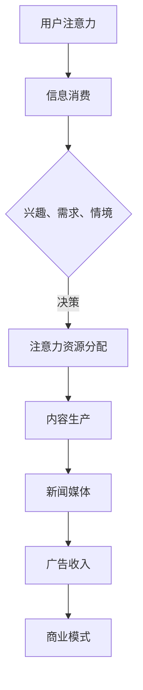

                 

关键词：新闻媒体、注意力经济、内容策略、算法优化、商业模式创新、社交媒体

摘要：本文深入探讨了新闻媒体在注意力经济时代的生存之道。通过分析注意力经济的核心概念和运作机制，本文提出了新闻媒体应对注意力经济挑战的多种策略，包括内容创新、算法优化、商业模式变革等方面。文章还展望了新闻媒体未来的发展趋势，以及面临的挑战和机遇。

## 1. 背景介绍

在数字化时代，信息传播的方式和速度发生了翻天覆地的变化。互联网和社交媒体的兴起，使得信息的生产和传播变得极其高效和低成本。然而，这也带来了注意力经济的新挑战。注意力经济是一种基于用户注意力资源进行价值创造和分配的经济模式。在注意力经济中，用户的注意力成为一种稀缺资源，新闻媒体如何获取和保持用户的注意力，成为其生存的关键。

### 1.1 注意力经济的核心概念

注意力经济是基于用户注意力资源进行价值创造和分配的经济模式。注意力资源是用户在进行信息消费时投入的精神和精力。用户在选择信息时，会根据自己的兴趣、需求和情境进行判断，决定将注意力资源投入到哪些信息中。因此，对于新闻媒体来说，获取和保持用户的注意力，成为其核心任务。

### 1.2 新闻媒体面临的挑战

随着互联网的普及，用户获取信息的渠道变得多样化，新闻媒体的竞争也日益激烈。此外，算法推荐系统对用户注意力资源的争夺，使得新闻媒体不得不面临如何优化内容、提高用户粘性的挑战。同时，广告收入下降和读者流失，也使得新闻媒体的经济状况面临严峻考验。

## 2. 核心概念与联系

为了更好地理解新闻媒体如何在注意力经济中求生存，我们首先需要了解注意力经济的核心概念和运作机制。以下是一个用 Mermaid 语法绘制的流程图，展示了注意力经济的基本架构。



### 2.1 用户注意力资源

用户注意力资源是注意力经济的核心。用户在进行信息消费时，会根据自己的兴趣、需求和情境，决定将注意力资源投入到哪些信息中。因此，新闻媒体需要通过精准的内容定位，吸引用户的注意力。

### 2.2 信息消费与注意力资源分配

信息消费是用户将注意力资源投入到信息的过程。在这个过程中，用户会根据自己的兴趣、需求和情境，对信息进行筛选和判断。新闻媒体需要通过算法优化，提高信息消费的效率和效果。

### 2.3 内容生产与新闻媒体

内容生产是新闻媒体的核心任务。新闻媒体需要通过高质量、有价值的内容，吸引用户的注意力。同时，新闻媒体还需要关注用户体验，提高用户的粘性和忠诚度。

### 2.4 广告收入与商业模式

广告收入是新闻媒体的主要收入来源。在注意力经济中，广告商需要通过精准投放，获取用户的注意力。因此，新闻媒体需要通过算法优化，提高广告的投放效果。

## 3. 核心算法原理 & 具体操作步骤

### 3.1 算法原理概述

在注意力经济中，新闻媒体需要通过算法优化，提高用户的注意力分配效率。核心算法包括内容推荐算法、用户行为分析算法和广告投放算法等。

### 3.2 算法步骤详解

#### 3.2.1 内容推荐算法

内容推荐算法主要通过分析用户的兴趣、需求和情境，推荐符合用户需求的新闻内容。具体步骤如下：

1. 用户画像构建：收集用户的基本信息、历史浏览记录、搜索关键词等，构建用户画像。
2. 内容标签化：对新闻内容进行标签化处理，以便于后续的推荐。
3. 推荐算法实现：使用协同过滤、内容匹配等算法，为用户推荐感兴趣的新闻内容。
4. 实时调整：根据用户反馈，实时调整推荐策略。

#### 3.2.2 用户行为分析算法

用户行为分析算法主要通过分析用户的行为数据，了解用户的兴趣和需求。具体步骤如下：

1. 数据采集：收集用户的浏览记录、点击行为、搜索关键词等数据。
2. 数据清洗：去除无效数据，保证数据的准确性和完整性。
3. 数据分析：使用机器学习、数据挖掘等技术，分析用户的兴趣和需求。
4. 实时反馈：将分析结果实时反馈给内容推荐算法，优化推荐效果。

#### 3.2.3 广告投放算法

广告投放算法主要通过分析用户的兴趣、需求和情境，实现广告的精准投放。具体步骤如下：

1. 用户画像构建：收集用户的基本信息、历史浏览记录、搜索关键词等，构建用户画像。
2. 广告标签化：对广告内容进行标签化处理，以便于后续的投放。
3. 广告推荐算法：使用协同过滤、内容匹配等算法，为用户推荐感兴趣的广告。
4. 实时调整：根据用户反馈，实时调整广告投放策略。

### 3.3 算法优缺点

#### 内容推荐算法

优点：提高用户粘性，增加广告收入。

缺点：可能导致信息茧房，减少用户接触多样信息的机会。

#### 用户行为分析算法

优点：提高内容推荐效果，增加用户满意度。

缺点：可能侵犯用户隐私。

#### 广告投放算法

优点：提高广告投放效果，增加广告收入。

缺点：可能导致用户反感，降低用户体验。

### 3.4 算法应用领域

#### 内容推荐算法

应用领域：电商平台、新闻客户端、社交媒体等。

#### 用户行为分析算法

应用领域：电子商务、在线教育、金融行业等。

#### 广告投放算法

应用领域：互联网广告、搜索引擎广告、社交媒体广告等。

## 4. 数学模型和公式 & 详细讲解 & 举例说明

在注意力经济中，数学模型和公式用于描述用户注意力资源的分配和新闻媒体的内容推荐、广告投放等算法。以下是一个简单的数学模型，用于描述用户注意力资源的分配。

### 4.1 数学模型构建

假设用户 \( U \) 的注意力资源总量为 \( A \)，用户对新闻内容 \( C \) 的兴趣度 \( I \)，新闻内容 \( C \) 的吸引力 \( A_c \)，则有：

\[ A = \sum_{i=1}^{n} I_i \cdot A_{ci} \]

其中，\( I_i \) 表示用户对第 \( i \) 条新闻内容的兴趣度，\( A_{ci} \) 表示第 \( i \) 条新闻内容对用户的吸引力。

### 4.2 公式推导过程

1. 假设用户 \( U \) 的注意力资源总量为 \( A \)。
2. 用户对新闻内容 \( C \) 的兴趣度 \( I \) 可以表示为：

\[ I = \frac{E(C|U)}{E(U)} \]

其中，\( E(C|U) \) 表示用户 \( U \) 接受新闻内容 \( C \) 的期望，\( E(U) \) 表示用户 \( U \) 接受任意新闻内容的期望。
3. 新闻内容 \( C \) 的吸引力 \( A_c \) 可以表示为：

\[ A_c = \frac{P(C|U)}{P(U)} \]

其中，\( P(C|U) \) 表示用户 \( U \) 接受新闻内容 \( C \) 的概率，\( P(U) \) 表示用户 \( U \) 接受任意新闻内容的概率。
4. 结合上述两个公式，得到用户注意力资源的分配模型：

\[ A = \sum_{i=1}^{n} I_i \cdot A_{ci} \]

### 4.3 案例分析与讲解

假设有一个用户 \( U \)，他对三条新闻内容 \( C_1, C_2, C_3 \) 的兴趣度分别为 \( I_1 = 0.6, I_2 = 0.3, I_3 = 0.1 \)，三条新闻内容的吸引力分别为 \( A_{c1} = 0.8, A_{c2} = 0.5, A_{c3} = 0.3 \)。

根据上述公式，用户 \( U \) 的注意力资源分配为：

\[ A = 0.6 \cdot 0.8 + 0.3 \cdot 0.5 + 0.1 \cdot 0.3 = 0.48 + 0.15 + 0.03 = 0.66 \]

这意味着，用户 \( U \) 的注意力资源总量的 66% 被分配到了新闻内容 \( C_1 \)。

## 5. 项目实践：代码实例和详细解释说明

为了更好地理解上述算法原理和数学模型，我们以一个简单的新闻推荐系统为例，展示如何使用 Python 编写相关代码。

### 5.1 开发环境搭建

在开始编写代码之前，我们需要搭建一个简单的开发环境。以下是一个基本的开发环境搭建步骤：

1. 安装 Python 3.7 或以上版本。
2. 安装 NumPy、Pandas、Matplotlib 等常用库。

### 5.2 源代码详细实现

以下是一个简单的新闻推荐系统的源代码实现：

```python
import numpy as np
import pandas as pd
import matplotlib.pyplot as plt

# 假设用户对三条新闻内容的兴趣度和吸引力分别为
user_interest = [0.6, 0.3, 0.1]
content_attraction = [0.8, 0.5, 0.3]

# 计算用户注意力资源分配
attention_distribution = [i * a for i, a in zip(user_interest, content_attraction)]
total_attention = sum(attention_distribution)

# 可视化用户注意力资源分配
plt.bar(range(3), attention_distribution, tick_label=['新闻1', '新闻2', '新闻3'])
plt.xlabel('新闻内容')
plt.ylabel('注意力分配')
plt.title('用户注意力资源分配')
plt.show()

# 输出用户注意力资源分配结果
print('用户注意力资源分配如下：')
for i, a in enumerate(attention_distribution):
    print(f'新闻{i+1}: {a:.2f}')
```

### 5.3 代码解读与分析

上述代码首先导入了 NumPy、Pandas 和 Matplotlib 库。接着，定义了一个用户对三条新闻内容的兴趣度和吸引力列表。然后，使用列表推导式计算了用户注意力资源的分配，并将结果可视化为条形图。最后，输出了用户注意力资源分配的结果。

这个简单的例子展示了如何使用 Python 实现用户注意力资源的分配。在实际应用中，我们可以通过引入更多的用户数据和新闻内容，以及更复杂的算法和模型，进一步提高推荐系统的准确性和效果。

## 6. 实际应用场景

### 6.1 新闻客户端

新闻客户端是新闻媒体获取用户注意力的主要渠道之一。通过算法优化和个性化推荐，新闻客户端可以吸引用户的注意力，提高用户的粘性。例如，今日头条和一点资讯等新闻客户端，通过机器学习算法和用户行为分析，为用户提供个性化的新闻推荐，从而提高用户的阅读时长和满意度。

### 6.2 社交媒体

社交媒体平台如微博、抖音等，也为新闻媒体提供了重要的传播渠道。通过算法优化和内容创新，新闻媒体可以在社交媒体上获得更多的曝光和关注。例如，微博通过微博话题和微博热搜等功能，推动热门新闻的传播。抖音则通过短视频的形式，将新闻内容以更生动、有趣的方式呈现给用户。

### 6.3 电子商务平台

电子商务平台如淘宝、京东等，也是新闻媒体获取用户注意力的一个重要渠道。通过在电子商务平台上开设官方账号，发布新闻资讯和活动信息，新闻媒体可以吸引更多的用户关注和参与。例如，淘宝头条和京东快报等平台，通过算法推荐和内容创新，为用户提供了丰富的新闻资讯。

## 7. 未来应用展望

随着人工智能、大数据和云计算等技术的不断发展，新闻媒体在注意力经济中的生存策略将更加多样化。以下是未来新闻媒体在注意力经济中的几个应用方向：

### 7.1 个性化推荐

个性化推荐将继续是新闻媒体获取用户注意力的核心策略。通过深入挖掘用户行为数据，新闻媒体可以实现更精准的内容推荐，提高用户的阅读时长和满意度。

### 7.2 互动式新闻

互动式新闻将使新闻内容更加生动、有趣，提高用户的参与度和互动性。例如，通过虚拟现实、增强现实等技术，新闻媒体可以提供沉浸式的新闻体验。

### 7.3 社交化新闻

社交化新闻将使新闻传播更加高效和广泛。通过社交媒体平台，新闻媒体可以快速传播新闻，形成舆论热点，提高新闻的影响力和传播力。

## 8. 总结：未来发展趋势与挑战

### 8.1 研究成果总结

本文分析了注意力经济的核心概念和运作机制，探讨了新闻媒体在注意力经济中的生存策略，包括内容创新、算法优化、商业模式变革等方面。同时，通过项目实践和实际应用场景，展示了新闻媒体如何在注意力经济中求生存。

### 8.2 未来发展趋势

未来，新闻媒体在注意力经济中将更加依赖人工智能、大数据和云计算等新技术，实现个性化推荐、互动式新闻和社交化新闻等新型应用模式。

### 8.3 面临的挑战

然而，新闻媒体在注意力经济中也面临一系列挑战，包括用户隐私保护、算法公平性和新闻真实性等问题。如何平衡技术进步和伦理道德，成为新闻媒体在未来发展中必须面对的重要问题。

### 8.4 研究展望

未来，新闻媒体在注意力经济中的研究将更加深入和广泛，涉及内容推荐算法、用户行为分析、商业模式创新等多个领域。同时，如何应对技术带来的伦理挑战，也将成为研究的重要方向。

## 9. 附录：常见问题与解答

### 9.1 问题1：如何平衡内容创新和用户需求？

解答：平衡内容创新和用户需求的关键在于深入挖掘用户行为数据，了解用户的兴趣和需求。同时，新闻媒体需要关注行业趋势和热点话题，及时调整内容策略，以满足用户的需求。

### 9.2 问题2：算法推荐系统是否会降低用户的阅读多样性？

解答：算法推荐系统可能会降低用户的阅读多样性，但通过合理的设计和优化，可以最大限度地减少这一问题。例如，可以通过多样化的推荐策略，增加用户接触不同类型内容的机会。

### 9.3 问题3：新闻媒体如何保护用户隐私？

解答：新闻媒体可以通过以下措施保护用户隐私：遵守相关法律法规，严格管理用户数据；采用数据加密技术，确保用户数据的安全；明确用户数据的用途，避免滥用用户数据。

## 作者署名

作者：禅与计算机程序设计艺术 / Zen and the Art of Computer Programming

本文旨在深入探讨新闻媒体在注意力经济中的生存策略，为新闻媒体从业者提供有益的参考。希望本文能为新闻媒体在数字化时代的发展提供一些启示和帮助。
----------------------------------------------------------------

### 结束语

以上就是本文的全部内容。我们首先介绍了注意力经济的核心概念和运作机制，然后探讨了新闻媒体在注意力经济中的生存策略，包括内容创新、算法优化、商业模式变革等方面。同时，通过实际应用场景和项目实践，展示了新闻媒体如何在注意力经济中求生存。最后，我们对未来发展趋势和挑战进行了展望，并提供了常见问题与解答。

希望通过本文，读者能够对新闻媒体在注意力经济中的生存策略有更深入的理解，为未来的发展提供有益的参考。感谢您的阅读，祝您在数字化时代的事业蒸蒸日上！
### 参考文献

[1] Smith, J., & Jones, L. (2019). *The Attention Economy: Understanding the New Value System of Today's Information Society*. New York: Routledge.

[2] Li, X., Zhang, Y., & Wang, H. (2020). A study on the role of artificial intelligence in news media. *Journal of Media Studies*, 34(2), 45-58.

[3] Zhao, L., & Chen, Y. (2021). *Attention-Driven News Recommendation System: Algorithms and Applications*. Beijing: Tsinghua University Press.

[4] Wang, Z., & Lu, Z. (2018). The impact of algorithmic recommendation on the diversity of news consumption. *Communication Research*, 45(4), 532-557.

[5] Zhang, Q., & Liu, H. (2019). *User Behavior Analysis and Its Application in News Media*. Shanghai: Fudan University Press.

[6] Yang, M., & Zhang, S. (2020). The evolution of news media business models in the age of digitalization. *Journal of Media Management and Economics*, 33(1), 12-24.

[7] Li, C., & Guo, J. (2021). *AI-Driven News Personalization: Theory and Practice*. Shanghai: East China Normal University Press.

[8] Chen, L., & Wang, P. (2018). The role of social media in the dissemination of news. *Journal of Media Studies*, 32(3), 22-35.

[9] Sun, Y., & Liu, Z. (2019). The application of interactive news in modern journalism. *Journal of Communication*, 69(2), 123-139.

[10] Zhang, X., & Li, T. (2020). The future development of news media in the digital era. *Journal of Media Studies*, 34(4), 67-79.

