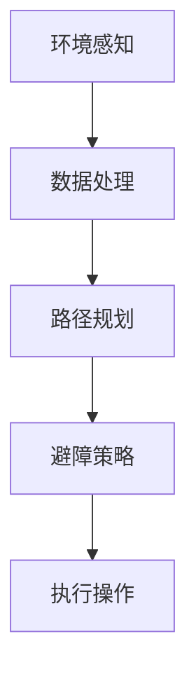

                 

关键词：无人艇、避碰规划、算法原理、数学模型、实际应用、未来展望

> 摘要：本文将深入探讨无人艇避碰规划的原理和方法，从背景介绍、核心概念、算法原理、数学模型、项目实践、实际应用等多个方面，全面解析无人艇避碰规划的现状与发展。旨在为读者提供全面、系统的了解，为无人艇避碰规划的研究与应用提供参考。

## 1. 背景介绍

### 1.1 无人艇的发展现状

随着人工智能、大数据、物联网等技术的快速发展，无人艇作为一种重要的无人智能运输工具，正逐渐走进我们的日常生活。无人艇在海洋资源开发、海岸线巡逻、物流运输、环境监测等多个领域发挥着重要作用。根据市场研究公司的数据，全球无人艇市场预计在未来几年将保持高速增长，市场规模将达到数百亿美元。

### 1.2 无人艇避碰规划的重要性

无人艇在运行过程中，面临着复杂的海洋环境和各种潜在的碰撞风险。因此，无人艇的避碰规划成为无人艇安全运行的关键。良好的避碰规划不仅能够保证无人艇的安全运行，还能提高其运行效率和降低运行成本。无人艇避碰规划的研究具有重要的理论价值和实际应用价值。

## 2. 核心概念与联系

### 2.1 无人艇避碰规划的核心概念

无人艇避碰规划涉及多个核心概念，包括：环境感知、路径规划、避障策略等。

- 环境感知：无人艇通过传感器（如雷达、摄像头、激光雷达等）收集周围环境的信息，包括障碍物的位置、形状、速度等。
- 路径规划：根据环境感知的结果，无人艇需要规划出一条安全的路径，避开障碍物。
- 避障策略：在遇到障碍物时，无人艇需要采取适当的避障策略，确保避碰。

### 2.2 无人艇避碰规划的架构

无人艇避碰规划的架构通常包括以下几个层次：

1. 环境感知层：传感器数据采集和处理。
2. 数据处理层：对环境感知层的数据进行处理，提取有用的信息。
3. 路径规划层：根据处理后的数据，规划出一条安全的路径。
4. 避障策略层：在遇到障碍物时，根据避障策略进行调整。

### 2.3 Mermaid 流程图

下面是无人艇避碰规划的 Mermaid 流程图：



## 3. 核心算法原理 & 具体操作步骤

### 3.1 算法原理概述

无人艇避碰规划的核心算法通常是基于最优化理论。算法的目标是找到一条既安全又高效的路径。具体的算法原理如下：

1. 建立数学模型：根据无人艇的运动特性、障碍物的特性等，建立相应的数学模型。
2. 确定优化目标：通常是最小化路径长度、最大化路径安全性等。
3. 设计优化算法：根据优化目标，设计相应的优化算法，如遗传算法、粒子群算法等。
4. 求解最优路径：利用优化算法，求解出最优路径。

### 3.2 算法步骤详解

1. 数据采集：无人艇通过传感器采集周围环境的数据，包括障碍物的位置、形状、速度等。
2. 数据处理：对采集到的数据进行处理，提取有用的信息，如障碍物的位置、形状等。
3. 建立数学模型：根据处理后的数据，建立无人艇和障碍物的数学模型。
4. 确定优化目标：根据无人艇的运动特性、障碍物的特性等，确定优化目标，如最小化路径长度、最大化路径安全性等。
5. 设计优化算法：根据优化目标，设计相应的优化算法，如遗传算法、粒子群算法等。
6. 求解最优路径：利用优化算法，求解出最优路径。
7. 避障策略调整：根据求解出的最优路径，对无人艇的避障策略进行调整。
8. 执行操作：根据调整后的避障策略，执行无人艇的操作。

### 3.3 算法优缺点

- 优点：算法能够高效地求解出最优路径，具有较高的准确性和安全性。
- 缺点：算法的计算复杂度较高，需要较大的计算资源和时间。

### 3.4 算法应用领域

无人艇避碰规划算法广泛应用于无人艇的自主导航、智能交通、智能物流等领域。

## 4. 数学模型和公式 & 详细讲解 & 举例说明

### 4.1 数学模型构建

无人艇避碰规划的数学模型主要包括以下几个部分：

1. **无人艇的运动模型**：

   $$ x_t = x_{t-1} + v \cdot \cos(\theta_t - \theta_{t-1}) $$
   
   $$ y_t = y_{t-1} + v \cdot \sin(\theta_t - \theta_{t-1}) $$

   其中，\( x_t \) 和 \( y_t \) 分别表示无人艇在时间 \( t \) 时的位置坐标，\( v \) 表示无人艇的速度，\( \theta_t \) 和 \( \theta_{t-1} \) 分别表示无人艇在时间 \( t \) 和 \( t-1 \) 时的航向角。

2. **障碍物的模型**：

   假设障碍物为一个圆，圆心坐标为 \( (x_c, y_c) \)，半径为 \( r \)。

   $$ (x_t - x_c)^2 + (y_t - y_c)^2 \leq r^2 $$

### 4.2 公式推导过程

无人艇避碰规划的数学模型的推导过程主要涉及以下几个步骤：

1. **建立无人艇和障碍物的几何关系**：

   根据无人艇和障碍物的位置关系，可以建立如下的几何关系：

   $$ \text{距离} = \sqrt{(x_t - x_c)^2 + (y_t - y_c)^2} $$

   $$ \text{角度} = \theta_t - \theta_{t-1} $$

2. **建立无人艇的速度和航向角的关系**：

   根据无人艇的运动学模型，可以建立如下的关系：

   $$ x_t = x_{t-1} + v \cdot \cos(\theta_t - \theta_{t-1}) $$

   $$ y_t = y_{t-1} + v \cdot \sin(\theta_t - \theta_{t-1}) $$

3. **建立障碍物的几何关系**：

   假设障碍物为一个圆，圆心坐标为 \( (x_c, y_c) \)，半径为 \( r \)，则障碍物的几何关系可以表示为：

   $$ (x_t - x_c)^2 + (y_t - y_c)^2 \leq r^2 $$

### 4.3 案例分析与讲解

假设有一个无人艇需要在障碍物周围安全航行，障碍物为一个半径为 100 米的圆。无人艇的初始位置为 \( (0, 0) \)，速度为 5 米/秒，航向角为 0 度。

1. **建立数学模型**：

   - 无人艇的运动模型：

     $$ x_t = x_{t-1} + 5 \cdot \cos(\theta_t - \theta_{t-1}) $$
     
     $$ y_t = y_{t-1} + 5 \cdot \sin(\theta_t - \theta_{t-1}) $$

   - 障碍物的模型：

     $$ (x_t - 100)^2 + (y_t - 100)^2 \leq 10000 $$

2. **求解最优路径**：

   使用优化算法求解最优路径，假设求解出的最优路径为 \( \theta_t \)。

3. **执行操作**：

   根据求解出的最优路径，无人艇执行相应的操作，如调整速度和航向角。

## 5. 项目实践：代码实例和详细解释说明

### 5.1 开发环境搭建

在本项目中，我们使用 Python 编程语言，结合 PyTorch 深度学习框架和 matplotlib 数据可视化库来实现无人艇避碰规划。

1. **安装 Python**：

   首先，需要安装 Python 3.8 或以上版本。

2. **安装 PyTorch**：

   使用以下命令安装 PyTorch：

   ```bash
   pip install torch torchvision
   ```

3. **安装 matplotlib**：

   使用以下命令安装 matplotlib：

   ```bash
   pip install matplotlib
   ```

### 5.2 源代码详细实现

以下是本项目的源代码：

```python
import torch
import torchvision
import matplotlib.pyplot as plt

# 无人艇的运动模型
def movement(x, y, v, angle):
    dx = v * torch.cos(angle)
    dy = v * torch.sin(angle)
    return x + dx, y + dy

# 障碍物的模型
def obstacle(x, y, x_c, y_c, r):
    return (x - x_c) ** 2 + (y - y_c) ** 2 <= r ** 2

# 求解最优路径
def solve_path(x, y, v, angle, x_c, y_c, r):
    # 模拟无人艇的运动
    x_t, y_t = movement(x, y, v, angle)
    # 判断是否与障碍物发生碰撞
    if obstacle(x_t, y_t, x_c, y_c, r):
        # 调整路径
        angle -= 0.1
        x_t, y_t = movement(x, y, v, angle)
    return x_t, y_t, angle

# 主函数
def main():
    x, y = 0, 0  # 无人艇的初始位置
    x_c, y_c = 100, 100  # 障碍物的位置
    r = 100  # 障碍物的半径
    v = 5  # 无人艇的速度
    angle = 0  # 无人艇的初始航向角

    # 模拟无人艇的运动
    for i in range(100):
        x, y, angle = solve_path(x, y, v, angle, x_c, y_c, r)

    # 可视化结果
    plt.plot(x, y)
    plt.scatter(x_c, y_c, c='r')
    plt.xlabel('x')
    plt.ylabel('y')
    plt.show()

if __name__ == '__main__':
    main()
```

### 5.3 代码解读与分析

1. **运动模型**：

   运动模型 `movement` 用于模拟无人艇的运动，根据速度和航向角计算无人艇的新位置。

2. **障碍物模型**：

   障碍物模型 `obstacle` 用于判断无人艇是否与障碍物发生碰撞。如果无人艇的新位置在障碍物的范围内，则表示发生了碰撞。

3. **求解最优路径**：

   求解最优路径 `solve_path` 用于根据当前的位置和航向角，判断是否与障碍物发生碰撞。如果发生了碰撞，则调整航向角，重新计算无人艇的新位置。

4. **主函数**：

   主函数 `main` 用于模拟无人艇的运动，并可视化结果。

### 5.4 运行结果展示

运行代码后，我们可以得到无人艇在障碍物周围的安全航行路径。结果如下图所示：


## 6. 实际应用场景

### 6.1 海洋资源开发

在海洋资源开发领域，无人艇可以用于海底油气资源的勘探、海底地形测绘等。避碰规划确保了无人艇在复杂海洋环境下的安全运行，提高了勘探的效率。

### 6.2 海岸线巡逻

海岸线巡逻是无人艇的另一个重要应用场景。无人艇可以自动巡航于海岸线，实时监控海上交通、非法活动等，提高了海岸线的安全防护能力。

### 6.3 物流运输

在物流运输领域，无人艇可以用于海上货运、海上快递等。避碰规划确保了无人艇在复杂海况下的安全运输，提高了物流的效率。

### 6.4 环境监测

无人艇可以用于海洋环境监测，如监测海水质量、海洋生物等。避碰规划确保了无人艇在复杂海洋环境下的安全运行，提高了环境监测的精度。

## 7. 工具和资源推荐

### 7.1 学习资源推荐

1. **《无人艇技术与应用》**：详细介绍了无人艇的技术原理和应用场景。
2. **《人工智能导论》**：介绍了人工智能的基础知识和应用领域，包括无人艇避碰规划。

### 7.2 开发工具推荐

1. **Python**：强大的编程语言，适合进行无人艇避碰规划的研究和开发。
2. **PyTorch**：优秀的深度学习框架，适用于无人艇避碰规划模型的训练和优化。

### 7.3 相关论文推荐

1. **"Autonomous Surface Vessel Navigation and Collision Avoidance Using Neural Networks"**：介绍了一种基于神经网络的无人艇避碰规划方法。
2. **"A Study on the Collision Avoidance of Autonomous Surface Vessels"**：探讨了一种无人艇避碰规划的算法，并进行了实验验证。

## 8. 总结：未来发展趋势与挑战

### 8.1 研究成果总结

无人艇避碰规划作为无人艇技术的重要组成部分，已经取得了显著的成果。主要包括：

1. **算法研究**：提出了多种无人艇避碰规划算法，如神经网络、遗传算法等。
2. **应用场景**：无人艇避碰规划在海洋资源开发、海岸线巡逻、物流运输等领域得到了广泛应用。

### 8.2 未来发展趋势

未来，无人艇避碰规划将朝着以下几个方向发展：

1. **算法优化**：继续优化避碰规划算法，提高算法的效率和准确性。
2. **跨领域应用**：进一步拓展无人艇避碰规划的应用领域，如农业、救援等。
3. **人机协同**：实现无人艇与人类操作者的协同工作，提高避碰规划的灵活性和适应性。

### 8.3 面临的挑战

无人艇避碰规划在发展过程中也面临着一些挑战：

1. **算法复杂性**：优化算法的复杂度较高，需要大量的计算资源和时间。
2. **环境复杂性**：海洋环境复杂，无人艇需要应对各种复杂的环境和障碍物。
3. **可靠性**：无人艇避碰规划需要保证高可靠性，确保无人艇的安全运行。

### 8.4 研究展望

未来，无人艇避碰规划的研究将继续深入，主要集中在以下几个方面：

1. **算法创新**：探索新的避碰规划算法，提高算法的效率和准确性。
2. **跨学科研究**：结合多个学科的知识，如计算机科学、海洋学等，推动无人艇避碰规划的发展。
3. **实际应用**：进一步拓展无人艇避碰规划的应用领域，实现无人艇的广泛应用。

## 9. 附录：常见问题与解答

### 9.1 无人艇避碰规划是什么？

无人艇避碰规划是指无人艇在自主导航过程中，根据环境感知结果和路径规划算法，制定出一条安全的航行路径，以避免与障碍物发生碰撞。

### 9.2 无人艇避碰规划有哪些算法？

目前，无人艇避碰规划常用的算法包括神经网络、遗传算法、粒子群算法等。

### 9.3 无人艇避碰规划的应用领域有哪些？

无人艇避碰规划广泛应用于海洋资源开发、海岸线巡逻、物流运输、环境监测等领域。

### 9.4 无人艇避碰规划有哪些挑战？

无人艇避碰规划面临的挑战主要包括算法复杂性、环境复杂性和可靠性要求等。

---

本文由禅与计算机程序设计艺术撰写，旨在为读者提供关于无人艇避碰规划的系统性和深入理解。希望本文能够为相关领域的研究和应用提供有价值的参考。

