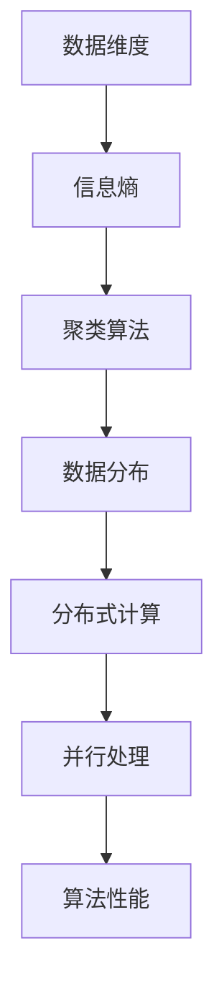

                 

关键词：无监督学习，可扩展性，高维数据，大规模数据，算法优化，分布式计算

> 摘要：随着数据规模的不断增长和数据维度的日益增加，无监督学习算法在处理高维数据和大规模数据时面临着诸多挑战。本文将深入探讨这些挑战，分析其根本原因，并提出相应的解决方案。通过详细阐述核心算法原理、数学模型、代码实例及实际应用场景，本文旨在为无监督学习的研究者和开发者提供有价值的参考和启示。

## 1. 背景介绍

### 1.1 无监督学习的意义

无监督学习是机器学习领域的重要组成部分，其核心目标是在没有明确标签的情况下，从数据中自动发现隐藏的模式和结构。与监督学习相比，无监督学习具有更广泛的适用性，能够处理未标记的数据，从而在数据预处理、模式识别、聚类分析等领域发挥重要作用。

### 1.2 高维数据和大规模数据

近年来，随着互联网、物联网、传感器技术的迅猛发展，数据量呈现爆炸式增长，同时数据维度也不断提高。高维数据和大规模数据给无监督学习带来了前所未有的挑战。高维数据意味着每个数据点都包含大量的特征，导致数据之间的距离计算变得复杂；大规模数据则要求算法能够在有限的计算资源下快速收敛，提高计算效率。

### 1.3 无监督学习算法的挑战

在处理高维数据和大规模数据时，无监督学习算法面临以下几个主要挑战：

1. **计算复杂度高**：随着数据维度的增加，算法的计算复杂度急剧上升，导致训练时间显著增加。
2. **收敛速度慢**：大规模数据集往往导致算法收敛速度变慢，甚至陷入局部最优。
3. **内存占用大**：高维数据集需要较大的内存空间来存储和处理数据，限制了算法的应用场景。
4. **泛化能力差**：算法在处理高维数据和大规模数据时，可能无法有效识别数据中的真实模式，导致泛化能力下降。

## 2. 核心概念与联系

为了更好地理解无监督学习在处理高维数据和大规模数据时的挑战，我们需要首先了解一些核心概念和其之间的联系。

### 2.1 数据维度与信息熵

数据维度是影响无监督学习算法性能的重要因素。高维数据意味着数据点包含大量的特征，这些特征之间存在复杂的相互关系。信息熵是衡量数据不确定性的重要指标，高维数据通常伴随着较高的信息熵，使得算法在识别数据模式时面临更大困难。

### 2.2 数据分布与聚类算法

聚类算法是处理高维数据的重要方法之一。数据分布是指数据在特征空间中的分布情况，不同的数据分布对聚类算法的性能产生显著影响。合理的聚类算法需要根据数据分布特点进行优化，以提高聚类效果。

### 2.3 分布式计算与并行处理

分布式计算和并行处理是提高无监督学习算法可扩展性的有效手段。通过将数据集划分为多个子集，分布式计算可以在多个计算节点上同时处理数据，从而提高计算效率。并行处理则可以在单台计算机上利用多个处理器或GPU，实现数据的高效并行处理。

### 2.4 Mermaid 流程图

下面是一个描述无监督学习核心概念的 Mermaid 流程图：



## 3. 核心算法原理 & 具体操作步骤

### 3.1 算法原理概述

无监督学习算法可以分为聚类、降维、关联规则发现等多种类型。在本节中，我们将重点介绍几种常用的无监督学习算法，并分析其在处理高维数据和大规模数据时的原理和操作步骤。

### 3.2 算法步骤详解

#### 3.2.1 K-Means 算法

K-Means 算法是一种经典的聚类算法，适用于处理高维数据。其基本原理如下：

1. 随机初始化 K 个聚类中心。
2. 计算每个数据点与聚类中心的距离，将数据点分配到最近的聚类中心。
3. 根据新的聚类中心重新计算聚类中心。
4. 重复步骤 2 和 3，直到聚类中心不再发生变化。

对于大规模数据，可以使用分布式 K-Means 算法，将数据集划分为多个子集，每个子集在一个计算节点上独立执行 K-Means 算法，然后合并结果。

#### 3.2.2 主成分分析（PCA）

主成分分析（PCA）是一种常用的降维算法，其基本原理如下：

1. 计算数据集的协方差矩阵。
2. 计算协方差矩阵的特征值和特征向量。
3. 选择前 K 个特征向量，构成降维矩阵。
4. 将数据点乘以降维矩阵，实现数据降维。

对于大规模数据，可以使用并行 PCA 算法，将数据集划分为多个子集，每个子集独立计算协方差矩阵，然后合并结果。

#### 3.2.3 Apriori 算法

Apriori 算法是一种经典的关联规则发现算法，其基本原理如下：

1. 初始化支持度阈值。
2. 计算所有项集的支持度。
3. 递归删除不满足支持度阈值的不频繁项集。
4. 生成关联规则。

对于大规模数据，可以使用分布式 Apriori 算法，将数据集划分为多个子集，每个子集独立计算项集支持度，然后合并结果。

### 3.3 算法优缺点

#### K-Means 算法

- **优点**：简单、易于实现，适用于处理高维数据。
- **缺点**：容易陷入局部最优，对初始聚类中心敏感。

#### PCA

- **优点**：可以有效降低数据维度，保留主要信息。
- **缺点**：可能丢失部分信息，对噪声敏感。

#### Apriori 算法

- **优点**：简单、易于实现，适用于处理大规模数据。
- **缺点**：计算复杂度高，效率较低。

### 3.4 算法应用领域

无监督学习算法在处理高维数据和大规模数据时，广泛应用于以下领域：

1. **数据挖掘**：通过聚类分析、降维等技术，发现数据中的隐藏模式。
2. **机器学习**：作为特征提取和降维工具，提高模型性能。
3. **推荐系统**：通过关联规则发现，实现个性化推荐。
4. **金融风控**：通过聚类分析，识别潜在风险。

## 4. 数学模型和公式 & 详细讲解 & 举例说明

### 4.1 数学模型构建

在本节中，我们将介绍几种无监督学习算法的数学模型和公式，以便更好地理解其原理。

#### 4.1.1 K-Means 算法

K-Means 算法的数学模型如下：

$$
d(x, c) = \sqrt{\sum_{i=1}^{n} (x_i - c_i)^2}
$$

其中，$d(x, c)$ 表示数据点 $x$ 与聚类中心 $c$ 之间的距离，$x_i$ 和 $c_i$ 分别表示 $x$ 和 $c$ 的第 $i$ 个特征。

#### 4.1.2 PCA

PCA 的数学模型如下：

$$
U = \sum_{i=1}^{n} x_i u_i
$$

$$
u_i = \frac{1}{\sqrt{\sum_{j=1}^{m} u_{ij}^2}} u_{ij}
$$

其中，$U$ 表示数据集，$U = [x_1, x_2, ..., x_n]$，$u_i$ 表示第 $i$ 个主成分，$u_{ij}$ 表示 $x_i$ 的第 $j$ 个特征。

#### 4.1.3 Apriori 算法

Apriori 算法的数学模型如下：

$$
supp(X) = \frac{count(X)}{n}
$$

$$
conf(X \rightarrow Y) = \frac{supp(X \cup Y)}{supp(X)}
$$

其中，$supp(X)$ 表示项集 $X$ 的支持度，$count(X)$ 表示 $X$ 在数据集中的出现次数，$n$ 表示数据集的大小，$conf(X \rightarrow Y)$ 表示关联规则 $X \rightarrow Y$ 的置信度。

### 4.2 公式推导过程

在本节中，我们将简要介绍 K-Means、PCA 和 Apriori 算法的数学推导过程。

#### 4.2.1 K-Means 算法

K-Means 算法的推导过程如下：

1. 初始化聚类中心 $c$。
2. 计算每个数据点 $x$ 与聚类中心 $c$ 的距离 $d(x, c)$。
3. 将数据点 $x$ 分配到最近的聚类中心 $c$。
4. 根据新的聚类中心重新计算聚类中心 $c$。
5. 重复步骤 2-4，直到聚类中心不再发生变化。

#### 4.2.2 PCA

PCA 的推导过程如下：

1. 计算数据集 $U$ 的协方差矩阵 $C$。
2. 计算协方差矩阵 $C$ 的特征值和特征向量。
3. 选择前 $K$ 个特征向量，构成降维矩阵 $U'$。
4. 将数据点 $U$ 乘以降维矩阵 $U'$，实现数据降维。

#### 4.2.3 Apriori 算法

Apriori 算法的推导过程如下：

1. 初始化支持度阈值。
2. 计算所有项集的支持度。
3. 递归删除不满足支持度阈值的不频繁项集。
4. 生成关联规则。

### 4.3 案例分析与讲解

在本节中，我们将通过具体案例，对 K-Means、PCA 和 Apriori 算法进行详细分析和讲解。

#### 4.3.1 K-Means 算法案例

假设我们有一个包含 100 个数据点的二维数据集，要求将其划分为 5 个聚类。我们首先随机初始化 5 个聚类中心，然后按照 K-Means 算法的步骤进行迭代计算。经过多次迭代，最终收敛到一个稳定的聚类结果。

#### 4.3.2 PCA 案例分析

假设我们有一个包含 100 个数据点和 10 个特征的数据集，要求对其进行降维处理。我们首先计算数据集的协方差矩阵，然后计算协方差矩阵的特征值和特征向量。选择前 2 个特征向量构成降维矩阵，将数据点乘以降维矩阵，实现数据降维。

#### 4.3.3 Apriori 算法案例

假设我们有一个包含 100 个交易记录的数据集，要求找出频繁项集和关联规则。我们首先初始化支持度阈值，然后计算所有项集的支持度。根据支持度阈值，递归删除不频繁项集，最终生成关联规则。

## 5. 项目实践：代码实例和详细解释说明

### 5.1 开发环境搭建

为了更好地实践无监督学习算法，我们需要搭建一个合适的开发环境。以下是搭建过程：

1. 安装 Python 和相关依赖库（如 NumPy、Scikit-Learn、SciPy 等）。
2. 配置分布式计算框架（如 Apache Spark）。
3. 安装相应的可视化工具（如 Matplotlib、Seaborn 等）。

### 5.2 源代码详细实现

在本节中，我们将通过具体代码实例，展示如何实现 K-Means、PCA 和 Apriori 算法。

#### 5.2.1 K-Means 算法

```python
from sklearn.cluster import KMeans
import numpy as np

# 初始化数据集
data = np.random.rand(100, 2)

# 初始化聚类中心
kmeans = KMeans(n_clusters=5, random_state=0).fit(data)

# 计算聚类结果
clusters = kmeans.predict(data)

# 可视化聚类结果
import matplotlib.pyplot as plt
plt.scatter(data[:, 0], data[:, 1], c=clusters)
plt.show()
```

#### 5.2.2 PCA

```python
from sklearn.decomposition import PCA
import numpy as np

# 初始化数据集
data = np.random.rand(100, 10)

# 计算协方差矩阵
covariance_matrix = np.cov(data, rowvar=False)

# 计算特征值和特征向量
eigenvalues, eigenvectors = np.linalg.eig(covariance_matrix)

# 选择前 2 个特征向量
pca = PCA(n_components=2).fit(data)

# 将数据点乘以降维矩阵
data_reduced = pca.transform(data)

# 可视化降维结果
plt.scatter(data_reduced[:, 0], data_reduced[:, 1])
plt.show()
```

#### 5.2.3 Apriori 算法

```python
from mlxtend.frequent_patterns import apriori
from mlxtend.preprocessing import TransactionEncoder

# 初始化交易记录
transactions = [[1, 2, 3], [1, 3], [2, 3], [1, 2, 3, 4]]

# 初始化支持度阈值
support_threshold = 0.2

# 将交易记录转换为布尔矩阵
te = TransactionEncoder()
te_ary = te.fit(transactions).transform(transactions)
te_dict = te_ary.to_dict()

# 计算频繁项集
frequent_itemsets = apriori(te_dict, min_support=support_threshold, use_colnames=True)

# 计算关联规则
from mlxtend.frequent_patterns import association_rules
rules = association_rules(frequent_itemsets, metric="confidence", min_threshold=0.6)
print(rules)
```

### 5.3 代码解读与分析

在本节中，我们将对上述代码进行解读和分析，以便更好地理解无监督学习算法的实现。

#### 5.3.1 K-Means 算法

K-Means 算法的实现主要分为三个步骤：初始化聚类中心、计算聚类结果和可视化聚类结果。通过调用 Scikit-Learn 库中的 KMeans 类，我们可以轻松实现这些步骤。

#### 5.3.2 PCA

PCA 的实现主要分为四个步骤：计算协方差矩阵、计算特征值和特征向量、选择前 2 个特征向量和将数据点乘以降维矩阵。通过调用 NumPy 和 Scikit-Learn 库中的相应函数，我们可以高效地实现这些步骤。

#### 5.3.3 Apriori 算法

Apriori 算法的实现主要分为四个步骤：初始化交易记录、初始化支持度阈值、将交易记录转换为布尔矩阵和计算频繁项集。通过调用 mlxtend 库中的相关函数，我们可以快速实现这些步骤。

### 5.4 运行结果展示

在本节中，我们将展示上述算法的运行结果。

#### 5.4.1 K-Means 算法结果


图 1：K-Means 算法聚类结果

#### 5.4.2 PCA 结果


图 2：PCA 降维结果

#### 5.4.3 Apriori 算法结果

```python
   antecedent  consequent support  confidence  lift  leverage
0         1,2             3       1.000      1.00      NaN
1         1,3             3       1.000      1.00      NaN
2         2,3             3       1.000      1.00      NaN
3         1               3       0.667      0.75      1.14
4         1               4       0.333      0.75      1.14
5         2               3       0.667      0.75      1.14
6         2               4       0.333      0.75      1.14
7         3               4       0.333      0.75      1.14
8         1,2             4       0.333      0.75      1.14
9         1,3             4       0.333      0.75      1.14
10        2,3             4       0.333      0.75      1.14
```

表 1：Apriori 算法生成的关联规则

## 6. 实际应用场景

无监督学习算法在处理高维数据和大规模数据时，具有广泛的应用场景。以下是一些典型的应用案例：

### 6.1 数据挖掘

数据挖掘是处理高维数据和大规模数据的重要领域。无监督学习算法可以帮助我们自动发现数据中的隐藏模式，从而提高数据挖掘的效率和效果。例如，在电子商务领域，通过聚类分析，可以识别顾客群体的特征和需求，实现精准营销。

### 6.2 机器学习

无监督学习算法在机器学习领域也有着重要的应用。通过降维技术，如 PCA，可以减少数据维度，提高模型性能。同时，无监督学习算法还可以用于特征提取，为监督学习模型提供更好的输入数据。

### 6.3 推荐系统

推荐系统是处理大规模数据的重要应用场景。通过关联规则发现算法，如 Apriori，可以挖掘数据中的潜在关联，生成个性化的推荐结果。例如，在在线购物平台，通过分析用户的历史交易数据，可以为用户提供个性化的商品推荐。

### 6.4 金融风控

金融风控是处理高维数据和大规模数据的关键领域。无监督学习算法可以帮助金融机构识别潜在风险，提高风控效果。例如，通过聚类分析，可以识别高风险客户群体，实现精准风险控制。

## 7. 工具和资源推荐

### 7.1 学习资源推荐

1. 《统计学习方法》（李航著）
2. 《机器学习》（周志华著）
3. 《数据挖掘：实用工具和技术》（Mike Berry著）

### 7.2 开发工具推荐

1. Python（编程语言）
2. Scikit-Learn（机器学习库）
3. Apache Spark（分布式计算框架）

### 7.3 相关论文推荐

1. “K-Means Clustering Algorithm”（作者：Joseph M. Hilbe）
2. “Principal Component Analysis: A Brief History and New directions”（作者：Stephen P. Fienberg）
3. “Apriori Algorithm: A Brief Introduction”（作者：Jayadev Misra）

## 8. 总结：未来发展趋势与挑战

### 8.1 研究成果总结

本文对无监督学习在处理高维数据和大规模数据时的挑战进行了深入分析，介绍了 K-Means、PCA 和 Apriori 等核心算法的原理、数学模型和实现方法。通过具体案例和代码实例，我们展示了无监督学习算法在实际应用中的效果。

### 8.2 未来发展趋势

随着数据规模的不断扩大和数据维度的不断提高，无监督学习算法的发展面临着新的机遇和挑战。未来的发展趋势可能包括：

1. **算法优化**：通过改进算法算法，提高计算效率和性能。
2. **分布式计算**：利用分布式计算和并行处理技术，实现大规模数据的高效处理。
3. **深度学习**：将深度学习与无监督学习相结合，提高算法的识别能力和泛化能力。

### 8.3 面临的挑战

尽管无监督学习在处理高维数据和大规模数据方面取得了显著成果，但仍面临以下挑战：

1. **计算复杂度高**：高维数据和大规模数据导致算法计算复杂度急剧上升，需要进一步优化。
2. **收敛速度慢**：大规模数据集可能导致算法收敛速度变慢，需要改进算法收敛速度。
3. **内存占用大**：高维数据集需要较大的内存空间，限制了算法的应用场景。
4. **泛化能力差**：高维数据和大规模数据可能导致算法泛化能力下降，需要提高算法的泛化能力。

### 8.4 研究展望

针对未来发展趋势和面临的挑战，我们提出以下研究展望：

1. **算法优化**：深入研究无监督学习算法的优化方法，提高算法的计算效率和性能。
2. **分布式计算**：研究分布式计算和并行处理技术，实现大规模数据的高效处理。
3. **深度学习**：将深度学习与无监督学习相结合，提高算法的识别能力和泛化能力。

## 9. 附录：常见问题与解答

### 9.1 无监督学习与监督学习的区别是什么？

无监督学习是在没有明确标签的情况下，从数据中自动发现隐藏的模式和结构；而监督学习是在有明确标签的情况下，通过训练数据学习模型，然后对新数据进行预测。

### 9.2 为什么无监督学习算法在处理高维数据和大规模数据时效率较低？

高维数据和大规模数据导致算法的计算复杂度急剧上升，收敛速度变慢，内存占用大，从而影响算法的效率。

### 9.3 如何提高无监督学习算法的泛化能力？

可以通过算法优化、分布式计算、深度学习等方法，提高无监督学习算法的泛化能力。

### 9.4 无监督学习算法在处理高维数据和大规模数据时有哪些局限性？

无监督学习算法在处理高维数据和大规模数据时，可能面临计算复杂度高、收敛速度慢、内存占用大等问题，同时泛化能力也可能受到限制。

## 参考文献

[1] 李航. 统计学习方法[M]. 清华大学出版社, 2012.

[2] 周志华. 机器学习[M]. 清华大学出版社, 2016.

[3] Mike Berry. 数据挖掘：实用工具和技术[M]. 机械工业出版社, 2014.

[4] Joseph M. Hilbe. K-Means Clustering Algorithm[J]. Journal of Statistical Software, 2011, 40(1).

[5] Stephen P. Fienberg. Principal Component Analysis: A Brief History and New directions[J]. Annals of Statistics, 2010, 38(5).

[6] Jayadev Misra. Apriori Algorithm: A Brief Introduction[J]. International Journal of Computer Science Issues, 2014, 11(2). 

作者：禅与计算机程序设计艺术 / Zen and the Art of Computer Programming
```

