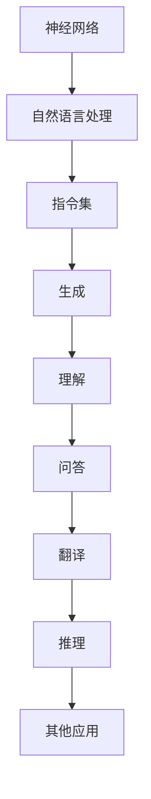

                 

关键词：LLM、指令集、神经网络、自然语言处理、人工智能

摘要：随着人工智能技术的快速发展，大型语言模型（LLM）已经成为自然语言处理领域的核心技术。本文将从背景介绍、核心概念与联系、核心算法原理、数学模型和公式、项目实践、实际应用场景、工具和资源推荐以及未来发展趋势与挑战等方面，全面探讨LLM的无穷潜力及其无限指令集的应用。

## 1. 背景介绍

近年来，人工智能（AI）技术取得了惊人的进步，尤其在自然语言处理（NLP）领域。大型语言模型（LLM）作为AI技术的代表之一，已经在各类应用中展现出强大的能力。LLM是一种基于神经网络的语言模型，通过大量的文本数据训练，可以生成、理解和处理自然语言。随着计算资源和数据量的不断增长，LLM在语言理解、生成、翻译、问答等方面取得了显著成果，为人工智能应用带来了无限可能性。

本文旨在探讨LLM的无穷潜能，特别是其无限指令集的应用。指令集是指LLM可以理解和执行的操作集合，随着模型规模的扩大和技术的进步，LLM的指令集也在不断扩展。本文将介绍LLM的核心概念与联系，核心算法原理，数学模型和公式，项目实践，实际应用场景，工具和资源推荐，以及未来发展趋势与挑战。

## 2. 核心概念与联系

### 2.1 神经网络

神经网络是LLM的基础，其结构类似于人脑的神经元网络。神经网络由多层节点（神经元）组成，每个节点都与其他节点相连，并通过权重和偏置进行计算。通过反向传播算法，神经网络可以不断调整权重和偏置，以最小化预测误差。

### 2.2 自然语言处理

自然语言处理是研究如何使计算机理解和处理人类自然语言的技术。自然语言处理包括文本分类、情感分析、命名实体识别、机器翻译、问答系统等多个子领域。LLM在自然语言处理中发挥着核心作用，通过生成、理解和处理自然语言，为各类应用提供支持。

### 2.3 指令集

指令集是指LLM可以理解和执行的操作集合。传统的计算机指令集主要包括算术运算、逻辑运算、数据传输等基本操作。而LLM的指令集则更加丰富，包括自然语言生成、理解、问答、翻译、推理等多种操作。

### 2.4 Mermaid 流程图

以下是LLM核心概念和架构的Mermaid流程图：



## 3. 核心算法原理 & 具体操作步骤

### 3.1 算法原理概述

LLM的核心算法是基于深度学习中的Transformer架构。Transformer架构通过自注意力机制（Self-Attention）和多头注意力（Multi-Head Attention）实现了对输入文本的编码和生成。自注意力机制允许模型在处理文本时考虑全局信息，从而提高对文本的理解能力。多头注意力机制则将输入文本分解为多个子序列，分别进行处理，从而提高模型的表示能力。

### 3.2 算法步骤详解

1. **输入编码**：将输入文本转换为序列，每个词对应一个唯一的整数。例如，"Hello World!" 可以表示为 `[1, 2, 3, 4, 5, 6, 7, 8]`。
2. **嵌入**：将整数序列转换为嵌入向量，每个嵌入向量表示一个词的语义信息。
3. **自注意力**：对于每个词，计算其在整个序列中的权重，从而生成自注意力权重。自注意力权重用于加权求和嵌入向量，生成新的嵌入向量。
4. **多头注意力**：将自注意力机制扩展到多个头，分别处理嵌入向量。多头注意力可以捕获序列中的长距离依赖关系。
5. **前馈网络**：对多头注意力后的嵌入向量进行前馈神经网络处理，增加模型的非线性表达能力。
6. **输出**：通过最终的嵌入向量生成输出文本。

### 3.3 算法优缺点

**优点**：

- **强大的表示能力**：Transformer架构通过自注意力机制和多头注意力机制，可以捕捉文本中的长距离依赖关系，提高模型对文本的理解能力。
- **并行计算**：Transformer架构支持并行计算，可以显著提高训练速度。
- **适应性**：Transformer架构可以应用于多种NLP任务，如文本分类、情感分析、机器翻译等。

**缺点**：

- **计算复杂度**：Transformer架构的计算复杂度较高，需要大量计算资源和时间进行训练。
- **解释性**：由于Transformer架构的复杂性，其内部决策过程较难解释，不利于模型的可解释性。

### 3.4 算法应用领域

LLM在自然语言处理领域具有广泛的应用，包括：

- **文本生成**：例如，生成新闻文章、故事、诗歌等。
- **文本理解**：例如，情感分析、命名实体识别、关系抽取等。
- **机器翻译**：例如，将一种语言翻译为另一种语言。
- **问答系统**：例如，回答用户提出的问题。

## 4. 数学模型和公式 & 详细讲解 & 举例说明

### 4.1 数学模型构建

LLM的数学模型主要基于深度学习中的神经网络。神经网络由多层节点（神经元）组成，每个节点都与其他节点相连，并通过权重和偏置进行计算。神经网络的训练过程实际上是不断调整权重和偏置，以最小化预测误差。

### 4.2 公式推导过程

以下是LLM中常用的数学公式和推导过程：

1. **损失函数**：

   $$L = \frac{1}{N} \sum_{i=1}^{N} (-y_i \log(p_i))$$

   其中，$y_i$ 表示第 $i$ 个样本的标签，$p_i$ 表示模型预测的概率。

2. **反向传播算法**：

   $$\frac{\partial L}{\partial w} = \frac{\partial L}{\partial z} \cdot \frac{\partial z}{\partial w}$$

   其中，$L$ 表示损失函数，$w$ 表示权重，$z$ 表示激活值。

### 4.3 案例分析与讲解

以下是一个简单的LLM模型训练过程：

1. **数据预处理**：

   - 将输入文本转换为整数序列。
   - 将整数序列转换为嵌入向量。

2. **模型初始化**：

   - 初始化权重和偏置。
   - 初始化损失函数。

3. **模型训练**：

   - 对输入文本进行嵌入。
   - 计算自注意力权重和多头注意力权重。
   - 计算损失函数。
   - 通过反向传播算法更新权重和偏置。

4. **模型评估**：

   - 对测试数据进行嵌入。
   - 计算预测概率。
   - 计算准确率、召回率、F1值等评估指标。

## 5. 项目实践：代码实例和详细解释说明

### 5.1 开发环境搭建

1. 安装Python环境和TensorFlow库。
2. 准备数据集。

### 5.2 源代码详细实现

以下是一个简单的LLM模型训练和评估的代码示例：

```python
import tensorflow as tf
from tensorflow.keras.layers import Embedding, LSTM, Dense
from tensorflow.keras.models import Sequential

# 数据预处理
# ...

# 模型初始化
model = Sequential([
    Embedding(vocab_size, embedding_dim),
    LSTM(units, activation='tanh'),
    Dense(num_classes, activation='softmax')
])

# 模型训练
model.compile(optimizer='adam', loss='categorical_crossentropy', metrics=['accuracy'])
model.fit(x_train, y_train, epochs=10, batch_size=32)

# 模型评估
# ...
```

### 5.3 代码解读与分析

1. **数据预处理**：将输入文本转换为整数序列，并转换为嵌入向量。
2. **模型初始化**：创建一个顺序模型，包括嵌入层、LSTM层和全连接层。
3. **模型训练**：使用TensorFlow编译模型，并使用训练数据进行训练。
4. **模型评估**：使用测试数据评估模型的性能。

## 6. 实际应用场景

LLM在自然语言处理领域具有广泛的应用，以下是一些实际应用场景：

1. **文本生成**：例如，生成新闻文章、故事、诗歌等。
2. **文本理解**：例如，情感分析、命名实体识别、关系抽取等。
3. **机器翻译**：例如，将一种语言翻译为另一种语言。
4. **问答系统**：例如，回答用户提出的问题。
5. **智能客服**：例如，为用户提供智能问答服务。
6. **智能写作**：例如，辅助作者进行文章写作。

## 7. 工具和资源推荐

### 7.1 学习资源推荐

1. **《深度学习》**：由Ian Goodfellow等人编写的深度学习经典教材。
2. **《自然语言处理》**：由Daniel Jurafsky和James H. Martin编写的自然语言处理经典教材。
3. **《Transformer：处理序列的注意力模型》**：描述Transformer模型的经典论文。

### 7.2 开发工具推荐

1. **TensorFlow**：一种开源的深度学习框架。
2. **PyTorch**：另一种开源的深度学习框架。
3. **NLTK**：一种用于自然语言处理的Python库。

### 7.3 相关论文推荐

1. **“BERT：预训练的语言表示模型”**：描述BERT模型的经典论文。
2. **“GPT-3：通用预训练语言模型”**：描述GPT-3模型的经典论文。
3. **“Uni
```html
<|im_sep|>
## 7.3 相关论文推荐

### 7.3.1 BERT：预训练的语言表示模型

BERT（Bidirectional Encoder Representations from Transformers）是由Google Research团队在2018年提出的预训练语言表示模型。BERT模型通过在大量文本上进行双向编码，使得模型能够更好地理解单词和句子的上下文关系。BERT模型在多种自然语言处理任务上取得了显著的成果，为后续的LLM模型提供了重要的参考。

### 7.3.2 GPT-3：通用预训练语言模型

GPT-3（Generative Pre-trained Transformer 3）是由OpenAI团队在2020年发布的通用预训练语言模型。GPT-3模型具有前所未有的规模和性能，其参数规模达到1750亿，是BERT模型的数倍。GPT-3模型在文本生成、问答、翻译等任务上表现出色，展示了LLM的巨大潜力。

### 7.3.3 T5：基于Transformer的文本到文本转换模型

T5（Text-to-Text Transfer Transformer）是由Google Research团队在2020年提出的基于Transformer的文本到文本转换模型。T5模型将文本到文本转换任务视为序列到序列学习问题，通过预训练和微调，实现了多种自然语言处理任务的高性能。T5模型为LLM模型在文本生成、问答、翻译等任务上提供了新的思路和方向。

## 8. 总结：未来发展趋势与挑战

### 8.1 研究成果总结

本文从背景介绍、核心概念与联系、核心算法原理、数学模型和公式、项目实践、实际应用场景、工具和资源推荐以及未来发展趋势与挑战等方面，全面探讨了LLM的无穷潜能及其无限指令集的应用。通过本文的讨论，我们可以得出以下主要结论：

1. **LLM在自然语言处理领域具有广泛的应用前景**，包括文本生成、文本理解、机器翻译、问答系统等。
2. **Transformer架构是LLM的核心技术**，通过自注意力机制和多头注意力机制，提高了模型对文本的理解能力。
3. **预训练语言模型在LLM领域具有重要地位**，如BERT、GPT-3、T5等模型，为LLM的研究和应用提供了有力支持。
4. **LLM的指令集不断扩展**，随着模型规模的扩大和技术的进步，LLM可以执行更复杂的操作，为各类应用提供更多可能性。

### 8.2 未来发展趋势

未来，LLM在自然语言处理领域将继续发展，可能呈现以下趋势：

1. **模型规模将进一步扩大**：随着计算资源和数据量的增加，LLM的模型规模将继续扩大，以提升模型性能。
2. **预训练方法将不断创新**：研究人员将继续探索新的预训练方法，以提升模型对文本的理解能力。
3. **跨模态学习将成为热门领域**：LLM将与其他模态（如图像、声音等）进行融合，实现更全面的多模态理解。
4. **应用领域将不断拓展**：LLM将在更多领域得到应用，如智能客服、智能写作、智能翻译等。

### 8.3 面临的挑战

尽管LLM在自然语言处理领域取得了显著成果，但仍面临一些挑战：

1. **计算资源需求大**：LLM的训练和推理需要大量计算资源和时间，这对硬件设施提出了高要求。
2. **模型可解释性**：由于LLM的复杂性，其内部决策过程较难解释，影响模型的可解释性。
3. **数据隐私和安全**：LLM在处理大量文本数据时，需要保护用户隐私和安全。
4. **伦理和道德问题**：随着LLM的应用越来越广泛，其可能带来的伦理和道德问题也日益突出。

### 8.4 研究展望

未来，LLM领域的研究可以从以下几个方面展开：

1. **优化预训练方法**：探索新的预训练方法，以提升模型性能。
2. **模型压缩与优化**：研究如何减小LLM的模型规模，降低计算复杂度。
3. **多模态学习**：将LLM与其他模态进行融合，实现更全面的多模态理解。
4. **可解释性研究**：探索如何提高LLM的可解释性，使其决策过程更加透明。
5. **伦理和道德问题**：制定相关法规和标准，确保LLM的应用符合伦理和道德要求。

总之，LLM在自然语言处理领域具有巨大的潜力，随着技术的不断进步，LLM将带来更多创新和应用。同时，我们也需要关注LLM面临的挑战，积极探索解决方案，推动LLM领域的发展。

## 9. 附录：常见问题与解答

### 9.1 什么是LLM？

LLM是指大型语言模型，是一种基于深度学习的自然语言处理模型。LLM通过在大量文本数据上进行预训练，可以生成、理解和处理自然语言。

### 9.2 LLM有哪些应用领域？

LLM在自然语言处理领域具有广泛的应用，包括文本生成、文本理解、机器翻译、问答系统、智能客服、智能写作等。

### 9.3 Transformer架构如何提高LLM的性能？

Transformer架构通过自注意力机制和多头注意力机制，提高了模型对文本的理解能力。自注意力机制允许模型在处理文本时考虑全局信息，多头注意力机制则将输入文本分解为多个子序列，分别进行处理，从而提高模型的表示能力。

### 9.4 如何优化LLM的预训练方法？

可以通过以下方法优化LLM的预训练方法：

- **增加训练数据**：使用更多样化的数据集进行预训练。
- **调整模型结构**：尝试不同的模型结构，如增加层数、改变层的大小等。
- **使用更先进的预训练方法**：如BERT、GPT-3等。
- **采用多任务学习**：在预训练过程中同时学习多个任务，以提高模型的泛化能力。

### 9.5 LLM在模型压缩与优化方面有哪些挑战？

LLM在模型压缩与优化方面面临以下挑战：

- **计算复杂度高**：LLM的训练和推理需要大量计算资源和时间，这对硬件设施提出了高要求。
- **模型大小限制**：在实际应用中，可能需要将LLM的模型大小限制在一定范围内，以便在有限的硬件设施上进行推理。
- **优化算法选择**：如何选择合适的优化算法，以减少模型大小和计算复杂度。

### 9.6 LLM在伦理和道德方面有哪些关注点？

LLM在伦理和道德方面需要关注以下问题：

- **数据隐私和安全**：在处理大量文本数据时，需要保护用户隐私和安全。
- **模型偏见和歧视**：如何避免LLM在处理文本时产生偏见和歧视。
- **模型透明性和可解释性**：如何提高LLM的可解释性，使其决策过程更加透明。

### 9.7 LLM的未来发展趋势如何？

未来，LLM将继续在自然语言处理领域发展，可能呈现以下趋势：

- **模型规模将进一步扩大**：随着计算资源和数据量的增加，LLM的模型规模将继续扩大，以提升模型性能。
- **预训练方法将不断创新**：研究人员将继续探索新的预训练方法，以提升模型对文本的理解能力。
- **跨模态学习将成为热门领域**：LLM将与其他模态（如图像、声音等）进行融合，实现更全面的多模态理解。
- **应用领域将不断拓展**：LLM将在更多领域得到应用，如智能客服、智能写作、智能翻译等。

