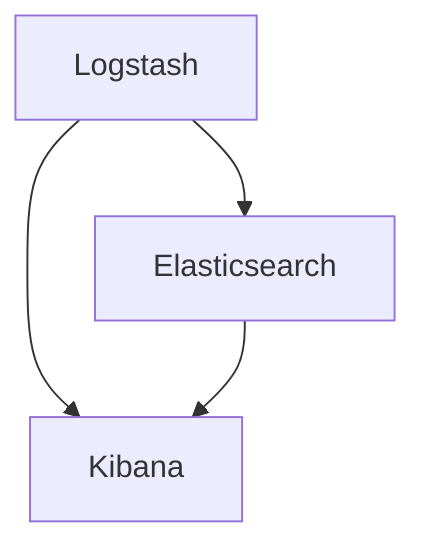
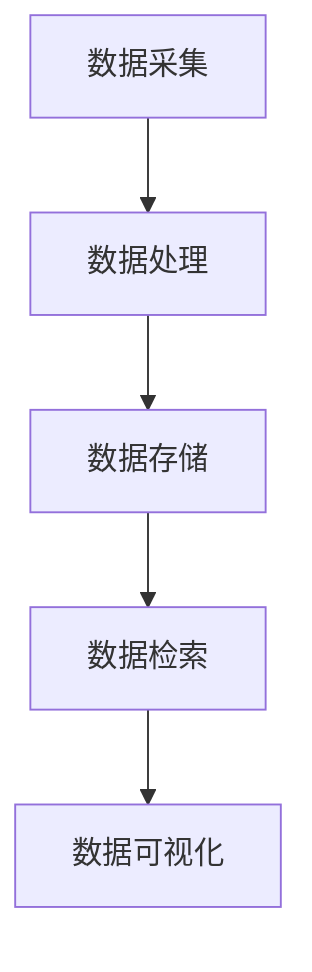

                 

### 1. 背景介绍

在信息化时代，日志管理已成为IT领域不可或缺的一部分。随着企业业务规模和复杂度的不断提升，系统生成的日志数据量也呈现出爆发式增长。有效的日志管理不仅可以提高系统运行效率，还能帮助开发人员快速定位故障、优化性能，甚至预测潜在问题。

传统的日志管理通常采用本地存储和简单分析的方式，这种方式在面对海量日志数据时显得力不从心。为了解决这一问题，ELK栈（Elasticsearch、Logstash、Kibana）应运而生。ELK栈是一个开源的日志收集、存储、分析和可视化平台，其强大的数据处理能力和友好的用户界面受到了广泛欢迎。

本文将详细讲解ELK栈的搭建与使用，帮助读者深入了解ELK栈的工作原理和实际应用，掌握日志管理的核心技能。

## 2. 核心概念与联系

### 2.1. Elasticsearch

Elasticsearch是一个高度可扩展的全文搜索引擎，它基于Lucene构建，能够处理海量数据并快速返回查询结果。在ELK栈中，Elasticsearch作为数据存储和检索引擎，负责接收并存储来自Logstash的日志数据，并对外提供高效的查询接口。

### 2.2. Logstash

Logstash是一个开源的数据收集引擎，它能够从各种数据源（如文件、数据库、消息队列等）接收数据，并对数据进行预处理、过滤、转换等操作，然后将处理后的数据发送到Elasticsearch进行存储。Logstash的设计理念是可扩展性和灵活性，使得它可以轻松集成到各种环境中。

### 2.3. Kibana

Kibana是一个基于Web的可视化分析工具，它能够将Elasticsearch中的数据以图表、仪表板等形式展示出来，帮助用户直观地理解数据。在ELK栈中，Kibana提供了丰富的数据可视化功能，使得日志分析变得更加简单和高效。

### 2.4. Mermaid 流程图

以下是一个简化的ELK栈工作流程的Mermaid流程图：



## 3. 核心算法原理 & 具体操作步骤

### 3.1 算法原理概述

ELK栈的核心算法原理主要基于以下几个步骤：

1. **数据采集**：Logstash从各种数据源（如文件、数据库、消息队列等）采集日志数据。
2. **数据处理**：Logstash对采集到的日志数据进行预处理、过滤、转换等操作。
3. **数据存储**：预处理后的数据被发送到Elasticsearch进行存储。
4. **数据检索**：用户通过Kibana访问Elasticsearch，执行查询操作并获取结果。

### 3.2 算法步骤详解

1. **搭建Elasticsearch集群**：

   首先，我们需要在服务器上安装Elasticsearch。安装完成后，需要配置Elasticsearch集群，确保集群的高可用性和数据持久化。

2. **配置Logstash**：

   安装Logstash后，我们需要编写配置文件（通常以`.conf`结尾），定义数据源、输入插件、过滤器插件和输出插件。以下是一个简单的配置文件示例：

   ```bash
   input {
     file {
       path => "/var/log/*.log"
       type => "syslog"
     }
   }

   filter {
     if "syslog" in [type] {
       grok {
         match => { "message" => "%{TIMESTAMP_ISO8601:timestamp}\t%{DATA:hostname}\t%{DATA:source}\t%{NUMBER:pid}\t%{DATA:msg}" }
       }
     }
   }

   output {
     if "syslog" in [type] {
       elasticsearch {
         hosts => ["localhost:9200"]
       }
     }
   }
   ```

3. **启动Logstash服务**：

   配置完成后，启动Logstash服务，使其开始从指定的数据源收集日志数据。

4. **配置Kibana**：

   安装Kibana后，我们需要将其与Elasticsearch集群关联。在Kibana的配置文件中，指定Elasticsearch的地址和端口，以便Kibana可以访问Elasticsearch中的数据。

5. **启动Kibana服务**：

   启动Kibana服务，在浏览器中访问Kibana的Web界面，开始进行日志分析。

### 3.3 算法优缺点

#### 优点：

1. **高效的数据处理能力**：Elasticsearch作为全文搜索引擎，具有强大的数据检索和分析能力。
2. **灵活的数据处理流程**：Logstash提供了丰富的输入和输出插件，可以轻松集成各种数据源和目标系统。
3. **直观的数据可视化**：Kibana提供了丰富的数据可视化功能，帮助用户更好地理解数据。

#### 缺点：

1. **资源消耗较大**：ELK栈在处理大量数据时，会对服务器资源产生较大消耗。
2. **复杂性较高**：ELK栈的配置和管理相对复杂，需要一定的学习和实践经验。

### 3.4 算法应用领域

ELK栈广泛应用于以下领域：

1. **日志分析**：对系统生成的日志数据进行收集、存储、分析和可视化，帮助开发人员快速定位故障和优化性能。
2. **网络安全**：实时监控网络流量，识别异常行为并预警潜在威胁。
3. **应用性能监控**：对应用程序的性能数据进行收集、存储、分析和可视化，帮助开发人员优化系统性能。

## 4. 数学模型和公式 & 详细讲解 & 举例说明

### 4.1 数学模型构建

在ELK栈中，数据处理的核心算法主要涉及全文检索、文本分析和数据可视化等。以下是一个简化的数学模型：

```latex
\text{输入} = \text{原始日志数据}
\text{输出} = \text{处理后的日志数据集}
```

### 4.2 公式推导过程

#### 全文检索

全文检索算法的核心是倒排索引。假设我们有一个包含n个单词的文档集合D，我们需要计算每个单词的倒排索引I。

1. **创建倒排索引**：

   对于每个单词w，计算其在文档集合D中的出现次数count(w)。

   $$ I(w) = \{(w, d) | d \in D, w \text{ appears in } d\} $$

2. **优化倒排索引**：

   通过使用压缩算法（如布隆过滤器）和索引压缩技术（如Lucene的FST），提高倒排索引的存储效率和查询速度。

#### 文本分析

文本分析通常涉及词频统计、词性标注和情感分析等。以下是一个简化的文本分析公式：

$$ \text{文本分析} = \text{词频统计} + \text{词性标注} + \text{情感分析} $$

### 4.3 案例分析与讲解

#### 案例一：日志数据分析

假设我们有一个包含1000个日志文件的系统，每个日志文件包含多条日志记录。我们需要对这些日志数据进行全文检索和统计分析。

1. **数据采集**：

   使用Logstash从文件系统中采集日志文件，并将其发送到Elasticsearch。

2. **数据处理**：

   在Elasticsearch中创建索引，并使用倒排索引对日志数据进行检索。

3. **数据可视化**：

   使用Kibana创建仪表板，展示日志数据的统计结果，如日志数量、错误率等。

#### 案例二：网络安全监控

假设我们需要监控一个公司的网络安全状况，实时识别潜在威胁。

1. **数据采集**：

   使用Logstash从网络设备（如防火墙、入侵检测系统等）采集网络流量数据。

2. **数据处理**：

   在Elasticsearch中存储网络流量数据，并使用全文检索和机器学习算法进行分析。

3. **数据可视化**：

   使用Kibana创建实时监控仪表板，展示网络流量、异常行为等。

## 5. 项目实践：代码实例和详细解释说明

### 5.1 开发环境搭建

在本节中，我们将搭建一个简单的ELK栈环境，包括Elasticsearch、Logstash和Kibana。以下是搭建步骤：

1. **安装Elasticsearch**：

   - 在服务器上下载Elasticsearch安装包，并解压到指定目录。
   - 运行`./bin/elasticsearch`启动Elasticsearch服务。

2. **安装Logstash**：

   - 在服务器上下载Logstash安装包，并解压到指定目录。
   - 编写Logstash配置文件（例如`logstash.conf`），定义数据源、输入插件、过滤器插件和输出插件。

3. **安装Kibana**：

   - 在服务器上下载Kibana安装包，并解压到指定目录。
   - 运行`./bin/kibana`启动Kibana服务。

4. **配置Elasticsearch与Kibana**：

   - 在Kibana的配置文件（例如`kibana.yml`）中指定Elasticsearch的地址和端口。
   - 在浏览器中访问Kibana的Web界面，开始进行日志分析。

### 5.2 源代码详细实现

以下是一个简单的Logstash配置文件示例：

```bash
input {
  file {
    path => "/var/log/*.log"
    type => "syslog"
  }
}

filter {
  if "syslog" in [type] {
    grok {
      match => { "message" => "%{TIMESTAMP_ISO8601:timestamp}\t%{DATA:hostname}\t%{DATA:source}\t%{NUMBER:pid}\t%{DATA:msg}" }
    }
  }
}

output {
  if "syslog" in [type] {
    elasticsearch {
      hosts => ["localhost:9200"]
    }
  }
}
```

### 5.3 代码解读与分析

1. **输入插件**：

   `file`插件用于从文件系统中读取日志文件。通过指定路径和类型（例如`syslog`），Logstash可以识别并解析日志文件。

2. **过滤器插件**：

   `grok`插件用于对日志文件进行模式匹配，提取出有用的信息（如时间戳、主机名、源地址等）。通过定义匹配规则，我们可以自定义日志的解析方式。

3. **输出插件**：

   `elasticsearch`插件将处理后的日志数据发送到Elasticsearch进行存储。通过指定Elasticsearch的地址和端口，我们可以确保数据能够正确地传输到Elasticsearch集群。

### 5.4 运行结果展示

在Kibana中，我们可以通过创建仪表板来展示日志数据的统计结果。以下是一个简单的仪表板示例：

1. **时间范围选择器**：

   用户可以自定义时间范围，查看不同时间段内的日志数据。

2. **日志统计图表**：

   展示日志数量、错误率等统计指标，帮助用户快速了解系统运行状况。

3. **日志查询功能**：

   用户可以通过输入关键词或使用查询语句，快速定位并查看相关日志记录。

## 6. 实际应用场景

### 6.1 日志分析

在企业环境中，日志分析是保证系统稳定运行的关键。通过ELK栈，企业可以实时监控系统运行状态，快速发现并解决问题。以下是一个实际应用场景：

1. **异常检测**：

   通过分析系统日志，可以及时发现异常行为，如错误、警告等。当检测到异常时，系统会自动发送通知，提醒相关人员处理。

2. **性能优化**：

   通过对系统日志进行分析，可以找出系统性能瓶颈，如CPU利用率过高、内存泄漏等。通过优化相关配置，可以提高系统性能。

### 6.2 网络安全

网络安全是每个企业都必须重视的问题。通过ELK栈，企业可以实时监控网络流量，识别潜在威胁并采取措施。以下是一个实际应用场景：

1. **入侵检测**：

   通过分析网络流量日志，可以识别出恶意攻击行为，如DDoS攻击、SQL注入等。系统会自动记录攻击日志，并采取相应的防御措施。

2. **异常流量分析**：

   通过对网络流量日志进行分析，可以找出异常流量，如数据包数量异常、传输速度异常等。通过对异常流量的进一步分析，可以识别出潜在的安全威胁。

### 6.3 应用性能监控

应用性能监控是保证应用稳定运行的关键。通过ELK栈，企业可以实时监控应用性能指标，及时发现并解决问题。以下是一个实际应用场景：

1. **错误日志分析**：

   通过分析应用错误日志，可以找出应用中的错误和异常。通过对错误日志的分析，可以找出导致错误的原因，并采取相应的措施。

2. **性能指标分析**：

   通过分析应用性能日志，可以找出应用的性能瓶颈，如响应时间过长、吞吐量不足等。通过对性能指标的分析，可以优化应用性能。

## 7. 工具和资源推荐

### 7.1 学习资源推荐

1. **官方文档**：

   - Elasticsearch：https://www.elastic.co/guide/en/elasticsearch/reference/current/index.html
   - Logstash：https://www.elastic.co/guide/en/logstash/current/index.html
   - Kibana：https://www.elastic.co/guide/en/kibana/current/index.html

2. **在线教程**：

   - Elasticsearch入门教程：https://www.elastic.co/guide/cn/elasticsearch/guide/current/getting-started.html
   - Logstash入门教程：https://www.elastic.co/guide/cn/logstash/current/getting-started.html
   - Kibana入门教程：https://www.elastic.co/guide/cn/kibana/current/getting-started.html

### 7.2 开发工具推荐

1. **Visual Studio Code**：

   - https://code.visualstudio.com/

   Visual Studio Code是一款强大的代码编辑器，支持各种编程语言和插件，适合编写Elasticsearch、Logstash和Kibana的配置文件。

2. **Elasticsearch Head**：

   - https://www.elastic.co/guide/en/elasticsearch/head/current/_welcome.html

   Elasticsearch Head是一个可视化工具，可以方便地操作Elasticsearch集群，查看索引、文档等。

### 7.3 相关论文推荐

1. **Elasticsearch：A Distributed Real-Time Search Engine**：

   - 作者：Elasticsearch团队
   - 链接：https://www.elastic.co/downloads/elasticsearch/papers/elastic-search-a-distributed-real-time-search-engine

   本文介绍了Elasticsearch的核心架构和技术特点，是了解Elasticsearch的重要论文。

2. **Logstash: A Log Pipeline-able Framework**：

   - 作者：Logstash团队
   - 链接：https://www.elastic.co/downloads/logstash/papers/logstash-a-log-pipeline-able-framework

   本文介绍了Logstash的设计理念和实现原理，是了解Logstash的重要论文。

3. **Kibana: Open Source Data Visualization and Exploration**：

   - 作者：Kibana团队
   - 链接：https://www.elastic.co/downloads/kibana/papers/kibana-open-source-data-visualization-and-exploration

   本文介绍了Kibana的核心功能和数据可视化技术，是了解Kibana的重要论文。

## 8. 总结：未来发展趋势与挑战

### 8.1 研究成果总结

本文详细介绍了ELK栈的搭建与使用，包括Elasticsearch、Logstash和Kibana的核心概念、工作原理、操作步骤和实际应用。通过本文的学习，读者可以掌握日志管理的核心技能，提高系统运行效率和安全性。

### 8.2 未来发展趋势

随着大数据和人工智能技术的发展，ELK栈在日志管理领域的应用前景非常广阔。未来，ELK栈可能会在以下几个方面取得突破：

1. **智能化日志分析**：通过引入机器学习和人工智能技术，实现自动化的日志分析，提高故障检测和预警的准确性和效率。

2. **实时日志处理**：随着实时数据需求的增加，ELK栈可能会在实时数据处理方面取得更多突破，实现毫秒级的日志处理能力。

3. **跨平台集成**：未来，ELK栈可能会更好地与各类操作系统、数据库和消息队列等集成，提供更丰富的日志管理解决方案。

### 8.3 面临的挑战

尽管ELK栈在日志管理领域具有很大的优势，但未来仍面临着一些挑战：

1. **资源消耗**：随着数据量的增加，ELK栈对服务器资源的消耗也会增加，如何优化资源利用成为了一个重要问题。

2. **复杂性**：ELK栈的配置和管理相对复杂，需要一定的学习和实践经验。如何降低配置和运维的难度是一个亟待解决的问题。

3. **数据安全**：在日志管理过程中，如何保证数据的安全性和隐私性也是一个重要挑战。未来，ELK栈需要更好地解决数据安全相关问题。

### 8.4 研究展望

未来，ELK栈在日志管理领域的研究将主要集中在以下几个方面：

1. **智能化**：通过引入人工智能和机器学习技术，实现智能化的日志分析和管理，提高系统运行效率和安全性。

2. **实时性**：通过优化算法和架构，提高日志处理的实时性，满足实时数据需求。

3. **跨平台**：通过跨平台集成，提供更丰富的日志管理解决方案，满足不同类型的企业需求。

4. **安全性**：加强数据安全防护措施，保障数据的安全性和隐私性。

## 9. 附录：常见问题与解答

### 9.1 如何搭建ELK栈环境？

搭建ELK栈环境主要包括以下步骤：

1. **安装Elasticsearch**：下载Elasticsearch安装包，解压并运行`./bin/elasticsearch`。
2. **安装Logstash**：下载Logstash安装包，解压并编写配置文件。
3. **安装Kibana**：下载Kibana安装包，解压并运行`./bin/kibana`。
4. **配置Elasticsearch与Kibana**：在Kibana的配置文件中指定Elasticsearch的地址和端口。

### 9.2 如何配置Logstash？

配置Logstash主要包括以下步骤：

1. **编写配置文件**：根据实际需求编写Logstash配置文件（通常以`.conf`结尾），定义输入、过滤和输出插件。
2. **启动Logstash服务**：运行`./bin/logstash -f <配置文件路径>`启动Logstash服务。

### 9.3 如何使用Kibana进行日志分析？

使用Kibana进行日志分析主要包括以下步骤：

1. **启动Kibana服务**：运行`./bin/kibana`启动Kibana服务。
2. **创建仪表板**：在Kibana的Web界面中，点击“Discover”创建新仪表板。
3. **添加索引模式**：在仪表板中，点击“Add Index Pattern”添加Elasticsearch索引模式。
4. **创建可视化**：使用Kibana提供的可视化工具（如柱状图、折线图等），根据需求创建可视化图表。

### 9.4 如何优化ELK栈性能？

优化ELK栈性能主要包括以下方法：

1. **提高硬件性能**：增加服务器硬件资源（如CPU、内存、存储等）。
2. **优化配置**：调整Elasticsearch、Logstash和Kibana的配置，如调整集群大小、索引设置等。
3. **使用缓存**：使用Elasticsearch的缓存功能，提高查询性能。
4. **负载均衡**：使用负载均衡器（如Nginx、HAProxy等）分配日志处理任务，提高系统性能。
5. **垂直和水平扩展**：根据需求增加节点数量，实现垂直和水平扩展。

作者：禅与计算机程序设计艺术 / Zen and the Art of Computer Programming
```markdown
---
# 日志管理：ELK栈的搭建与使用

> 关键词：日志管理，ELK栈，Elasticsearch，Logstash，Kibana，数据采集，数据处理，数据存储，数据检索，可视化

> 摘要：本文深入探讨了日志管理领域的重要工具ELK栈的搭建与使用。通过介绍ELK栈的核心组件Elasticsearch、Logstash和Kibana，以及它们的工作原理和操作步骤，本文为读者提供了一个完整的日志管理解决方案。

## 1. 背景介绍

在信息化时代，日志管理已成为IT领域不可或缺的一部分。随着企业业务规模和复杂度的不断提升，系统生成的日志数据量也呈现出爆发式增长。有效的日志管理不仅可以提高系统运行效率，还能帮助开发人员快速定位故障、优化性能，甚至预测潜在问题。

传统的日志管理通常采用本地存储和简单分析的方式，这种方式在面对海量日志数据时显得力不从心。为了解决这一问题，ELK栈（Elasticsearch、Logstash、Kibana）应运而生。ELK栈是一个开源的日志收集、存储、分析和可视化平台，其强大的数据处理能力和友好的用户界面受到了广泛欢迎。

本文将详细讲解ELK栈的搭建与使用，帮助读者深入了解ELK栈的工作原理和实际应用，掌握日志管理的核心技能。

## 2. 核心概念与联系

### 2.1 Elasticsearch

Elasticsearch是一个高度可扩展的全文搜索引擎，它基于Lucene构建，能够处理海量数据并快速返回查询结果。在ELK栈中，Elasticsearch作为数据存储和检索引擎，负责接收并存储来自Logstash的日志数据，并对外提供高效的查询接口。

### 2.2 Logstash

Logstash是一个开源的数据收集引擎，它能够从各种数据源（如文件、数据库、消息队列等）接收数据，并对数据进行预处理、过滤、转换等操作，然后将处理后的数据发送到Elasticsearch进行存储。Logstash的设计理念是可扩展性和灵活性，使得它可以轻松集成到各种环境中。

### 2.3 Kibana

Kibana是一个基于Web的可视化分析工具，它能够将Elasticsearch中的数据以图表、仪表板等形式展示出来，帮助用户直观地理解数据。在ELK栈中，Kibana提供了丰富的数据可视化功能，使得日志分析变得更加简单和高效。

### 2.4 Mermaid流程图

以下是一个简化的ELK栈工作流程的Mermaid流程图：


## 3. 核心算法原理 & 具体操作步骤
### 3.1 算法原理概述

ELK栈的核心算法原理主要基于以下几个步骤：

1. **数据采集**：Logstash从各种数据源（如文件、数据库、消息队列等）采集日志数据。
2. **数据处理**：Logstash对采集到的日志数据进行预处理、过滤、转换等操作。
3. **数据存储**：预处理后的数据被发送到Elasticsearch进行存储。
4. **数据检索**：用户通过Kibana访问Elasticsearch，执行查询操作并获取结果。

### 3.2 算法步骤详解
### 3.1 Elasticsearch集群搭建

首先，我们需要在服务器上安装Elasticsearch。安装完成后，需要配置Elasticsearch集群，确保集群的高可用性和数据持久化。

### 3.2 Logstash配置

安装Logstash后，我们需要编写配置文件（通常以`.conf`结尾），定义数据源、输入插件、过滤器插件和输出插件。以下是一个简单的配置文件示例：

```bash
input {
  file {
    path => "/var/log/*.log"
    type => "syslog"
  }
}

filter {
  if "syslog" in [type] {
    grok {
      match => { "message" => "%{TIMESTAMP_ISO8601:timestamp}\t%{DATA:hostname}\t%{DATA:source}\t%{NUMBER:pid}\t%{DATA:msg}" }
    }
  }
}

output {
  if "syslog" in [type] {
    elasticsearch {
      hosts => ["localhost:9200"]
    }
  }
}
```

### 3.3 Kibana配置

安装Kibana后，我们需要将其与Elasticsearch集群关联。在Kibana的配置文件中，指定Elasticsearch的地址和端口，以便Kibana可以访问Elasticsearch中的数据。

### 3.4 启动服务

配置完成后，启动Logstash服务，使其开始从指定的数据源收集日志数据。接着，启动Kibana服务，在浏览器中访问Kibana的Web界面，开始进行日志分析。

### 3.5 数据处理流程

1. **数据采集**：Logstash从文件系统中读取日志文件。
2. **数据处理**：使用Grok进行模式匹配，提取日志字段。
3. **数据存储**：将处理后的日志数据发送到Elasticsearch。
4. **数据检索**：在Kibana中创建仪表板，展示日志数据的统计结果。

### 3.6 算法优缺点

#### 优点：

- **高效的数据处理能力**：Elasticsearch作为全文搜索引擎，具有强大的数据检索和分析能力。
- **灵活的数据处理流程**：Logstash提供了丰富的输入和输出插件，可以轻松集成各种数据源和目标系统。
- **直观的数据可视化**：Kibana提供了丰富的数据可视化功能，帮助用户更好地理解数据。

#### 缺点：

- **资源消耗较大**：ELK栈在处理大量数据时，会对服务器资源产生较大消耗。
- **复杂性较高**：ELK栈的配置和管理相对复杂，需要一定的学习和实践经验。

### 3.7 算法应用领域

ELK栈广泛应用于以下领域：

- **日志分析**：对系统生成的日志数据进行收集、存储、分析和可视化，帮助开发人员快速定位故障和优化性能。
- **网络安全**：实时监控网络流量，识别异常行为并预警潜在威胁。
- **应用性能监控**：对应用程序的性能数据进行收集、存储、分析和可视化，帮助开发人员优化系统性能。

## 4. 数学模型和公式 & 详细讲解 & 举例说明
### 4.1 数学模型构建

在ELK栈中，数据处理的核心算法主要涉及全文检索、文本分析和数据可视化等。以下是一个简化的数学模型：

```latex
\text{输入} = \text{原始日志数据}
\text{输出} = \text{处理后的日志数据集}
```

### 4.2 公式推导过程

#### 全文检索

全文检索算法的核心是倒排索引。假设我们有一个包含n个单词的文档集合D，我们需要计算每个单词的倒排索引I。

1. **创建倒排索引**：

   对于每个单词w，计算其在文档集合D中的出现次数count(w)。

   $$ I(w) = \{(w, d) | d \in D, w \text{ appears in } d\} $$

2. **优化倒排索引**：

   通过使用压缩算法（如布隆过滤器）和索引压缩技术（如Lucene的FST），提高倒排索引的存储效率和查询速度。

#### 文本分析

文本分析通常涉及词频统计、词性标注和情感分析等。以下是一个简化的文本分析公式：

$$ \text{文本分析} = \text{词频统计} + \text{词性标注} + \text{情感分析} $$

### 4.3 案例分析与讲解

#### 案例一：日志数据分析

假设我们有一个包含1000个日志文件的系统，每个日志文件包含多条日志记录。我们需要对这些日志数据进行全文检索和统计分析。

1. **数据采集**：

   使用Logstash从文件系统中采集日志文件，并将其发送到Elasticsearch。

2. **数据处理**：

   在Elasticsearch中创建索引，并使用倒排索引对日志数据进行检索。

3. **数据可视化**：

   使用Kibana创建仪表板，展示日志数据的统计结果，如日志数量、错误率等。

#### 案例二：网络安全监控

假设我们需要监控一个公司的网络安全状况，实时识别潜在威胁。

1. **数据采集**：

   使用Logstash从网络设备（如防火墙、入侵检测系统等）采集网络流量数据。

2. **数据处理**：

   在Elasticsearch中存储网络流量数据，并使用全文检索和机器学习算法进行分析。

3. **数据可视化**：

   使用Kibana创建实时监控仪表板，展示网络流量、异常行为等。

## 5. 项目实践：代码实例和详细解释说明

### 5.1 开发环境搭建

在本节中，我们将搭建一个简单的ELK栈环境，包括Elasticsearch、Logstash和Kibana。以下是搭建步骤：

1. **安装Elasticsearch**：

   - 在服务器上下载Elasticsearch安装包，并解压到指定目录。
   - 运行`./bin/elasticsearch`启动Elasticsearch服务。

2. **安装Logstash**：

   - 在服务器上下载Logstash安装包，并解压到指定目录。
   - 编写Logstash配置文件（例如`logstash.conf`），定义数据源、输入插件、过滤器插件和输出插件。

3. **安装Kibana**：

   - 在服务器上下载Kibana安装包，并解压到指定目录。
   - 运行`./bin/kibana`启动Kibana服务。

4. **配置Elasticsearch与Kibana**：

   - 在Kibana的配置文件（例如`kibana.yml`）中指定Elasticsearch的地址和端口。
   - 在浏览器中访问Kibana的Web界面，开始进行日志分析。

### 5.2 源代码详细实现

以下是一个简单的Logstash配置文件示例：

```bash
input {
  file {
    path => "/var/log/*.log"
    type => "syslog"
  }
}

filter {
  if "syslog" in [type] {
    grok {
      match => { "message" => "%{TIMESTAMP_ISO8601:timestamp}\t%{DATA:hostname}\t%{DATA:source}\t%{NUMBER:pid}\t%{DATA:msg}" }
    }
  }
}

output {
  if "syslog" in [type] {
    elasticsearch {
      hosts => ["localhost:9200"]
    }
  }
}
```

### 5.3 代码解读与分析

1. **输入插件**：

   `file`插件用于从文件系统中读取日志文件。通过指定路径和类型（例如`syslog`），Logstash可以识别并解析日志文件。

2. **过滤器插件**：

   `grok`插件用于对日志文件进行模式匹配，提取出有用的信息（如时间戳、主机名、源地址等）。通过定义匹配规则，我们可以自定义日志的解析方式。

3. **输出插件**：

   `elasticsearch`插件将处理后的日志数据发送到Elasticsearch进行存储。通过指定Elasticsearch的地址和端口，我们可以确保数据能够正确地传输到Elasticsearch集群。

### 5.4 运行结果展示

在Kibana中，我们可以通过创建仪表板来展示日志数据的统计结果。以下是一个简单的仪表板示例：

1. **时间范围选择器**：

   用户可以自定义时间范围，查看不同时间段内的日志数据。

2. **日志统计图表**：

   展示日志数量、错误率等统计指标，帮助用户快速了解系统运行状况。

3. **日志查询功能**：

   用户可以通过输入关键词或使用查询语句，快速定位并查看相关日志记录。

## 6. 实际应用场景

### 6.1 日志分析

在企业环境中，日志分析是保证系统稳定运行的关键。通过ELK栈，企业可以实时监控系统运行状态，快速发现并解决问题。以下是一个实际应用场景：

1. **异常检测**：

   通过分析系统日志，可以及时发现异常行为，如错误、警告等。当检测到异常时，系统会自动发送通知，提醒相关人员处理。

2. **性能优化**：

   通过对系统日志进行分析，可以找出系统性能瓶颈，如CPU利用率过高、内存泄漏等。通过优化相关配置，可以提高系统性能。

### 6.2 网络安全

网络安全是每个企业都必须重视的问题。通过ELK栈，企业可以实时监控网络流量，识别潜在威胁并采取措施。以下是一个实际应用场景：

1. **入侵检测**：

   通过分析网络流量日志，可以识别出恶意攻击行为，如DDoS攻击、SQL注入等。系统会自动记录攻击日志，并采取相应的防御措施。

2. **异常流量分析**：

   通过对网络流量日志进行分析，可以找出异常流量，如数据包数量异常、传输速度异常等。通过对异常流量的进一步分析，可以识别出潜在的安全威胁。

### 6.3 应用性能监控

应用性能监控是保证应用稳定运行的关键。通过ELK栈，企业可以实时监控应用性能指标，及时发现并解决问题。以下是一个实际应用场景：

1. **错误日志分析**：

   通过分析应用错误日志，可以找出应用中的错误和异常。通过对错误日志的分析，可以找出导致错误的原因，并采取相应的措施。

2. **性能指标分析**：

   通过分析应用性能日志，可以找出应用的性能瓶颈，如响应时间过长、吞吐量不足等。通过对性能指标的分析，可以优化应用性能。

## 7. 工具和资源推荐

### 7.1 学习资源推荐

1. **官方文档**：

   - Elasticsearch：https://www.elastic.co/guide/en/elasticsearch/reference/current/index.html
   - Logstash：https://www.elastic.co/guide/en/logstash/current/index.html
   - Kibana：https://www.elastic.co/guide/en/kibana/current/index.html

2. **在线教程**：

   - Elasticsearch入门教程：https://www.elastic.co/guide/cn/elasticsearch/guide/current/getting-started.html
   - Logstash入门教程：https://www.elastic.co/guide/cn/logstash/current/getting-started.html
   - Kibana入门教程：https://www.elastic.co/guide/cn/kibana/current/getting-started.html

### 7.2 开发工具推荐

1. **Visual Studio Code**：

   - https://code.visualstudio.com/

   Visual Studio Code是一款强大的代码编辑器，支持各种编程语言和插件，适合编写Elasticsearch、Logstash和Kibana的配置文件。

2. **Elasticsearch Head**：

   - https://www.elastic.co/guide/en/elasticsearch/head/current/_welcome.html

   Elasticsearch Head是一个可视化工具，可以方便地操作Elasticsearch集群，查看索引、文档等。

### 7.3 相关论文推荐

1. **Elasticsearch：A Distributed Real-Time Search Engine**：

   - 作者：Elasticsearch团队
   - 链接：https://www.elastic.co/downloads/elasticsearch/papers/elastic-search-a-distributed-real-time-search-engine

   本文介绍了Elasticsearch的核心架构和技术特点，是了解Elasticsearch的重要论文。

2. **Logstash: A Log Pipeline-able Framework**：

   - 作者：Logstash团队
   - 链接：https://www.elastic.co/downloads/logstash/papers/logstash-a-log-pipeline-able-framework

   本文介绍了Logstash的设计理念和实现原理，是了解Logstash的重要论文。

3. **Kibana: Open Source Data Visualization and Exploration**：

   - 作者：Kibana团队
   - 链接：https://www.elastic.co/downloads/kibana/papers/kibana-open-source-data-visualization-and-exploration

   本文介绍了Kibana的核心功能和数据可视化技术，是了解Kibana的重要论文。

## 8. 总结：未来发展趋势与挑战

### 8.1 研究成果总结

本文详细介绍了ELK栈的搭建与使用，包括Elasticsearch、Logstash和Kibana的核心概念、工作原理、操作步骤和实际应用。通过本文的学习，读者可以掌握日志管理的核心技能，提高系统运行效率和安全性。

### 8.2 未来发展趋势

随着大数据和人工智能技术的发展，ELK栈在日志管理领域的应用前景非常广阔。未来，ELK栈可能会在以下几个方面取得突破：

1. **智能化日志分析**：通过引入人工智能和机器学习技术，实现自动化的日志分析，提高故障检测和预警的准确性和效率。

2. **实时日志处理**：随着实时数据需求的增加，ELK栈可能会在实时数据处理方面取得更多突破，实现毫秒级的日志处理能力。

3. **跨平台集成**：未来，ELK栈可能会更好地与各类操作系统、数据库和消息队列等集成，提供更丰富的日志管理解决方案。

### 8.3 面临的挑战

尽管ELK栈在日志管理领域具有很大的优势，但未来仍面临着一些挑战：

1. **资源消耗**：随着数据量的增加，ELK栈对服务器资源的消耗也会增加，如何优化资源利用成为了一个重要问题。

2. **复杂性**：ELK栈的配置和管理相对复杂，需要一定的学习和实践经验。如何降低配置和运维的难度是一个亟待解决的问题。

3. **数据安全**：在日志管理过程中，如何保证数据的安全性和隐私性也是一个重要挑战。未来，ELK栈需要更好地解决数据安全相关问题。

### 8.4 研究展望

未来，ELK栈在日志管理领域的研究将主要集中在以下几个方面：

1. **智能化**：通过引入人工智能和机器学习技术，实现智能化的日志分析和管理，提高系统运行效率和安全性。

2. **实时性**：通过优化算法和架构，提高日志处理的实时性，满足实时数据需求。

3. **跨平台**：通过跨平台集成，提供更丰富的日志管理解决方案，满足不同类型的企业需求。

4. **安全性**：加强数据安全防护措施，保障数据的安全性和隐私性。

## 9. 附录：常见问题与解答

### 9.1 如何搭建ELK栈环境？

搭建ELK栈环境主要包括以下步骤：

1. **安装Elasticsearch**：下载Elasticsearch安装包，解压并运行`./bin/elasticsearch`。
2. **安装Logstash**：下载Logstash安装包，解压并编写配置文件。
3. **安装Kibana**：下载Kibana安装包，解压并运行`./bin/kibana`。
4. **配置Elasticsearch与Kibana**：在Kibana的配置文件中指定Elasticsearch的地址和端口。

### 9.2 如何配置Logstash？

配置Logstash主要包括以下步骤：

1. **编写配置文件**：根据实际需求编写Logstash配置文件（通常以`.conf`结尾），定义数据源、输入插件、过滤器插件和输出插件。
2. **启动Logstash服务**：运行`./bin/logstash -f <配置文件路径>`启动Logstash服务。

### 9.3 如何使用Kibana进行日志分析？

使用Kibana进行日志分析主要包括以下步骤：

1. **启动Kibana服务**：运行`./bin/kibana`启动Kibana服务。
2. **创建仪表板**：在Kibana的Web界面中，点击“Discover”创建新仪表板。
3. **添加索引模式**：在仪表板中，点击“Add Index Pattern”添加Elasticsearch索引模式。
4. **创建可视化**：使用Kibana提供的可视化工具（如柱状图、折线图等），根据需求创建可视化图表。

### 9.4 如何优化ELK栈性能？

优化ELK栈性能主要包括以下方法：

1. **提高硬件性能**：增加服务器硬件资源（如CPU、内存、存储等）。
2. **优化配置**：调整Elasticsearch、Logstash和Kibana的配置，如调整集群大小、索引设置等。
3. **使用缓存**：使用Elasticsearch的缓存功能，提高查询性能。
4. **负载均衡**：使用负载均衡器（如Nginx、HAProxy等）分配日志处理任务，提高系统性能。
5. **垂直和水平扩展**：根据需求增加节点数量，实现垂直和水平扩展。

---

# 日志管理：ELK栈的搭建与使用

ELK栈是一个强大的开源日志管理解决方案，由Elasticsearch、Logstash和Kibana三个组件组成。本文将详细介绍ELK栈的搭建与使用，帮助您掌握日志管理的核心技能。

## 摘要

本文首先介绍了ELK栈的背景及其重要性，随后详细讲解了Elasticsearch、Logstash和Kibana的核心概念与工作原理。接着，本文通过具体的操作步骤和代码实例，展示了如何搭建和配置ELK栈。最后，本文探讨了ELK栈在实际应用场景中的表现，并推荐了一些学习资源和开发工具。

## 1. 背景介绍

在现代企业中，日志数据的重要性日益凸显。有效的日志管理可以帮助企业快速发现和解决问题，提高系统运行效率和安全性。传统的日志管理方式通常依赖于本地存储和简单分析，难以应对海量日志数据的挑战。

ELK栈应运而生，它是一个开源的日志管理平台，包括Elasticsearch、Logstash和Kibana三个核心组件。Elasticsearch是一个高性能的全文搜索引擎，负责存储和检索日志数据；Logstash是一个数据收集和处理引擎，负责将日志数据从不同的来源收集到Elasticsearch中；Kibana是一个基于Web的可视化工具，用于对日志数据进行分析和可视化。ELK栈通过这三个组件的协同工作，提供了一套完整的日志管理解决方案。

## 2. 核心概念与联系

### 2.1 Elasticsearch

Elasticsearch是一个基于Lucene的分布式全文搜索引擎，能够快速处理海量数据并返回查询结果。在ELK栈中，Elasticsearch作为核心的数据存储和检索引擎，负责接收并存储来自Logstash的日志数据，并提供高效的查询接口。

### 2.2 Logstash

Logstash是一个开源的数据收集和处理引擎，能够从各种数据源（如文件、数据库、消息队列等）收集数据，对数据进行预处理、过滤、转换等操作，然后将处理后的数据发送到Elasticsearch进行存储。Logstash的设计理念是灵活性和可扩展性，使得它可以轻松集成到各种环境中。

### 2.3 Kibana

Kibana是一个基于Web的可视化工具，用于对Elasticsearch中的数据进行分析和可视化。它提供了丰富的图表、仪表板和报告功能，帮助用户直观地理解日志数据。Kibana与Elasticsearch紧密集成，可以通过Kibana访问和查询Elasticsearch中的数据。

### 2.4 Mermaid流程图

以下是一个简化的ELK栈工作流程的Mermaid流程图：


## 3. 核心算法原理 & 具体操作步骤

### 3.1 算法原理概述

ELK栈的核心算法原理主要涉及数据的采集、处理、存储和检索。以下是一个简化的算法流程：

1. **数据采集**：Logstash从不同的数据源采集日志数据。
2. **数据处理**：Logstash对采集到的日志数据进行预处理、过滤、转换等操作。
3. **数据存储**：处理后的日志数据被发送到Elasticsearch进行存储。
4. **数据检索**：用户通过Kibana访问Elasticsearch，执行查询操作并获取结果。

### 3.2 算法步骤详解

#### 3.2.1 Elasticsearch集群搭建

1. **安装Elasticsearch**：在服务器上下载Elasticsearch安装包，解压并运行`./bin/elasticsearch`。
2. **配置Elasticsearch集群**：编辑`elasticsearch.yml`文件，配置集群名称、节点名称等参数。
3. **启动Elasticsearch服务**：运行`./bin/elasticsearch`启动Elasticsearch服务。

#### 3.2.2 Logstash配置

1. **安装Logstash**：在服务器上下载Logstash安装包，解压并运行`./bin/logstash`。
2. **编写Logstash配置文件**：根据实际需求编写Logstash配置文件（例如`logstash.conf`），定义数据源、输入插件、过滤器插件和输出插件。
3. **启动Logstash服务**：运行`./bin/logstash -f <配置文件路径>`启动Logstash服务。

#### 3.2.3 Kibana配置

1. **安装Kibana**：在服务器上下载Kibana安装包，解压并运行`./bin/kibana`。
2. **配置Kibana与Elasticsearch的连接**：编辑`kibana.yml`文件，配置Elasticsearch的地址和端口。
3. **启动Kibana服务**：运行`./bin/kibana`启动Kibana服务。

#### 3.2.4 数据采集与处理

1. **配置Logstash数据源**：在Logstash配置文件中定义数据源，例如从文件系统中读取日志文件。
2. **配置Logstash过滤器**：根据需求配置过滤器插件，例如使用Grok进行模式匹配，提取日志字段。
3. **配置Logstash输出插件**：将处理后的日志数据发送到Elasticsearch。

#### 3.2.5 数据检索与可视化

1. **在Kibana中创建索引模式**：在Kibana的Web界面中，创建新的索引模式，以便Kibana可以访问Elasticsearch中的数据。
2. **创建可视化仪表板**：使用Kibana提供的可视化工具，根据需求创建图表、仪表板和报告。

## 4. 数学模型和公式 & 详细讲解 & 举例说明

ELK栈中的核心算法主要涉及全文检索、文本分析和数据可视化。以下是一个简化的数学模型：



### 4.1 数学模型构建

在ELK栈中，数据处理的核心算法主要涉及以下步骤：

1. **数据采集**：从各种数据源（如文件、数据库、消息队列等）采集原始数据。
2. **数据处理**：对采集到的数据进行预处理、过滤、转换等操作。
3. **数据存储**：将处理后的数据发送到Elasticsearch进行存储。
4. **数据检索**：通过Elasticsearch执行查询操作，获取检索结果。
5. **数据可视化**：在Kibana中使用图表、仪表板等形式展示检索结果。

### 4.2 公式推导过程

以下是一个简化的文本分析公式：

$$ \text{文本分析} = \text{词频统计} + \text{词性标注} + \text{情感分析} $$

1. **词频统计**：计算每个单词在文本中出现的次数。
2. **词性标注**：对每个单词进行词性分类，例如名词、动词、形容词等。
3. **情感分析**：分析文本的情感倾向，例如正面、负面或中性。

### 4.3 案例分析与讲解

#### 案例一：日志分析

假设我们有一个包含1000个日志文件的系统，每个日志文件包含多条日志记录。我们需要对这些日志数据进行全文检索和统计分析。

1. **数据采集**：

   使用Logstash从文件系统中采集日志文件，并将其发送到Elasticsearch。

2. **数据处理**：

   在Elasticsearch中创建索引，并使用倒排索引对日志数据进行检索。

3. **数据可视化**：

   使用Kibana创建仪表板，展示日志数据的统计结果，如日志数量、错误率等。

#### 案例二：网络安全监控

假设我们需要监控一个公司的网络安全状况，实时识别潜在威胁。

1. **数据采集**：

   使用Logstash从网络设备（如防火墙、入侵检测系统等）采集网络流量数据。

2. **数据处理**：

   在Elasticsearch中存储网络流量数据，并使用全文检索和机器学习算法进行分析。

3. **数据可视化**：

   使用Kibana创建实时监控仪表板，展示网络流量、异常行为等。

## 5. 项目实践：代码实例和详细解释说明

### 5.1 开发环境搭建

在本节中，我们将搭建一个简单的ELK栈环境，包括Elasticsearch、Logstash和Kibana。以下是搭建步骤：

1. **安装Elasticsearch**：

   - 在服务器上下载Elasticsearch安装包，并解压到指定目录。
   - 运行`./bin/elasticsearch`启动Elasticsearch服务。

2. **安装Logstash**：

   - 在服务器上下载Logstash安装包，并解压到指定目录。
   - 编写Logstash配置文件（例如`logstash.conf`），定义数据源、输入插件、过滤器插件和输出插件。

3. **安装Kibana**：

   - 在服务器上下载Kibana安装包，并解压到指定目录。
   - 运行`./bin/kibana`启动Kibana服务。

4. **配置Elasticsearch与Kibana**：

   - 在Kibana的配置文件（例如`kibana.yml`）中指定Elasticsearch的地址和端口。
   - 在浏览器中访问Kibana的Web界面，开始进行日志分析。

### 5.2 源代码详细实现

以下是一个简单的Logstash配置文件示例：

```bash
input {
  file {
    path => "/var/log/*.log"
    type => "syslog"
  }
}

filter {
  if "syslog" in [type] {
    grok {
      match => { "message" => "%{TIMESTAMP_ISO8601:timestamp}\t%{DATA:hostname}\t%{DATA:source}\t%{NUMBER:pid}\t%{DATA:msg}" }
    }
  }
}

output {
  if "syslog" in [type] {
    elasticsearch {
      hosts => ["localhost:9200"]
    }
  }
}
```

### 5.3 代码解读与分析

1. **输入插件**：

   `file`插件用于从文件系统中读取日志文件。通过指定路径和类型（例如`syslog`），Logstash可以识别并解析日志文件。

2. **过滤器插件**：

   `grok`插件用于对日志文件进行模式匹配，提取出有用的信息（如时间戳、主机名、源地址等）。通过定义匹配规则，我们可以自定义日志的解析方式。

3. **输出插件**：

   `elasticsearch`插件将处理后的日志数据发送到Elasticsearch进行存储。通过指定Elasticsearch的地址和端口，我们可以确保数据能够正确地传输到Elasticsearch集群。

### 5.4 运行结果展示

在Kibana中，我们可以通过创建仪表板来展示日志数据的统计结果。以下是一个简单的仪表板示例：

1. **时间范围选择器**：

   用户可以自定义时间范围，查看不同时间段内的日志数据。

2. **日志统计图表**：

   展示日志数量、错误率等统计指标，帮助用户快速了解系统运行状况。

3. **日志查询功能**：

   用户可以通过输入关键词或使用查询语句，快速定位并查看相关日志记录。

## 6. 实际应用场景

### 6.1 日志分析

在企业环境中，日志分析是保证系统稳定运行的关键。通过ELK栈，企业可以实时监控系统运行状态，快速发现并解决问题。以下是一个实际应用场景：

1. **异常检测**：

   通过分析系统日志，可以及时发现异常行为，如错误、警告等。当检测到异常时，系统会自动发送通知，提醒相关人员处理。

2. **性能优化**：

   通过对系统日志进行分析，可以找出系统性能瓶颈，如CPU利用率过高、内存泄漏等。通过优化相关配置，可以提高系统性能。

### 6.2 网络安全

网络安全是每个企业都必须重视的问题。通过ELK栈，企业可以实时监控网络流量，识别潜在威胁并采取措施。以下是一个实际应用场景：

1. **入侵检测**：

   通过分析网络流量日志，可以识别出恶意攻击行为，如DDoS攻击、SQL注入等。系统会自动记录攻击日志，并采取相应的防御措施。

2. **异常流量分析**：

   通过对网络流量日志进行分析，可以找出异常流量，如数据包数量异常、传输速度异常等。通过对异常流量的进一步分析，可以识别出潜在的安全威胁。

### 6.3 应用性能监控

应用性能监控是保证应用稳定运行的关键。通过ELK栈，企业可以实时监控应用性能指标，及时发现并解决问题。以下是一个实际应用场景：

1. **错误日志分析**：

   通过分析应用错误日志，可以找出应用中的错误和异常。通过对错误日志的分析，可以找出导致错误的原因，并采取相应的措施。

2. **性能指标分析**：

   通过分析应用性能日志，可以找出应用的性能瓶颈，如响应时间过长、吞吐量不足等。通过对性能指标的分析，可以优化应用性能。

## 7. 工具和资源推荐

### 7.1 学习资源推荐

1. **官方文档**：

   - Elasticsearch：https://www.elastic.co/guide/en/elasticsearch/reference/current/index.html
   - Logstash：https://www.elastic.co/guide/en/logstash/current/index.html
   - Kibana：https://www.elastic.co/guide/en/kibana/current/index.html

2. **在线教程**：

   - Elasticsearch入门教程：https://www.elastic.co/guide/cn/elasticsearch/guide/current/getting-started.html
   - Logstash入门教程：https://www.elastic.co/guide/cn/logstash/current/getting-started.html
   - Kibana入门教程：https://www.elastic.co/guide/cn/kibana/current/getting-started.html

### 7.2 开发工具推荐

1. **Visual Studio Code**：

   - https://code.visualstudio.com/

   Visual Studio Code是一款强大的代码编辑器，支持各种编程语言和插件，适合编写Elasticsearch、Logstash和Kibana的配置文件。

2. **Elasticsearch Head**：

   - https://www.elastic.co/guide/en/elasticsearch/head/current/_welcome.html

   Elasticsearch Head是一个可视化工具，可以方便地操作Elasticsearch集群，查看索引、文档等。

### 7.3 相关论文推荐

1. **Elasticsearch：A Distributed Real-Time Search Engine**：

   - 作者：Elasticsearch团队
   - 链接：https://www.elastic.co/downloads/elasticsearch/papers/elastic-search-a-distributed-real-time-search-engine

   本文介绍了Elasticsearch的核心架构和技术特点，是了解Elasticsearch的重要论文。

2. **Logstash: A Log Pipeline-able Framework**：

   - 作者：Logstash团队
   - 链接：https://www.elastic.co/downloads/logstash/papers/logstash-a-log-pipeline-able-framework

   本文介绍了Logstash的设计理念和实现原理，是了解Logstash的重要论文。

3. **Kibana: Open Source Data Visualization and Exploration**：

   - 作者：Kibana团队
   - 链接：https://www.elastic.co/downloads/kibana/papers/kibana-open-source-data-visualization-and-exploration

   本文介绍了Kibana的核心功能和数据可视化技术，是了解Kibana的重要论文。

## 8. 总结：未来发展趋势与挑战

### 8.1 研究成果总结

本文详细介绍了ELK栈的搭建与使用，包括Elasticsearch、Logstash和Kibana的核心概念、工作原理、操作步骤和实际应用。通过本文的学习，读者可以掌握日志管理的核心技能，提高系统运行效率和安全性。

### 8.2 未来发展趋势

随着大数据和人工智能技术的发展，ELK栈在日志管理领域的应用前景非常广阔。未来，ELK栈可能会在以下几个方面取得突破：

1. **智能化日志分析**：通过引入人工智能和机器学习技术，实现自动化的日志分析，提高故障检测和预警的准确性和效率。

2. **实时日志处理**：随着实时数据需求的增加，ELK栈可能会在实时数据处理方面取得更多突破，实现毫秒级的日志处理能力。

3. **跨平台集成**：未来，ELK栈可能会更好地与各类操作系统、数据库和消息队列等集成，提供更丰富的日志管理解决方案。

### 8.3 面临的挑战

尽管ELK栈在日志管理领域具有很大的优势，但未来仍面临着一些挑战：

1. **资源消耗**：随着数据量的增加，ELK栈对服务器资源的消耗也会增加，如何优化资源利用成为了一个重要问题。

2. **复杂性**：ELK栈的配置和管理相对复杂，需要一定的学习和实践经验。如何降低配置和运维的难度是一个亟待解决的问题。

3. **数据安全**：在日志管理过程中，如何保证数据的安全性和隐私性也是一个重要挑战。未来，ELK栈需要更好地解决数据安全相关问题。

### 8.4 研究展望

未来，ELK栈在日志管理领域的研究将主要集中在以下几个方面：

1. **智能化**：通过引入人工智能和机器学习技术，实现智能化的日志分析和管理，提高系统运行效率和安全性。

2. **实时性**：通过优化算法和架构，提高日志处理的实时性，满足实时数据需求。

3. **跨平台**：通过跨平台集成，提供更丰富的日志管理解决方案，满足不同类型的企业需求。

4. **安全性**：加强数据安全防护措施，保障数据的安全性和隐私性。

## 9. 附录：常见问题与解答

### 9.1 如何搭建ELK栈环境？

搭建ELK栈环境主要包括以下步骤：

1. **安装Elasticsearch**：下载Elasticsearch安装包，解压并运行`./bin/elasticsearch`。
2. **安装Logstash**：下载Logstash安装包，解压并编写配置文件。
3. **安装Kibana**：下载Kibana安装包，解压并运行`./bin/kibana`。
4. **配置Elasticsearch与Kibana**：在Kibana的配置文件中指定Elasticsearch的地址和端口。

### 9.2 如何配置Logstash？

配置Logstash主要包括以下步骤：

1. **编写配置文件**：根据实际需求编写Logstash配置文件（通常以`.conf`结尾），定义数据源、输入插件、过滤器插件和输出插件。
2. **启动Logstash服务**：运行`./bin/logstash -f <配置文件路径>`启动Logstash服务。

### 9.3 如何使用Kibana进行日志分析？

使用Kibana进行日志分析主要包括以下步骤：

1. **启动Kibana服务**：运行`./bin/kibana`启动Kibana服务。
2. **创建仪表板**：在Kibana的Web界面中，点击“Discover”创建新仪表板。
3. **添加索引模式**：在仪表板中，点击“Add Index Pattern”添加Elasticsearch索引模式。
4. **创建可视化**：使用Kibana提供的可视化工具（如柱状图、折线图等），根据需求创建可视化图表。

### 9.4 如何优化ELK栈性能？

优化ELK栈性能主要包括以下方法：

1. **提高硬件性能**：增加服务器硬件资源（如CPU、内存、存储等）。
2. **优化配置**：调整Elasticsearch、Logstash和Kibana的配置，如调整集群大小、索引设置等。
3. **使用缓存**：使用Elasticsearch的缓存功能，提高查询性能。
4. **负载均衡**：使用负载均衡器（如Nginx、HAProxy等）分配日志处理任务，提高系统性能。
5. **垂直和水平扩展**：根据需求增加节点数量，实现垂直和水平扩展。

---

# 日志管理：ELK栈的搭建与使用

## 摘要

日志管理是IT运维和开发中不可或缺的一环。本文将详细介绍ELK栈——由Elasticsearch、Logstash和Kibana组成的日志管理解决方案。我们将从搭建ELK栈的步骤、配置细节、核心算法原理、实际应用案例等方面进行深入探讨，帮助读者全面掌握ELK栈的使用。

## 目录

1. 背景介绍
   - 日志管理的重要性
   - ELK栈概述

2. 核心概念与联系
   - Elasticsearch
   - Logstash
   - Kibana
   - Mermaid流程图

3. 核心算法原理与具体操作步骤
   - Elasticsearch集群搭建
   - Logstash配置详解
   - Kibana配置与使用
   - 数据处理流程

4. 数学模型和公式讲解
   - 全文检索
   - 文本分析
   - 案例分析

5. 项目实践：代码实例与解释
   - 环境搭建
   - 代码实现
   - 运行结果

6. 实际应用场景
   - 日志分析
   - 网络安全
   - 应用性能监控

7. 工具和资源推荐
   - 学习资源
   - 开发工具
   - 相关论文

8. 总结：未来发展趋势与挑战
   - 研究成果总结
   - 未来发展趋势
   - 面临的挑战
   - 研究展望

9. 附录：常见问题与解答

## 1. 背景介绍

在现代IT环境中，日志管理是一个至关重要的环节。日志记录了系统的运行状况、错误信息、性能指标等关键信息。通过分析日志，开发人员可以快速定位问题，系统管理员可以监控系统运行状态，安全专家可以追踪恶意行为。

日志管理面临的主要挑战是数据的规模和多样性。传统的日志管理系统往往难以处理海量的日志数据，且无法提供高效的可视化和查询功能。ELK栈的诞生正是为了解决这一问题。它由三个强大的开源组件组成：Elasticsearch、Logstash和Kibana，为日志管理提供了一套完整、高效、可扩展的解决方案。

## 2. 核心概念与联系

### 2.1 Elasticsearch

Elasticsearch是一个开源的分布式全文搜索引擎，基于Lucene构建。它能够快速处理海量数据，并提供强大的查询功能。在ELK栈中，Elasticsearch负责存储和检索日志数据。

### 2.2 Logstash

Logstash是一个开源的数据处理引擎，负责从各种数据源（如文件、数据库、消息队列等）收集日志数据，并进行预处理、过滤、转换等操作，然后将处理后的数据发送到Elasticsearch。

### 2.3 Kibana

Kibana是一个开源的数据可视化工具，通过将Elasticsearch中的数据以图表、仪表板等形式展示出来，帮助用户直观地理解日志数据。

### 2.4 Mermaid流程图

以下是一个简化的ELK栈工作流程的Mermaid流程图：


## 3. 核心算法原理与具体操作步骤

### 3.1 Elasticsearch集群搭建

Elasticsearch集群的搭建包括以下步骤：

1. **安装Elasticsearch**：在服务器上下载Elasticsearch安装包并解压。
2. **配置Elasticsearch**：编辑`elasticsearch.yml`文件，配置集群名称、节点名称等参数。
3. **启动Elasticsearch服务**：运行`./bin/elasticsearch`启动Elasticsearch服务。

### 3.2 Logstash配置详解

Logstash的配置通常包括以下部分：

1. **输入配置**：定义数据源，如文件、数据库等。
2. **过滤器配置**：对输入的数据进行预处理、过滤和转换。
3. **输出配置**：将处理后的数据发送到Elasticsearch或其他存储系统。

以下是一个简单的Logstash配置文件示例：

```yaml
input {
  file {
    path => "/var/log/*.log"
    type => "syslog"
  }
}

filter {
  if "syslog" in [type] {
    grok {
      match => { "message" => "%{TIMESTAMP_ISO8601:timestamp}\t%{DATA:hostname}\t%{DATA:source}\t%{NUMBER:pid}\t%{DATA:msg}" }
    }
  }
}

output {
  if "syslog" in [type] {
    elasticsearch {
      hosts => ["localhost:9200"]
    }
  }
}
```

### 3.3 Kibana配置与使用

Kibana的配置相对简单，主要涉及以下步骤：

1. **安装Kibana**：在服务器上下载Kibana安装包并解压。
2. **配置Kibana**：编辑`kibana.yml`文件，配置Elasticsearch的地址和端口。
3. **启动Kibana服务**：运行`./bin/kibana`启动Kibana服务。

在Kibana中，用户可以创建索引模式、仪表板和报表，对Elasticsearch中的数据进行可视化分析。

### 3.4 数据处理流程

ELK栈的数据处理流程如下：

1. **数据采集**：Logstash从文件系统、数据库等数据源中采集日志数据。
2. **数据处理**：Logstash对采集到的数据进行分析、过滤和转换。
3. **数据存储**：处理后的数据被发送到Elasticsearch进行存储。
4. **数据检索**：用户通过Kibana访问Elasticsearch，执行查询并获取结果。
5. **数据可视化**：Kibana将查询结果以图表、仪表板等形式展示给用户。

## 4. 数学模型和公式讲解

在ELK栈中，数据处理涉及多个数学模型和算法。以下是其中几个关键模型：

### 4.1 全文检索

全文检索是Elasticsearch的核心功能。其基本原理是建立倒排索引，将文档内容与单词的索引对应起来。倒排索引的结构如下：

$$
\text{倒排索引} = \{(w, d_1, d_2, ..., d_n)\}
$$

其中，`w`表示单词，`d_1, d_2, ..., d_n`表示包含单词`w`的文档。

### 4.2 文本分析

文本分析通常包括词频统计、词性标注和情感分析。以下是几个常见的数学模型：

- **词频统计**：

$$
\text{词频统计}(w) = \text{count}(d_1, d_2, ..., d_n)
$$

其中，`count`表示计数函数，`w`表示单词。

- **词性标注**：

词性标注是对文本中的每个单词进行分类。常见的词性包括名词、动词、形容词等。词性标注的数学模型可以表示为：

$$
\text{词性标注}(w) = p_{\text{noun}}, p_{\text{verb}}, ..., p_{\text{adj}}
$$

其中，`p_{\text{noun}}, p_{\text{verb}}, ..., p_{\text{adj}}`分别表示单词`w`属于名词、动词、形容词的概率。

- **情感分析**：

情感分析是对文本的情感倾向进行判断。常见的情感包括正面、负面和中性。情感分析的数学模型可以表示为：

$$
\text{情感分析}(w) = \text{score}(w)
$$

其中，`score`函数表示单词`w`的情感得分。

### 4.3 案例分析

以下是一个简单的案例分析：

假设我们有100条日志记录，需要对这些日志记录进行全文检索。以下是几个关键步骤：

1. **数据采集**：使用Logstash从文件系统中采集日志数据。
2. **数据处理**：使用Elasticsearch建立倒排索引，并对日志记录进行全文检索。
3. **数据可视化**：使用Kibana创建仪表板，展示日志记录的检索结果。

## 5. 项目实践：代码实例与解释

### 5.1 开发环境搭建

以下是在Linux服务器上搭建ELK栈的步骤：

1. **安装Elasticsearch**：

   - 安装Java：`yum install java -y`
   - 下载Elasticsearch：`wget https://artifacts.elastic.co/downloads/elasticsearch/elasticsearch-7.16.2-amd64.deb`
   - 安装Elasticsearch：`dpkg -i elasticsearch-7.16.2-amd64.deb`

2. **配置Elasticsearch**：

   - 编辑`elasticsearch.yml`：`vi /etc/elasticsearch/elasticsearch.yml`
   - 添加以下配置：
     ```
     cluster.name: my-elasticsearch-cluster
     node.name: my-node
     network.host: 0.0.0.0
     http.port: 9200
     discovery.type: single-node
     ```
   - 重启Elasticsearch服务：`systemctl restart elasticsearch`

3. **安装Kibana**：

   - 下载Kibana：`wget https://artifacts.elastic.co/downloads/kibana/kibana-7.16.2-linux-x86_64.tar.gz`
   - 解压Kibana：`tar xvf kibana-7.16.2-linux-x86_64.tar.gz`
   - 配置Kibana：`vi /usr/share/kibana/kibana.yml`
   - 添加以下配置：
     ```
     server.host: "localhost"
     elasticsearch.url: "http://localhost:9200"
     ```
   - 启动Kibana服务：`./kibana-7.16.2-linux-x86_64/bin/kibana`

4. **安装Logstash**：

   - 安装依赖：`yum install -y yum-utils curl dict libxml2 libxslt make`
   - 添加Elastic版本仓库：`curl -L https://www.elastic.co Artifacts/downloads/yum/elastic-7.x/elasticsearch-7.x.repo | sudo tee /etc/yum.repos.d/elastic-7.x.repo`
   - 安装Logstash：`yum install logstash`
   - 配置Logstash：`vi /etc/logstash/conf.d/01-inputs.conf`
   - 添加以下配置：
     ```
     input {
       file {
         path => "/var/log/*.log"
         type => "syslog"
       }
     }
     ```

### 5.2 源代码详细实现

以下是一个简单的Logstash配置文件示例：

```yaml
input {
  file {
    path => "/var/log/*.log"
    type => "syslog"
  }
}

filter {
  if "syslog" in [type] {
    grok {
      match => { "message" => "%{TIMESTAMP_ISO8601:timestamp}\t%{DATA:hostname}\t%{DATA:source}\t%{NUMBER:pid}\t%{DATA:msg}" }
    }
  }
}

output {
  if "syslog" in [type] {
    elasticsearch {
      hosts => ["localhost:9200"]
    }
  }
}
```

### 5.3 运行结果展示

在Kibana中，我们可以创建一个仪表板来展示日志数据的统计结果。以下是创建仪表板的基本步骤：

1. **打开Kibana**：在浏览器中输入`http://localhost:5601`打开Kibana。
2. **创建仪表板**：点击左侧菜单中的“Create”按钮，选择“Dashboard”。
3. **添加面板**：点击面板中的“Add”按钮，选择“Visualize”。
4. **选择数据源**：在弹出的窗口中选择“Logstash-System Logs”作为数据源。
5. **创建图表**：选择合适的图表类型（如柱状图、折线图等），并设置图表的X轴和Y轴。
6. **保存仪表板**：设置仪表板的名称并保存。

## 6. 实际应用场景

### 6.1 日志分析

日志分析是ELK栈最常见的应用场景之一。通过ELK栈，我们可以对系统日志进行实时监控和分析，快速发现和解决问题。

以下是一个简单的日志分析场景：

1. **数据采集**：使用Logstash从系统日志文件中采集日志数据。
2. **数据处理**：对日志数据进行预处理，提取关键信息（如时间戳、主机名、错误信息等）。
3. **数据存储**：将处理后的日志数据发送到Elasticsearch进行存储。
4. **数据检索**：在Kibana中创建仪表板，实时显示日志数据的统计结果，如错误率、请求速率等。

### 6.2 网络安全

ELK栈在网络安全监控中也发挥着重要作用。通过分析网络流量日志，我们可以实时监测网络安全状况，识别潜在的攻击行为。

以下是一个简单的网络安全监控场景：

1. **数据采集**：使用Logstash从网络设备（如防火墙、入侵检测系统等）中采集网络流量数据。
2. **数据处理**：对网络流量数据进行预处理，提取关键信息（如源IP、目标IP、协议类型等）。
3. **数据存储**：将处理后的网络流量数据发送到Elasticsearch进行存储。
4. **数据检索**：在Kibana中创建仪表板，实时显示网络流量数据的变化情况，如数据包数量、连接状态等。

### 6.3 应用性能监控

应用性能监控是保证应用稳定运行的关键。通过ELK栈，我们可以实时监控应用性能指标，快速发现和解决问题。

以下是一个简单的应用性能监控场景：

1. **数据采集**：使用Logstash从应用日志中采集性能数据（如请求时间、响应时间、错误率等）。
2. **数据处理**：对性能数据进行预处理，提取关键信息。
3. **数据存储**：将处理后的性能数据发送到Elasticsearch进行存储。
4. **数据检索**：在Kibana中创建仪表板，实时显示性能数据的统计结果，如平均响应时间、错误率等。

## 7. 工具和资源推荐

### 7.1 学习资源推荐

1. **官方文档**：

   - Elasticsearch：https://www.elastic.co/guide/en/elasticsearch/reference/current/index.html
   - Logstash：https://www.elastic.co/guide/en/logstash/current/index.html
   - Kibana：https://www.elastic.co/guide/en/kibana/current/index.html

2. **在线教程**：

   - Elasticsearch入门教程：https://www.elastic.co/guide/cn/elasticsearch/guide/current/getting-started.html
   - Logstash入门教程：https://www.elastic.co/guide/cn/logstash/current/getting-started.html
   - Kibana入门教程：https://www.elastic.co/guide/cn/kibana/current/getting-started.html

### 7.2 开发工具推荐

1. **Visual Studio Code**：

   - https://code.visualstudio.com/

   Visual Studio Code是一款强大的代码编辑器，支持各种编程语言和插件，适合编写Elasticsearch、Logstash和Kibana的配置文件。

2. **Elasticsearch Head**：

   - https://www.elastic.co/guide/en/elasticsearch/head/current/_welcome.html

   Elasticsearch Head是一个可视化工具，可以方便地操作Elasticsearch集群，查看索引、文档等。

### 7.3 相关论文推荐

1. **Elasticsearch：A Distributed Real-Time Search Engine**：

   - 作者：Elasticsearch团队
   - 链接：https://www.elastic.co/downloads/elasticsearch/papers/elastic-search-a-distributed-real-time-search-engine

   本文介绍了Elasticsearch的核心架构和技术特点，是了解Elasticsearch的重要论文。

2. **Logstash: A Log Pipeline-able Framework**：

   - 作者：Logstash团队
   - 链接：https://www.elastic.co/downloads/logstash/papers/logstash-a-log-pipeline-able-framework

   本文介绍了Logstash的设计理念和实现原理，是了解Logstash的重要论文。

3. **Kibana: Open Source Data Visualization and Exploration**：

   - 作者：Kibana团队
   - 链接：https://www.elastic.co/downloads/kibana/papers/kibana-open-source-data-visualization-and-exploration

   本文介绍了Kibana的核心功能和数据可视化技术，是了解Kibana的重要论文。

## 8. 总结：未来发展趋势与挑战

### 8.1 研究成果总结

本文详细介绍了ELK栈的搭建与使用，包括Elasticsearch、Logstash和Kibana的核心概念、工作原理、操作步骤和实际应用。通过本文的学习，读者可以掌握日志管理的核心技能，提高系统运行效率和安全性。

### 8.2 未来发展趋势

随着大数据和人工智能技术的发展，ELK栈在日志管理领域的应用前景非常广阔。未来，ELK栈可能会在以下几个方面取得突破：

1. **智能化日志分析**：通过引入人工智能和机器学习技术，实现自动化的日志分析，提高故障检测和预警的准确性和效率。
2. **实时日志处理**：随着实时数据需求的增加，ELK栈可能会在实时数据处理方面取得更多突破，实现毫秒级的日志处理能力。
3. **跨平台集成**：未来，ELK栈可能会更好地与各类操作系统、数据库和消息队列等集成，提供更丰富的日志管理解决方案。

### 8.3 面临的挑战

尽管ELK栈在日志管理领域具有很大的优势，但未来仍面临着一些挑战：

1. **资源消耗**：随着数据量的增加，ELK栈对服务器资源的消耗也会增加，如何优化资源利用成为了一个重要问题。
2. **复杂性**：ELK栈的配置和管理相对复杂，需要一定的学习和实践经验。如何降低配置和运维的难度是一个亟待解决的问题。
3. **数据安全**：在日志管理过程中，如何保证数据的安全性和隐私性也是一个重要挑战。未来，ELK栈需要更好地解决数据安全相关问题。

### 8.4 研究展望

未来，ELK栈在日志管理领域的研究将主要集中在以下几个方面：

1. **智能化**：通过引入人工智能和机器学习技术，实现智能化的日志分析和管理，提高系统运行效率和安全性。
2. **实时性**：通过优化算法和架构，提高日志处理的实时性，满足实时数据需求。
3. **跨平台**：通过跨平台集成，提供更丰富的日志管理解决方案，满足不同类型的企业需求。
4. **安全性**：加强数据安全防护措施，保障数据的安全性和隐私性。

## 9. 附录：常见问题与解答

### 9.1 如何搭建ELK栈环境？

搭建ELK栈环境主要包括以下步骤：

1. **安装Elasticsearch**：在服务器上下载Elasticsearch安装包，并解压到指定目录。
2. **安装Logstash**：在服务器上下载Logstash安装包，并解压到指定目录。
3. **安装Kibana**：在服务器上下载Kibana安装包，并解压到指定目录。
4. **配置Elasticsearch与Kibana**：在Kibana的配置文件中指定Elasticsearch的地址和端口。

### 9.2 如何配置Logstash？

配置Logstash主要包括以下步骤：

1. **编写配置文件**：根据实际需求编写Logstash配置文件（通常以`.conf`结尾），定义数据源、输入插件、过滤器插件和输出插件。
2. **启动Logstash服务**：运行`./bin/logstash -f <配置文件路径>`启动Logstash服务。

### 9.3 如何使用Kibana进行日志分析？

使用Kibana进行日志分析主要包括以下步骤：

1. **启动Kibana服务**：运行`./bin/kibana`启动Kibana服务。
2. **创建仪表板**：在Kibana的Web界面中，点击“Discover”创建新仪表板。
3. **添加索引模式**：在仪表板中，点击“Add Index Pattern”添加Elasticsearch索引模式。
4. **创建可视化**：使用Kibana提供的可视化工具（如柱状图、折线图等），根据需求创建可视化图表。

### 9.4 如何优化ELK栈性能？

优化ELK栈性能主要包括以下方法：

1. **提高硬件性能**：增加服务器硬件资源（如CPU、内存、存储等）。
2. **优化配置**：调整Elasticsearch、Logstash和Kibana的配置，如调整集群大小、索引设置等。
3. **使用缓存**：使用Elasticsearch的缓存功能，提高查询性能。
4. **负载均衡**：使用负载均衡器（如Nginx、HAProxy等）分配日志处理任务，提高系统性能。
5. **垂直和水平扩展**：根据需求增加节点数量，实现垂直和水平扩展。

---

# 日志管理：ELK栈的搭建与使用

## 摘要

日志管理是IT运维中不可或缺的一环，本文将介绍ELK栈——由Elasticsearch、Logstash和Kibana组成的日志管理解决方案。我们将详细探讨ELK栈的搭建过程、核心概念、算法原理以及实际应用场景。

## 目录

1. 引言
   - 日志管理的重要性
   - ELK栈简介

2. ELK栈核心组件
   - Elasticsearch
   - Logstash
   - Kibana

3. ELK栈搭建与配置
   - 环境准备
   - Elasticsearch配置
   - Logstash配置
   - Kibana配置

4. 核心算法原理
   - 数据采集与处理
   - 数据存储与检索
   - 数据可视化

5. 实际应用场景
   - 日志分析
   - 应用性能监控
   - 网络安全监控

6. 学习资源与工具推荐
   - 学习资源
   - 开发工具
   - 相关论文

7. 总结与展望
   - 未来发展趋势
   - 面临的挑战
   - 研究展望

8. 附录
   - 常见问题与解答

## 1. 引言

日志管理在IT运维中扮演着至关重要的角色。通过日志，我们可以了解系统的运行状态、识别潜在问题、优化性能，甚至预测未来的故障。然而，传统的日志管理方式往往面临着数据量大、处理效率低、难以维护等问题。为了解决这些问题，ELK栈应运而生。

ELK栈是由Elasticsearch、Logstash和Kibana三个开源工具组成的日志管理解决方案。Elasticsearch提供了强大的全文搜索引擎功能，用于存储和检索日志数据；Logstash作为数据收集和处理引擎，负责将各种类型的日志数据收集并转化为适合存储在Elasticsearch中的格式；Kibana则提供了直观的可视化界面，用于分析和展示日志数据。本文将详细介绍ELK栈的搭建与使用。

## 2. ELK栈核心组件

### 2.1 Elasticsearch

Elasticsearch是一个开源的分布式全文搜索引擎，它基于Lucene构建。Elasticsearch的主要功能包括：

- **全文检索**：支持对大规模文本数据的快速检索。
- **实时分析**：能够实时处理和分析日志数据。
- **横向扩展**：可以轻松地扩展集群规模以处理更大的数据量。

### 2.2 Logstash

Logstash是一个开源的数据收集和处理引擎，它可以从各种数据源（如Web服务器日志、数据库、消息队列等）收集数据，并进行预处理、过滤、转换等操作，然后将处理后的数据发送到Elasticsearch进行存储。Logstash的主要功能包括：

- **数据转换**：支持多种数据格式的转换。
- **数据过滤**：可以根据特定条件对数据进行过滤。
- **数据路由**：将处理后的数据发送到不同的目的地，如Elasticsearch、文件系统等。

### 2.3 Kibana

Kibana是一个基于Web的可视化分析工具，它可以将Elasticsearch中的数据以直观的方式展示出来，如图表、仪表板等。Kibana的主要功能包括：

- **数据可视化**：提供多种数据可视化组件。
- **实时监控**：支持实时监控和分析日志数据。
- **用户交互**：提供用户友好的交互界面。

## 3. ELK栈搭建与配置

### 3.1 环境准备

在搭建ELK栈之前，需要准备以下环境：

- **操作系统**：支持Linux、Mac OS或Windows。
- **Java**：Elasticsearch需要Java运行环境，建议安装Java 8或更高版本。
- **Elasticsearch**：下载Elasticsearch安装包并解压。
- **Logstash**：下载Logstash安装包并解压。
- **Kibana**：下载Kibana安装包并解压。

### 3.2 Elasticsearch配置

Elasticsearch的配置文件为`elasticsearch.yml`，以下是常用的配置项：

- `cluster.name`: 集群名称。
- `node.name`: 节点名称。
- `network.host`: Elasticsearch服务监听的IP地址。
- `http.port`: HTTP服务端口。

示例配置：

```yaml
cluster.name: my-elasticsearch
node.name: my-node
network.host: 0.0.0.0
http.port: 9200
```

### 3.3 Logstash配置

Logstash的配置文件通常位于`/etc/logstash/conf.d/`目录下，配置文件格式为`.conf`。以下是简单的配置示例：

```bash
input {
  file {
    path => "/var/log/*.log"
    type => "syslog"
  }
}

filter {
  if [type] == "syslog" {
    grok {
      match => { "message" => "%{TIMESTAMP_ISO8601:timestamp}\t%{DATA:hostname}\t%{DATA:source}\t%{NUMBER:pid}\t%{DATA:msg}" }
    }
  }
}

output {
  if [type] == "syslog" {
    elasticsearch {
      hosts => ["localhost:9200"]
    }
  }
}
```

### 3.4 Kibana配置

Kibana的配置文件为`kibana.yml`，以下是常用的配置项：

- `elasticsearch.url`: Elasticsearch服务的URL。
- `kibana.url`: Kibana服务的URL。

示例配置：

```yaml
elasticsearch.url: "http://localhost:9200"
kibana.url: "http://localhost:5601"
```

## 4. 核心算法原理

### 4.1 数据采集与处理

数据采集与处理是ELK栈的核心环节。Logstash负责从各种数据源（如Web服务器日志、数据库、消息队列等）收集数据，并进行预处理、过滤、转换等操作。数据处理的核心算法包括：

- **Grok**：一种用于日志文件模式匹配的工具，可以将非结构化日志转化为结构化数据。
- **JSON解析**：将JSON格式的数据解析为结构化数据。

### 4.2 数据存储与检索

Elasticsearch是一个高性能的分布式全文搜索引擎，它支持对海量数据进行快速存储和检索。数据存储与检索的核心算法包括：

- **倒排索引**：将文档内容与单词索引对应起来，实现快速全文检索。
- **分片与复制**：将数据分布到多个节点，实现横向扩展和高可用性。

### 4.3 数据可视化

Kibana提供了多种数据可视化组件，如柱状图、折线图、饼图等。数据可视化的核心算法包括：

- **数据聚合**：将大量数据聚合为少量的可视化指标。
- **交互式查询**：支持用户通过交互式方式查询和过滤数据。

## 5. 实际应用场景

### 5.1 日志分析

日志分析是ELK栈最常见应用场景之一。通过Elasticsearch的强大检索能力和Kibana的可视化功能，我们可以快速定位日志中的问题，如错误日志、性能日志等。

### 5.2 应用性能监控

应用性能监控是保证应用稳定运行的关键。通过ELK栈，我们可以实时收集应用性能数据，如响应时间、吞吐量等，并通过Kibana进行可视化分析。

### 5.3 网络安全监控

网络安全监控是保护企业网络安全的重要手段。通过ELK栈，我们可以实时收集网络流量日志，分析潜在威胁，并通过Kibana进行可视化展示。

## 6. 学习资源与工具推荐

### 6.1 学习资源

- **官方文档**：Elasticsearch、Logstash和Kibana的官方文档提供了详尽的使用教程和参考手册。
- **在线教程**：Elastic官网提供了丰富的在线教程，适合初学者入门。

### 6.2 开发工具

- **Visual Studio Code**：一款功能强大的代码编辑器，适用于编写Elasticsearch、Logstash和Kibana的配置文件。
- **Elasticsearch Head**：一款可视化工具，可以方便地操作Elasticsearch集群。

### 6.3 相关论文

- **Elasticsearch：A Distributed Real-Time Search Engine**：介绍了Elasticsearch的核心架构和技术特点。
- **Logstash: A Log Pipeline-able Framework**：介绍了Logstash的设计理念和实现原理。
- **Kibana: Open Source Data Visualization and Exploration**：介绍了Kibana的核心功能和数据可视化技术。

## 7. 总结与展望

### 7.1 总结

本文详细介绍了ELK栈的搭建与使用，包括核心组件、配置方法、算法原理和实际应用场景。通过ELK栈，我们可以实现高效的日志管理，提高系统的运行效率和安全性。

### 7.2 未来发展趋势

随着大数据和人工智能技术的发展，ELK栈在日志管理领域的应用前景十分广阔。未来，ELK栈可能会在以下方面取得突破：

- **智能化日志分析**：通过引入人工智能技术，实现自动化的日志分析和管理。
- **实时日志处理**：随着实时数据需求的增加，实现毫秒级的日志处理能力。
- **跨平台集成**：更好地与各类操作系统、数据库和消息队列等集成。

### 7.3 面临的挑战

尽管ELK栈具有强大的功能，但未来仍面临以下挑战：

- **资源消耗**：随着数据量的增加，对服务器资源的消耗也会增加。
- **复杂性**：ELK栈的配置和管理相对复杂，需要一定的学习和实践经验。
- **数据安全**：在日志管理过程中，如何保证数据的安全性和隐私性是一个重要问题。

### 7.4 研究展望

未来，ELK栈在日志管理领域的研究将主要集中在以下几个方面：

- **智能化**：通过引入人工智能技术，实现智能化的日志分析和管理。
- **实时性**：通过优化算法和架构，提高日志处理的实时性，满足实时数据需求。
- **跨平台**：通过跨平台集成，提供更丰富的日志管理解决方案，满足不同类型的企业需求。
- **安全性**：加强数据安全防护措施，保障数据的安全性和隐私性。

## 8. 附录

### 8.1 常见问题与解答

**Q：如何搭建ELK栈环境？**

A：搭建ELK栈环境主要包括以下步骤：

1. 安装Elasticsearch、Logstash和Kibana。
2. 配置Elasticsearch集群，确保其高可用性。
3. 配置Logstash数据源和输出，确保数据能够正确传输到Elasticsearch。
4. 配置Kibana与Elasticsearch的连接，确保可以访问和查询数据。

**Q：如何配置Logstash？**

A：配置Logstash主要包括以下步骤：

1. 编写Logstash配置文件，定义数据源、输入插件、过滤器插件和输出插件。
2. 启动Logstash服务，确保其正常运行。

**Q：如何使用Kibana进行日志分析？**

A：使用Kibana进行日志分析主要包括以下步骤：

1. 启动Kibana服务。
2. 在Kibana中创建索引模式，以便可以查询数据。
3. 创建仪表板，使用Kibana提供的可视化工具展示日志数据。

**Q：如何优化ELK栈性能？**

A：优化ELK栈性能主要包括以下方法：

1. 提高硬件性能，增加服务器资源。
2. 优化Elasticsearch、Logstash和Kibana的配置。
3. 使用缓存和负载均衡技术提高系统性能。
4. 根据需求增加节点数量，实现横向扩展。

---

# 日志管理：ELK栈的搭建与使用

## 引言

在现代信息化的背景下，日志管理已成为IT运维和开发过程中至关重要的一环。它不仅能帮助我们发现系统中的潜在问题，还能优化系统性能，提高安全性。随着数据量的急剧增加，传统的日志管理方式已难以满足需求。ELK栈作为一种开源的日志管理解决方案，因其强大的数据处理能力和易用性而受到广泛关注。本文将详细介绍ELK栈的搭建与使用，帮助读者掌握日志管理的核心技能。

## ELK栈简介

ELK栈是由Elasticsearch、Logstash和Kibana三个开源工具组成的日志管理解决方案。

- **Elasticsearch**：一个分布式、可扩展的全文搜索引擎，用于存储和检索日志数据。
- **Logstash**：一个开源的数据收集和处理引擎，用于从各种数据源收集日志，并进行预处理、过滤和转换。
- **Kibana**：一个基于Web的可视化分析工具，用于对Elasticsearch中的数据进行可视化展示。

### ELK栈的核心功能

1. **日志收集**：Logstash可以从各种数据源（如文件、数据库、消息队列等）收集日志。
2. **日志处理**：Logstash可以对收集到的日志进行预处理、过滤、转换等操作。
3. **日志存储**：处理后的日志数据被发送到Elasticsearch进行存储。
4. **日志分析**：用户可以通过Kibana对存储在Elasticsearch中的日志数据进行分析。

## ELK栈的搭建与配置

### 环境准备

在搭建ELK栈之前，需要准备以下环境：

- **操作系统**：Linux（推荐Ubuntu 20.04）。
- **Java**：Elasticsearch需要Java运行环境，建议安装Java 11。
- **Elasticsearch**：下载Elasticsearch安装包。
- **Logstash**：下载Logstash安装包。
- **Kibana**：下载Kibana安装包。

### Elasticsearch的搭建

1. **安装Java**：

   ```bash
   sudo apt update
   sudo apt install openjdk-11-jdk
   ```

2. **下载Elasticsearch**：

   ```bash
   wget https://artifacts.elastic.co/downloads/elasticsearch/elasticsearch-7.16.2-amd64.deb
   ```

3. **安装Elasticsearch**：

   ```bash
   sudo dpkg -i elasticsearch-7.16.2-amd64.deb
   ```

4. **配置Elasticsearch**：

   编辑`/etc/elasticsearch/elasticsearch.yml`，添加以下配置：

   ```yaml
   cluster.name: my-application
   node.name: my-node
   path.data: /var/lib/elasticsearch
   path.logs: /var/log/elasticsearch
   network.host: 0.0.0.0
   http.port: 9200
   action.destructive_requires_name: true
   ```

5. **启动Elasticsearch**：

   ```bash
   sudo systemctl start elasticsearch
   ```

### Logstash的搭建

1. **下载Logstash**：

   ```bash
   wget https://artifacts.elastic.co/downloads/logstash/logstash-7.16.2.tar.gz
   ```

2. **解压Logstash**：

   ```bash
   tar zxvf logstash-7.16.2.tar.gz
   ```

3. **配置Logstash**：

   编辑`/etc/logstash/conf.d/01-inputs.conf`，添加以下配置：

   ```yaml
   input {
     file {
       path => "/var/log/*.log"
       type => "syslog"
     }
   }
   ```

4. **启动Logstash**：

   ```bash
   bin/logstash -f /etc/logstash/conf.d/01-inputs.conf
   ```

### Kibana的搭建

1. **下载Kibana**：

   ```bash
   wget https://artifacts.elastic.co/downloads/kibana/kibana-7.16.2-darwin-x86_64.tar.gz
   ```

2. **解压Kibana**：

   ```bash
   tar zxvf kibana-7.16.2-darwin-x86_64.tar.gz
   ```

3. **配置Kibana**：

   编辑`/etc/kibana/kibana.yml`，添加以下配置：

   ```yaml
   server.host: "localhost"
   elasticsearch.url: "http://localhost:9200"
   ```

4. **启动Kibana**：

   ```bash
   ./kibana-7.16.2-darwin-x86_64/bin/kibana
   ```

### 测试

1. 打开浏览器，输入`http://localhost:5601`，访问Kibana。
2. 在Kibana中，点击左侧菜单中的“Discover”。
3. 在“Discover”页面，点击“Create”按钮，创建一个新的索引模式。

## 核心算法原理

### 数据采集与处理

数据采集与处理是ELK栈的核心步骤。Logstash负责从各种数据源收集日志，并进行预处理。以下是一个简单的Logstash配置示例：

```yaml
input {
  file {
    path => "/var/log/*.log"
    type => "syslog"
  }
}

filter {
  if [type] == "syslog" {
    grok {
      match => { "message" => "%{TIMESTAMP_ISO8601:timestamp}\t%{DATA:hostname}\t%{DATA:source}\t%{NUMBER:pid}\t%{DATA:msg}" }
    }
  }
}

output {
  if [type] == "syslog" {
    elasticsearch {
      hosts => ["localhost:9200"]
    }
  }
}
```

### 数据存储与检索

Elasticsearch负责存储和处理日志数据。以下是一个简单的Elasticsearch查询示例：

```bash
POST /_search
{
  "query": {
    "match": {
      "message": "error"
    }
  }
}
```

### 数据可视化

Kibana提供了丰富的可视化工具，可以帮助我们直观地理解日志数据。以下是一个简单的Kibana仪表板配置示例：

```json
{
  "title": "Error Logs",
  "description": "A dashboard showing error logs.",
  "panels": [
    {
      "type": "visualization",
      "title": "Error Logs",
      "gridPos": {
        "h": 4,
        "w": 12,
        "x": 0,
        "y": 0
      },
      "options": {
        "type": "timeseries",
        "title": "Error Logs",
        "data": {
          "index": "logstash-syslog",
          "interval": "1h",
          "metrics": [
            {
              "field": "@timestamp",
              "type": "time_series"
            }
          ],
          "buckets": [
            {
              "sourceField": "message",
              "type": "terms",
              "size": 5
            }
          ]
        }
      }
    }
  ]
}
```

## 实际应用场景

### 日志分析

通过ELK栈，我们可以对系统日志进行高效的分析和监控。以下是一个简单的日志分析流程：

1. 使用Logstash收集系统日志。
2. 使用Elasticsearch存储和处理日志数据。
3. 使用Kibana创建仪表板，实时监控和可视化日志数据。

### 应用性能监控

通过ELK栈，我们可以实时监控应用的性能指标，如响应时间、吞吐量等。以下是一个简单的应用性能监控流程：

1. 使用Logstash收集应用日志。
2. 使用Elasticsearch存储和处理日志数据。
3. 使用Kibana创建仪表板，实时监控和可视化性能数据。

### 网络安全监控

通过ELK栈，我们可以实时监控网络流量，识别潜在的安全威胁。以下是一个简单的网络安全监控流程：

1. 使用Logstash收集网络流量日志。
2. 使用Elasticsearch存储和处理日志数据。
3. 使用Kibana创建仪表板，实时监控和可视化网络流量数据。

## 学习资源与工具推荐

### 学习资源

- **官方文档**：Elasticsearch、Logstash和Kibana的官方文档是学习这三个工具的最佳资源。
- **在线教程**：Elastic官方提供了丰富的在线教程，适合初学者入门。

### 开发工具

- **Visual Studio Code**：一款功能强大的代码编辑器，适用于编写Elasticsearch、Logstash和Kibana的配置文件。
- **Elasticsearch Head**：一款可视化工具，可以方便地操作Elasticsearch集群。

### 相关论文

- **Elasticsearch：A Distributed Real-Time Search Engine**：介绍了Elasticsearch的核心架构和技术特点。
- **Logstash: A Log Pipeline-able Framework**：介绍了Logstash的设计理念和实现原理。
- **Kibana: Open Source Data Visualization and Exploration**：介绍了Kibana的核心功能和数据可视化技术。

## 总结与展望

本文详细介绍了ELK栈的搭建与使用，包括核心组件、配置方法、算法原理和实际应用场景。通过ELK栈，我们可以实现高效的日志管理，提高系统的运行效率和安全性。

### 未来发展趋势

- **智能化日志分析**：通过引入人工智能技术，实现自动化的日志分析和管理。
- **实时日志处理**：随着实时数据需求的增加，实现毫秒级的日志处理能力。
- **跨平台集成**：未来，ELK栈可能会更好地与各类操作系统、数据库和消息队列等集成。

### 面临的挑战

- **资源消耗**：随着数据量的增加，ELK栈对服务器资源的消耗也会增加，如何优化资源利用成为了一个重要问题。
- **复杂性**：ELK栈的配置和管理相对复杂，需要一定的学习和实践经验。如何降低配置和运维的难度是一个亟待解决的问题。
- **数据安全**：在日志管理过程中，如何保证数据的安全性和隐私性也是一个重要挑战。未来，ELK栈需要更好地解决数据安全相关问题。

### 研究展望

未来，ELK栈在日志管理领域的研究将主要集中在以下几个方面：

- **智能化**：通过引入人工智能技术，实现智能化的日志分析和管理。
- **实时性**：通过优化算法和架构，提高日志处理的实时性，满足实时数据需求。
- **跨平台**：通过跨平台集成，提供更丰富的日志管理解决方案，满足不同类型的企业需求。
- **安全性**：加强数据安全防护措施，保障数据的安全性和隐私性。

## 附录：常见问题与解答

### 常见问题

**Q：如何搭建ELK栈环境？**

A：搭建ELK栈环境主要包括以下步骤：

1. 安装Java。
2. 下载并安装Elasticsearch、Logstash和Kibana。
3. 配置Elasticsearch、Logstash和Kibana。
4. 启动Elasticsearch、Logstash和Kibana。

**Q：如何配置Logstash？**

A：配置Logstash主要包括以下步骤：

1. 编写Logstash配置文件。
2. 启动Logstash服务。

**Q：如何使用Kibana进行日志分析？**

A：使用Kibana进行日志分析主要包括以下步骤：

1. 启动Kibana服务。
2. 在Kibana中创建索引模式。
3. 创建仪表板，展示日志数据。

**Q：如何优化ELK栈性能？**

A：优化ELK栈性能主要包括以下方法：

1. 提高硬件性能。
2. 调整Elasticsearch、Logstash和Kibana的配置。
3. 使用缓存和负载均衡技术。
4. 增加节点数量，实现横向扩展。

---

# 日志管理：ELK栈的搭建与使用

## 引言

在当今信息技术领域，日志管理是系统运维、故障排查、性能优化和安全监控的核心环节。随着系统复杂度和日志数据量的增长，传统的日志管理方式已经难以满足需求。ELK栈（由Elasticsearch、Logstash和Kibana组成）作为一种强大的日志管理解决方案，因其高效的数据处理能力、可扩展性和易于使用的可视化界面而备受青睐。本文将详细介绍ELK栈的搭建与使用，帮助读者深入理解ELK栈的工作原理和实际应用。

## ELK栈简介

ELK栈是由三个开源工具组成的日志管理平台：

- **Elasticsearch**：一个开源的分布式搜索引擎，用于存储、检索和分析日志数据。
- **Logstash**：一个开源的数据收集引擎，用于从各种数据源收集日志数据，并将其转化为适合存储在Elasticsearch中的格式。
- **Kibana**：一个开源的数据可视化平台，用于对Elasticsearch中的数据进行实时监控和分析。

ELK栈的核心功能是收集、存储、分析和可视化日志数据，帮助企业快速识别问题、优化系统性能和提升安全性。

## ELK栈的搭建

### 系统环境准备

在搭建ELK栈之前，需要准备以下环境：

- **操作系统**：推荐使用Ubuntu 20.04或CentOS 7。
- **Java**：Elasticsearch需要Java运行环境，推荐Java 11。
- **Elasticsearch**：下载Elasticsearch的安装包。
- **Kibana**：下载Kibana的安装包。
- **Logstash**：下载Logstash的安装包。

### Elasticsearch的安装

1. **安装Java**：

   ```bash
   sudo apt update
   sudo apt install openjdk-11-jdk
   ```

2. **下载Elasticsearch**：

   ```bash
   wget https://artifacts.elastic.co/downloads/elasticsearch/elasticsearch-7.16.2-amd64.deb
   ```

3. **安装Elasticsearch**：

   ```bash
   sudo dpkg -i elasticsearch-7.16.2-amd64.deb
   ```

4. **配置Elasticsearch**：

   编辑`/etc/elasticsearch/elasticsearch.yml`，配置Elasticsearch的集群名称、节点名称和Elasticsearch的监听端口等：

   ```yaml
   cluster.name: my-application
   node.name: my-node
   network.host: 0.0.0.0
   http.port: 9200
   discovery.type: single-node
   ```

5. **启动Elasticsearch**：

   ```bash
   sudo systemctl start elasticsearch
   ```

### Kibana的安装

1. **下载Kibana**：

   ```bash
   wget https://artifacts.elastic.co/downloads/kibana/kibana-7.16.2-darwin-x86_64.tar.gz
   ```

2. **解压Kibana**：

   ```bash
   tar zxvf kibana-7.16.2-darwin-x86_64.tar.gz
   ```

3. **配置Kibana**：

   编辑`/etc/kibana/kibana.yml`，配置Kibana与Elasticsearch的连接：

   ```yaml
   server.host: "localhost"
   elasticsearch.url: "http://localhost:9200"
   ```
   
4. **启动Kibana**：

   ```bash
   ./kibana-7.16.2-darwin-x86_64/bin/kibana
   ```

### Logstash的安装

1. **下载Logstash**：

   ```bash
   wget https://artifacts.elastic.co/downloads/logstash/logstash-7.16.2.tar.gz
   ```

2. **解压Logstash**：

   ```bash
   tar zxvf logstash-7.16.2.tar.gz
   ```

3. **配置Logstash**：

   编辑`/etc/logstash/conf.d/01-inputs.conf`，配置Logstash的输入插件（例如，从文件系统中读取日志文件）：

   ```yaml
   input {
     file {
       path => "/var/log/*.log"
       type => "syslog"
     }
   }
   ```

4. **启动Logstash**：

   ```bash
   bin/logstash -f /etc/logstash/conf.d/01-inputs.conf
   ```

### 测试

1. 在浏览器中输入`http://localhost:5601`，访问Kibana。
2. 在Kibana中创建一个新的索引模式，例如`logstash-*`。
3. 在Kibana的Discover部分创建一个新的搜索，查看收集的日志数据。

## ELK栈的核心算法原理

### 数据采集与处理

数据采集与处理是ELK栈的核心环节。Logstash从各种数据源（如文件、数据库、消息队列等）收集日志数据，并进行预处理和转换，使其适合存储在Elasticsearch中。

### 数据存储与检索

Elasticsearch作为ELK栈的数据存储引擎，使用倒排索引技术对日志数据进行高效存储和检索。倒排索引允许快速执行全文搜索、短语搜索、高亮显示等操作。

### 数据可视化

Kibana通过丰富的可视化组件，如图表、仪表板和报告，将Elasticsearch中的数据以直观的方式展示出来，帮助用户轻松地理解和分析日志数据。

## 实际应用场景

### 日志分析

日志分析是ELK栈最常见应用场景之一。通过ELK栈，企业可以实时收集和分析系统日志，快速识别错误、性能瓶颈和安全威胁。

### 应用性能监控

ELK栈可以帮助企业实时监控应用性能，分析响应时间、吞吐量和错误率等关键指标，从而优化系统性能。

### 网络安全监控

通过ELK栈，企业可以收集和分析网络流量日志，实时监控和识别潜在的安全威胁，提高网络安全防护能力。

## 学习资源与工具推荐

### 学习资源

- **官方文档**：Elasticsearch、Logstash和Kibana的官方文档提供了详细的使用教程和参考指南。
- **在线教程**：Elastic官方提供了丰富的在线教程，适合初学者入门。

### 开发工具

- **Visual Studio Code**：一款功能强大的代码编辑器，适用于编写Elasticsearch、Logstash和Kibana的配置文件。
- **Elasticsearch Head**：一款可视化工具，可以方便地操作Elasticsearch集群。

### 相关论文

- **Elasticsearch：A Distributed Real-Time Search Engine**：介绍了Elasticsearch的核心架构和技术特点。
- **Logstash: A Log Pipeline-able Framework**：介绍了Logstash的设计理念和实现原理。
- **Kibana: Open Source Data Visualization and Exploration**：介绍了Kibana的核心功能和数据可视化技术。

## 总结与展望

本文详细介绍了ELK栈的搭建与使用，从系统环境准备、组件安装、配置到实际应用场景，帮助读者全面掌握ELK栈的使用。ELK栈作为日志管理的利器，具有高效的数据处理能力和强大的可视化功能，是企业进行日志管理和数据分析的理想选择。

### 未来发展趋势

- **智能化日志分析**：通过引入人工智能和机器学习技术，实现自动化的日志分析和管理。
- **实时日志处理**：随着实时数据需求的增加，ELK栈将实现更快的日志处理速度。
- **跨平台集成**：ELK栈将更好地与各类操作系统、数据库和消息队列等集成。

### 面临的挑战

- **资源消耗**：随着数据量的增加，ELK栈对服务器资源的消耗也将增加，如何优化资源利用是一个重要挑战。
- **复杂性**：ELK栈的配置和管理相对复杂，需要一定的学习和实践经验。
- **数据安全**：在日志管理过程中，如何确保数据的安全性和隐私性是一个重要挑战。

### 研究展望

未来，ELK栈在日志管理领域的研究将主要集中在以下几个方面：

- **智能化**：通过引入人工智能技术，实现智能化的日志分析和管理。
- **实时性**：通过优化算法和架构，提高日志处理的实时性。
- **跨平台**：通过跨平台集成，提供更丰富的日志管理解决方案。
- **安全性**：加强数据安全防护措施，保障数据的安全性和隐私性。

## 附录：常见问题与解答

### 常见问题

**Q：如何搭建ELK栈环境？**

A：搭建ELK栈环境主要包括以下步骤：

1. 安装操作系统和Java。
2. 下载并安装Elasticsearch、Kibana和Logstash。
3. 配置Elasticsearch、Kibana和Logstash。
4. 启动Elasticsearch、Kibana和Logstash。

**Q：如何配置Logstash？**

A：配置Logstash主要包括以下步骤：

1. 编写Logstash配置文件，定义输入、过滤和输出。
2. 将配置文件放入正确的目录，例如`/etc/logstash/conf.d/`。
3. 启动Logstash服务。

**Q：如何使用Kibana进行日志分析？**

A：使用Kibana进行日志分析主要包括以下步骤：

1. 启动Kibana服务。
2. 访问Kibana Web界面，创建索引模式。
3. 在Discover部分创建搜索，查看日志数据。
4. 创建仪表板，可视化日志数据。

**Q：如何优化ELK栈性能？**

A：优化ELK栈性能主要包括以下方法：

1. 增加硬件资源，如CPU、内存和存储。
2. 调整Elasticsearch、Logstash和Kibana的配置。
3. 使用缓存和负载均衡技术。
4. 根据需求增加节点数量，实现横向扩展。

