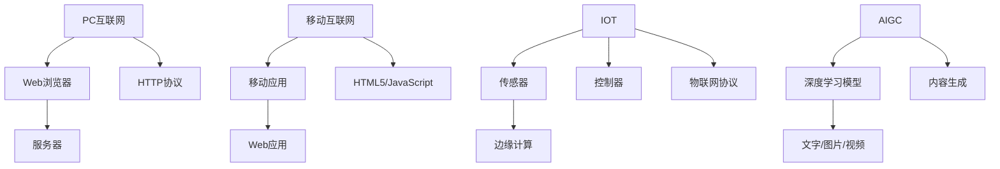

                 

关键词：互联网发展历程、技术演进、PC互联网、移动互联网、IOT、AIGC、技术趋势

> 摘要：本文将回顾从PC互联网到移动互联网，再到IOT（物联网）和AIGC（人工智能生成内容）的技术演进历程，探讨这些技术如何塑造了现代社会的信息交流和内容生产方式。通过深入分析技术原理、数学模型、算法实现和实际应用场景，我们将展望未来的发展趋势和面临的挑战，为读者提供一幅清晰的技术全景图。

## 1. 背景介绍

### PC互联网时代

PC互联网时代始于20世纪90年代，随着万维网（WWW）的普及，互联网开始从学术和政府领域走向大众。这一时期，个人电脑成为了信息获取和交流的主要工具，浏览器和电子邮件成为核心应用。Web 1.0时期，互联网更多地是一个信息发布和浏览的平台，用户处于被动接收信息的状态。

### 移动互联网时代

随着智能手机的普及和移动通信技术的进步，互联网进入了移动互联网时代。Web 2.0时期的到来，标志着用户从被动接收信息转变为主动参与和内容生产。社交媒体、移动应用、即时通讯等应用迅速崛起，彻底改变了人们的生活方式。移动互联网的普及，使得互联网不再局限于桌面电脑，人们可以随时随地获取信息和服务。

### IOT时代

物联网（IOT）时代的到来，进一步拓展了互联网的应用范围。通过将各种物理设备和传感器连接到互联网，IOT实现了设备间的互联互通，从而提升了设备的管理效率和生活品质。智能家居、智能城市、工业自动化等领域的兴起，标志着互联网技术从虚拟世界延伸到现实世界。

### AIGC时代

人工智能生成内容（AIGC）是近年来兴起的一个技术热点。基于深度学习和自然语言处理等技术，AIGC能够自动生成文章、图片、视频等多种形式的内容。AIGC的出现，不仅改变了内容生产方式，还为互联网应用带来了全新的可能性。

## 2. 核心概念与联系

### PC互联网

PC互联网的核心概念是连接，通过TCP/IP协议实现不同计算机之间的数据传输。Web浏览器作为客户端，通过HTTP协议请求服务器上的资源，从而实现信息的浏览和交互。

### 移动互联网

移动互联网的核心概念是移动性，通过移动通信网络（如3G、4G、5G）实现数据传输。移动应用和Web应用成为主要的用户交互方式，HTML5和JavaScript等技术的应用，使得移动端和桌面端的体验逐渐趋同。

### IOT

IOT的核心概念是物联网，通过传感器、控制器和通信模块实现物理设备之间的互联互通。物联网协议（如MQTT、CoAP）和边缘计算技术，使得数据处理更加高效和实时。

### AIGC

AIGC的核心概念是人工智能生成内容，通过深度学习模型（如GPT-3、DALL-E）自动生成文字、图片、视频等多样化的内容。AIGC技术不仅提高了内容生产效率，还为个性化推荐、虚拟现实等应用提供了新的可能性。

### Mermaid 流程图



## 3. 核心算法原理 & 具体操作步骤

### 3.1 算法原理概述

互联网技术的发展，离不开一系列核心算法的支持。从TCP/IP协议到HTTP协议，从深度学习模型到物联网协议，这些算法在实现数据传输、内容生成等方面发挥着关键作用。

### 3.2 算法步骤详解

#### 3.2.1 TCP/IP协议

TCP/IP协议是互联网通信的基础，其工作原理包括以下步骤：

1. **连接建立**：客户端发送SYN报文，服务器响应SYN-ACK报文，客户端再次响应ACK报文，建立连接。
2. **数据传输**：客户端和服务器之间通过发送数据报文进行数据传输。
3. **连接终止**：客户端发送FIN报文，服务器响应FIN-ACK报文，客户端再次响应ACK报文，连接终止。

#### 3.2.2 HTTP协议

HTTP协议是Web浏览器与服务器之间的通信协议，其工作原理包括以下步骤：

1. **请求**：客户端发送HTTP请求报文，包含请求方法（如GET、POST）、URL、HTTP头部等。
2. **响应**：服务器接收请求，根据请求方法返回HTTP响应报文，包含状态码、响应体等。

#### 3.2.3 深度学习模型

深度学习模型（如GPT-3、DALL-E）的工作原理包括以下步骤：

1. **输入**：输入待处理的数据（如文字、图片）。
2. **前向传播**：通过神经网络进行前向传播，计算出中间结果。
3. **反向传播**：根据预测误差，通过反向传播更新模型参数。
4. **优化**：使用优化算法（如梯度下降）不断调整模型参数，直至达到收敛。

#### 3.2.4 物联网协议

物联网协议（如MQTT、CoAP）的工作原理包括以下步骤：

1. **连接**：设备通过通信模块连接到网络。
2. **订阅/发布**：设备订阅感兴趣的主题，发布数据到对应主题。
3. **消息传递**：设备之间通过消息队列进行数据交换。

### 3.3 算法优缺点

#### TCP/IP协议

- 优点：可靠性高，适用范围广。
- 缺点：传输速度较慢，对网络环境要求较高。

#### HTTP协议

- 优点：简单易用，扩展性强。
- 缺点：安全性较低，难以应对高并发请求。

#### 深度学习模型

- 优点：强大的特征提取能力，适用于多种应用场景。
- 缺点：训练时间较长，对数据质量和计算资源要求较高。

#### 物联网协议

- 优点：实时性强，适用于低带宽、高延迟的网络环境。
- 缺点：协议复杂度较高，安全性较差。

### 3.4 算法应用领域

- TCP/IP协议：广泛应用于互联网通信，如Web浏览器、电子邮件等。
- HTTP协议：广泛应用于Web应用，如电子商务、在线教育等。
- 深度学习模型：广泛应用于自然语言处理、计算机视觉、推荐系统等领域。
- 物联网协议：广泛应用于智能家居、智能城市、工业自动化等领域。

## 4. 数学模型和公式 & 详细讲解 & 举例说明

### 4.1 数学模型构建

在互联网技术的发展过程中，许多数学模型被引入，用于描述网络协议、算法性能、数据传输等。以下介绍几个关键数学模型。

#### 4.1.1 TCP拥塞控制模型

TCP拥塞控制模型用于控制网络拥塞，保证数据传输的可靠性。其核心公式如下：

$$
cwnd = min(cwnd + 1, \alpha \cdot cwnd, \frac{cwnd}{ssthresh})
$$

其中，$cwnd$表示拥塞窗口大小，$\alpha$表示拥塞避免系数，$ssthresh$表示慢启动阈值。

#### 4.1.2 HTTP缓存策略模型

HTTP缓存策略模型用于优化数据传输效率。其核心公式如下：

$$
hit\_rate = \frac{cache\_hits}{cache\_hits + cache\_misses}
$$

其中，$hit\_rate$表示缓存命中率，$cache\_hits$表示缓存命中的次数，$cache\_misses$表示缓存未命中的次数。

#### 4.1.3 深度学习模型训练模型

深度学习模型训练模型用于优化模型参数，提高预测准确性。其核心公式如下：

$$
\theta_{t+1} = \theta_{t} - \alpha \cdot \nabla J(\theta_{t})
$$

其中，$\theta_{t}$表示当前模型参数，$\theta_{t+1}$表示更新后的模型参数，$\alpha$表示学习率，$J(\theta_{t})$表示损失函数。

#### 4.1.4 物联网网络延迟模型

物联网网络延迟模型用于描述物联网设备之间的通信延迟。其核心公式如下：

$$
delay = \sqrt{(\frac{distance}{speed})^2 + (\frac{processing\_time}{2})^2}
$$

其中，$distance$表示设备之间的距离，$speed$表示数据传输速度，$processing\_time$表示设备处理数据的时间。

### 4.2 公式推导过程

以TCP拥塞控制模型为例，介绍公式推导过程。

1. **初始化**：设初始拥塞窗口大小为1，即$cwnd_0 = 1$。
2. **慢启动阶段**：在慢启动阶段，拥塞窗口大小以指数增长，每收到一个确认包，拥塞窗口增加1。当拥塞窗口达到慢启动阈值$ssthresh$时，进入拥塞避免阶段。
3. **拥塞避免阶段**：在拥塞避免阶段，拥塞窗口大小以线性增长，每收到一个确认包，拥塞窗口增加$\alpha$。当出现拥塞时，拥塞窗口减半，重新进入慢启动阶段。

### 4.3 案例分析与讲解

以一个简单的HTTP缓存策略为例，分析缓存命中率的变化。

假设一个Web服务器每分钟接收100个请求，其中50个请求命中缓存，50个请求未命中缓存。根据缓存策略模型，缓存命中率为：

$$
hit\_rate = \frac{50}{50 + 50} = 0.5
$$

为了提高缓存命中率，可以采取以下策略：

1. **缓存预热**：在服务器开始工作前，提前加载热门页面到缓存中，提高初始缓存命中率。
2. **缓存淘汰策略**：根据访问频率、访问时间等因素，动态调整缓存中的内容，将热门内容优先缓存。
3. **缓存压缩**：对缓存中的内容进行压缩，减少缓存占用的存储空间，提高缓存命中率。

## 5. 项目实践：代码实例和详细解释说明

### 5.1 开发环境搭建

在本文中，我们将使用Python编写一个简单的HTTP缓存服务器。首先，需要安装Python环境和必要的库。

```bash
pip install flask
```

### 5.2 源代码详细实现

以下是简单的HTTP缓存服务器代码：

```python
from flask import Flask, request, jsonify
from werkzeug.contrib.cache import SimpleCache

app = Flask(__name__)
cache = SimpleCache()

@app.route('/<path:url>')
def proxy(url):
    # 检查缓存中是否有数据
    if cache.get(url):
        return cache.get(url)
    else:
        # 访问目标URL，获取响应数据
        response = requests.get(url)
        # 将响应数据缓存
        cache.set(url, response.text, timeout=60*60)
        return response.text

if __name__ == '__main__':
    app.run()
```

### 5.3 代码解读与分析

1. **Flask应用**：使用Flask构建HTTP缓存服务器。
2. **SimpleCache**：使用SimpleCache作为缓存后端，实现缓存功能。
3. **路由处理**：定义一个代理路由，处理客户端发送的请求。
4. **缓存检查**：首先检查缓存中是否有对应URL的数据，如果有则直接返回缓存数据。
5. **缓存更新**：如果缓存中没有对应数据，则访问目标URL获取响应数据，并将响应数据缓存。

### 5.4 运行结果展示

在本地搭建开发环境后，启动HTTP缓存服务器：

```bash
python cache_server.py
```

在浏览器中访问一个网站，如`http://example.com`，服务器将返回缓存数据或访问目标URL获取响应数据。

## 6. 实际应用场景

### 6.1 移动互联网应用

移动互联网应用广泛，如社交媒体、电子商务、在线教育等。以社交媒体为例，微信、微博、Facebook等平台已经成为人们日常交流的重要工具，这些平台不仅提供了便捷的信息获取渠道，还推动了社交网络的繁荣。

### 6.2 物联网应用

物联网应用涵盖智能家居、智能城市、工业自动化等多个领域。智能家居领域，智能音箱、智能灯泡等设备逐渐走进家庭；智能城市领域，智能交通、智能安防等应用正在提升城市管理水平；工业自动化领域，物联网技术助力企业实现生产线的智能化升级。

### 6.3 AIGC应用

AIGC技术正在改变内容生产方式，如文章写作、图像生成、视频编辑等。以文章写作为例，人工智能助手可以基于用户输入的关键词自动生成文章，提高内容生产效率。在图像生成领域，人工智能可以生成具有艺术感的图片，为设计师提供创意灵感。

## 7. 工具和资源推荐

### 7.1 学习资源推荐

- 《计算机网络：自顶向下方法》：详细讲解计算机网络原理，适合初学者。
- 《深度学习》：由Ian Goodfellow等作者撰写，系统介绍深度学习算法和应用。
- 《物联网基础》：介绍物联网的基本概念、技术和应用，适合入门读者。

### 7.2 开发工具推荐

- Flask：Python Web框架，用于快速搭建Web应用。
- TensorFlow：开源深度学习框架，支持多种深度学习模型。
- MQTT：物联网通信协议，适用于设备之间的消息传递。

### 7.3 相关论文推荐

- “The Google File System”：介绍Google文件系统设计原理，对分布式存储系统有很好的借鉴意义。
- “Large-scale Distributed Systems”: 系统讲解分布式系统设计原理和关键技术。
- “Generative Adversarial Nets”：介绍生成对抗网络（GAN）算法，是AIGC领域的经典论文。

## 8. 总结：未来发展趋势与挑战

### 8.1 研究成果总结

从PC互联网到移动互联网，再到IOT和AIGC，互联网技术不断演进，为人类带来了丰富的信息资源和便捷的生活方式。未来，随着5G、人工智能等新技术的不断发展，互联网将继续拓展其应用领域，为人类社会带来更多创新和变革。

### 8.2 未来发展趋势

1. **更加智能化的网络**：5G网络和人工智能技术的融合，将推动网络智能化水平的提升，实现更加高效、低延迟的网络通信。
2. **万物互联**：随着物联网技术的普及，越来越多的物理设备将接入互联网，实现智能设备的互联互通，构建智慧城市和智能工厂。
3. **人工智能生成内容**：AIGC技术将不断成熟，广泛应用于内容创作、个性化推荐、虚拟现实等领域，为互联网应用带来更多可能性。

### 8.3 面临的挑战

1. **数据安全和隐私保护**：随着互联网技术的普及，数据安全和隐私保护成为重要议题。如何确保用户数据安全、保护用户隐私，是互联网技术发展面临的重要挑战。
2. **网络基础设施建设**：5G、物联网等新技术的普及，需要强大的网络基础设施支撑。如何建设高效、稳定的网络基础设施，是互联网技术发展面临的关键挑战。
3. **技术人才短缺**：互联网技术发展迅速，对技术人才的需求也日益增长。如何培养和吸引更多的技术人才，是互联网行业面临的重要挑战。

### 8.4 研究展望

未来，互联网技术将继续向智能化、互联互通、个性化方向发展。在技术创新的同时，也要注重数据安全和隐私保护，推动网络基础设施的建设，培养更多技术人才。通过各方共同努力，互联网技术将为人类社会带来更多福祉。

## 9. 附录：常见问题与解答

### Q1: 什么是HTTP缓存？

A1: HTTP缓存是指Web服务器和客户端之间利用缓存机制存储和共享已访问过的网页资源，以减少重复请求，提高访问速度。

### Q2: 什么是物联网？

A2: 物联网（IOT）是指通过互联网将各种物理设备、传感器和控制系统连接起来，实现设备之间的互联互通和信息交换。

### Q3: 什么是AIGC？

A3: AIGC（人工智能生成内容）是指利用人工智能技术，如深度学习，自动生成文字、图片、视频等多种形式的内容。

### Q4: 如何保护用户数据安全？

A4: 为了保护用户数据安全，可以采取以下措施：

- 使用加密技术保护数据传输过程。
- 建立严格的访问控制机制，确保数据存储和处理的权限。
- 定期进行安全审计和风险评估，及时修补漏洞。

### Q5: 5G技术有哪些优势？

A5: 5G技术具有以下优势：

- 高速率：5G网络峰值速率可达10Gbps，远超4G网络。
- 低延迟：5G网络延迟低至1ms，适用于实时应用。
- 大连接：5G网络支持大规模设备连接，适用于物联网应用。

---

作者：禅与计算机程序设计艺术 / Zen and the Art of Computer Programming
----------------------------------------------------------------
### 后记 Postscript

随着科技的飞速发展，互联网技术已经深入到我们生活的方方面面。从PC互联网到移动互联网，从IOT到AIGC，每一次技术的变革都在深刻影响着人类社会。本文旨在回顾互联网技术的发展历程，探讨其核心概念和算法原理，以及在实际应用中的表现。在未来的道路上，我们还将面临诸多挑战，但只要我们紧跟时代潮流，勇于创新，定能开创更加美好的未来。让我们一起期待，互联网技术带给我们的无限可能！

