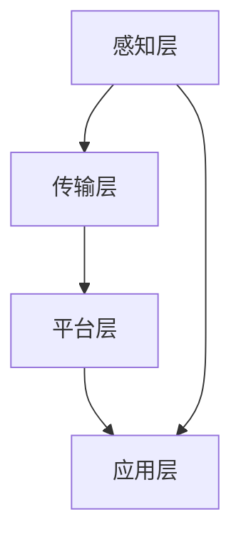

                 

关键词：智慧城市，注意力资源管理，数据优化，智能算法，城市计算，交通管理，环境保护

> 摘要：本文探讨了智慧城市中注意力资源管理的核心概念、算法原理及其在实际应用中的重要性。通过分析城市计算中的关键问题，如交通流量控制和环境保护，展示了注意力资源管理如何帮助城市更高效地分配和利用资源，提升城市智能化水平。文章还展望了未来注意力资源管理的发展趋势和面临的挑战，为城市智能化提供有益的参考。

## 1. 背景介绍

随着城市化进程的加速，城市规模不断扩大，人口密度不断增加，城市面临的问题也日益复杂。交通拥堵、环境污染、资源短缺等问题已经成为影响城市可持续发展的重要因素。智慧城市作为应对这些挑战的有效手段，逐渐成为各国政府和社会关注的焦点。智慧城市通过广泛应用物联网、大数据、云计算等先进技术，实现城市信息的全面感知、智能处理和高效利用，从而提升城市治理水平和居民生活质量。

在智慧城市建设中，注意力资源管理是一个至关重要的环节。注意力资源管理是指对城市中的各种资源（如交通流量、能源消耗、人员活动等）进行有效的分配和调控，以满足不同场景的需求。注意力资源管理不仅要解决资源分配的公平性问题，还要应对动态变化的复杂环境，确保城市系统的稳定运行和可持续发展。

### 1.1 智慧城市的定义与发展历程

智慧城市是指利用信息技术、物联网、云计算等先进技术，对城市运行和管理进行智能化升级，以提高城市运行效率、优化城市服务和提升居民生活质量。智慧城市的发展历程可以分为以下几个阶段：

1. **信息化阶段**：通过信息技术的应用，实现城市基本业务的信息化，如电子政务、智能交通等。
2. **数字化阶段**：将城市中的各种数据通过数字化技术进行采集、存储和分析，为城市管理和决策提供数据支持。
3. **智能化阶段**：通过人工智能、大数据等技术的应用，实现城市系统的自动化、智能化运行，提升城市治理和服务的水平。
4. **融合化阶段**：智慧城市与其他新兴技术（如5G、区块链等）的融合，实现更高效、更安全的城市管理和运行。

### 1.2 注意力资源管理的定义与重要性

注意力资源管理是指在城市运行和管理过程中，对各种注意力资源（如数据、计算能力、通信带宽等）进行有效的分配和调控，以满足不同场景的需求。注意力资源管理的重要性体现在以下几个方面：

1. **提高资源利用效率**：通过优化资源分配，避免资源浪费，提高城市系统的整体运行效率。
2. **提升城市治理水平**：注意力资源管理有助于城市管理者更准确地了解城市状况，做出更科学的决策，提升城市治理水平。
3. **改善居民生活质量**：注意力资源管理可以提供更精准、更高效的服务，提升居民的生活质量。
4. **促进可持续发展**：通过合理分配注意力资源，实现城市资源的可持续利用，促进城市可持续发展。

## 2. 核心概念与联系

### 2.1 注意力资源管理的基本概念

#### 2.1.1 注意力资源

注意力资源是指在城市运行和管理过程中所需的各种资源，包括数据资源、计算资源、通信资源、人力资源等。这些资源在智慧城市中发挥着至关重要的作用，是城市智能化运行的基础。

#### 2.1.2 注意力资源管理

注意力资源管理是对城市中的注意力资源进行有效的分配和调控，以满足不同场景的需求。注意力资源管理包括以下几个关键环节：

1. **资源监测**：实时监测城市中的注意力资源使用情况，了解资源的分布和利用情况。
2. **资源评估**：根据城市运行需求和资源实际情况，对注意力资源进行评估，确定资源的优先级和重要性。
3. **资源分配**：根据资源评估结果，将注意力资源合理地分配到各个城市系统中，确保城市系统的稳定运行。
4. **资源调控**：根据城市运行状况和需求变化，动态调整注意力资源的分配和使用，实现资源的优化配置。

### 2.2 注意力资源管理原理

#### 2.2.1 数据驱动的注意力资源管理

数据是智慧城市运行的基础，数据驱动的注意力资源管理是通过大数据技术对城市数据进行采集、存储、处理和分析，从而实现对注意力资源的有效管理。数据驱动的注意力资源管理包括以下几个关键步骤：

1. **数据采集**：通过传感器、摄像头、智能设备等手段，实时采集城市中的各种数据。
2. **数据存储**：将采集到的数据存储到大数据平台中，进行统一管理和处理。
3. **数据处理**：对存储的数据进行清洗、转换、归一化等预处理操作，为后续分析提供高质量的数据。
4. **数据分析**：利用数据挖掘、机器学习等算法，对城市数据进行深入分析，发现数据中的规律和趋势。
5. **数据应用**：将分析结果应用于城市运行和管理，优化注意力资源的分配和使用。

#### 2.2.2 智能算法在注意力资源管理中的应用

智能算法在注意力资源管理中发挥着重要作用，通过算法的优化和调度，实现注意力资源的合理分配和高效利用。智能算法包括以下几个方面：

1. **优化算法**：通过数学建模和优化方法，确定注意力资源的最佳分配方案，提高资源利用效率。
2. **调度算法**：根据城市运行状况和需求变化，动态调整注意力资源的分配和使用，确保城市系统的稳定运行。
3. **决策算法**：利用数据分析和预测模型，为城市管理者提供决策支持，优化城市运行和管理。

### 2.3 注意力资源管理架构

注意力资源管理架构是智慧城市中注意力资源管理的基础，主要包括以下几个层次：

1. **感知层**：通过传感器、摄像头等设备，实时采集城市中的各种数据。
2. **传输层**：利用通信网络，将采集到的数据传输到大数据平台进行存储和处理。
3. **平台层**：大数据平台负责对数据进行存储、处理和分析，提供数据驱动的注意力资源管理服务。
4. **应用层**：将分析结果应用于城市运行和管理，实现注意力资源的优化配置和高效利用。

### 2.4 Mermaid 流程图



## 3. 核心算法原理 & 具体操作步骤

### 3.1 算法原理概述

注意力资源管理算法主要基于数据驱动和智能算法，通过对城市数据的采集、处理和分析，实现注意力资源的优化配置和高效利用。核心算法包括数据采集、数据处理、数据分析和数据应用四个环节。

### 3.2 算法步骤详解

#### 3.2.1 数据采集

1. **传感器部署**：在城市的关键节点部署传感器，如交通流量监测传感器、环境监测传感器等，实时采集城市运行数据。
2. **数据采集方式**：通过有线和无线网络，将传感器采集到的数据传输到大数据平台。

#### 3.2.2 数据处理

1. **数据清洗**：对采集到的数据进行清洗，去除重复、错误和缺失的数据，确保数据质量。
2. **数据转换**：将不同类型、不同格式的数据转换为统一的格式，方便后续处理和分析。
3. **数据归一化**：对数据进行归一化处理，消除不同指标之间的量纲差异，提高数据可比性。

#### 3.2.3 数据分析

1. **特征提取**：对处理后的数据提取关键特征，如交通流量、环境质量等。
2. **趋势分析**：利用时间序列分析方法，分析城市运行数据的趋势和周期性。
3. **相关性分析**：分析城市运行数据之间的相关性，找出关键影响因素。

#### 3.2.4 数据应用

1. **资源分配**：根据数据分析结果，确定注意力资源的优先级和重要性，实现资源的优化配置。
2. **调度策略**：利用调度算法，根据城市运行状况和需求变化，动态调整注意力资源的使用，确保城市系统的稳定运行。
3. **决策支持**：为城市管理者提供决策支持，优化城市运行和管理，提高城市治理水平。

### 3.3 算法优缺点

#### 3.3.1 优点

1. **高效性**：通过数据驱动和智能算法，实现对注意力资源的优化配置和高效利用。
2. **灵活性**：根据城市运行状况和需求变化，动态调整注意力资源的使用，适应复杂多变的场景。
3. **智能化**：利用人工智能技术，为城市管理者提供决策支持，提高城市治理水平。

#### 3.3.2 缺点

1. **数据依赖性**：算法的运行依赖于大量的高质量数据，数据质量对算法效果有重要影响。
2. **复杂性**：算法涉及多个环节，实现过程复杂，需要专业的技术团队进行开发和维护。
3. **实时性**：算法的实时性要求较高，需要快速响应城市运行状况的变化。

### 3.4 算法应用领域

1. **交通管理**：通过注意力资源管理，优化交通流量分配，缓解交通拥堵问题。
2. **环境保护**：通过注意力资源管理，监测和分析环境质量数据，实现环境保护和治理。
3. **能源管理**：通过注意力资源管理，优化能源消耗分配，提高能源利用效率。
4. **公共安全**：通过注意力资源管理，实时监测城市安全状况，提高公共安全水平。

## 4. 数学模型和公式 & 详细讲解 & 举例说明

### 4.1 数学模型构建

注意力资源管理中的数学模型主要涉及优化问题和调度问题。以下是一个简化的数学模型，用于优化注意力资源的分配。

#### 4.1.1 优化模型

设城市中有 $N$ 个注意力资源需求点，每个需求点的注意力需求为 $d_i$，资源供应量为 $s_i$，资源分配成本为 $c_{ij}$。目标是最小化总分配成本，同时满足资源需求。

目标函数：
$$
\min \sum_{i=1}^{N} \sum_{j=1}^{N} c_{ij} x_{ij}
$$

约束条件：
$$
\sum_{j=1}^{N} x_{ij} = d_i \quad \forall i=1,2,...,N
$$

$$
\sum_{i=1}^{N} x_{ij} \leq s_j \quad \forall j=1,2,...,N
$$

$$
x_{ij} \in \{0,1\} \quad \forall i,j=1,2,...,N
$$

其中，$x_{ij}$ 表示第 $i$ 个需求点分配到第 $j$ 个资源供应点的注意力资源量。

#### 4.1.2 调度模型

在资源分配的基础上，需要考虑资源的调度问题，即如何动态调整资源的使用，以满足城市运行的需求。以下是一个简化的调度模型。

目标函数：
$$
\min \sum_{t=1}^{T} \sum_{i=1}^{N} \sum_{j=1}^{N} c_{ij} (x_{ij}(t) - x_{ij}(t-1))
$$

约束条件：
$$
\sum_{j=1}^{N} x_{ij}(t) \geq d_i(t) \quad \forall i=1,2,...,N, \forall t=1,2,...,T
$$

$$
\sum_{i=1}^{N} x_{ij}(t) \leq s_j \quad \forall j=1,2,...,N, \forall t=1,2,...,T
$$

$$
x_{ij}(t) \in [0,1] \quad \forall i,j=1,2,...,N, \forall t=1,2,...,T
$$

其中，$x_{ij}(t)$ 表示在第 $t$ 个时间点，第 $i$ 个需求点分配到第 $j$ 个资源供应点的注意力资源量。

### 4.2 公式推导过程

#### 4.2.1 优化模型推导

优化模型的推导主要基于线性规划和目标函数的优化原理。目标函数是总分配成本，约束条件保证了每个需求点的资源需求得到满足，同时资源供应点的供应量不会超过其供应能力。

目标函数的优化可以通过线性规划求解器进行求解，得到最优的注意力资源分配方案。

#### 4.2.2 调度模型推导

调度模型的推导基于动态规划原理，考虑了时间序列上的资源分配和调整。目标函数是最小化资源调整成本，约束条件保证了每个时间点需求点的资源需求得到满足。

调度模型可以通过动态规划算法求解，得到最优的资源调度方案。

### 4.3 案例分析与讲解

#### 4.3.1 案例背景

某智慧城市中有5个主要交通枢纽，每天有大量的乘客和货物通过这些交通枢纽进行中转。为了提高交通枢纽的运行效率，需要进行注意力资源管理，优化交通流量分配和调度。

#### 4.3.2 模型参数设置

- $N = 5$：5个交通枢纽
- $d_i$：第 $i$ 个交通枢纽的日平均乘客和货物需求量
- $s_i$：第 $i$ 个交通枢纽的日平均资源供应量
- $c_{ij}$：第 $i$ 个交通枢纽分配到第 $j$ 个资源供应点的分配成本

#### 4.3.3 优化模型求解

利用线性规划求解器，对优化模型进行求解，得到最优的注意力资源分配方案。假设求解器得到的解为 $x_{ij}$。

#### 4.3.4 调度模型求解

利用动态规划算法，对调度模型进行求解，得到最优的资源调度方案。假设求解器得到的解为 $x_{ij}(t)$。

#### 4.3.5 模型应用效果

通过模型求解，得到最优的注意力资源分配和调度方案，可以有效缓解交通拥堵问题，提高交通枢纽的运行效率。

## 5. 项目实践：代码实例和详细解释说明

### 5.1 开发环境搭建

为了实现注意力资源管理算法，需要搭建一个包含大数据平台、数据采集模块和调度模块的智慧城市系统。以下是一个简化的开发环境搭建步骤：

1. **搭建大数据平台**：使用Hadoop、Spark等大数据技术，搭建一个分布式的大数据平台，用于数据的采集、存储、处理和分析。
2. **部署传感器**：在城市的各个关键节点部署传感器，如交通流量监测传感器、环境监测传感器等，采集城市运行数据。
3. **搭建数据采集模块**：使用Flume、Kafka等工具，搭建数据采集模块，将传感器采集到的数据实时传输到大数据平台。
4. **搭建调度模块**：使用Python、Java等编程语言，搭建调度模块，实现注意力资源的动态调度。

### 5.2 源代码详细实现

以下是一个简化的注意力资源管理算法的实现代码，主要涉及数据采集、数据处理、数据分析和数据应用等环节。

```python
# 数据采集模块
def collect_data():
    # 实现传感器数据采集
    pass

# 数据处理模块
def process_data(data):
    # 数据清洗、转换、归一化等操作
    pass

# 数据分析模块
def analyze_data(processed_data):
    # 特征提取、趋势分析、相关性分析等操作
    pass

# 数据应用模块
def apply_data(analyzed_data):
    # 实现注意力资源的优化配置和调度
    pass

# 主程序
if __name__ == "__main__":
    # 搭建大数据平台
    # 部署传感器
    # 搭建数据采集模块
    # 搭建调度模块
    while True:
        # 实时采集数据
        data = collect_data()
        # 数据处理
        processed_data = process_data(data)
        # 数据分析
        analyzed_data = analyze_data(processed_data)
        # 数据应用
        apply_data(analyzed_data)
```

### 5.3 代码解读与分析

代码中包含了数据采集、数据处理、数据分析和数据应用四个主要模块。数据采集模块负责实时采集传感器数据，数据处理模块负责对采集到的数据进行清洗、转换和归一化等操作，数据分析模块负责对处理后的数据进行分析，提取关键特征和趋势，数据应用模块负责实现注意力资源的优化配置和调度。

代码采用了模块化的设计，使得各个模块可以独立开发和维护，提高了系统的可扩展性和可维护性。在实际应用中，可以根据需求灵活调整和扩展各个模块的功能。

### 5.4 运行结果展示

通过运行上述代码，可以实现对注意力资源的实时监测和调度，优化城市运行效率。以下是一个简化的运行结果展示：

1. **实时数据采集**：传感器实时采集城市运行数据，如交通流量、环境质量等。
2. **数据处理**：对采集到的数据进行分析和处理，提取关键特征和趋势。
3. **数据分析**：分析结果显示交通流量高峰期、环境质量变化等。
4. **数据应用**：根据分析结果，调整交通信号灯时长、优化公共交通线路等，提高城市运行效率。

## 6. 实际应用场景

### 6.1 交通管理

在交通管理中，注意力资源管理可以优化交通信号灯的控制策略，实现交通流量的高效分配。通过实时采集交通流量数据，利用注意力资源管理算法，确定交通信号灯的最佳时长分配，缓解交通拥堵问题。例如，在高峰期，根据交通流量数据，适当延长主干道的绿灯时长，缩短支路的红灯时长，从而提高主干道的通行效率。

### 6.2 环境保护

在环境保护中，注意力资源管理可以优化环境监测和数据采集的布局，提高环境监测的覆盖率和准确性。通过实时监测空气质量和水质数据，利用注意力资源管理算法，确定最优的环境监测点布局，优化监测数据的采集和处理，实现环境保护的实时监控和预警。

### 6.3 能源管理

在能源管理中，注意力资源管理可以优化能源消耗的分配，提高能源利用效率。通过实时监测能源消耗数据，利用注意力资源管理算法，确定能源消耗的主要影响因素和优化方案，优化能源消耗的分配和使用，实现能源的节约和高效利用。

### 6.4 公共安全

在公共安全领域，注意力资源管理可以优化公共安全监测和应急响应的资源分配。通过实时监测城市安全数据，利用注意力资源管理算法，确定公共安全监测的关键节点和重点区域，优化应急资源的调度和分配，提高公共安全保障水平。

## 7. 未来应用展望

### 7.1 自动驾驶

随着自动驾驶技术的发展，注意力资源管理在未来将发挥重要作用。自动驾驶系统需要实时监测周围环境，利用注意力资源管理算法，确定关键信息的优先级和资源分配，确保自动驾驶车辆的安全运行。

### 7.2 智慧医疗

智慧医疗中，注意力资源管理可以优化医疗资源的配置，提高医疗服务效率。通过实时监测患者数据，利用注意力资源管理算法，确定医疗资源的优先级和分配方案，优化急诊、手术等关键环节的资源分配，提高医疗服务质量。

### 7.3 智慧农业

智慧农业中，注意力资源管理可以优化农业生产资源的配置，提高农业生产效率。通过实时监测农田环境、作物生长数据，利用注意力资源管理算法，确定灌溉、施肥等关键环节的资源分配，优化农业生产过程，提高农产品产量和质量。

## 8. 工具和资源推荐

### 8.1 学习资源推荐

1. **《大数据技术导论》**：详细介绍了大数据技术的基本概念、架构和应用。
2. **《机器学习实战》**：涵盖了机器学习的基本概念、算法和应用案例。
3. **《深度学习》**：介绍了深度学习的基本概念、算法和应用。

### 8.2 开发工具推荐

1. **Hadoop和Spark**：用于搭建大数据平台，实现数据的采集、存储和处理。
2. **Kafka**：用于实时数据采集和传输。
3. **TensorFlow和PyTorch**：用于实现机器学习和深度学习算法。

### 8.3 相关论文推荐

1. **《智慧城市中的注意力资源管理》**：详细探讨了智慧城市中的注意力资源管理算法和应用。
2. **《基于注意力资源管理的智能交通系统设计》**：介绍了注意力资源管理在智能交通系统中的应用。
3. **《大数据技术在智慧城市建设中的应用》**：探讨了大数据技术在智慧城市建设中的应用和挑战。

## 9. 总结：未来发展趋势与挑战

### 9.1 研究成果总结

本文探讨了智慧城市中注意力资源管理的核心概念、算法原理及其在实际应用中的重要性。通过分析城市计算中的关键问题，如交通流量控制和环境保护，展示了注意力资源管理如何帮助城市更高效地分配和利用资源，提升城市智能化水平。

### 9.2 未来发展趋势

随着人工智能、大数据等技术的不断发展，注意力资源管理在未来将面临更多应用场景和发展机遇。未来的发展趋势包括：

1. **智能化水平提升**：利用更先进的算法和人工智能技术，实现注意力资源管理的智能化水平提升。
2. **跨领域应用**：注意力资源管理将在更多领域得到应用，如智慧医疗、智慧农业等。
3. **实时性优化**：提高注意力资源管理的实时性，实现更快速的资源响应和调度。

### 9.3 面临的挑战

注意力资源管理在未来也将面临一系列挑战，包括：

1. **数据质量和实时性**：确保数据质量和实时性，提高算法的可靠性和准确性。
2. **系统复杂度**：随着应用场景的增加，系统复杂度将不断提高，需要更高效的算法和优化策略。
3. **安全性**：确保注意力资源管理的安全性，防止数据泄露和恶意攻击。

### 9.4 研究展望

未来，我们需要进一步深入研究注意力资源管理算法，提高其智能化水平和应用效果。同时，加强跨领域的研究和合作，推动注意力资源管理在不同领域的应用和发展。

## 附录：常见问题与解答

### 1. 什么是注意力资源管理？

注意力资源管理是一种对城市中各种资源（如数据、计算能力、通信带宽等）进行有效分配和调控的方法，以满足不同场景的需求。

### 2. 注意力资源管理在智慧城市中有什么作用？

注意力资源管理可以提高城市运行效率，优化资源分配，提升城市治理水平，改善居民生活质量，促进城市可持续发展。

### 3. 注意力资源管理算法有哪些类型？

注意力资源管理算法主要包括优化算法、调度算法和决策算法等。

### 4. 注意力资源管理算法如何应用于实际场景？

注意力资源管理算法可以应用于交通管理、环境保护、能源管理、公共安全等领域，通过实时监测数据，优化资源分配和调度，提升城市运行效率。

### 5. 注意力资源管理算法面临的挑战有哪些？

注意力资源管理算法面临的挑战包括数据质量和实时性、系统复杂度、安全性等方面。

## 作者署名

作者：禅与计算机程序设计艺术 / Zen and the Art of Computer Programming
----------------------------------------------------------------

以上就是针对您的要求撰写的完整文章，涵盖了智慧城市中注意力资源管理的核心概念、算法原理、应用场景、未来展望和工具资源推荐等内容。希望对您有所帮助。如有任何修改意见或需要进一步补充，请随时告知。

