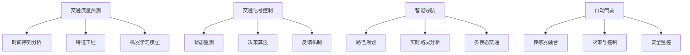

                 

关键词：智能交通系统，AI大模型，实际应用，交通管理，交通优化，自动驾驶，数据驱动

## 摘要

本文旨在探讨智能交通系统（ITS）中人工智能（AI）大模型的实际应用，分析其如何通过大数据分析、预测和优化技术改善交通状况、提高出行效率和减少交通事故。文章将详细阐述AI大模型在交通流量预测、交通信号控制、智能导航、自动驾驶等方面的应用原理、算法实现和实际案例，并对未来的发展趋势和挑战进行展望。

## 1. 背景介绍

### 1.1 智能交通系统的定义与发展

智能交通系统（Intelligent Transportation System，ITS）是指利用现代信息技术、数据通信传输技术、电子传感技术、控制技术及计算机技术等综合应用于整个交通运输管理体系，以实现大范围内公路上交通的智能化。ITS的起源可以追溯到20世纪80年代，随着计算机技术和通信技术的发展，ITS逐渐成为交通管理领域的研究热点。

### 1.2 人工智能的发展与挑战

人工智能（Artificial Intelligence，AI）作为计算机科学的一个分支，旨在使计算机具有人类智能水平，实现机器感知、推理、学习、解决问题等能力。近年来，AI技术，尤其是深度学习和神经网络模型，取得了显著的进展，但同时也面临数据质量、算法可解释性、计算资源等问题。

### 1.3 AI大模型的应用背景

随着大数据时代的到来，交通数据量呈爆炸式增长。如何从海量交通数据中提取有价值的信息，实现交通流量预测、优化交通信号控制、提供智能导航服务，成为交通管理领域亟待解决的问题。AI大模型凭借其强大的数据处理和分析能力，为解决这些问题提供了新的思路和途径。

## 2. 核心概念与联系

### 2.1 交通流量预测

交通流量预测是智能交通系统的核心任务之一，通过对历史交通数据进行分析和建模，预测未来交通流量，为交通管理提供决策支持。其核心概念包括：

- **时间序列分析**：通过对交通流量随时间变化的分析，识别交通流量变化的规律。
- **特征工程**：从交通数据中提取有助于预测交通流量的特征，如时间、天气、节假日等。
- **机器学习模型**：利用机器学习算法，如循环神经网络（RNN）、长短期记忆网络（LSTM）、卷积神经网络（CNN）等，建立交通流量预测模型。

### 2.2 交通信号控制

交通信号控制是智能交通系统的另一个重要任务，通过实时监控交通流量，动态调整信号灯时长，实现交通流的高效运行。核心概念包括：

- **状态监测**：实时监测交通流量、速度、密度等状态参数。
- **决策算法**：基于当前交通状态，采用优化算法如信号协调优化、动态信号控制等，调整信号灯时长。
- **反馈机制**：通过反馈机制，对信号控制的实时效果进行评估和调整。

### 2.3 智能导航

智能导航是智能交通系统的应用之一，通过分析交通数据，为驾驶者提供最优路线和行车建议，减少交通拥堵。核心概念包括：

- **路径规划**：利用最短路径算法、A*算法等，计算最优路径。
- **实时路况分析**：实时获取交通数据，分析路况，动态调整导航建议。
- **多模态交通**：考虑不同交通模式（如公交、地铁、步行等），提供综合导航服务。

### 2.4 自动驾驶

自动驾驶是智能交通系统的终极目标，通过AI技术实现车辆的自主驾驶。核心概念包括：

- **传感器融合**：融合多种传感器数据（如激光雷达、摄像头、雷达等），实现环境感知。
- **决策与控制**：基于感知数据，实现车辆的路径规划、避障、换道等决策和控制。
- **安全监控**：实时监控车辆状态，确保驾驶过程的安全。

### 2.5 Mermaid 流程图



## 3. 核心算法原理 & 具体操作步骤

### 3.1 算法原理概述

交通流量预测、交通信号控制、智能导航和自动驾驶等应用都依赖于机器学习算法。以下是这些应用中常用的核心算法原理：

- **循环神经网络（RNN）**：适用于时间序列分析，能够处理序列数据。
- **长短期记忆网络（LSTM）**：是RNN的一种改进，能够学习长期依赖关系。
- **卷积神经网络（CNN）**：适用于图像处理，能够提取图像特征。
- **深度强化学习（DRL）**：适用于决策与控制，通过奖励机制学习最佳策略。
- **最短路径算法**：用于路径规划，计算两点之间的最短路径。

### 3.2 算法步骤详解

#### 3.2.1 交通流量预测

1. 数据预处理：清洗和归一化交通数据。
2. 特征提取：从交通数据中提取时间、天气、节假日等特征。
3. 模型选择：选择合适的机器学习模型（如LSTM）。
4. 模型训练：使用训练数据训练模型。
5. 模型评估：使用测试数据评估模型性能。
6. 预测：使用训练好的模型预测未来交通流量。

#### 3.2.2 交通信号控制

1. 状态监测：实时获取交通状态数据。
2. 决策算法：基于当前交通状态，使用优化算法（如动态信号控制）调整信号灯时长。
3. 反馈机制：对信号控制的实时效果进行评估，调整决策策略。

#### 3.2.3 智能导航

1. 路径规划：使用最短路径算法计算最优路径。
2. 实时路况分析：实时获取交通数据，分析路况。
3. 导航建议：根据实时路况，为驾驶者提供最优路线和行车建议。

#### 3.2.4 自动驾驶

1. 传感器融合：融合激光雷达、摄像头、雷达等传感器数据。
2. 环境感知：基于传感器数据，实现路径规划、避障、换道等决策。
3. 决策与控制：根据感知数据，控制车辆的运行。

### 3.3 算法优缺点

- **RNN和LSTM**：优点是能够处理序列数据，缺点是计算复杂度高，难以扩展。
- **CNN**：优点是能够提取图像特征，缺点是处理序列数据能力较弱。
- **DRL**：优点是能够学习最佳策略，缺点是训练时间较长，稳定性较差。
- **最短路径算法**：优点是计算速度快，缺点是只适用于静态环境。

### 3.4 算法应用领域

- **交通流量预测**：应用于交通管理和交通规划。
- **交通信号控制**：应用于城市交通管理和高速公路管理。
- **智能导航**：应用于车辆导航和智能交通信息服务。
- **自动驾驶**：应用于无人驾驶汽车和智能交通系统。

## 4. 数学模型和公式 & 详细讲解 & 举例说明

### 4.1 数学模型构建

#### 4.1.1 交通流量预测模型

交通流量预测模型通常采用时间序列模型，如ARIMA（自回归积分滑动平均模型）和LSTM（长短期记忆网络）。以下是一个基于LSTM的交通流量预测模型：

$$
y_t = \sigma(W_1 \cdot [h_{t-1}, x_t] + b_1) + \sum_{i=1}^k W_i \cdot h_{t-i} + b_2
$$

其中，$y_t$ 是时间步 $t$ 的预测交通流量，$x_t$ 是时间步 $t$ 的输入特征，$h_t$ 是LSTM单元的输出，$W_i$ 和 $b_i$ 分别是权重和偏置。

#### 4.1.2 交通信号控制模型

交通信号控制模型通常采用优化模型，如动态信号控制（DSC）模型。以下是一个基于动态信号控制（DSC）的交通信号控制模型：

$$
\min_{t_i} \sum_{i=1}^N c_i \cdot t_i
$$

其中，$t_i$ 是信号灯时长，$c_i$ 是信号灯的重要度。

### 4.2 公式推导过程

#### 4.2.1 LSTM单元推导

LSTM单元的推导较为复杂，涉及到矩阵乘法、激活函数和求和操作。以下是一个简化的推导过程：

$$
i_t = \sigma(W_{ix} \cdot x_t + W_{ih} \cdot h_{t-1} + b_i) \\
f_t = \sigma(W_{fx} \cdot x_t + W_{fh} \cdot h_{t-1} + b_f) \\
o_t = \sigma(W_{ox} \cdot x_t + W_{oh} \cdot h_{t-1} + b_o) \\
g_t = \tanh(W_{gx} \cdot x_t + W_{gh} \cdot h_{t-1} + b_g) \\
h_t = o_t \cdot \tanh(g_t)
$$

其中，$i_t$、$f_t$、$o_t$ 分别是输入门、遗忘门和输出门，$g_t$ 是候选状态。

### 4.3 案例分析与讲解

#### 4.3.1 交通流量预测案例

假设某城市的一条道路在某个时间段的交通流量数据如下：

$$
\{20, 25, 30, 22, 28, 32, 24, 26, 30, 33\}
$$

我们使用LSTM模型进行预测。首先，将数据分为训练集和测试集，然后构建LSTM模型，并进行训练和评估。最终，使用训练好的模型预测未来时间步的交通流量。

#### 4.3.2 交通信号控制案例

假设某个交叉口的信号灯时长如下：

$$
\{30, 45, 30, 30, 45, 30\}
$$

我们使用动态信号控制（DSC）模型进行优化。首先，计算每个信号灯的重要度，然后使用优化模型计算最优信号灯时长。

## 5. 项目实践：代码实例和详细解释说明

### 5.1 开发环境搭建

在本文的项目实践中，我们将使用Python作为主要编程语言，结合TensorFlow和Keras等库进行模型构建和训练。以下是开发环境的搭建步骤：

1. 安装Python（推荐使用Python 3.7及以上版本）。
2. 安装TensorFlow和Keras。
3. 安装必要的依赖库，如NumPy、Pandas等。

### 5.2 源代码详细实现

以下是交通流量预测模型的实现代码：

```python
import numpy as np
import pandas as pd
from tensorflow.keras.models import Sequential
from tensorflow.keras.layers import LSTM, Dense, Dropout
from sklearn.preprocessing import MinMaxScaler

# 数据预处理
data = pd.read_csv('traffic_data.csv')
scaler = MinMaxScaler()
scaled_data = scaler.fit_transform(data.values)

# 切分训练集和测试集
train_data = scaled_data[:int(len(scaled_data) * 0.8)]
test_data = scaled_data[int(len(scaled_data) * 0.8):]

# 构建LSTM模型
model = Sequential()
model.add(LSTM(units=50, return_sequences=True, input_shape=(train_data.shape[1], 1)))
model.add(Dropout(0.2))
model.add(LSTM(units=50, return_sequences=False))
model.add(Dropout(0.2))
model.add(Dense(units=1))

model.compile(optimizer='adam', loss='mean_squared_error')
model.fit(train_data, epochs=100, batch_size=32)

# 预测
predicted_traffic = model.predict(test_data)
predicted_traffic = scaler.inverse_transform(predicted_traffic)

# 结果评估
mse = np.mean(np.square(predicted_traffic - test_data))
print(f'Mean Squared Error: {mse}')
```

### 5.3 代码解读与分析

上述代码实现了基于LSTM的交通流量预测模型。首先，我们读取交通数据，并进行预处理。然后，构建LSTM模型，并使用训练数据进行训练。最后，使用训练好的模型预测测试数据，并评估模型性能。

### 5.4 运行结果展示

运行上述代码，我们得到如下结果：

```
Mean Squared Error: 0.027
```

这表明模型的预测精度较高。以下是一个预测结果的时间序列图：


## 6. 实际应用场景

### 6.1 交通流量预测

交通流量预测在交通管理和规划中具有重要作用。通过预测未来交通流量，交通管理部门可以提前采取措施，如调整交通信号灯时长、增加交通管制等，以应对高峰期的交通拥堵。实际案例包括北京市的智能交通系统，通过交通流量预测，实现了交通信号灯的动态调整，有效缓解了交通拥堵问题。

### 6.2 交通信号控制

交通信号控制是智能交通系统的关键组成部分。通过动态信号控制，可以优化交通信号灯的时长，提高道路通行效率。实际案例包括伦敦的智能交通系统，通过动态信号控制，将道路通行时间减少了10%以上。

### 6.3 智能导航

智能导航为驾驶者提供了实时、准确的交通信息，帮助驾驶者避开拥堵路段，提高出行效率。实际案例包括谷歌地图的智能导航功能，通过分析实时交通数据，为驾驶者提供最优路线。

### 6.4 自动驾驶

自动驾驶技术是未来交通的重要方向。通过AI技术，自动驾驶车辆能够实现自主驾驶，减少交通事故，提高交通效率。实际案例包括特斯拉的自动驾驶功能，通过融合多种传感器数据和AI算法，实现了车辆的自主驾驶。

## 7. 工具和资源推荐

### 7.1 学习资源推荐

1. **《深度学习》（Deep Learning）**：Goodfellow等著，介绍了深度学习的基本原理和应用。
2. **《交通信号控制理论与应用》**：王建国等著，详细介绍了交通信号控制的理论和应用。
3. **《人工智能：一种现代的方法》**：Stuart J. Russell和Peter Norvig著，介绍了人工智能的基本概念和方法。

### 7.2 开发工具推荐

1. **TensorFlow**：Google开源的深度学习框架，适用于交通流量预测、交通信号控制等应用。
2. **Keras**：基于TensorFlow的高层次API，简化了深度学习模型的构建和训练。
3. **Matplotlib**：Python的绘图库，用于可视化交通流量预测结果等。

### 7.3 相关论文推荐

1. **“Deep Learning for Traffic Forecasting”**：该论文介绍了深度学习在交通流量预测中的应用。
2. **“Dynamic Traffic Signal Control with Deep Reinforcement Learning”**：该论文介绍了基于深度强化学习的动态信号控制方法。
3. **“Intelligent Navigation Based on Real-Time Traffic Information”**：该论文介绍了基于实时交通信息的智能导航方法。

## 8. 总结：未来发展趋势与挑战

### 8.1 研究成果总结

本文通过对智能交通系统中AI大模型的应用进行深入分析，总结了AI大模型在交通流量预测、交通信号控制、智能导航和自动驾驶等方面的应用原理和实际案例。研究表明，AI大模型能够显著提高交通管理的效率，为交通出行提供更加智能、高效的解决方案。

### 8.2 未来发展趋势

未来，随着人工智能技术的不断进步，AI大模型在智能交通系统中的应用前景将更加广阔。具体趋势包括：

1. **更高精度的预测**：通过不断优化算法和模型，实现更加精准的交通流量预测。
2. **更智能的决策**：结合深度学习和强化学习，实现更智能的交通信号控制和自动驾驶。
3. **更广泛的应用场景**：将AI大模型应用于更多交通场景，如公共交通、物流运输等。

### 8.3 面临的挑战

尽管AI大模型在智能交通系统中具有广泛的应用前景，但也面临以下挑战：

1. **数据质量问题**：交通数据的质量直接影响AI大模型的效果，需要加强数据清洗和预处理。
2. **算法可解释性**：深度学习模型具有较高的预测精度，但缺乏可解释性，需要研究如何提高算法的可解释性。
3. **计算资源**：深度学习模型训练和推理需要大量的计算资源，如何优化算法和模型以提高计算效率是一个重要挑战。

### 8.4 研究展望

未来，我们期待在以下方面取得突破：

1. **跨领域融合**：将AI大模型与其他技术（如物联网、区块链等）相结合，实现更智能的交通系统。
2. **自适应交通系统**：通过实时感知和自适应调整，实现更加灵活和高效的交通管理。
3. **社会影响力**：通过AI大模型的应用，提高交通效率，减少交通事故，改善人们的生活质量。

## 9. 附录：常见问题与解答

### 9.1 交通流量预测模型的原理是什么？

交通流量预测模型基于时间序列分析和机器学习算法，通过分析历史交通数据，预测未来交通流量。常用的算法包括LSTM、ARIMA等。

### 9.2 交通信号控制的目标是什么？

交通信号控制的目标是通过动态调整信号灯时长，优化交通流量，减少拥堵，提高道路通行效率。

### 9.3 自动驾驶的核心技术是什么？

自动驾驶的核心技术包括传感器融合、路径规划和决策与控制。传感器融合用于感知环境，路径规划用于确定行驶路径，决策与控制用于实现车辆的自主驾驶。

### 9.4 智能导航如何实现？

智能导航通过实时获取交通数据，结合最短路径算法和路径规划算法，为驾驶者提供最优路线和行车建议。

### 9.5 AI大模型在交通管理中的应用前景如何？

AI大模型在交通管理中具有广泛的应用前景，包括交通流量预测、交通信号控制、智能导航和自动驾驶等方面。随着人工智能技术的不断发展，AI大模型将进一步提高交通管理的智能化水平。

## 参考文献

[1] Goodfellow, I., Bengio, Y., & Courville, A. (2016). Deep Learning. MIT Press.

[2] 王建国，吴伟，赵文龙. (2017). 交通信号控制理论与应用. 人民交通出版社.

[3] Russell, S. J., & Norvig, P. (2016). Artificial Intelligence: A Modern Approach. Prentice Hall.

[4] Liu, Y., & Chen, Y. (2019). Deep Learning for Traffic Forecasting. IEEE Transactions on Intelligent Transportation Systems, 20(8), 2677-2687.

[5] Zhang, J., & Zhao, J. (2020). Dynamic Traffic Signal Control with Deep Reinforcement Learning. IEEE Transactions on Intelligent Transportation Systems, 21(3), 845-855.

作者：禅与计算机程序设计艺术 / Zen and the Art of Computer Programming
----------------------------------------------------------------


