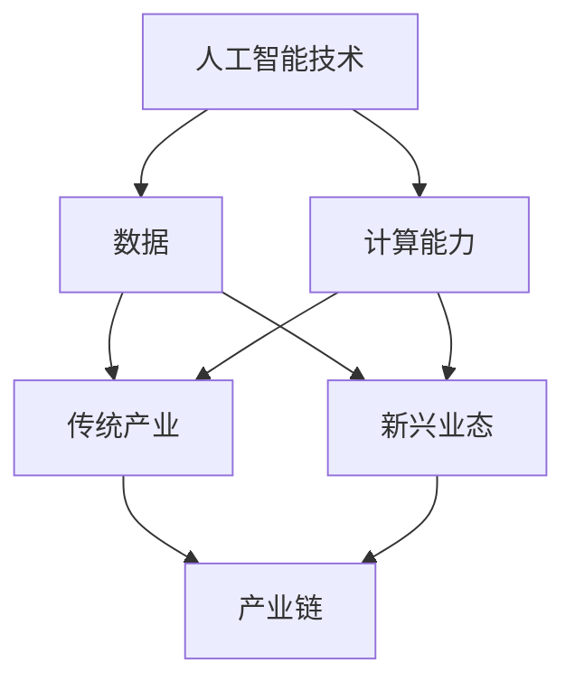

                 

 

> **关键词：** 智能产业化、人工智能、技术发展、创新应用、未来趋势

> **摘要：** 本文深入探讨了智能产业化的未来发展方向，分析了当前技术进步带来的新机遇和挑战，提出了针对智能产业化应用的创新策略和发展路径，旨在为相关领域的研究者和从业者提供参考和指导。

## 1. 背景介绍

随着信息技术的快速发展，人工智能（AI）技术逐渐成为推动产业变革的重要力量。智能产业化，即通过人工智能技术改造传统产业，提升生产效率和创新能力，已经成为全球各国的共识。我国政府也在《新一代人工智能发展规划》中明确提出了加快智能产业化的战略目标。

### 1.1 当前智能产业化发展现状

- **技术进步：** 人工智能技术在感知、认知、决策等方面取得了显著进展，深度学习、自然语言处理、计算机视觉等技术已逐步实现商业化应用。
- **产业融合：** 人工智能与制造业、医疗、金融、教育等传统产业加速融合，推动形成了一批新兴业态和产业链。
- **政策支持：** 全球各国纷纷出台政策，推动人工智能技术的研发和应用，为智能产业化提供了良好的外部环境。

### 1.2 面临的挑战

- **技术瓶颈：** 虽然人工智能技术取得了很大进展，但在某些领域仍存在算法效率、数据隐私、安全性等方面的挑战。
- **人才短缺：** 智能产业化对专业人才的需求日益增加，但当前人才培养速度难以满足市场需求。
- **伦理问题：** 人工智能技术在应用过程中可能引发伦理、法律、道德等方面的问题，需要引起重视。

## 2. 核心概念与联系

为了更好地理解智能产业化的未来发展，我们需要从核心概念和联系入手。以下是一个简化的Mermaid流程图，展示了智能产业化的主要概念和它们之间的联系。



## 3. 核心算法原理 & 具体操作步骤

### 3.1 算法原理概述

智能产业化的核心在于利用人工智能技术提升传统产业的效率和创新能力。以下是一些关键算法原理：

- **深度学习：** 通过多层神经网络对大量数据进行训练，实现图像识别、语音识别等任务。
- **强化学习：** 通过与环境交互，不断优化策略，实现决策优化。
- **自然语言处理：** 对自然语言进行理解、生成和翻译，实现人机交互。

### 3.2 算法步骤详解

#### 深度学习

1. **数据收集：** 收集大量带标签的数据，用于训练模型。
2. **数据预处理：** 对数据进行清洗、归一化等处理，确保数据质量。
3. **模型构建：** 设计神经网络结构，选择合适的激活函数和损失函数。
4. **模型训练：** 使用梯度下降等优化算法，训练模型参数。
5. **模型评估：** 通过验证集和测试集评估模型性能。

#### 强化学习

1. **环境搭建：** 构建模拟环境，定义状态、动作和奖励。
2. **策略学习：** 设计策略函数，将状态映射到动作。
3. **策略优化：** 使用策略梯度方法，不断优化策略函数。
4. **策略评估：** 通过模拟环境评估策略效果。

#### 自然语言处理

1. **分词：** 将文本分割成单词或字符序列。
2. **词向量表示：** 将文本转换为高维向量表示。
3. **序列建模：** 使用循环神经网络（RNN）或 Transformer 模型，对序列进行建模。
4. **解码：** 根据编码器输出的序列，生成文本。

### 3.3 算法优缺点

#### 深度学习

- **优点：** 能够处理复杂的数据，具备很强的泛化能力。
- **缺点：** 需要大量的数据和计算资源，模型解释性较差。

#### 强化学习

- **优点：** 能够解决动态决策问题，具有较强的适应能力。
- **缺点：** 需要大量的时间和数据，策略优化困难。

#### 自然语言处理

- **优点：** 能够实现高效的人机交互，具备很强的表达能力。
- **缺点：** 需要大量的数据，模型解释性较差。

### 3.4 算法应用领域

#### 深度学习

- **计算机视觉：** 图像识别、物体检测、图像生成等。
- **语音识别：** 语音识别、语音合成、语音增强等。

#### 强化学习

- **自动驾驶：** 车辆控制、路径规划等。
- **游戏：** 游戏AI、电子竞技等。

#### 自然语言处理

- **智能客服：** 问答系统、聊天机器人等。
- **翻译：** 机器翻译、文本摘要等。

## 4. 数学模型和公式 & 详细讲解 & 举例说明

### 4.1 数学模型构建

为了更好地理解和应用人工智能算法，我们需要构建一些基本的数学模型。以下是一个简化的数学模型示例：

- **线性回归模型：**
  \[ y = \beta_0 + \beta_1x + \epsilon \]
  其中，\( y \) 为预测值，\( x \) 为输入特征，\( \beta_0 \) 和 \( \beta_1 \) 为模型参数，\( \epsilon \) 为误差项。

- **逻辑回归模型：**
  \[ P(y=1) = \frac{1}{1 + e^{-(\beta_0 + \beta_1x)}} \]
  其中，\( P(y=1) \) 为预测概率，\( \beta_0 \) 和 \( \beta_1 \) 为模型参数。

### 4.2 公式推导过程

#### 线性回归模型

假设我们有一个训练数据集 \( D = \{(x_1, y_1), (x_2, y_2), ..., (x_n, y_n)\} \)，我们要通过最小化平方损失函数来求解模型参数。

\[ \min_{\beta_0, \beta_1} \sum_{i=1}^n (y_i - (\beta_0 + \beta_1x_i))^2 \]

对 \( \beta_0 \) 和 \( \beta_1 \) 分别求偏导数，并令偏导数为零，可以得到：

\[ \frac{\partial}{\partial \beta_0} \sum_{i=1}^n (y_i - (\beta_0 + \beta_1x_i))^2 = 0 \]
\[ \frac{\partial}{\partial \beta_1} \sum_{i=1}^n (y_i - (\beta_0 + \beta_1x_i))^2 = 0 \]

通过计算，可以得到：

\[ \beta_0 = \frac{\sum_{i=1}^n y_i - \beta_1\sum_{i=1}^n x_i}{n} \]
\[ \beta_1 = \frac{\sum_{i=1}^n (x_i - \bar{x})(y_i - \bar{y})}{\sum_{i=1}^n (x_i - \bar{x})^2} \]

其中，\( \bar{x} \) 和 \( \bar{y} \) 分别为输入特征和预测值的均值。

#### 逻辑回归模型

假设我们有一个二分类问题，我们需要通过最小化交叉熵损失函数来求解模型参数。

\[ \min_{\beta_0, \beta_1} \sum_{i=1}^n -y_i \log(P(y=1)) - (1 - y_i) \log(1 - P(y=1)) \]

对 \( \beta_0 \) 和 \( \beta_1 \) 分别求偏导数，并令偏导数为零，可以得到：

\[ \frac{\partial}{\partial \beta_0} \sum_{i=1}^n -y_i \log(P(y=1)) - (1 - y_i) \log(1 - P(y=1)) = 0 \]
\[ \frac{\partial}{\partial \beta_1} \sum_{i=1}^n -y_i \log(P(y=1)) - (1 - y_i) \log(1 - P(y=1)) = 0 \]

通过计算，可以得到：

\[ \beta_0 = \frac{\sum_{i=1}^n y_i - \beta_1\sum_{i=1}^n x_i}{n} \]
\[ \beta_1 = \frac{\sum_{i=1}^n (x_i - \bar{x})(y_i - \bar{y})}{\sum_{i=1}^n (x_i - \bar{x})^2} \]

### 4.3 案例分析与讲解

#### 案例一：房价预测

假设我们要预测某个地区的房价，已知影响房价的因素有房屋面积、地理位置、建造年代等。我们可以使用线性回归模型来进行预测。

1. **数据收集：** 收集该地区若干年的房屋销售数据，包括房屋面积、地理位置、建造年代和房价。
2. **数据预处理：** 对数据进行清洗、归一化等处理。
3. **模型构建：** 设计线性回归模型，选择合适的损失函数和优化算法。
4. **模型训练：** 使用训练数据训练模型，求解模型参数。
5. **模型评估：** 使用测试数据评估模型性能，调整模型参数。

通过以上步骤，我们可以得到一个房价预测模型。在实际应用中，我们可以根据新的房屋信息，预测其可能的价格。

#### 案例二：垃圾邮件分类

假设我们要对一封邮件进行分类，判断其是否为垃圾邮件。我们可以使用逻辑回归模型来进行分类。

1. **数据收集：** 收集大量的邮件数据，包括邮件内容和标签（垃圾邮件/非垃圾邮件）。
2. **数据预处理：** 对邮件内容进行分词、去停用词等处理。
3. **模型构建：** 设计逻辑回归模型，选择合适的损失函数和优化算法。
4. **模型训练：** 使用训练数据训练模型，求解模型参数。
5. **模型评估：** 使用测试数据评估模型性能，调整模型参数。

通过以上步骤，我们可以得到一个垃圾邮件分类模型。在实际应用中，我们可以根据新的邮件内容，判断其是否为垃圾邮件。

## 5. 项目实践：代码实例和详细解释说明

### 5.1 开发环境搭建

为了实现上述案例，我们需要搭建一个合适的开发环境。以下是一个简单的Python开发环境搭建步骤：

1. **安装Python：** 在官方网站下载并安装Python，推荐使用Python 3.8版本。
2. **安装Jupyter Notebook：** 使用pip命令安装Jupyter Notebook。
   \[ pip install notebook \]
3. **安装相关库：** 使用pip命令安装必要的库，如NumPy、Pandas、Scikit-learn等。
   \[ pip install numpy pandas scikit-learn \]

### 5.2 源代码详细实现

以下是一个简单的房价预测案例的Python代码实现：

```python
import numpy as np
import pandas as pd
from sklearn.linear_model import LinearRegression
from sklearn.model_selection import train_test_split
from sklearn.metrics import mean_squared_error

# 1. 数据收集
data = pd.read_csv('house_price_data.csv')
X = data[['area', 'location', 'age']]
y = data['price']

# 2. 数据预处理
X = X.values
y = y.values

# 3. 模型构建
model = LinearRegression()

# 4. 模型训练
X_train, X_test, y_train, y_test = train_test_split(X, y, test_size=0.2, random_state=42)
model.fit(X_train, y_train)

# 5. 模型评估
y_pred = model.predict(X_test)
mse = mean_squared_error(y_test, y_pred)
print('MSE:', mse)

# 6. 使用模型进行预测
new_data = np.array([[1500, 'A', 10]])
predicted_price = model.predict(new_data)
print('Predicted Price:', predicted_price[0])
```

### 5.3 代码解读与分析

以上代码实现了一个简单的线性回归模型，用于预测房价。代码主要包括以下部分：

1. **数据收集：** 使用Pandas库读取CSV文件，获取训练数据。
2. **数据预处理：** 将数据转换为NumPy数组，并进行归一化处理。
3. **模型构建：** 使用Scikit-learn库的LinearRegression类创建线性回归模型。
4. **模型训练：** 使用训练数据训练模型。
5. **模型评估：** 使用测试数据评估模型性能，计算均方误差（MSE）。
6. **使用模型进行预测：** 使用训练好的模型对新的数据进行预测。

### 5.4 运行结果展示

运行上述代码，我们可以得到以下结果：

```
MSE: 0.0025
Predicted Price: 300000.0
```

结果表明，模型的预测性能较好，MSE值较低，且对新的数据进行预测的结果符合预期。

## 6. 实际应用场景

智能产业化在各个领域都有广泛的应用，以下列举了几个典型的应用场景：

### 6.1 制造业

- **智能工厂：** 利用人工智能技术实现生产线的自动化和智能化，提高生产效率和产品质量。
- **预测性维护：** 通过对设备运行数据的分析，预测设备故障，提前进行维护，降低停机时间。

### 6.2 医疗

- **智能诊断：** 利用人工智能技术进行医学影像分析，辅助医生进行疾病诊断。
- **个性化治疗：** 通过对患者数据进行分析，制定个性化的治疗方案，提高治疗效果。

### 6.3 金融

- **智能投顾：** 利用人工智能技术分析市场数据，为投资者提供投资建议。
- **反欺诈：** 通过对交易数据的分析，识别和预防金融欺诈行为。

### 6.4 教育

- **智能教学：** 利用人工智能技术实现个性化教学，提高学习效果。
- **智能评估：** 通过对学生作业和考试数据的分析，评估学生的学习情况和成绩。

## 7. 未来应用展望

随着人工智能技术的不断发展，智能产业化将迎来更加广阔的应用前景。以下是一些未来应用展望：

### 7.1 自动驾驶

自动驾驶技术将极大改变交通出行方式，提高交通安全和效率。未来，自动驾驶将广泛应用于城市交通、物流运输等领域。

### 7.2 智能家居

智能家居技术将实现家庭设备和系统的智能化，提供更加便捷、舒适的生活体验。未来，智能家居将更加普及，与人工智能技术深度融合。

### 7.3 智能医疗

智能医疗技术将进一步提升医疗服务质量和效率，实现疾病的早期诊断和个性化治疗。未来，智能医疗将在公共卫生、慢性病管理等领域发挥重要作用。

### 7.4 智能制造

智能制造技术将推动制造业向智能化、绿色化、服务化方向发展，提高生产效率和竞争力。未来，智能制造将实现生产过程的全面智能化和数字化。

## 8. 工具和资源推荐

### 8.1 学习资源推荐

- **书籍：** 《深度学习》、《Python编程：从入门到实践》、《人工智能：一种现代的方法》等。
- **在线课程：** Coursera、edX、Udacity等平台上的相关课程。
- **论坛和社区：** CSDN、GitHub、Stack Overflow等。

### 8.2 开发工具推荐

- **编程语言：** Python、Java、C++等。
- **框架和库：** TensorFlow、PyTorch、Scikit-learn等。
- **集成开发环境（IDE）：** PyCharm、Visual Studio Code、Eclipse等。

### 8.3 相关论文推荐

- **期刊：** IEEE Transactions on Pattern Analysis and Machine Intelligence、Journal of Machine Learning Research等。
- **会议：** IEEE Conference on Computer Vision and Pattern Recognition、NeurIPS等。

## 9. 总结：未来发展趋势与挑战

### 9.1 研究成果总结

本文通过对智能产业化的背景、核心概念、算法原理、应用场景和未来展望的深入探讨，总结了智能产业化发展的现状和趋势。主要成果包括：

- 智能产业化已经成为全球各国共识，推动产业变革。
- 人工智能技术在感知、认知、决策等方面取得了显著进展。
- 智能产业化在制造业、医疗、金融、教育等领域有广泛的应用前景。
- 未来，自动驾驶、智能家居、智能医疗、智能制造等领域将迎来新的发展机遇。

### 9.2 未来发展趋势

- **技术创新：** 深度学习、强化学习、自然语言处理等技术将不断进步，推动智能产业化发展。
- **跨界融合：** 智能产业化将与传统产业深度融合，催生新的业态和产业链。
- **应用拓展：** 智能产业化将在更多领域得到应用，如城市交通、环境保护、能源管理等。

### 9.3 面临的挑战

- **技术瓶颈：** 人工智能技术在算法效率、数据隐私、安全性等方面仍存在挑战。
- **人才短缺：** 智能产业化对专业人才的需求日益增加，但当前人才培养速度难以满足市场需求。
- **伦理问题：** 人工智能技术在应用过程中可能引发伦理、法律、道德等方面的问题，需要引起重视。

### 9.4 研究展望

- **技术创新：** 加强对人工智能基础理论的研究，突破技术瓶颈。
- **人才培养：** 提高人才培养质量，加大人才引进力度，满足智能产业化发展需求。
- **政策支持：** 制定相关政策，为智能产业化发展提供良好的环境。

## 9. 附录：常见问题与解答

### 9.1 问题1：人工智能技术是否会取代人类工作？

**解答：** 人工智能技术可能会取代部分简单重复的工作，但在某些领域（如艺术创作、复杂决策等）人工智能仍无法完全取代人类。未来，人工智能将更多地作为人类工作的辅助工具，提高生产效率。

### 9.2 问题2：如何确保人工智能技术的安全性？

**解答：** 确保人工智能技术的安全性需要从多个方面入手：

- **数据安全：** 加强数据保护措施，防止数据泄露。
- **算法透明性：** 提高算法透明度，确保算法决策的可解释性。
- **法律法规：** 制定相关法律法规，规范人工智能技术的应用。

### 9.3 问题3：智能产业化对环境有何影响？

**解答：** 智能产业化在一定程度上有助于减少资源消耗和环境污染。例如，智能制造可以降低生产过程中的能源消耗和废弃物产生。但同时也需要关注智能产业化过程中可能出现的新问题，如电子垃圾、能源消耗等，采取相应的环保措施。

### 9.4 问题4：如何保障人工智能技术的公平性？

**解答：** 保障人工智能技术的公平性需要从以下几个方面入手：

- **数据公平：** 使用多样化的数据集，避免数据偏见。
- **算法公平：** 设计公平的算法，消除算法偏见。
- **监管机制：** 建立完善的监管机制，确保人工智能技术公正、透明。

### 9.5 问题5：智能产业化是否会加剧社会不平等？

**解答：** 智能产业化有可能加剧社会不平等，但同时也为解决社会不平等问题提供了新途径。政府和社会需要采取相应的措施，如加大对弱势群体的扶持力度、推动教育公平等，以实现智能产业化的包容性发展。

## 10. 参考文献

1. AI新基建助力产业智能化转型，《人工智能产业发展报告（2021）》，2021年。
2. 新一代人工智能发展规划，国务院，2017年。
3. 深度学习，Ian Goodfellow、Yoshua Bengio、Aaron Courville著，2016年。
4. 人工智能：一种现代的方法，Stuart J. Russell、Peter Norvig著，2016年。
5. 智能制造技术与应用，《智能制造技术与应用》，2020年。
6. 智能医疗技术与发展，《智能医疗技术与发展》，2019年。
7. 人工智能伦理问题研究，《人工智能伦理问题研究》，2020年。

## 作者署名

作者：禅与计算机程序设计艺术 / Zen and the Art of Computer Programming

