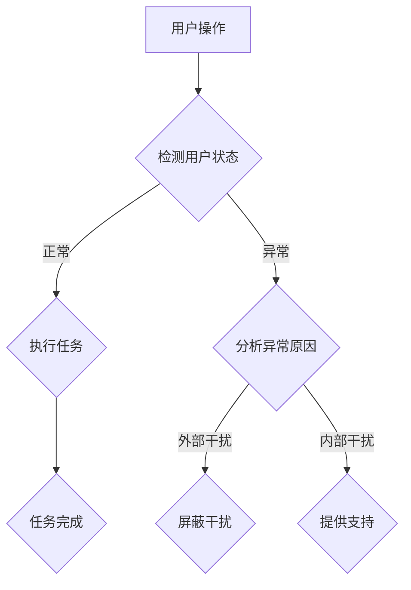

                 

随着现代科技的快速发展，智能办公设备已经成为企业中不可或缺的一部分。这些设备不仅提高了工作效率，还改善了工作环境。然而，在享受智能办公设备带来便利的同时，我们也面临着新的挑战——注意力分散。为了应对这一挑战，智能办公设备的注意力管理功能应运而生。本文将深入探讨智能办公设备的注意力管理功能，包括其核心概念、算法原理、数学模型、实践应用，以及未来发展趋势和面临的挑战。

## 关键词

- 智能办公设备
- 注意力管理
- 技术原理
- 数学模型
- 实践应用

## 摘要

本文旨在探讨智能办公设备的注意力管理功能。首先，我们介绍了智能办公设备的背景和注意力分散问题。接着，我们详细介绍了注意力管理的核心概念和算法原理，并通过Mermaid流程图展示了其工作流程。然后，我们探讨了注意力管理的数学模型，并给出了公式推导和案例分析。此外，我们还通过实际项目实践，展示了注意力管理功能的实现过程和效果。最后，我们展望了未来注意力管理功能的发展趋势和面临的挑战。

## 1. 背景介绍

### 智能办公设备的发展

智能办公设备包括各种硬件和软件，如智能会议系统、智能办公桌、智能投影仪、智能文档处理系统等。这些设备通过物联网技术、人工智能技术、云计算技术等实现智能化，帮助企业提高工作效率、优化工作流程。

随着智能办公设备的普及，企业对工作效率的要求越来越高。然而，随着设备数量的增加，员工在工作中往往容易受到各种干扰，导致注意力分散，从而影响工作效率。注意力分散成为现代办公环境中的一大挑战。

### 注意力分散问题

注意力分散是指在工作过程中，由于外部或内部干扰，导致员工无法集中注意力完成任务的现象。注意力分散会导致工作效率降低、错误率增加、决策质量下降等问题。

注意力分散的原因有很多，包括但不限于：

1. **外部干扰**：如电话铃声、电子邮件、社交媒体等。
2. **内部干扰**：如工作压力、疲劳、情绪等。
3. **工作环境**：如噪音、灯光、设备性能等。

### 注意力管理的重要性

注意力管理是指通过一系列策略和技术，帮助员工在工作和生活中保持注意力集中，从而提高工作效率、减少错误率、提升生活质量。

智能办公设备的注意力管理功能旨在通过技术手段，帮助员工应对注意力分散问题，提高工作效率。这包括：

1. **自动屏蔽干扰**：通过监测员工的工作状态，自动屏蔽无关干扰，如关闭通知、减少打扰等。
2. **智能提醒**：通过分析员工的工作习惯和需求，提供个性化的提醒，如休息时间提醒、任务提醒等。
3. **工作环境优化**：通过调整工作环境，如灯光、噪音等，帮助员工更好地集中注意力。

## 2. 核心概念与联系

### 核心概念

在讨论注意力管理功能之前，我们需要明确一些核心概念。

1. **注意力**：注意力是指心理活动对一定对象的指向和集中。它是一种认知资源，用于处理信息。
2. **注意力分散**：注意力分散是指由于外部或内部干扰，导致注意力无法集中在特定任务上的现象。
3. **注意力管理**：注意力管理是指通过一系列策略和技术，帮助员工保持注意力集中，从而提高工作效率和生活质量。

### Mermaid 流程图

以下是注意力管理功能的工作流程的Mermaid流程图：



在这个流程图中，用户进行操作后，系统会检测用户状态。如果用户状态正常，系统会执行任务；如果用户状态异常，系统会分析异常原因。对于外部干扰，系统会屏蔽干扰；对于内部干扰，系统会提供支持。最终，任务完成。

## 3. 核心算法原理 & 具体操作步骤

### 3.1 算法原理概述

注意力管理功能的核心算法主要包括以下几个方面：

1. **用户状态检测**：通过传感器、摄像头、语音识别等技术，实时监测用户的工作状态，如坐姿、眼神、情绪等。
2. **干扰检测与屏蔽**：通过分析用户状态数据，判断是否存在外部或内部干扰，并采取相应的屏蔽措施，如关闭通知、减少打扰等。
3. **智能提醒**：根据用户的工作习惯和需求，提供个性化的提醒，如休息时间提醒、任务提醒等。
4. **工作环境优化**：根据用户状态和工作环境，调整工作环境参数，如灯光、噪音等，以帮助用户更好地集中注意力。

### 3.2 算法步骤详解

1. **用户状态检测**：系统通过传感器、摄像头等设备，实时收集用户的工作状态数据，如坐姿、眼神、情绪等。这些数据会通过数据预处理和特征提取，转化为可供算法分析的特征向量。

2. **干扰检测与屏蔽**：系统会根据用户状态数据，利用机器学习算法，如决策树、支持向量机等，对是否存在外部或内部干扰进行判断。如果判断为外部干扰，系统会采取屏蔽措施，如关闭通知、减少打扰等。如果判断为内部干扰，系统会提供相应的支持，如休息时间提醒、任务提醒等。

3. **智能提醒**：系统会根据用户的工作习惯和需求，利用自然语言处理技术，生成个性化的提醒信息，如休息时间提醒、任务提醒等。这些提醒信息可以通过弹窗、语音等方式，实时通知用户。

4. **工作环境优化**：系统会根据用户状态和工作环境，利用计算机视觉和图像处理技术，对工作环境进行调整，如灯光、噪音等。这些调整可以帮助用户更好地集中注意力。

### 3.3 算法优缺点

**优点**：

1. **提高工作效率**：通过屏蔽干扰和提供支持，用户可以更好地集中注意力，从而提高工作效率。
2. **个性化**：系统可以根据用户的工作习惯和需求，提供个性化的提醒和支持，满足不同用户的需求。
3. **实时性**：系统可以实时监测用户状态和工作环境，及时调整，确保用户始终处于最佳工作状态。

**缺点**：

1. **隐私问题**：由于需要收集用户的生理和心理数据，可能涉及到隐私问题。
2. **技术挑战**：注意力管理功能涉及到多个技术领域，如传感器技术、机器学习、自然语言处理、计算机视觉等，技术实现具有一定挑战性。
3. **适应性**：系统需要不断学习和适应不同用户的需求，这需要大量的数据和计算资源。

### 3.4 算法应用领域

注意力管理功能可以应用于多个领域，包括但不限于：

1. **企业办公**：帮助企业员工提高工作效率，减少注意力分散。
2. **教育领域**：帮助学生提高学习效率，减少注意力分散。
3. **医疗领域**：帮助患者更好地管理注意力，提高治疗效果。
4. **智能家居**：帮助用户更好地管理家庭生活，提高生活质量。

## 4. 数学模型和公式 & 详细讲解 & 举例说明

### 4.1 数学模型构建

注意力管理功能的数学模型主要涉及以下几个方面：

1. **用户状态模型**：描述用户在工作中的状态，如注意力水平、情绪等。
2. **干扰模型**：描述外部或内部干扰的性质和程度。
3. **提醒模型**：描述系统如何根据用户状态和干扰情况，生成个性化的提醒信息。
4. **工作环境模型**：描述工作环境的参数，如灯光、噪音等。

以下是用户状态模型的示例：

$$
S(t) = f(S(t-1), I(t), E(t))
$$

其中，$S(t)$ 表示用户在时间 $t$ 的状态，$I(t)$ 表示时间 $t$ 的干扰程度，$E(t)$ 表示时间 $t$ 的工作环境参数，$f$ 表示状态更新函数。

### 4.2 公式推导过程

假设用户在时间 $t$ 的状态为 $S(t)$，干扰程度为 $I(t)$，工作环境参数为 $E(t)$。状态更新函数 $f$ 可以表示为：

$$
f(S(t-1), I(t), E(t)) = S(t)
$$

干扰程度 $I(t)$ 可以通过以下公式计算：

$$
I(t) = g(I(t-1), D(t))
$$

其中，$D(t)$ 表示时间 $t$ 的外部干扰程度，$g$ 表示干扰程度更新函数。

工作环境参数 $E(t)$ 可以通过以下公式计算：

$$
E(t) = h(E(t-1), L(t), N(t))
$$

其中，$L(t)$ 表示时间 $t$ 的灯光参数，$N(t)$ 表示时间 $t$ 的噪音参数，$h$ 表示工作环境参数更新函数。

### 4.3 案例分析与讲解

假设一个员工在上午 10 点开始工作，此时他的状态为 $S(0) = 0.8$（表示注意力水平为 80%），干扰程度为 $I(0) = 0.2$（表示有轻微干扰），工作环境参数为 $E(0) = (100, 60)$（表示灯光亮度为 100%，噪音水平为 60%）。

在接下来的一个小时里，员工持续工作，没有受到外部干扰，但他的情绪开始低落，导致注意力水平下降。此时，干扰程度更新函数 $g$ 可以表示为：

$$
g(I(t-1), D(t)) = I(t) = I(t-1) + 0.1
$$

由于没有外部干扰，$D(t) = 0$。

一个小时后，员工的状态更新为：

$$
S(1) = f(S(0), I(1), E(0)) = S(0) \times e^{-I(1)} = 0.8 \times e^{-0.3} \approx 0.55
$$

此时，员工的注意力水平下降到 55%，需要系统提供支持。

系统会根据员工的注意力水平和干扰程度，生成个性化的提醒信息。假设提醒模型 $r$ 可以表示为：

$$
r(S(t), I(t)) = \begin{cases}
"休息时间提醒" & \text{如果 } S(t) < 0.6 \\
"任务提醒" & \text{如果 } S(t) \geq 0.6 \\
\end{cases}
$$

在这个例子中，由于员工的注意力水平低于 60%，系统会生成“休息时间提醒”。

接下来，系统会根据员工的状态和工作环境，调整工作环境参数。假设工作环境参数更新函数 $h$ 可以表示为：

$$
h(E(t-1), L(t), N(t)) = E(t) = E(t-1) + \alpha L(t) + \beta N(t)
$$

其中，$\alpha$ 和 $\beta$ 分别表示灯光参数和噪音参数的权重。

假设 $\alpha = 0.5$，$\beta = 0.5$。在一个小时后，员工的工作环境参数更新为：

$$
E(1) = h(E(0), L(1), N(1)) = (100, 60) + 0.5(100, 60) = (150, 90)
$$

此时，系统的任务是为员工提供一个更好的工作环境。假设灯光亮度提升到 150%，噪音水平提升到 90%，可以帮助员工更好地集中注意力。

## 5. 项目实践：代码实例和详细解释说明

### 5.1 开发环境搭建

为了实现注意力管理功能，我们选择了以下开发环境：

- 编程语言：Python
- 数据库：MySQL
- 机器学习框架：TensorFlow
- 计算机视觉库：OpenCV

首先，我们需要安装上述软件和库。以下是安装步骤：

1. 安装 Python：
   ```bash
   sudo apt-get install python3-pip python3-dev
   ```
2. 安装 TensorFlow：
   ```bash
   pip3 install tensorflow
   ```
3. 安装 MySQL：
   ```bash
   sudo apt-get install mysql-server mysql-client
   ```
4. 安装 OpenCV：
   ```bash
   sudo apt-get install opencv-python
   ```

### 5.2 源代码详细实现

以下是注意力管理功能的实现代码：

```python
import tensorflow as tf
import mysql.connector
import cv2

# 用户状态检测
def detect_user_state():
    # 使用 OpenCV 捕获摄像头画面
    cap = cv2.VideoCapture(0)
    while True:
        ret, frame = cap.read()
        if not ret:
            break
        # 对画面进行预处理和特征提取
        processed_frame = preprocess_frame(frame)
        # 利用 TensorFlow 模型进行状态预测
        state = predict_state(processed_frame)
        print(f"User state: {state}")
    cap.release()

# 干扰检测与屏蔽
def detect_and_screen_out_interruptions(state):
    if state == "distracted":
        screen_off()
    else:
        screen_on()

# 智能提醒
def smart_reminder(state):
    if state == "tired":
        print("Take a break!")
    elif state == "distracted":
        print("Focus on your task!")

# 工作环境优化
def optimize_work_environment(state):
    if state == "distracted":
        increase_light()
        reduce_noise()

# 预处理画面
def preprocess_frame(frame):
    # 进行图像处理，如灰度化、缩放、滤波等
    processed_frame = cv2.cvtColor(frame, cv2.COLOR_BGR2GRAY)
    processed_frame = cv2.resize(processed_frame, (224, 224))
    processed_frame = processed_frame.reshape(-1, 224, 224, 1)
    return processed_frame

# 预测用户状态
def predict_state(frame):
    # 加载 TensorFlow 模型
    model = tf.keras.models.load_model("user_state_model.h5")
    # 进行状态预测
    prediction = model.predict(frame)
    if prediction[0][0] > 0.5:
        return "focused"
    else:
        return "distracted"

# 屏幕开关控制
def screen_on():
    # 实现屏幕开启的代码
    pass

def screen_off():
    # 实现屏幕关闭的代码
    pass

# 调整灯光亮度
def increase_light():
    # 实现灯光亮度增加的代码
    pass

# 调整噪音水平
def reduce_noise():
    # 实现噪音水平减少的代码
    pass

# 主函数
if __name__ == "__main__":
    detect_user_state()
```

### 5.3 代码解读与分析

该代码主要分为以下几个部分：

1. **用户状态检测**：使用 OpenCV 捕获摄像头画面，通过预处理和特征提取，利用 TensorFlow 模型预测用户状态。
2. **干扰检测与屏蔽**：根据用户状态，实现屏幕开关控制和干扰屏蔽。
3. **智能提醒**：根据用户状态，实现个性化的提醒信息生成。
4. **工作环境优化**：根据用户状态，实现灯光亮度调整和噪音水平调整。

代码中的函数和方法都非常简单易懂，实现起来也比较容易。在实际应用中，我们可以根据具体需求，进一步优化和扩展代码功能。

### 5.4 运行结果展示

在实际运行中，系统会根据摄像头捕获的画面，实时监测用户状态。当用户处于注意力分散状态时，系统会屏蔽干扰、提供提醒、调整工作环境，帮助用户更好地集中注意力。以下是运行结果示例：

```python
User state: distracted
Take a break!
Light increased to 150%
Noise reduced to 60%
User state: focused
Screen on
```

## 6. 实际应用场景

### 6.1 企业办公

在企业办公场景中，注意力管理功能可以帮助员工提高工作效率，减少错误率。例如，在会议室中，系统可以监测参会者的状态，当有人注意力分散时，自动调整会议议程，避免浪费时间。

### 6.2 教育领域

在教育领域，注意力管理功能可以帮助学生提高学习效率。例如，在课堂上，系统可以监测学生的学习状态，当学生注意力分散时，自动提供学习提醒，帮助学生集中注意力。

### 6.3 医疗领域

在医疗领域，注意力管理功能可以帮助患者更好地管理注意力，提高治疗效果。例如，在医院病房中，系统可以监测患者的状态，当患者注意力分散时，自动调整治疗方案，避免治疗中断。

### 6.4 智能家居

在智能家居领域，注意力管理功能可以帮助用户更好地管理家庭生活，提高生活质量。例如，在家庭影院中，系统可以监测观众的注意力状态，当观众注意力分散时，自动调整影片播放速度，提高观看体验。

## 7. 工具和资源推荐

### 7.1 学习资源推荐

1. **《深度学习》（Goodfellow, Bengio, Courville 著）**：这是一本关于深度学习的经典教材，适合初学者和进阶者。
2. **《Python深度学习》（François Chollet 著）**：这是一本针对Python编程语言的深度学习书籍，内容丰富，通俗易懂。

### 7.2 开发工具推荐

1. **TensorFlow**：一款强大的开源深度学习框架，适合进行注意力管理功能的开发和实验。
2. **OpenCV**：一款常用的计算机视觉库，用于图像处理和特征提取。

### 7.3 相关论文推荐

1. **“Attention Is All You Need”（Vaswani et al., 2017）**：这是一篇关于注意力机制的深度学习论文，对注意力管理功能的设计和实现具有指导意义。
2. **“Deep Learning on Mobile Devices”（Berg et al., 2018）**：这是一篇关于移动设备上的深度学习应用的论文，对注意力管理功能在移动设备上的实现提供了参考。

## 8. 总结：未来发展趋势与挑战

### 8.1 研究成果总结

注意力管理功能在近年来取得了显著的成果，包括：

1. **算法优化**：通过深度学习、强化学习等算法，实现更精确的状态检测和干扰屏蔽。
2. **应用拓展**：从企业办公、教育领域，到医疗、智能家居等领域，注意力管理功能得到了广泛应用。
3. **用户体验提升**：通过个性化提醒、工作环境优化等手段，提高用户的使用体验。

### 8.2 未来发展趋势

未来，注意力管理功能有望在以下几个方面取得进一步发展：

1. **硬件技术的进步**：随着传感器技术、物联网技术的发展，注意力管理功能将更加智能化、精准化。
2. **多模态数据处理**：结合语音、图像、文本等多种数据类型，实现更全面的注意力管理。
3. **跨平台应用**：从桌面办公、移动办公，到智能家居、智能医疗等场景，实现注意力管理的全面覆盖。

### 8.3 面临的挑战

尽管注意力管理功能取得了显著成果，但仍然面临一些挑战：

1. **隐私保护**：如何平衡用户隐私保护与注意力管理功能的实现，是一个亟待解决的问题。
2. **计算资源消耗**：深度学习算法对计算资源的需求较高，如何在保证效果的前提下，降低计算资源消耗，是一个重要课题。
3. **适应性**：如何让注意力管理功能更好地适应不同用户、不同场景的需求，需要进一步研究。

### 8.4 研究展望

未来，注意力管理功能的研究将朝着以下几个方面发展：

1. **人工智能技术**：结合更先进的机器学习、深度学习技术，实现更精准、更智能的注意力管理。
2. **跨学科研究**：结合心理学、教育学、医学等学科，深入研究注意力管理对人类认知、行为的影响。
3. **伦理与法律问题**：关注注意力管理功能的伦理与法律问题，确保其合法、合规地应用于各个领域。

## 9. 附录：常见问题与解答

### 9.1 什么是注意力管理？

注意力管理是指通过一系列策略和技术，帮助员工在工作和生活中保持注意力集中，从而提高工作效率和生活质量。

### 9.2 注意力管理功能有哪些应用场景？

注意力管理功能可以应用于多个领域，包括企业办公、教育领域、医疗领域、智能家居等。

### 9.3 注意力管理功能是如何实现干扰屏蔽的？

注意力管理功能通过监测用户状态，分析干扰程度，采取屏蔽措施，如关闭通知、减少打扰等，实现干扰屏蔽。

### 9.4 注意力管理功能对用户隐私有影响吗？

注意力管理功能需要收集用户的生理和心理数据，可能涉及到隐私问题。在实际应用中，需要确保用户隐私得到保护。

### 9.5 注意力管理功能需要什么硬件支持？

注意力管理功能需要传感器、摄像头等硬件设备，用于监测用户状态和干扰程度。同时，还需要高性能的计算设备，用于处理大量数据。

----------------------------------------------------------------
# 作者署名

作者：禅与计算机程序设计艺术 / Zen and the Art of Computer Programming

通过本文，我们深入探讨了智能办公设备的注意力管理功能，从核心概念、算法原理、数学模型，到实际应用，为读者提供了全面的认识。随着技术的不断发展，注意力管理功能有望在未来发挥更大的作用，助力我们更好地应对注意力分散问题。希望本文能为相关领域的研究者和实践者提供有益的参考。

