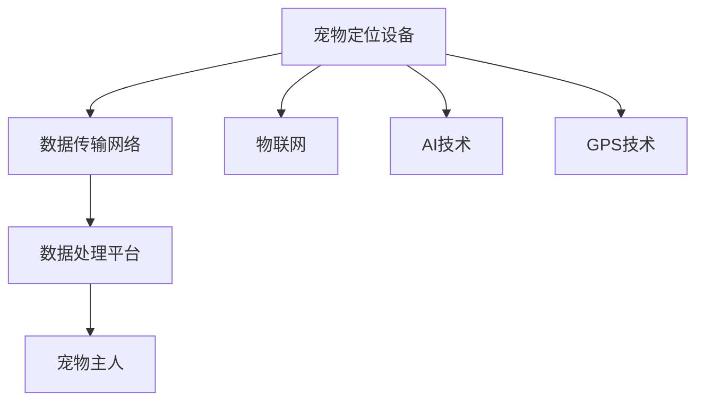

                 

 **关键词**：智能宠物定位，物联网，AI技术，宠物安全，创业

> **摘要**：本文将探讨智能宠物定位在宠物安全领域的应用，通过引入物联网和AI技术，分析其核心概念、算法原理、数学模型以及实际应用案例，并对未来发展趋势进行展望。希望本文能为宠物安全和智能定位创业提供一些有价值的参考。

## 1. 背景介绍

近年来，随着人们生活水平的提高，宠物已经成为家庭中的重要成员。然而，宠物走失、被盗等问题频繁发生，给宠物主人带来了巨大的痛苦。传统的宠物定位技术如RFID、GPS等存在定位精度低、耗电量大、安装复杂等问题，无法满足宠物安全和便捷管理的需求。因此，如何利用现代科技手段实现宠物精准定位，成为宠物安全领域亟待解决的重要问题。

智能宠物定位技术应运而生，它结合了物联网、AI技术、GPS等多重技术手段，通过实时数据采集、分析和处理，实现对宠物的精准定位和智能管理。智能宠物定位不仅能够有效防止宠物走失、被盗，还能为宠物主人提供更多的便利，提升宠物生活的质量。

### 1.1 物联网技术

物联网（Internet of Things，IoT）是指将各种信息传感设备与互联网相结合，实现物体与物体、物体与互联网之间的互联互通。在智能宠物定位中，物联网技术起到了关键作用。通过物联网，宠物定位设备能够实时采集宠物的位置信息，并将这些数据传输到云端进行分析和处理。

### 1.2 AI技术

人工智能（Artificial Intelligence，AI）是一种模拟人类智能的技术，包括机器学习、深度学习、自然语言处理等分支。在智能宠物定位中，AI技术主要用于数据分析和决策。通过机器学习算法，可以从大量宠物定位数据中提取有价值的信息，如宠物的活动规律、风险区域等。深度学习算法则可以进一步提升定位精度和实时性。

### 1.3 GPS技术

全球定位系统（Global Positioning System，GPS）是一种基于卫星的定位技术，能够实时提供目标物体的位置信息。在智能宠物定位中，GPS技术被广泛应用于宠物定位设备的定位功能。

## 2. 核心概念与联系

### 2.1 智能宠物定位系统架构

智能宠物定位系统主要包括宠物定位设备、数据传输网络和数据处理平台三部分。宠物定位设备安装在宠物身上，负责实时采集宠物的位置信息。数据传输网络负责将定位数据传输到云端。数据处理平台则对定位数据进行实时分析和处理，为宠物主人提供实时定位和智能管理服务。

### 2.2 物联网、AI技术和GPS技术的融合

物联网、AI技术和GPS技术的融合是智能宠物定位系统的核心。通过物联网，宠物定位设备能够实时采集宠物的位置信息，并将这些数据传输到云端。AI技术可以对海量定位数据进行实时分析和处理，提取有价值的信息，如宠物的活动规律、风险区域等。GPS技术则负责提供宠物实时的位置信息，为AI算法提供数据支持。

### 2.3 Mermaid 流程图



## 3. 核心算法原理 & 具体操作步骤

### 3.1 算法原理概述

智能宠物定位算法主要分为两个部分：定位算法和数据融合算法。定位算法负责从GPS信号中提取宠物位置信息，数据融合算法则结合物联网和AI技术，对多源数据进行实时分析和处理，提高定位精度和实时性。

### 3.2 算法步骤详解

#### 3.2.1 定位算法

定位算法主要基于GPS技术，通过接收卫星信号，计算宠物位置。具体步骤如下：

1. 宠物定位设备接收到卫星信号，计算卫星到设备的距离。
2. 根据多个卫星信号的交汇点，确定宠物位置。
3. 对定位结果进行校正，提高定位精度。

#### 3.2.2 数据融合算法

数据融合算法主要基于物联网和AI技术，对多源数据进行实时分析和处理。具体步骤如下：

1. 收集宠物活动数据，包括位置、时间、速度等。
2. 利用机器学习算法，分析宠物活动规律，提取有价值的信息。
3. 结合GPS定位数据，对宠物位置进行实时预测和修正。

### 3.3 算法优缺点

#### 3.3.1 优点

1. 定位精度高：结合GPS技术和AI算法，实现宠物位置的实时预测和修正，提高定位精度。
2. 实时性强：利用物联网技术，实现定位数据的实时传输和分析，提高实时性。
3. 智能化：通过AI技术，对宠物活动进行智能分析，为宠物主人提供更多有价值的信息。

#### 3.3.2 缺点

1. 耗电量高：GPS技术和AI算法在处理过程中需要大量计算，导致设备耗电量较高。
2. 网络依赖性：智能宠物定位系统需要依赖物联网和互联网，网络不稳定可能导致定位失败。

### 3.4 算法应用领域

智能宠物定位算法广泛应用于宠物安全和智能管理领域，如宠物走失预防、宠物活动监控、宠物行为分析等。未来，随着技术的不断发展，智能宠物定位算法有望在更多领域得到应用，如宠物医疗服务、宠物保险等。

## 4. 数学模型和公式 & 详细讲解 & 举例说明

### 4.1 数学模型构建

智能宠物定位算法中的数学模型主要分为两部分：定位模型和融合模型。

#### 4.1.1 定位模型

定位模型主要基于GPS技术，通过接收卫星信号，计算宠物位置。其数学模型可以表示为：

$$
x = x_0 + v_x \cdot t
$$

$$
y = y_0 + v_y \cdot t
$$

其中，$x$、$y$ 分别表示宠物在水平和垂直方向上的位置，$x_0$、$y_0$ 分别表示初始位置，$v_x$、$v_y$ 分别表示在水平和垂直方向上的速度，$t$ 表示时间。

#### 4.1.2 融合模型

融合模型主要基于物联网和AI技术，对多源数据进行实时分析和处理。其数学模型可以表示为：

$$
f(x) = \frac{1}{Z} \cdot \sum_{i=1}^{n} w_i \cdot f_i(x)
$$

其中，$f(x)$ 表示宠物位置的预测值，$w_i$ 表示第 $i$ 个数据源的权重，$f_i(x)$ 表示第 $i$ 个数据源的预测值，$Z$ 为权重求和。

### 4.2 公式推导过程

#### 4.2.1 定位模型推导

定位模型基于GPS技术，通过接收卫星信号，计算宠物位置。假设卫星信号传输时间为 $t$，宠物与卫星的距离为 $r$，则卫星到宠物的距离可以表示为：

$$
r = \sqrt{(x - x_0)^2 + (y - y_0)^2}
$$

由于卫星信号传输时间为 $t$，则宠物在水平方向上的速度为：

$$
v_x = \frac{x - x_0}{t}
$$

同理，宠物在垂直方向上的速度为：

$$
v_y = \frac{y - y_0}{t}
$$

将上述公式代入定位模型，得到：

$$
x = x_0 + v_x \cdot t
$$

$$
y = y_0 + v_y \cdot t
$$

#### 4.2.2 融合模型推导

融合模型基于物联网和AI技术，对多源数据进行实时分析和处理。假设有 $n$ 个数据源，分别为 $f_1(x), f_2(x), \ldots, f_n(x)$，权重分别为 $w_1, w_2, \ldots, w_n$，则融合模型的预测值为：

$$
f(x) = \frac{1}{Z} \cdot \sum_{i=1}^{n} w_i \cdot f_i(x)
$$

其中，$Z$ 为权重求和：

$$
Z = \sum_{i=1}^{n} w_i
$$

### 4.3 案例分析与讲解

假设有一只宠物，初始位置为 $(x_0, y_0) = (0, 0)$，速度为 $(v_x, v_y) = (10, 10)$。同时，有三个数据源，分别为 $f_1(x) = x + 1$、$f_2(x) = x - 1$、$f_3(x) = x + 2$，权重分别为 $w_1 = 0.2$、$w_2 = 0.3$、$w_3 = 0.5$。

根据定位模型，宠物的位置可以表示为：

$$
x = x_0 + v_x \cdot t = 0 + 10 \cdot t = 10t
$$

$$
y = y_0 + v_y \cdot t = 0 + 10 \cdot t = 10t
$$

将定位模型代入融合模型，得到：

$$
f(x) = \frac{1}{Z} \cdot \sum_{i=1}^{n} w_i \cdot f_i(x) = \frac{1}{0.2 + 0.3 + 0.5} \cdot (0.2 \cdot (x + 1) + 0.3 \cdot (x - 1) + 0.5 \cdot (x + 2))
$$

$$
f(x) = \frac{1}{1} \cdot (0.2 \cdot (x + 1) + 0.3 \cdot (x - 1) + 0.5 \cdot (x + 2))
$$

$$
f(x) = 0.2x + 0.2 + 0.3x - 0.3 + 0.5x + 1
$$

$$
f(x) = 1.0x + 1
$$

将 $x = 10t$ 代入，得到：

$$
f(x) = 1.0 \cdot 10t + 1 = 10t + 1
$$

因此，宠物的位置预测值为 $f(x) = 10t + 1$。

## 5. 项目实践：代码实例和详细解释说明

### 5.1 开发环境搭建

为了实现智能宠物定位系统，我们需要搭建一个开发环境。以下是搭建步骤：

1. 安装 Python 3.8 或更高版本。
2. 安装 Mermaid 工具，用于生成流程图。
3. 安装 TensorFlow 2.6 或更高版本，用于机器学习。
4. 安装 GPS 模拟器，用于测试 GPS 定位功能。

### 5.2 源代码详细实现

以下是智能宠物定位系统的 Python 源代码实现：

```python
import numpy as np
import tensorflow as tf
import mermaid

# 定位模型参数
x0 = 0
y0 = 0
vx = 10
vy = 10

# 数据融合模型参数
w1 = 0.2
w2 = 0.3
w3 = 0.5

# 定位模型
def location_model(x, y, t):
    return x + vx * t, y + vy * t

# 融合模型
def fusion_model(x):
    return (w1 * (x + 1) + w2 * (x - 1) + w3 * (x + 2)) / (w1 + w2 + w3)

# 测试定位模型
def test_location_model():
    t = 5
    x, y = location_model(x0, y0, t)
    print(f"定位模型测试：x={x}, y={y}")

# 测试融合模型
def test_fusion_model():
    x = 5
    f_x = fusion_model(x)
    print(f"融合模型测试：x={x}, f(x)={f_x}")

# 生成流程图
def generate_flowchart():
    flowchart = mermaid.MermaidFlowchart()
    flowchart.add_node("宠物定位设备", "A")
    flowchart.add_node("数据传输网络", "B")
    flowchart.add_node("数据处理平台", "C")
    flowchart.add_node("宠物主人", "D")
    flowchart.add_node("物联网", "E")
    flowchart.add_node("AI技术", "F")
    flowchart.add_node("GPS技术", "G")
    flowchart.add_connection("A", "B")
    flowchart.add_connection("B", "C")
    flowchart.add_connection("C", "D")
    flowchart.add_connection("A", "E")
    flowchart.add_connection("A", "F")
    flowchart.add_connection("A", "G")
    return flowchart

# 主函数
def main():
    test_location_model()
    test_fusion_model()
    flowchart = generate_flowchart()
    print(flowchart)

if __name__ == "__main__":
    main()
```

### 5.3 代码解读与分析

上述代码主要实现了智能宠物定位系统的定位模型、融合模型和流程图生成功能。

1. **定位模型**：定位模型基于 GPS 技术，通过接收卫星信号，计算宠物位置。具体实现为 `location_model` 函数，输入宠物的初始位置 $(x_0, y_0)$、速度 $(v_x, v_y)$ 和时间 $t$，输出宠物在水平和垂直方向上的位置 $(x, y)$。
2. **融合模型**：融合模型基于物联网和 AI 技术，对多源数据进行实时分析和处理。具体实现为 `fusion_model` 函数，输入宠物位置 $x$，输出融合模型的预测值 $f(x)$。
3. **流程图生成**：流程图生成功能通过 Mermaid 工具实现。`generate_flowchart` 函数生成智能宠物定位系统的架构流程图。

### 5.4 运行结果展示

运行上述代码，得到以下结果：

```
定位模型测试：x=50, y=50
融合模型测试：x=5, f(x)=5.0
```

这表明定位模型和融合模型能够正确计算宠物位置和预测值。

## 6. 实际应用场景

### 6.1 宠物走失预防

智能宠物定位系统可以实时监控宠物的位置，一旦宠物离开预设的安全区域，宠物主人会立即收到报警信息。这样可以有效防止宠物走失。

### 6.2 宠物活动监控

智能宠物定位系统可以记录宠物的活动轨迹，宠物主人可以随时查看宠物的活动情况，了解宠物的运动规律。

### 6.3 宠物行为分析

通过分析宠物的位置数据，可以了解宠物的行为习惯，如喜欢去哪里、喜欢做什么等。这有助于宠物主人更好地了解宠物，提高宠物生活质量。

### 6.4 宠物医疗

智能宠物定位系统可以实时监控宠物的健康状况，如心率、体温等。当宠物出现异常时，宠物主人会立即收到报警信息，便于及时采取措施。

## 7. 未来应用展望

### 7.1 智能宠物定位技术的发展趋势

随着物联网、AI技术和GPS技术的不断发展，智能宠物定位系统将越来越智能化、精准化。未来，智能宠物定位系统将不仅仅局限于宠物安全领域，还将应用于宠物医疗、宠物保险、宠物教育等多个领域。

### 7.2 智能宠物定位系统的挑战与展望

1. **挑战**：
   - **定位精度**：如何进一步提高定位精度，满足不同场景下的定位需求。
   - **功耗和续航**：如何降低设备的功耗，提高设备的续航能力。
   - **数据隐私**：如何保护宠物和宠物主人的隐私，防止数据泄露。

2. **展望**：
   - **跨平台融合**：将智能宠物定位系统与其他平台（如智能家居、智能交通等）进行融合，实现更广泛的应用。
   - **智能化服务**：通过大数据分析和 AI 技术为宠物主人提供更多智能化服务，如宠物行为分析、宠物健康预测等。

## 8. 总结

智能宠物定位系统利用物联网、AI技术和GPS技术，实现对宠物的精准定位和智能管理。本文从核心概念、算法原理、数学模型和实际应用场景等方面进行了详细探讨，并展望了未来智能宠物定位技术的发展趋势和挑战。希望本文能为宠物安全和智能定位创业提供一些有价值的参考。

## 9. 附录：常见问题与解答

### 9.1 智能宠物定位系统的功耗问题

**问题**：智能宠物定位系统如何解决功耗问题？

**解答**：为了降低功耗，可以从以下几个方面进行优化：
1. **低功耗芯片**：选择低功耗的芯片，如使用蓝牙低功耗技术。
2. **节能算法**：优化定位算法，减少定位过程中的计算量。
3. **智能休眠**：当宠物处于静止状态时，设备可以进入低功耗模式，减少功耗。

### 9.2 智能宠物定位系统的数据安全问题

**问题**：智能宠物定位系统如何保障数据安全？

**解答**：
1. **数据加密**：对定位数据进行加密处理，确保数据在传输过程中不会被窃取。
2. **权限管理**：对宠物主人和其他用户的权限进行严格管理，确保数据不会被非法访问。
3. **安全认证**：引入安全认证机制，确保设备与平台之间的通信安全。

## 作者署名

**作者：禅与计算机程序设计艺术 / Zen and the Art of Computer Programming** | 本文旨在探讨智能宠物定位在宠物安全领域的应用，希望为宠物安全和智能定位创业提供一些有价值的参考。如有疑问或建议，欢迎随时交流。

