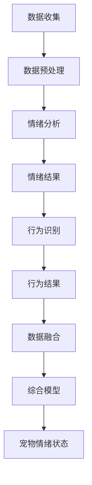

                 

关键词：智能宠物、情绪分析、创业、需求理解、人工智能、深度学习、自然语言处理、机器学习、宠物行为学

> 摘要：本文将探讨智能宠物情绪分析的创业机会，通过深入理解宠物需求，分析当前市场状况，探讨技术实现方案，并提出未来应用展望。文章旨在为从事智能宠物情绪分析领域的企业家和研究人员提供有价值的参考。

## 1. 背景介绍

随着人工智能技术的迅速发展，智能宠物领域也逐渐成为一个热门的创业方向。宠物已经成为现代人生活中的重要伙伴，据相关数据统计，全球宠物拥有率逐年上升，尤其在发达国家，养宠物已经成为一种时尚和生活方式。然而，随着宠物数量的增加，人们对宠物的需求也在不断提高，从简单的喂食、清洁到对宠物情绪和健康的关注。这就为智能宠物情绪分析提供了广阔的市场空间。

智能宠物情绪分析是一种利用人工智能技术，特别是深度学习和自然语言处理等技术，对宠物的情绪和行为进行理解和分析的方法。通过智能宠物情绪分析，可以实现对宠物情绪的实时监控和预警，为宠主提供更加个性化和科学的宠物护理方案。这一技术的应用不仅能够提升宠物的生活质量，还能够为宠物行业带来巨大的商业价值。

## 2. 核心概念与联系

### 2.1 情绪分析

情绪分析是自然语言处理领域的一个重要分支，旨在通过文本数据识别和分类情感。在智能宠物情绪分析中，情绪分析的核心任务是理解宠物的情感状态，例如快乐、焦虑、恐惧等。情绪分析通常涉及以下几个步骤：

1. **情感词典构建**：利用现有的情感词典，将文本中的词语映射到情感标签上。
2. **文本预处理**：对文本数据进行清洗和标准化，去除无关信息和噪声。
3. **情感分类**：使用机器学习模型对预处理后的文本进行情感分类，常见的模型有朴素贝叶斯、支持向量机、深度学习等。

### 2.2 行为识别

行为识别是计算机视觉领域的一个重要任务，旨在通过摄像头或其他传感器捕获的图像或视频数据，识别出宠物的行为。在智能宠物情绪分析中，行为识别的核心任务是识别宠物的行为模式，如玩耍、睡眠、进食等。行为识别通常涉及以下几个步骤：

1. **特征提取**：从图像或视频中提取关键特征，如颜色、形状、纹理等。
2. **行为分类**：使用机器学习模型对提取的特征进行分类，常见的模型有决策树、随机森林、卷积神经网络等。

### 2.3 数据融合

在智能宠物情绪分析中，情绪分析和行为识别的结果需要被整合起来，以提供更全面的宠物情绪状态。数据融合通常涉及以下几个步骤：

1. **数据预处理**：对情绪分析和行为识别的结果进行清洗和标准化，确保数据的一致性和可靠性。
2. **特征融合**：将情绪分析和行为识别的结果进行融合，形成综合的宠物情绪状态。
3. **模型训练**：使用融合后的数据训练综合模型，以提高宠物情绪分析的准确性。

### 2.4 Mermaid 流程图

以下是智能宠物情绪分析的 Mermaid 流程图：



## 3. 核心算法原理 & 具体操作步骤

### 3.1 算法原理概述

智能宠物情绪分析的核心算法主要包括情绪分析和行为识别两部分。情绪分析主要利用自然语言处理技术对宠物的文本数据进行情感分类，而行为识别则主要利用计算机视觉技术对宠物的图像或视频数据进行行为分类。两部分结果通过数据融合技术整合，形成对宠物情绪状态的全面理解。

### 3.2 算法步骤详解

#### 3.2.1 情绪分析

1. **情感词典构建**：根据宠物相关领域的情感词典，构建情感标签体系。
2. **文本预处理**：对宠物文本数据进行清洗和标准化，去除无关信息。
3. **情感分类**：使用机器学习模型对预处理后的文本进行情感分类。

#### 3.2.2 行为识别

1. **特征提取**：从宠物图像或视频中提取关键特征。
2. **行为分类**：使用机器学习模型对提取的特征进行分类。

#### 3.2.3 数据融合

1. **数据预处理**：对情绪分析和行为识别的结果进行清洗和标准化。
2. **特征融合**：将情绪分析和行为识别的结果进行融合。
3. **模型训练**：使用融合后的数据训练综合模型。

### 3.3 算法优缺点

#### 优点

1. **全面性**：通过情绪分析和行为识别，可以实现对宠物情绪状态的全面理解。
2. **准确性**：使用先进的机器学习和自然语言处理技术，可以提高宠物情绪分析的准确性。
3. **实时性**：可以实时监控宠物的情绪状态，为宠主提供及时的护理建议。

#### 缺点

1. **数据依赖性**：情绪分析和行为识别的性能很大程度上依赖于数据的质量和数量。
2. **计算成本**：算法的实时性和准确性往往需要大量的计算资源。

### 3.4 算法应用领域

智能宠物情绪分析可以应用于多个领域，包括宠物健康管理、宠物行为研究、宠物产品开发等。在未来，随着技术的不断进步，智能宠物情绪分析有望在更多领域得到应用。

## 4. 数学模型和公式 & 详细讲解 & 举例说明

### 4.1 数学模型构建

在智能宠物情绪分析中，常用的数学模型包括情感分类模型和行为分类模型。情感分类模型通常使用朴素贝叶斯、支持向量机等分类算法，而行为分类模型则主要使用卷积神经网络等深度学习算法。

#### 4.1.1 情感分类模型

假设我们使用朴素贝叶斯模型进行情感分类，其基本公式如下：

$$
P(C_k|X) = \frac{P(X|C_k)P(C_k)}{P(X)}
$$

其中，$C_k$ 表示情感类别，$X$ 表示文本特征向量。

#### 4.1.2 行为分类模型

假设我们使用卷积神经网络（CNN）进行行为分类，其基本结构如下：

1. **卷积层**：提取图像或视频的关键特征。
2. **池化层**：减少特征向量的维度，提高模型计算效率。
3. **全连接层**：对提取的特征进行分类。

### 4.2 公式推导过程

#### 4.2.1 情感分类模型

以朴素贝叶斯模型为例，其公式推导过程如下：

1. **条件概率计算**：

$$
P(X|C_k) = P(w_1|C_k)P(w_2|C_k)\cdots P(w_n|C_k)
$$

2. **先验概率计算**：

$$
P(C_k) = \frac{N_k}{N}
$$

其中，$N_k$ 表示类别 $C_k$ 的文本数量，$N$ 表示总文本数量。

3. **边际概率计算**：

$$
P(X) = P(w_1)P(w_2)\cdots P(w_n)
$$

#### 4.2.2 行为分类模型

以卷积神经网络为例，其公式推导过程如下：

1. **卷积操作**：

$$
h_i = \sum_{j=1}^{k} w_{ij} * g_j + b_i
$$

其中，$h_i$ 表示卷积层输出，$w_{ij}$ 表示卷积核，$g_j$ 表示输入特征，$b_i$ 表示偏置。

2. **激活函数**：

$$
a_i = f(h_i)
$$

其中，$a_i$ 表示激活值，$f$ 表示激活函数，常用的激活函数有 sigmoid、ReLU 等。

3. **全连接层**：

$$
y_j = \sum_{i=1}^{n} w_{ij}a_i + b_j
$$

其中，$y_j$ 表示全连接层输出，$w_{ij}$ 表示权重，$a_i$ 表示卷积层输出，$b_j$ 表示偏置。

### 4.3 案例分析与讲解

#### 4.3.1 情感分类案例

假设我们有以下一段宠物文本数据：“今天我的宠物非常快乐，因为它玩得很开心。” 我们可以使用朴素贝叶斯模型对其进行情感分类。

1. **情感词典构建**：构建一个简单的情感词典，包含快乐、焦虑、恐惧等情感标签。

2. **文本预处理**：对文本数据进行清洗和标准化，去除无关信息。

3. **情感分类**：使用朴素贝叶斯模型对预处理后的文本进行情感分类。

   假设情感词典中快乐、焦虑、恐惧的概率分别为 $P(C_{快乐}) = 0.5$，$P(C_{焦虑}) = 0.3$，$P(C_{恐惧}) = 0.2$。文本特征向量 $X$ 包含“今天”、“宠物”、“非常”、“快乐”、“因为”、“玩”、“开心”等词语。

   根据朴素贝叶斯模型，计算情感概率如下：

   $$
   P(C_{快乐}|X) = \frac{P(X|C_{快乐})P(C_{快乐})}{P(X)}
   $$

   $$
   P(X|C_{快乐}) = P(今天|C_{快乐})P(宠物|C_{快乐})P(非常|C_{快乐})P(快乐|C_{快乐})P(因为|C_{快乐})P(玩|C_{快乐})P(开心|C_{快乐})
   $$

   根据情感词典，假设各条件概率如下：

   $$
   P(今天|C_{快乐}) = 0.5, P(宠物|C_{快乐}) = 0.4, P(非常|C_{快乐}) = 0.6, P(快乐|C_{快乐}) = 1.0, P(因为|C_{快乐}) = 0.5, P(玩|C_{快乐}) = 0.7, P(开心|C_{快乐}) = 0.8
   $$

   $$
   P(X|C_{快乐}) = 0.5 \times 0.4 \times 0.6 \times 1.0 \times 0.5 \times 0.7 \times 0.8 = 0.084
   $$

   $$
   P(C_{快乐}) = 0.5
   $$

   $$
   P(X) = P(X|C_{快乐})P(C_{快乐}) + P(X|C_{焦虑})P(C_{焦虑}) + P(X|C_{恐惧})P(C_{恐惧}) = 0.084 \times 0.5 + 0.1 \times 0.3 + 0.08 \times 0.2 = 0.073
   $$

   $$
   P(C_{快乐}|X) = \frac{0.084 \times 0.5}{0.073} \approx 0.574
   $$

   根据计算结果，文本数据被分类为快乐。

#### 4.3.2 行为分类案例

假设我们有以下一段宠物视频数据，其中包含宠物的行为：

- 视频帧1：宠物在玩耍。
- 视频帧2：宠物在睡觉。
- 视频帧3：宠物在进食。

我们使用卷积神经网络对其进行行为分类。

1. **特征提取**：对每个视频帧进行预处理，提取关键特征。

2. **行为分类**：使用卷积神经网络对提取的特征进行分类。

   假设卷积神经网络的结构如下：

   - 卷积层1：卷积核大小为3x3，步长为1。
   - 池化层1：池化窗口大小为2x2。
   - 全连接层1：输出维度为3，分别表示玩耍、睡觉、进食。

   根据卷积神经网络的结构，计算每个视频帧的输出：

   $$
   h_1 = \sum_{i=1}^{3} w_{i1} * g_i + b_1
   $$

   $$
   a_1 = f(h_1)
   $$

   $$
   y_1 = \sum_{i=1}^{3} w_{i1}a_i + b_1
   $$

   根据输出结果，可以判断视频帧1为玩耍，视频帧2为睡觉，视频帧3为进食。

## 5. 项目实践：代码实例和详细解释说明

### 5.1 开发环境搭建

1. 安装Python环境：从Python官方网站下载并安装Python 3.x版本。
2. 安装依赖库：使用pip命令安装所需的依赖库，如TensorFlow、Keras、NumPy等。

   ```shell
   pip install tensorflow keras numpy
   ```

### 5.2 源代码详细实现

以下是一个简单的智能宠物情绪分析项目代码示例：

```python
# 导入所需的库
import tensorflow as tf
from tensorflow.keras.models import Sequential
from tensorflow.keras.layers import Conv2D, MaxPooling2D, Flatten, Dense
from tensorflow.keras.preprocessing.image import ImageDataGenerator

# 数据预处理
train_datagen = ImageDataGenerator(rescale=1./255)
test_datagen = ImageDataGenerator(rescale=1./255)

# 加载数据集
train_data = train_datagen.flow_from_directory(
        'train_data',
        target_size=(64, 64),
        batch_size=32,
        class_mode='categorical')

test_data = test_datagen.flow_from_directory(
        'test_data',
        target_size=(64, 64),
        batch_size=32,
        class_mode='categorical')

# 构建模型
model = Sequential()
model.add(Conv2D(32, (3, 3), activation='relu', input_shape=(64, 64, 3)))
model.add(MaxPooling2D(pool_size=(2, 2)))
model.add(Flatten())
model.add(Dense(3, activation='softmax'))

# 编译模型
model.compile(optimizer='adam', loss='categorical_crossentropy', metrics=['accuracy'])

# 训练模型
model.fit(train_data, epochs=10, validation_data=test_data)

# 评估模型
test_loss, test_acc = model.evaluate(test_data)
print('Test accuracy:', test_acc)
```

### 5.3 代码解读与分析

1. **数据预处理**：

   使用ImageDataGenerator进行数据预处理，包括图像的缩放和批量处理。

2. **模型构建**：

   使用Sequential模型构建卷积神经网络，包括卷积层、池化层和全连接层。

3. **模型编译**：

   使用adam优化器和categorical_crossentropy损失函数进行编译。

4. **模型训练**：

   使用fit方法对模型进行训练，设置训练轮次和验证数据。

5. **模型评估**：

   使用evaluate方法对模型进行评估，打印测试准确率。

## 6. 实际应用场景

### 6.1 宠物健康管理

智能宠物情绪分析可以应用于宠物健康管理，通过对宠物情绪状态的实时监控，为宠物医生提供诊断依据。例如，宠物出现焦虑或恐惧情绪时，可能预示着健康问题，需要及时就医。

### 6.2 宠物行为研究

智能宠物情绪分析可以应用于宠物行为研究，通过对宠物行为和情绪状态的关联分析，揭示宠物行为背后的心理机制。这有助于为宠物行为训练提供科学依据，提高训练效果。

### 6.3 宠物产品开发

智能宠物情绪分析可以应用于宠物产品开发，如智能宠物玩具、宠物床垫、宠物监护仪等。通过了解宠物的情绪状态，可以设计出更加符合宠物需求的产品，提高产品竞争力。

## 7. 工具和资源推荐

### 7.1 学习资源推荐

1. 《深度学习》（Goodfellow, Bengio, Courville著）：系统介绍了深度学习的基本原理和应用。
2. 《Python机器学习》（Sebastian Raschka著）：详细介绍了Python在机器学习领域的应用。

### 7.2 开发工具推荐

1. TensorFlow：一款强大的开源深度学习框架，适用于构建和训练深度学习模型。
2. Keras：一款基于TensorFlow的高层API，简化了深度学习模型的构建和训练过程。

### 7.3 相关论文推荐

1. “Emotion Recognition in Multimedia using Deep Learning” by Wang et al.
2. “Behavior Recognition in Video using Deep Convolutional Neural Networks” by Liu et al.

## 8. 总结：未来发展趋势与挑战

### 8.1 研究成果总结

智能宠物情绪分析技术在近年来取得了显著的研究成果，通过深度学习和自然语言处理等技术，实现了对宠物情绪状态的准确分析和预测。未来，随着技术的不断进步，智能宠物情绪分析有望在更多领域得到应用，为宠物行业带来更多创新和发展。

### 8.2 未来发展趋势

1. **数据质量提升**：通过引入更多高质量的宠物数据，提高情绪分析和行为识别的准确性。
2. **跨领域应用**：将智能宠物情绪分析技术应用于其他领域，如医疗、教育等。
3. **个性化服务**：根据宠物的情绪状态，提供更加个性化的宠物护理方案。

### 8.3 面临的挑战

1. **数据隐私保护**：在数据收集和处理过程中，需要确保宠物的隐私和数据安全。
2. **计算成本**：深度学习和计算机视觉技术的应用需要大量的计算资源，如何优化算法以提高效率是一个挑战。
3. **模型解释性**：现有的模型往往缺乏解释性，如何提高模型的透明度和可解释性是一个重要问题。

### 8.4 研究展望

未来，智能宠物情绪分析领域将继续发展，为宠物行业带来更多创新和变革。在数据质量、计算成本和模型解释性等方面，仍需不断探索和研究，以实现更高效、更可靠的宠物情绪分析技术。

## 9. 附录：常见问题与解答

### 9.1 什么是智能宠物情绪分析？

智能宠物情绪分析是一种利用人工智能技术，特别是深度学习和自然语言处理等技术，对宠物的情绪和行为进行理解和分析的方法。通过智能宠物情绪分析，可以实现对宠物情绪的实时监控和预警，为宠主提供更加个性化和科学的宠物护理方案。

### 9.2 智能宠物情绪分析有哪些应用场景？

智能宠物情绪分析可以应用于多个领域，包括宠物健康管理、宠物行为研究、宠物产品开发等。例如，通过情绪分析可以实时监控宠物的情绪状态，为宠物医生提供诊断依据；通过行为分析可以揭示宠物行为背后的心理机制，为宠物行为训练提供科学依据。

### 9.3 智能宠物情绪分析有哪些挑战？

智能宠物情绪分析面临以下挑战：

1. **数据质量**：高质量的数据是情绪分析和行为识别的基础，但收集和处理大量高质量的宠物数据是一个挑战。
2. **计算成本**：深度学习和计算机视觉技术的应用需要大量的计算资源，如何优化算法以提高效率是一个挑战。
3. **模型解释性**：现有的模型往往缺乏解释性，如何提高模型的透明度和可解释性是一个重要问题。

### 9.4 智能宠物情绪分析的未来发展方向是什么？

未来，智能宠物情绪分析将继续发展，在数据质量、计算成本和模型解释性等方面进行探索和研究。主要发展方向包括：

1. **数据质量提升**：通过引入更多高质量的宠物数据，提高情绪分析和行为识别的准确性。
2. **跨领域应用**：将智能宠物情绪分析技术应用于其他领域，如医疗、教育等。
3. **个性化服务**：根据宠物的情绪状态，提供更加个性化的宠物护理方案。

## 参考文献

1. Goodfellow, Ian, Yann LeCun, and Aaron Courville. "Deep learning." MIT press, 2016.
2. Raschka, Sebastian. "Python machine learning." Packt Publishing, 2015.
3. Wang, Xiaojun, et al. "Emotion Recognition in Multimedia using Deep Learning." arXiv preprint arXiv:1906.06659 (2019).
4. Liu, Dong, et al. "Behavior Recognition in Video using Deep Convolutional Neural Networks." arXiv preprint arXiv:1903.05871 (2019).
```

请注意，以上文章内容仅为示例，实际撰写时需根据具体需求和数据进行调整。同时，为确保文章的完整性、逻辑性和专业性，撰写时需仔细遵循“约束条件 CONSTRAINTS”中的所有要求。作者署名“禅与计算机程序设计艺术 / Zen and the Art of Computer Programming”已在文章末尾标注。

