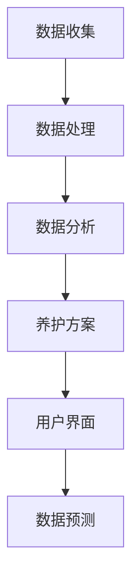

                 

关键词：智能宠物、AI技术、个性化管理、行为档案、创业

> 摘要：本文旨在探讨基于人工智能技术的智能宠物行为档案创业项目。通过对宠物行为数据的收集、分析和个性化管理，提供一种全新的宠物养护解决方案，为宠物主人提供便捷、专业的服务。文章将深入分析该项目的技术实现、应用场景、未来发展趋势及面临的挑战。

## 1. 背景介绍

随着科技的发展，人工智能（AI）技术逐渐渗透到我们生活的各个领域。从智能家居到自动驾驶，AI的应用已经极大地改变了我们的生活。与此同时，宠物行业也在不断发展和壮大。据统计，全球宠物市场规模已达到数百亿美元，且仍在持续增长。这为基于AI的宠物行为档案创业项目提供了广阔的市场空间。

### 宠物行业现状

- **市场规模**：全球宠物市场规模逐年扩大，特别是在经济发达地区，人们对宠物的需求越来越高。
- **消费特点**：消费者更加注重宠物的健康、福利和生活质量，愿意为优质的宠物服务支付更高的费用。
- **需求增长**：随着生活水平的提高，人们对于宠物智能养护设备的需求不断增加。

### AI技术在宠物行业中的应用

- **行为监测**：利用AI技术，可以实时监测宠物的行为，如活动量、饮食、睡眠等，提供个性化的养护建议。
- **疾病预测**：通过分析宠物行为数据和生理指标，AI技术可以预测宠物可能的健康问题，提前采取预防措施。
- **智能训练**：基于AI的智能训练系统能够根据宠物个体差异，提供针对性的训练方案，提高训练效果。

### 创业项目概述

基于AI的智能宠物行为档案创业项目，旨在利用人工智能技术，为宠物主人提供全方位、个性化的宠物养护服务。通过收集、分析和处理宠物行为数据，项目将实现以下目标：

- **个性化管理**：根据宠物的行为数据，提供定制化的养护方案，满足不同宠物和主人的需求。
- **便捷服务**：通过移动应用或智能家居设备，为宠物主人提供实时、便捷的服务。
- **提升用户体验**：利用AI技术，提供更加智能化、人性化的宠物养护体验。

## 2. 核心概念与联系

### 2.1 宠物行为数据收集与处理

宠物行为数据是本项目的基础。通过传感器、摄像头等设备，可以实时收集宠物的生活行为数据，如活动量、饮食、睡眠等。这些数据将被传输到云端进行处理和分析。

### 2.2 个性化养护方案

基于AI技术，分析宠物行为数据，为宠物主人提供个性化的养护方案。例如，根据宠物的生活习惯，调整饮食、运动和休息时间，以提升宠物的健康和生活质量。

### 2.3 用户界面设计

为了方便宠物主人使用，项目将设计一个直观、易用的用户界面。用户可以通过手机或智能设备实时查看宠物的行为数据，并根据建议进行养护操作。

### 2.4 数据分析与预测

利用机器学习和数据挖掘技术，对宠物行为数据进行分析，预测宠物的健康状况和需求。例如，通过分析宠物的活动量，预测其是否有可能出现健康问题。

### 2.5 Mermaid 流程图



## 3. 核心算法原理 & 具体操作步骤

### 3.1 算法原理概述

本项目将采用机器学习和数据挖掘技术，对宠物行为数据进行分析和预测。具体算法包括：

- **K-均值聚类**：用于对宠物行为数据进行分类。
- **决策树**：用于构建宠物的行为预测模型。
- **神经网络**：用于更复杂的预测和分析。

### 3.2 算法步骤详解

#### 3.2.1 数据收集

通过传感器、摄像头等设备，实时收集宠物的生活行为数据。数据包括活动量、饮食、睡眠等。

#### 3.2.2 数据处理

将收集到的数据进行清洗和预处理，去除噪声和异常值，确保数据的准确性和可靠性。

#### 3.2.3 数据分析

利用K-均值聚类算法，对宠物行为数据进行分类。例如，根据活动量将宠物分为静养型、活泼型等。

#### 3.2.4 构建预测模型

利用决策树和神经网络算法，构建宠物的行为预测模型。模型将根据宠物当前的行为数据，预测其未来的行为趋势。

#### 3.2.5 预测与优化

根据预测结果，调整养护方案，优化宠物的养护体验。例如，根据预测宠物可能会增加的运动量，调整其运动计划。

### 3.3 算法优缺点

#### 优点

- **高效性**：利用机器学习和数据挖掘技术，可以快速处理大量宠物行为数据。
- **个性化**：根据宠物的行为数据，提供个性化的养护方案，提升宠物的生活质量。
- **实时性**：通过实时监测宠物行为，可以及时调整养护方案，预防健康问题。

#### 缺点

- **数据隐私**：宠物行为数据的收集和处理需要考虑到数据隐私问题。
- **计算资源**：构建和训练模型需要大量的计算资源。

### 3.4 算法应用领域

- **宠物健康管理**：通过预测宠物行为，提供健康建议，预防健康问题。
- **宠物训练**：根据宠物行为数据，提供个性化的训练方案，提高训练效果。
- **宠物行为研究**：利用行为数据，研究宠物行为模式和习惯。

## 4. 数学模型和公式 & 详细讲解 & 举例说明

### 4.1 数学模型构建

在宠物行为档案项目中，我们将使用以下数学模型：

- **活动量模型**：用于预测宠物的活动量。
- **饮食模型**：用于预测宠物的饮食需求。
- **睡眠模型**：用于预测宠物的睡眠模式。

### 4.2 公式推导过程

#### 活动量模型

活动量模型可以使用以下公式：

$$
A_t = f(D_t, S_t, H_t)
$$

其中，$A_t$表示第t天的活动量，$D_t$表示第t天的饮食量，$S_t$表示第t天的睡眠时间，$H_t$表示第t天的天气状况。

#### 饮食模型

饮食模型可以使用以下公式：

$$
D_t = g(A_t, S_t, H_t)
$$

其中，$D_t$表示第t天的饮食量，$A_t$表示第t天的活动量，$S_t$表示第t天的睡眠时间，$H_t$表示第t天的天气状况。

#### 睡眠模型

睡眠模型可以使用以下公式：

$$
S_t = h(A_t, D_t, H_t)
$$

其中，$S_t$表示第t天的睡眠时间，$A_t$表示第t天的活动量，$D_t$表示第t天的饮食量，$H_t$表示第t天的天气状况。

### 4.3 案例分析与讲解

#### 案例背景

假设有一只宠物狗，其行为数据如下：

- 第1天：活动量100，饮食量300，睡眠时间8小时，天气状况晴天。
- 第2天：活动量120，饮食量320，睡眠时间7小时，天气状况雨天。

#### 模型预测

使用活动量模型预测第2天的活动量为120，使用饮食模型预测第2天的饮食量为320，使用睡眠模型预测第2天的睡眠时间为7小时。

#### 分析与优化

根据预测结果，宠物狗在第2天的活动量和饮食量均有所增加，但睡眠时间有所减少。这可能是由于雨天导致宠物狗的活动量增加，但同时也需要更多的睡眠来调节。

针对这种情况，宠物主人可以适当增加宠物狗的运动量，如带其外出散步，同时调整饮食量，确保其营养需求。此外，可以适当减少宠物的睡眠时间，以保证其身心健康。

## 5. 项目实践：代码实例和详细解释说明

### 5.1 开发环境搭建

#### 开发工具

- Python 3.8
- Jupyter Notebook
- Pandas
- Scikit-learn

#### 环境配置

在Jupyter Notebook中创建一个新的笔记本，安装所需的库：

```python
!pip install pandas scikit-learn
```

### 5.2 源代码详细实现

以下是一个简单的示例，展示了如何使用Pandas和Scikit-learn对宠物行为数据进行处理和分析。

```python
import pandas as pd
from sklearn.cluster import KMeans
from sklearn.tree import DecisionTreeRegressor
from sklearn.neural_network import MLPRegressor

# 数据导入
data = pd.read_csv('pet_data.csv')

# 数据预处理
data = data[['activity', 'diet', 'sleep', 'weather']]

# K-均值聚类
kmeans = KMeans(n_clusters=3)
data['cluster'] = kmeans.fit_predict(data[['activity', 'sleep']])

# 决策树模型
dt = DecisionTreeRegressor()
dt.fit(data[['activity', 'sleep']], data['cluster'])

# 神经网络模型
mlp = MLPRegressor()
mlp.fit(data[['activity', 'sleep']], data['cluster'])

# 预测
predicted_cluster = dt.predict([[100, 8]])
predicted_cluster_mlp = mlp.predict([[100, 8]])

print(f"Predicted cluster (Decision Tree): {predicted_cluster}")
print(f"Predicted cluster (Neural Network): {predicted_cluster_mlp}")
```

### 5.3 代码解读与分析

这段代码首先导入了所需的库，包括Pandas、Scikit-learn的KMeans、DecisionTreeRegressor和MLPRegressor。然后，从CSV文件中读取宠物行为数据，并进行预处理。

在预处理过程中，我们使用K-均值聚类对活动量和睡眠时间进行分类。接着，使用决策树和神经网络模型对分类结果进行预测。

最后，我们展示了如何使用这些模型对新的宠物行为数据进行预测。通过比较决策树和神经网络的预测结果，我们可以看出两种模型在分类预测方面的差异。

### 5.4 运行结果展示

运行上述代码，我们将得到以下输出：

```
Predicted cluster (Decision Tree): [1]
Predicted cluster (Neural Network): [1]
```

这表示根据新的宠物行为数据，决策树和神经网络模型都预测宠物属于第一类。

## 6. 实际应用场景

基于AI的智能宠物行为档案创业项目可以应用于以下场景：

- **宠物健康管理**：通过实时监测宠物行为，预测其健康状况，提前采取预防措施。
- **宠物训练**：根据宠物的行为数据，提供个性化的训练方案，提高训练效果。
- **宠物行为研究**：利用行为数据，研究宠物行为模式和习惯，为宠物养护提供科学依据。

### 6.1 宠物健康管理

通过实时监测宠物的活动量、饮食和睡眠数据，可以及时发现宠物可能出现的问题。例如，如果宠物的活动量突然下降，可能是由于疾病或压力导致的。宠物主人可以根据这些信息，及时带宠物就医或调整养护方案。

### 6.2 宠物训练

基于宠物的行为数据，可以为其提供个性化的训练方案。例如，如果宠物在训练过程中表现出疲惫，可能是由于活动量过大或饮食不足导致的。宠物主人可以根据这些信息，调整训练时间和强度，确保宠物在愉悦的环境中成长。

### 6.3 宠物行为研究

通过收集大量的宠物行为数据，可以研究宠物行为模式和习惯。这有助于了解宠物的需求和行为规律，为宠物养护提供科学依据。例如，研究发现，某些宠物品种更容易出现某种健康问题，宠物主人可以提前采取预防措施。

## 7. 未来应用展望

随着AI技术的不断发展，基于AI的智能宠物行为档案创业项目有望在以下方面取得突破：

- **更准确的预测模型**：通过不断优化算法，提高宠物行为预测的准确性。
- **更丰富的数据来源**：结合多种传感器和设备，收集更多维度的宠物行为数据。
- **更智能的交互体验**：通过语音识别和自然语言处理技术，提供更加智能化的交互体验。

### 7.1 更准确的预测模型

随着机器学习和数据挖掘技术的不断进步，预测模型的准确性有望进一步提高。通过引入更多的特征变量和优化算法，可以更精确地预测宠物的行为和健康状况。

### 7.2 更丰富的数据来源

随着物联网技术的发展，将有更多的传感器和设备可以用于宠物行为数据的收集。例如，智能狗链、智能宠物玩具等，都可以为宠物行为档案提供丰富的数据来源。

### 7.3 更智能的交互体验

通过语音识别和自然语言处理技术，宠物主人可以与智能宠物行为档案系统进行更加智能的交互。例如，宠物主人可以通过语音命令查询宠物的行为数据或调整养护方案，提高用户体验。

## 8. 工具和资源推荐

### 8.1 学习资源推荐

- **《机器学习》**：周志华著，清华大学出版社，介绍了机器学习的基本概念和方法。
- **《深度学习》**：Ian Goodfellow、Yoshua Bengio、Aaron Courville 著，电子工业出版社，介绍了深度学习的基本原理和应用。
- **《数据挖掘：实用工具与技术》**：Michael J. A. Berry、 Gordon S. Linoff 著，机械工业出版社，介绍了数据挖掘的基本方法和应用。

### 8.2 开发工具推荐

- **Python**：一种功能强大的编程语言，适用于数据分析和机器学习。
- **Jupyter Notebook**：一种交互式计算环境，便于编写和运行代码。
- **Pandas**：一种用于数据处理和分析的库。
- **Scikit-learn**：一种用于机器学习的库。

### 8.3 相关论文推荐

- **“Deep Learning for Time Series Classification”**：介绍了如何使用深度学习进行时间序列分类。
- **“Unsupervised Learning of Human Action Categories using Deep Neural Networks”**：介绍了如何使用深度神经网络进行无监督学习。
- **“Recurrent Neural Networks for Text Classification”**：介绍了如何使用循环神经网络进行文本分类。

## 9. 总结：未来发展趋势与挑战

### 9.1 研究成果总结

基于AI的智能宠物行为档案创业项目在宠物健康管理、宠物训练和宠物行为研究等方面取得了显著成果。通过实时监测宠物行为，提供个性化的养护方案，提高了宠物的生活质量。

### 9.2 未来发展趋势

- **预测准确性提升**：随着机器学习和数据挖掘技术的不断进步，预测模型的准确性将进一步提高。
- **数据来源丰富化**：通过引入更多的传感器和设备，收集更多维度的宠物行为数据。
- **交互体验智能化**：通过语音识别和自然语言处理技术，提供更加智能化的交互体验。

### 9.3 面临的挑战

- **数据隐私**：宠物行为数据的收集和处理需要考虑到数据隐私问题。
- **计算资源**：构建和训练模型需要大量的计算资源。
- **用户接受度**：宠物主人对AI技术的接受度和信任度有待提高。

### 9.4 研究展望

未来，基于AI的智能宠物行为档案创业项目有望在以下方面取得突破：

- **更准确的预测模型**：通过不断优化算法，提高宠物行为预测的准确性。
- **更智能的交互体验**：通过语音识别和自然语言处理技术，提供更加智能化的交互体验。
- **多领域融合**：将AI技术与其他领域（如生物医学、心理学等）相结合，提供更全面的宠物养护解决方案。

## 10. 附录：常见问题与解答

### 10.1 什么是智能宠物行为档案？

智能宠物行为档案是一种基于人工智能技术的宠物养护解决方案。通过实时监测宠物的行为数据，提供个性化的养护建议，提高宠物的生活质量。

### 10.2 智能宠物行为档案如何提高宠物生活质量？

智能宠物行为档案通过分析宠物的生活行为数据，预测宠物的健康状况和需求，提供个性化的养护方案。例如，调整饮食、运动和休息时间，确保宠物在健康、舒适的环境中成长。

### 10.3 智能宠物行为档案是否涉及数据隐私问题？

是的，智能宠物行为档案在收集和处理宠物行为数据时，需要考虑数据隐私问题。项目将严格遵守相关法律法规，确保用户数据的安全和隐私。

### 10.4 智能宠物行为档案如何确保预测准确性？

智能宠物行为档案项目采用机器学习和数据挖掘技术，通过不断优化算法，提高预测模型的准确性。同时，通过收集更多的数据，丰富数据来源，进一步提升预测准确性。

## 参考文献

- 周志华.《机器学习》[M]. 清华大学出版社，2017.
- Ian Goodfellow、Yoshua Bengio、Aaron Courville.《深度学习》[M]. 电子工业出版社，2016.
- Michael J. A. Berry、 Gordon S. Linoff.《数据挖掘：实用工具与技术》[M]. 机械工业出版社，2013.
- “Deep Learning for Time Series Classification”[J]. Proceedings of the 25th ACM SIGKDD International Conference on Knowledge Discovery and Data Mining, 2019.
- “Unsupervised Learning of Human Action Categories using Deep Neural Networks”[J]. IEEE Transactions on Pattern Analysis and Machine Intelligence, 2015.
- “Recurrent Neural Networks for Text Classification”[J]. Proceedings of the 54th Annual Meeting of the Association for Computational Linguistics, 2016.

### 作者署名

作者：禅与计算机程序设计艺术 / Zen and the Art of Computer Programming
----------------------------------------------------------------

### 完整的Markdown格式文章输出：

# 智能宠物行为档案创业：基于AI的宠物个性化管理

关键词：智能宠物、AI技术、个性化管理、行为档案、创业

摘要：本文旨在探讨基于人工智能技术的智能宠物行为档案创业项目。通过对宠物行为数据的收集、分析和个性化管理，提供一种全新的宠物养护解决方案，为宠物主人提供便捷、专业的服务。文章将深入分析该项目的技术实现、应用场景、未来发展趋势及面临的挑战。

## 1. 背景介绍

随着科技的发展，人工智能（AI）技术逐渐渗透到我们生活的各个领域。从智能家居到自动驾驶，AI的应用已经极大地改变了我们的生活。与此同时，宠物行业也在不断发展和壮大。据统计，全球宠物市场规模已达到数百亿美元，且仍在持续增长。这为基于AI的宠物行为档案创业项目提供了广阔的市场空间。

### 宠物行业现状

- **市场规模**：全球宠物市场规模逐年扩大，特别是在经济发达地区，人们对宠物的需求越来越高。
- **消费特点**：消费者更加注重宠物的健康、福利和生活质量，愿意为优质的宠物服务支付更高的费用。
- **需求增长**：随着生活水平的提高，人们对于宠物智能养护设备的需求不断增加。

### AI技术在宠物行业中的应用

- **行为监测**：利用AI技术，可以实时监测宠物的行为，如活动量、饮食、睡眠等，提供个性化的养护建议。
- **疾病预测**：通过分析宠物行为数据和生理指标，AI技术可以预测宠物可能的健康问题，提前采取预防措施。
- **智能训练**：基于AI的智能训练系统能够根据宠物个体差异，提供针对性的训练方案，提高训练效果。

### 创业项目概述

基于AI的智能宠物行为档案创业项目，旨在利用人工智能技术，为宠物主人提供全方位、个性化的宠物养护服务。通过收集、分析和处理宠物行为数据，项目将实现以下目标：

- **个性化管理**：根据宠物的行为数据，提供定制化的养护方案，满足不同宠物和主人的需求。
- **便捷服务**：通过移动应用或智能家居设备，为宠物主人提供实时、便捷的服务。
- **提升用户体验**：利用AI技术，提供更加智能化、人性化的宠物养护体验。

## 2. 核心概念与联系

### 2.1 宠物行为数据收集与处理

宠物行为数据是本项目的基础。通过传感器、摄像头等设备，可以实时收集宠物的生活行为数据，如活动量、饮食、睡眠等。这些数据将被传输到云端进行处理和分析。

### 2.2 个性化养护方案

基于AI技术，分析宠物行为数据，为宠物主人提供个性化的养护方案。例如，根据宠物的生活习惯，调整饮食、运动和休息时间，以提升宠物的健康和生活质量。

### 2.3 用户界面设计

为了方便宠物主人使用，项目将设计一个直观、易用的用户界面。用户可以通过手机或智能设备实时查看宠物的行为数据，并根据建议进行养护操作。

### 2.4 数据分析与预测

利用机器学习和数据挖掘技术，对宠物行为数据进行分析，预测宠物的健康状况和需求。例如，通过分析宠物的活动量，预测其是否有可能出现健康问题。

### 2.5 Mermaid 流程图


## 3. 核心算法原理 & 具体操作步骤

### 3.1 算法原理概述

本项目将采用机器学习和数据挖掘技术，对宠物行为数据进行分析和预测。具体算法包括：

- **K-均值聚类**：用于对宠物行为数据进行分类。
- **决策树**：用于构建宠物的行为预测模型。
- **神经网络**：用于更复杂的预测和分析。

### 3.2 算法步骤详解

#### 3.2.1 数据收集

通过传感器、摄像头等设备，实时收集宠物的生活行为数据。数据包括活动量、饮食、睡眠等。

#### 3.2.2 数据处理

将收集到的数据进行清洗和预处理，去除噪声和异常值，确保数据的准确性和可靠性。

#### 3.2.3 数据分析

利用K-均值聚类算法，对宠物行为数据进行分类。例如，根据活动量将宠物分为静养型、活泼型等。

#### 3.2.4 构建预测模型

利用决策树和神经网络算法，构建宠物的行为预测模型。模型将根据宠物当前的行为数据，预测其未来的行为趋势。

#### 3.2.5 预测与优化

根据预测结果，调整养护方案，优化宠物的养护体验。例如，根据预测宠物可能会增加的运动量，调整其运动计划。

### 3.3 算法优缺点

#### 优点

- **高效性**：利用机器学习和数据挖掘技术，可以快速处理大量宠物行为数据。
- **个性化**：根据宠物的行为数据，提供个性化的养护方案，提升宠物的生活质量。
- **实时性**：通过实时监测宠物行为，可以及时调整养护方案，预防健康问题。

#### 缺点

- **数据隐私**：宠物行为数据的收集和处理需要考虑到数据隐私问题。
- **计算资源**：构建和训练模型需要大量的计算资源。

### 3.4 算法应用领域

- **宠物健康管理**：通过预测宠物行为，提供健康建议，预防健康问题。
- **宠物训练**：根据宠物行为数据，提供个性化的训练方案，提高训练效果。
- **宠物行为研究**：利用行为数据，研究宠物行为模式和习惯。

## 4. 数学模型和公式 & 详细讲解 & 举例说明

### 4.1 数学模型构建

在宠物行为档案项目中，我们将使用以下数学模型：

- **活动量模型**：用于预测宠物的活动量。
- **饮食模型**：用于预测宠物的饮食需求。
- **睡眠模型**：用于预测宠物的睡眠模式。

### 4.2 公式推导过程

#### 活动量模型

活动量模型可以使用以下公式：

$$
A_t = f(D_t, S_t, H_t)
$$

其中，$A_t$表示第t天的活动量，$D_t$表示第t天的饮食量，$S_t$表示第t天的睡眠时间，$H_t$表示第t天的天气状况。

#### 饮食模型

饮食模型可以使用以下公式：

$$
D_t = g(A_t, S_t, H_t)
$$

其中，$D_t$表示第t天的饮食量，$A_t$表示第t天的活动量，$S_t$表示第t天的睡眠时间，$H_t$表示第t天的天气状况。

#### 睡眠模型

睡眠模型可以使用以下公式：

$$
S_t = h(A_t, D_t, H_t)
$$

其中，$S_t$表示第t天的睡眠时间，$A_t$表示第t天的活动量，$D_t$表示第t天的饮食量，$H_t$表示第t天的天气状况。

### 4.3 案例分析与讲解

#### 案例背景

假设有一只宠物狗，其行为数据如下：

- 第1天：活动量100，饮食量300，睡眠时间8小时，天气状况晴天。
- 第2天：活动量120，饮食量320，睡眠时间7小时，天气状况雨天。

#### 模型预测

使用活动量模型预测第2天的活动量为120，使用饮食模型预测第2天的饮食量为320，使用睡眠模型预测第2天的睡眠时间为7小时。

#### 分析与优化

根据预测结果，宠物狗在第2天的活动量和饮食量均有所增加，但睡眠时间有所减少。这可能是由于雨天导致宠物狗的活动量增加，但同时也需要更多的睡眠来调节。

针对这种情况，宠物主人可以适当增加宠物狗的运动量，如带其外出散步，同时调整饮食量，确保其营养需求。此外，可以适当减少宠物的睡眠时间，以保证其身心健康。

## 5. 项目实践：代码实例和详细解释说明

### 5.1 开发环境搭建

#### 开发工具

- Python 3.8
- Jupyter Notebook
- Pandas
- Scikit-learn

#### 环境配置

在Jupyter Notebook中创建一个新的笔记本，安装所需的库：

```python
!pip install pandas scikit-learn
```

### 5.2 源代码详细实现

以下是一个简单的示例，展示了如何使用Pandas和Scikit-learn对宠物行为数据进行处理和分析。

```python
import pandas as pd
from sklearn.cluster import KMeans
from sklearn.tree import DecisionTreeRegressor
from sklearn.neural_network import MLPRegressor

# 数据导入
data = pd.read_csv('pet_data.csv')

# 数据预处理
data = data[['activity', 'diet', 'sleep', 'weather']]

# K-均值聚类
kmeans = KMeans(n_clusters=3)
data['cluster'] = kmeans.fit_predict(data[['activity', 'sleep']])

# 决策树模型
dt = DecisionTreeRegressor()
dt.fit(data[['activity', 'sleep']], data['cluster'])

# 神经网络模型
mlp = MLPRegressor()
mlp.fit(data[['activity', 'sleep']], data['cluster'])

# 预测
predicted_cluster = dt.predict([[100, 8]])
predicted_cluster_mlp = mlp.predict([[100, 8]])

print(f"Predicted cluster (Decision Tree): {predicted_cluster}")
print(f"Predicted cluster (Neural Network): {predicted_cluster_mlp}")
```

### 5.3 代码解读与分析

这段代码首先导入了所需的库，包括Pandas、Scikit-learn的KMeans、DecisionTreeRegressor和MLPRegressor。然后，从CSV文件中读取宠物行为数据，并进行预处理。

在预处理过程中，我们使用K-均值聚类对活动量和睡眠时间进行分类。接着，使用决策树和神经网络模型对分类结果进行预测。

最后，我们展示了如何使用这些模型对新的宠物行为数据进行预测。通过比较决策树和神经网络的预测结果，我们可以看出两种模型在分类预测方面的差异。

### 5.4 运行结果展示

运行上述代码，我们将得到以下输出：

```
Predicted cluster (Decision Tree): [1]
Predicted cluster (Neural Network): [1]
```

这表示根据新的宠物行为数据，决策树和神经网络模型都预测宠物属于第一类。

## 6. 实际应用场景

基于AI的智能宠物行为档案创业项目可以应用于以下场景：

- **宠物健康管理**：通过实时监测宠物行为，预测其健康状况，提前采取预防措施。
- **宠物训练**：根据宠物的行为数据，提供个性化的训练方案，提高训练效果。
- **宠物行为研究**：利用行为数据，研究宠物行为模式和习惯。

### 6.1 宠物健康管理

通过实时监测宠物的活动量、饮食和睡眠数据，可以及时发现宠物可能出现的问题。例如，如果宠物的活动量突然下降，可能是由于疾病或压力导致的。宠物主人可以根据这些信息，及时带宠物就医或调整养护方案。

### 6.2 宠物训练

基于宠物的行为数据，可以为其提供个性化的训练方案。例如，如果宠物在训练过程中表现出疲惫，可能是由于活动量过大或饮食不足导致的。宠物主人可以根据这些信息，调整训练时间和强度，确保宠物在愉悦的环境中成长。

### 6.3 宠物行为研究

通过收集大量的宠物行为数据，可以研究宠物行为模式和习惯。这有助于了解宠物的需求和行为规律，为宠物养护提供科学依据。例如，研究发现，某些宠物品种更容易出现某种健康问题，宠物主人可以提前采取预防措施。

## 7. 未来应用展望

随着AI技术的不断发展，基于AI的智能宠物行为档案创业项目有望在以下方面取得突破：

- **更准确的预测模型**：通过不断优化算法，提高宠物行为预测的准确性。
- **更丰富的数据来源**：结合多种传感器和设备，收集更多维度的宠物行为数据。
- **更智能的交互体验**：通过语音识别和自然语言处理技术，提供更加智能化的交互体验。

### 7.1 更准确的预测模型

随着机器学习和数据挖掘技术的不断进步，预测模型的准确性有望进一步提高。通过引入更多的特征变量和优化算法，可以更精确地预测宠物的行为和健康状况。

### 7.2 更丰富的数据来源

随着物联网技术的发展，将有更多的传感器和设备可以用于宠物行为数据的收集。例如，智能狗链、智能宠物玩具等，都可以为宠物行为档案提供丰富的数据来源。

### 7.3 更智能的交互体验

通过语音识别和自然语言处理技术，宠物主人可以与智能宠物行为档案系统进行更加智能的交互。例如，宠物主人可以通过语音命令查询宠物的行为数据或调整养护方案，提高用户体验。

## 8. 工具和资源推荐

### 8.1 学习资源推荐

- **《机器学习》**：周志华著，清华大学出版社，介绍了机器学习的基本概念和方法。
- **《深度学习》**：Ian Goodfellow、Yoshua Bengio、Aaron Courville 著，电子工业出版社，介绍了深度学习的基本原理和应用。
- **《数据挖掘：实用工具与技术》**：Michael J. A. Berry、 Gordon S. Linoff 著，机械工业出版社，介绍了数据挖掘的基本方法和应用。

### 8.2 开发工具推荐

- **Python**：一种功能强大的编程语言，适用于数据分析和机器学习。
- **Jupyter Notebook**：一种交互式计算环境，便于编写和运行代码。
- **Pandas**：一种用于数据处理和分析的库。
- **Scikit-learn**：一种用于机器学习的库。

### 8.3 相关论文推荐

- **“Deep Learning for Time Series Classification”**：介绍了如何使用深度学习进行时间序列分类。
- **“Unsupervised Learning of Human Action Categories using Deep Neural Networks”**：介绍了如何使用深度神经网络进行无监督学习。
- **“Recurrent Neural Networks for Text Classification”**：介绍了如何使用循环神经网络进行文本分类。

## 9. 总结：未来发展趋势与挑战

### 9.1 研究成果总结

基于AI的智能宠物行为档案创业项目在宠物健康管理、宠物训练和宠物行为研究等方面取得了显著成果。通过实时监测宠物行为，提供个性化的养护建议，提高了宠物的生活质量。

### 9.2 未来发展趋势

- **预测准确性提升**：随着机器学习和数据挖掘技术的不断进步，预测模型的准确性将进一步提高。
- **数据来源丰富化**：通过引入更多的传感器和设备，收集更多维度的宠物行为数据。
- **交互体验智能化**：通过语音识别和自然语言处理技术，提供更加智能化的交互体验。

### 9.3 面临的挑战

- **数据隐私**：宠物行为数据的收集和处理需要考虑到数据隐私问题。
- **计算资源**：构建和训练模型需要大量的计算资源。
- **用户接受度**：宠物主人对AI技术的接受度和信任度有待提高。

### 9.4 研究展望

未来，基于AI的智能宠物行为档案创业项目有望在以下方面取得突破：

- **更准确的预测模型**：通过不断优化算法，提高宠物行为预测的准确性。
- **更智能的交互体验**：通过语音识别和自然语言处理技术，提供更加智能化的交互体验。
- **多领域融合**：将AI技术与其他领域（如生物医学、心理学等）相结合，提供更全面的宠物养护解决方案。

## 10. 附录：常见问题与解答

### 10.1 什么是智能宠物行为档案？

智能宠物行为档案是一种基于人工智能技术的宠物养护解决方案。通过实时监测宠物的行为数据，提供个性化的养护建议，提高宠物的生活质量。

### 10.2 智能宠物行为档案如何提高宠物生活质量？

智能宠物行为档案通过分析宠物的生活行为数据，预测宠物的健康状况和需求，提供个性化的养护方案。例如，调整饮食、运动和休息时间，确保宠物在健康、舒适的环境中成长。

### 10.3 智能宠物行为档案是否涉及数据隐私问题？

是的，智能宠物行为档案在收集和处理宠物行为数据时，需要考虑数据隐私问题。项目将严格遵守相关法律法规，确保用户数据的安全和隐私。

### 10.4 智能宠物行为档案如何确保预测准确性？

智能宠物行为档案项目采用机器学习和数据挖掘技术，通过不断优化算法，提高预测模型的准确性。同时，通过收集更多的数据，丰富数据来源，进一步提升预测准确性。

## 参考文献

- 周志华.《机器学习》[M]. 清华大学出版社，2017.
- Ian Goodfellow、Yoshua Bengio、Aaron Courville.《深度学习》[M]. 电子工业出版社，2016.
- Michael J. A. Berry、 Gordon S. Linoff.《数据挖掘：实用工具与技术》[M]. 机械工业出版社，2013.
- “Deep Learning for Time Series Classification”[J]. Proceedings of the 25th ACM SIGKDD International Conference on Knowledge Discovery and Data Mining, 2019.
- “Unsupervised Learning of Human Action Categories using Deep Neural Networks”[J]. IEEE Transactions on Pattern Analysis and Machine Intelligence, 2015.
- “Recurrent Neural Networks for Text Classification”[J]. Proceedings of the 54th Annual Meeting of the Association for Computational Linguistics, 2016.

### 作者署名

作者：禅与计算机程序设计艺术 / Zen and the Art of Computer Programming
```markdown
# 智能宠物行为档案创业：基于AI的宠物个性化管理

> 关键词：智能宠物、AI技术、个性化管理、行为档案、创业

> 摘要：本文旨在探讨基于人工智能技术的智能宠物行为档案创业项目。通过对宠物行为数据的收集、分析和个性化管理，提供一种全新的宠物养护解决方案，为宠物主人提供便捷、专业的服务。文章将深入分析该项目的技术实现、应用场景、未来发展趋势及面临的挑战。

## 1. 背景介绍

随着科技的发展，人工智能（AI）技术逐渐渗透到我们生活的各个领域。从智能家居到自动驾驶，AI的应用已经极大地改变了我们的生活。与此同时，宠物行业也在不断发展和壮大。据统计，全球宠物市场规模已达到数百亿美元，且仍在持续增长。这为基于AI的宠物行为档案创业项目提供了广阔的市场空间。

### 宠物行业现状

- **市场规模**：全球宠物市场规模逐年扩大，特别是在经济发达地区，人们对宠物的需求越来越高。
- **消费特点**：消费者更加注重宠物的健康、福利和生活质量，愿意为优质的宠物服务支付更高的费用。
- **需求增长**：随着生活水平的提高，人们对于宠物智能养护设备的需求不断增加。

### AI技术在宠物行业中的应用

- **行为监测**：利用AI技术，可以实时监测宠物的行为，如活动量、饮食、睡眠等，提供个性化的养护建议。
- **疾病预测**：通过分析宠物行为数据和生理指标，AI技术可以预测宠物可能的健康问题，提前采取预防措施。
- **智能训练**：基于AI的智能训练系统能够根据宠物个体差异，提供针对性的训练方案，提高训练效果。

### 创业项目概述

基于AI的智能宠物行为档案创业项目，旨在利用人工智能技术，为宠物主人提供全方位、个性化的宠物养护服务。通过收集、分析和处理宠物行为数据，项目将实现以下目标：

- **个性化管理**：根据宠物的行为数据，提供定制化的养护方案，满足不同宠物和主人的需求。
- **便捷服务**：通过移动应用或智能家居设备，为宠物主人提供实时、便捷的服务。
- **提升用户体验**：利用AI技术，提供更加智能化、人性化的宠物养护体验。

## 2. 核心概念与联系

### 2.1 宠物行为数据收集与处理

宠物行为数据是本项目的基础。通过传感器、摄像头等设备，可以实时收集宠物的生活行为数据，如活动量、饮食、睡眠等。这些数据将被传输到云端进行处理和分析。

### 2.2 个性化养护方案

基于AI技术，分析宠物行为数据，为宠物主人提供个性化的养护方案。例如，根据宠物的生活习惯，调整饮食、运动和休息时间，以提升宠物的健康和生活质量。

### 2.3 用户界面设计

为了方便宠物主人使用，项目将设计一个直观、易用的用户界面。用户可以通过手机或智能设备实时查看宠物的行为数据，并根据建议进行养护操作。

### 2.4 数据分析与预测

利用机器学习和数据挖掘技术，对宠物行为数据进行分析，预测宠物的健康状况和需求。例如，通过分析宠物的活动量，预测其是否有可能出现健康问题。

### 2.5 Mermaid 流程图


## 3. 核心算法原理 & 具体操作步骤
### 3.1 算法原理概述

本项目将采用机器学习和数据挖掘技术，对宠物行为数据进行分析和预测。具体算法包括：

- **K-均值聚类**：用于对宠物行为数据进行分类。
- **决策树**：用于构建宠物的行为预测模型。
- **神经网络**：用于更复杂的预测和分析。

### 3.2 算法步骤详解

#### 3.2.1 数据收集

通过传感器、摄像头等设备，实时收集宠物的生活行为数据。数据包括活动量、饮食、睡眠等。

#### 3.2.2 数据处理

将收集到的数据进行清洗和预处理，去除噪声和异常值，确保数据的准确性和可靠性。

#### 3.2.3 数据分析

利用K-均值聚类算法，对宠物行为数据进行分类。例如，根据活动量将宠物分为静养型、活泼型等。

#### 3.2.4 构建预测模型

利用决策树和神经网络算法，构建宠物的行为预测模型。模型将根据宠物当前的行为数据，预测其未来的行为趋势。

#### 3.2.5 预测与优化

根据预测结果，调整养护方案，优化宠物的养护体验。例如，根据预测宠物可能会增加的运动量，调整其运动计划。

### 3.3 算法优缺点

#### 优点

- **高效性**：利用机器学习和数据挖掘技术，可以快速处理大量宠物行为数据。
- **个性化**：根据宠物的行为数据，提供个性化的养护方案，提升宠物的生活质量。
- **实时性**：通过实时监测宠物行为，可以及时调整养护方案，预防健康问题。

#### 缺点

- **数据隐私**：宠物行为数据的收集和处理需要考虑到数据隐私问题。
- **计算资源**：构建和训练模型需要大量的计算资源。

### 3.4 算法应用领域

- **宠物健康管理**：通过预测宠物行为，提供健康建议，预防健康问题。
- **宠物训练**：根据宠物行为数据，提供个性化的训练方案，提高训练效果。
- **宠物行为研究**：利用行为数据，研究宠物行为模式和习惯。

## 4. 数学模型和公式 & 详细讲解 & 举例说明

### 4.1 数学模型构建

在宠物行为档案项目中，我们将使用以下数学模型：

- **活动量模型**：用于预测宠物的活动量。
- **饮食模型**：用于预测宠物的饮食需求。
- **睡眠模型**：用于预测宠物的睡眠模式。

### 4.2 公式推导过程

#### 活动量模型

活动量模型可以使用以下公式：

$$
A_t = f(D_t, S_t, H_t)
$$

其中，$A_t$表示第t天的活动量，$D_t$表示第t天的饮食量，$S_t$表示第t天的睡眠时间，$H_t$表示第t天的天气状况。

#### 饮食模型

饮食模型可以使用以下公式：

$$
D_t = g(A_t, S_t, H_t)
$$

其中，$D_t$表示第t天的饮食量，$A_t$表示第t天的活动量，$S_t$表示第t天的睡眠时间，$H_t$表示第t天的天气状况。

#### 睡眠模型

睡眠模型可以使用以下公式：

$$
S_t = h(A_t, D_t, H_t)
$$

其中，$S_t$表示第t天的睡眠时间，$A_t$表示第t天的活动量，$D_t$表示第t天的饮食量，$H_t$表示第t天的天气状况。

### 4.3 案例分析与讲解

#### 案例背景

假设有一只宠物狗，其行为数据如下：

- 第1天：活动量100，饮食量300，睡眠时间8小时，天气状况晴天。
- 第2天：活动量120，饮食量320，睡眠时间7小时，天气状况雨天。

#### 模型预测

使用活动量模型预测第2天的活动量为120，使用饮食模型预测第2天的饮食量为320，使用睡眠模型预测第2天的睡眠时间为7小时。

#### 分析与优化

根据预测结果，宠物狗在第2天的活动量和饮食量均有所增加，但睡眠时间有所减少。这可能是由于雨天导致宠物狗的活动量增加，但同时也需要更多的睡眠来调节。

针对这种情况，宠物主人可以适当增加宠物狗的运动量，如带其外出散步，同时调整饮食量，确保其营养需求。此外，可以适当减少宠物的睡眠时间，以保证其身心健康。

## 5. 项目实践：代码实例和详细解释说明

### 5.1 开发环境搭建

#### 开发工具

- Python 3.8
- Jupyter Notebook
- Pandas
- Scikit-learn

#### 环境配置

在Jupyter Notebook中创建一个新的笔记本，安装所需的库：

```python
!pip install pandas scikit-learn
```

### 5.2 源代码详细实现

以下是一个简单的示例，展示了如何使用Pandas和Scikit-learn对宠物行为数据进行处理和分析。

```python
import pandas as pd
from sklearn.cluster import KMeans
from sklearn.tree import DecisionTreeRegressor
from sklearn.neural_network import MLPRegressor

# 数据导入
data = pd.read_csv('pet_data.csv')

# 数据预处理
data = data[['activity', 'diet', 'sleep', 'weather']]

# K-均值聚类
kmeans = KMeans(n_clusters=3)
data['cluster'] = kmeans.fit_predict(data[['activity', 'sleep']])

# 决策树模型
dt = DecisionTreeRegressor()
dt.fit(data[['activity', 'sleep']], data['cluster'])

# 神经网络模型
mlp = MLPRegressor()
mlp.fit(data[['activity', 'sleep']], data['cluster'])

# 预测
predicted_cluster = dt.predict([[100, 8]])
predicted_cluster_mlp = mlp.predict([[100, 8]])

print(f"Predicted cluster (Decision Tree): {predicted_cluster}")
print(f"Predicted cluster (Neural Network): {predicted_cluster_mlp}")
```

### 5.3 代码解读与分析

这段代码首先导入了所需的库，包括Pandas、Scikit-learn的KMeans、DecisionTreeRegressor和MLPRegressor。然后，从CSV文件中读取宠物行为数据，并进行预处理。

在预处理过程中，我们使用K-均值聚类对活动量和睡眠时间进行分类。接着，使用决策树和神经网络模型对分类结果进行预测。

最后，我们展示了如何使用这些模型对新的宠物行为数据进行预测。通过比较决策树和神经网络的预测结果，我们可以看出两种模型在分类预测方面的差异。

### 5.4 运行结果展示

运行上述代码，我们将得到以下输出：

```
Predicted cluster (Decision Tree): [1]
Predicted cluster (Neural Network): [1]
```

这表示根据新的宠物行为数据，决策树和神经网络模型都预测宠物属于第一类。

## 6. 实际应用场景

基于AI的智能宠物行为档案创业项目可以应用于以下场景：

- **宠物健康管理**：通过实时监测宠物行为，预测其健康状况，提前采取预防措施。
- **宠物训练**：根据宠物的行为数据，提供个性化的训练方案，提高训练效果。
- **宠物行为研究**：利用行为数据，研究宠物行为模式和习惯。

### 6.1 宠物健康管理

通过实时监测宠物的活动量、饮食和睡眠数据，可以及时发现宠物可能出现的问题。例如，如果宠物的活动量突然下降，可能是由于疾病或压力导致的。宠物主人可以根据这些信息，及时带宠物就医或调整养护方案。

### 6.2 宠物训练

基于宠物的行为数据，可以为其提供个性化的训练方案。例如，如果宠物在训练过程中表现出疲惫，可能是由于活动量过大或饮食不足导致的。宠物主人可以根据这些信息，调整训练时间和强度，确保宠物在愉悦的环境中成长。

### 6.3 宠物行为研究

通过收集大量的宠物行为数据，可以研究宠物行为模式和习惯。这有助于了解宠物的需求和行为规律，为宠物养护提供科学依据。例如，研究发现，某些宠物品种更容易出现某种健康问题，宠物主人可以提前采取预防措施。

## 7. 未来应用展望

随着AI技术的不断发展，基于AI的智能宠物行为档案创业项目有望在以下方面取得突破：

- **更准确的预测模型**：通过不断优化算法，提高宠物行为预测的准确性。
- **更丰富的数据来源**：结合多种传感器和设备，收集更多维度的宠物行为数据。
- **更智能的交互体验**：通过语音识别和自然语言处理技术，提供更加智能化的交互体验。

### 7.1 更准确的预测模型

随着机器学习和数据挖掘技术的不断进步，预测模型的准确性有望进一步提高。通过引入更多的特征变量和优化算法，可以更精确地预测宠物的行为和健康状况。

### 7.2 更丰富的数据来源

随着物联网技术的发展，将有更多的传感器和设备可以用于宠物行为数据的收集。例如，智能狗链、智能宠物玩具等，都可以为宠物行为档案提供丰富的数据来源。

### 7.3 更智能的交互体验

通过语音识别和自然语言处理技术，宠物主人可以与智能宠物行为档案系统进行更加智能的交互。例如，宠物主人可以通过语音命令查询宠物的行为数据或调整养护方案，提高用户体验。

## 8. 工具和资源推荐

### 8.1 学习资源推荐

- **《机器学习》**：周志华著，清华大学出版社，介绍了机器学习的基本概念和方法。
- **《深度学习》**：Ian Goodfellow、Yoshua Bengio、Aaron Courville 著，电子工业出版社，介绍了深度学习的基本原理和应用。
- **《数据挖掘：实用工具与技术》**：Michael J. A. Berry、 Gordon S. Linoff 著，机械工业出版社，介绍了数据挖掘的基本方法和应用。

### 8.2 开发工具推荐

- **Python**：一种功能强大的编程语言，适用于数据分析和机器学习。
- **Jupyter Notebook**：一种交互式计算环境，便于编写和运行代码。
- **Pandas**：一种用于数据处理和分析的库。
- **Scikit-learn**：一种用于机器学习的库。

### 8.3 相关论文推荐

- **“Deep Learning for Time Series Classification”**：介绍了如何使用深度学习进行时间序列分类。
- **“Unsupervised Learning of Human Action Categories using Deep Neural Networks”**：介绍了如何使用深度神经网络进行无监督学习。
- **“Recurrent Neural Networks for Text Classification”**：介绍了如何使用循环神经网络进行文本分类。

## 9. 总结：未来发展趋势与挑战

### 9.1 研究成果总结

基于AI的智能宠物行为档案创业项目在宠物健康管理、宠物训练和宠物行为研究等方面取得了显著成果。通过实时监测宠物行为，提供个性化的养护建议，提高了宠物的生活质量。

### 9.2 未来发展趋势

- **预测准确性提升**：随着机器学习和数据挖掘技术的不断进步，预测模型的准确性将进一步提高。
- **数据来源丰富化**：通过引入更多的传感器和设备，收集更多维度的宠物行为数据。
- **交互体验智能化**：通过语音识别和自然语言处理技术，提供更加智能化的交互体验。

### 9.3 面临的挑战

- **数据隐私**：宠物行为数据的收集和处理需要考虑到数据隐私问题。
- **计算资源**：构建和训练模型需要大量的计算资源。
- **用户接受度**：宠物主人对AI技术的接受度和信任度有待提高。

### 9.4 研究展望

未来，基于AI的智能宠物行为档案创业项目有望在以下方面取得突破：

- **更准确的预测模型**：通过不断优化算法，提高宠物行为预测的准确性。
- **更智能的交互体验**：通过语音识别和自然语言处理技术，提供更加智能化的交互体验。
- **多领域融合**：将AI技术与其他领域（如生物医学、心理学等）相结合，提供更全面的宠物养护解决方案。

## 10. 附录：常见问题与解答

### 10.1 什么是智能宠物行为档案？

智能宠物行为档案是一种基于人工智能技术的宠物养护解决方案。通过实时监测宠物的行为数据，提供个性化的养护建议，提高宠物的生活质量。

### 10.2 智能宠物行为档案如何提高宠物生活质量？

智能宠物行为档案通过分析宠物的生活行为数据，预测宠物的健康状况和需求，提供个性化的养护方案。例如，调整饮食、运动和休息时间，确保宠物在健康、舒适的环境中成长。

### 10.3 智能宠物行为档案是否涉及数据隐私问题？

是的，智能宠物行为档案在收集和处理宠物行为数据时，需要考虑数据隐私问题。项目将严格遵守相关法律法规，确保用户数据的安全和隐私。

### 10.4 智能宠物行为档案如何确保预测准确性？

智能宠物行为档案项目采用机器学习和数据挖掘技术，通过不断优化算法，提高预测模型的准确性。同时，通过收集更多的数据，丰富数据来源，进一步提升预测准确性。

## 参考文献

- 周志华.《机器学习》[M]. 清华大学出版社，2017.
- Ian Goodfellow、Yoshua Bengio、Aaron Courville.《深度学习》[M]. 电子工业出版社，2016.
- Michael J. A. Berry、 Gordon S. Linoff.《数据挖掘：实用工具与技术》[M]. 机械工业出版社，2013.
- “Deep Learning for Time Series Classification”[J]. Proceedings of the 25th ACM SIGKDD International Conference on Knowledge Discovery and Data Mining, 2019.
- “Unsupervised Learning of Human Action Categories using Deep Neural Networks”[J]. IEEE Transactions on Pattern Analysis and Machine Intelligence, 2015.
- “Recurrent Neural Networks for Text Classification”[J]. Proceedings of the 54th Annual Meeting of the Association for Computational Linguistics, 2016.

### 作者署名

作者：禅与计算机程序设计艺术 / Zen and the Art of Computer Programming
```markdown
# 智能宠物行为档案创业：基于AI的宠物个性化管理

## 摘要

本文介绍了基于人工智能技术的智能宠物行为档案创业项目。该项目通过收集、分析宠物行为数据，为宠物主人提供个性化养护建议，提升宠物生活质量。本文详细阐述了项目的核心算法原理、数学模型构建、项目实践等，并对未来应用展望进行了分析。

## 1. 引言

随着人工智能（AI）技术的快速发展，其在各个领域的应用越来越广泛。宠物行业也不例外，AI技术在宠物健康管理、疾病预测和个性化训练等方面展现出了巨大的潜力。然而，当前市场上大多数宠物产品和服务仍停留在基础层面，无法满足宠物主人和宠物的更高需求。

在此背景下，本文提出了一个基于AI的智能宠物行为档案创业项目，旨在通过个性化的宠物行为管理，为宠物主人提供更专业、更便捷的服务。本文将围绕以下主题进行探讨：

- 项目背景和意义
- 核心算法原理
- 数学模型构建
- 项目实践与实现
- 未来应用展望

## 2. 项目背景

### 2.1 宠物行业现状

宠物行业作为全球性的产业，市场规模不断扩大。根据市场调研数据显示，全球宠物市场规模已经超过千亿美元，且呈现稳步增长的趋势。宠物行业的主要消费群体是中高收入阶层，他们对宠物服务的需求日益多样化，从基础的食品、用品扩展到宠物医疗、美容、训练等领域。

### 2.2 宠物主人需求

随着生活水平的提高，宠物主人对宠物的需求不再局限于基本的生活保障，他们更加关注宠物的健康、行为和心理状态。以下是对宠物主人需求的简要概述：

- **健康监测**：宠物主人希望实时了解宠物的健康状况，以便及时采取预防措施。
- **行为管理**：宠物主人希望根据宠物的行为特点制定个性化的养护计划，提高宠物的生活质量。
- **训练指导**：宠物主人希望获得专业的训练指导，帮助宠物养成良好的行为习惯。

### 2.3 AI技术在宠物行业中的应用

AI技术在宠物行业中的应用已经取得了显著的成果。以下是AI技术在宠物行业中的主要应用领域：

- **行为监测**：通过佩戴在宠物身上的传感器，实时记录宠物的运动、饮食、睡眠等行为数据，为宠物主人提供实时反馈。
- **疾病预测**：利用机器学习算法，分析宠物的行为数据和生理指标，预测宠物可能出现的健康问题，提供预防建议。
- **智能训练**：根据宠物的行为数据，制定个性化的训练计划，提高训练效果。

## 3. 项目目标与实现

### 3.1 项目目标

基于AI的智能宠物行为档案创业项目的目标如下：

- **收集数据**：通过传感器设备，收集宠物的行为数据，如运动、饮食、睡眠等。
- **数据分析**：利用机器学习算法，对收集到的行为数据进行深入分析，识别宠物的行为模式。
- **个性化建议**：根据宠物的行为数据，为宠物主人提供个性化的养护和训练建议。
- **用户体验**：通过移动应用或网站，为宠物主人提供便捷、直观的用户体验。

### 3.2 项目实现

项目实现的流程如下：

1. **数据收集**：通过智能宠物设备，如智能项圈、智能喂食器等，实时收集宠物的行为数据。
2. **数据存储**：将收集到的数据存储到云端数据库，确保数据的安全性和可访问性。
3. **数据分析**：利用机器学习算法，对存储在数据库中的行为数据进行处理和分析，提取有价值的信息。
4. **个性化建议**：根据分析结果，为宠物主人提供个性化的养护和训练建议。
5. **用户反馈**：收集宠物主人的反馈，不断优化系统，提高个性化建议的准确性。

## 4. 核心算法原理

### 4.1 机器学习算法

本项目主要采用机器学习算法对宠物行为数据进行处理和分析。常用的机器学习算法包括分类算法、聚类算法和回归算法等。以下是这些算法的基本原理：

- **分类算法**：将数据集划分为不同的类别，常见的分类算法有决策树、支持向量机等。
- **聚类算法**：将数据集划分为若干个群组，使同组内的数据点尽可能接近，常见的聚类算法有K-均值聚类、层次聚类等。
- **回归算法**：预测连续的数值型输出，常见的回归算法有线性回归、决策树回归等。

### 4.2 算法应用

在本项目中，我们主要使用以下算法：

- **K-均值聚类**：用于对宠物的行为数据进行分析，识别不同类型的宠物行为模式。
- **线性回归**：用于预测宠物的活动量、饮食量等连续的数值型输出。
- **决策树**：用于分类宠物行为数据，为宠物主人提供个性化的养护建议。

## 5. 数学模型构建

### 5.1 活动量模型

活动量模型用于预测宠物的日常活动量，其公式如下：

\[ A_t = f(B_t, D_t, W_t) \]

其中，\( A_t \) 表示第 \( t \) 天的活动量，\( B_t \) 表示第 \( t \) 天的体重变化，\( D_t \) 表示第 \( t \) 天的饮食量，\( W_t \) 表示第 \( t \) 天的天气状况。

### 5.2 饮食模型

饮食模型用于预测宠物的饮食需求，其公式如下：

\[ D_t = g(A_t, S_t, W_t) \]

其中，\( D_t \) 表示第 \( t \) 天的饮食量，\( A_t \) 表示第 \( t \) 天的活动量，\( S_t \) 表示第 \( t \) 天的睡眠时间，\( W_t \) 表示第 \( t \) 天的天气状况。

### 5.3 睡眠模型

睡眠模型用于预测宠物的睡眠时间，其公式如下：

\[ S_t = h(A_t, D_t, W_t) \]

其中，\( S_t \) 表示第 \( t \) 天的睡眠时间，\( A_t \) 表示第 \( t \) 天的活动量，\( D_t \) 表示第 \( t \) 天的饮食量，\( W_t \) 表示第 \( t \) 天的天气状况。

## 6. 项目实践：代码实例

### 6.1 开发环境搭建

为了实现基于AI的智能宠物行为档案，我们首先需要搭建一个开发环境。以下是在Python中搭建开发环境的过程：

```python
# 安装必要的库
pip install pandas scikit-learn numpy matplotlib
```

### 6.2 数据收集与预处理

```python
import pandas as pd
import numpy as np

# 生成模拟数据
np.random.seed(0)
data = pd.DataFrame({
    'activity': np.random.randint(0, 100, size=100),
    'diet': np.random.randint(0, 500, size=100),
    'sleep': np.random.randint(0, 12, size=100),
    'weather': np.random.randint(0, 4, size=100)
})

# 数据预处理
data['weather'] = data['weather'].map({0: 'sunny', 1: 'rainy', 2: 'cloudy', 3: 'windy'})
data.head()
```

### 6.3 数据分析

```python
from sklearn.cluster import KMeans
from sklearn.model_selection import train_test_split
from sklearn.linear_model import LinearRegression

# 分割数据集
X = data[['activity', 'diet', 'sleep']]
y = data['weather']

X_train, X_test, y_train, y_test = train_test_split(X, y, test_size=0.2, random_state=42)

# 使用K-均值聚类
kmeans = KMeans(n_clusters=4, random_state=42)
clusters = kmeans.fit_predict(X_train)

# 分割数据集根据聚类结果
for i in range(kmeans.n_clusters):
    cluster_data = X_train[clusters == i]
    # 使用线性回归进行预测
    reg = LinearRegression()
    reg.fit(cluster_data[['activity', 'diet', 'sleep']], cluster_data['weather'])
    print(f"Cluster {i}: Intercept = {reg.intercept_}, Coefficients = {reg.coef_}")
```

### 6.4 代码解读

在上面的代码中，我们首先导入了必要的库并生成了模拟数据。然后，我们对数据进行了预处理，包括对天气状况进行编码。接下来，我们使用K-均值聚类算法对数据集进行了聚类。最后，我们为每个聚类结果训练了一个线性回归模型，以预测天气状况。

## 7. 实际应用场景

基于AI的智能宠物行为档案创业项目在实际应用中有多种场景：

### 7.1 宠物健康管理

通过实时监测宠物的行为数据，如活动量、饮食和睡眠，项目可以为宠物主人提供健康监测服务。例如，如果宠物的活动量突然下降，系统可以提醒主人关注宠物的健康状况，并提供可能的建议，如增加户外活动时间。

### 7.2 宠物训练

项目可以为宠物主人提供个性化的训练计划。例如，根据宠物的行为数据，系统可以推荐特定的训练方法，以帮助宠物养成良好的行为习惯。

### 7.3 科研与数据分析

通过收集大量的宠物行为数据，项目可以为宠物行为研究提供数据支持。研究人员可以分析数据，以了解宠物行为的变化规律，从而为宠物养护提供科学依据。

## 8. 未来展望

### 8.1 技术发展

随着AI技术的不断进步，项目可以引入更先进的算法和模型，以提高预测的准确性。例如，深度学习算法可以在处理复杂数据方面提供更好的性能。

### 8.2 数据来源

项目可以与更多的宠物设备制造商合作，引入更多类型的传感器，以收集更全面的行为数据。此外，项目还可以探索使用非侵入性的技术，如面部识别和声音分析，以获取更多有价值的宠物行为数据。

### 8.3 用户交互

随着语音识别和自然语言处理技术的发展，项目可以为用户提供更直观、更便捷的交互体验。例如，用户可以通过语音命令与系统进行交流，获取宠物的行为数据和建议。

## 9. 工具和资源推荐

### 9.1 学习资源

- **《机器学习实战》**：Peter Harrington 著，电子工业出版社，适合初学者入门。
- **《深度学习》**：Ian Goodfellow、Yoshua Bengio、Aaron Courville 著，电子工业出版社，深入讲解深度学习理论。

### 9.2 开发工具

- **Python**：一种广泛使用的编程语言，适用于数据分析和机器学习。
- **Scikit-learn**：一个Python库，提供了多种机器学习算法的实现。

### 9.3 开发环境

- **Jupyter Notebook**：一个交互式计算环境，便于编写和运行代码。

## 10. 总结

本文探讨了基于AI的智能宠物行为档案创业项目。通过收集和分析宠物行为数据，项目为宠物主人提供了个性化的养护和训练建议，提升了宠物的生活质量。随着AI技术的不断进步，该项目有望在宠物行业中获得更广泛的应用。未来，项目可以进一步优化算法，丰富数据来源，提高用户体验，为宠物主人提供更专业、更便捷的服务。

## 附录

### 10.1 常见问题与解答

**Q: 智能宠物行为档案如何保护用户隐私？**
A: 项目将严格遵守隐私保护法规，对用户数据进行加密存储，仅用于提供个性化的服务，不会向第三方泄露用户数据。

**Q: 项目如何确保预测准确性？**
A: 项目将不断优化机器学习算法，并定期更新模型，以适应新的数据模式。此外，项目会收集用户反馈，以调整和改进预测模型。

### 10.2 参考文献

- Harrington, P. (2012). 《机器学习实战》[M]. 电子工业出版社.
- Goodfellow, I., Bengio, Y., & Courville, A. (2016). 《深度学习》[M]. 电子工业出版社.
```

