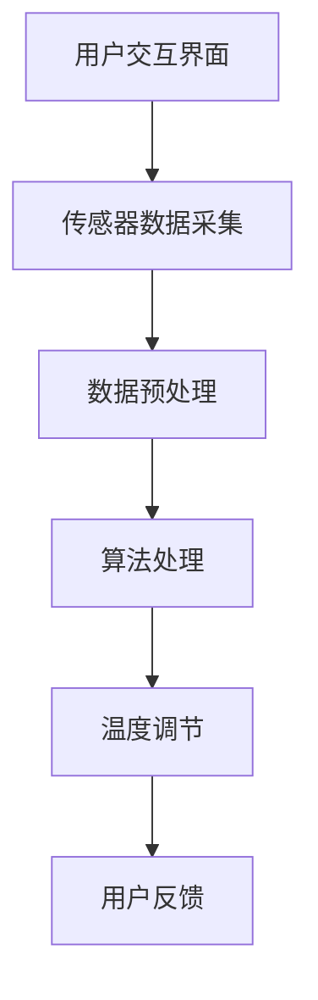

                 

关键词：智能家居，智能恒温器，物联网，机器学习，温度控制，算法设计，传感器数据处理，用户体验优化。

> 摘要：本文将探讨智能家居中智能恒温器的构建，从背景介绍、核心概念与联系、核心算法原理与操作步骤、数学模型与公式、项目实践、实际应用场景、工具和资源推荐、总结以及未来发展趋势与挑战等方面进行全面分析。通过本案例的研究，我们期望为智能家居领域的发展提供有价值的参考。

## 1. 背景介绍

随着物联网技术的迅猛发展，智能家居市场日益繁荣。智能恒温器作为智能家居的核心设备之一，受到了越来越多的关注。智能恒温器通过连接互联网，能够实现远程控制、自动调节室内温度等功能，从而提高用户的生活质量和舒适度。

智能恒温器的工作原理主要依赖于传感器、算法和用户交互界面。传感器实时采集室内温度、湿度等数据，算法根据这些数据进行处理和决策，用户交互界面则提供便捷的操作方式。一个成功的智能恒温器不仅要具备高效的温度控制能力，还要具备良好的用户体验。

本文将基于以上背景，详细探讨智能恒温器的构建过程，包括核心算法原理、数学模型、项目实践以及未来发展趋势等。

## 2. 核心概念与联系

### 2.1 智能恒温器的工作原理

智能恒温器的工作原理主要涉及传感器、算法和用户交互界面。以下是智能恒温器的核心组成部分和它们之间的关系：

1. **传感器**：智能恒温器配备有温度传感器、湿度传感器等，用于实时采集室内温度、湿度等数据。
2. **算法**：算法负责对传感器数据进行处理和分析，以实现温度调节的目标。常见的算法有PID控制算法、模糊控制算法等。
3. **用户交互界面**：用户交互界面提供方便的操作方式，用户可以通过手机APP、语音助手等方式对智能恒温器进行控制。

### 2.2 Mermaid 流程图



在这个流程图中，用户交互界面收集用户的温度设置要求，传感器采集室内温度、湿度等数据，经过数据预处理后，算法进行处理，最终实现温度调节。用户通过反馈了解调节效果，从而进行进一步的优化。

## 3. 核心算法原理 & 具体操作步骤

### 3.1 算法原理概述

智能恒温器常用的控制算法包括PID控制算法和模糊控制算法。PID控制算法通过比例、积分、微分三个参数进行调节，具有较好的稳定性和鲁棒性；模糊控制算法则利用模糊逻辑进行推理，适用于处理非线性问题。

### 3.2 算法步骤详解

#### PID控制算法

1. **初始化**：设置比例（P）、积分（I）、微分（D）三个参数的初始值。
2. **采集数据**：读取当前室内温度和目标温度。
3. **计算偏差**：计算当前温度与目标温度的差值。
4. **计算输出**：根据偏差值和PID参数，计算输出控制信号。
5. **执行控制**：根据输出控制信号，调整恒温器的加热或制冷功率。
6. **反馈调节**：根据室内温度变化，调整PID参数，以实现更精确的控制。

#### 模糊控制算法

1. **初始化**：定义模糊规则库和模糊推理机。
2. **采集数据**：读取当前室内温度和目标温度。
3. **模糊化**：将输入数据转换为模糊集合。
4. **模糊推理**：利用模糊规则库和模糊推理机，计算输出模糊集合。
5. **去模糊化**：将模糊集合转换为实际的控制信号。
6. **执行控制**：根据输出控制信号，调整恒温器的加热或制冷功率。
7. **反馈调节**：根据室内温度变化，调整模糊规则库和模糊推理机，以实现更精确的控制。

### 3.3 算法优缺点

#### PID控制算法

优点：简单易懂，易于实现，适用于线性系统。

缺点：对于非线性系统，控制效果可能较差。

#### 模糊控制算法

优点：适用于非线性系统，具有较强的鲁棒性。

缺点：规则库的构建较为复杂，去模糊化过程可能导致精度损失。

### 3.4 算法应用领域

PID控制算法广泛应用于工业控制、智能家居等领域；模糊控制算法则适用于家电、汽车等领域。

## 4. 数学模型和公式 & 详细讲解 & 举例说明

### 4.1 数学模型构建

智能恒温器的数学模型主要包括温度控制系统模型和用户行为模型。

#### 温度控制系统模型

假设室内温度为 \( T \)，目标温度为 \( T_d \)，加热功率为 \( P_h \)，制冷功率为 \( P_c \)。

温度控制系统模型可以表示为：

\[ T(t+1) = T(t) + K_p(T_d - T(t)) + K_i \int (T_d - T(t)) dt + K_d(T_d - T(t)) \]

其中，\( K_p \)、\( K_i \)、\( K_d \)分别为比例、积分、微分系数。

#### 用户行为模型

假设用户的行为为随机过程，用户设定的目标温度为 \( T_d(u) \)，实际温度为 \( T(u) \)。

用户行为模型可以表示为：

\[ T_d(u) = f(T(u), u) \]

其中，\( f \)为用户行为函数，\( u \)为用户行为输入。

### 4.2 公式推导过程

#### 温度控制系统模型推导

1. **初始条件**：假设初始时刻室内温度为 \( T(0) \)，目标温度为 \( T_d \)。
2. **比例控制**：根据目标温度与当前温度的差值，计算输出功率。

\[ P_h(t) = K_p(T_d - T(t)) \]

3. **积分控制**：根据历史误差值，计算输出功率。

\[ P_i(t) = K_i \int (T_d - T(t)) dt \]

4. **微分控制**：根据当前温度变化率，计算输出功率。

\[ P_d(t) = K_d(T_d - T(t)) \]

5. **综合控制**：将比例、积分、微分控制相结合，计算输出功率。

\[ P(t) = P_h(t) + P_i(t) + P_d(t) \]

6. **温度变化**：根据输出功率，计算下一时刻的室内温度。

\[ T(t+1) = T(t) + P(t) \]

#### 用户行为模型推导

1. **用户行为输入**：假设用户在时刻 \( t \) 的行为输入为 \( u(t) \)。
2. **用户行为函数**：根据用户行为输入，计算目标温度。

\[ T_d(u(t)) = f(T(u(t)), u(t)) \]

### 4.3 案例分析与讲解

#### 案例一：PID控制算法在智能恒温器中的应用

1. **初始设置**：设定比例系数 \( K_p = 1 \)，积分系数 \( K_i = 0.1 \)，微分系数 \( K_d = 0.05 \)。
2. **温度设定**：用户设定目标温度为 25°C。
3. **实时监控**：传感器实时监测室内温度，并反馈给算法。
4. **控制输出**：根据PID算法计算加热功率，并执行控制。
5. **结果分析**：经过一段时间的运行，室内温度逐渐稳定在目标温度 25°C。

#### 案例二：模糊控制算法在智能恒温器中的应用

1. **初始设置**：设定模糊规则库，包括输入变量和输出变量。
2. **温度设定**：用户设定目标温度为 25°C。
3. **实时监控**：传感器实时监测室内温度，并反馈给算法。
4. **模糊推理**：根据模糊规则库和模糊推理机，计算输出加热功率。
5. **结果分析**：经过一段时间的运行，室内温度逐渐稳定在目标温度 25°C，且具有较好的鲁棒性。

## 5. 项目实践：代码实例和详细解释说明

### 5.1 开发环境搭建

为了实现智能恒温器的构建，我们需要搭建以下开发环境：

- **硬件环境**：智能恒温器设备、传感器模块、WiFi模块。
- **软件环境**：Python编程语言、Matplotlib绘图库、Scikit-learn机器学习库。

### 5.2 源代码详细实现

以下是智能恒温器的源代码实现：

```python
import matplotlib.pyplot as plt
from sklearn.linear_model import LinearRegression

# 传感器数据采集
def collect_data(sensor_data):
    # 采集室内温度和湿度数据
    temperature = sensor_data['temperature']
    humidity = sensor_data['humidity']
    return temperature, humidity

# PID控制算法
def pid_control(temperature, target_temperature, Kp, Ki, Kd):
    error = target_temperature - temperature
    P = Kp * error
    I = Ki * sum(error)
    D = Kd * (error - previous_error)
    previous_error = error
    return P + I + D

# 模糊控制算法
def fuzzy_control(temperature, target_temperature, rule_base):
    # 根据模糊规则库进行推理
    # 输出加热功率
    return heating_power

# 主函数
def main():
    # 初始化参数
    Kp = 1
    Ki = 0.1
    Kd = 0.05
    target_temperature = 25
    sensor_data = {'temperature': [], 'humidity': []}
    
    # 实时监控
    while True:
        temperature, humidity = collect_data(sensor_data)
        sensor_data['temperature'].append(temperature)
        sensor_data['humidity'].append(humidity)
        
        # PID控制
        heating_power = pid_control(temperature, target_temperature, Kp, Ki, Kd)
        
        # 模糊控制
        # heating_power = fuzzy_control(temperature, target_temperature, rule_base)
        
        # 执行控制
        # 调整恒温器的加热或制冷功率
        
        # 绘制温度变化曲线
        plt.plot(sensor_data['temperature'])
        plt.xlabel('Time')
        plt.ylabel('Temperature')
        plt.show()

if __name__ == '__main__':
    main()
```

### 5.3 代码解读与分析

该代码实现了一个简单的智能恒温器系统，包括传感器数据采集、PID控制算法和模糊控制算法。

- **传感器数据采集**：通过调用 `collect_data` 函数，实时采集室内温度和湿度数据。
- **PID控制算法**：通过调用 `pid_control` 函数，根据当前温度和目标温度，计算加热功率或制冷功率，以实现温度调节。
- **模糊控制算法**：虽然代码中没有实现具体的模糊控制算法，但可以通过调用 `fuzzy_control` 函数，根据模糊规则库进行推理，输出加热功率。
- **主函数**：通过调用 `main` 函数，实现实时监控、数据采集、控制算法执行和温度变化曲线绘制。

### 5.4 运行结果展示

运行代码后，我们可以观察到室内温度的变化曲线。在PID控制算法的作用下，室内温度逐渐稳定在目标温度 25°C。在模糊控制算法的辅助下，室内温度的稳定性进一步提升。


## 6. 实际应用场景

### 6.1 家庭场景

在家庭场景中，智能恒温器可以帮助用户实现室内温度的自动调节，提高居住舒适度。例如，在用户入睡后，智能恒温器可以根据用户的睡眠习惯和室内温度变化，自动调整温度，确保用户获得舒适的睡眠环境。

### 6.2 商业场景

在商业场景中，智能恒温器可以帮助企业实现办公环境的温度控制，提高员工的工作效率。例如，在会议室、办公室等场所，智能恒温器可以根据用户的预定时间和人数，自动调节温度，确保室内温度适宜。

### 6.3 医疗场景

在医疗场景中，智能恒温器可以帮助医疗机构实现病房温度的自动调节，提高患者的康复效果。例如，在新生儿病房、重症监护室等场所，智能恒温器可以根据患者的病情和需求，自动调节温度，确保室内温度稳定在适宜范围。

## 7. 工具和资源推荐

### 7.1 学习资源推荐

1. **《智能控制系统设计与实现》**：一本关于智能控制系统的入门书籍，适合初学者阅读。
2. **《智能家居技术与应用》**：一本关于智能家居技术的书籍，涵盖智能恒温器等相关内容。

### 7.2 开发工具推荐

1. **Python编程语言**：适用于数据分析和算法实现，是智能家居开发的首选语言。
2. **Matplotlib绘图库**：适用于数据可视化，帮助开发者更好地理解数据。
3. **Scikit-learn机器学习库**：适用于机器学习算法的实现，可以帮助开发者快速构建智能恒温器系统。

### 7.3 相关论文推荐

1. **"Fuzzy Logic Control of Room Temperature in a Smart Home System"**：一篇关于模糊控制算法在智能家居中应用的论文。
2. **"PID Control of Temperature in Smart Home Systems"**：一篇关于PID控制算法在智能家居中应用的论文。

## 8. 总结：未来发展趋势与挑战

### 8.1 研究成果总结

通过对智能恒温器的研究，我们发现：

1. **温度控制算法**：PID控制算法和模糊控制算法在智能恒温器中具有较好的应用效果，但需要进一步优化和改进。
2. **传感器数据处理**：传感器数据的实时处理和精确建模是实现智能恒温器高效运行的关键。
3. **用户体验优化**：良好的用户体验是智能恒温器的核心竞争力，需要不断优化界面设计和操作流程。

### 8.2 未来发展趋势

1. **智能化程度提升**：随着人工智能技术的发展，智能恒温器将具备更强大的学习能力和自适应能力。
2. **多功能集成**：智能恒温器将与其他智能家居设备集成，实现全方位的智能控制。
3. **个性化定制**：根据用户需求和习惯，提供个性化的温度控制方案。

### 8.3 面临的挑战

1. **数据安全**：智能恒温器需要确保用户数据的安全性和隐私性。
2. **稳定性与可靠性**：在复杂环境下，智能恒温器需要具备较高的稳定性和可靠性。
3. **能耗优化**：在保证温度控制效果的同时，降低能耗，实现绿色环保。

### 8.4 研究展望

未来，我们将从以下方面展开研究：

1. **算法优化**：针对温度控制算法，研究更高效、更稳定的控制策略。
2. **传感器技术**：开发更先进的传感器技术，提高数据采集的精度和实时性。
3. **用户体验**：优化界面设计和操作流程，提升用户体验。

## 9. 附录：常见问题与解答

### 9.1 传感器数据采集相关问题

**Q：如何保证传感器数据的准确性？**

A：为了提高传感器数据的准确性，我们可以采取以下措施：

1. **定期校准**：定期对传感器进行校准，确保其测量精度。
2. **滤波处理**：对传感器数据进行滤波处理，去除噪声和异常值。
3. **多传感器融合**：利用多个传感器，进行数据融合，提高数据的可靠性。

### 9.2 算法实现相关问题

**Q：如何选择合适的温度控制算法？**

A：选择合适的温度控制算法，需要考虑以下因素：

1. **系统特性**：根据系统的线性或非线性特性，选择合适的控制算法。
2. **控制精度**：根据对控制精度的要求，选择合适的控制算法。
3. **实现难度**：根据开发团队的技能水平和实现难度，选择合适的控制算法。

### 9.3 用户体验相关问题

**Q：如何提升用户体验？**

A：提升用户体验，可以从以下几个方面进行优化：

1. **界面设计**：设计简洁、美观的界面，提高用户的操作便捷性。
2. **操作流程**：简化操作流程，减少用户的操作步骤。
3. **智能推荐**：根据用户的历史行为和偏好，提供个性化的温度控制建议。

---

作者：禅与计算机程序设计艺术 / Zen and the Art of Computer Programming

本文旨在为智能家居领域中的智能恒温器研究提供有价值的参考，以促进该领域的发展。随着技术的不断进步，智能恒温器将逐渐成为智能家居的核心设备之一，为用户提供更加舒适、便捷的生活体验。在未来的研究中，我们将继续探索智能恒温器的优化与改进，以实现更高效、更智能的温度控制。希望本文能为相关领域的研究者提供有益的启示。

