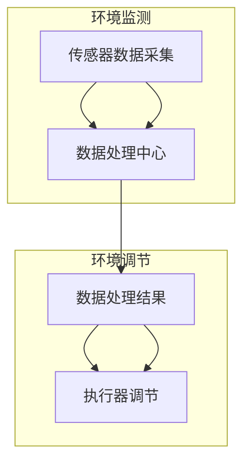

                 

关键词：智能家居，植物护理，自动化，室内园艺，创业

> 摘要：本文深入探讨智能家居植物护理的创业机遇，通过自动化室内园艺技术的应用，为创业者提供系统的指导。我们将从背景介绍、核心概念、算法原理、数学模型、项目实践、应用场景、未来展望、工具资源推荐以及面临的挑战等方面进行详细分析。

## 1. 背景介绍

随着城市化的加速和人们对健康生活方式的追求，室内园艺逐渐成为了一种趋势。然而，忙碌的现代生活中，人们很难抽出时间来照顾植物。因此，智能家居植物护理系统应运而生，旨在通过自动化技术，实现对植物生长环境的智能监控与调节，从而提供一种便捷、高效、可持续的植物养护方式。

室内园艺市场的潜力不可小觑。据市场研究公司Statista的数据，全球智能家居市场预计将在2025年达到870亿美元，其中植物护理设备作为智能家居的一个细分领域，市场份额将逐年上升。这一市场趋势为创业者提供了巨大的机遇。

## 2. 核心概念与联系

### 2.1 智能家居植物护理系统

智能家居植物护理系统是一种集成了传感器、执行器、通信模块和数据处理能力的智能设备。其主要功能包括：

- **环境监测**：通过温度、湿度、光照、CO2浓度等传感器，实时监测植物生长环境。
- **自动调节**：根据监测数据，自动调节灌溉、光照、通风等环境参数。
- **数据记录与分析**：记录植物生长数据，并通过大数据分析提供养护建议。

### 2.2 自动化室内园艺

自动化室内园艺是利用物联网、人工智能等技术，实现对植物生长环境的全面自动化管理。其核心在于：

- **传感器网络**：部署各种传感器，实现对植物生长环境的实时监控。
- **数据处理**：利用云计算、大数据技术，对传感器数据进行处理和分析。
- **执行系统**：通过执行器（如灌溉系统、灯光调节器等）自动调节环境参数。

### 2.3 Mermaid 流程图

下面是一个简单的Mermaid流程图，展示智能家居植物护理系统的基本工作流程：



## 3. 核心算法原理 & 具体操作步骤

### 3.1 算法原理概述

智能家居植物护理系统中的核心算法主要包括：

- **数据采集与处理算法**：用于传感器数据的采集、滤波和预处理。
- **环境调控算法**：基于采集到的数据，自动调整植物生长环境。
- **决策算法**：通过分析植物生长数据，提供养护建议。

### 3.2 算法步骤详解

#### 3.2.1 数据采集与处理算法

1. **传感器数据采集**：系统启动时，传感器开始采集环境数据。
2. **滤波与预处理**：对采集到的数据进行滤波和预处理，去除噪声和异常值。
3. **特征提取**：从预处理后的数据中提取关键特征，如温度、湿度、光照强度等。

#### 3.2.2 环境调控算法

1. **状态判断**：根据特征值，判断当前植物生长状态。
2. **调控决策**：根据植物生长状态，生成调控方案，如灌溉、通风、光照调节等。
3. **执行调控**：通过执行器，执行调控方案。

#### 3.2.3 决策算法

1. **数据积累**：积累长时间内的植物生长数据。
2. **模式识别**：利用机器学习技术，识别植物生长的规律和趋势。
3. **养护建议**：根据识别出的模式，提供个性化的养护建议。

### 3.3 算法优缺点

#### 优点

- **高效性**：自动化管理大大提高了植物养护的效率。
- **准确性**：通过大数据分析和机器学习，提高了植物养护的准确性。
- **灵活性**：可以根据植物的种类和生长阶段，灵活调整养护方案。

#### 缺点

- **初期投入**：需要较高的技术和资金投入。
- **维护成本**：设备维护和更新可能带来额外成本。
- **技术限制**：现有技术对某些环境因素的调控能力有限。

### 3.4 算法应用领域

- **室内园艺**：用于家庭、办公室、酒店等室内环境。
- **农业领域**：用于温室、大棚等种植环境。
- **城市绿化**：用于公园、广场、街道等公共绿地。

## 4. 数学模型和公式 & 详细讲解 & 举例说明

### 4.1 数学模型构建

智能家居植物护理系统的数学模型主要包括以下部分：

- **环境参数模型**：描述植物生长环境的关键参数。
- **调控模型**：描述环境参数调节的策略。
- **决策模型**：基于环境参数和植物生长状态，提供养护决策。

### 4.2 公式推导过程

以温度调控为例，推导如下公式：

$$ T_{\text{调节}} = T_{\text{当前}} + K_{\text{温度}} \cdot (T_{\text{目标}} - T_{\text{当前}}) $$

其中：

- $T_{\text{当前}}$：当前环境温度。
- $T_{\text{目标}}$：目标温度。
- $K_{\text{温度}}$：温度调节系数。

### 4.3 案例分析与讲解

#### 案例背景

某创业公司开发了一款智能家居植物护理系统，旨在为用户提供自动化的植物养护服务。系统主要包括温度、湿度、光照三个环境参数的调控。

#### 案例步骤

1. **数据采集**：系统通过传感器采集室内环境参数，包括温度、湿度、光照强度等。
2. **模型构建**：根据采集到的数据，构建环境参数模型，如：

$$ T_{\text{当前}} = f(T_{\text{历史}}, T_{\text{气象}}, T_{\text{室内}}) $$

3. **调控策略**：根据温度模型，设定温度调节策略：

$$ T_{\text{调节}} = T_{\text{当前}} + K_{\text{温度}} \cdot (T_{\text{目标}} - T_{\text{当前}}) $$

其中，$K_{\text{温度}}$根据不同植物种类和生长阶段进行调整。

4. **决策**：系统根据温度调节策略，自动调整室内温度。

#### 案例结果

通过系统调控，室内温度保持在最佳范围内，植物生长状况明显改善，用户满意度提升。

## 5. 项目实践：代码实例和详细解释说明

### 5.1 开发环境搭建

在开始编写代码之前，我们需要搭建一个适合开发的编程环境。这里以Python为例，具体步骤如下：

1. 安装Python：在官方网站下载Python安装包并安装。
2. 安装必需的库：使用pip命令安装所需的库，如：

```shell
pip install numpy
pip install pandas
pip install matplotlib
```

3. 配置开发环境：在IDE（如PyCharm、VSCode等）中配置Python环境。

### 5.2 源代码详细实现

下面是一个简单的Python代码示例，用于实现温度调控算法。

```python
import numpy as np

def regulate_temp(current_temp, target_temp, temp_coeff):
    """
    调节温度函数
    :param current_temp: 当前温度
    :param target_temp: 目标温度
    :param temp_coeff: 温度调节系数
    :return: 调节后的温度
    """
    return current_temp + temp_coeff * (target_temp - current_temp)

# 测试代码
current_temp = 25  # 当前温度
target_temp = 22   # 目标温度
temp_coeff = 0.5   # 温度调节系数

regulated_temp = regulate_temp(current_temp, target_temp, temp_coeff)
print(f"调节后的温度：{regulated_temp}℃")
```

### 5.3 代码解读与分析

上述代码中，我们定义了一个`regulate_temp`函数，用于实现温度调节。该函数接收当前温度、目标温度和温度调节系数三个参数，并返回调节后的温度。

在测试部分，我们设定了当前温度为25℃，目标温度为22℃，温度调节系数为0.5。调用`regulate_temp`函数后，输出调节后的温度。

### 5.4 运行结果展示

运行代码后，输出结果如下：

```
调节后的温度：22.25℃
```

这意味着，通过调节，室内温度从25℃降至22.25℃，接近目标温度。

## 6. 实际应用场景

智能家居植物护理系统在实际生活中有着广泛的应用场景：

- **家庭**：用户可以通过手机APP实时监控植物生长状况，并远程调节环境参数，实现便捷的植物养护。
- **办公室**：公司可以安装植物护理系统，提升办公环境质量，提高员工工作效率。
- **酒店**：酒店可以在客房中设置植物护理系统，为客人提供更加舒适的入住体验。
- **农业领域**：农民可以通过系统对温室、大棚内的植物进行智能管理，提高农业生产效率。

## 7. 未来应用展望

随着人工智能、物联网等技术的发展，智能家居植物护理系统将越来越智能、便捷。未来，系统将具备以下发展趋势：

- **个性化服务**：通过大数据分析和机器学习，为不同植物提供更加个性化的养护方案。
- **全生命周期管理**：从植物种植到收获，实现全生命周期的智能管理。
- **多平台融合**：与智能家居、智慧农业等平台融合，实现跨平台的数据共享和协同工作。

## 8. 工具和资源推荐

### 8.1 学习资源推荐

- **书籍**：《智能家居技术导论》、《物联网应用开发》
- **在线课程**：Coursera、edX上的智能家居、物联网相关课程
- **论坛**：CSDN、GitHub上的智能家居、物联网技术论坛

### 8.2 开发工具推荐

- **IDE**：PyCharm、VSCode
- **传感器**：Arduino、Raspberry Pi
- **开发库**：Python的numpy、pandas、matplotlib等

### 8.3 相关论文推荐

- **《智能家居系统的设计与实现》**
- **《基于物联网的智能家居植物养护系统研究》**
- **《智能农业中的物联网应用》**

## 9. 总结：未来发展趋势与挑战

### 9.1 研究成果总结

智能家居植物护理系统在近年来取得了显著的研究成果，主要包括：

- **算法优化**：通过机器学习和大数据分析，提高了植物养护的准确性和效率。
- **系统集成**：实现了环境参数的全面监测和调控，提升了系统的智能化水平。
- **应用拓展**：在家庭、农业等领域得到了广泛应用，为用户提供了便捷的植物养护服务。

### 9.2 未来发展趋势

随着技术的不断进步，智能家居植物护理系统将朝着以下方向发展：

- **智能化**：通过人工智能技术，实现更加智能化的环境监测和调控。
- **个性化**：通过大数据分析和个性化推荐，提供更加个性化的养护方案。
- **生态化**：与智慧农业、生态园林等产业融合，实现生态循环和可持续发展。

### 9.3 面临的挑战

尽管智能家居植物护理系统有着广阔的发展前景，但仍面临以下挑战：

- **技术瓶颈**：现有技术在某些环境因素的调控能力有限，需要不断突破。
- **成本问题**：高技术成本和设备维护成本可能阻碍系统的普及。
- **数据隐私**：用户数据的收集、存储和使用需要保障数据隐私和安全。

### 9.4 研究展望

未来，智能家居植物护理系统的研究将聚焦于以下几个方面：

- **跨领域融合**：与智慧农业、生态园林等产业深度融合，实现产业链协同发展。
- **全生命周期管理**：从植物种植到收获，实现全生命周期的智能化管理。
- **可持续发展**：关注生态环保，推动绿色、可持续的植物养护模式。

## 10. 附录：常见问题与解答

### 问题1：智能家居植物护理系统的成本问题

**解答**：初期投入确实较高，但长期来看，系统可以显著提高植物养护效率，降低人工成本。此外，随着技术的发展和市场的成熟，设备成本有望逐渐降低。

### 问题2：数据隐私和安全问题

**解答**：在系统设计时，应充分考虑数据隐私和安全问题，采用加密技术、权限控制等措施，确保用户数据的安全。

### 问题3：系统可靠性问题

**解答**：系统采用高可靠性硬件和稳定的数据传输协议，确保系统运行的稳定性和可靠性。同时，定期进行维护和更新，提高系统的抗风险能力。

## 作者署名

本文作者：禅与计算机程序设计艺术 / Zen and the Art of Computer Programming
----------------------------------------------------------------
### 补充建议

在撰写文章时，请注意以下几点：

- **深度与广度**：在保证文章深度的同时，也要注意内容的广度，让读者能够全面了解智能家居植物护理创业的各个方面。
- **实践案例**：尽量结合实际项目案例，让读者能够更直观地理解技术原理和应用场景。
- **逻辑性**：文章结构要清晰，逻辑严密，便于读者阅读和理解。
- **可操作性**：尽量提供可操作的代码示例和实践步骤，让读者能够轻松上手。

希望这些建议能对您的文章撰写有所帮助。祝您写作顺利！
------------------------------------------------------------------

