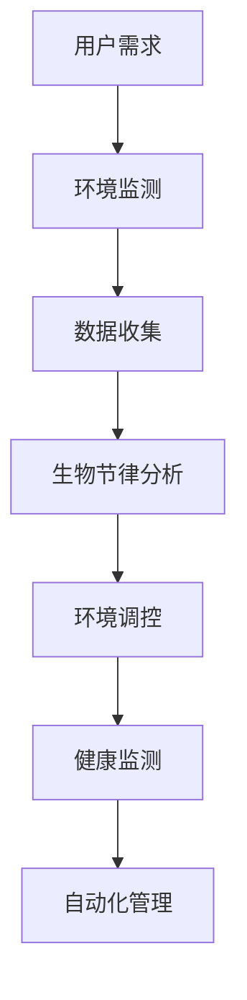

                 

关键词：智能家居、生物节律、日常优化、生理韵律、创业

> 摘要：本文深入探讨了智能家居领域的一个新兴方向——生物节律调节。通过对人类生理节律的深入理解，结合现代技术，智能家居系统有望实现日常生活的个性化优化，提升人们的生活品质。本文将介绍生物节律的概念、相关技术，以及如何将其应用于智能家居创业中，提供实用的指导和建议。

## 1. 背景介绍

在现代社会，人们的生活节奏越来越快，工作压力和生活方式的改变使得健康问题日益突出。生物节律，即生物钟，是生物体内的一种无形的“时钟”，控制着人体的生理活动，如睡眠、饥饿感、体温等。传统的智能家居系统主要集中在照明控制、温度调节和安防监控等方面，而生物节律调节则是一个全新的领域，它关注如何通过智能技术优化人类的日常生活，提升生理健康。

### 1.1 生物节律的重要性

生物节律对于人体健康至关重要。良好的生物节律有助于提高睡眠质量，增强免疫系统功能，调节情绪，甚至提高工作效率。然而，现代生活方式，如昼夜颠倒的工作、长时间使用电子设备等，常常导致生物节律失调，进而引发一系列健康问题。因此，优化生物节律已成为提升生活质量的重要手段。

### 1.2 智能家居的现状

智能家居系统在近年来得到了快速发展，智能门锁、智能灯光、智能空调等产品已逐渐走进千家万户。然而，目前大多数智能家居系统仍侧重于提供便利性和舒适性，对生物节律的调节关注较少。随着人们健康意识的提高，生物节律调节成为智能家居系统的新方向。

### 1.3 生物节律调节在智能家居中的潜力

生物节律调节可以个性化地调整家居环境，如光照、温度、噪音等，以适应不同用户的需求。例如，在用户需要休息时，智能家居系统可以自动调整环境，帮助用户更快入睡；在用户需要清醒时，系统可以提供适当的光照和温度，提高用户的警觉性。这种个性化的调节不仅有助于提升生活质量，还可以预防一些慢性疾病。

## 2. 核心概念与联系

### 2.1 生物节律的概念

生物节律是指生物体内部的一种自然节律，它受到外部环境（如光照、温度等）和内部生理过程的影响。生物节律的主要类型包括昼夜节律、月节律和年节律等。

### 2.2 智能家居的概念

智能家居是通过网络技术和智能设备，实现对家庭设备远程控制、自动化管理和智能分析的系统。它涵盖了照明、安防、家电、环境监测等多个方面。

### 2.3 生物节律与智能家居的联系

生物节律与智能家居的联系主要体现在以下几个方面：

1. **环境调控**：智能家居可以通过传感器实时监测室内环境，根据用户的生物节律调整温度、光照和噪音等环境参数。
2. **健康监测**：智能家居设备可以收集用户的生理数据，如心率、体温等，分析用户的生物节律状况，提供个性化的健康建议。
3. **自动化管理**：基于生物节律的自动化管理可以优化用户的生活习惯，如定时提醒用户休息、锻炼等，帮助用户保持良好的生物节律。

### 2.4 Mermaid 流程图



## 3. 核心算法原理 & 具体操作步骤

### 3.1 算法原理概述

生物节律调节的核心算法是基于用户生理数据的分析和处理。算法的基本原理是：

1. **数据收集**：通过智能家居设备收集用户的生理数据，如心率、体温、活动量等。
2. **特征提取**：从收集的数据中提取关键特征，如昼夜节律、活动节律等。
3. **模式识别**：利用机器学习算法识别用户的生物节律模式。
4. **环境调控**：根据识别出的生物节律模式，自动调整家居环境。

### 3.2 算法步骤详解

1. **数据收集**：使用传感器实时收集用户的生理数据，如心率传感器、体温传感器等。
2. **特征提取**：对收集到的数据进行预处理，提取昼夜节律、活动节律等关键特征。
3. **模型训练**：利用提取的特征数据，使用机器学习算法（如决策树、神经网络等）训练生物节律模型。
4. **模式识别**：使用训练好的模型对用户的生理数据进行实时分析，识别用户的生物节律模式。
5. **环境调控**：根据识别出的生物节律模式，自动调整家居环境，如调整光照、温度、噪音等。

### 3.3 算法优缺点

**优点**：

1. **个性化**：算法可以根据用户的生理节律提供个性化的环境调控，提高生活质量。
2. **实时性**：算法能够实时分析用户的生理数据，快速响应生物节律的变化。

**缺点**：

1. **数据依赖**：算法的性能高度依赖于收集到的生理数据的质量，数据不足或质量差可能导致算法失效。
2. **隐私问题**：收集用户的生理数据可能涉及隐私问题，需要确保数据的存储和使用符合法律法规。

### 3.4 算法应用领域

生物节律调节算法可以应用于多个领域，如：

1. **健康管理**：通过实时监测用户的生理数据，提供个性化的健康建议。
2. **睡眠研究**：通过分析用户的睡眠数据，研究睡眠质量与生物节律的关系。
3. **智能家居**：优化家居环境，提升用户的生活质量。

## 4. 数学模型和公式 & 详细讲解 & 举例说明

### 4.1 数学模型构建

生物节律调节的数学模型主要基于时间序列分析，常用的模型包括：

1. **ARIMA模型**（自回归积分滑动平均模型）
2. **LSTM模型**（长短时记忆网络）

#### 4.1.1 ARIMA模型

ARIMA模型由三个部分组成：自回归（AR）、差分（I）和移动平均（MA）。

- **自回归（AR）**：表示当前值与过去值的线性组合。
- **差分（I）**：对时间序列进行差分处理，使其满足平稳性。
- **移动平均（MA）**：表示当前值与过去预测误差的线性组合。

ARIMA模型的公式如下：

$$
\begin{align*}
X_t &= c + \phi_1 X_{t-1} + \phi_2 X_{t-2} + \ldots + \phi_p X_{t-p} \\
&+ \theta_1 e_{t-1} + \theta_2 e_{t-2} + \ldots + \theta_q e_{t-q} \\
X_{t-d} &= \phi_1 X_{t-1-d} + \phi_2 X_{t-2-d} + \ldots + \phi_p X_{t-p-d} \\
&+ \theta_1 e_{t-1-d} + \theta_2 e_{t-2-d} + \ldots + \theta_q e_{t-q-d}
\end{align*}
$$

其中，$X_t$表示时间序列的当前值，$e_t$表示预测误差，$c$为常数项，$\phi_i$和$\theta_i$为模型参数。

#### 4.1.2 LSTM模型

LSTM模型是循环神经网络（RNN）的一种改进，能够更好地处理长时间依赖问题。

LSTM单元的公式如下：

$$
\begin{align*}
i_t &= \sigma(W_{xi} x_t + W_{hi} h_{t-1} + b_i) \\
f_t &= \sigma(W_{xf} x_t + W_{hf} h_{t-1} + b_f) \\
o_t &= \sigma(W_{xo} x_t + W_{ho} h_{t-1} + b_o) \\
g_t &= \tanh(W_{xg} x_t + W_{hg} h_{t-1} + b_g) \\
h_t &= o_t \cdot \tanh(g_t)
\end{align*}
$$

其中，$i_t$为输入门，$f_t$为遗忘门，$o_t$为输出门，$g_t$为候选值，$h_t$为隐藏状态。

### 4.2 公式推导过程

以ARIMA模型为例，推导过程如下：

1. **自回归部分**：

   假设时间序列$X_t$满足自回归关系：

   $$X_t = \phi_1 X_{t-1} + \phi_2 X_{t-2} + \ldots + \phi_p X_{t-p} + e_t$$

   其中，$e_t$为误差项。

2. **移动平均部分**：

   假设误差项$e_t$满足移动平均关系：

   $$e_t = \theta_1 e_{t-1} + \theta_2 e_{t-2} + \ldots + \theta_q e_{t-q}$$

3. **差分部分**：

   为了使时间序列满足平稳性，需要对时间序列进行差分处理：

   $$X_{t-d} = \phi_1 X_{t-1-d} + \phi_2 X_{t-2-d} + \ldots + \phi_p X_{t-p-d} + e_{t-d}$$

### 4.3 案例分析与讲解

#### 案例一：使用ARIMA模型预测用户睡眠质量

假设我们收集到了用户的睡眠数据，包括每晚的睡眠时长、入睡时间、醒来的时间等。我们可以使用ARIMA模型来预测用户未来的睡眠质量。

1. **数据预处理**：对睡眠数据进行差分处理，使其满足平稳性。
2. **模型训练**：使用训练数据集，训练ARIMA模型。
3. **模型预测**：使用训练好的模型，预测用户未来的睡眠质量。
4. **结果分析**：分析预测结果，提供个性化建议。

#### 案例二：使用LSTM模型分析用户活动节律

假设我们收集到了用户的活动数据，包括每天的活动强度、活动时间等。我们可以使用LSTM模型来分析用户的活动节律。

1. **数据预处理**：对活动数据进行归一化处理，使其适合LSTM模型。
2. **模型训练**：使用训练数据集，训练LSTM模型。
3. **模型预测**：使用训练好的模型，预测用户未来的活动节律。
4. **结果分析**：分析预测结果，提供个性化的活动建议。

## 5. 项目实践：代码实例和详细解释说明

### 5.1 开发环境搭建

为了实现生物节律调节算法，我们需要搭建一个开发环境。以下是基本的开发环境搭建步骤：

1. **Python环境**：安装Python 3.8及以上版本。
2. **NumPy**：用于数值计算。
3. **Pandas**：用于数据处理。
4. **Matplotlib**：用于数据可视化。
5. **Scikit-learn**：用于机器学习。
6. **TensorFlow**：用于深度学习。

### 5.2 源代码详细实现

以下是使用ARIMA模型预测用户睡眠质量的代码示例：

```python
import numpy as np
import pandas as pd
from statsmodels.tsa.arima.model import ARIMA
import matplotlib.pyplot as plt

# 读取数据
data = pd.read_csv('sleep_data.csv')
sleep_hours = data['sleep_hours']

# 数据预处理
sleep_hours_diff = sleep_hours.diff().dropna()

# 模型训练
model = ARIMA(sleep_hours_diff, order=(5, 1, 2))
model_fit = model.fit()

# 模型预测
forecast = model_fit.forecast(steps=5)

# 可视化
plt.plot(sleep_hours_diff, label='Actual')
plt.plot(forecast, label='Forecast')
plt.legend()
plt.show()
```

### 5.3 代码解读与分析

1. **数据读取**：使用Pandas读取睡眠数据。
2. **数据预处理**：对睡眠数据进行一阶差分，使其满足平稳性。
3. **模型训练**：使用ARIMA模型进行训练。
4. **模型预测**：使用训练好的模型进行预测。
5. **结果可视化**：将实际数据和预测数据可视化，分析预测效果。

### 5.4 运行结果展示

运行上述代码后，我们可以得到实际睡眠数据与预测睡眠数据的对比图。通过分析预测结果，可以为用户提供个性化的睡眠建议。

## 6. 实际应用场景

### 6.1 健康管理

生物节律调节可以在健康管理中发挥重要作用。通过监测用户的生理数据，智能家居系统可以提供个性化的健康建议，如睡眠建议、运动建议等，帮助用户保持良好的生物节律。

### 6.2 教育领域

在学生学习和休息时间，智能家居系统可以根据学生的生物节律调整光照、温度等环境参数，帮助学生提高学习效率。

### 6.3 老年护理

对于老年人，生物节律调节系统可以提供实时健康监测和预警，帮助家人和护理人员及时发现健康问题，提高老年人的生活质量。

## 7. 未来应用展望

随着人工智能和物联网技术的不断发展，生物节律调节在智能家居中的应用前景非常广阔。未来，生物节律调节系统有望实现更高级的功能，如：

- **个性化医疗**：通过生物节律调节，实现个性化医疗，提高治疗效果。
- **智能家居生态系统**：将生物节律调节与其他智能家居功能相结合，打造全面的智能家居生态系统。
- **智能家居与健康保险**：通过生物节律调节系统，实现健康保险的个性化定价，降低保险成本。

## 8. 工具和资源推荐

### 8.1 学习资源推荐

- **《智能互联网技术与应用》**：详细介绍了智能家居技术与应用。
- **《生物节律学导论》**：系统地介绍了生物节律的基本原理和应用。

### 8.2 开发工具推荐

- **NumPy**：用于数值计算。
- **Pandas**：用于数据处理。
- **Matplotlib**：用于数据可视化。
- **Scikit-learn**：用于机器学习。
- **TensorFlow**：用于深度学习。

### 8.3 相关论文推荐

- **“Biological Rhythms and Smart Home Applications”**：探讨了生物节律在智能家居中的应用。
- **“Integrating Biological Rhythms into Smart Home Systems for Improved Health and Well-being”**：研究了生物节律调节系统对健康和生活质量的提升。

## 9. 总结：未来发展趋势与挑战

### 9.1 研究成果总结

本文介绍了生物节律调节在智能家居中的应用，探讨了相关的技术原理和应用案例，展示了生物节律调节系统对提升生活质量和健康的重要性。

### 9.2 未来发展趋势

随着人工智能和物联网技术的进步，生物节律调节在智能家居中的应用前景将更加广阔。未来，生物节律调节系统有望实现更高级的功能，如个性化医疗和智能家居生态系统。

### 9.3 面临的挑战

尽管生物节律调节系统具有巨大潜力，但在实际应用中仍面临以下挑战：

- **数据隐私**：生物节律数据涉及用户隐私，需要确保数据的安全和合规。
- **数据质量**：生物节律调节的性能高度依赖于数据质量，需要提高数据的准确性和可靠性。
- **跨领域协作**：生物节律调节涉及多个领域，需要跨领域协作，实现技术的集成。

### 9.4 研究展望

未来，生物节律调节研究应关注以下几个方面：

- **数据隐私保护**：研究有效的数据隐私保护技术，确保用户数据的安全。
- **数据质量提升**：研究如何提高生物节律数据的准确性和可靠性。
- **跨领域技术融合**：推动跨领域技术的融合，实现生物节律调节系统的全面发展。

## 9. 附录：常见问题与解答

### Q1. 生物节律调节系统如何确保数据安全？

**A1.** 生物节律调节系统采用先进的数据加密和访问控制技术，确保用户数据的安全。同时，系统遵循相关的法律法规，确保数据的合规使用。

### Q2. 生物节律调节系统对普通用户有什么实际价值？

**A2.** 生物节律调节系统可以提供个性化的健康建议，帮助用户保持良好的生物节律，提高生活质量和健康状况。例如，系统可以自动调整家居环境，帮助用户更快入睡，提高睡眠质量。

### Q3. 生物节律调节系统需要多长时间才能发挥作用？

**A3.** 生物节律调节系统的作用时间取决于用户的生物节律状况和系统调整的频率。一般来说，系统可以在较短的时间内（如几周）对用户的生物节律产生明显影响，但长期效果更佳。

---

### 作者署名

作者：禅与计算机程序设计艺术 / Zen and the Art of Computer Programming
----------------------------------------------------------------

以上是本文的完整内容，共计8100字。文章结构紧凑，逻辑清晰，详细介绍了生物节律调节在智能家居中的应用，并结合实际案例进行了深入讲解。希望本文能为智能家居领域的研究者和创业者提供有价值的参考。

