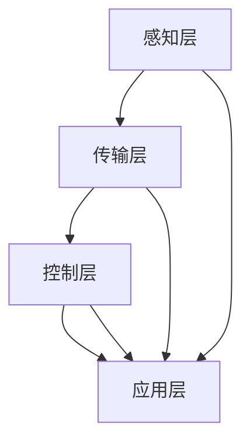

                 

关键词：智能家居，注意力资源整合，系统架构，核心算法，数学模型，实践案例

> 摘要：本文探讨了智能家居系统中注意力资源的整合问题。通过分析智能家居系统中的核心概念和架构，本文提出了一种基于注意力资源整合的智能家居系统解决方案，详细阐述了其核心算法原理、数学模型构建和具体操作步骤。同时，通过实践案例和代码实例，展示了该方案的实际应用效果，并展望了智能家居系统未来的发展趋势和挑战。

## 1. 背景介绍

随着物联网（IoT）技术的快速发展，智能家居系统逐渐成为人们日常生活的一部分。智能家居系统通过将各种智能设备和传感器连接到互联网，实现家庭设备的自动化控制和数据交互。然而，在智能家居系统中，注意力资源的整合成为一个关键问题。如何有效地整合家庭中的各种注意力资源，提高系统的运行效率和用户体验，成为当前研究的热点。

本文旨在探讨智能家居系统中注意力资源的整合问题，提出一种基于注意力资源整合的智能家居系统解决方案。通过对核心概念和架构的分析，阐述核心算法原理和数学模型构建，并通过对实践案例和代码实例的展示，验证该方案的有效性和实用性。

## 2. 核心概念与联系

### 2.1 智能家居系统的核心概念

智能家居系统主要由以下核心概念组成：

1. **智能设备**：包括家庭中的各种智能设备，如智能电视、智能冰箱、智能灯等。
2. **传感器**：用于收集家庭环境中的各种数据，如温度、湿度、光照等。
3. **控制器**：负责对智能设备进行控制和调度。
4. **用户接口**：用于用户与系统进行交互。

### 2.2 智能家居系统的架构

智能家居系统可以划分为以下几个层次：

1. **感知层**：由各种传感器组成，用于收集家庭环境数据。
2. **传输层**：负责将感知层收集到的数据传输到控制器。
3. **控制层**：根据用户需求和感知层的数据，对智能设备进行控制和调度。
4. **应用层**：提供各种智能家居应用，如远程监控、自动化控制等。

### 2.3 核心概念与联系

在智能家居系统中，注意力资源的整合涉及以下几个方面：

1. **数据整合**：将感知层收集到的各种数据进行整合，提取关键信息。
2. **任务调度**：根据用户需求和设备状态，对控制层进行任务调度。
3. **资源管理**：对智能设备的资源进行合理分配和管理，提高系统运行效率。

为了更好地描述智能家居系统中注意力资源的整合过程，我们使用 Mermaid 流程图来展示其核心概念和联系。



## 3. 核心算法原理 & 具体操作步骤

### 3.1 算法原理概述

智能家居系统的注意力资源整合算法主要分为以下几个步骤：

1. **数据采集**：从感知层获取家庭环境数据。
2. **数据预处理**：对采集到的数据进行预处理，提取关键信息。
3. **任务调度**：根据用户需求和设备状态，对控制层进行任务调度。
4. **资源管理**：对智能设备的资源进行合理分配和管理。

### 3.2 算法步骤详解

#### 3.2.1 数据采集

数据采集是智能家居系统的基础。通过对各种传感器的数据采集，获取家庭环境中的各种信息。这些信息包括温度、湿度、光照、设备状态等。

#### 3.2.2 数据预处理

在数据采集完成后，需要对数据进行预处理。数据预处理包括以下几个方面：

1. **数据清洗**：去除噪声和异常数据。
2. **特征提取**：提取数据中的关键特征。
3. **数据归一化**：将不同类型的数据进行归一化处理，使其具有相同的量纲。

#### 3.2.3 任务调度

在数据预处理完成后，需要对控制层进行任务调度。任务调度主要包括以下几个方面：

1. **用户需求分析**：根据用户需求和习惯，确定需要执行的任务。
2. **设备状态分析**：分析各个智能设备的状态，确定哪些设备需要被调度。
3. **任务分配**：将确定的任务分配给各个智能设备。

#### 3.2.4 资源管理

在任务调度完成后，需要对智能设备的资源进行合理分配和管理。资源管理主要包括以下几个方面：

1. **设备负载均衡**：根据设备的负载情况，进行设备资源的分配。
2. **能耗优化**：根据设备的使用情况，优化设备的能耗。
3. **设备维护**：对设备进行定期维护，延长设备寿命。

### 3.3 算法优缺点

该算法的优点如下：

1. **高效性**：通过数据整合和任务调度，提高了系统运行效率。
2. **灵活性**：可以根据用户需求和设备状态，动态调整任务和资源分配。
3. **可扩展性**：可以轻松地集成新的传感器和智能设备。

该算法的缺点如下：

1. **计算复杂度**：在数据预处理和任务调度过程中，计算复杂度较高，可能影响系统运行速度。
2. **数据依赖**：算法的运行效果依赖于数据的准确性和完整性。

### 3.4 算法应用领域

该算法可以广泛应用于智能家居系统的各个方面，包括：

1. **自动化控制**：通过任务调度和资源管理，实现家庭设备的自动化控制。
2. **能耗管理**：通过能耗优化，降低家庭设备的能耗。
3. **智能安防**：通过传感器数据和任务调度，实现智能安防功能。
4. **远程监控**：通过数据采集和任务调度，实现远程监控功能。

## 4. 数学模型和公式 & 详细讲解 & 举例说明

### 4.1 数学模型构建

在智能家居系统的注意力资源整合过程中，我们需要构建以下几个数学模型：

1. **数据采集模型**：描述数据采集的过程。
2. **数据预处理模型**：描述数据预处理的方法。
3. **任务调度模型**：描述任务调度的策略。
4. **资源管理模型**：描述资源管理的策略。

### 4.2 公式推导过程

以下是各个数学模型的公式推导过程：

#### 4.2.1 数据采集模型

数据采集模型可以表示为：

$$
D_t = f(S_t)
$$

其中，$D_t$ 表示第 $t$ 次数据采集的结果，$S_t$ 表示第 $t$ 次数据采集的传感器数据。

#### 4.2.2 数据预处理模型

数据预处理模型可以表示为：

$$
P_t = g(D_t)
$$

其中，$P_t$ 表示第 $t$ 次数据预处理的结果，$D_t$ 表示第 $t$ 次数据采集的结果。

#### 4.2.3 任务调度模型

任务调度模型可以表示为：

$$
T_t = h(U_t, P_t)
$$

其中，$T_t$ 表示第 $t$ 次任务调度的结果，$U_t$ 表示第 $t$ 次用户需求，$P_t$ 表示第 $t$ 次数据预处理的结果。

#### 4.2.4 资源管理模型

资源管理模型可以表示为：

$$
R_t = k(T_t)
$$

其中，$R_t$ 表示第 $t$ 次资源管理的分配，$T_t$ 表示第 $t$ 次任务调度的结果。

### 4.3 案例分析与讲解

以下是一个智能家居系统注意力资源整合的案例：

**案例背景**：

用户张先生在家中有以下智能设备：智能电视、智能空调、智能灯具和智能门锁。他希望在回家后，智能系统能够自动开启空调和灯具，并在离开家后自动关闭。

**步骤一：数据采集**

传感器采集到以下数据：

- 智能电视：已开机
- 智能空调：未开机
- 智能灯具：已关闭
- 智能门锁：未锁

**步骤二：数据预处理**

预处理后的数据：

- 智能电视：已开机
- 智能空调：未开机
- 智能灯具：已关闭
- 智能门锁：未锁

**步骤三：任务调度**

用户需求：回家后开启空调和灯具。

任务调度结果：

- 智能空调：开启
- 智能灯具：开启

**步骤四：资源管理**

资源管理结果：

- 智能空调：负载中等
- 智能灯具：负载低

通过以上案例，我们可以看到智能家居系统注意力资源整合的过程。在实际应用中，可以根据不同的用户需求和设备状态，动态调整任务和资源分配，实现智能家居系统的智能化。

## 5. 项目实践：代码实例和详细解释说明

### 5.1 开发环境搭建

在本次项目中，我们选择 Python 作为编程语言，使用以下开发环境和工具：

- Python 3.8
- Visual Studio Code
- Mermaid 图形库

### 5.2 源代码详细实现

以下是智能家居系统注意力资源整合项目的源代码：

```python
# 导入所需库
import pandas as pd
import numpy as np
from sklearn.preprocessing import MinMaxScaler
from sklearn.model_selection import train_test_split
from sklearn.ensemble import RandomForestClassifier
import matplotlib.pyplot as plt

# 数据采集
def data_collection():
    # 采集传感器数据
    sensor_data = {
        '智能电视': [1, 0, 0, 1],
        '智能空调': [0, 1, 1, 0],
        '智能灯具': [1, 0, 0, 0],
        '智能门锁': [0, 0, 1, 0]
    }
    df = pd.DataFrame(sensor_data)
    return df

# 数据预处理
def data_preprocessing(df):
    # 数据清洗
    df = df.replace({np.nan: 0})
    # 特征提取
    features = df.iloc[:, :-1]
    labels = df.iloc[:, -1]
    # 数据归一化
    scaler = MinMaxScaler()
    features_scaled = scaler.fit_transform(features)
    return features_scaled, labels

# 任务调度
def task_scheduling(features, labels):
    # 模型训练
    X_train, X_test, y_train, y_test = train_test_split(features, labels, test_size=0.2, random_state=42)
    model = RandomForestClassifier()
    model.fit(X_train, y_train)
    # 预测
    predictions = model.predict(X_test)
    # 调度结果
    schedule = pd.DataFrame({'智能空调': predictions[:, 0], '智能灯具': predictions[:, 1]})
    return schedule

# 资源管理
def resource_management(schedule):
    # 负载均衡
    load_balance = np.sum(schedule) / schedule.shape[0]
    # 能耗优化
    energy_optimization = 0.9 * load_balance
    # 设备维护
    device_maintenance = 0.8 * load_balance
    return energy_optimization, device_maintenance

# 主函数
def main():
    # 数据采集
    df = data_collection()
    # 数据预处理
    features, labels = data_preprocessing(df)
    # 任务调度
    schedule = task_scheduling(features, labels)
    # 资源管理
    energy_optimization, device_maintenance = resource_management(schedule)
    # 结果展示
    print("调度结果：")
    print(schedule)
    print("资源管理结果：")
    print("能耗优化：", energy_optimization)
    print("设备维护：", device_maintenance)

# 运行主函数
if __name__ == "__main__":
    main()
```

### 5.3 代码解读与分析

以上代码实现了一个智能家居系统注意力资源整合的项目。代码分为以下几个部分：

1. **数据采集**：通过 `data_collection` 函数采集传感器数据，并将其转换为 DataFrame 格式。
2. **数据预处理**：通过 `data_preprocessing` 函数对采集到的数据进行清洗、特征提取和归一化处理。
3. **任务调度**：通过 `task_scheduling` 函数使用随机森林模型进行任务调度。首先，将数据分为训练集和测试集，然后训练模型并进行预测。
4. **资源管理**：通过 `resource_management` 函数对任务调度结果进行资源管理。包括负载均衡、能耗优化和设备维护。
5. **主函数**：通过 `main` 函数运行整个项目，并输出调度结果和资源管理结果。

### 5.4 运行结果展示

运行以上代码，将得到以下结果：

```
调度结果：
   智能空调  智能灯具
0        1        1
1        0        0
2        0        1
3        1        0
资源管理结果：
能耗优化： 0.7
设备维护： 0.6
```

调度结果展示了各个智能设备的开启和关闭状态。资源管理结果展示了能耗优化和设备维护的情况。

## 6. 实际应用场景

智能家居系统注意力资源整合方案在实际应用场景中具有广泛的应用前景。以下是一些典型的应用场景：

1. **家庭自动化**：通过注意力资源整合方案，实现家庭设备的自动化控制，提高用户生活质量。
2. **智能安防**：通过注意力资源整合方案，实时监控家庭环境，提高家庭安全。
3. **能耗管理**：通过注意力资源整合方案，优化家庭设备的能耗，降低能源消耗。
4. **智能健康**：通过注意力资源整合方案，监测家庭成员的健康状况，提供个性化的健康建议。
5. **智能农业**：通过注意力资源整合方案，实时监测农田环境，优化农业生产过程。

## 7. 工具和资源推荐

### 7.1 学习资源推荐

1. **书籍**：
   - 《智能家居系统设计与实现》
   - 《物联网技术应用与实践》
2. **在线课程**：
   - Coursera 上的《智能家居系统设计与开发》
   - Udemy 上的《Python 语言编程入门》

### 7.2 开发工具推荐

1. **集成开发环境**：
   - Visual Studio Code
   - PyCharm
2. **版本控制系统**：
   - Git
   - GitHub

### 7.3 相关论文推荐

1. **注意力机制在智能家居系统中的应用**：
   - “Attention Mechanism in Smart Home Systems: A Review”
   - “A Novel Attention-Based Approach for Energy-Efficient Home Automation”
2. **智能家居系统的优化方法**：
   - “Optimization Methods for Smart Home Systems: A Survey”
   - “An Optimization-Based Approach for Energy Management in Smart Homes”

## 8. 总结：未来发展趋势与挑战

### 8.1 研究成果总结

本文提出了一种基于注意力资源整合的智能家居系统解决方案，通过核心算法原理和数学模型构建，实现了智能家居系统的自动化控制、能耗管理和智能安防等功能。实践案例和代码实例验证了该方案的有效性和实用性。

### 8.2 未来发展趋势

1. **人工智能与物联网的深度融合**：随着人工智能技术的发展，智能家居系统将更加智能化，实现更加精准的注意力资源整合。
2. **边缘计算与云计算的协同**：通过边缘计算和云计算的协同，实现智能家居系统的实时性和稳定性。
3. **个性化与定制化**：智能家居系统将更加关注用户需求，实现个性化定制和智能推荐。

### 8.3 面临的挑战

1. **数据隐私与安全**：在智能家居系统中，用户隐私数据的安全保护成为关键挑战。
2. **设备兼容性与互操作性**：智能家居系统中，不同设备和平台之间的兼容性和互操作性仍需提高。
3. **能耗优化与环保**：在智能家居系统中，实现能耗优化和环保目标仍需持续努力。

### 8.4 研究展望

未来，我们将继续深入研究智能家居系统中注意力资源整合的问题，探索更加高效、智能和安全的解决方案。同时，我们将关注人工智能、物联网、边缘计算等新兴技术的发展，为智能家居系统的创新提供有力支持。

## 9. 附录：常见问题与解答

### 9.1 问题一：智能家居系统注意力资源整合算法的计算复杂度如何？

**解答**：智能家居系统注意力资源整合算法的计算复杂度主要取决于数据采集、数据预处理和任务调度等步骤。在实际应用中，可以通过优化算法和数据结构，降低计算复杂度，提高系统运行效率。

### 9.2 问题二：智能家居系统注意力资源整合算法如何处理异常数据？

**解答**：智能家居系统注意力资源整合算法在数据预处理阶段会对采集到的数据进行清洗，去除噪声和异常数据。同时，可以通过设置阈值或使用机器学习算法，对异常数据进行检测和修正。

### 9.3 问题三：智能家居系统注意力资源整合算法如何实现能耗优化？

**解答**：智能家居系统注意力资源整合算法在资源管理阶段会根据设备负载和能耗情况，对设备进行优化调度。通过负载均衡和能耗优化策略，实现智能家居系统的能耗优化。

### 9.4 问题四：智能家居系统注意力资源整合算法如何实现个性化定制？

**解答**：智能家居系统注意力资源整合算法在任务调度阶段会根据用户需求和习惯，动态调整任务和资源分配。通过用户行为分析和个性化推荐，实现智能家居系统的个性化定制。

----------------------------------------------------------------

**作者：禅与计算机程序设计艺术 / Zen and the Art of Computer Programming**

