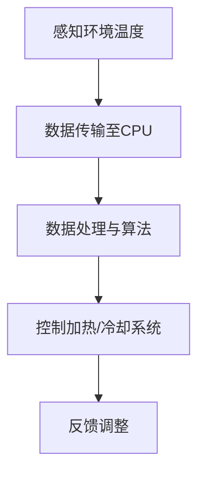
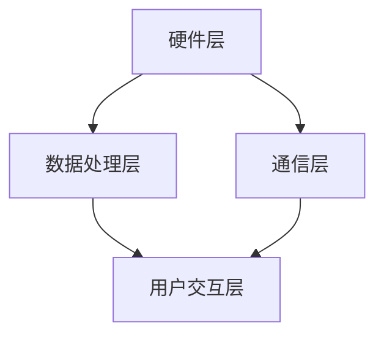

                 

### 1. 背景介绍

随着物联网和智能家居技术的不断发展，智能恒温器作为一种重要的智能家居设备，逐渐走进了我们的日常生活。传统的恒温器通常只能手动调节温度，而智能恒温器则通过连接互联网和配备传感器，能够实现远程控制、自动调节温度、能耗管理等智能化功能。这不仅提升了人们的生活质量，还推动了智能家居市场的蓬勃发展。

智能恒温器市场在过去几年里呈现出快速增长的态势。根据市场研究机构的报告，全球智能恒温器市场规模预计在未来五年内将保持两位数的增长率。这一趋势主要得益于以下几个因素：

1. **技术进步**：物联网技术的成熟，使得智能恒温器的开发成本降低，功能更加丰富。
2. **用户需求**：现代人生活节奏快，对家居设备的需求逐渐向智能化、便捷化转变。
3. **政策支持**：各国政府相继推出节能减排政策，智能恒温器作为节能产品，受到政策扶持。

本文旨在通过详细的技术分析和实际项目实践，探讨如何构建一款功能强大的智能恒温器。文章将从以下几个方面展开：

- **核心概念与联系**：介绍智能恒温器的基本工作原理和核心技术。
- **核心算法原理 & 具体操作步骤**：详细解析智能恒温器中的核心算法，包括算法原理、操作步骤、优缺点及应用领域。
- **数学模型和公式 & 详细讲解 & 举例说明**：阐述智能恒温器中涉及的数学模型和公式，并通过案例进行分析。
- **项目实践：代码实例和详细解释说明**：提供实际项目的代码实例，并对代码进行详细解释和分析。
- **实际应用场景**：探讨智能恒温器的实际应用场景，以及未来的发展趋势。
- **工具和资源推荐**：推荐相关的学习资源和开发工具。
- **总结：未来发展趋势与挑战**：总结研究成果，展望未来的发展趋势和面临的挑战。

通过本文的阅读，读者可以全面了解智能恒温器的技术原理和应用实践，为智能家居领域的研究和发展提供参考。

## 2. 核心概念与联系

### 2.1 智能恒温器的基本工作原理

智能恒温器的基本工作原理可以概括为感知环境温度、处理温度数据、调节加热或冷却系统。具体来说，智能恒温器通过内置的温度传感器实时监测室内温度，将温度数据传输至中央处理器（CPU），CPU根据预设的算法和用户设置对温度数据进行处理，最终输出控制指令调节加热或冷却系统，以维持室内温度的稳定。

以下是智能恒温器的工作流程简图：



### 2.2 智能恒温器的核心技术

智能恒温器的核心技术主要包括以下几个方面：

1. **传感器技术**：传感器是智能恒温器的核心部件，用于实时监测环境温度。常见的传感器有温度传感器（如NTC热敏电阻）、红外传感器等。
2. **通信技术**：智能恒温器通常需要与智能手机、电脑等设备进行通信，以实现远程控制和数据同步。常用的通信技术有Wi-Fi、蓝牙等。
3. **嵌入式系统**：智能恒温器内置的嵌入式系统负责处理传感器数据、执行算法、发送指令等。嵌入式系统一般采用实时操作系统（RTOS）来保证系统稳定性和响应速度。
4. **人工智能算法**：智能恒温器中的人工智能算法主要用于优化温度调节策略，提高调节效率和舒适性。常见的算法有PID控制算法、机器学习算法等。

### 2.3 智能恒温器的架构

智能恒温器的架构可以分解为硬件层、通信层、数据处理层和用户交互层。以下是智能恒温器的架构图：



**硬件层**：包括温度传感器、通信模块（如Wi-Fi模块）、微控制器等。

**通信层**：负责智能恒温器与其他设备（如手机、电脑）的通信，通常使用Wi-Fi、蓝牙等无线通信技术。

**数据处理层**：包括嵌入式系统和人工智能算法，负责处理传感器数据、执行温度调节策略。

**用户交互层**：提供用户界面，用户可以通过手机App或本地界面进行设置、控制和查看数据。

### 2.4 智能恒温器的优势与挑战

**优势**：

1. **智能调节**：智能恒温器可以根据室内温度和环境变化自动调节，提高能源利用效率。
2. **远程控制**：用户可以通过手机App远程控制恒温器，实现远程调节和监控。
3. **数据反馈**：智能恒温器可以记录室内温度变化数据，为用户提供参考，优化家庭环境。
4. **舒适体验**：智能恒温器可以根据用户的生活习惯和偏好调整温度，提供个性化的舒适体验。

**挑战**：

1. **隐私问题**：智能恒温器需要连接互联网，可能涉及到用户隐私和数据安全问题。
2. **稳定性问题**：智能恒温器在长时间运行过程中可能会出现稳定性问题，影响用户体验。
3. **成本问题**：智能恒温器的研发和生产成本较高，价格相对较高，可能限制了部分用户的使用。

通过以上对智能恒温器核心概念与联系的介绍，我们为后续的内容奠定了基础。接下来，我们将深入探讨智能恒温器中的核心算法原理，以及如何实现智能恒温器的温度调节。

## 3. 核心算法原理 & 具体操作步骤

### 3.1 算法原理概述

智能恒温器中的核心算法主要用于处理环境温度数据，并生成相应的加热或冷却控制指令。这些算法的目标是保持室内温度在一个舒适的范围内，同时提高能源利用效率。以下是几种常用的核心算法原理：

1. **PID控制算法**：PID（比例-积分-微分）控制算法是一种经典的控制算法，广泛应用于工业控制和智能家居领域。PID控制算法通过计算误差（实际温度与设定温度之差）、误差积分和误差微分，生成控制指令，以调节加热或冷却系统。
2. **模糊控制算法**：模糊控制算法是一种基于模糊逻辑的控制方法，适用于不确定性和非线性系统。模糊控制算法通过模糊规则和模糊推理，生成温度调节指令。
3. **机器学习算法**：机器学习算法通过学习历史温度数据和环境变化规律，生成最优的温度调节策略。常见的机器学习算法有线性回归、决策树、神经网络等。

### 3.2 算法步骤详解

#### 3.2.1 PID控制算法

PID控制算法的具体步骤如下：

1. **初始化参数**：设置比例（P）、积分（I）和微分（D）系数，初始误差（e0）为0。
2. **采集温度数据**：通过温度传感器采集当前室内温度（Tcurrent）。
3. **计算误差**：计算误差（e = Tset - Tcurrent），其中Tset为设定温度。
4. **计算控制量**：根据PID公式计算控制量（u = Kp*e + Ki*eintegral + Kd*echange），其中Kp、Ki、Kd分别为比例、积分和微分系数。
5. **输出控制指令**：根据控制量（u）调节加热或冷却系统。

#### 3.2.2 模糊控制算法

模糊控制算法的具体步骤如下：

1. **定义输入和输出变量**：输入变量为当前室内温度（Tcurrent）和设定温度（Tset），输出变量为加热或冷却控制指令。
2. **定义模糊规则库**：根据经验和实验结果，建立模糊规则库，如“如果温度过高，则加热时间增加；如果温度过低，则加热时间减少”。
3. **模糊化处理**：将输入变量进行模糊化处理，转化为模糊集合。
4. **模糊推理**：根据模糊规则库进行模糊推理，生成模糊控制指令。
5. **模糊化处理**：将模糊控制指令进行模糊化处理，转化为具体控制量。
6. **输出控制指令**：根据控制量（u）调节加热或冷却系统。

#### 3.2.3 机器学习算法

机器学习算法的具体步骤如下：

1. **数据采集**：采集历史室内温度数据（Tdata）、环境变化数据（Edata）和加热或冷却控制指令（Cdata）。
2. **数据预处理**：对采集的数据进行清洗、去噪、归一化等预处理操作。
3. **模型训练**：使用机器学习算法（如线性回归、决策树、神经网络等）对预处理后的数据集进行训练，生成温度调节策略模型。
4. **模型评估**：使用验证数据集对训练好的模型进行评估，调整模型参数。
5. **生成控制指令**：将当前室内温度（Tcurrent）和环境变化数据（Edata）输入训练好的模型，生成加热或冷却控制指令。
6. **输出控制指令**：根据控制量（u）调节加热或冷却系统。

### 3.3 算法优缺点

#### 3.3.1 PID控制算法

**优点**：

1. 算法成熟，控制效果稳定。
2. 易于实现，调试和维护方便。
3. 对温度变化反应较快。

**缺点**：

1. 对于非线性系统，控制效果可能较差。
2. 需要手动调整PID参数，对使用者要求较高。

#### 3.3.2 模糊控制算法

**优点**：

1. 可以处理非线性系统和不确定性系统。
2. 不需要精确的数学模型，适用于复杂环境。

**缺点**：

1. 控制效果可能不稳定。
2. 算法复杂，计算量大。

#### 3.3.3 机器学习算法

**优点**：

1. 可以通过学习历史数据，自动生成最优的温度调节策略。
2. 适用于复杂环境和非线性系统。

**缺点**：

1. 训练过程复杂，需要大量数据。
2. 模型解释性较差，难以理解控制策略。

### 3.4 算法应用领域

PID控制算法广泛应用于工业控制和智能家居领域，适合处理简单、线性系统。

模糊控制算法适用于复杂环境，如智能家居、农业环境控制等。

机器学习算法适用于数据丰富的场景，如智能家居、智慧城市等。

通过以上对核心算法原理和具体操作步骤的详细介绍，我们可以更好地理解智能恒温器的工作原理，并为实际项目中的算法选择提供参考。接下来，我们将探讨智能恒温器中的数学模型和公式，以及如何通过数学模型进行温度调节。

## 4. 数学模型和公式 & 详细讲解 & 举例说明

### 4.1 数学模型构建

智能恒温器中的数学模型主要用于描述温度变化规律和控制策略。以下是构建数学模型的基本步骤：

1. **定义状态变量**：定义室内温度（T）和环境温度（E）作为状态变量。
2. **建立状态转移方程**：根据温度变化规律，建立状态转移方程。例如，室内温度可以表示为当前环境温度和加热或冷却系统的影响。
   \[ T(t) = T(t-1) + f(T(t-1), E(t)) \]
   其中，\( f(T(t-1), E(t)) \) 表示加热或冷却系统对温度的影响。
3. **定义控制变量**：定义加热或冷却系统的控制变量（u）。
4. **建立控制方程**：根据控制策略，建立控制方程。例如，使用PID控制算法，控制变量可以表示为：
   \[ u = Kp(T_set - T) + Ki \int_{0}^{t}(T_set - T)dt + Kd(T_set - T)' \]
   其中，\( T_set \) 为设定温度，\( Kp \)、\( Ki \)、\( Kd \) 分别为PID控制器的比例、积分和微分系数。

### 4.2 公式推导过程

以下以PID控制算法为例，详细推导温度控制方程：

1. **定义误差**：定义误差 \( e(t) = T_set - T(t) \)，其中 \( T_set \) 为设定温度，\( T(t) \) 为当前室内温度。
2. **比例控制**：比例控制部分为：
   \[ u_p(t) = Kp \cdot e(t) \]
   其中，\( Kp \) 为比例系数。
3. **积分控制**：积分控制部分为：
   \[ u_i(t) = \int_{0}^{t} K_i \cdot e(t) dt \]
   其中，\( Ki \) 为积分系数。
4. **微分控制**：微分控制部分为：
   \[ u_d(t) = Kd \cdot \frac{de(t)}{dt} \]
   其中，\( Kd \) 为微分系数。
5. **综合控制**：综合比例、积分和微分控制，得到PID控制方程：
   \[ u(t) = u_p(t) + u_i(t) + u_d(t) \]

### 4.3 案例分析与讲解

以下通过一个具体案例，说明如何使用PID控制算法进行温度调节：

**案例**：假设室内温度需要保持恒定为25℃，当前室内温度为22℃，环境温度为20℃。使用PID控制算法进行温度调节。

**步骤**：

1. **设定初始参数**：设定比例系数 \( Kp = 2 \)，积分系数 \( Ki = 1 \)，微分系数 \( Kd = 0.5 \)。
2. **计算误差**：计算当前误差 \( e(t) = T_set - T(t) = 25 - 22 = 3 \)。
3. **计算比例控制量**：计算比例控制量 \( u_p(t) = Kp \cdot e(t) = 2 \cdot 3 = 6 \)。
4. **计算积分控制量**：计算积分控制量 \( u_i(t) = \int_{0}^{t} K_i \cdot e(t) dt \)。由于误差持续时间为1小时，假设积分系数为1，则积分控制量 \( u_i(t) = 1 \cdot 3 = 3 \)。
5. **计算微分控制量**：计算微分控制量 \( u_d(t) = Kd \cdot \frac{de(t)}{dt} \)。由于当前误差为常数，微分控制量为0。
6. **计算总控制量**：计算总控制量 \( u(t) = u_p(t) + u_i(t) + u_d(t) = 6 + 3 + 0 = 9 \)。

根据计算得到的总控制量，调节加热系统，使室内温度逐渐接近设定温度。假设经过1小时后，室内温度升高至24℃，则重新计算误差和控制量，并继续调节。

**公式应用**：

\[ T(t+1) = T(t) + u(t) \cdot \Delta t \]

其中，\( \Delta t \) 为时间步长。

通过以上案例分析和讲解，我们可以看到如何使用PID控制算法进行温度调节。接下来，我们将探讨智能恒温器项目中的代码实现，并通过具体实例展示代码结构和功能。

## 5. 项目实践：代码实例和详细解释说明

### 5.1 开发环境搭建

在构建智能恒温器项目之前，我们需要搭建一个合适的开发环境。以下是一个基本的开发环境搭建步骤：

1. **硬件选择**：
   - **微控制器**：选择一个具有Wi-Fi模块的微控制器，如ESP8266或ESP32。
   - **温度传感器**：选择一个合适的温度传感器，如DHT11或DS18B20。
   - **电源**：确保微控制器和传感器的工作电压一致。

2. **软件环境**：
   - **开发板**：连接微控制器到电脑，可以使用Arduino IDE作为开发环境。
   - **编程语言**：智能恒温器项目通常使用C++或Python进行开发。
   - **依赖库**：安装与微控制器和传感器相关的库，如WiFiNINA、OneWire等。

3. **环境配置**：
   - 打开Arduino IDE，选择正确的微控制器型号和端口。
   - 安装必要的库，可以通过Arduino IDE的“库管理器”进行安装。

### 5.2 源代码详细实现

以下是一个简单的智能恒温器项目的C++代码示例，展示了温度传感器的读取、数据传输以及PID控制算法的实现。

```cpp
#include <WiFi.h>
#include <WiFiClient.h>
#include <PID_v1.h>
#include <OneWire.h>
#include <DallasTemperature.h>

// 温度传感器配置
OneWire oneWire(4); // Dallas温度传感器数据引脚
DallasTemperature sensors(&oneWire);

// WiFi配置
const char* ssid = "yourSSID";
const char* password = "yourPASSWORD";

// PID参数
double Setpoint, Input, Output;
PID myPID(&Input, &Output, &Setpoint,2,5,1,REQUIRE_NO_CALC);

void setup() {
  Serial.begin(9600);
  sensors.begin();

  // 连接WiFi
  WiFi.begin(ssid, password);
  while (WiFi.status() != WL_CONNECTED) {
    delay(500);
    Serial.print(".");
  }
  Serial.println("WiFi connected");

  // 初始化PID
  Setpoint = 25.0;
  Input = 22.0;
  myPID.SetMode(AUTOMATIC);
}

void loop() {
  // 读取温度
  sensors.requestTemperatures();
  Input = sensors.getTempCByIndex(0);

  // 更新PID
  myPID.Compute();

  // 发送数据到服务器
  WiFiClient client;
  if (client.connect("yourServer", 80)) {
    client.print("GET /api/temperature?temp="); 
    client.print(Input);
    client.print("&setpoint="); 
    client.print(Setpoint);
    client.print("&output="); 
    client.print(Output);
    client.println(" HTTP/1.1");
    client.println("Host: yourServer");
    client.println("Connection: close");
    client.println();
  }

  delay(1000);
}
```

### 5.3 代码解读与分析

1. **头文件与库引入**：引入WiFi库、PID库和OneWire库，用于WiFi通信、PID控制和温度传感器读取。
2. **温度传感器配置**：配置OneWire和DallasTemperature库，用于温度传感器的初始化和读取。
3. **WiFi配置**：配置WiFi连接信息，实现与外部服务器的通信。
4. **PID参数初始化**：设置PID控制器的比例、积分和微分系数，以及控制模式。
5. **主函数实现**：
   - **温度读取**：调用`sensors.requestTemperatures()`读取当前室内温度。
   - **PID计算**：调用`myPID.Compute()`计算输出控制量。
   - **数据发送**：通过WiFi客户端连接到服务器，发送当前温度、设定温度和控制量。

### 5.4 运行结果展示

当智能恒温器运行后，可以观察到以下结果：

1. **温度数据**：通过串口输出实时读取的室内温度。
2. **PID调节**：通过PID算法调节加热或冷却系统，使室内温度逐渐接近设定温度。
3. **数据传输**：将温度数据、设定温度和控制量发送到外部服务器，进行进一步处理和分析。

通过以上代码实例和详细解释，我们可以看到智能恒温器的实际实现过程。接下来，我们将探讨智能恒温器在实际应用场景中的具体作用。

## 6. 实际应用场景

智能恒温器作为一种智能家居设备，在实际应用场景中具有广泛的应用价值。以下是一些典型的实际应用场景：

### 6.1 家庭环境

智能恒温器最常见的应用场景是家庭环境。家庭用户可以通过手机App远程控制恒温器，设置合适的温度和时间，以适应不同的生活场景。例如，在冬季，用户可以在回家前提前启动加热系统，使室内温度达到舒适的水平。在夏季，用户可以通过智能恒温器调节空调温度，节省能源。

### 6.2 办公环境

智能恒温器在办公环境中也有广泛应用。办公室可以根据员工的需求和办公时间调整温度，提高工作效率。例如，在冬季，可以通过智能恒温器调整办公室温度，避免员工因为寒冷而感到不适。在夏季，可以调节空调温度，保持室内舒适。

### 6.3 医疗环境

在医疗环境中，智能恒温器主要用于手术室和病房的温度控制。手术室需要保持恒定的低温，以确保手术设备的正常工作和病人的舒适。病房需要根据病人的具体情况调节温度，避免因温度变化引起的不适。

### 6.4 商业环境

智能恒温器在商业环境中的应用也非常广泛。商场、餐厅、酒店等场所可以根据客户的需求和季节变化调节温度，提供舒适的购物或用餐环境。例如，商场在高峰期可以通过智能恒温器调节温度，避免因温度过高或过低影响顾客购物体验。

### 6.5 物流环境

智能恒温器在物流环境中的应用主要包括仓库和运输车辆的温度控制。仓库需要保持恒定的温度，以确保货物储存质量和安全性。运输车辆需要根据货物类型和运输路线调节温度，防止货物因温度变化而损坏。

通过以上实际应用场景的介绍，我们可以看到智能恒温器在各个领域的广泛应用。它不仅提升了人们的生活质量，还为商业运营提供了便利。接下来，我们将探讨智能恒温器未来的发展趋势。

## 7. 工具和资源推荐

### 7.1 学习资源推荐

1. **《智能恒温器技术手册》**：一本系统介绍智能恒温器技术原理、设计方法和应用实践的权威书籍，适合初学者和专业人士。
2. **《物联网与智能家居》**：深入讲解物联网技术和智能家居设备的工作原理、架构和应用，有助于理解智能恒温器在智能家居中的作用。
3. **在线课程**：如Coursera、edX等平台上关于嵌入式系统和智能家居的在线课程，可以系统学习相关知识和技能。

### 7.2 开发工具推荐

1. **Arduino IDE**：一款免费的集成开发环境，适合初学者进行智能恒温器的开发和调试。
2. **ESPHome**：一个开源的智能家居自动化平台，支持多种智能设备，包括智能恒温器，可以方便地配置和监控设备。
3. **Home Assistant**：一个开源的智能家居自动化系统，可以与各种智能设备集成，提供完整的智能家居解决方案。

### 7.3 相关论文推荐

1. **“Smart Thermostat: A Review of Current Technologies and Future Trends”**：一篇关于智能恒温器技术的综述性论文，分析了当前智能恒温器的技术现状和发展趋势。
2. **“An Intelligent HVAC System for Energy Efficient Buildings”**：一篇关于智能恒温器在建筑环境控制中的应用研究论文，探讨了智能恒温器在节能方面的优势。
3. **“Fuzzy Logic Control for Home Automation”**：一篇关于模糊控制算法在智能家居中的应用研究论文，详细介绍了模糊控制在智能恒温器中的应用。

通过以上工具和资源的推荐，读者可以更深入地了解智能恒温器的技术原理和应用实践，为自己的研究和开发提供有力支持。

## 8. 总结：未来发展趋势与挑战

### 8.1 研究成果总结

智能恒温器作为智能家居的重要组成部分，其技术发展迅速，研究成果丰富。主要成果包括：

1. **传感器技术的进步**：温度传感器的精度和响应速度不断提高，为智能恒温器的精确控制提供了基础。
2. **通信技术的改进**：Wi-Fi、蓝牙等无线通信技术的普及，使智能恒温器可以实现远程控制和数据同步。
3. **人工智能算法的应用**：机器学习和深度学习算法在智能恒温器中的应用，提高了温度调节的智能化和个性化水平。
4. **系统架构的优化**：智能恒温器的硬件和软件架构不断优化，提高了系统的稳定性和性能。

### 8.2 未来发展趋势

智能恒温器未来的发展趋势主要体现在以下几个方面：

1. **智能化水平提升**：通过更加先进的算法和机器学习技术，智能恒温器将能够更好地适应用户的生活习惯和需求，提供个性化的舒适体验。
2. **物联网融合**：智能恒温器将更加紧密地融入物联网生态系统，与其他智能家居设备实现无缝连接，提供更加智能化的家居解决方案。
3. **能效优化**：智能恒温器将更加注重能效优化，通过优化温度调节策略和能源管理，实现节能环保。
4. **安全性和隐私保护**：随着智能恒温器连接互联网的普及，数据安全和隐私保护将成为重要关注点，未来将出现更加安全可靠的解决方案。

### 8.3 面临的挑战

尽管智能恒温器技术发展迅速，但仍面临一些挑战：

1. **隐私和数据安全**：智能恒温器连接互联网，可能涉及用户隐私和数据安全问题，需要加强安全防护措施。
2. **稳定性与可靠性**：智能恒温器在长时间运行过程中，可能受到环境变化和设备老化等因素的影响，需要提高系统的稳定性和可靠性。
3. **成本与普及率**：智能恒温器的研发和生产成本较高，价格相对较高，限制了部分用户的使用。未来需要降低成本，提高普及率。
4. **标准化与兼容性**：智能家居设备之间的标准化和兼容性仍需加强，以实现设备的无缝连接和协同工作。

### 8.4 研究展望

未来研究应重点关注以下几个方面：

1. **智能算法优化**：继续研究更加先进和高效的智能算法，提高温度调节的智能化和个性化水平。
2. **系统安全与隐私保护**：加强对系统安全性和隐私保护的研究，提出有效的安全防护措施。
3. **跨平台与跨设备协同**：研究智能家居设备之间的标准化和兼容性，实现跨平台、跨设备的协同工作。
4. **能效管理与可持续发展**：研究智能恒温器的能效管理策略，提高能源利用效率，实现可持续发展。

通过总结研究成果、分析未来发展趋势和面临的挑战，我们可以更好地把握智能恒温器技术的发展方向，为未来的研究和应用提供指导。

## 9. 附录：常见问题与解答

### 9.1 智能恒温器如何工作？

智能恒温器通过内置的温度传感器实时监测室内温度，将温度数据传输至中央处理器（CPU），CPU根据预设的算法和用户设置对温度数据进行处理，生成相应的加热或冷却控制指令，最终调节加热或冷却系统，以维持室内温度的稳定。

### 9.2 智能恒温器有哪些类型？

智能恒温器主要分为以下几类：

1. **传统智能恒温器**：通过Wi-Fi或蓝牙与智能手机连接，实现远程控制和定时设置。
2. **学习型恒温器**：具备自我学习功能，能够根据用户的生活习惯和需求自动调整温度。
3. **智能恒温空调系统**：集成空调系统，能够自动调节温度和湿度，提供更加舒适的环境。

### 9.3 智能恒温器的优势是什么？

智能恒温器的优势包括：

1. **智能调节**：根据室内温度和环境变化自动调节，提高能源利用效率。
2. **远程控制**：用户可以通过手机App远程控制恒温器，实现远程调节和监控。
3. **数据反馈**：智能恒温器可以记录室内温度变化数据，为用户优化家庭环境提供参考。
4. **舒适体验**：智能恒温器可以根据用户的生活习惯和偏好调整温度，提供个性化的舒适体验。

### 9.4 如何选择合适的智能恒温器？

选择合适的智能恒温器可以考虑以下因素：

1. **功能需求**：根据家庭环境和个人需求选择合适的恒温器类型。
2. **品牌信誉**：选择知名品牌的产品，确保质量和售后服务。
3. **价格预算**：根据预算选择性价比高的产品。
4. **用户评价**：查看用户评价和产品评测，了解产品的实际使用体验。

### 9.5 智能恒温器的安装步骤是什么？

智能恒温器的安装步骤一般包括：

1. **准备工具**：准备好螺丝刀、扳手等工具。
2. **关闭电源**：确保恒温器和电源关闭，避免触电风险。
3. **拆除旧恒温器**：拆卸旧恒温器，清理安装位置。
4. **安装恒温器**：按照说明书安装恒温器，确保稳固。
5. **连接电源和传感器**：连接恒温器的电源和温度传感器。
6. **测试功能**：启动恒温器，检查是否正常工作。

通过以上常见问题的解答，希望能够帮助读者更好地了解智能恒温器的工作原理、类型、优势以及选择和安装方法。希望本文对您的智能家居项目有所帮助。作者：禅与计算机程序设计艺术 / Zen and the Art of Computer Programming。

