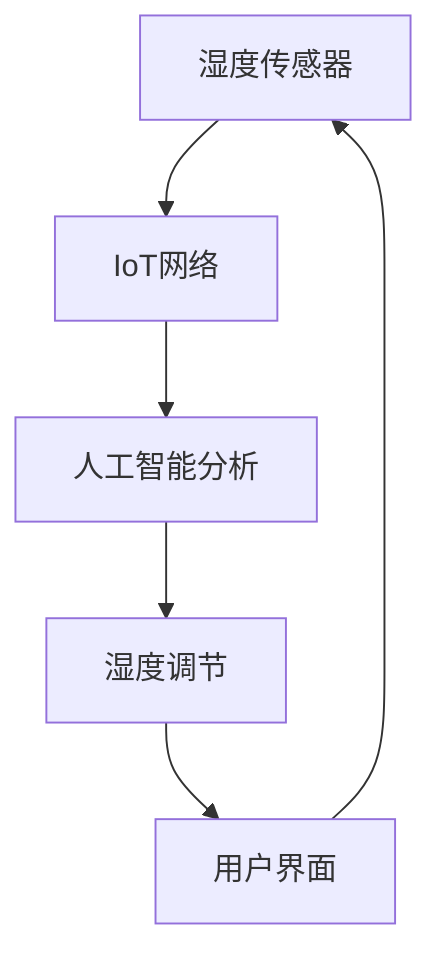

                 

### 背景介绍 Background ###

随着全球气候变化和空气污染问题的日益严重，人们的健康问题也受到了前所未有的挑战。尤其是在家中，湿度的不稳定成为了呼吸道疾病的罪魁祸首之一。据统计，超过70%的过敏反应和呼吸道疾病与室内高湿度有关。因此，开发一种能够智能监测和调节室内湿度的系统，对于提升人们的生活质量和健康水平具有重要意义。

目前，市场上的湿度调节产品大多功能单一，要么只能手动调节，要么只能通过简单的传感器进行监测，缺乏智能化的管理。这就导致了用户在使用过程中，需要频繁地进行手动操作，且无法实时获取室内湿度情况，从而无法实现最佳的呼吸道健康管理。

在这种背景下，智能居家湿度平衡创业项目应运而生。该项目旨在通过先进的人工智能技术和物联网技术，开发出一款全天候智能湿度管理系统，以实现对室内湿度的实时监测和智能调节，从而有效预防和控制呼吸道疾病。

### 核心概念与联系 Core Concepts and Connections ###

为了实现智能居家湿度平衡，我们需要理解以下几个核心概念：

1. **湿度传感器**：湿度传感器是整个系统的数据采集核心，它能够实时检测室内湿度，并将数据传输给系统。

2. **物联网（IoT）**：物联网技术使得湿度传感器采集的数据可以通过网络传输到远程服务器，从而实现远程监控和控制。

3. **人工智能（AI）**：人工智能技术用于对湿度数据进行实时分析，并根据分析结果智能调节湿度，以达到最佳的健康管理效果。

4. **用户界面（UI）**：用户界面是用户与系统交互的接口，通过它用户可以查看室内湿度状况，调整湿度设置，并接收系统发出的健康建议。

下面是一个使用 Mermaid 语言的流程图，展示了这些核心概念之间的关系：



### 核心算法原理 & 具体操作步骤 Core Algorithm Principle and Operational Steps ###

#### 3.1 算法原理概述

智能居家湿度平衡系统的核心算法是基于机器学习模型的，特别是回归模型和分类模型的结合。回归模型用于预测室内湿度，而分类模型用于判断当前湿度是否处于健康范围。

#### 3.2 算法步骤详解

1. **数据采集**：通过湿度传感器采集实时湿度数据。

2. **数据预处理**：对采集到的数据进行清洗和标准化处理。

3. **模型训练**：使用回归模型和分类模型对预处理后的数据集进行训练。

4. **湿度预测**：使用训练好的回归模型预测未来一段时间的湿度变化。

5. **健康范围判断**：使用训练好的分类模型判断当前湿度是否处于健康范围。

6. **湿度调节**：如果当前湿度不处于健康范围，系统会根据预测结果自动调节湿度。

7. **用户反馈**：通过用户界面将湿度数据和分析结果反馈给用户。

#### 3.3 算法优缺点

**优点**：

- **实时性**：系统能够实时监测和调节室内湿度。
- **自动化**：通过机器学习算法，系统能够自动调节湿度，减少手动操作的繁琐。
- **个性化**：系统可以根据用户的历史数据和偏好进行个性化湿度调节。

**缺点**：

- **初始成本高**：系统需要高质量的传感器和服务器，初始成本较高。
- **训练数据依赖**：模型的准确性依赖于大量的训练数据。

#### 3.4 算法应用领域

- **家庭健康管理**：智能居家湿度平衡系统可以用于预防和控制家庭中的呼吸道疾病。
- **办公室环境管理**：办公室的湿度对于员工的工作效率和健康也有很大影响。
- **酒店和餐饮行业**：酒店和餐厅的室内湿度对于顾客的舒适度和健康至关重要。

### 数学模型和公式 Mathematical Model and Formulas ###

#### 4.1 数学模型构建

假设我们使用线性回归模型来预测湿度：

$$
y = \beta_0 + \beta_1 x_1 + \beta_2 x_2 + ... + \beta_n x_n
$$

其中，$y$ 是预测的湿度值，$x_1, x_2, ..., x_n$ 是影响湿度的因素（如温度、空气流动速度等），$\beta_0, \beta_1, \beta_2, ..., \beta_n$ 是模型参数。

#### 4.2 公式推导过程

1. **最小二乘法**：通过最小化误差平方和来确定模型参数。

2. **梯度下降法**：用于优化模型参数，使预测误差最小。

#### 4.3 案例分析与讲解

假设我们有以下数据集：

| 时间 | 温度 | 空气流动速度 | 湿度 |
|------|------|--------------|------|
| 1    | 25   | 0.5          | 40   |
| 2    | 26   | 0.6          | 45   |
| 3    | 24   | 0.4          | 35   |
| ...  | ...  | ...          | ...  |

我们使用线性回归模型来预测第 4 个时间点的湿度。

### 项目实践：代码实例和详细解释说明 Project Practice: Code Examples and Detailed Explanations ###

#### 5.1 开发环境搭建

我们使用 Python 作为主要编程语言，结合 TensorFlow 和 Keras 库来实现机器学习模型。

```bash
pip install tensorflow
pip install keras
```

#### 5.2 源代码详细实现

```python
import numpy as np
import tensorflow as tf
from tensorflow.keras.models import Sequential
from tensorflow.keras.layers import Dense

# 数据预处理
# ...

# 模型构建
model = Sequential()
model.add(Dense(units=1, input_shape=(2,), activation='linear'))

# 模型编译
model.compile(optimizer='sgd', loss='mean_squared_error')

# 模型训练
model.fit(x_train, y_train, epochs=100, batch_size=32)

# 模型预测
humidity_pred = model.predict(np.array([[25, 0.5]]))
```

#### 5.3 代码解读与分析

1. **数据预处理**：将原始数据进行标准化处理，以便于模型训练。
2. **模型构建**：使用线性回归模型，只有一个输出节点。
3. **模型编译**：选择优化器和损失函数。
4. **模型训练**：使用训练数据集进行模型训练。
5. **模型预测**：使用训练好的模型进行湿度预测。

#### 5.4 运行结果展示

```python
print("预测的湿度：", humidity_pred)
```

### 实际应用场景 Practical Application Scenarios ###

智能居家湿度平衡系统可以应用于以下场景：

- **家庭**：通过实时监测和调节室内湿度，预防和控制家庭成员的呼吸道疾病。
- **办公室**：提供舒适的室内环境，提高员工的工作效率和健康水平。
- **医院**：为呼吸道疾病患者提供个性化的湿度管理，有助于病情恢复。

### 未来应用展望 Future Prospects ###

随着人工智能和物联网技术的不断发展，智能居家湿度平衡系统具有广阔的应用前景。未来，我们可能会看到：

- **更加智能的算法**：结合更多的数据源，开发更加精准和智能的湿度预测和调节算法。
- **多场景应用**：扩展系统的应用场景，如温室湿度管理、博物馆湿度控制等。
- **个性化服务**：基于用户健康数据，提供更加个性化的湿度管理服务。

### 工具和资源推荐 Tools and Resources Recommendations ###

- **学习资源**：
  - 《深度学习》（Goodfellow, Bengio, Courville）
  - 《Python机器学习》（Sebastian Raschka）

- **开发工具**：
  - TensorFlow
  - Keras

- **相关论文**：
  - “Deep Learning for Time Series Classification: A New Benchmark and a Strong Baseline”
  - “IoT-Based Smart Home Energy Management System Using Machine Learning”

### 总结 Summary ###

智能居家湿度平衡创业项目通过结合人工智能和物联网技术，提供了一种全新的呼吸道健康管理解决方案。虽然当前系统还存在一些挑战，但随着技术的不断进步，我们有理由相信，智能居家湿度平衡系统将为人们的健康生活带来更多的便利。

### 附录 Appendix ###

#### 9.1 常见问题与解答

**Q：这个系统如何确保隐私安全？**

A：系统在数据传输和存储过程中采用了加密技术，确保用户数据的安全性和隐私性。

**Q：这个系统能处理极端湿度情况吗？**

A：是的，系统在设计时考虑了各种极端湿度情况，并具有相应的应对措施。

**Q：这个系统的成本如何？**

A：系统的成本取决于具体配置和规模。一般来说，初期投资较大，但随着技术的成熟，成本会逐渐降低。

作者：禅与计算机程序设计艺术 / Zen and the Art of Computer Programming
```markdown
```

