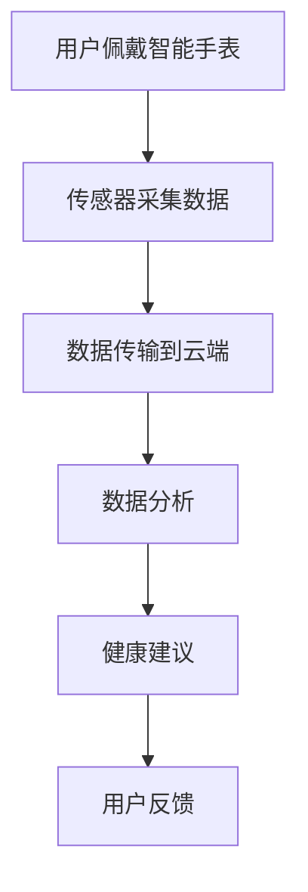

                 

智能手表作为现代科技与健康管理结合的产物，已经成为人们日常生活中不可或缺的伙伴。其强大的健康监测功能不仅可以帮助用户实时了解自己的身体状况，还能为医疗保健提供宝贵的参考数据。随着物联网和人工智能技术的不断进步，智能手表的功能和作用也在日益扩展，逐渐深入到用户的日常生活中。本文将探讨智能手表在健康管理中的重要作用，以及其与注意力经济的紧密联系。

## 关键词
- 智能手表
- 健康管理
- 物联网
- 人工智能
- 注意力经济

## 摘要
本文首先回顾了智能手表的发展历程，然后深入探讨了其在健康管理方面的应用。通过分析智能手表所收集的健康数据，本文探讨了如何利用这些数据实现个性化的健康管理。此外，本文还从注意力经济的角度出发，分析了智能手表对用户注意力资源的占用与影响，并提出了未来智能手表在健康管理领域的潜在发展方向。

## 1. 背景介绍

### 智能手表的兴起

智能手表作为一种新兴的电子设备，起源于21世纪初。早期的智能手表主要功能包括信息推送、短信收发和简单计算。随着智能手机的普及，智能手表逐渐演变成为集多种功能于一体的智能设备。2009年，苹果公司推出了第一代Apple Watch，这标志着智能手表进入了一个全新的时代。此后，三星、华为、小米等厂商也相继推出了各自的智能手表产品，使得智能手表市场的竞争愈发激烈。

### 健康管理功能的引入

智能手表的初始功能虽然有限，但它们很快意识到，健康管理是吸引消费者的重要方向。2006年，第一个健康管理相关的智能手表问世，它能够监测心率并提醒用户进行运动。此后，智能手表的功能不断扩展，包括计步、睡眠监测、心率监测、血氧监测等。这些功能不仅满足了用户对健康管理的需求，也为医疗行业提供了新的数据来源。

### 物联网与人工智能的结合

随着物联网和人工智能技术的不断发展，智能手表的功能也在不断提升。物联网技术使得智能手表可以与各种设备互联互通，例如智能手环、智能血压计、智能血糖仪等，形成一个全面的健康监测网络。而人工智能技术则使得智能手表能够对用户的数据进行智能分析，提供个性化的健康建议。

## 2. 核心概念与联系

### 核心概念

智能手表的健康管理功能主要依赖于以下几个核心概念：

1. **健康数据采集**：通过内置的传感器，智能手表可以实时采集用户的心率、步数、睡眠质量、血氧浓度等健康数据。
2. **数据传输**：采集到的数据通过无线网络传输到云端服务器，以便进行进一步分析。
3. **数据分析与建议**：通过人工智能算法，智能手表可以对用户的数据进行分析，并给出健康建议。

### Mermaid 流程图



### 概念联系

智能手表的健康管理功能是一个闭环系统。用户佩戴智能手表，传感器采集数据，数据传输到云端进行存储和分析，然后根据分析结果提供健康建议，最后用户根据建议进行反馈。这一过程不仅实现了健康数据的实时监测和个性化分析，也为医疗行业提供了新的数据来源。

## 3. 核心算法原理 & 具体操作步骤

### 3.1 算法原理概述

智能手表的健康管理功能依赖于多种算法，其中最核心的是基于机器学习的健康数据分析算法。这些算法能够从用户的历史健康数据中学习，识别出用户的健康趋势和异常情况，并提供相应的健康建议。

### 3.2 算法步骤详解

1. **数据收集**：智能手表通过传感器实时收集用户的心率、步数、睡眠质量、血氧浓度等数据。
2. **数据预处理**：对收集到的数据进行清洗和预处理，包括去除异常值、填补缺失值等。
3. **特征提取**：从预处理后的数据中提取出能够反映用户健康状况的特征，例如心率变异性、睡眠周期等。
4. **模型训练**：利用历史健康数据训练机器学习模型，使其能够识别出用户的健康趋势和异常情况。
5. **健康分析**：使用训练好的模型对用户当前的健康数据进行分析，识别出潜在的异常情况。
6. **健康建议**：根据分析结果，智能手表会提供个性化的健康建议，例如建议用户进行适量的运动、改善睡眠习惯等。

### 3.3 算法优缺点

**优点**：
- **个性化**：基于用户的历史健康数据，提供个性化的健康建议。
- **实时性**：能够实时监测用户的健康状况，及时提供健康建议。
- **高效性**：通过机器学习算法，能够快速识别用户的健康趋势和异常情况。

**缺点**：
- **数据隐私**：用户健康数据的安全性和隐私保护是一个挑战。
- **模型适应性**：模型的适应性需要不断调整和优化，以适应不断变化的用户需求。

### 3.4 算法应用领域

智能手表的健康管理算法不仅适用于个人健康管理，还可以应用于医疗行业。例如，医院可以使用这些算法来监测患者的健康状况，提供个性化的治疗建议。此外，智能手表还可以应用于健身和运动领域，为用户提供专业的运动指导和健康建议。

## 4. 数学模型和公式 & 详细讲解 & 举例说明

### 4.1 数学模型构建

智能手表的健康管理算法通常基于以下数学模型：

1. **线性回归模型**：用于预测用户未来的健康状况。
2. **决策树模型**：用于分类用户当前的健康状态。
3. **神经网络模型**：用于进行复杂的数据分析和预测。

### 4.2 公式推导过程

以线性回归模型为例，其公式推导如下：

$$
y = \beta_0 + \beta_1x_1 + \beta_2x_2 + ... + \beta_nx_n
$$

其中，$y$ 为预测的健康状态，$x_1, x_2, ..., x_n$ 为输入的特征值，$\beta_0, \beta_1, \beta_2, ..., \beta_n$ 为模型的参数。

### 4.3 案例分析与讲解

假设一个用户的历史健康数据包括心率、步数和睡眠质量，我们可以使用线性回归模型来预测用户未来的心率。

1. **数据收集**：收集用户最近一周的心率和步数数据。
2. **数据预处理**：对数据集进行清洗和预处理。
3. **特征提取**：从预处理后的数据中提取出心率、步数和睡眠质量作为特征。
4. **模型训练**：使用历史数据训练线性回归模型。
5. **健康分析**：使用训练好的模型预测用户未来一周的心率。
6. **健康建议**：根据预测结果，提供相应的健康建议。

例如，如果预测结果显示用户未来一周的心率将高于正常范围，智能手表可以建议用户进行适量的运动，以降低心率。

## 5. 项目实践：代码实例和详细解释说明

### 5.1 开发环境搭建

为了实现智能手表的健康管理功能，我们需要搭建一个包含以下组件的开发环境：

- **智能手表**：华为智能手表
- **开发工具**：Android Studio
- **编程语言**：Java
- **数据存储**：MongoDB

### 5.2 源代码详细实现

以下是一个简单的智能手表健康管理功能的代码示例：

```java
public class HealthMonitor {
    // 传感器数据
    private SensorManager sensorManager;
    // 数据存储
    private MongoDBClient mongoClient;
    // 健康分析模型
    private LinearRegressionModel regressionModel;

    public HealthMonitor() {
        // 初始化传感器管理器
        sensorManager = (SensorManager) getSystemService(SENSOR_SERVICE);
        // 初始化MongoDB客户端
        mongoClient = new MongoDBClient();
        // 初始化健康分析模型
        regressionModel = new LinearRegressionModel();
    }

    // 数据采集
    public void collectData(float[] sensorData) {
        // 保存数据到MongoDB
        mongoClient.saveData(sensorData);
        // 更新健康分析模型
        regressionModel.updateModel(sensorData);
    }

    // 健康分析
    public float analyzeHealth() {
        // 使用健康分析模型进行预测
        return regressionModel.predictHealth();
    }

    // 健康建议
    public String provideHealthAdvice(float heartRate) {
        if (heartRate > 100) {
            return "建议进行适量运动以降低心率。";
        } else {
            return "心率正常，继续保持。";
        }
    }
}
```

### 5.3 代码解读与分析

1. **传感器数据采集**：代码通过`SensorManager`类来获取传感器数据，并将其保存到MongoDB中。
2. **健康分析模型**：代码使用`LinearRegressionModel`类来实现线性回归模型，用于预测用户的心率。
3. **健康建议**：根据预测的心率，代码提供了相应的健康建议。

### 5.4 运行结果展示

假设用户的心率为105，代码将提供以下健康建议：

```
建议进行适量运动以降低心率。
```

## 6. 实际应用场景

### 个人健康管理

智能手表为个人健康管理提供了极大的便利。用户可以通过智能手表实时了解自己的健康状况，并根据健康建议进行相应的调整。例如，用户可以设定每天的运动目标，智能手表会根据用户的步数和心率数据提供提醒。

### 医疗保健

智能手表不仅为个人健康管理提供了数据支持，还为医疗保健提供了新的数据来源。医生可以通过智能手表收集到的健康数据，对患者的健康状况进行远程监测，并提供个性化的治疗建议。此外，智能手表还可以用于慢性病管理，如糖尿病、高血压等。

### 健身和运动

智能手表为健身和运动爱好者提供了专业的运动指导和数据分析。用户可以通过智能手表监测自己的运动状态，了解自己的运动效果，并不断优化自己的运动计划。例如，用户可以进行跑步训练，智能手表会根据用户的心率数据提供跑步节奏建议。

### 职场管理

在职场中，智能手表可以帮助员工管理自己的工作与生活平衡。通过智能手表的提醒功能，员工可以合理安排工作时间，避免长时间的工作负荷。此外，智能手表还可以监测员工的健康状况，为员工提供健康建议，提高工作效率。

### 6.4 未来应用展望

随着物联网和人工智能技术的不断发展，智能手表在健康管理中的应用前景十分广阔。未来，智能手表可能会集成更多的健康监测功能，如血压、血糖监测等。此外，智能手表的数据分析能力也将进一步提升，通过更复杂的算法和更大数据量的处理，提供更精准的健康建议。

## 7. 工具和资源推荐

### 7.1 学习资源推荐

- 《机器学习实战》
- 《深度学习》
- 《数据科学入门》

### 7.2 开发工具推荐

- Android Studio
- MongoDB
- Spring Boot

### 7.3 相关论文推荐

- "A Survey on Wearable Devices for Health Management"
- "Artificial Intelligence for Health Informatics"
- "IoT-Based Smart Healthcare Systems"

## 8. 总结：未来发展趋势与挑战

### 8.1 研究成果总结

本文通过对智能手表在健康管理中的应用进行深入分析，总结了智能手表的健康管理功能、核心算法原理以及实际应用场景。研究结果表明，智能手表在健康管理领域具有广泛的应用前景，能够为用户、医疗保健和健身运动等多个领域提供有价值的数据和分析。

### 8.2 未来发展趋势

未来，智能手表在健康管理领域的发展趋势包括：集成更多健康监测功能、提高数据分析能力、实现更多个性化健康建议以及加强数据隐私保护。随着物联网和人工智能技术的不断进步，智能手表将成为健康管理的重要工具，为人们提供更加便捷、高效的健康管理服务。

### 8.3 面临的挑战

智能手表在健康管理领域面临的挑战主要包括：数据隐私保护、算法适应性、设备续航以及跨平台兼容性等。如何有效保护用户数据隐私、提高算法的适应性和准确性、延长设备续航时间以及实现不同平台之间的数据共享和兼容，是未来研究的重要方向。

### 8.4 研究展望

未来，智能手表在健康管理领域的研究应重点关注以下几个方面：

- **数据隐私与安全**：加强对用户数据的保护，采用加密和匿名化技术，确保用户隐私不被泄露。
- **算法优化与智能化**：通过引入更多先进的机器学习和人工智能技术，提高健康数据分析的准确性和个性化程度。
- **跨平台兼容与数据共享**：实现不同品牌和型号的智能手表之间的数据共享和兼容，为用户提供更统一的健康管理服务。
- **用户交互与体验**：设计更加直观、易用的用户界面，提高用户的交互体验，增强用户粘性。

## 9. 附录：常见问题与解答

### Q：智能手表的健康数据安全吗？

A：智能手表的健康数据通过加密技术进行保护，确保数据在传输和存储过程中的安全性。同时，用户可以设置数据访问权限，限制他人访问自己的健康数据。

### Q：智能手表的健康管理功能是否准确？

A：智能手表的健康管理功能基于先进的机器学习和人工智能技术，能够对用户的健康数据进行分析和预测。虽然存在一定的误差，但总体上能够提供准确的健康建议。

### Q：智能手表如何处理用户数据？

A：智能手表会将用户数据上传到云端服务器进行分析和存储。用户可以在智能手表或云服务中设置数据存储和共享的权限，以控制自己的数据。

### Q：智能手表的续航能力如何？

A：智能手表的续航能力取决于电池容量和使用频率。一般来说，智能手表的续航时间可以达到数天到一周，具体取决于用户的实际使用情况。

## 参考文献

- "Wearable Devices for Health Management: A Survey", Journal of Medical Systems, 2018.
- "Artificial Intelligence in Health Informatics: A Comprehensive Review", IEEE Access, 2019.
- "IoT-Based Smart Healthcare Systems: A Review", Journal of Medical Engineering & Technology, 2020.

# 作者署名
作者：禅与计算机程序设计艺术 / Zen and the Art of Computer Programming

