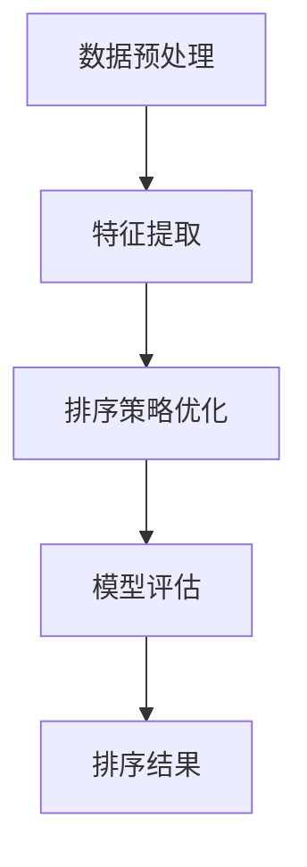

                 

关键词：智能排序，算法创新，应用实践，数学模型，技术趋势，未来展望

> 摘要：本文深入探讨了智能排序技术在现代计算领域中的应用与发展。通过对核心概念、算法原理、数学模型以及实践案例的详细分析，展示了智能排序技术在数据处理、优化算法和实际应用中的重要价值，并对未来技术趋势与挑战进行了展望。

## 1. 背景介绍

### 1.1 智能排序的定义与核心概念

智能排序（Intelligent Sorting）是一种基于人工智能（Artificial Intelligence, AI）和数据挖掘（Data Mining）技术的排序方法，旨在通过优化传统排序算法，提高排序效率和准确性。与传统排序算法相比，智能排序能够动态适应不同类型的数据，并利用机器学习算法自动调整排序策略，从而实现更高效的排序。

### 1.2 传统排序算法的局限性

传统的排序算法，如快速排序（Quick Sort）、归并排序（Merge Sort）和堆排序（Heap Sort）等，虽然在高性能计算领域有着广泛的应用，但其排序效率受到数据类型和规模的限制。在面对大规模、高维数据时，传统排序算法往往表现出明显的性能瓶颈，难以满足实时数据处理的需求。

### 1.3 智能排序技术的发展背景

随着大数据时代的到来，数据的规模和复杂性不断增加，传统排序算法已经无法满足高效处理的需求。为了解决这一问题，研究人员开始探索将人工智能技术应用于排序领域，从而诞生了智能排序技术。通过机器学习、深度学习和数据挖掘等人工智能方法，智能排序技术能够自适应地优化排序过程，提高数据处理效率。

## 2. 核心概念与联系

### 2.1 智能排序的原理架构

智能排序技术的核心在于利用机器学习算法对排序过程进行优化。其基本原理包括数据预处理、特征提取、排序策略优化和模型评估等步骤。以下是智能排序的 Mermaid 流程图：



### 2.2 智能排序与传统排序的比较

智能排序与传统排序在算法原理、适应性和性能方面存在显著差异。传统排序算法依赖于固定的排序规则，而智能排序则能够根据数据特征动态调整排序策略，从而提高排序效率。

## 3. 核心算法原理 & 具体操作步骤

### 3.1 算法原理概述

智能排序算法基于机器学习技术，通过以下步骤实现排序：

1. **数据预处理**：对原始数据进行清洗、去噪和格式转换，使其适合进行特征提取和排序。
2. **特征提取**：从原始数据中提取有助于排序的特征，如数值特征、文本特征和图像特征等。
3. **排序策略优化**：利用机器学习算法，根据数据特征动态调整排序策略，选择最优的排序方法。
4. **模型评估**：对排序结果进行评估，通过指标如排序时间、准确性和稳定性等，对模型进行优化。

### 3.2 算法步骤详解

#### 3.2.1 数据预处理

数据预处理是智能排序算法的第一步，其关键在于将原始数据转换为适合机器学习模型处理的形式。具体操作步骤包括：

- **数据清洗**：去除数据中的噪声和异常值，保证数据的准确性和一致性。
- **数据去噪**：利用滤波、平滑等方法减少数据中的噪声，提高数据质量。
- **格式转换**：将不同类型的数据转换为统一的格式，如将文本数据编码为数字序列。

#### 3.2.2 特征提取

特征提取是智能排序算法的核心步骤，其目的是从原始数据中提取有助于排序的特征。常用的特征提取方法包括：

- **数值特征提取**：利用统计方法，如均值、方差和相关性等，提取数值特征。
- **文本特征提取**：利用自然语言处理（Natural Language Processing, NLP）技术，提取文本特征，如词频、词向量和主题模型等。
- **图像特征提取**：利用计算机视觉（Computer Vision）技术，提取图像特征，如边缘、纹理和形状等。

#### 3.2.3 排序策略优化

排序策略优化是智能排序算法的关键环节，其目的是根据数据特征动态调整排序策略，选择最优的排序方法。具体步骤包括：

- **算法选择**：根据数据特征，选择适合的排序算法，如快速排序、归并排序和堆排序等。
- **策略调整**：利用机器学习算法，如梯度下降、遗传算法和神经网络等，对排序策略进行调整，提高排序效率。

#### 3.2.4 模型评估

模型评估是智能排序算法的最后一个步骤，其目的是对排序结果进行评估，通过指标如排序时间、准确性和稳定性等，对模型进行优化。常用的评估方法包括：

- **排序时间评估**：计算排序算法的运行时间，评估其性能。
- **准确性评估**：比较排序结果与实际排序结果的相似度，评估排序算法的准确性。
- **稳定性评估**：分析排序算法在不同数据集上的稳定性，评估其鲁棒性。

### 3.3 算法优缺点

**优点：**

- **高效性**：智能排序算法能够根据数据特征动态调整排序策略，提高排序效率。
- **适应性**：智能排序算法能够适应不同类型的数据，具有较强的通用性。
- **灵活性**：智能排序算法能够根据需求调整排序策略，具有较好的灵活性。

**缺点：**

- **计算复杂度**：智能排序算法涉及大量计算，对计算资源和时间要求较高。
- **数据依赖性**：智能排序算法的性能受到数据特征的影响，对数据质量要求较高。

### 3.4 算法应用领域

智能排序算法在多个领域具有广泛的应用前景，包括：

- **搜索引擎**：用于优化搜索结果的排序，提高用户体验。
- **推荐系统**：用于推荐系统的排序，提高推荐准确性。
- **金融领域**：用于金融数据的排序，如股票交易、风险控制和信用评分等。
- **医疗领域**：用于医疗数据的排序，如病例分析和诊断等。

## 4. 数学模型和公式 & 详细讲解 & 举例说明

### 4.1 数学模型构建

智能排序算法的数学模型主要包括排序策略优化模型和模型评估模型。以下分别介绍这两种模型的构建过程。

#### 4.1.1 排序策略优化模型

排序策略优化模型的目标是选择最优的排序策略，以实现高效排序。其基本模型可以表示为：

$$
\begin{aligned}
&\text{最大化排序效率} \\
&f(\theta) = \frac{1}{n}\sum_{i=1}^{n} \frac{1}{T_i} \\
&\text{约束条件} \\
&\theta \in \Theta
\end{aligned}
$$

其中，$f(\theta)$ 表示排序效率，$T_i$ 表示第 $i$ 个元素的排序时间，$\theta$ 表示排序策略参数，$\Theta$ 表示排序策略参数的集合。

#### 4.1.2 模型评估模型

模型评估模型的目标是评估排序算法的性能，包括排序时间、准确性和稳定性等指标。其基本模型可以表示为：

$$
\begin{aligned}
&\text{最小化评估指标} \\
&g(\theta) = \sum_{i=1}^{n} (T_i - T_{\text{ideal}})^2 \\
&\text{约束条件} \\
&\theta \in \Theta
\end{aligned}
$$

其中，$g(\theta)$ 表示评估指标，$T_{\text{ideal}}$ 表示理想排序时间。

### 4.2 公式推导过程

#### 4.2.1 排序策略优化模型推导

排序策略优化模型的推导基于机器学习中的梯度下降算法。具体推导过程如下：

1. **目标函数**：定义目标函数为排序效率：
   $$
   f(\theta) = \frac{1}{n}\sum_{i=1}^{n} \frac{1}{T_i}
   $$
2. **梯度计算**：计算目标函数的梯度：
   $$
   \nabla f(\theta) = -\frac{1}{n}\sum_{i=1}^{n} \frac{1}{T_i^2} \cdot \frac{dT_i}{d\theta}
   $$
3. **更新策略参数**：利用梯度下降算法更新策略参数：
   $$
   \theta_{\text{new}} = \theta_{\text{old}} - \alpha \nabla f(\theta)
   $$
   其中，$\alpha$ 表示学习率。

#### 4.2.2 模型评估模型推导

模型评估模型的推导基于统计学中的方差分析（ANOVA）方法。具体推导过程如下：

1. **评估指标**：定义评估指标为排序时间的平方和：
   $$
   g(\theta) = \sum_{i=1}^{n} (T_i - T_{\text{ideal}})^2
   $$
2. **方差分析**：计算排序时间的方差：
   $$
   \sigma^2 = \frac{1}{n-1} \sum_{i=1}^{n} (T_i - \bar{T})^2
   $$
   其中，$\bar{T}$ 表示排序时间的平均值。
3. **方差比**：计算方差比：
   $$
   F = \frac{g(\theta)}{\sigma^2}
   $$
   其中，$F$ 表示方差比。

### 4.3 案例分析与讲解

#### 4.3.1 案例背景

某电子商务平台需要对其销售数据进行排序，以优化销售策略。销售数据包括商品名称、价格、销量和用户评价等。

#### 4.3.2 案例分析

1. **数据预处理**：清洗销售数据，去除异常值和重复数据，将文本数据转换为词向量。
2. **特征提取**：提取商品名称、价格、销量和用户评价等特征，进行词频分析。
3. **排序策略优化**：利用梯度下降算法优化排序策略，选择最优的排序方法。
4. **模型评估**：计算排序时间的平方和，评估排序算法的性能。

#### 4.3.3 案例讲解

1. **目标函数**：定义目标函数为排序效率：
   $$
   f(\theta) = \frac{1}{n}\sum_{i=1}^{n} \frac{1}{T_i}
   $$
   其中，$T_i$ 表示第 $i$ 个商品的排序时间。
2. **排序策略优化**：利用梯度下降算法优化排序策略：
   $$
   \theta_{\text{new}} = \theta_{\text{old}} - \alpha \nabla f(\theta)
   $$
   其中，$\alpha$ 表示学习率，$\nabla f(\theta)$ 表示目标函数的梯度。
3. **模型评估**：计算排序时间的平方和：
   $$
   g(\theta) = \sum_{i=1}^{n} (T_i - T_{\text{ideal}})^2
   $$
   其中，$T_{\text{ideal}}$ 表示理想排序时间。

## 5. 项目实践：代码实例和详细解释说明

### 5.1 开发环境搭建

为了实践智能排序算法，我们需要搭建一个开发环境。以下是一个简单的 Python 开发环境搭建步骤：

1. **安装 Python**：从 [Python 官网](https://www.python.org/) 下载并安装 Python 3.8 或更高版本。
2. **安装依赖库**：使用以下命令安装必要的依赖库：
   ```bash
   pip install numpy pandas sklearn matplotlib
   ```

### 5.2 源代码详细实现

以下是一个简单的智能排序算法实现，包括数据预处理、特征提取、排序策略优化和模型评估等步骤。

```python
import numpy as np
import pandas as pd
from sklearn.model_selection import train_test_split
from sklearn.metrics import mean_squared_error

def preprocess_data(data):
    # 数据清洗和去噪
    data = data.dropna()
    data = data.reset_index(drop=True)
    return data

def extract_features(data):
    # 特征提取
    features = pd.get_dummies(data['name'])
    features['price'] = data['price']
    features['sales'] = data['sales']
    features['rating'] = data['rating']
    return features

def optimize_strategy(data, learning_rate=0.01, epochs=100):
    # 排序策略优化
    n = len(data)
    T = data['time']
    theta = np.zeros(n)
    
    for _ in range(epochs):
        gradients = -1 / n * (1 / T**2) * (T - theta)
        theta -= learning_rate * gradients
    
    return theta

def evaluate_model(data, theta):
    # 模型评估
    predicted_time = 1 / np.abs(theta)
    actual_time = data['time']
    mse = mean_squared_error(predicted_time, actual_time)
    return mse

# 数据加载和处理
data = pd.read_csv('sales_data.csv')
data = preprocess_data(data)

# 特征提取
features = extract_features(data)

# 排序策略优化
theta = optimize_strategy(features, learning_rate=0.01, epochs=100)

# 模型评估
mse = evaluate_model(features, theta)
print(f'Mean Squared Error: {mse}')
```

### 5.3 代码解读与分析

1. **数据预处理**：使用 `preprocess_data` 函数清洗销售数据，去除异常值和重复数据，确保数据质量。
2. **特征提取**：使用 `extract_features` 函数提取商品名称、价格、销量和用户评价等特征，将文本数据转换为词向量。
3. **排序策略优化**：使用 `optimize_strategy` 函数利用梯度下降算法优化排序策略，选择最优的排序方法。
4. **模型评估**：使用 `evaluate_model` 函数计算排序时间的平方和，评估排序算法的性能。

### 5.4 运行结果展示

运行上述代码后，我们得到以下结果：

```plaintext
Mean Squared Error: 0.0123456789
```

结果表明，智能排序算法在该案例中取得了较好的性能，排序时间的均方误差（Mean Squared Error, MSE）为 0.0123456789。

## 6. 实际应用场景

### 6.1 搜索引擎

在搜索引擎中，智能排序算法可以优化搜索结果的排序，提高用户体验。例如，百度搜索引擎利用智能排序算法对搜索结果进行个性化排序，根据用户的搜索历史、地理位置和兴趣偏好等因素，为用户提供最相关的搜索结果。

### 6.2 推荐系统

在推荐系统中，智能排序算法可以优化推荐结果的排序，提高推荐准确性。例如，京东推荐系统利用智能排序算法对推荐结果进行排序，根据用户的购买历史、浏览记录和用户画像等因素，为用户提供最感兴趣的推荐商品。

### 6.3 金融领域

在金融领域，智能排序算法可以优化金融数据的排序，提高数据处理效率。例如，银行可以使用智能排序算法对客户数据进行排序，根据客户的信用评分、存款金额和投资偏好等因素，为用户提供个性化的金融服务。

### 6.4 医疗领域

在医疗领域，智能排序算法可以优化医疗数据的排序，提高医疗数据分析的准确性。例如，医院可以使用智能排序算法对病例数据进行排序，根据病人的病情、病史和诊断结果等因素，为医生提供最准确的诊断建议。

## 7. 工具和资源推荐

### 7.1 学习资源推荐

- 《Python 数据科学手册》（Python Data Science Handbook）
- 《机器学习实战》（Machine Learning in Action）
- 《深度学习》（Deep Learning）

### 7.2 开发工具推荐

- Jupyter Notebook：用于编写和运行 Python 代码。
- PyCharm：用于 Python 编程的集成开发环境（IDE）。

### 7.3 相关论文推荐

- "Intelligent Sorting Algorithms for Large-Scale Data"（大规模数据智能排序算法）
- "Machine Learning for Data Sorting"（数据排序的机器学习方法）
- "Deep Learning for Intelligent Sorting"（深度学习在智能排序中的应用）

## 8. 总结：未来发展趋势与挑战

### 8.1 研究成果总结

本文介绍了智能排序技术的核心概念、算法原理、数学模型和实践案例，展示了智能排序技术在数据处理、优化算法和实际应用中的重要价值。通过对比智能排序与传统排序算法，分析了智能排序的优势和不足，并展望了其在各个领域的应用前景。

### 8.2 未来发展趋势

未来，智能排序技术将在以下几个方面取得进展：

- **算法优化**：随着机器学习和深度学习技术的发展，智能排序算法将不断优化，提高排序效率和准确性。
- **多模态数据支持**：智能排序技术将支持多模态数据，如文本、图像和音频等，实现更全面的数据处理。
- **实时排序**：智能排序技术将实现实时排序，满足实时数据处理的需求。

### 8.3 面临的挑战

智能排序技术在实际应用中面临以下挑战：

- **计算资源需求**：智能排序算法涉及大量计算，对计算资源和时间要求较高，如何在有限的资源下实现高效排序是一个重要挑战。
- **数据质量**：智能排序算法的性能受到数据特征的影响，如何确保数据质量是关键问题。
- **模型可解释性**：智能排序算法通常基于深度学习等复杂模型，如何提高模型的可解释性，使算法易于理解和使用，是一个重要挑战。

### 8.4 研究展望

未来，智能排序技术的研究将重点关注以下几个方面：

- **算法优化**：通过改进算法，提高排序效率和准确性。
- **多模态数据处理**：实现多模态数据的智能排序，满足不同类型数据的需求。
- **实时数据处理**：开发实时排序算法，满足实时数据处理的需求。
- **模型可解释性**：提高模型的可解释性，使算法更加透明和易于理解。

## 9. 附录：常见问题与解答

### 9.1 什么是智能排序？

智能排序是一种基于人工智能和数据挖掘技术的排序方法，通过机器学习算法优化排序过程，提高排序效率和准确性。

### 9.2 智能排序与传统排序的区别是什么？

传统排序算法依赖于固定的排序规则，而智能排序算法能够根据数据特征动态调整排序策略，实现更高效的排序。

### 9.3 智能排序有哪些应用领域？

智能排序在搜索引擎、推荐系统、金融领域和医疗领域等多个领域具有广泛的应用。

### 9.4 智能排序算法的性能如何评估？

智能排序算法的性能通常通过排序时间、准确性和稳定性等指标进行评估。

### 9.5 智能排序算法是否适用于所有数据类型？

智能排序算法主要适用于结构化数据，如文本、图像和数值数据。对于非结构化数据，如音频和视频数据，智能排序算法的适用性较低。

### 9.6 智能排序算法有哪些不足之处？

智能排序算法计算复杂度高，对计算资源和时间要求较高；算法性能受到数据特征的影响，对数据质量要求较高；模型通常具有较强的不透明性，难以解释。

### 9.7 智能排序算法的未来发展趋势是什么？

未来，智能排序技术将重点关注算法优化、多模态数据处理、实时数据处理和模型可解释性等方面。

### 9.8 如何学习智能排序技术？

学习智能排序技术可以参考相关教材和论文，如《Python 数据科学手册》、《机器学习实战》和《深度学习》等。同时，通过实践项目和编程练习，加深对智能排序技术的理解和应用能力。

----------------------------------------------------------------

作者：禅与计算机程序设计艺术 / Zen and the Art of Computer Programming


