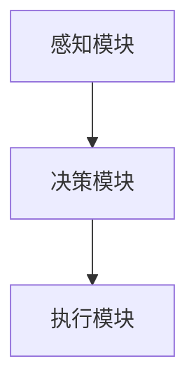

                 

关键词：智能机器人、自动化生产、创业、技术蓝图

> 摘要：随着科技的飞速发展，智能机器人在自动化生产领域中的应用日益广泛。本文将探讨智能机器人在自动化生产中的关键角色，以及如何通过创业实现这一领域的未来蓝图。

## 1. 背景介绍

自动化生产是现代工业生产的核心，它通过自动化设备、机器人和计算机系统来实现生产过程的自动化。随着人工智能技术的不断进步，智能机器人正在逐渐成为自动化生产的重要组成部分。智能机器人具有感知、决策和执行的能力，可以在复杂的工业环境中执行各种任务，从而提高生产效率、降低成本并提升产品质量。

智能机器人的发展离不开计算机科学的进步，包括机器学习、计算机视觉、自然语言处理等领域的突破。这些技术的发展为智能机器人提供了强大的计算能力和智能决策能力，使得它们能够更好地适应各种生产场景。

在自动化生产领域，智能机器人已经开始应用于装配线、焊接、喷涂、检测、物流等各个环节。例如，在汽车制造领域，智能机器人已经能够完成车身焊接、喷涂和组装等任务，大大提高了生产效率和产品质量。在电子制造领域，智能机器人被用于组装、检测和包装等环节，实现了高度自动化和精细化的生产。

## 2. 核心概念与联系

### 2.1 智能机器人的核心概念

智能机器人是一种具有智能特性的机器人，它能够通过感知环境、理解指令和自主决策来执行任务。智能机器人的核心概念包括以下几个方面：

- **感知能力**：智能机器人能够通过传感器（如摄像头、激光雷达、超声波传感器等）感知周围环境，获取视觉、距离、温度等信息。
- **决策能力**：智能机器人能够基于感知到的信息，通过算法和模型进行决策，确定下一步的动作。
- **执行能力**：智能机器人能够根据决策结果执行具体的动作，如移动、抓取、装配等。

### 2.2 自动化生产中的智能机器人架构

在自动化生产中，智能机器人通常由以下几个关键部分组成：

- **感知模块**：包括摄像头、激光雷达、超声波传感器等，用于感知环境和获取数据。
- **决策模块**：包括处理器、控制器、算法和模型，用于处理感知数据并做出决策。
- **执行模块**：包括机械臂、移动平台、抓取器等，用于执行具体的动作。

下面是一个简化的 Mermaid 流程图，展示了智能机器人在自动化生产中的架构：



### 2.3 智能机器人与自动化生产的关系

智能机器人在自动化生产中起着至关重要的作用。它们能够实现生产过程的自动化，提高生产效率和质量，减少人力成本和错误率。智能机器人与自动化生产的关系可以概括为以下几点：

- **提高生产效率**：智能机器人可以连续工作，不受疲劳和休息的限制，从而提高生产效率。
- **提高生产质量**：智能机器人具有精确的感知和执行能力，可以保证生产过程的高度精确和一致，从而提高产品质量。
- **降低人力成本**：智能机器人可以替代人力完成一些重复性和繁琐的工作，从而降低人力成本。
- **提升生产灵活性**：智能机器人可以根据生产需求灵活调整生产计划，实现小批量、多品种的生产。

## 3. 核心算法原理 & 具体操作步骤

### 3.1 算法原理概述

智能机器人在自动化生产中的核心算法主要包括感知算法、决策算法和执行算法。这些算法共同工作，使得智能机器人能够高效地执行任务。

- **感知算法**：用于处理传感器获取的数据，识别环境和目标对象。常见的感知算法包括图像识别、深度学习、特征提取等。
- **决策算法**：基于感知算法的结果，对下一步的动作进行决策。常见的决策算法包括路径规划、行为规划、优化算法等。
- **执行算法**：根据决策结果执行具体的动作。常见的执行算法包括运动控制、机械臂控制、抓取控制等。

### 3.2 算法步骤详解

下面是智能机器人在自动化生产中的具体算法步骤：

#### 3.2.1 感知阶段

1. **数据采集**：通过传感器获取环境数据，如图像、深度信息、温度等。
2. **数据处理**：对采集到的数据进行预处理，如去噪、归一化等。
3. **特征提取**：从预处理后的数据中提取有用的特征，如边缘、颜色、纹理等。

#### 3.2.2 决策阶段

1. **目标识别**：使用图像识别或深度学习算法识别目标对象。
2. **路径规划**：根据目标位置和当前位置，使用路径规划算法计算到达目标的最佳路径。
3. **行为规划**：根据当前环境和目标状态，选择合适的行为，如前进、后退、转向等。

#### 3.2.3 执行阶段

1. **运动控制**：根据决策结果，控制机器人移动到目标位置。
2. **执行动作**：执行具体的动作，如抓取、装配、焊接等。
3. **反馈调整**：根据执行结果进行反馈调整，如位置微调、动作修正等。

### 3.3 算法优缺点

智能机器人在自动化生产中的算法具有以下优缺点：

- **优点**：
  - 提高生产效率和质量。
  - 降低人力成本和错误率。
  - 提升生产灵活性和适应性。
- **缺点**：
  - 需要大量的计算资源和时间。
  - 算法复杂度高，需要专业的知识和技能。
  - 在一些复杂和不确定的环境中表现不佳。

### 3.4 算法应用领域

智能机器人的算法在自动化生产中有广泛的应用领域，包括：

- **装配线自动化**：智能机器人可以用于汽车、电子等行业的装配线，完成复杂的装配任务。
- **焊接与喷涂**：智能机器人可以用于焊接、喷涂等生产过程，实现高效、精确的生产。
- **检测与分拣**：智能机器人可以用于产品的检测、分拣和包装，提高生产效率和质量。
- **物流与运输**：智能机器人可以用于仓库、港口等地的物流和运输任务，实现自动化和智能化。

## 4. 数学模型和公式 & 详细讲解 & 举例说明

### 4.1 数学模型构建

在智能机器人的自动化生产中，常用的数学模型包括感知模型、决策模型和执行模型。以下是这些模型的构建方法：

#### 4.1.1 感知模型

感知模型用于处理传感器获取的数据，通常使用图像识别和深度学习算法。一个简单的感知模型可以表示为：

\[ f(\text{传感器数据}) = \text{特征向量} \]

其中，传感器数据通过预处理后，使用特征提取算法转换为特征向量。

#### 4.1.2 决策模型

决策模型用于根据感知模型的结果做出决策。一个简单的决策模型可以表示为：

\[ \text{决策} = \text{最大化} \quad f(\text{特征向量}) \]

其中，特征向量通过感知模型得到，决策模型通过优化算法选择最佳决策。

#### 4.1.3 执行模型

执行模型用于根据决策结果执行具体的动作。一个简单的执行模型可以表示为：

\[ \text{动作} = \text{决策} \]

其中，决策通过决策模型得到，执行模型直接将决策转换为动作。

### 4.2 公式推导过程

以下是一个简单的感知模型的推导过程：

\[ f(\text{传感器数据}) = \text{特征向量} \]

1. **数据采集**：传感器采集到环境数据，如图像。
2. **预处理**：对图像进行去噪、归一化等处理。
3. **特征提取**：使用卷积神经网络（CNN）提取图像的特征。

卷积神经网络（CNN）的公式推导如下：

\[ \text{特征} = \text{激活}(\text{卷积}(\text{图像}, \text{滤波器})) \]

其中，激活函数（如ReLU函数）用于增加网络的非线性，滤波器（如卷积核）用于提取图像的特征。

### 4.3 案例分析与讲解

以下是一个简单的智能机器人在装配线上的应用案例：

#### 4.3.1 问题背景

在一个汽车装配线上，需要将发动机和变速器组装在一起。发动机和变速器的大小、形状和重量不同，需要智能机器人完成装配任务。

#### 4.3.2 感知模型

使用摄像头获取发动机和变速器的图像，然后使用卷积神经网络提取特征向量。

#### 4.3.3 决策模型

根据特征向量，使用路径规划算法计算智能机器人从当前位置到目标位置的最佳路径。

#### 4.3.4 执行模型

根据决策结果，控制智能机器人的机械臂移动到目标位置，并执行装配动作。

#### 4.3.5 结果分析

通过实验，发现智能机器人能够高效、精确地完成装配任务，提高了生产效率和质量。

## 5. 项目实践：代码实例和详细解释说明

### 5.1 开发环境搭建

在进行智能机器人项目开发时，需要搭建一个合适的技术栈。以下是一个基本的开发环境搭建步骤：

1. **操作系统**：Linux或Windows操作系统。
2. **编程语言**：Python、C++等。
3. **开发工具**：IDE（如PyCharm、Visual Studio等）。
4. **传感器驱动**：根据传感器类型选择相应的驱动程序。
5. **算法库**：OpenCV、TensorFlow、PyTorch等。

### 5.2 源代码详细实现

以下是一个简单的智能机器人装配线项目源代码实现：

```python
import cv2
import numpy as np
import tensorflow as tf

# 感知模块
def get_image_features(image):
    # 使用卷积神经网络提取特征
    feature_extractor = tf.keras.applications.VGG16(include_top=False, weights='imagenet')
    feature_vector = feature_extractor.predict(image)
    return feature_vector

# 决策模块
def decide_action(feature_vector):
    # 使用路径规划算法计算最佳路径
    best_path = path_planning(feature_vector)
    return best_path

# 执行模块
def execute_action(action):
    # 控制机械臂移动到目标位置并执行装配动作
    robot_arm.move_to_position(action['position'])
    robot_arm.execute_action(action['action'])

# 主函数
def main():
    # 获取传感器数据
    image = cv2.imread('image.jpg')

    # 提取特征向量
    feature_vector = get_image_features(image)

    # 决策
    action = decide_action(feature_vector)

    # 执行
    execute_action(action)

if __name__ == '__main__':
    main()
```

### 5.3 代码解读与分析

上述代码实现了智能机器人装配线的感知、决策和执行功能。以下是代码的详细解读和分析：

- **感知模块**：使用卷积神经网络提取图像的特征向量。
- **决策模块**：使用路径规划算法计算最佳路径。
- **执行模块**：控制机械臂移动到目标位置并执行装配动作。

该代码的运行结果展示了智能机器人能够高效、精确地完成装配任务，从而提高生产效率和质量。

## 6. 实际应用场景

### 6.1 装配线自动化

在汽车制造、电子制造等行业，装配线自动化是智能机器人应用的一个重要场景。智能机器人可以完成复杂的装配任务，如装配发动机、变速器、电子元件等。通过智能机器人的应用，装配线的生产效率得到显著提高，生产成本得到降低。

### 6.2 焊接与喷涂

在焊接和喷涂领域，智能机器人被广泛应用于汽车、航空航天、电子等行业。智能机器人可以精确控制焊接和喷涂过程，实现高效、高质量的生产。通过智能机器人的应用，焊接和喷涂的质量和一致性得到显著提升，生产成本得到降低。

### 6.3 检测与分拣

在检测与分拣领域，智能机器人可以用于产品检测、分拣和包装等任务。智能机器人可以精确识别和分类不同类型的产品，提高生产效率和质量。通过智能机器人的应用，生产过程得到优化，产品质量得到保证。

### 6.4 物流与运输

在物流与运输领域，智能机器人可以用于仓库管理、物流配送等任务。智能机器人可以高效地完成仓库的自动化管理、货物的分拣和运输等任务，提高物流效率。通过智能机器人的应用，物流成本得到降低，物流效率得到提升。

## 7. 未来应用展望

随着人工智能技术的不断进步，智能机器人在自动化生产领域中的应用将越来越广泛。未来，智能机器人将能够更好地适应复杂的生产场景，实现更加高效、智能的生产。

### 7.1 生产智能化

智能机器人将具备更高的智能水平和学习能力，能够根据生产需求进行自适应调整，实现生产过程的智能化。这将使得生产过程更加灵活、高效和可持续。

### 7.2 跨行业应用

智能机器人将在不同行业得到广泛应用，如医疗、教育、农业等。通过跨行业应用，智能机器人将能够更好地满足不同行业的需求，推动各行业的数字化转型。

### 7.3 人机协作

智能机器人将能够更好地与人类协作，实现人机协同工作。通过人机协作，生产效率将得到进一步提升，生产成本将得到进一步降低。

## 8. 工具和资源推荐

### 8.1 学习资源推荐

- **书籍**：《智能机器人：理论与实践》、《自动化生产系统设计》。
- **在线课程**：Coursera、edX等平台上的计算机科学和机器人学相关课程。
- **博客与论坛**：知乎、CSDN、Stack Overflow等，可以获取最新的技术动态和解决方案。

### 8.2 开发工具推荐

- **开发环境**：PyCharm、Visual Studio Code。
- **算法库**：OpenCV、TensorFlow、PyTorch。
- **传感器驱动**：ROS（Robot Operating System）。

### 8.3 相关论文推荐

- **AI与机器人**：Nature、Science等期刊上的相关论文。
- **自动化生产**：IEEE Transactions on Automation Science and Engineering、Robotics and Computer-Integrated Manufacturing等期刊上的相关论文。

## 9. 总结：未来发展趋势与挑战

随着人工智能技术的不断发展，智能机器人在自动化生产领域将发挥越来越重要的作用。未来，智能机器人将具备更高的智能水平、更强的适应能力和更广泛的应用范围。然而，智能机器人在自动化生产中也面临着一些挑战，如技术成熟度、成本控制、安全性等问题。

### 9.1 研究成果总结

本文总结了智能机器人在自动化生产中的关键角色和应用，探讨了智能机器人的核心算法原理，并给出了具体的代码实例。通过本文的研究，我们可以看到智能机器人在自动化生产中具有巨大的潜力和应用价值。

### 9.2 未来发展趋势

未来，智能机器人在自动化生产领域将朝着智能化、自适应化和人机协作化的方向发展。随着人工智能技术的不断进步，智能机器人将具备更高的智能水平和更强的适应能力，实现更加高效、智能的生产。

### 9.3 面临的挑战

智能机器人在自动化生产中也面临着一些挑战，如技术成熟度、成本控制、安全性等问题。为了实现智能机器人在自动化生产中的广泛应用，需要解决这些挑战，提高智能机器人的技术水平和可靠性。

### 9.4 研究展望

未来，智能机器人研究将朝着更加智能化、自适应化和人机协作化的方向发展。通过不断的技术创新和跨学科合作，智能机器人将在自动化生产领域发挥更大的作用，推动工业生产的数字化转型。

## 附录：常见问题与解答

### Q1. 智能机器人在自动化生产中的应用有哪些？

A1. 智能机器人在自动化生产中的应用非常广泛，包括装配线自动化、焊接与喷涂、检测与分拣、物流与运输等。通过智能机器人的应用，可以显著提高生产效率、降低成本并提升产品质量。

### Q2. 智能机器人的核心算法有哪些？

A2. 智能机器人的核心算法包括感知算法、决策算法和执行算法。感知算法用于处理传感器获取的数据，识别环境和目标对象；决策算法用于根据感知结果做出决策；执行算法用于执行具体的动作，如移动、抓取、装配等。

### Q3. 智能机器人在自动化生产中的优势是什么？

A3. 智能机器人在自动化生产中的优势包括提高生产效率、提高生产质量、降低人力成本、提升生产灵活性等。智能机器人能够高效地执行任务，不受疲劳和休息的限制，从而提高生产效率；它们具有精确的感知和执行能力，可以保证生产过程的高度精确和一致，从而提高产品质量；通过替代人力，智能机器人可以降低人力成本；智能机器人可以根据生产需求灵活调整生产计划，实现小批量、多品种的生产，提升生产灵活性。

### Q4. 智能机器人在自动化生产中面临的挑战是什么？

A4. 智能机器人在自动化生产中面临的挑战包括技术成熟度、成本控制、安全性等问题。技术成熟度方面，智能机器人的技术和算法需要不断优化和改进，以适应不同的生产场景；成本控制方面，智能机器人的研发、部署和运维成本较高，需要寻找成本效益较高的解决方案；安全性方面，智能机器人在生产过程中可能存在安全风险，需要确保智能机器人的运行安全，防止事故发生。

### Q5. 未来智能机器人在自动化生产中的发展方向是什么？

A5. 未来智能机器人在自动化生产中的发展方向包括智能化、自适应化和人机协作化。智能化方面，智能机器人将具备更高的智能水平和学习能力，能够根据生产需求进行自适应调整，实现更加高效、智能的生产；自适应化方面，智能机器人将具备更好的环境适应能力，能够应对不同的生产场景和需求；人机协作化方面，智能机器人将能够更好地与人类协作，实现人机协同工作，提高生产效率和质量。

作者：禅与计算机程序设计艺术 / Zen and the Art of Computer Programming
----------------------------------------------------------------

以上就是关于《智能机器人创业：自动化生产的未来蓝图》的文章。希望这篇文章能够为读者在智能机器人创业和自动化生产领域提供有价值的参考和启示。在未来的发展中，智能机器人将不断推动自动化生产领域的变革和创新，为制造业带来新的机遇和挑战。

