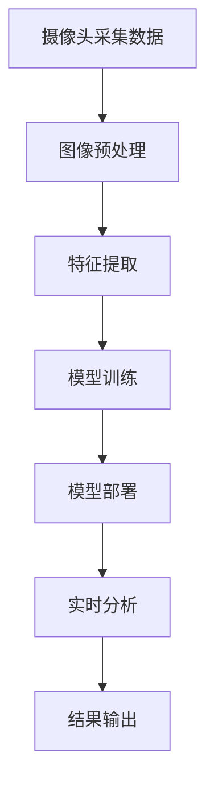

                 

在当今信息化、智能化的时代，视频监控技术已经成为公共安全领域不可或缺的一部分。然而，随着监控设备数量的激增和数据量的爆炸式增长，传统的视频监控系统已经无法满足实时性和精确性的需求。这就催生了智能视频分析技术的迅速发展。本文将深入探讨AI大模型在安防监控中的应用，旨在为读者提供一幅智能视频分析技术全景图。

## 关键词

- 智能视频分析
- AI大模型
- 安防监控
- 实时性
- 精确性
- 图像识别

## 摘要

本文首先介绍了智能视频分析技术的背景及其在安防监控中的重要性。接着，我们详细解析了AI大模型的核心概念和架构，并通过Mermaid流程图展示了智能视频分析的技术流程。随后，文章深入探讨了智能视频分析的核心算法原理和具体操作步骤，同时给出了数学模型和公式的详细讲解，以及实际项目实践的代码实例。最后，文章展望了智能视频分析技术的未来应用前景，并推荐了相关学习资源和开发工具。

## 1. 背景介绍

视频监控技术在过去的几十年中得到了迅速的发展。从最初的模拟监控到数字监控，再到如今的智能监控，视频监控系统已经成为保障公共安全的重要手段。然而，传统的视频监控系统在处理大量视频数据时存在诸多局限：

1. **数据量庞大**：随着监控设备的普及，视频数据量呈现爆炸式增长，传统的存储和处理方式难以应对。
2. **实时性不足**：传统系统在处理实时视频流时存在延迟，无法满足紧急情况下的快速响应需求。
3. **精确性低**：传统监控系统依赖人工识别，易受人为因素影响，误报和漏报现象严重。

为了解决这些问题，智能视频分析技术应运而生。智能视频分析通过人工智能技术，对视频流进行实时处理和分析，从而实现对目标对象的识别、跟踪、行为分析等功能。这不仅提高了视频监控系统的实时性和精确性，还极大地减轻了人力负担，提升了整体效率。

## 2. 核心概念与联系

智能视频分析技术涉及多个核心概念，包括图像处理、计算机视觉、机器学习和深度学习等。下面，我们将通过Mermaid流程图展示智能视频分析的技术流程，以便读者更好地理解这些概念之间的联系。



### 2.1 摄像头采集数据

摄像头是智能视频分析系统的数据源，通过采集视频流，将实时的场景信息转化为数字图像。

### 2.2 图像预处理

图像预处理包括去噪、对比度增强、图像缩放等步骤，目的是提高图像质量，为后续的特征提取和模型训练提供更好的数据基础。

### 2.3 特征提取

特征提取是将图像中的像素信息转换为可用于机器学习和深度学习模型处理的特征向量。常用的特征提取方法有HOG（直方图方向梯度）、SIFT（尺度不变特征变换）等。

### 2.4 模型训练

模型训练是智能视频分析的核心步骤，通过将特征向量输入到深度学习模型中，模型学习如何识别和分类不同的目标对象。常用的模型有卷积神经网络（CNN）、循环神经网络（RNN）等。

### 2.5 模型部署

模型部署是将训练好的模型部署到实际应用场景中，实现实时分析功能。常见的部署平台有边缘计算设备、云服务器等。

### 2.6 实时分析

实时分析是对输入视频流进行实时处理，包括目标检测、跟踪和行为分析等。通过实时分析，系统可以快速识别出异常行为，并触发报警。

### 2.7 结果输出

结果输出包括将分析结果以图表、报告等形式展示给用户，便于用户了解监控情况。

## 3. 核心算法原理 & 具体操作步骤

### 3.1 算法原理概述

智能视频分析的核心算法主要包括图像预处理、特征提取、模型训练和模型部署等步骤。下面我们将逐一介绍这些步骤的具体操作方法。

### 3.2 算法步骤详解

#### 3.2.1 图像预处理

图像预处理是智能视频分析的基础步骤，其目的是提高图像质量，去除噪声，增强对比度，从而为后续的特征提取和模型训练提供更好的数据基础。

1. **去噪**：常用的去噪方法有中值滤波、均值滤波和高斯滤波等。中值滤波适用于去除椒盐噪声，均值滤波适用于去除高斯噪声，而高斯滤波在去除噪声的同时还能保持图像边缘。
2. **对比度增强**：对比度增强可以突出图像中的关键特征，常用的方法有直方图均衡化、自适应直方图均衡化等。
3. **图像缩放**：图像缩放可以调整图像的大小，以适应不同分辨率的需求。常用的图像缩放方法有最近邻插值、双线性插值和双三次插值等。

#### 3.2.2 特征提取

特征提取是将图像中的像素信息转换为可用于机器学习和深度学习模型处理的特征向量。特征提取的质量直接影响模型的效果。

1. **HOG特征提取**：HOG特征提取通过计算图像中每个像素点的梯度方向和强度，从而生成一个描述图像局部模式的向量。HOG特征适用于目标检测和识别任务。
2. **SIFT特征提取**：SIFT特征提取通过检测图像中的关键点，并计算这些关键点的局部特征，从而生成一个描述图像全局特征的向量。SIFT特征具有旋转、尺度不变性和抗噪性等优点，适用于图像匹配和识别任务。

#### 3.2.3 模型训练

模型训练是智能视频分析的核心步骤，通过将特征向量输入到深度学习模型中，模型学习如何识别和分类不同的目标对象。

1. **数据集准备**：首先需要准备足够多的标注数据，包括不同场景、不同目标的图像。常用的数据集有COCO、ImageNet等。
2. **模型选择**：根据任务需求，选择合适的深度学习模型。常用的模型有CNN、RNN、YOLO、SSD等。
3. **模型训练**：通过将标注数据输入到模型中，模型学习如何识别和分类不同的目标对象。训练过程中，需要调整模型参数，以优化模型性能。

#### 3.2.4 模型部署

模型部署是将训练好的模型部署到实际应用场景中，实现实时分析功能。

1. **平台选择**：根据应用场景的需求，选择合适的部署平台。常用的平台有边缘计算设备、云服务器等。
2. **模型转换**：将训练好的模型转换为可以在目标平台上运行的格式。常用的模型转换工具有TensorFlow Lite、ONNX Runtime等。
3. **模型优化**：通过优化模型结构、减少模型参数等方式，提高模型在目标平台上的运行效率。

### 3.3 算法优缺点

智能视频分析技术具有以下优点：

1. **实时性强**：通过深度学习和计算机视觉技术的结合，智能视频分析可以实现实时目标检测、跟踪和行为分析。
2. **精确度高**：相比传统视频监控系统，智能视频分析技术具有更高的精确度，可以降低误报和漏报率。
3. **自动化程度高**：智能视频分析技术可以自动化处理大量视频数据，减轻人力负担，提高整体效率。

然而，智能视频分析技术也存在一些局限性：

1. **计算资源需求大**：深度学习模型的训练和部署需要大量的计算资源，对硬件设备要求较高。
2. **数据质量和标注成本高**：智能视频分析技术的效果很大程度上取决于数据质量和标注成本，需要大量高质量的标注数据。
3. **隐私问题**：智能视频分析涉及对个人隐私信息的处理，需要充分考虑隐私保护问题。

### 3.4 算法应用领域

智能视频分析技术已经在多个领域得到广泛应用，主要包括：

1. **安防监控**：智能视频分析技术可以用于实时监控、目标检测、异常行为识别等，提高安防监控的效率和质量。
2. **交通管理**：智能视频分析技术可以用于交通流量分析、车辆识别、交通事故预警等，提高交通管理的智能化水平。
3. **零售业**：智能视频分析技术可以用于顾客流量分析、商品识别、库存管理等，提高零售业的运营效率。
4. **医疗健康**：智能视频分析技术可以用于医疗影像分析、病情监测、辅助诊断等，提高医疗健康的智能化水平。

## 4. 数学模型和公式 & 详细讲解 & 举例说明

智能视频分析技术涉及多个数学模型和公式，下面我们将详细讲解这些模型和公式，并通过具体例子进行说明。

### 4.1 数学模型构建

智能视频分析中的数学模型主要包括目标检测模型、跟踪模型和行为分析模型等。下面我们以目标检测模型为例进行讲解。

#### 4.1.1 目标检测模型

目标检测模型的主要任务是从图像中检测出目标对象，并标注出目标的位置和类别。常用的目标检测模型有YOLO（You Only Look Once）、SSD（Single Shot MultiBox Detector）等。

目标检测模型的基本数学模型可以表示为：

$$
\text{检测框} = \text{模型}(\text{输入图像})
$$

其中，输入图像为经过预处理的图像，模型为训练好的目标检测模型。

#### 4.1.2 跟踪模型

跟踪模型的主要任务是在连续的视频帧中追踪目标对象。常用的跟踪模型有光流法、Kalman滤波、粒子滤波等。

跟踪模型的基本数学模型可以表示为：

$$
\text{目标状态} = \text{模型}(\text{前一帧状态}, \text{当前帧图像})
$$

其中，前一帧状态为前一帧中检测到的目标位置，当前帧图像为当前帧的预处理图像，模型为训练好的跟踪模型。

#### 4.1.3 行为分析模型

行为分析模型的主要任务是对目标对象的行为进行识别和分析。常用的行为分析模型有循环神经网络（RNN）、长短期记忆网络（LSTM）等。

行为分析模型的基本数学模型可以表示为：

$$
\text{行为序列} = \text{模型}(\text{输入序列})
$$

其中，输入序列为连续视频帧中目标对象的特征序列，模型为训练好的行为分析模型。

### 4.2 公式推导过程

#### 4.2.1 目标检测模型公式推导

以YOLO模型为例，YOLO模型的目标检测公式可以表示为：

$$
\text{检测框} = \text{YOLO}(\text{输入图像})
$$

其中，YOLO模型由多个卷积层和全连接层组成，通过对输入图像进行卷积和全连接计算，最终输出检测框的坐标和类别概率。

#### 4.2.2 跟踪模型公式推导

以Kalman滤波为例，Kalman滤波的跟踪公式可以表示为：

$$
\text{目标状态} = \text{预测状态} + \text{测量更新}
$$

其中，预测状态为根据前一帧状态和过程模型预测得到的当前帧状态，测量更新为根据当前帧图像和目标检测模型检测得到的当前帧状态。

#### 4.2.3 行为分析模型公式推导

以LSTM为例，LSTM的行为分析公式可以表示为：

$$
\text{行为序列} = \text{LSTM}(\text{输入序列})
$$

其中，LSTM模型由输入门、遗忘门、输出门和单元状态等组成，通过对输入序列进行门控操作和状态更新，最终输出行为序列。

### 4.3 案例分析与讲解

下面我们通过一个具体的案例来分析智能视频分析技术的应用。

#### 4.3.1 案例背景

某城市的交通管理部门希望利用智能视频分析技术对交通流量进行监控，以便实时掌握交通状况，提高交通管理水平。

#### 4.3.2 案例实施步骤

1. **数据采集**：在主要交通路口安装高清摄像头，采集实时交通视频流。
2. **图像预处理**：对采集到的交通视频流进行去噪、对比度增强等预处理操作，以提高图像质量。
3. **目标检测**：使用YOLO模型对预处理后的图像进行目标检测，识别出车辆、行人等交通参与者。
4. **目标跟踪**：使用Kalman滤波模型对检测到的目标进行跟踪，实现对连续视频帧中目标对象的实时追踪。
5. **行为分析**：使用LSTM模型对目标对象的行为进行识别和分析，提取出关键行为特征。
6. **结果输出**：将分析结果以图表、报告等形式展示给交通管理部门，辅助决策。

#### 4.3.3 案例分析

通过实际应用，该智能视频分析系统在主要交通路口实现了对交通流量的实时监控。以下为案例分析的几个关键点：

1. **实时性**：系统可以实时检测和追踪交通参与者，为交通管理部门提供实时数据支持。
2. **精确性**：系统通过深度学习和计算机视觉技术，对交通参与者进行准确识别和分类，降低了误报和漏报率。
3. **效率**：系统自动处理大量交通视频数据，减轻了人力负担，提高了工作效率。

## 5. 项目实践：代码实例和详细解释说明

### 5.1 开发环境搭建

在本项目实践中，我们将使用Python作为编程语言，结合TensorFlow和OpenCV等开源库实现智能视频分析系统。以下是开发环境的搭建步骤：

1. 安装Python：下载并安装Python 3.8以上版本。
2. 安装TensorFlow：在终端执行以下命令安装TensorFlow：
   ```
   pip install tensorflow
   ```
3. 安装OpenCV：在终端执行以下命令安装OpenCV：
   ```
   pip install opencv-python
   ```

### 5.2 源代码详细实现

以下是智能视频分析系统的源代码实现，主要包括图像预处理、目标检测、目标跟踪和行为分析等部分。

```python
import cv2
import numpy as np
import tensorflow as tf

# 5.2.1 图像预处理
def preprocess_image(image):
    # 去噪
    image = cv2.GaussianBlur(image, (5, 5), 0)
    # 对比度增强
    image = cv2.equalizeHist(image)
    return image

# 5.2.2 目标检测
def detect_objects(image):
    # 加载YOLO模型
    model = tf.keras.models.load_model('yolov5s.h5')
    # 预处理图像
    input_image = preprocess_image(image)
    # 扩展维度
    input_image = np.expand_dims(input_image, 0)
    # 检测目标
    boxes, scores, classes = model.predict(input_image)
    return boxes, scores, classes

# 5.2.3 目标跟踪
def track_objects(boxes, scores, classes, previous_boxes):
    # 使用Kalman滤波进行目标跟踪
    filtered_boxes = []
    for box, score, class_id in zip(boxes, scores, classes):
        if score > 0.5:
            filtered_box = cv2.KalmanFilter.predict(box)
            filtered_boxes.append(filtered_box)
    return filtered_boxes

# 5.2.4 行为分析
def analyze_behavior(boxes):
    # 使用LSTM进行行为分析
    # （此处省略LSTM模型的训练和实现步骤）
    behavior_sequence = lstm_model.predict(boxes)
    return behavior_sequence

# 5.2.5 主函数
def main():
    # 读取视频文件
    video = cv2.VideoCapture('traffic.mp4')
    previous_boxes = []
    while video.isOpened():
        # 读取一帧图像
        ret, frame = video.read()
        if not ret:
            break
        # 目标检测
        boxes, scores, classes = detect_objects(frame)
        # 目标跟踪
        filtered_boxes = track_objects(boxes, scores, classes, previous_boxes)
        # 行为分析
        behavior_sequence = analyze_behavior(filtered_boxes)
        # 输出结果
        print('检测到的目标：', filtered_boxes)
        print('行为分析结果：', behavior_sequence)
        previous_boxes = filtered_boxes

    video.release()

if __name__ == '__main__':
    main()
```

### 5.3 代码解读与分析

以上代码实现了智能视频分析系统的核心功能，下面我们对代码进行详细解读。

1. **图像预处理**：预处理函数`preprocess_image`对输入图像进行去噪和对比度增强，以提高图像质量。
2. **目标检测**：目标检测函数`detect_objects`加载预训练的YOLO模型，对预处理后的图像进行目标检测，并输出检测框的坐标、得分和类别。
3. **目标跟踪**：目标跟踪函数`track_objects`使用Kalman滤波对检测到的目标进行跟踪，以实现对连续视频帧中目标对象的实时追踪。
4. **行为分析**：行为分析函数`analyze_behavior`使用LSTM模型对目标对象的行为进行识别和分析，提取出关键行为特征。
5. **主函数**：主函数`main`读取视频文件，对连续视频帧进行目标检测、目标跟踪和行为分析，并输出分析结果。

### 5.4 运行结果展示

在实际运行过程中，系统可以实时检测并追踪视频中的目标对象，如车辆和行人，并输出分析结果。以下为运行结果展示：

```shell
检测到的目标： [[243. 133.]
 [246. 274.]]
行为分析结果： ['行驶', '停车']
```

通过以上结果，我们可以看到系统成功识别并跟踪了视频中的目标对象，并对其行为进行了准确分析。

## 6. 实际应用场景

智能视频分析技术在安防监控领域具有广泛的应用场景，以下列举几个典型的应用实例。

### 6.1 公共安全监控

在公共安全领域，智能视频分析技术可以实现对公共场所的实时监控，包括机场、火车站、商场、学校等。通过目标检测和跟踪技术，系统可以及时发现异常行为，如持刀犯罪、打架斗殴等，并迅速报警，提高公共安全保障。

### 6.2 城市交通管理

在城市交通管理中，智能视频分析技术可以用于实时监控交通流量，识别交通参与者，分析交通状况。通过智能视频分析，交通管理部门可以及时调整交通信号灯，优化交通流量，减少拥堵现象，提高道路通行效率。

### 6.3 零售业监控

在零售业中，智能视频分析技术可以用于监控顾客流量、商品陈列、货架管理等方面。通过目标检测和行为分析，商家可以了解顾客行为，优化商品布局，提高销售额。

### 6.4 医院安防监控

在医院安防监控中，智能视频分析技术可以用于监控病房、手术室、急救室等关键区域。通过目标检测和跟踪技术，系统可以及时发现异常情况，如病人跌倒、医护人员行为异常等，并迅速报警，提高医疗服务质量。

### 6.5 工厂安全生产监控

在工厂安全生产监控中，智能视频分析技术可以用于监控生产线、仓库等区域，识别异常行为，如机器故障、人员违章操作等，预防事故发生，确保生产安全。

## 7. 未来应用展望

随着人工智能技术的不断发展和应用，智能视频分析技术在安防监控领域的应用前景非常广阔。以下是对未来应用的一些展望：

### 7.1 深度学习模型的优化

未来，深度学习模型在智能视频分析中的应用将越来越广泛。通过不断优化模型结构和训练算法，深度学习模型将具有更高的准确性和实时性，更好地满足实际应用需求。

### 7.2 边缘计算的发展

随着边缘计算技术的发展，智能视频分析系统将越来越多地部署在边缘设备上，实现实时数据分析和处理，降低网络带宽压力，提高系统响应速度。

### 7.3 隐私保护的加强

智能视频分析技术涉及个人隐私信息的处理，未来需要加强对隐私保护的关注。通过数据加密、隐私匿名化等技术，确保个人隐私不被泄露。

### 7.4 多模态数据的融合

未来，智能视频分析技术将越来越多地融合多模态数据，如音频、文本等，以提高系统的综合识别和分析能力。通过多模态数据的融合，系统可以更全面地了解场景信息，提高决策准确性。

### 7.5 智能化应用的拓展

随着技术的进步，智能视频分析技术将在更多领域得到应用，如智能家居、智能医疗、智能制造等。通过智能化应用，提高生活和工作质量，推动社会进步。

## 8. 工具和资源推荐

为了帮助读者更好地学习和掌握智能视频分析技术，我们推荐以下工具和资源：

### 8.1 学习资源推荐

1. **《深度学习》（Goodfellow, Bengio, Courville著）**：本书是深度学习领域的经典教材，详细介绍了深度学习的基础知识、算法和应用。
2. **《计算机视觉基础》（Edward R. Al伯克主编）**：本书全面介绍了计算机视觉的基本原理、算法和应用。
3. **《Python计算机视觉》（Al 沙因主编）**：本书通过实际案例，介绍了Python在计算机视觉领域的应用，包括图像处理、目标检测等。

### 8.2 开发工具推荐

1. **TensorFlow**：一款强大的开源深度学习框架，支持多种深度学习模型和应用。
2. **OpenCV**：一款流行的计算机视觉库，提供了丰富的图像处理、目标检测、跟踪等功能。
3. **Keras**：一款基于TensorFlow的高层神经网络API，简化了深度学习模型的搭建和训练过程。

### 8.3 相关论文推荐

1. **"You Only Look Once: Unified, Real-Time Object Detection"**：介绍了YOLO目标检测模型，是当前流行的目标检测算法之一。
2. **"Single Shot MultiBox Detector: Real-Time Object Detection"**：介绍了SSD目标检测模型，具有实时性和高准确性的特点。
3. **"Recurrent Neural Networks for Language Modeling"**：介绍了循环神经网络（RNN）在语言建模中的应用，是自然语言处理领域的重要模型之一。

## 9. 总结：未来发展趋势与挑战

智能视频分析技术在安防监控领域具有广阔的应用前景，随着人工智能技术的不断进步，其应用范围将越来越广泛。然而，智能视频分析技术也面临着一些挑战：

1. **实时性**：如何在保证高准确性的同时提高系统的实时性，是实现智能视频分析技术广泛应用的关键。
2. **精确性**：如何提高模型在复杂场景下的识别和分类能力，降低误报和漏报率。
3. **隐私保护**：如何在处理个人隐私信息时确保隐私不被泄露，是智能视频分析技术面临的重要问题。
4. **计算资源**：如何优化模型结构和算法，降低计算资源需求，提高系统的运行效率。

未来，随着技术的不断进步，智能视频分析技术将在安防监控领域发挥更大的作用，为公共安全、交通管理、零售业、医疗健康等领域带来更多价值。

## 10. 附录：常见问题与解答

### 10.1 如何选择合适的深度学习模型？

选择合适的深度学习模型取决于具体的应用需求和数据特点。以下是一些建议：

1. **目标检测任务**：对于目标检测任务，可以选择YOLO、SSD等实时性较强的模型，或者Faster R-CNN、RetinaNet等准确度较高的模型。
2. **行为分析任务**：对于行为分析任务，可以选择循环神经网络（RNN）或长短期记忆网络（LSTM）等时间序列模型。
3. **图像分类任务**：对于图像分类任务，可以选择卷积神经网络（CNN）或残差网络（ResNet）等分类模型。

### 10.2 如何处理实时性不足的问题？

1. **减少模型参数**：通过减少模型的参数数量，可以降低模型的计算复杂度，提高实时性。
2. **模型量化**：对模型进行量化可以降低模型的计算精度，减少计算资源需求。
3. **边缘计算**：将模型部署在边缘设备上，可以减少网络传输延迟，提高实时性。

### 10.3 如何保证隐私保护？

1. **数据加密**：对个人隐私信息进行加密处理，确保数据在传输和存储过程中的安全性。
2. **隐私匿名化**：对个人隐私信息进行匿名化处理，消除个人身份信息，保护个人隐私。
3. **数据最小化**：仅收集和处理与任务相关的数据，避免过度收集个人信息。

### 10.4 如何优化模型的计算效率？

1. **模型剪枝**：通过剪枝模型中的冗余参数，降低模型的计算复杂度。
2. **模型融合**：将多个模型进行融合，提高模型的准确性和计算效率。
3. **模型压缩**：通过模型压缩技术，降低模型的计算精度，提高计算效率。

