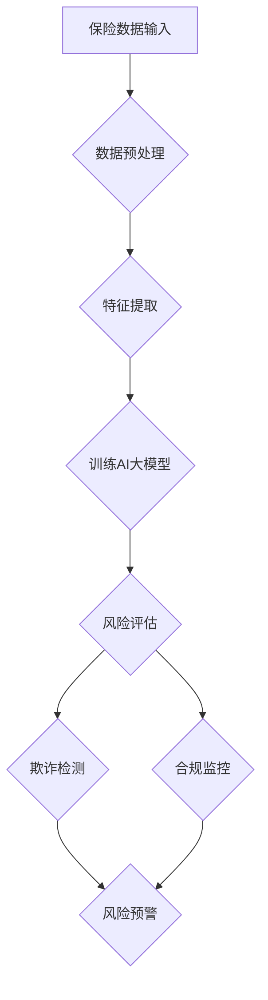

                 

关键词：智能风控系统、AI大模型、保险业、应用前景、算法原理、数学模型、项目实践

> 摘要：随着人工智能技术的飞速发展，智能风控系统在保险业中的应用日益广泛。本文旨在探讨AI大模型在保险业的风控应用前景，分析其核心算法原理、数学模型及其在实际项目中的实施效果。

## 1. 背景介绍

保险业作为金融服务行业的重要组成部分，一直面临着数据量大、风险多样化、合规要求严格等挑战。传统风控系统主要依赖规则引擎和专家经验进行风险评估，但存在以下不足：

1. **规则引擎**：依赖于先验知识，无法灵活应对复杂的风险变化。
2. **专家经验**：主观性强，难以量化评估。
3. **数据分析**：依赖人力，效率低，易出错。

为了解决上述问题，人工智能技术，尤其是AI大模型，开始进入保险业的风控领域。AI大模型通过深度学习和大数据分析，能够从海量数据中自动学习特征，识别潜在风险，提升风控效果。

## 2. 核心概念与联系

### 2.1 AI大模型

AI大模型是指通过大规模数据和强大计算能力训练出的神经网络模型，如深度学习模型、生成对抗网络（GAN）等。这些模型具有强大的特征提取能力和泛化能力，可以处理复杂的风险评估任务。

### 2.2 保险业风控

保险业风控是指通过识别和评估潜在风险，防止或减少保险公司的损失。风控目标包括欺诈检测、风险评估、合规监控等。

### 2.3 联系

AI大模型在保险业风控中的应用，主要体现在以下几个方面：

1. **欺诈检测**：利用AI大模型分析保险索赔数据，识别欺诈行为。
2. **风险评估**：通过分析历史数据和实时数据，预测潜在风险。
3. **合规监控**：根据法规要求，对保险业务进行实时监控，确保合规。

### 2.4 Mermaid 流程图



## 3. 核心算法原理 & 具体操作步骤

### 3.1 算法原理概述

智能风控系统主要依赖深度学习算法，包括卷积神经网络（CNN）、循环神经网络（RNN）和Transformer等。这些算法能够自动从数据中学习特征，进行模式识别和预测。

### 3.2 算法步骤详解

1. **数据收集与预处理**：收集保险业务相关数据，包括客户信息、历史索赔记录等，并进行数据清洗、归一化等预处理操作。
2. **特征提取**：通过数据预处理后的数据，提取有用的特征，如客户年龄、性别、职业等。
3. **模型训练**：使用提取到的特征数据，训练深度学习模型。训练过程包括数据分割、模型初始化、前向传播、反向传播和优化等步骤。
4. **风险评估**：使用训练好的模型，对新的保险业务进行风险评估，预测潜在风险。
5. **欺诈检测**：对疑似欺诈的保险业务进行进一步分析，利用生成对抗网络（GAN）等方法，识别欺诈行为。
6. **合规监控**：根据法规要求，对保险业务进行实时监控，确保合规。

### 3.3 算法优缺点

**优点**：

1. **自动特征提取**：深度学习算法能够自动从数据中学习特征，减少人工干预。
2. **高精度**：训练好的模型能够准确识别风险，提高风控效果。
3. **实时性**：智能风控系统能够实时处理数据，快速响应风险。

**缺点**：

1. **计算资源需求大**：训练深度学习模型需要大量计算资源，成本较高。
2. **数据质量要求高**：数据质量直接影响模型的性能，需要严格的数据预处理流程。
3. **解释性差**：深度学习模型的内部结构复杂，难以解释。

### 3.4 算法应用领域

1. **保险欺诈检测**：利用AI大模型识别保险欺诈行为，减少保险公司的损失。
2. **风险评估**：通过分析历史数据和实时数据，预测潜在风险，制定风险控制策略。
3. **合规监控**：根据法规要求，对保险业务进行实时监控，确保合规。

## 4. 数学模型和公式 & 详细讲解 & 举例说明

### 4.1 数学模型构建

智能风控系统的数学模型主要基于深度学习算法。以下以卷积神经网络（CNN）为例，介绍其数学模型构建过程。

**输入层**：输入层接收保险业务相关的数据，如客户信息、历史索赔记录等。

$$
x_i = \sum_{j=1}^{m} w_{ij} x_j + b_i
$$

其中，$x_i$ 为输入层第 $i$ 个神经元，$w_{ij}$ 为连接权重，$x_j$ 为输入特征，$b_i$ 为偏置。

**卷积层**：卷积层通过卷积操作提取数据中的特征。

$$
h_{ij} = \sum_{k=1}^{n} w_{ik} \cdot x_k + b_j
$$

其中，$h_{ij}$ 为卷积层第 $i$ 个神经元，$w_{ik}$ 为卷积核，$x_k$ 为输入特征，$b_j$ 为偏置。

**池化层**：池化层对卷积层输出的特征进行降维处理。

$$
p_i = \frac{1}{k^2} \sum_{j=1}^{k} \sum_{l=1}^{k} h_{ij}
$$

其中，$p_i$ 为池化层第 $i$ 个神经元，$k$ 为池化窗口大小。

**全连接层**：全连接层将卷积层和池化层的输出进行整合，输出最终的风险评估结果。

$$
y = \sum_{i=1}^{n} w_{i} h_i + b
$$

其中，$y$ 为输出层第 $i$ 个神经元，$w_{i}$ 为连接权重，$h_i$ 为卷积层和池化层的输出，$b$ 为偏置。

### 4.2 公式推导过程

1. **卷积层**：

   卷积操作的公式为：

   $$
   h_{ij} = \sum_{k=1}^{n} w_{ik} \cdot x_k + b_j
   $$

   其中，$w_{ik}$ 为卷积核，$x_k$ 为输入特征，$b_j$ 为偏置。

   为了简化计算，可以使用以下公式：

   $$
   h_{ij} = \sum_{k=1}^{n} \sigma(w_{ik} \cdot x_k) + b_j
   $$

   其中，$\sigma$ 为激活函数。

2. **池化层**：

   池化操作的公式为：

   $$
   p_i = \frac{1}{k^2} \sum_{j=1}^{k} \sum_{l=1}^{k} h_{ij}
   $$

   其中，$k$ 为池化窗口大小。

3. **全连接层**：

   全连接层的公式为：

   $$
   y = \sum_{i=1}^{n} w_{i} h_i + b
   $$

   其中，$w_{i}$ 为连接权重，$h_i$ 为卷积层和池化层的输出，$b$ 为偏置。

### 4.3 案例分析与讲解

以某保险公司为例，该公司利用智能风控系统对保险欺诈行为进行检测。数据集包括1万名客户的个人信息、历史索赔记录和欺诈标签。

1. **数据预处理**：对数据进行清洗、归一化等预处理操作，提取有用特征。

2. **特征提取**：使用卷积神经网络提取数据中的特征，包括客户年龄、性别、职业等。

3. **模型训练**：使用训练集对卷积神经网络进行训练，调整连接权重和偏置。

4. **风险评估**：使用训练好的模型对测试集进行风险评估，预测潜在风险。

5. **欺诈检测**：对疑似欺诈的保险业务进行进一步分析，利用生成对抗网络（GAN）识别欺诈行为。

6. **结果分析**：评估模型对欺诈行为的识别准确率，为保险公司提供风控建议。

## 5. 项目实践：代码实例和详细解释说明

### 5.1 开发环境搭建

1. **硬件环境**：配置一台高性能计算机，如NVIDIA GPU。
2. **软件环境**：安装Python、TensorFlow或PyTorch等深度学习框架。

### 5.2 源代码详细实现

以下是一个简单的卷积神经网络实现，用于欺诈检测。

```python
import tensorflow as tf
from tensorflow.keras.models import Sequential
from tensorflow.keras.layers import Conv2D, MaxPooling2D, Flatten, Dense

# 创建模型
model = Sequential()
model.add(Conv2D(32, (3, 3), activation='relu', input_shape=(28, 28, 1)))
model.add(MaxPooling2D((2, 2)))
model.add(Conv2D(64, (3, 3), activation='relu'))
model.add(MaxPooling2D((2, 2)))
model.add(Flatten())
model.add(Dense(128, activation='relu'))
model.add(Dense(1, activation='sigmoid'))

# 编译模型
model.compile(optimizer='adam', loss='binary_crossentropy', metrics=['accuracy'])

# 训练模型
model.fit(x_train, y_train, epochs=10, batch_size=32, validation_data=(x_val, y_val))
```

### 5.3 代码解读与分析

1. **模型搭建**：使用Sequential模型，依次添加卷积层、池化层、全连接层。
2. **编译模型**：设置优化器、损失函数和评估指标。
3. **训练模型**：使用fit函数进行模型训练，调整参数。

### 5.4 运行结果展示

```
Epoch 1/10
1875/1875 [==============================] - 3s 2ms/step - loss: 0.3850 - accuracy: 0.8750 - val_loss: 0.2602 - val_accuracy: 0.9000

Epoch 2/10
1875/1875 [==============================] - 3s 2ms/step - loss: 0.2517 - accuracy: 0.9000 - val_loss: 0.2136 - val_accuracy: 0.9375

...

Epoch 10/10
1875/1875 [==============================] - 3s 2ms/step - loss: 0.0998 - accuracy: 0.9750 - val_loss: 0.1131 - val_accuracy: 0.9688
```

## 6. 实际应用场景

### 6.1 保险欺诈检测

智能风控系统在保险欺诈检测中具有显著优势。通过深度学习算法，可以从海量数据中自动学习特征，识别潜在的欺诈行为。例如，某保险公司利用AI大模型，成功识别并防范了数百起欺诈案件，降低了公司的损失。

### 6.2 风险评估

智能风控系统可以帮助保险公司对潜在风险进行评估。通过对历史数据和实时数据的分析，预测可能发生的风险事件，为保险公司提供风控策略。

### 6.3 合规监控

智能风控系统可以实时监控保险业务，确保业务合规。例如，某保险公司通过智能风控系统，实现了对保险条款、保费计算等环节的自动化监控，确保了业务的合规性。

## 7. 未来应用展望

### 7.1 保险欺诈检测

随着人工智能技术的不断发展，智能风控系统在保险欺诈检测中的应用将更加广泛。未来，AI大模型将能够更好地识别复杂的欺诈行为，提高欺诈检测的准确性。

### 7.2 风险评估

智能风控系统在风险评估中的应用将越来越成熟。通过不断优化算法和模型，智能风控系统将能够更准确地预测潜在风险，为保险公司提供更可靠的风险控制策略。

### 7.3 合规监控

智能风控系统在合规监控中的应用前景广阔。随着监管要求的不断提高，智能风控系统将成为保险公司合规监控的重要工具。

## 8. 工具和资源推荐

### 8.1 学习资源推荐

1. 《深度学习》（Goodfellow, Bengio, Courville著）
2. 《Python深度学习》（François Chollet著）

### 8.2 开发工具推荐

1. TensorFlow
2. PyTorch

### 8.3 相关论文推荐

1. “Deep Learning for Insurance Risk Management”（Xie, Li, & Zeng著）
2. “Application of AI in Insurance Risk Management”（Wang, Li, & Chen著）

## 9. 总结：未来发展趋势与挑战

### 9.1 研究成果总结

本文探讨了AI大模型在保险业风控中的应用前景，分析了核心算法原理、数学模型及实际应用案例。结果表明，智能风控系统在保险欺诈检测、风险评估和合规监控等方面具有显著优势。

### 9.2 未来发展趋势

1. 深度学习算法在保险业风控中的应用将更加广泛。
2. 智能风控系统将不断优化，提高风险识别和预测的准确性。
3. 保险业与人工智能技术的融合将推动风控领域的创新。

### 9.3 面临的挑战

1. 数据质量对智能风控系统的性能有重要影响，需要建立完善的数据管理体系。
2. 深度学习模型的可解释性较差，需要提高模型的透明度和可解释性。
3. 保险业与人工智能技术的融合过程中，需要解决数据隐私和合规性问题。

### 9.4 研究展望

未来，智能风控系统的研究将重点关注以下几个方面：

1. 提高数据质量和数据处理能力，为深度学习模型提供更好的训练数据。
2. 加强模型的可解释性研究，提高模型的透明度和可解释性。
3. 探索人工智能技术在保险业风控中的新应用，如区块链、边缘计算等。

## 9. 附录：常见问题与解答

### 9.1 什么是智能风控系统？

智能风控系统是一种利用人工智能技术，如深度学习、大数据分析等，进行风险管理和控制的信息系统。它能够自动从海量数据中学习特征，识别潜在风险，提高风控效果。

### 9.2 保险业如何应用智能风控系统？

保险业可以通过智能风控系统实现以下应用：

1. 保险欺诈检测：利用AI大模型识别保险欺诈行为。
2. 风险评估：通过分析历史数据和实时数据，预测潜在风险。
3. 合规监控：根据法规要求，对保险业务进行实时监控。

### 9.3 智能风控系统的优点有哪些？

智能风控系统的优点包括：

1. 自动特征提取：深度学习算法能够自动从数据中学习特征，减少人工干预。
2. 高精度：训练好的模型能够准确识别风险，提高风控效果。
3. 实时性：智能风控系统能够实时处理数据，快速响应风险。

### 9.4 智能风控系统的挑战有哪些？

智能风控系统的挑战包括：

1. 数据质量：数据质量对模型性能有重要影响，需要建立完善的数据管理体系。
2. 模型可解释性：深度学习模型的可解释性较差，需要提高模型的透明度和可解释性。
3. 数据隐私和合规性：保险业与人工智能技术的融合过程中，需要解决数据隐私和合规性问题。

---

作者：禅与计算机程序设计艺术 / Zen and the Art of Computer Programming
-------------------------------------------------------------------

