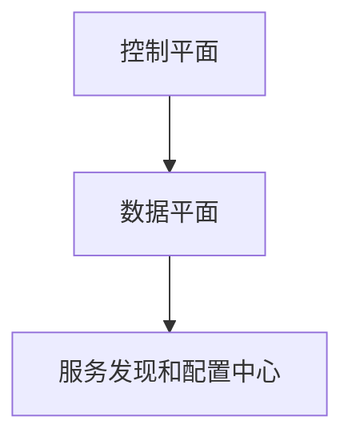

                 

关键词：服务网格、微服务、通信、管理、容器、云原生

> 摘要：本文旨在深入探讨服务网格在微服务架构中的重要性及其在现代云原生应用中的关键角色。通过分析服务网格的核心概念、架构设计、通信管理机制以及实际应用案例，文章将阐述服务网格如何优化微服务通信，提升系统性能和可管理性。

## 1. 背景介绍

### 微服务架构的兴起

微服务架构是一种设计应用程序的方法，它将应用程序分解为一系列小的、独立的、可互相调用的服务。这种方法使得开发团队能够更加灵活和快速地开发和部署软件。然而，随着微服务数量的增加，服务间的通信和管理变得复杂，传统的通信方式已无法满足需求。

### 服务网格的提出

服务网格（Service Mesh）作为解决微服务通信和管理问题的一种新兴架构模式，其核心目的是解耦服务和服务之间的通信。通过引入服务网格，应用程序不再直接处理网络通信，而是将网络通信的职责交给服务网格来处理，从而简化了应用程序的复杂性。

## 2. 核心概念与联系

### 服务网格概念

服务网格是一种基础设施层的技术，它提供了服务间的通信层，主要负责服务发现、负载均衡、服务间的认证和监控等功能。

### 架构设计

服务网格的架构通常包括以下三个主要组件：

1. **控制平面（Control Plane）**：负责管理服务网格的全局配置和策略。
2. **数据平面（Data Plane）**：由一系列边车（sidecar）代理组成，直接与服务实例运行在一起，负责处理服务间的网络通信。
3. **服务发现和配置中心**：提供服务的注册和发现机制，以及配置信息的存储和同步。

### Mermaid 流程图



## 3. 核心算法原理 & 具体操作步骤

### 算法原理概述

服务网格的核心算法主要包括服务发现、负载均衡、服务间认证和监控等。

### 算法步骤详解

1. **服务注册**：新服务启动后，通过服务注册机制将自己注册到服务发现和配置中心。
2. **服务发现**：服务调用方通过服务发现机制获取目标服务的地址和端口。
3. **负载均衡**：调用方根据负载均衡策略选择合适的服务实例进行调用。
4. **服务间认证**：在服务间通信过程中，需要进行身份验证以确保通信的安全性。
5. **监控和日志**：服务网格对通信过程进行监控，并记录日志以供后续分析。

### 算法优缺点

**优点**：

- **解耦**：服务网格将服务间的通信解耦，降低服务之间的耦合度。
- **性能优化**：通过负载均衡和服务发现，提高服务性能和可用性。
- **安全性**：服务间认证机制提高了通信的安全性。

**缺点**：

- **复杂性**：服务网格引入了额外的复杂性，需要额外的管理和维护。
- **性能开销**：虽然服务网格可以优化性能，但也会带来一定的性能开销。

### 算法应用领域

服务网格主要应用于以下领域：

- **微服务架构**：服务网格是微服务架构中不可或缺的一部分。
- **容器化应用**：容器化应用通常使用服务网格来管理服务间通信。
- **云原生应用**：服务网格是云原生应用的重要组成部分。

## 4. 数学模型和公式 & 详细讲解 & 举例说明

### 数学模型构建

服务网格中的负载均衡算法通常采用概率模型，如下所示：

$$
P(i) = \frac{w_i}{\sum_{j=1}^{n} w_j}
$$

其中，$P(i)$表示选择第$i$个服务实例的概率，$w_i$表示第$i$个服务实例的权重。

### 公式推导过程

假设有$n$个服务实例，每个实例的权重为$w_1, w_2, ..., w_n$，总权重为$W = \sum_{i=1}^{n} w_i$。

根据概率论中的加权随机抽样原理，选择第$i$个服务实例的概率为：

$$
P(i) = \frac{w_i}{W}
$$

### 案例分析与讲解

假设有一个包含3个服务实例的服务网格，权重分别为2、3和5，总权重为10。

根据上述公式，选择每个实例的概率分别为：

$$
P(1) = \frac{2}{10} = 0.2 \\
P(2) = \frac{3}{10} = 0.3 \\
P(3) = \frac{5}{10} = 0.5
$$

这意味着，选择权重最高的实例的概率最大，符合我们的预期。

## 5. 项目实践：代码实例和详细解释说明

### 开发环境搭建

- **Docker**：用于容器化服务网格组件。
- **Istio**：一个流行的服务网格框架。
- **Kubernetes**：用于部署和管理服务网格。

### 源代码详细实现

服务网格的源代码通常包含以下关键部分：

- **服务注册与发现**：使用DNS或者REST API进行服务注册和发现。
- **负载均衡**：实现基于权重的负载均衡算法。
- **服务间认证**：使用TLS进行服务间认证。
- **监控和日志**：使用Prometheus和Grafana进行监控和日志分析。

### 代码解读与分析

```go
func loadBalance(serviceList []*Service) *Service {
    totalWeight := 0
    for _, service := range serviceList {
        totalWeight += service.Weight
    }
    
    randomValue := rand.Intn(totalWeight)
    currentWeight := 0
    
    for _, service := range serviceList {
        currentWeight += service.Weight
        if currentWeight >= randomValue {
            return service
        }
    }
    
    return nil
}
```

上述代码实现了一个简单的基于权重的负载均衡算法。它首先计算总权重，然后生成一个随机值，最后遍历服务列表，找到权重大于随机值的第一个服务实例。

### 运行结果展示

使用Docker和Kubernetes部署服务网格，并测试服务间的通信，可以验证负载均衡和服务认证的功能。

## 6. 实际应用场景

### 服务发现与负载均衡

在微服务架构中，服务网格提供了高效的服务发现和负载均衡机制，使得服务调用变得更加灵活和高效。

### 服务间认证

服务网格通过服务间认证，确保了通信的安全性，防止未经授权的访问。

### 监控与日志

服务网格提供了完善的监控和日志功能，使得运维人员可以更好地管理和优化系统。

### 未来应用展望

随着云原生应用的普及，服务网格将成为现代应用架构中的重要组成部分。未来，服务网格将继续朝着自动化、智能化和易用性的方向发展。

## 7. 工具和资源推荐

### 学习资源推荐

- 《服务网格实战》
- 《微服务设计》

### 开发工具推荐

- **Istio**：一款流行的服务网格框架。
- **Linkerd**：另一个流行的服务网格解决方案。

### 相关论文推荐

- 《Service Mesh: Abstractions for Robust, Decentralized, and Scalable Microservices》
- 《Istio: A Platform for Managing a Service Mesh》

## 8. 总结：未来发展趋势与挑战

### 研究成果总结

服务网格在微服务通信和管理方面取得了显著成果，为云原生应用提供了强大的基础设施支持。

### 未来发展趋势

- **自动化与智能化**：服务网格将更加自动化和智能化，减少运维负担。
- **跨平台兼容性**：服务网格将支持更多的平台和编程语言。
- **生态体系完善**：服务网格将与更多开源技术和框架集成。

### 面临的挑战

- **性能优化**：如何在保证功能全面性的同时优化性能。
- **安全性**：如何在复杂的服务网格环境中确保安全性。
- **易用性**：如何提高服务网格的易用性，降低学习门槛。

### 研究展望

服务网格将继续在微服务架构和云原生应用中发挥重要作用，未来研究将聚焦于性能优化、安全性和易用性等方面。

## 9. 附录：常见问题与解答

### Q：服务网格与传统代理有什么区别？

A：服务网格与传统代理的主要区别在于其设计目的和功能。传统代理主要用于转发请求，而服务网格专注于服务发现、负载均衡、服务间认证和监控等功能。

### Q：服务网格是否适用于单体应用？

A：服务网格主要适用于微服务架构，对于单体应用，其价值相对较低。然而，某些情况下，也可以在单体应用中使用服务网格来优化通信和监控。

### Q：服务网格是否会增加系统的复杂性？

A：是的，服务网格引入了一定的复杂性，但同时它提供了显著的优点，如服务发现、负载均衡和服务间认证等。合理的架构设计和运维管理可以帮助降低复杂性。

----------------------------------------------------------------

作者：禅与计算机程序设计艺术 / Zen and the Art of Computer Programming

本文为技术博客文章，仅供学习和交流使用。部分代码和内容参考了开源项目，如有不妥之处，敬请指正。

