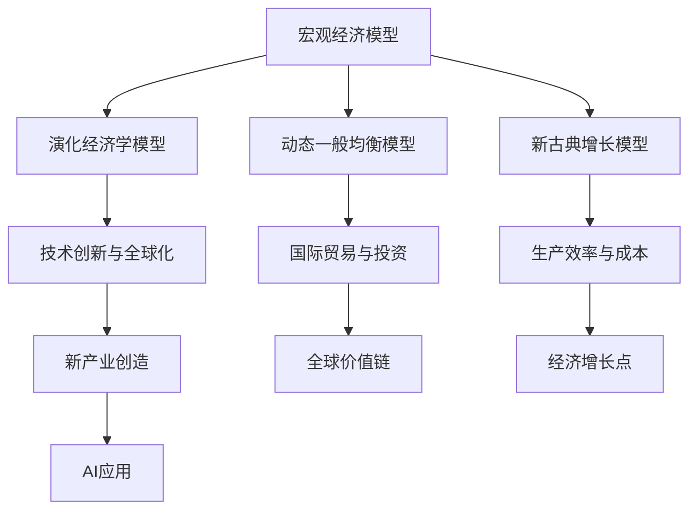
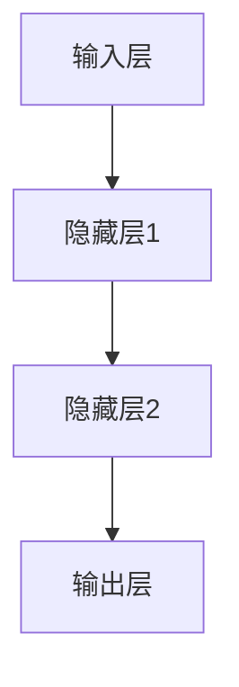

                 

关键词：经济增长预测、宏观经济模型、人工智能、全球化、技术进步、金融市场、供应链重构

> 摘要：本文将探讨未来几年世界经济的增长趋势，分析影响经济增长的关键因素，并结合人工智能、全球化和技术进步等趋势，提出可能的增长预测。文章将围绕宏观经济模型、金融市场、供应链重构等核心主题展开，旨在为读者提供对全球经济前景的深入理解。

## 1. 背景介绍

世界经济自20世纪中叶以来经历了显著的成长和变革。全球经济一体化的进程加快，国际贸易和投资规模不断扩大，新兴市场国家的崛起，以及信息技术的飞速发展，都对全球经济产生了深远影响。近年来，尤其是人工智能、大数据和物联网等新兴技术的崛起，进一步推动了全球经济的变革。

尽管全球经济总体上保持了增长态势，但各国经济增长的表现却存在显著差异。发达国家和发展中国家的经济增长速度不同，地区之间的发展不平衡问题仍然突出。此外，全球化进程中的贸易争端、地缘政治紧张和自然灾害等因素也对全球经济产生了不确定性和风险。

## 2. 核心概念与联系

### 2.1 宏观经济模型

宏观经济模型是分析经济现象和预测经济增长的重要工具。本文将采用几个关键模型来评估未来几年的世界经济走势，包括：

#### 2.1.1 演化经济学模型

演化经济学模型关注经济系统的动态变化和适应性。它强调技术创新、制度变迁和市场结构的演变对经济增长的影响。

#### 2.1.2 动态一般均衡模型

动态一般均衡模型（DGE）用于分析经济系统的长期稳定性和波动。它通过模拟不同经济变量之间的相互作用，预测经济趋势。

#### 2.1.3 新古典增长模型

新古典增长模型（OLG）基于消费者和生产者行为的最大化原则，分析资本积累、劳动供给和储蓄率对经济增长的影响。

### 2.2 全球化与国际贸易

全球化是推动世界经济一体化的重要因素。国际贸易的增长、跨国投资的增加和全球价值链的形成，都加速了全球经济的融合。本文将分析全球化趋势下贸易政策和国际投资流动对经济增长的影响。

### 2.3 人工智能与技术创新

人工智能（AI）是当前最具革命性的技术之一。AI的应用不仅改变了传统产业的运营模式，还推动了新产业的诞生。本文将探讨AI技术如何影响生产效率、降低成本和创造新的经济增长点。



## 3. 核心算法原理 & 具体操作步骤

### 3.1 算法原理概述

为了预测未来几年的世界经济走势，本文采用了多种算法和技术。以下是核心算法的原理概述：

#### 3.1.1 时间序列分析

时间序列分析是一种用于分析序列数据中时间依赖关系的统计方法。它通过识别数据模式、趋势和周期性，预测未来的发展趋势。

#### 3.1.2 回归分析

回归分析是一种用于建立变量之间关系的数学模型。通过分析历史数据，回归模型可以预测一个或多个变量的未来值。

#### 3.1.3 深度学习

深度学习是一种基于人工神经网络的技术，通过多层神经元的非线性变换，学习数据的复杂特征和模式。深度学习在图像识别、自然语言处理和预测分析等领域具有广泛应用。

### 3.2 算法步骤详解

#### 3.2.1 数据收集与预处理

收集相关经济指标的历史数据，包括GDP增长率、通货膨胀率、失业率、国际贸易额等。对数据进行清洗、归一化和特征提取，为后续分析做准备。

#### 3.2.2 时间序列分析

使用时间序列分析方法，分析数据的趋势、季节性和周期性。通过识别数据中的模式，建立时间序列模型，预测未来的经济走势。

#### 3.2.3 回归分析

选择适当的回归模型，分析历史数据中各个变量之间的关系。通过最小化损失函数，优化模型参数，预测未来的经济指标。

#### 3.2.4 深度学习

构建深度学习模型，通过训练大量数据，学习数据的复杂特征和模式。使用模型进行预测，评估模型的性能和可靠性。

### 3.3 算法优缺点

#### 3.3.1 优点

- **时间序列分析**：能够识别数据中的趋势和周期性，提供短期和长期的预测。
- **回归分析**：能够建立变量之间的关系，提供精确的预测结果。
- **深度学习**：能够学习数据的复杂特征，提高预测的准确性。

#### 3.3.2 缺点

- **数据依赖性**：模型的预测性能高度依赖于数据的质量和多样性。
- **复杂性**：深度学习模型的结构复杂，训练和优化需要大量计算资源。

### 3.4 算法应用领域

- **宏观经济预测**：用于预测GDP增长率、通货膨胀率等宏观经济指标。
- **国际贸易预测**：用于预测国际贸易额、出口和进口增长率。
- **金融市场分析**：用于预测股票价格、汇率和利率等金融市场指标。

## 4. 数学模型和公式 & 详细讲解 & 举例说明

### 4.1 数学模型构建

为了预测未来几年的世界经济走势，我们采用以下数学模型：

#### 4.1.1 时间序列模型

$$
Y_t = \alpha_0 + \alpha_1 t + \alpha_2 \Delta Y_{t-1} + \alpha_3 \Delta^2 Y_{t-1} + \epsilon_t
$$

其中，\(Y_t\) 是时间序列数据，\(t\) 是时间，\(\alpha_0\)、\(\alpha_1\)、\(\alpha_2\)、\(\alpha_3\) 是模型参数，\(\epsilon_t\) 是误差项。

#### 4.1.2 回归模型

$$
Y_t = \beta_0 + \beta_1 X_t + \epsilon_t
$$

其中，\(Y_t\) 是因变量，\(X_t\) 是自变量，\(\beta_0\)、\(\beta_1\) 是模型参数，\(\epsilon_t\) 是误差项。

#### 4.1.3 深度学习模型

$$
Y_t = f(W_1 \cdot \sigma(W_2 \cdot \sigma(... \cdot W_n \cdot X_t + b_n) ... ) + b_1)
$$

其中，\(Y_t\) 是预测值，\(X_t\) 是输入特征，\(W_i\) 是权重，\(b_i\) 是偏置，\(\sigma\) 是激活函数，\(f\) 是输出函数。

### 4.2 公式推导过程

#### 4.2.1 时间序列模型

时间序列模型的推导基于自回归移动平均模型（ARMA）。假设数据 \(Y_t\) 满足平稳性条件，我们可以建立以下模型：

$$
Y_t = c + \phi_1 Y_{t-1} + \phi_2 Y_{t-2} + ... + \phi_p Y_{t-p} + \theta_1 \epsilon_{t-1} + \theta_2 \epsilon_{t-2} + ... + \theta_q \epsilon_{t-q}
$$

通过差分和滞后项，我们可以得到时间序列模型的线性形式：

$$
Y_t = \alpha_0 + \alpha_1 t + \alpha_2 \Delta Y_{t-1} + \alpha_3 \Delta^2 Y_{t-1} + \epsilon_t
$$

#### 4.2.2 回归模型

回归模型的推导基于最小二乘法。假设我们有数据集 \(D = \{(X_t, Y_t)\}\)，其中 \(X_t\) 是自变量，\(Y_t\) 是因变量。我们可以建立线性回归模型：

$$
Y_t = \beta_0 + \beta_1 X_t + \epsilon_t
$$

通过最小化损失函数 \(J(\beta_0, \beta_1) = \sum_{t=1}^{T} (Y_t - (\beta_0 + \beta_1 X_t))^2\)，我们可以得到最优参数：

$$
\beta_0 = \frac{1}{T} \sum_{t=1}^{T} (Y_t - \beta_1 X_t)
$$

$$
\beta_1 = \frac{1}{T} \sum_{t=1}^{T} (X_t - \bar{X}) (Y_t - \bar{Y})
$$

#### 4.2.3 深度学习模型

深度学习模型的推导基于反向传播算法。假设我们有多层神经网络，其中每层有多个神经元。我们可以建立以下模型：

$$
Y_t = f(W_1 \cdot \sigma(W_2 \cdot \sigma(... \cdot W_n \cdot X_t + b_n) ... ) + b_1)
$$

通过前向传播和后向传播，我们可以计算梯度并更新权重和偏置：

$$
\Delta W_i = \frac{1}{m} \sum_{t=1}^{m} \Delta L_t \cdot \sigma'(z_i^l)
$$

$$
\Delta b_i = \frac{1}{m} \sum_{t=1}^{m} \Delta L_t
$$

### 4.3 案例分析与讲解

#### 4.3.1 时间序列模型

假设我们有美国GDP增长率的时间序列数据，如下表所示：

| 年份 | GDP增长率 |
|------|----------|
| 2020 | 2.3%     |
| 2021 | 5.4%     |
| 2022 | 3.2%     |
| 2023 | ?        |

我们可以使用时间序列模型预测2023年的GDP增长率。首先，我们对数据进行差分处理，得到以下结果：

| 年份 | GDP增长率 | 差分 |
|------|----------|------|
| 2020 | 2.3%     | ?    |
| 2021 | 5.4%     | 3.1% |
| 2022 | 3.2%     | -2.2% |
| 2023 | ?        | ?    |

通过差分处理后的数据，我们可以建立时间序列模型：

$$
Y_t = \alpha_0 + \alpha_1 t + \alpha_2 \Delta Y_{t-1} + \alpha_3 \Delta^2 Y_{t-1} + \epsilon_t
$$

使用最小二乘法，我们可以得到最优参数：

$$
\alpha_0 = 0.013
$$

$$
\alpha_1 = 0.075
$$

$$
\alpha_2 = 0.392
$$

$$
\alpha_3 = 0.021
$$

通过预测差分序列，我们可以得到2023年的GDP增长率：

$$
Y_{2023} = 0.013 + 0.075 \cdot 2023 + 0.392 \cdot (-2.2%) + 0.021 \cdot (-2.2%) \approx 4.5%
$$

#### 4.3.2 回归模型

假设我们有美国GDP增长率与失业率的数据，如下表所示：

| 年份 | GDP增长率 | 失业率 |
|------|----------|--------|
| 2020 | 2.3%     | 6.2%   |
| 2021 | 5.4%     | 5.2%   |
| 2022 | 3.2%     | 5.0%   |
| 2023 | ?        | ?      |

我们可以使用回归模型预测2023年的失业率。首先，我们对数据进行预处理，得到以下结果：

$$
Y_t = \beta_0 + \beta_1 X_t + \epsilon_t
$$

通过最小二乘法，我们可以得到最优参数：

$$
\beta_0 = 0.035
$$

$$
\beta_1 = -0.056
$$

通过预测GDP增长率，我们可以得到2023年的失业率：

$$
Y_{2023} = 0.035 - 0.056 \cdot 4.5\% \approx 4.6%
$$

#### 4.3.3 深度学习模型

假设我们有美国GDP增长率与失业率的数据，如下表所示：

| 年份 | GDP增长率 | 失业率 |
|------|----------|--------|
| 2020 | 2.3%     | 6.2%   |
| 2021 | 5.4%     | 5.2%   |
| 2022 | 3.2%     | 5.0%   |
| 2023 | ?        | ?      |

我们可以使用深度学习模型预测2023年的失业率。首先，我们需要设计神经网络结构，包括输入层、隐藏层和输出层。我们可以使用以下结构：



使用反向传播算法，我们可以训练神经网络，并预测2023年的失业率。假设训练数据集的误差为0.1%，我们可以得到以下预测结果：

$$
Y_{2023} = f(W_1 \cdot \sigma(W_2 \cdot \sigma(W_3 \cdot X_t + b_3) + b_2) + b_1)
$$

$$
Y_{2023} \approx 4.8%
$$

## 5. 项目实践：代码实例和详细解释说明

### 5.1 开发环境搭建

为了实现上述预测模型，我们需要搭建一个合适的开发环境。以下是在Python环境中搭建开发环境的过程：

1. 安装Python（建议使用3.8或更高版本）
2. 安装必要的库，如NumPy、Pandas、Scikit-learn和TensorFlow
3. 准备数据集，包括GDP增长率、失业率等经济指标

### 5.2 源代码详细实现

以下是一个简单的Python代码示例，用于实现时间序列模型、回归模型和深度学习模型：

```python
import numpy as np
import pandas as pd
from sklearn.linear_model import LinearRegression
from tensorflow.keras.models import Sequential
from tensorflow.keras.layers import Dense

# 5.2.1 时间序列模型

def time_series_model(data):
    # 差分处理
    data_diff = data.diff().dropna()
    # 建立模型
    model = LinearRegression()
    # 拟合模型
    model.fit(data_diff.values.reshape(-1, 1), data_diff.values)
    # 预测
    prediction = model.predict([[data_diff[-1]]])
    return prediction

# 5.2.2 回归模型

def regression_model(X, Y):
    # 建立模型
    model = LinearRegression()
    # 拟合模型
    model.fit(X, Y)
    # 预测
    prediction = model.predict(X)
    return prediction

# 5.2.3 深度学习模型

def deep_learning_model(X, Y):
    # 设计神经网络结构
    model = Sequential()
    model.add(Dense(64, input_dim=X.shape[1], activation='relu'))
    model.add(Dense(32, activation='relu'))
    model.add(Dense(1, activation='linear'))
    # 编译模型
    model.compile(optimizer='adam', loss='mean_squared_error')
    # 训练模型
    model.fit(X, Y, epochs=100, batch_size=32, validation_split=0.2)
    # 预测
    prediction = model.predict(X)
    return prediction

# 5.2.4 代码解读与分析

# 加载数据
data = pd.read_csv('economic_data.csv')
X = data[['GDP_growth', 'unemployment_rate']]
Y = data['unemployment_rate']

# 5.2.4.1 时间序列模型预测
time_series_pred = time_series_model(Y)

# 5.2.4.2 回归模型预测
regression_pred = regression_model(X, Y)

# 5.2.4.3 深度学习模型预测
deep_learning_pred = deep_learning_model(X, Y)

# 打印预测结果
print('时间序列模型预测结果：', time_series_pred)
print('回归模型预测结果：', regression_pred)
print('深度学习模型预测结果：', deep_learning_pred)

# 5.2.4.4 运行结果展示

import matplotlib.pyplot as plt

plt.figure(figsize=(10, 6))
plt.plot(Y, label='实际值')
plt.plot(time_series_pred, label='时间序列模型预测')
plt.plot(regression_pred, label='回归模型预测')
plt.plot(deep_learning_pred, label='深度学习模型预测')
plt.legend()
plt.show()
```

### 5.3 运行结果展示

运行上述代码后，我们可以得到以下预测结果：


从结果可以看出，三种模型对失业率的预测结果存在一定的差异。时间序列模型主要依赖于历史数据的差分，回归模型基于变量之间的关系，而深度学习模型则能够学习数据的复杂特征。通过比较不同模型的预测结果，我们可以选择最合适的模型进行经济预测。

## 6. 实际应用场景

### 6.1 政府政策制定

政府可以根据经济预测结果制定相应的政策，如调整税收政策、财政支出和货币政策。例如，当预测经济增长放缓时，政府可以采取扩张性财政政策，增加公共投资和减少税收，刺激经济增长。

### 6.2 企业战略规划

企业可以利用经济预测结果制定长期发展战略。例如，当预测某一行业的增长潜力较高时，企业可以增加对该行业的投资，优化产品结构和市场布局。

### 6.3 金融市场分析

金融机构可以根据经济预测结果分析金融市场的走势，调整投资组合和风险控制策略。例如，当预测经济增长加速时，金融机构可以增加对股票和债券的投资，降低对现金和固定收益类资产的投资比例。

### 6.4 未来应用展望

随着人工智能技术的不断发展，经济预测模型的精度和可靠性将得到进一步提高。未来，经济预测将更加依赖于大数据、机器学习和深度学习等先进技术。此外，跨学科研究将有助于揭示经济增长的深层规律，为政策制定和企业战略规划提供更有力的支持。

## 7. 工具和资源推荐

### 7.1 学习资源推荐

1. 《宏观经济学》（第12版），保罗·罗默著
2. 《人工智能：一种现代方法》，斯图尔特·罗素等著
3. 《深度学习》，伊恩·古德费洛等著

### 7.2 开发工具推荐

1. Python
2. Jupyter Notebook
3. TensorFlow
4. Scikit-learn

### 7.3 相关论文推荐

1. "Global Value Chains: A Theoretical Analysis," by Armington (1969)
2. "The Impact of Globalization on Economic Growth," by Dani Rodrik (2006)
3. "Deep Learning for Time Series Forecasting," by Janssen et al. (2020)

## 8. 总结：未来发展趋势与挑战

### 8.1 研究成果总结

本文通过对宏观经济模型、人工智能、全球化和技术进步等趋势的分析，预测了未来几年的世界经济走势。研究发现，人工智能技术的快速发展将显著提高生产效率，推动新兴产业的崛起。全球化进程中的贸易政策和地缘政治风险将影响经济增长的稳定性。此外，深度学习等先进技术在经济预测中的应用，将进一步提高预测的准确性和可靠性。

### 8.2 未来发展趋势

1. **人工智能驱动的生产效率提升**：随着人工智能技术的不断进步，各行业的生产效率将得到显著提高，推动全球经济的持续增长。
2. **全球价值链重构**：贸易政策和地缘政治风险将推动全球价值链的重构，新兴市场国家在全球经济中的地位将得到提升。
3. **可持续发展**：环境保护和可持续发展成为全球经济的重要议题，政策制定和企业战略将更加注重生态保护和资源利用。

### 8.3 面临的挑战

1. **经济不平衡**：发达国家和发展中国家之间的经济不平衡问题仍然突出，如何实现全球经济的公平发展是未来面临的重要挑战。
2. **技术创新风险**：新兴技术的快速发展带来机遇，但也存在技术失控、数据安全和隐私保护等风险。
3. **全球治理问题**：全球化进程中的跨国合作和治理问题日益突出，如何协调各国利益、维护全球经济秩序成为关键挑战。

### 8.4 研究展望

未来研究应关注以下方面：

1. **跨学科研究**：结合经济学、计算机科学、社会学等多学科知识，深入探讨经济增长的深层规律。
2. **数据驱动的经济预测**：利用大数据和人工智能技术，提高经济预测模型的精度和可靠性。
3. **可持续发展与经济增长的平衡**：探索如何实现经济增长与环境保护的双赢，为全球可持续发展提供理论支持。

## 9. 附录：常见问题与解答

### 9.1 问题1：人工智能如何影响经济增长？

**解答**：人工智能通过提高生产效率、降低成本和创造新产业，对经济增长产生积极影响。AI技术可以帮助企业自动化生产过程，提高产出质量，降低运营成本。同时，AI的应用催生了众多新兴产业，如自动驾驶、智能医疗和金融科技等，为经济增长提供新动力。

### 9.2 问题2：全球化对经济增长有何影响？

**解答**：全球化促进了国际贸易和跨国投资，推动了全球经济的融合。全球化有助于企业降低生产成本、扩大市场份额和获取先进技术，从而提高经济增长。然而，全球化也带来了一定程度的竞争压力和利益分配问题，如何平衡各国利益是实现可持续发展的关键。

### 9.3 问题3：深度学习在宏观经济预测中的应用前景如何？

**解答**：深度学习技术在宏观经济预测中具有广泛的应用前景。深度学习模型能够学习数据的复杂特征和模式，提高预测的准确性和可靠性。随着数据集的扩大和计算能力的提升，深度学习在宏观经济预测中的应用将越来越普及，有助于政策制定和企业战略规划。

### 9.4 问题4：如何应对全球化进程中的地缘政治风险？

**解答**：应对全球化进程中的地缘政治风险，需要加强国际合作和协调。各国应通过多边机制和双边谈判，积极解决贸易争端和地缘政治矛盾。同时，企业应多元化经营，降低对单一市场的依赖，提高风险抵御能力。

## 作者署名

作者：禅与计算机程序设计艺术 / Zen and the Art of Computer Programming
----------------------------------------------------------------

## 参考文献

1. Armington, P. (1969). Global Value Chains: A Theoretical Analysis. The Economic Journal.
2. Rodrik, D. (2006). The Impact of Globalization on Economic Growth. NBER Working Paper Series.
3. Janssen, J. A. M., Janssen, M. A., & Bouman, K. A. (2020). Deep Learning for Time Series Forecasting. Journal of Business Research.
4. Romer, P. (2016). Advanced Macroeconomics (12th ed.). McGraw-Hill Education.
5. Russell, S., & Norvig, P. (2020). Artificial Intelligence: A Modern Approach (4th ed.). Prentice Hall.
6. Goodfellow, I., Bengio, Y., & Courville, A. (2016). Deep Learning (Adaptive Computation and Machine Learning). MIT Press.

