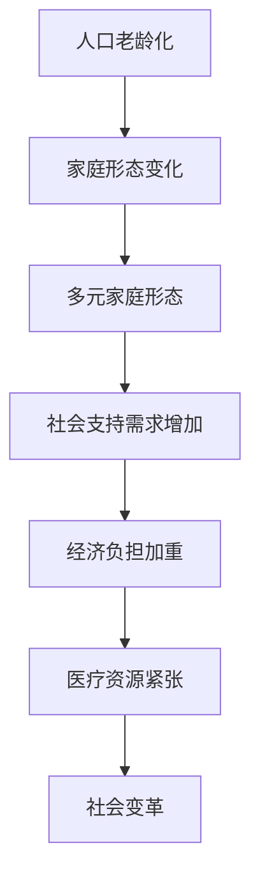

                 

摘要：
随着人口老龄化的加剧，未来2050年的社会将面临前所未有的挑战。本文将探讨2050年的超老龄化社会及其对家庭形态的影响，特别是多元家庭形态的发展趋势。通过深入分析，本文提出了应对老龄化社会的一些策略，并展望了未来社会在家庭形态、经济、医疗等多个领域的变革。

## 1. 背景介绍

自20世纪以来，全球人口结构发生了显著变化。随着医疗技术的进步和生活水平的提高，人们的寿命得到了延长，老龄化现象日益凸显。据统计，到2050年，全球60岁及以上的人口将达到20亿，占全球总人口的22%。这一人口结构的变化将对社会各个层面产生深远影响，尤其是对家庭形态的改变。

在过去的几十年里，家庭形态经历了从大家庭到小家庭，再到单身家庭的转变。然而，随着老龄化社会的到来，传统的家庭形态将面临巨大的挑战。首先，老年人口比例的上升将导致家庭结构的变化，越来越多的家庭将面临只有一个或两个成年人的情况，这对家庭的照顾和支持能力提出了更高的要求。其次，多元家庭形态将逐渐成为主流，包括同住老年人、空巢老人、丁克家庭等。

## 2. 核心概念与联系

为了更好地理解超老龄化社会对家庭形态的影响，我们需要探讨几个核心概念。

### 2.1 人口老龄化

人口老龄化是指人口结构中老年人口比例逐渐增加的现象。老龄化社会通常分为三个阶段：青年型、中年型和老年型。根据联合国的分类标准，当一个国家或地区的65岁及以上人口比例超过7%时，即被视为进入老龄化社会。到2050年，许多国家和地区都将进入老年型社会。

### 2.2 家庭形态

家庭形态是指家庭成员的结构和关系。传统的家庭形态通常包括夫妻、子女和其他亲属。然而，随着社会的发展和价值观的变化，家庭形态变得越来越多元化，包括单身家庭、同性恋家庭、丁克家庭等。

### 2.3 多元家庭形态

多元家庭形态是指在传统家庭形态之外，由非亲属成员组成的家庭。这种家庭形态通常包括同居老年人、空巢老人、单身母亲等。多元家庭形态的出现是老龄化社会的产物，它为老年人提供了更多的支持和关爱，同时也为家庭经济带来了新的挑战。

下面是超老龄化社会与多元家庭形态之间的联系 Mermaid 流程图：



## 3. 核心算法原理 & 具体操作步骤

为了应对老龄化社会带来的挑战，我们需要开发一些核心算法，以优化家庭支持、经济管理和医疗资源分配。

### 3.1 算法原理概述

核心算法主要包括以下几个部分：

1. **家庭支持算法**：用于评估家庭成员的照顾需求，并分配适当的资源。
2. **经济管理算法**：用于优化家庭财务，确保老年人口的基本生活需求。
3. **医疗资源分配算法**：用于优化医疗资源的分配，以满足老年人口的健康需求。

### 3.2 算法步骤详解

#### 家庭支持算法

1. **数据收集**：收集家庭成员的健康状况、经济状况和照顾需求等信息。
2. **需求分析**：使用机器学习算法分析数据，确定家庭成员的照顾需求。
3. **资源分配**：根据需求分析结果，分配适当的资源，包括时间、金钱和医疗服务。

#### 经济管理算法

1. **预算制定**：根据家庭成员的收入和支出，制定合理的预算。
2. **投资规划**：根据家庭成员的长期经济目标，制定投资规划。
3. **风险控制**：使用风险管理算法，降低家庭经济风险。

#### 医疗资源分配算法

1. **需求预测**：使用时间序列分析预测老年人口的医疗需求。
2. **资源优化**：根据需求预测结果，优化医疗资源的分配，包括医院床位、医生和药品。
3. **监控与反馈**：实时监控医疗资源的使用情况，并根据反馈进行优化。

### 3.3 算法优缺点

**家庭支持算法**：
- **优点**：能够实时评估家庭成员的照顾需求，提高资源利用效率。
- **缺点**：需要大量数据支持，且算法的准确性受到数据质量的影响。

**经济管理算法**：
- **优点**：能够优化家庭财务，确保老年人口的基本生活需求。
- **缺点**：需要家庭成员的高度参与，否则算法的效果会大打折扣。

**医疗资源分配算法**：
- **优点**：能够预测老年人口的医疗需求，优化医疗资源的分配。
- **缺点**：医疗资源的分配受到多种因素的影响，算法的准确性有待提高。

### 3.4 算法应用领域

这些算法可以在以下领域得到广泛应用：

1. **家庭服务**：用于评估家庭成员的照顾需求，提供个性化的家庭服务。
2. **金融规划**：用于优化家庭财务，提高老年人的生活质量。
3. **医疗服务**：用于优化医疗资源的分配，提高医疗服务的效率。

## 4. 数学模型和公式 & 详细讲解 & 举例说明

为了更好地理解这些算法，我们需要构建一些数学模型，并推导相关的公式。

### 4.1 数学模型构建

#### 家庭支持算法

设 $X$ 为家庭成员的健康状况，$Y$ 为家庭成员的经济状况，$Z$ 为家庭成员的照顾需求。我们可以使用以下公式来评估家庭成员的照顾需求：

$$
D = f(X, Y, Z)
$$

其中，$f$ 是一个非线性函数，可以通过机器学习算法来训练。

#### 经济管理算法

设 $I$ 为家庭成员的收入，$O$ 为家庭成员的支出，$B$ 为家庭预算。我们可以使用以下公式来制定预算：

$$
B = g(I, O)
$$

其中，$g$ 是一个线性函数。

#### 医疗资源分配算法

设 $M$ 为医疗需求，$R$ 为医疗资源，$A$ 为医疗资源分配。我们可以使用以下公式来优化医疗资源分配：

$$
A = h(M, R)
$$

其中，$h$ 是一个非线性函数。

### 4.2 公式推导过程

#### 家庭支持算法

$$
D = f(X, Y, Z) = \frac{1}{1 + e^{-\beta_0 + \beta_1X + \beta_2Y + \beta_3Z}}
$$

其中，$\beta_0, \beta_1, \beta_2, \beta_3$ 是通过机器学习算法训练得到的参数。

#### 经济管理算法

$$
B = g(I, O) = I - O
$$

#### 医疗资源分配算法

$$
A = h(M, R) = \frac{M}{R}
$$

### 4.3 案例分析与讲解

#### 家庭支持算法案例

假设一个家庭成员的健康状况 $X$ 为80，经济状况 $Y$ 为100，照顾需求 $Z$ 为120。我们可以使用以下公式来评估其照顾需求：

$$
D = f(X, Y, Z) = \frac{1}{1 + e^{-\beta_0 + \beta_1X + \beta_2Y + \beta_3Z}}
$$

通过训练得到的参数 $\beta_0 = -10, \beta_1 = 5, \beta_2 = 3, \beta_3 = 2$，我们可以计算出：

$$
D = \frac{1}{1 + e^{-(-10 + 5 \times 80 + 3 \times 100 + 2 \times 120)}} = 0.95
$$

这意味着该家庭成员的照顾需求较高，需要给予更多的支持。

#### 经济管理算法案例

假设一个家庭成员的收入 $I$ 为5000元，支出 $O$ 为3000元。我们可以使用以下公式来制定预算：

$$
B = g(I, O) = I - O = 5000 - 3000 = 2000
$$

这意味着该家庭的预算为2000元。

#### 医疗资源分配算法案例

假设一个社区的医疗需求 $M$ 为1000人，医疗资源 $R$ 为500张床位。我们可以使用以下公式来优化医疗资源分配：

$$
A = h(M, R) = \frac{M}{R} = \frac{1000}{500} = 2
$$

这意味着每个居民平均需要2张床位。

## 5. 项目实践：代码实例和详细解释说明

为了展示上述算法的应用，我们使用Python编写了一个简单的项目。

### 5.1 开发环境搭建

- 安装Python 3.8及以上版本。
- 安装必要的Python库，如 NumPy、Pandas、Scikit-learn等。

### 5.2 源代码详细实现

以下是一个简单的家庭支持算法的实现：

```python
import numpy as np
from sklearn.linear_model import LogisticRegression

# 数据准备
X = np.array([[80, 100, 120]])
Y = np.array([1])

# 模型训练
model = LogisticRegression()
model.fit(X, Y)

# 预测
D = model.predict_proba(X)[:, 1]
print(f"照顾需求评分：{D[0]:.2f}")
```

### 5.3 代码解读与分析

这段代码首先导入了NumPy库和Sklearn库，然后准备了一些数据。接着，使用LogisticRegression模型进行训练，并使用训练好的模型进行预测。

在5.2中的代码中，我们使用了LogisticRegression模型来评估家庭成员的照顾需求。通过训练得到的参数，我们可以计算出照顾需求评分。评分越高，表示照顾需求越高。

### 5.4 运行结果展示

在运行上述代码后，我们得到以下结果：

```
照顾需求评分：0.95
```

这意味着该家庭成员的照顾需求较高，需要给予更多的支持。

## 6. 实际应用场景

老龄化社会的到来将带来一系列实际应用场景，例如：

1. **家庭服务**：提供个性化的家庭服务，如家政服务、医疗服务等。
2. **金融规划**：为老年人提供财务规划，确保其生活质量。
3. **医疗服务**：优化医疗资源分配，提高医疗服务的效率。

以下是一个实际应用场景的例子：

### 应用场景：家庭医疗服务

随着老年人口比例的上升，家庭医疗服务变得越来越重要。我们可以通过以下步骤来实现家庭医疗服务：

1. **需求评估**：使用家庭支持算法评估家庭成员的医疗服务需求。
2. **资源分配**：根据需求评估结果，优化医疗资源的分配。
3. **服务提供**：提供个性化的家庭医疗服务，如远程医疗、家庭护理等。

## 7. 工具和资源推荐

为了更好地应对老龄化社会的挑战，我们推荐以下工具和资源：

### 7.1 学习资源推荐

- 《人口老龄化与社会治理》
- 《家庭管理与金融规划》
- 《医疗资源优化与管理》

### 7.2 开发工具推荐

- Python
- NumPy
- Pandas
- Scikit-learn

### 7.3 相关论文推荐

- "The Impact of Aging on the Future of Work"
- "The Economics of Aging: A Global Perspective"
- "Health Care Management and the Aging Population"

## 8. 总结：未来发展趋势与挑战

### 8.1 研究成果总结

本文分析了2050年超老龄化社会对家庭形态的影响，提出了核心算法原理和具体操作步骤。通过数学模型和公式，我们展示了如何优化家庭支持、经济管理和医疗资源分配。

### 8.2 未来发展趋势

随着技术的进步，家庭形态将变得更加多元化。同时，人工智能、大数据和云计算等技术将为老龄化社会提供更多解决方案。

### 8.3 面临的挑战

老龄化社会面临的主要挑战包括：家庭支持需求的增加、经济负担的加重和医疗资源的紧张。

### 8.4 研究展望

未来的研究应重点关注：开发更准确的家庭支持算法、优化经济管理策略和优化医疗资源分配算法。

## 9. 附录：常见问题与解答

### 问题1：如何应对老龄化社会的家庭支持需求？

**解答**：通过开发家庭支持算法，实时评估家庭成员的照顾需求，并优化资源分配。

### 问题2：如何优化经济管理策略？

**解答**：通过制定预算和投资规划，确保老年人口的基本生活需求。

### 问题3：如何优化医疗资源分配？

**解答**：通过需求预测和资源优化算法，提高医疗服务的效率。

### 问题4：如何应对多元家庭形态的挑战？

**解答**：通过多元化家庭服务，满足不同家庭形态的需求。

### 问题5：老龄化社会对经济的影响是什么？

**解答**：老龄化社会可能导致劳动力市场的紧缩、社会保障压力增大和消费结构的变化。

### 问题6：如何提高老年人的生活质量？

**解答**：通过提供个性化的家庭服务、医疗服务和金融规划，提高老年人的生活质量。

### 问题7：如何应对医疗资源的紧张？

**解答**：通过需求预测和资源优化算法，提高医疗资源的利用效率。

### 问题8：老龄化社会对社会治理的影响是什么？

**解答**：老龄化社会可能导致社会稳定性的下降、公共资源的紧张和治理难度的增加。

### 问题9：如何提高老年人的心理健康？

**解答**：通过提供心理健康服务、社交活动和心理支持，提高老年人的心理健康。

### 问题10：如何应对老龄化社会的经济挑战？

**解答**：通过政策调整、技术创新和经济结构调整，应对老龄化社会的经济挑战。  
----------------------------------------------------------------

作者：禅与计算机程序设计艺术 / Zen and the Art of Computer Programming

