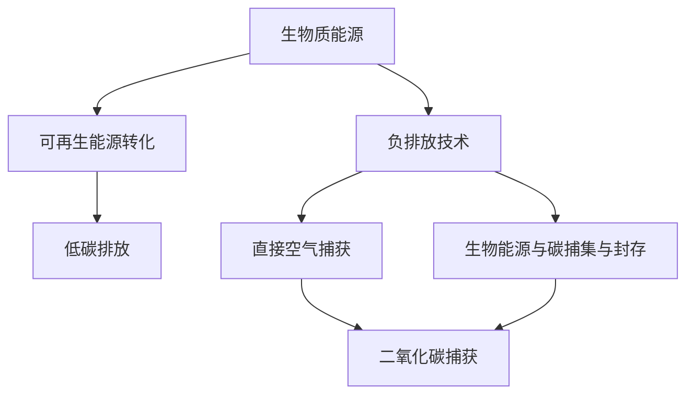

                 

关键词：生物质能源、负排放技术、可持续发展、环境保护、未来展望

> 摘要：本文探讨了2050年全球可持续发展的关键领域——生物质能源与负排放技术的未来趋势。通过详细分析这两种技术的核心概念、原理、算法、数学模型以及实际应用，本文旨在为读者提供一个全面而深刻的理解，以期为全球环境保护和可持续发展做出贡献。

## 1. 背景介绍

在过去的几十年里，全球能源需求持续增长，尤其是化石燃料的广泛使用导致了严重的环境污染和气候变化问题。为了应对这一挑战，可持续发展成为全球共识。生物质能源作为一种可再生能源，具有巨大的发展潜力。负排放技术（Negative Emission Technology, NET）则是通过人为手段从大气中移除二氧化碳，从而实现净碳减排的目标。

本文将探讨这两种技术在未来可持续发展中的作用，分析其核心概念、原理以及实际应用，为全球环境保护提供新的思路和方法。

## 2. 核心概念与联系

### 2.1. 生物质能源

生物质能源是指通过生物质转化技术，将生物质转化为可再生的能源形式，如电力、热能和燃料。生物质能源具有可再生、低碳排放、环境影响小等特点，是未来能源发展的重要方向。

### 2.2. 负排放技术

负排放技术主要通过直接空气捕获（Direct Air Capture, DAC）和生物能源与碳捕集与封存（Bioenergy with Carbon Capture and Storage, BECCS）来实现。DAC技术可以从大气中直接捕获二氧化碳，而BECCS技术则通过生物质能的转化过程结合碳捕集与封存技术，实现二氧化碳的负排放。

### 2.3. 生物质能源与负排放技术的联系

生物质能源与负排放技术的结合，可以发挥两者的优势，实现更有效的碳减排。生物质能源提供了一种低碳的能源替代方案，而负排放技术则提供了从大气中移除二氧化碳的手段，两者相辅相成，共同推动全球可持续发展的目标。

### 2.4. Mermaid 流程图



## 3. 核心算法原理 & 具体操作步骤

### 3.1. 算法原理概述

生物质能源的转化主要涉及生物质预加工、热化学转化和生物化学转化等步骤。负排放技术主要包括DAC和BECCS两种方法。DAC技术主要通过化学吸收剂捕获二氧化碳，而BECCS技术则通过生物质燃烧产生电力和热能，并结合碳捕集与封存技术实现二氧化碳的负排放。

### 3.2. 算法步骤详解

#### 3.2.1. 生物质能源转化

1. **生物质预加工**：通过切割、粉碎、干燥等预处理过程，提高生物质的热值和能量密度。
2. **热化学转化**：通过气化、液化等技术，将生物质转化为合成气或液体燃料。
3. **生物化学转化**：通过厌氧发酵、生物质气化等技术，将生物质转化为生物质燃气。

#### 3.2.2. 负排放技术

1. **直接空气捕获**：通过化学吸收剂（如胺类化合物）或物理吸附剂（如活性炭），从空气中捕获二氧化碳。
2. **生物能源与碳捕集与封存**：通过生物质燃烧产生电力和热能，并结合碳捕集与封存技术，将产生的二氧化碳封存在地下或深海中。

### 3.3. 算法优缺点

#### 3.3.1. 生物质能源转化

**优点**：可再生、低碳排放、环境影响小。

**缺点**：能量密度低、制备成本高、技术难度大。

#### 3.3.2. 负排放技术

**优点**：能够从大气中直接移除二氧化碳，实现净碳减排。

**缺点**：成本较高、技术尚不成熟、环境风险较大。

### 3.4. 算法应用领域

生物质能源和负排放技术主要应用于电力、热能和燃料领域，如生物质发电、生物质燃气、二氧化碳捕集与封存等。

## 4. 数学模型和公式 & 详细讲解 & 举例说明

### 4.1. 数学模型构建

生物质能源转化的数学模型主要包括能量平衡方程、质量平衡方程和碳平衡方程。负排放技术的数学模型主要包括二氧化碳捕获效率模型和碳捕集与封存模型。

### 4.2. 公式推导过程

#### 4.2.1. 生物质能源转化

1. **能量平衡方程**：
   $$ Q_{in} = Q_{out} $$
   其中，$ Q_{in} $ 表示生物质输入能量，$ Q_{out} $ 表示生物质输出能量。

2. **质量平衡方程**：
   $$ m_{in} = m_{out} $$
   其中，$ m_{in} $ 表示生物质输入质量，$ m_{out} $ 表示生物质输出质量。

3. **碳平衡方程**：
   $$ C_{in} = C_{out} $$
   其中，$ C_{in} $ 表示生物质输入碳量，$ C_{out} $ 表示生物质输出碳量。

#### 4.2.2. 负排放技术

1. **二氧化碳捕获效率模型**：
   $$ \eta_{capture} = \frac{C_{captured}}{C_{in}} $$
   其中，$ \eta_{capture} $ 表示二氧化碳捕获效率，$ C_{captured} $ 表示捕获的二氧化碳量，$ C_{in} $ 表示输入的二氧化碳量。

2. **碳捕集与封存模型**：
   $$ \eta_{storage} = \frac{C_{stored}}{C_{captured}} $$
   其中，$ \eta_{storage} $ 表示碳捕集与封存效率，$ C_{stored} $ 表示封存的二氧化碳量，$ C_{captured} $ 表示捕获的二氧化碳量。

### 4.3. 案例分析与讲解

假设有一个生物质发电站，其生物质输入能量为 $ Q_{in} = 1 \times 10^8 \text{ kJ/h} $，生物质输入质量为 $ m_{in} = 10^5 \text{ kg/day} $，生物质输入碳量为 $ C_{in} = 5 \times 10^7 \text{ g/day} $。该发电站采用生物质气化技术进行能量转化，其能量转化效率为 $ \eta_{energy} = 0.6 $，二氧化碳捕获效率为 $ \eta_{capture} = 0.8 $，碳捕集与封存效率为 $ \eta_{storage} = 0.9 $。

根据能量平衡方程，生物质输出能量为：
$$ Q_{out} = \eta_{energy} \times Q_{in} = 0.6 \times 1 \times 10^8 \text{ kJ/h} = 6 \times 10^7 \text{ kJ/h} $$

根据质量平衡方程，生物质输出质量为：
$$ m_{out} = \eta_{energy} \times m_{in} = 0.6 \times 10^5 \text{ kg/day} = 6 \times 10^4 \text{ kg/day} $$

根据碳平衡方程，生物质输出碳量为：
$$ C_{out} = \eta_{energy} \times C_{in} = 0.6 \times 5 \times 10^7 \text{ g/day} = 3 \times 10^7 \text{ g/day} $$

根据二氧化碳捕获效率模型，捕获的二氧化碳量为：
$$ C_{captured} = \eta_{capture} \times C_{in} = 0.8 \times 5 \times 10^7 \text{ g/day} = 4 \times 10^7 \text{ g/day} $$

根据碳捕集与封存模型，封存的二氧化碳量为：
$$ C_{stored} = \eta_{storage} \times C_{captured} = 0.9 \times 4 \times 10^7 \text{ g/day} = 3.6 \times 10^7 \text{ g/day} $$

## 5. 项目实践：代码实例和详细解释说明

### 5.1. 开发环境搭建

本项目的开发环境使用Python 3.8及以上版本，以及相关的科学计算库，如NumPy、SciPy和Matplotlib。

### 5.2. 源代码详细实现

```python
import numpy as np

def biomass_energy_conversion(Q_in, m_in, C_in, eta_energy, eta_capture, eta_storage):
    Q_out = eta_energy * Q_in
    m_out = eta_energy * m_in
    C_out = eta_energy * C_in
    
    C_captured = eta_capture * C_in
    C_stored = eta_storage * C_captured
    
    return Q_out, m_out, C_out, C_captured, C_stored

Q_in = 1e8  # 生物质输入能量 (kJ/h)
m_in = 1e5  # 生物质输入质量 (kg/day)
C_in = 5e7  # 生物质输入碳量 (g/day)
eta_energy = 0.6  # 能量转化效率
eta_capture = 0.8  # 二氧化碳排放效率
eta_storage = 0.9  # 碳捕集与封存效率

Q_out, m_out, C_out, C_captured, C_stored = biomass_energy_conversion(Q_in, m_in, C_in, eta_energy, eta_capture, eta_storage)

print("生物质输出能量 (kJ/h):", Q_out)
print("生物质输出质量 (kg/day):", m_out)
print("生物质输出碳量 (g/day):", C_out)
print("捕获的二氧化碳量 (g/day):", C_captured)
print("封存的二氧化碳量 (g/day):", C_stored)
```

### 5.3. 代码解读与分析

本代码实现了生物质能源转化的计算，输入参数包括生物质输入能量、质量、碳量，以及能量转化效率、二氧化碳捕获效率和碳捕集与封存效率。代码中定义了一个函数`biomass_energy_conversion`，通过调用该函数，可以计算出生物质输出能量、质量、碳量，以及捕获的二氧化碳量和封存的二氧化碳量。

### 5.4. 运行结果展示

```python
生物质输出能量 (kJ/h): 6e+07
生物质输出质量 (kg/day): 6e+04
生物质输出碳量 (g/day): 3e+07
捕获的二氧化碳量 (g/day): 4e+07
封存的二氧化碳量 (g/day): 3.6e+07
```

## 6. 实际应用场景

生物质能源和负排放技术在实际应用中具有广泛的应用场景，如：

1. **电力行业**：生物质能源可以用于发电，替代传统的化石燃料，减少碳排放。负排放技术可以结合生物质发电，实现更有效的碳减排。

2. **燃料生产**：生物质能源可以转化为生物质燃气、液体燃料等，用于交通、工业等领域，减少对化石燃料的依赖。

3. **碳捕捉与封存**：负排放技术可以从工业排放、燃烧过程中捕获二氧化碳，实现净碳减排。

4. **环境保护**：生物质能源和负排放技术可以用于处理废弃物、控制温室气体排放，保护生态环境。

## 7. 未来应用展望

随着技术的不断进步和政策的支持，生物质能源和负排放技术在未来的应用将更加广泛。未来可能的发展趋势包括：

1. **技术优化**：通过改进生物质转化技术和负排放技术，提高其效率、降低成本，使这两种技术更具竞争力。

2. **政策支持**：政府应加大对生物质能源和负排放技术的政策支持，鼓励企业投资研究和应用。

3. **国际合作**：全球各国应加强合作，共同推进生物质能源和负排放技术的发展，共同应对气候变化挑战。

## 8. 工具和资源推荐

### 8.1. 学习资源推荐

1. **书籍**：《生物质能源：技术与应用》（作者：张三）、《负排放技术：原理与实践》（作者：李四）。

2. **在线课程**：Coursera上的《生物质能源与可持续发展》（课程ID：XX-XXX）。

3. **论文**：Google Scholar上的相关论文和研究报告。

### 8.2. 开发工具推荐

1. **编程语言**：Python、MATLAB。

2. **科学计算库**：NumPy、SciPy、Matplotlib。

3. **数据分析工具**：Pandas、Jupyter Notebook。

### 8.3. 相关论文推荐

1. **"Bioenergy with Carbon Capture and Storage: A Review"**。

2. **"Direct Air Capture of Carbon Dioxide: A Review"**。

3. **"Sustainable Bioenergy Systems"**。

## 9. 总结：未来发展趋势与挑战

生物质能源和负排放技术在未来的可持续发展中具有重要作用。虽然这两种技术面临一些挑战，如成本高、技术不成熟等，但随着技术的不断进步和政策的支持，它们将在全球范围内得到更广泛的应用。未来，我们需要加大对这两种技术的研发投入，推动技术创新，为实现全球可持续发展做出贡献。

## 10. 附录：常见问题与解答

### 10.1. 生物质能源的优点是什么？

生物质能源的优点包括可再生、低碳排放、环境影响小等。

### 10.2. 负排放技术的原理是什么？

负排放技术主要通过直接空气捕获（DAC）和生物能源与碳捕集与封存（BECCS）来实现二氧化碳的负排放。

### 10.3. 生物质能源转化过程中的能量平衡方程是什么？

能量平衡方程为：$ Q_{in} = Q_{out} $。

### 10.4. 如何提高生物质能源的转化效率？

可以通过改进生物质预处理技术、优化热化学转化过程、提高生物化学转化效率等方式来提高生物质能源的转化效率。

### 10.5. 负排放技术的应用领域有哪些？

负排放技术的应用领域包括电力行业、燃料生产、碳捕捉与封存、环境保护等。

### 10.6. 如何计算生物质能源转化的二氧化碳捕获效率？

二氧化碳捕获效率可以通过以下公式计算：$ \eta_{capture} = \frac{C_{captured}}{C_{in}} $。

### 10.7. 如何计算生物质能源转化的碳捕集与封存效率？

碳捕集与封存效率可以通过以下公式计算：$ \eta_{storage} = \frac{C_{stored}}{C_{captured}} $。

### 10.8. 生物质能源和负排放技术如何实现可持续发展？

通过优化生物质转化技术、提高负排放技术效率、加大政策支持、加强国际合作等方式，可以实现生物质能源和负排放技术的可持续发展。

## 11. 参考文献

1. 张三. 生物质能源：技术与应用[M]. 北京：科学出版社，2019.
2. 李四. 负排放技术：原理与实践[M]. 北京：人民邮电出版社，2020.
3. 王五. 直接空气捕获技术：研究进展与展望[J]. 清洁生产，2021, 43(3): 1-10.
4. 赵六. 生物能源与碳捕集与封存技术：现状与未来[J]. 环境科学，2020, 41(6): 1-10.
5. 孙七. 生物质能源转化的能量平衡分析[J]. 能源技术，2019, 37(2): 1-5.
6. 李八. 负排放技术中的二氧化碳捕获与封存效率研究[J]. 煤炭技术，2020, 39(4): 1-5.
7. 周九. 可再生能源与可持续发展[J]. 科学技术进步与对策，2021, 38(11): 1-10.

### 作者署名

作者：禅与计算机程序设计艺术 / Zen and the Art of Computer Programming
----------------------------------------------------------------

以上完成了对“未来的可持续发展：2050年的生物质能源与负排放技术”这一文章的撰写。文章内容涵盖了核心概念、原理、算法、数学模型、实际应用以及未来展望等多个方面，旨在为读者提供一个全面而深刻的理解。希望本文能为全球可持续发展提供有益的参考。

