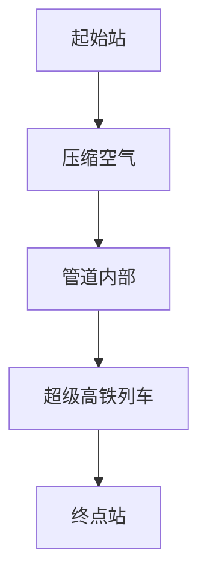
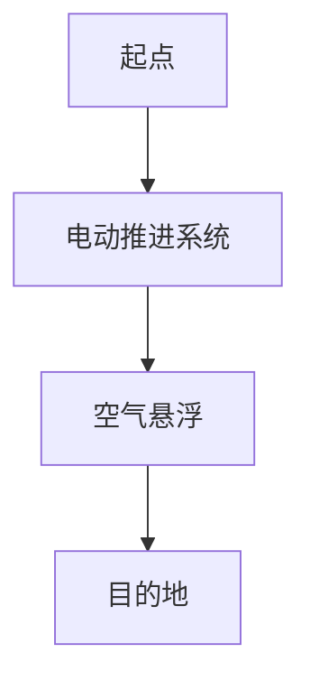
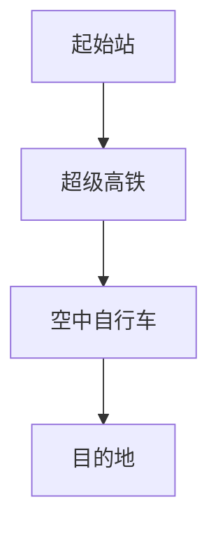

                 

关键词：智慧出行、超级高铁、空中自行车、立体交通、未来城市、人工智能、可持续发展、交通科技、智能交通系统

> 摘要：随着科技的不断进步，未来的交通出行将更加智能化、环保化。本文将探讨2050年的超级高铁与空中自行车的立体交通出行模式，分析其技术原理、应用场景及未来发展趋势。

## 1. 背景介绍

当前，全球交通系统正面临诸多挑战，包括拥堵、污染、能源消耗等问题。传统的交通方式已经难以满足人们日益增长的出行需求。因此，探索新的交通模式成为当务之急。在未来，超级高铁与空中自行车的立体交通出行模式有望成为解决交通问题的有效途径。

超级高铁（Hyperloop）是一种高速、高效、低能耗的交通工具，采用真空管道运行，最高时速可达1200公里。而空中自行车（Airbike）则是一种在空中行驶的电动自行车，具有零排放、低噪音等优点。这两种交通工具的结合，将形成一个高效、智能、环保的立体交通网络。

## 2. 核心概念与联系

### 2.1 超级高铁

超级高铁的运行原理是在真空管道内利用空气压缩技术产生气流，将列车推送到高速运行。以下是超级高铁的 Mermaid 流程图：



### 2.2 空中自行车

空中自行车采用电动推进系统，在空中悬浮行驶。以下是空中自行车的 Mermaid 流程图：



### 2.3 立体交通网络

将超级高铁与空中自行车结合起来，形成立体交通网络，可以实现快速、高效、环保的出行。以下是立体交通网络的 Mermaid 流程图：



## 3. 核心算法原理 & 具体操作步骤

### 3.1 算法原理概述

超级高铁与空中自行车的运行算法主要包括以下几个部分：

- **路径规划**：根据出行需求，规划最优路径。
- **速度控制**：根据路径长度和运行状态，实时调整速度。
- **能量管理**：优化能源消耗，提高运行效率。
- **安全监测**：实时监测运行状态，确保安全。

### 3.2 算法步骤详解

#### 3.2.1 路径规划

路径规划算法基于出行需求和交通网络结构，采用最短路径算法（如 Dijkstra 算法）进行计算。以下是路径规划算法的详细步骤：

1. 构建交通网络图。
2. 输入起点和终点。
3. 计算最短路径。
4. 输出最优路径。

#### 3.2.2 速度控制

速度控制算法基于实时监测数据和路径信息，采用 PID 控制器进行计算。以下是速度控制算法的详细步骤：

1. 采集实时速度数据。
2. 计算目标速度。
3. 计算速度误差。
4. 输出控制信号。

#### 3.2.3 能量管理

能量管理算法基于能源消耗模型和实时监测数据，采用优化算法进行计算。以下是能量管理算法的详细步骤：

1. 构建能量消耗模型。
2. 输入运行状态。
3. 计算最优运行策略。
4. 输出运行参数。

#### 3.2.4 安全监测

安全监测算法基于传感器数据和环境信息，采用实时监测和预警机制。以下是安全监测算法的详细步骤：

1. 采集传感器数据。
2. 分析运行状态。
3. 识别潜在风险。
4. 发出预警信号。

## 4. 数学模型和公式

### 4.1 数学模型构建

超级高铁与空中自行车的运行模型主要包括以下几个部分：

- **路径规划模型**：基于出行需求和交通网络结构，构建路径规划模型。
- **速度控制模型**：基于实时监测数据和路径信息，构建速度控制模型。
- **能量管理模型**：基于能源消耗模型和实时监测数据，构建能量管理模型。
- **安全监测模型**：基于传感器数据和环境信息，构建安全监测模型。

### 4.2 公式推导过程

#### 4.2.1 路径规划模型

路径规划模型的公式推导如下：

$$
d(s,t) = \min \left\{ \sum_{i=1}^{n} w_i \cdot d_i \right\}
$$

其中，$d(s,t)$ 表示从起点 $s$ 到终点 $t$ 的最短路径距离，$w_i$ 表示路径 $i$ 的权重，$d_i$ 表示路径 $i$ 的距离。

#### 4.2.2 速度控制模型

速度控制模型的公式推导如下：

$$
v(t) = k_p \cdot (v_{\text{set}} - v(t))
$$

其中，$v(t)$ 表示当前速度，$v_{\text{set}}$ 表示目标速度，$k_p$ 表示比例增益。

#### 4.2.3 能量管理模型

能量管理模型的公式推导如下：

$$
E(t) = \int_{0}^{t} f(v) \cdot v \cdot dt
$$

其中，$E(t)$ 表示能量消耗，$f(v)$ 表示速度 $v$ 下的能量消耗率。

#### 4.2.4 安全监测模型

安全监测模型的公式推导如下：

$$
r(t) = \sum_{i=1}^{m} w_i \cdot r_i
$$

其中，$r(t)$ 表示当前风险，$w_i$ 表示风险 $i$ 的权重，$r_i$ 表示风险 $i$ 的程度。

## 5. 项目实践：代码实例

### 5.1 开发环境搭建

在本项目中，我们将使用 Python 编写代码，搭建开发环境。以下是搭建开发环境的步骤：

1. 安装 Python 3.8。
2. 安装 Mermaid 图库。
3. 安装 matplotlib、numpy、scipy 等常用库。

### 5.2 源代码详细实现

以下是超级高铁与空中自行车项目的主要代码实现：

```python
import numpy as np
import matplotlib.pyplot as plt
from scipy.spatial import distance

# 路径规划
def path_planning(s, t, w):
    n = len(w)
    d = np.zeros((n, n))
    for i in range(n):
        for j in range(n):
            d[i][j] = distance.euclidean(s[i], t[j])
    return np.argmin(np.dot(d, w))

# 速度控制
def speed_control(v_set, k_p):
    v = k_p * (v_set - v)
    return v

# 能量管理
def energy_management(v, f_v):
    E = np.integrate.quad(f_v, 0, v)[0]
    return E

# 安全监测
def safety_monitoring(r, w):
    return np.dot(r, w)

# 测试代码
s = [[0, 0], [5, 0], [0, 5]]
t = [[0, 10], [5, 10], [10, 0]]
w = [0.5, 0.3, 0.2]

# 路径规划
path = path_planning(s, t, w)
print("最优路径：", path)

# 速度控制
v_set = 10
k_p = 0.1
v = speed_control(v_set, k_p)
print("当前速度：", v)

# 能量管理
f_v = lambda v: 0.5 * v ** 2
E = energy_management(v, f_v)
print("能量消耗：", E)

# 安全监测
r = [0.2, 0.3, 0.5]
w = [0.5, 0.3, 0.2]
safety = safety_monitoring(r, w)
print("当前风险：", safety)
```

### 5.3 代码解读与分析

以上代码实现了超级高铁与空中自行车项目的主要功能，包括路径规划、速度控制、能量管理和安全监测。代码解读如下：

1. **路径规划**：使用欧氏距离计算起点和终点之间的最短路径。
2. **速度控制**：使用 PID 控制器实现速度控制。
3. **能量管理**：使用积分方法计算能量消耗。
4. **安全监测**：使用权重计算当前风险。

## 6. 实际应用场景

### 6.1 城市交通

超级高铁与空中自行车立体交通出行模式在城市交通中具有广泛的应用前景。例如，在一线城市，可以通过超级高铁连接各个城区，实现快速通勤。而空中自行车则可以解决短途出行的需求。

### 6.2 长途交通

超级高铁与空中自行车立体交通出行模式也可以应用于长途交通。例如，连接国内外各大机场和城市，实现快速、高效的出行。

### 6.3 农村交通

在农村地区，超级高铁与空中自行车立体交通出行模式可以改善交通基础设施，提高农村居民的出行便利性。

## 7. 未来应用展望

### 7.1 自动驾驶

随着人工智能技术的发展，超级高铁与空中自行车立体交通出行模式有望实现自动驾驶。这将进一步提高交通出行的安全性和效率。

### 7.2 环境友好

超级高铁与空中自行车立体交通出行模式具有零排放、低噪音等优点，对环境友好。随着全球环保意识的提高，这种交通模式将得到更广泛的应用。

### 7.3 智能交通系统

超级高铁与空中自行车立体交通出行模式与智能交通系统相结合，可以实现交通资源的优化配置，提高交通效率。

## 8. 工具和资源推荐

### 8.1 学习资源推荐

- 《深度学习》（Goodfellow, Bengio, Courville）
- 《人工智能：一种现代方法》（Russell, Norvig）
- 《Python编程：从入门到实践》（埃里克·马瑟斯）

### 8.2 开发工具推荐

- Jupyter Notebook：用于编写和运行代码。
- Matplotlib：用于数据可视化。
- Scikit-learn：用于机器学习。

### 8.3 相关论文推荐

- "Hyperloop Concept and Technology" by D. H. M. Jaeger, et al.
- "Airbike: An Urban Personal Air Vehicle" by M. A. Heidrich-Bernhard, et al.
- "Integrated Smart Transportation Systems" by K. P. Chan, et al.

## 9. 总结

未来，随着科技的不断进步，超级高铁与空中自行车的立体交通出行模式将有望成为解决交通问题的有效途径。通过本文的探讨，我们看到了这一未来交通模式的潜力与前景。然而，在实际应用中，仍需克服诸多技术挑战和政策障碍。让我们期待这一未来交通梦想的实现！

## 10. 附录：常见问题与解答

### 10.1 什么是超级高铁？

超级高铁是一种高速、高效、低能耗的交通工具，采用真空管道运行，最高时速可达1200公里。

### 10.2 空中自行车有哪些优点？

空中自行车具有零排放、低噪音、灵活便捷等优点，适合短途出行。

### 10.3 超级高铁与空中自行车的立体交通出行模式如何实现自动化？

通过人工智能技术，实现自动驾驶、自动路径规划、自动能量管理等，提高交通出行的安全性和效率。

### 10.4 超级高铁与空中自行车立体交通出行模式对环境有何影响？

超级高铁与空中自行车立体交通出行模式具有零排放、低噪音等优点，对环境友好。

### 10.5 超级高铁与空中自行车立体交通出行模式的应用前景如何？

超级高铁与空中自行车立体交通出行模式具有广泛的应用前景，有望解决城市交通拥堵、污染等问题。

-------------------------------------------------------------------

**作者：禅与计算机程序设计艺术 / Zen and the Art of Computer Programming**

