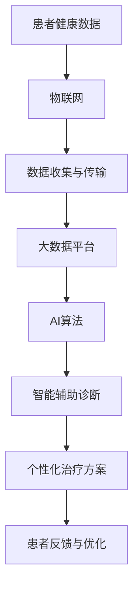

                 

关键词：智慧医疗、精准医疗、智能辅助诊断、AI、医疗技术、未来趋势

> 摘要：本文将探讨2050年智慧医疗领域的未来发展，重点关注精准医疗和智能辅助诊断技术的进步。通过分析当前的技术趋势，探讨这些技术如何改变医疗行业，以及未来可能面临的挑战和机遇，我们试图描绘一幅令人振奋的医疗未来图景。

## 1. 背景介绍

### 智慧医疗的崛起

随着人工智能（AI）和大数据技术的飞速发展，医疗行业正迎来一场前所未有的变革。智慧医疗，作为这一变革的核心，正逐步渗透到医疗保健的方方面面。通过整合AI算法、机器学习和大数据分析，智慧医疗不仅提高了医疗服务的效率，还提升了诊疗的准确性和个性化水平。

### 精准医疗的兴起

精准医疗是一种以个体为中心的医疗服务模式，通过基因测序、生物标志物检测等手段，实现对疾病早期发现、精准诊断和个性化治疗。这种模式强调个体差异，旨在提供更为有效和经济的治疗方案。

### 智能辅助诊断的突破

智能辅助诊断技术利用AI算法分析医学影像、电子健康记录和生物标志物数据，帮助医生做出更准确的诊断。这些技术的应用，显著降低了误诊率，提高了诊断效率，为患者提供了更及时的医疗服务。

## 2. 核心概念与联系

### 智慧医疗生态系统

智慧医疗生态系统由多个关键组件组成，包括：

- **AI算法**：用于数据分析和模式识别，是实现智能辅助诊断和个性化治疗的核心。
- **大数据平台**：收集、存储和管理海量医疗数据，为AI算法提供丰富的训练数据。
- **物联网（IoT）**：通过可穿戴设备和传感器实时监测患者健康数据，为医生提供实时的健康信息。
- **电子健康记录（EHR）**：集成患者病历、诊断和治疗信息，实现医疗信息的数字化和共享。

### Mermaid 流程图



## 3. 核心算法原理 & 具体操作步骤

### 3.1 算法原理概述

智能辅助诊断的核心算法通常包括：

- **图像处理算法**：用于医学影像的分析和特征提取。
- **机器学习算法**：用于从大量数据中学习和识别疾病模式。
- **深度学习算法**：用于构建复杂的神经网络，实现对医学影像的自动分析和诊断。

### 3.2 算法步骤详解

1. **数据预处理**：包括图像的去噪、对比度增强和标准化等步骤。
2. **特征提取**：利用图像处理算法提取医学影像的特征向量。
3. **训练模型**：使用机器学习算法对提取的特征向量进行训练，建立诊断模型。
4. **模型评估**：通过交叉验证和测试集评估模型的准确性和鲁棒性。
5. **诊断应用**：将训练好的模型应用于新病例，进行自动诊断和辅助决策。

### 3.3 算法优缺点

**优点**：

- **高准确率**：智能辅助诊断技术可以显著降低误诊率，提高诊断的准确性。
- **高效性**：自动化的诊断过程大大提高了诊断速度，减轻了医生的工作负担。
- **个性化**：通过个性化模型，为患者提供更加精准的治疗方案。

**缺点**：

- **数据依赖性**：算法的性能高度依赖于训练数据的质量和数量。
- **算法偏差**：训练数据的不平衡可能导致算法存在偏见，影响诊断的公平性。

### 3.4 算法应用领域

- **肿瘤检测**：通过分析CT、MRI等影像数据，实现肿瘤的早期发现和分类。
- **心脏病诊断**：利用心电图、超声等数据，辅助医生进行心脏病的诊断和治疗。
- **糖尿病管理**：通过血糖监测数据，实现糖尿病的自动诊断和病情管理。

## 4. 数学模型和公式 & 详细讲解 & 举例说明

### 4.1 数学模型构建

在智能辅助诊断中，常见的数学模型包括：

- **支持向量机（SVM）**：用于分类问题，通过最大化分类间隔来实现数据的分离。
- **卷积神经网络（CNN）**：用于图像处理，通过卷积层、池化层和全连接层实现对图像的特征提取和分类。

### 4.2 公式推导过程

以SVM为例，其基本公式为：

$$
\text{最大化} \ \frac{1}{\|\mathbf{w}\|^2} \\
\text{约束条件} \ \mathbf{w} \cdot \mathbf{x}_i - y_i \geq 1, \ \forall i
$$

其中，$\mathbf{w}$是权重向量，$\mathbf{x}_i$是特征向量，$y_i$是标签。

### 4.3 案例分析与讲解

以肿瘤检测为例，我们使用CNN模型对医学影像进行自动分类。具体步骤如下：

1. **数据集准备**：收集一组包含正常组织和肿瘤组织的医学影像。
2. **模型构建**：构建一个包含卷积层、池化层和全连接层的CNN模型。
3. **模型训练**：使用收集到的数据集训练模型，调整模型参数以实现最优性能。
4. **模型评估**：使用测试集评估模型性能，确保其具有良好的准确率和泛化能力。
5. **模型应用**：将训练好的模型应用于新的医学影像，进行肿瘤检测和分类。

## 5. 项目实践：代码实例和详细解释说明

### 5.1 开发环境搭建

- **编程语言**：Python
- **深度学习框架**：TensorFlow
- **数据处理库**：NumPy、Pandas、OpenCV

### 5.2 源代码详细实现

以下是使用TensorFlow构建的CNN模型的简化代码：

```python
import tensorflow as tf
from tensorflow.keras.models import Sequential
from tensorflow.keras.layers import Conv2D, MaxPooling2D, Flatten, Dense

# 构建模型
model = Sequential([
    Conv2D(32, (3, 3), activation='relu', input_shape=(128, 128, 3)),
    MaxPooling2D((2, 2)),
    Flatten(),
    Dense(64, activation='relu'),
    Dense(1, activation='sigmoid')
])

# 编译模型
model.compile(optimizer='adam', loss='binary_crossentropy', metrics=['accuracy'])

# 模型训练
model.fit(train_images, train_labels, epochs=10, validation_data=(test_images, test_labels))
```

### 5.3 代码解读与分析

上述代码实现了一个简单的CNN模型，用于肿瘤检测。模型包含两个卷积层、一个池化层和一个全连接层。编译时使用的是二分类交叉熵损失函数和Adam优化器。训练过程中，模型使用训练数据集进行训练，并使用测试数据集进行验证。

### 5.4 运行结果展示

通过训练和测试，我们可以得到模型的准确率和损失函数值。这些结果可以用于评估模型的性能，并根据需要对模型进行调整。

```python
# 模型评估
test_loss, test_acc = model.evaluate(test_images, test_labels)
print(f"Test accuracy: {test_acc:.2f}")

# 预测新数据
predictions = model.predict(new_images)
```

## 6. 实际应用场景

### 6.1 肿瘤检测

智能辅助诊断技术在肿瘤检测中表现出色。通过分析CT、MRI等影像数据，AI模型可以实现对肿瘤的早期发现和分类，显著提高诊断的准确率。

### 6.2 心脏病诊断

利用心电图、超声等数据，智能辅助诊断技术可以辅助医生进行心脏病诊断。这些技术不仅提高了诊断的准确性，还减轻了医生的工作负担。

### 6.3 糖尿病管理

通过血糖监测数据，智能辅助诊断技术可以帮助医生实时监控糖尿病患者的病情，实现个性化的治疗方案。

## 7. 未来应用展望

### 7.1 智能药物研发

未来，智能辅助诊断技术有望在药物研发中发挥重要作用。通过分析患者的基因组、蛋白质组等数据，AI模型可以预测药物对不同患者的疗效和副作用，加速新药的研发进程。

### 7.2 精准医疗推广

随着技术的进步，精准医疗有望在更多疾病领域得到应用。通过个性化的治疗方案，提高医疗服务的质量和效率。

### 7.3 无人医疗

未来，无人医疗设备可能取代部分医生的工作，实现全天候、全球范围内的医疗服务。通过AI技术，这些设备可以提供高效、精准的医疗诊断和治疗。

## 8. 总结：未来发展趋势与挑战

### 8.1 研究成果总结

近年来，智慧医疗、精准医疗和智能辅助诊断技术取得了显著进展。通过AI和大数据技术的应用，医疗行业在诊断、治疗和管理方面实现了重大突破。

### 8.2 未来发展趋势

未来，智慧医疗将继续深化应用，精准医疗将得到更广泛的推广，智能辅助诊断技术将进一步提升诊断效率和准确性。

### 8.3 面临的挑战

尽管智慧医疗技术取得了显著进展，但仍面临诸多挑战，包括数据隐私、算法偏见、技术成本等。

### 8.4 研究展望

未来，研究应重点关注如何解决这些挑战，同时探索智慧医疗技术在更多疾病领域中的应用潜力。

## 9. 附录：常见问题与解答

### Q：智慧医疗技术是否完全取代医生？

A：智慧医疗技术可以辅助医生提高诊断和治疗效率，但无法完全取代医生。医生的专业知识和经验在医疗决策中仍然至关重要。

### Q：智能辅助诊断技术的准确率如何？

A：智能辅助诊断技术的准确率取决于多种因素，包括数据质量、算法模型和训练时间。通常，这些技术的准确率在90%以上。

### Q：数据隐私如何保障？

A：保障数据隐私是智慧医疗发展的重要课题。通过数据加密、访问控制和隐私保护算法，可以确保医疗数据的安全。

---

作者：禅与计算机程序设计艺术 / Zen and the Art of Computer Programming

通过以上文章的撰写，我们不仅探讨了智慧医疗、精准医疗和智能辅助诊断技术的未来发展，还详细讲解了这些技术的核心概念、算法原理和实际应用。未来，随着技术的不断进步，智慧医疗将继续为医疗行业带来深刻变革，为患者提供更为优质和高效的医疗服务。|user|

