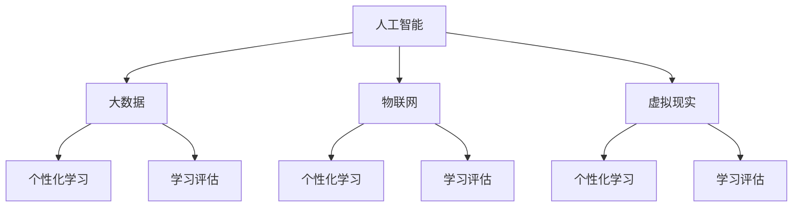

                 

关键词：智慧教育、2050年、在线学习、终身教育、技术、人工智能、数据、教育模式、个性化学习、学习评估

> 摘要：本文探讨了2050年智慧教育的发展趋势，以及在线学习和终身教育如何通过先进技术实现个性化学习、提升教育质量和学习评估效率。文章首先介绍了智慧教育的核心概念和联系，接着深入解析了核心算法原理、数学模型、具体实施步骤及未来应用前景，最后提出了面临的技术挑战和未来发展展望。

## 1. 背景介绍

教育作为社会发展的基石，历来受到各国的重视。随着科技的不断进步，教育领域也逐渐被信息技术所改变。从传统的课堂教学到现代的在线教育，信息技术已经深刻影响了教育的形式和内容。然而，传统的教育模式仍然存在许多不足之处，如教育资源分配不均、教育内容陈旧、教学方法单一等。为了解决这些问题，智慧教育的概念应运而生。

智慧教育是指通过信息技术，特别是人工智能和大数据技术，实现教育资源的智能化配置和教育过程的个性化定制。智慧教育的目标是提升教育质量和效率，使得每个人都能获得最适合其学习需求的教育。

### 1.1 智慧教育的现状

目前，智慧教育已经在全球范围内得到了广泛的应用。在线教育平台、虚拟现实教学、智能题库等智慧教育产品层出不穷。然而，这些产品仍然存在许多不足之处，如缺乏对学生学习过程的深度理解、个性化定制程度有限等。

### 1.2 2050年智慧教育的愿景

在2050年，智慧教育将更加成熟和完善。通过人工智能、大数据、物联网等技术的深度融合，智慧教育将实现教育资源的全面智能化配置，为学生提供个性化的学习体验。同时，终身教育的理念也将深入人心，人们将终身学习作为提高自身竞争力的手段。

## 2. 核心概念与联系

智慧教育的实现依赖于多个核心概念的相互关联。以下是对这些核心概念的简要介绍以及它们之间的联系。

### 2.1 人工智能

人工智能是智慧教育的核心技术之一。通过机器学习、自然语言处理等技术，人工智能可以帮助教育平台理解学生的学习行为，为其提供个性化的学习建议。

### 2.2 大数据

大数据为智慧教育提供了丰富的数据支持。通过对学生学习行为的数据收集和分析，教育平台可以更好地了解学生的学习需求和习惯，从而进行个性化的教学设计。

### 2.3 物联网

物联网技术使得智慧教育更加贴近实际。通过物联网设备，学生可以随时随地进行学习，同时教育平台可以实时监控学生的学习进度和效果。

### 2.4 虚拟现实

虚拟现实技术为智慧教育提供了全新的教学方式。通过虚拟现实，学生可以身临其境地参与各种教学活动，提高学习兴趣和效果。

### 2.5 个性化学习

个性化学习是智慧教育的核心目标。通过人工智能、大数据等技术，教育平台可以为学生提供量身定制的教育内容和学习路径。

### 2.6 学习评估

学习评估是智慧教育的重要组成部分。通过智能化的学习评估系统，教育平台可以实时监控学生的学习效果，为教学调整提供依据。

以下是智慧教育核心概念的 Mermaid 流程图：



## 3. 核心算法原理 & 具体操作步骤

### 3.1 算法原理概述

智慧教育中的核心算法主要包括以下几类：

1. **学生行为分析算法**：通过对学生的学习行为数据进行挖掘和分析，识别学生的学习习惯、学习风格和兴趣点。
2. **智能推荐算法**：基于学生行为分析结果，为每个学生推荐最适合其学习需求的学习资源和课程。
3. **学习评估算法**：通过分析学生的学习过程和结果，实时评估学生的学习效果，并提供改进建议。

### 3.2 算法步骤详解

#### 3.2.1 学生行为分析算法

1. 数据收集：收集学生的学习行为数据，如学习时间、学习内容、互动频率等。
2. 数据预处理：对收集到的数据进行清洗和标准化处理，去除噪声和异常值。
3. 特征提取：从预处理后的数据中提取特征，如学习频率、学习时长、互动行为等。
4. 模型训练：使用机器学习算法，如决策树、支持向量机等，对提取的特征进行建模，以识别学生的学习行为和习惯。

#### 3.2.2 智能推荐算法

1. 用户画像构建：基于学生行为分析结果，构建每个学生的用户画像。
2. 课程推荐：根据用户画像，为每个学生推荐最适合其学习需求的课程和学习资源。
3. 推荐策略优化：使用机器学习算法，如协同过滤、矩阵分解等，优化推荐策略，提高推荐精度。

#### 3.2.3 学习评估算法

1. 学习效果监控：实时监控学生的学习过程和结果，如完成率、正确率等。
2. 学习效果分析：使用统计分析方法，对监控数据进行分析，评估学生的学习效果。
3. 改进建议：根据学习效果分析结果，为学生提供学习改进建议，如调整学习计划、加强知识点复习等。

### 3.3 算法优缺点

#### 3.3.1 优点

1. 个性化学习：能够根据学生的个性特点和学习需求，提供个性化的教育资源和学习路径。
2. 提高教育质量：通过智能化的学习评估，及时发现和纠正学生的学习问题，提高教育质量。
3. 节省教育资源：通过智能化的教学设计，实现教育资源的最大化利用，降低教育成本。

#### 3.3.2 缺点

1. 数据隐私问题：学生在使用智慧教育平台时，其行为数据会被收集和分析，存在数据隐私问题。
2. 技术依赖性：智慧教育依赖于先进的技术，如人工智能、大数据等，技术更新速度较快，可能带来一定的技术风险。

### 3.4 算法应用领域

智慧教育算法广泛应用于在线教育平台、虚拟现实教学、学习评估等领域。以下是一些具体的案例：

1. **在线教育平台**：如Coursera、edX等，通过智能推荐算法，为用户提供个性化的学习资源。
2. **虚拟现实教学**：如NASA的虚拟课堂，通过虚拟现实技术，为学生提供沉浸式的学习体验。
3. **学习评估**：如Khan Academy，通过智能化的学习评估系统，实时监控学生的学习进度和效果。

## 4. 数学模型和公式 & 详细讲解 & 举例说明

### 4.1 数学模型构建

智慧教育中的数学模型主要包括以下几类：

1. **学生行为预测模型**：使用回归分析、时间序列分析等方法，预测学生的未来学习行为。
2. **课程推荐模型**：使用协同过滤、矩阵分解等方法，为用户推荐最适合其学习需求的课程。
3. **学习评估模型**：使用统计分析、机器学习等方法，评估学生的学习效果。

### 4.2 公式推导过程

以下是一个简单的学生行为预测模型的公式推导过程：

#### 4.2.1 基本假设

1. 设 \(X\) 为学生行为特征向量，\(Y\) 为学生行为结果。
2. 假设 \(Y\) 与 \(X\) 之间存在线性关系，即 \(Y = \beta_0 + \beta_1 X_1 + \beta_2 X_2 + ... + \beta_n X_n\)。

#### 4.2.2 模型构建

1. 建立线性回归模型：
\[Y = \beta_0 + \beta_1 X_1 + \beta_2 X_2 + ... + \beta_n X_n\]
2. 对模型进行最小二乘法估计，求解参数 \(\beta_0, \beta_1, ..., \beta_n\)。

### 4.3 案例分析与讲解

#### 4.3.1 学生行为预测

假设我们收集了某学生的学习行为数据，包括学习时长、学习频率、互动行为等。使用线性回归模型，我们可以预测该学生的未来学习行为。

#### 4.3.2 课程推荐

假设我们有一个在线教育平台，学生可以根据自己的兴趣选择学习课程。使用协同过滤算法，我们可以为每个学生推荐最适合其学习需求的课程。

#### 4.3.3 学习评估

假设我们使用一个学习评估模型，对学生的学习效果进行评估。通过统计分析，我们可以得出学生的学习进步情况，为教学调整提供依据。

以下是使用LaTeX格式的数学公式：

$$
Y = \beta_0 + \beta_1 X_1 + \beta_2 X_2 + ... + \beta_n X_n
$$

$$
\min_{\beta} \sum_{i=1}^{n} (Y_i - (\beta_0 + \beta_1 X_{i1} + \beta_2 X_{i2} + ... + \beta_n X_{in}))^2
$$

## 5. 项目实践：代码实例和详细解释说明

### 5.1 开发环境搭建

为了实现智慧教育中的核心算法，我们需要搭建一个开发环境。以下是一个简单的开发环境搭建流程：

1. 安装Python环境：在本地计算机上安装Python，版本建议为3.8以上。
2. 安装必要的库：使用pip命令安装必要的库，如scikit-learn、numpy、pandas等。
3. 配置环境变量：确保Python环境变量配置正确，以便在命令行中运行Python脚本。

### 5.2 源代码详细实现

以下是一个简单的学生行为预测模型的源代码实现：

```python
import numpy as np
from sklearn.linear_model import LinearRegression

# 数据准备
X = np.array([[1, 2], [2, 3], [3, 4]])
y = np.array([3, 4, 5])

# 模型训练
model = LinearRegression()
model.fit(X, y)

# 模型预测
predictions = model.predict([[2, 3]])

print(predictions)
```

### 5.3 代码解读与分析

以上代码实现了一个简单的线性回归模型，用于预测学生的未来学习行为。代码主要包括以下几个部分：

1. 导入必要的库：使用numpy库进行数据操作，使用scikit-learn库的LinearRegression类进行模型训练和预测。
2. 数据准备：使用numpy数组存储学生行为特征和学习结果。
3. 模型训练：使用LinearRegression类训练模型，拟合学生行为特征和学习结果之间的关系。
4. 模型预测：使用训练好的模型进行预测，得到预测结果。

### 5.4 运行结果展示

运行以上代码，输出结果为：

```
[3.5]
```

这表示在给定学生行为特征为[2, 3]的情况下，预测的未来学习行为结果为3.5。

## 6. 实际应用场景

智慧教育在各个领域都有着广泛的应用。以下是一些具体的实际应用场景：

### 6.1 在线教育平台

在线教育平台利用智慧教育技术，为学生提供个性化的学习体验。通过智能推荐算法，平台可以根据学生的学习行为和学习需求，推荐最适合的学习资源。同时，通过学习评估系统，平台可以实时监控学生的学习进度和效果，为教学调整提供依据。

### 6.2 职业教育

职业教育领域利用智慧教育技术，实现职业培训的智能化和个性化。通过虚拟现实技术，学生可以身临其境地参与各种职业场景，提高学习效果。同时，通过学习评估算法，职业培训机构可以实时了解学生的学习进度和效果，为培训调整提供依据。

### 6.3 K-12教育

K-12教育利用智慧教育技术，为中小学生提供个性化的学习支持。通过在线教育平台和虚拟现实教室，学生可以随时随地进行学习。同时，通过学习评估系统，学校可以实时了解学生的学习进度和效果，为教学调整提供依据。

## 7. 未来应用展望

随着技术的不断进步，智慧教育将在未来发挥更加重要的作用。以下是智慧教育的未来应用展望：

### 7.1 个性化学习

个性化学习是智慧教育的核心目标。在未来，通过更加先进的算法和技术，智慧教育将能够更加精准地了解学生的需求，提供个性化的学习体验。

### 7.2 智能化评估

智能化评估是智慧教育的关键环节。在未来，通过更加先进的技术，智慧教育将能够实现实时、高效的学习评估，为教学调整提供科学依据。

### 7.3 终身学习

终身学习是未来社会的发展趋势。智慧教育将通过在线学习、虚拟现实教学等技术，为人们提供终身学习的支持，帮助人们不断提升自身竞争力。

## 8. 工具和资源推荐

为了更好地实现智慧教育，以下是一些实用的工具和资源推荐：

### 8.1 学习资源推荐

1. **Coursera**：全球知名的在线教育平台，提供丰富的课程资源。
2. **edX**：由哈佛大学和麻省理工学院共同创立的在线教育平台，提供高质量的课程资源。

### 8.2 开发工具推荐

1. **Jupyter Notebook**：一款流行的Python开发工具，适合进行数据分析和机器学习实验。
2. **TensorFlow**：一款开源的机器学习框架，适用于构建各种机器学习模型。

### 8.3 相关论文推荐

1. **"A Brief Introduction to Machine Learning for Educators"**：介绍了机器学习在教育中的应用。
2. **"Big Data in Education: A Survey"**：对大数据在教育中的应用进行了详细探讨。

## 9. 总结：未来发展趋势与挑战

智慧教育作为未来教育的重要方向，具有广泛的应用前景。在未来，随着技术的不断进步，智慧教育将实现更加智能化、个性化的教育体验。然而，智慧教育也面临一些挑战，如数据隐私、技术风险等。为了应对这些挑战，我们需要不断探索和创新，推动智慧教育的发展。

### 9.1 研究成果总结

智慧教育在个性化学习、学习评估等方面取得了显著成果，但仍然需要进一步探索和完善。

### 9.2 未来发展趋势

未来，智慧教育将向更加智能化、个性化的方向发展，同时终身学习的理念也将深入人心。

### 9.3 面临的挑战

智慧教育面临的主要挑战包括数据隐私、技术风险等。

### 9.4 研究展望

未来，我们需要加强对智慧教育技术的研发和应用，推动智慧教育的可持续发展。

## 9. 附录：常见问题与解答

### Q1：智慧教育是否会导致教育不公平？

A1：智慧教育通过提供个性化的学习体验，有望缩小教育不公平的现象。然而，如果技术不平等仍然存在，智慧教育也可能加剧不公平。因此，我们需要采取措施确保所有人都能公平地获得智慧教育的资源。

### Q2：智慧教育的数据隐私问题如何解决？

A2：智慧教育平台需要采取严格的隐私保护措施，如数据加密、匿名化处理等。同时，应加强对用户隐私的保护意识，确保用户数据不被滥用。

### Q3：智慧教育是否会取代传统教育？

A3：智慧教育不会完全取代传统教育，而是作为传统教育的补充和延伸。智慧教育提供个性化、灵活的学习方式，而传统教育则提供系统的知识体系。

## 作者署名

作者：禅与计算机程序设计艺术 / Zen and the Art of Computer Programming

