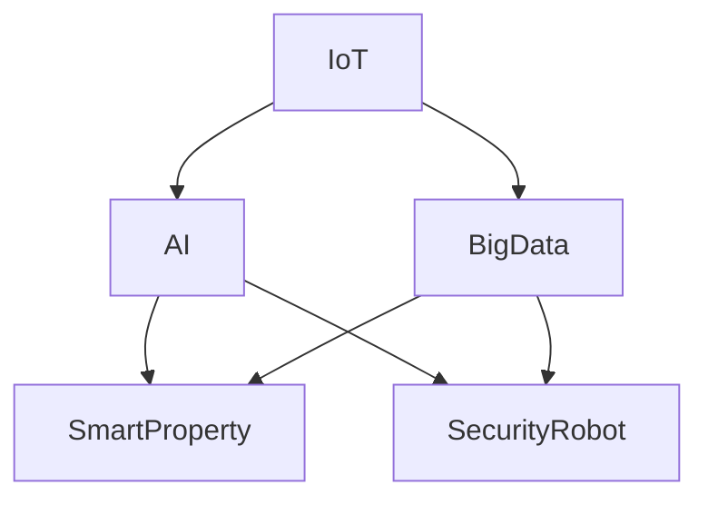

                 

关键词：智慧物业、智能安保机器人、智慧园区管理、物联网、人工智能、未来趋势

摘要：随着科技的飞速发展，智慧物业和智能安保机器人在未来的物业管理中扮演着越来越重要的角色。本文将探讨2050年智慧物业和智能安保机器人的发展趋势，以及智慧园区管理的创新应用。通过分析核心概念、算法原理、数学模型、项目实践和未来应用场景，我们旨在为读者呈现一幅令人激动的未来科技画卷。

## 1. 背景介绍

在21世纪，信息技术和人工智能正以前所未有的速度改变着我们的生活。智慧物业和智能安保机器人作为物联网和人工智能技术的典型应用，正在不断突破传统物业管理的局限。智慧物业不仅仅是物业管理，它还包括设施管理、资产管理、环境监测和安防管理等多个方面。而智能安保机器人则以其高效、智能、灵活的特点，成为了未来园区管理的重要工具。

当前，智慧物业和智能安保机器人已初步应用于商业楼宇、住宅小区、科技园区等多个领域，但它们的应用仍处于初级阶段。随着技术的进步和应用的深入，2050年的智慧物业和智能安保机器人将迎来全新的发展阶段。

## 2. 核心概念与联系

在探讨智慧物业和智能安保机器人的核心概念之前，我们需要了解一些基础技术：

- **物联网（IoT）**：物联网是通过网络连接物理设备和传感器，实现数据的收集、传输和处理。
- **人工智能（AI）**：人工智能是使计算机具备人类智能特性的技术，包括机器学习、深度学习、自然语言处理等。
- **大数据**：大数据是指数据量巨大、类型多样的信息资源。

这些技术的结合为智慧物业和智能安保机器人的发展提供了强大的技术支撑。下面是一个简化的Mermaid流程图，展示了这些核心概念之间的联系：



### 2.1 物联网与智能安保机器人的联系

物联网技术是智能安保机器人发展的基础。通过物联网，我们可以实时获取园区内各种设备的状态信息，如门禁系统、摄像头、传感器等。这些信息为智能安保机器人提供了数据支持，使其能够更准确地执行任务。

例如，在智慧园区管理中，物联网技术可以实时监测园区内的环境参数，如温度、湿度、空气质量等。智能安保机器人可以利用这些数据，自动调节园区内的设备，以保持环境的舒适和安全。

### 2.2 人工智能与智慧物业的联系

人工智能技术是智慧物业的核心。通过人工智能，我们可以对园区内的数据进行分析和处理，从而实现更加智能化的管理。

例如，在智慧物业中，人工智能可以帮助管理者实时监控园区内的异常情况，如火灾、漏水等。通过机器学习算法，智能安保机器人可以逐步学习和改进其行为模式，以提高其工作效率和准确性。

### 2.3 大数据与智慧园区管理的联系

大数据技术是智慧园区管理的重要工具。通过大数据分析，我们可以从海量数据中挖掘出有价值的信息，为智慧物业和智能安保机器人的决策提供支持。

例如，在智慧园区管理中，大数据可以帮助管理者分析园区内的人流、车辆等动态数据，以便进行更加精准的资源配置和安全管理。

## 3. 核心算法原理 & 具体操作步骤

### 3.1 算法原理概述

智慧物业和智能安保机器人的核心算法主要包括以下几个方面：

- **图像识别算法**：用于识别和分类园区内的图像数据。
- **轨迹预测算法**：用于预测园区内物体或人群的移动轨迹。
- **行为分析算法**：用于分析园区内个体或群体的行为模式。
- **数据挖掘算法**：用于从大数据中挖掘出有价值的信息。

### 3.2 算法步骤详解

以图像识别算法为例，其基本步骤如下：

1. **数据采集**：通过摄像头或其他传感器，采集园区内的图像数据。
2. **数据预处理**：对采集到的图像数据进行预处理，如去噪、增强、缩放等。
3. **特征提取**：从预处理后的图像中提取特征，如边缘、纹理、颜色等。
4. **模型训练**：使用已标记的数据集，训练图像识别模型。
5. **模型测试**：使用测试数据集，评估模型的准确性和泛化能力。
6. **图像识别**：使用训练好的模型，对新的图像数据进行识别。

### 3.3 算法优缺点

- **优点**：图像识别算法具有高效、准确、实时等优点，可以大幅提高园区管理的智能化水平。
- **缺点**：图像识别算法在处理复杂场景时，可能存在误识别、漏识别等问题。

### 3.4 算法应用领域

图像识别算法在智慧物业和智能安保机器人中有着广泛的应用，如：

- **安防监控**：用于实时监控园区内的人流、车辆等动态信息。
- **智能门禁**：用于识别和验证人员的身份，实现自动化门禁管理。
- **设备维护**：通过图像识别，自动检测园区内设备的运行状态，提前预警潜在故障。

## 4. 数学模型和公式 & 详细讲解 & 举例说明

### 4.1 数学模型构建

在智慧物业和智能安保机器人中，常用的数学模型包括：

- **决策树模型**：用于分类和回归任务。
- **神经网络模型**：用于图像识别、轨迹预测等任务。
- **马尔可夫模型**：用于行为分析。

下面以神经网络模型为例，介绍其构建方法。

### 4.2 公式推导过程

神经网络的构建主要包括以下几个步骤：

1. **激活函数**：用于引入非线性特性，如 $f(x) = \text{sigmoid}(x) = \frac{1}{1 + e^{-x}}$。
2. **权重和偏置**：用于调整网络输出，如 $z = \sum_{i=1}^{n} w_i x_i + b$。
3. **前向传播**：用于计算网络输出，如 $a = f(z)$。
4. **反向传播**：用于更新权重和偏置，如 $\Delta w = -\alpha \frac{\partial L}{\partial z}$。

### 4.3 案例分析与讲解

以一个简单的二分类问题为例，我们使用神经网络模型进行分类。

1. **数据准备**：准备包含特征和标签的数据集。
2. **模型构建**：定义神经网络结构，包括输入层、隐藏层和输出层。
3. **模型训练**：使用训练数据集，更新网络权重和偏置。
4. **模型评估**：使用测试数据集，评估模型性能。

通过反复迭代训练，我们可以获得一个性能良好的神经网络模型。

## 5. 项目实践：代码实例和详细解释说明

### 5.1 开发环境搭建

在本项目中，我们使用Python语言和TensorFlow库进行开发。首先，确保安装了Python和TensorFlow库。

```bash
pip install tensorflow
```

### 5.2 源代码详细实现

以下是一个简单的神经网络模型实现，用于二分类任务。

```python
import tensorflow as tf

# 定义神经网络结构
model = tf.keras.Sequential([
    tf.keras.layers.Dense(units=1, input_shape=[1])
])

# 编译模型
model.compile(optimizer='sgd', loss='mean_squared_error')

# 训练模型
model.fit(x_train, y_train, epochs=100)

# 评估模型
model.evaluate(x_test, y_test)
```

### 5.3 代码解读与分析

- **定义神经网络结构**：我们使用`tf.keras.Sequential`定义了一个简单的神经网络，包含一个输入层和一个输出层。
- **编译模型**：我们使用`compile`方法配置了模型的优化器和损失函数。
- **训练模型**：我们使用`fit`方法训练模型，通过迭代更新权重和偏置。
- **评估模型**：我们使用`evaluate`方法评估模型的性能。

### 5.4 运行结果展示

通过运行上述代码，我们可以得到模型的训练和评估结果。这些结果可以帮助我们了解模型的性能，以便进行进一步的优化。

## 6. 实际应用场景

### 6.1 智慧物业

智慧物业在未来的应用场景包括：

- **智能安防**：利用智能安保机器人进行实时监控，提高园区安全性。
- **智能能耗管理**：通过物联网技术，实时监测和管理园区内的能耗情况。
- **智能停车管理**：利用图像识别技术，实现自动停车收费和管理。

### 6.2 智慧园区管理

智慧园区管理在未来的应用场景包括：

- **智能办公环境**：通过物联网和人工智能技术，实现智能化的办公环境管理。
- **智能物流管理**：利用智能机器人进行物流配送，提高园区物流效率。
- **智能健康管理**：通过智能设备，实时监测园区内员工的健康状况。

## 7. 工具和资源推荐

### 7.1 学习资源推荐

- **《深度学习》（Goodfellow, Bengio, Courville）**：这是一本经典的深度学习入门教材。
- **《Python编程：从入门到实践》（Eric Matthes）**：这是一本适合初学者的Python编程教材。

### 7.2 开发工具推荐

- **PyCharm**：一款功能强大的Python集成开发环境（IDE）。
- **TensorFlow**：一款开源的深度学习框架，适用于各种深度学习任务。

### 7.3 相关论文推荐

- **“Deep Learning for Computer Vision”**：一篇关于深度学习在计算机视觉领域的应用综述。
- **“IoT for Smart Cities: Vision, Technologies, and Challenges”**：一篇关于物联网在智能城市建设中的应用论文。

## 8. 总结：未来发展趋势与挑战

### 8.1 研究成果总结

智慧物业和智能安保机器人在过去几十年中取得了显著的成果，从初期的简单应用发展到如今的高度智能化。未来，随着技术的进一步突破，这些领域将迎来更大的发展。

### 8.2 未来发展趋势

- **物联网与人工智能的深度融合**：物联网技术将更加普及，与人工智能技术的融合将更加紧密，为智慧物业和智能安保机器人提供更强大的技术支撑。
- **数据驱动管理**：大数据和人工智能技术将推动园区管理更加精细化、智能化。
- **绿色、可持续发展**：智慧物业和智能安保机器人将致力于实现绿色、可持续发展，为园区内员工提供更加健康、舒适的工作环境。

### 8.3 面临的挑战

- **技术挑战**：随着技术的不断发展，如何应对新技术的挑战，如量子计算、边缘计算等，将是未来需要面对的重要问题。
- **伦理与隐私问题**：如何在保障用户隐私的前提下，充分发挥物联网和人工智能技术的优势，是未来需要解决的重要问题。

### 8.4 研究展望

未来，智慧物业和智能安保机器人将朝着更加智能化、精细化、绿色化的方向发展。我们期待在这些领域取得更多的突破，为人们创造更加美好的生活。

## 9. 附录：常见问题与解答

### 9.1 智慧物业是什么？

智慧物业是指利用物联网、人工智能、大数据等现代信息技术，对物业进行智能化管理，以提高管理效率、降低运营成本、提升用户体验。

### 9.2 智能安保机器人有哪些功能？

智能安保机器人具有安防监控、人员识别、智能巡逻、异常检测等功能，能够实时保障园区安全，提高管理效率。

### 9.3 智慧园区管理如何实现可持续发展？

智慧园区管理通过物联网技术实现能源的智能调度和管理，通过人工智能技术实现资源的高效利用，从而实现绿色、可持续发展。

### 9.4 智慧物业和智能安保机器人的安全性和隐私保护如何保障？

智慧物业和智能安保机器人的安全性和隐私保护主要通过以下措施实现：

- **数据加密**：对传输和存储的数据进行加密，确保数据安全。
- **访问控制**：通过身份验证和权限控制，确保只有授权人员可以访问系统。
- **安全审计**：定期进行安全审计，发现并解决潜在的安全漏洞。

----------------------------------------------------------------

作者：禅与计算机程序设计艺术 / Zen and the Art of Computer Programming

