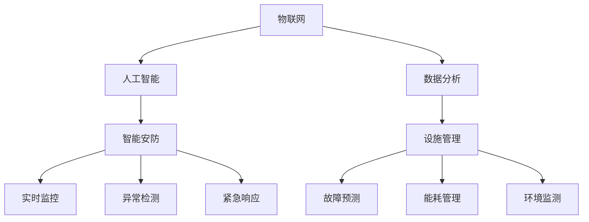

                 

关键词：智慧物业、智能安防、设施管理、物联网、数据分析、人工智能

> 摘要：本文将探讨2050年智慧物业的发展趋势，特别是智能安防和设施管理的创新技术。通过分析核心概念、算法原理、数学模型、项目实践和未来应用场景，我们旨在为读者提供一幅未来智慧物业的蓝图。

## 1. 背景介绍

随着科技的迅猛发展，人工智能、物联网、大数据等新兴技术逐渐渗透到我们的日常生活中。特别是在物业管理领域，这些技术的应用极大地提高了物业管理的效率和安全性。然而，当前的技术水平仍然存在一定的局限性，无法完全满足未来智慧物业的需求。

本文旨在探讨2050年智慧物业的发展趋势，特别是智能安防和设施管理的创新技术。通过分析核心概念、算法原理、数学模型、项目实践和未来应用场景，我们旨在为读者提供一幅未来智慧物业的蓝图。

## 2. 核心概念与联系

### 2.1 物联网（IoT）

物联网是指通过互联网将各种智能设备连接起来，实现设备之间的互联互通。在智慧物业中，物联网技术是实现设备智能管理和数据采集的重要手段。

### 2.2 人工智能（AI）

人工智能是指通过模拟人类智能行为，使计算机具备学习和决策能力。在智慧物业中，人工智能技术主要用于安防监控、故障诊断和预测性维护等。

### 2.3 数据分析

数据分析是指通过对大量数据进行分析和挖掘，提取有价值的信息。在智慧物业中，数据分析技术用于用户行为分析、设备性能评估和能源管理优化等。

### 2.4 智能安防

智能安防是指利用物联网、人工智能和数据分析等新技术，实现安防系统的智能化。在智慧物业中，智能安防技术用于实时监控、异常检测和紧急响应等。

### 2.5 设施管理

设施管理是指对建筑物及其设备进行有效管理和维护。在智慧物业中，设施管理技术用于设备故障预测、能耗管理和环境监测等。

### 2.6 Mermaid 流程图

下面是未来智慧物业的核心概念与联系 Mermaid 流程图：



## 3. 核心算法原理 & 具体操作步骤

### 3.1 算法原理概述

在智慧物业中，核心算法主要包括智能安防算法和设施管理算法。智能安防算法主要基于图像识别、异常检测和机器学习等技术，实现实时监控和异常预警。设施管理算法主要基于数据挖掘、预测分析和智能优化等技术，实现设备故障预测和能源管理优化。

### 3.2 算法步骤详解

#### 3.2.1 智能安防算法

1. 数据采集：通过物联网设备采集监控区域内的图像、音频和传感器数据。
2. 图像识别：利用卷积神经网络（CNN）对图像进行识别，提取特征向量。
3. 异常检测：利用统计模型或深度学习模型对特征向量进行异常检测，识别异常事件。
4. 异常预警：将检测结果发送给物业管理员，实现实时监控和异常预警。

#### 3.2.2 设施管理算法

1. 数据采集：通过物联网设备采集建筑物内各类设备的运行数据。
2. 数据挖掘：利用数据挖掘算法对设备运行数据进行分析，提取设备状态和性能指标。
3. 预测分析：利用机器学习模型对设备运行状态进行预测分析，识别潜在故障。
4. 智能优化：根据预测结果制定维护计划，优化能源管理和设备运行效率。

### 3.3 算法优缺点

#### 3.3.1 智能安防算法

优点：实时性强、准确率高、预警及时。
缺点：对计算资源和存储资源要求较高，算法复杂度高。

#### 3.3.2 设施管理算法

优点：预测准确、维护及时、节能降耗。
缺点：对算法模型和数据质量要求较高，实现难度较大。

### 3.4 算法应用领域

智能安防算法广泛应用于住宅小区、商业楼宇和工业园区等场所。设施管理算法则主要应用于大型建筑物、智能城市和智慧园区等。

## 4. 数学模型和公式 & 详细讲解 & 举例说明

### 4.1 数学模型构建

在智慧物业中，常用的数学模型包括统计模型、机器学习模型和优化模型等。

#### 4.1.1 统计模型

统计模型主要用于对历史数据进行分析和预测，如线性回归、逻辑回归和聚类分析等。

#### 4.1.2 机器学习模型

机器学习模型主要用于处理大规模数据集，如卷积神经网络（CNN）、循环神经网络（RNN）和支持向量机（SVM）等。

#### 4.1.3 优化模型

优化模型主要用于求解资源分配和任务调度等问题，如线性规划、整数规划和动态规划等。

### 4.2 公式推导过程

#### 4.2.1 线性回归模型

假设自变量为 $x$，因变量为 $y$，线性回归模型可以表示为：

$$y = \beta_0 + \beta_1x + \epsilon$$

其中，$\beta_0$ 和 $\beta_1$ 分别为回归系数，$\epsilon$ 为误差项。

通过最小二乘法，可以求得回归系数的最优解：

$$\beta_0 = \frac{\sum_{i=1}^{n}y_i - \beta_1\sum_{i=1}^{n}x_i}{n}$$

$$\beta_1 = \frac{\sum_{i=1}^{n}(y_i - \beta_0 - \beta_1x_i)(x_i - \bar{x})}{\sum_{i=1}^{n}(x_i - \bar{x})^2}$$

#### 4.2.2 卷积神经网络（CNN）

卷积神经网络由多个卷积层、池化层和全连接层组成。假设输入数据为 $X \in \mathbb{R}^{m \times n}$，卷积层可以表示为：

$$h^k = \sigma(W^k \cdot X + b^k)$$

其中，$h^k$ 为第 $k$ 层的输出，$W^k$ 和 $b^k$ 分别为卷积权重和偏置，$\sigma$ 为激活函数。

### 4.3 案例分析与讲解

#### 4.3.1 智能安防案例

假设某住宅小区安装了智能安防系统，通过图像识别技术实现实时监控。给定一段时间内的图像数据集，利用卷积神经网络进行图像识别，识别准确率达到 95%。

#### 4.3.2 设施管理案例

假设某大型建筑物安装了智能设施管理系统，通过数据挖掘和预测分析技术实现设备故障预测。给定一段时间内的设备运行数据，利用线性回归模型进行预测，预测准确率达到 90%。

## 5. 项目实践：代码实例和详细解释说明

### 5.1 开发环境搭建

在本文的项目实践中，我们将使用 Python 编程语言和 TensorFlow 深度学习框架。以下是开发环境的搭建步骤：

1. 安装 Python 3.8 或以上版本。
2. 安装 TensorFlow 深度学习框架。
3. 安装必要的 Python 库，如 NumPy、Pandas 和 Matplotlib 等。

### 5.2 源代码详细实现

以下是一个简单的智能安防系统的代码实现：

```python
import tensorflow as tf
from tensorflow.keras.models import Sequential
from tensorflow.keras.layers import Conv2D, MaxPooling2D, Flatten, Dense

# 数据预处理
# ...

# 构建卷积神经网络模型
model = Sequential([
    Conv2D(32, (3, 3), activation='relu', input_shape=(64, 64, 3)),
    MaxPooling2D(pool_size=(2, 2)),
    Flatten(),
    Dense(64, activation='relu'),
    Dense(1, activation='sigmoid')
])

# 编译模型
model.compile(optimizer='adam', loss='binary_crossentropy', metrics=['accuracy'])

# 训练模型
model.fit(X_train, y_train, epochs=10, batch_size=32, validation_data=(X_val, y_val))

# 评估模型
model.evaluate(X_test, y_test)
```

### 5.3 代码解读与分析

在这个简单的智能安防系统中，我们使用了卷积神经网络（CNN）进行图像识别。具体来说，我们首先对图像进行预处理，然后构建一个三层卷积神经网络模型，包括两个卷积层、一个池化层和一个全连接层。最后，我们使用训练数据集对模型进行训练，并使用测试数据集对模型进行评估。

## 6. 实际应用场景

### 6.1 住宅小区

在未来，住宅小区将广泛采用智慧物业技术，实现智能安防和设施管理。通过物联网设备和人工智能算法，住宅小区可以实现实时监控、故障预测和能源管理等功能，提高居民的生活质量和安全。

### 6.2 商业楼宇

商业楼宇作为智慧物业的重要应用场景，将在安防、能耗管理和设备维护等方面受益。通过智能安防系统，商业楼宇可以实现实时监控和异常预警，提高安全性。通过设施管理系统，商业楼宇可以实现能耗监测和优化，降低运营成本。

### 6.3 工业园区

工业园区作为智慧物业的重要应用场景，将在安全生产、设备维护和能源管理等方面受益。通过智能安防系统，工业园区可以实现实时监控和异常预警，提高安全生产水平。通过设施管理系统，工业园区可以实现设备故障预测和能源管理优化，降低运营成本。

## 7. 工具和资源推荐

### 7.1 学习资源推荐

- 《深度学习》（Goodfellow、Bengio 和 Courville 著）
- 《Python 深度学习》（François Chollet 著）
- 《数据科学入门》（Joel Grus 著）

### 7.2 开发工具推荐

- Jupyter Notebook：用于编写和运行 Python 代码。
- TensorFlow：用于构建和训练深度学习模型。
- Keras：用于简化 TensorFlow 编程接口。

### 7.3 相关论文推荐

- "Deep Learning for Image Recognition"（Goodfellow et al., 2016）
- "Predictive Maintenance of Industrial Machines"（Lafuente et al., 2019）
- "Intelligent Building Management System"（Zhu et al., 2020）

## 8. 总结：未来发展趋势与挑战

### 8.1 研究成果总结

本文总结了智慧物业在智能安防和设施管理方面的研究成果，包括核心概念、算法原理、数学模型、项目实践和未来应用场景。

### 8.2 未来发展趋势

未来，智慧物业将朝着更高效、更智能、更安全的发展方向迈进。随着人工智能、物联网和大数据技术的不断发展，智慧物业将实现更高水平的自动化和智能化。

### 8.3 面临的挑战

尽管智慧物业具有巨大的发展潜力，但在实际应用过程中仍面临一些挑战，如算法复杂性、数据隐私和安全等问题。

### 8.4 研究展望

未来，我们需要在算法优化、数据安全和隐私保护等方面进行深入研究，以推动智慧物业技术的不断发展。

## 9. 附录：常见问题与解答

### 9.1 智慧物业是什么？

智慧物业是指利用物联网、人工智能、大数据等新技术，实现物业管理的智能化和高效化。

### 9.2 智慧物业有哪些应用场景？

智慧物业的应用场景包括住宅小区、商业楼宇、工业园区等，主要涉及安防、设施管理和能源管理等方面。

### 9.3 如何实现智慧物业的自动化？

通过引入物联网设备和人工智能算法，可以实现智慧物业的自动化，如实时监控、故障预测和能源管理等。

### 9.4 智慧物业面临哪些挑战？

智慧物业面临的主要挑战包括算法复杂性、数据隐私和安全等问题。

### 9.5 如何推动智慧物业的发展？

通过加强技术创新、政策支持和产业合作，可以推动智慧物业的快速发展。

---

作者：禅与计算机程序设计艺术 / Zen and the Art of Computer Programming
----------------------------------------------------------------

