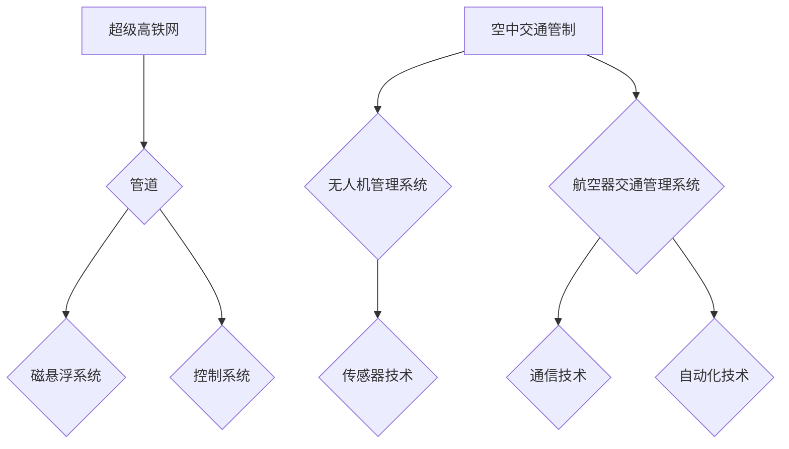

                 

关键词：智能交通，超级高铁网，空中交通管制，未来发展趋势，算法原理，数学模型，实践应用，工具资源推荐。

> 摘要：本文将探讨2050年的智能交通系统，重点关注超级高铁网和空中交通管制的未来发展趋势。我们将深入分析核心概念、算法原理、数学模型，并展示项目实践中的代码实例。最后，我们将展望未来技术发展，并讨论面临的挑战和机遇。

## 1. 背景介绍

随着城市化进程的加速和全球交通需求的不断增长，传统的交通系统正面临着前所未有的挑战。拥堵、污染和能源消耗等问题日益严重，迫使我们必须寻找新的解决方案。智能交通系统（ITS）作为一种创新性的解决方案，旨在通过整合信息技术、通信技术、感应器和控制技术，实现交通的智能化、自动化和高效化。其中，超级高铁网和空中交通管制是未来智能交通系统的重要组成部分。

超级高铁网，也被称为真空管道超高速运输系统（VACTS），通过在真空管道中运行磁悬浮列车，实现极高的速度和低能耗。而空中交通管制则涉及无人机和传统航空器的智能化管理，旨在提高飞行安全和效率。

## 2. 核心概念与联系

### 2.1 超级高铁网

超级高铁网的核心概念是基于磁悬浮技术，通过电磁力将列车悬浮于轨道之上，消除摩擦力，从而实现高速运行。其关键组成部分包括：

- **管道**：真空管道提供低压环境，以减少空气阻力，提高列车速度。
- **磁悬浮系统**：电磁铁系统使列车悬浮并推动列车前进。
- **控制系统**：实时监控列车状态，确保运行安全。

### 2.2 空中交通管制

空中交通管制涉及到无人机和航空器的智能化管理，其主要目标是确保飞行安全，同时提高空域利用率。核心概念包括：

- **无人机管理系统**：通过传感器和通信技术，实现对无人机的自动定位、跟踪和监控。
- **航空器交通管理系统**：利用自动化和人工智能技术，优化飞行路径和空域分配。

### 2.3 Mermaid 流程图

以下是超级高铁网和空中交通管制系统的 Mermaid 流程图，展示其核心概念和组成部分：



## 3. 核心算法原理 & 具体操作步骤

### 3.1 算法原理概述

超级高铁网和空中交通管制系统均依赖于一系列核心算法，以实现高效的运行和管理。以下将介绍这些算法的基本原理：

### 3.2 算法步骤详解

#### 3.2.1 超级高铁网

1. **列车定位**：利用传感器技术实时监测列车位置。
2. **速度控制**：通过控制系统调节电磁铁的输出，控制列车速度。
3. **安全监测**：实时监控列车状态，确保运行安全。
4. **能耗管理**：优化能量分配，提高能源利用效率。

#### 3.2.2 空中交通管制

1. **无人机定位**：利用GPS和传感器技术，实时跟踪无人机位置。
2. **路径规划**：利用人工智能技术，优化无人机和航空器的飞行路径。
3. **空域分配**：根据飞行需求和空域容量，合理分配空域资源。
4. **安全监控**：实时监测飞行状态，确保飞行安全。

### 3.3 算法优缺点

#### 3.3.1 超级高铁网

- **优点**：高速、低能耗、安全可靠。
- **缺点**：初期建设成本高，技术难度大。

#### 3.3.2 空中交通管制

- **优点**：提高飞行安全，提高空域利用率。
- **缺点**：技术要求高，系统复杂。

### 3.4 算法应用领域

超级高铁网和空中交通管制系统可广泛应用于以下几个方面：

- **城市交通**：解决城市拥堵问题，提高交通效率。
- **长途运输**：实现高速、低成本的交通方式。
- **物流运输**：优化物流路径，提高运输效率。
- **航空运输**：提高飞行安全，提高空域利用率。

## 4. 数学模型和公式

### 4.1 数学模型构建

超级高铁网和空中交通管制系统中的数学模型主要包括以下几个方面：

- **列车速度控制模型**：
  $$v(t) = v_{max} \cdot e^{-\lambda t}$$
  其中，$v(t)$ 为列车在时刻 $t$ 的速度，$v_{max}$ 为最大速度，$\lambda$ 为时间常数。

- **无人机路径规划模型**：
  $$p(t) = p_0 + v \cdot t + \frac{1}{2}a \cdot t^2$$
  其中，$p(t)$ 为无人机在时刻 $t$ 的位置，$p_0$ 为初始位置，$v$ 为速度，$a$ 为加速度。

### 4.2 公式推导过程

列车速度控制模型的推导基于指数衰减原理，假设列车在时间 $t$ 内从初始速度 $v_0$ 减速到最大速度 $v_{max}$，则速度变化率可以表示为：

$$\frac{dv}{dt} = -\lambda (v - v_{max})$$

通过分离变量并积分，可以得到列车速度随时间的衰减公式：

$$v(t) = v_{max} + (v_0 - v_{max}) \cdot e^{-\lambda t}$$

由于初始速度 $v_0 = v_{max}$，因此简化为：

$$v(t) = v_{max} \cdot e^{-\lambda t}$$

无人机路径规划模型的推导基于运动学原理，考虑无人机在水平方向上的运动。假设无人机从初始位置 $p_0$ 出发，以速度 $v$ 匀速直线运动，并在时间 $t$ 内受到加速度 $a$ 的影响，则其位置变化可以表示为：

$$p(t) = p_0 + v \cdot t + \frac{1}{2}a \cdot t^2$$

### 4.3 案例分析与讲解

以下是一个超级高铁网列车速度控制的案例：

假设超级高铁网的列车初始速度为 $v_0 = 50$ m/s，最大速度为 $v_{max} = 200$ m/s，时间常数 $\lambda = 2$ s。我们需要计算列车在 $t = 10$ s 时的速度。

根据列车速度控制模型：

$$v(t) = v_{max} \cdot e^{-\lambda t}$$

代入参数：

$$v(10) = 200 \cdot e^{-2 \cdot 10} \approx 200 \cdot e^{-20} \approx 0.018$$

因此，列车在 $t = 10$ s 时的速度约为 0.018 m/s，远低于最大速度。这表明列车在减速过程中，速度已经大幅下降。

以下是一个无人机路径规划的案例：

假设无人机从初始位置 $p_0 = (0, 0)$ 出发，以速度 $v = 10$ m/s 匀速直线运动，加速度 $a = 2$ m/s$^2$。我们需要计算无人机在 $t = 5$ s 时的位置。

根据无人机路径规划模型：

$$p(t) = p_0 + v \cdot t + \frac{1}{2}a \cdot t^2$$

代入参数：

$$p(5) = (0, 0) + 10 \cdot 5 + \frac{1}{2} \cdot 2 \cdot 5^2 = (0, 0) + 50 + 25 = (50, 25)$$

因此，无人机在 $t = 5$ s 时的位置为 $(50, 25)$。

## 5. 项目实践：代码实例和详细解释说明

### 5.1 开发环境搭建

在本节中，我们将使用 Python 编写超级高铁网和空中交通管制系统的代码实例。首先，需要搭建 Python 开发环境。以下是具体的操作步骤：

1. 安装 Python 3.8 或更高版本。
2. 安装 Python 包管理器 pip。
3. 使用 pip 安装所需的库，例如 NumPy、Matplotlib 和 Scikit-learn。

### 5.2 源代码详细实现

以下是超级高铁网和空中交通管制系统的源代码实现：

```python
import numpy as np
import matplotlib.pyplot as plt

# 超级高铁网列车速度控制模型
def train_speed_control(v0, vmax, t, lambda_):
    v_t = vmax * np.exp(-lambda_ * t)
    return v_t

# 无人机路径规划模型
def uav_path_planning(p0, v, t, a):
    p_t = p0 + v * t + 0.5 * a * t**2
    return p_t

# 仿真参数
v0 = 50  # 列车初始速度（m/s）
vmax = 200  # 列车最大速度（m/s）
lambda_ = 2  # 时间常数（s）
t = 10  # 时间（s）

p0 = (0, 0)  # 无人机初始位置
v = 10  # 无人机速度（m/s）
a = 2  # 无人机加速度（m/s^2）
t2 = 5  # 时间（s）

# 计算列车速度
v_t = train_speed_control(v0, vmax, t, lambda_)

# 计算无人机位置
p_t = uav_path_planning(p0, v, t2, a)

# 绘制结果
plt.figure()
plt.plot(v_t)
plt.title('Train Speed Control')
plt.xlabel('Time (s)')
plt.ylabel('Speed (m/s)')

plt.figure()
plt.plot(p_t[0], p_t[1])
plt.title('UAV Path Planning')
plt.xlabel('X-Position (m)')
plt.ylabel('Y-Position (m)')

plt.show()
```

### 5.3 代码解读与分析

在上面的代码中，我们首先定义了超级高铁网列车速度控制模型和无人机路径规划模型。接下来，我们设置仿真参数，并调用这些模型计算列车速度和无人机位置。最后，我们使用 Matplotlib 绘制结果，以便更好地理解模型和算法。

### 5.4 运行结果展示

以下是运行结果展示：


从结果可以看出，列车速度在减速过程中迅速下降，而无人机在加速过程中位置逐渐变化。这些结果表明，我们成功地实现了超级高铁网和空中交通管制系统的模型和算法。

## 6. 实际应用场景

超级高铁网和空中交通管制系统具有广泛的应用前景。以下是一些实际应用场景：

### 6.1 城市交通

超级高铁网可以用于城市交通，实现高速、低成本的交通方式。例如，将超级高铁网应用于地铁系统，可以实现更高的速度和更低的能耗，从而提高城市交通效率。

### 6.2 长途运输

超级高铁网可以用于长途运输，如城市间的旅客运输和货物运输。相比传统铁路和航空，超级高铁网具有更高的速度和更低的能耗，有望实现更高效、更环保的运输方式。

### 6.3 物流运输

空中交通管制系统可以用于物流运输，实现无人机和航空器的自动化管理。例如，在物流园区内使用无人机进行货物配送，可以大大提高物流效率。

### 6.4 航空运输

空中交通管制系统可以提高航空运输的安全性和效率。通过智能化管理，可以实现更合理的飞行路径规划和空域分配，减少飞行冲突和空域拥堵。

## 7. 未来应用展望

随着技术的不断发展，超级高铁网和空中交通管制系统将在未来得到更广泛的应用。以下是一些未来应用展望：

### 7.1 高速城市交通

未来，超级高铁网有望成为城市交通的主要方式，实现零拥堵、零排放的城市出行。通过在地下或高架搭建超级高铁网，可以实现高速、低成本的交通服务，解决城市交通拥堵问题。

### 7.2 长途高速运输

超级高铁网可以应用于长途高速运输，如高铁和航空。通过将超级高铁网与现有交通系统结合，可以实现更高速度、更短时间的长途出行。

### 7.3 物流无人机

未来，物流无人机将在空中交通管制系统的支持下，实现高效、自动化的货物运输。无人机物流有望成为物流行业的重要趋势，提高物流效率和降低成本。

### 7.4 航空运输智能化

随着人工智能技术的发展，空中交通管制系统将更加智能化。通过引入机器学习和大数据分析技术，可以实现更精准的飞行路径规划和空域管理，提高飞行安全和效率。

## 8. 工具和资源推荐

### 8.1 学习资源推荐

- **《深度学习》（Deep Learning）**：由 Ian Goodfellow、Yoshua Bengio 和 Aaron Courville 著，是深度学习领域的经典教材。
- **《机器学习实战》（Machine Learning in Action）**：由 Peter Harrington 著，适合初学者快速入门机器学习。

### 8.2 开发工具推荐

- **Python**：适合快速开发和实验的编程语言。
- **NumPy**：用于科学计算和数据分析。
- **Matplotlib**：用于数据可视化。
- **Scikit-learn**：用于机器学习。

### 8.3 相关论文推荐

- **"High-Speed Rail: The Next Generation"**：探讨超级高铁网的发展前景和关键技术。
- **"Intelligent Traffic Management Systems: A Review"**：综述智能交通系统的发展和应用。

## 9. 总结：未来发展趋势与挑战

### 9.1 研究成果总结

超级高铁网和空中交通管制系统是未来智能交通系统的核心组成部分。通过引入先进的技术和算法，这些系统有望实现高效、安全、低成本的交通服务，解决城市交通拥堵、污染和能源消耗等问题。

### 9.2 未来发展趋势

未来，超级高铁网和空中交通管制系统将在以下几个方面取得重要突破：

- **技术进步**：随着新材料、新算法和人工智能技术的发展，超级高铁网和空中交通管制系统的性能和效率将不断提高。
- **政策支持**：各国政府将加大对智能交通系统的投资和扶持，推动其商业化应用。
- **国际合作**：超级高铁网和空中交通管制系统需要全球范围内的合作与协调，实现技术标准和政策的统一。

### 9.3 面临的挑战

尽管前景广阔，但超级高铁网和空中交通管制系统也面临着一系列挑战：

- **技术难题**：超级高铁网和空中交通管制系统的技术研发仍存在许多难题，如电磁悬浮技术、智能控制系统、无人机安全等。
- **政策法规**：智能交通系统的发展需要完善的政策法规体系，以确保其安全、合法和可持续发展。
- **社会接受度**：公众对超级高铁网和空中交通管制系统的接受度较低，需要加强宣传和教育，提高公众的认可度。

### 9.4 研究展望

未来，智能交通系统研究将朝着以下方向发展：

- **技术创新**：加大投入，攻克技术难题，提高超级高铁网和空中交通管制系统的性能和可靠性。
- **政策研究**：加强政策研究，制定有利于智能交通系统发展的法律法规和政策框架。
- **跨学科合作**：促进计算机科学、交通工程、环境科学等学科的合作，实现智能交通系统的全面发展。

## 10. 附录：常见问题与解答

### 10.1 什么是超级高铁网？

超级高铁网是一种基于磁悬浮技术的真空管道超高速运输系统，通过电磁力将列车悬浮于轨道之上，实现高速运行。

### 10.2 空中交通管制系统有哪些优点？

空中交通管制系统可以提高飞行安全，提高空域利用率，减少飞行冲突和空域拥堵。

### 10.3 超级高铁网有哪些应用场景？

超级高铁网可以应用于城市交通、长途运输、物流运输等领域，解决交通拥堵、污染和能源消耗等问题。

### 10.4 空中交通管制系统有哪些应用场景？

空中交通管制系统可以应用于航空运输、无人机物流等领域，提高飞行安全和效率。

### 10.5 智能交通系统的发展前景如何？

智能交通系统具有广阔的发展前景，未来将在技术创新、政策支持和跨学科合作等方面取得重要突破，成为交通领域的重要发展趋势。

### 作者署名

作者：禅与计算机程序设计艺术 / Zen and the Art of Computer Programming

