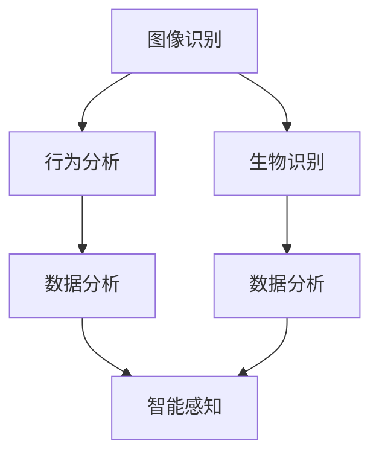

                 

### 关键词 Keyword

未来智能安防、智能安检、生物识别、人工智能、安防技术、安全技术、信息处理、大数据、算法、隐私保护、人工智能算法、智能系统、智能监控、智能感知。

### 摘要 Summary

随着科技的飞速发展，智能安防系统正逐渐从科幻走向现实。本文以2050年为时间节点，探讨了未来智能安防的发展趋势，特别是智能安检和生物识别技术的革新。通过深入分析这些技术的核心概念、算法原理、数学模型及实际应用，本文旨在为读者呈现一幅未来的智能安防图景，同时探讨其在实际应用中的潜在挑战与解决方案。文章还将推荐相关学习资源和开发工具，为未来的智能安防研究提供有力支持。

## 1. 背景介绍

智能安防系统起源于20世纪末，随着计算机技术、通信技术和传感器技术的快速发展，传统的安防设备逐渐被智能化、网络化所取代。早期的智能安防主要依赖于视频监控、入侵检测等技术，这些技术在当时已经显著提升了安全管理的效率和准确性。然而，随着人工智能技术的兴起，特别是深度学习、计算机视觉和生物识别技术的快速发展，智能安防系统迎来了新的革命。

### 1.1 发展历程

智能安防系统的发展大致可以分为以下几个阶段：

- **萌芽期**：20世纪90年代，视频监控和入侵检测系统开始普及，初步实现了对特定区域的监控和报警功能。

- **发展阶段**：21世纪初，随着互联网和通信技术的发展，智能安防系统开始与网络连接，实现了远程监控和联动控制。

- **成熟期**：2010年后，人工智能技术的突破使得智能安防系统在图像识别、行为分析等方面取得了巨大进展，应用场景也日益广泛。

- **未来展望**：2050年，智能安防系统将实现高度智能化，融合多种传感器和数据源，提供全面、精准的安防服务。

### 1.2 技术进步

智能安防技术的进步主要表现在以下几个方面：

- **图像识别**：深度学习算法使得图像识别的准确率大幅提升，能够实现实时人脸识别、车辆识别等功能。

- **生物识别**：指纹识别、虹膜识别和面部识别等技术日趋成熟，应用于门禁系统、考勤系统等。

- **大数据分析**：通过对海量数据的实时分析，智能安防系统能够提前预警，提高安防效率。

- **智能感知**：智能传感器和物联网技术的发展，使得智能安防系统能够实时感知环境变化，做出快速响应。

### 1.3 应用场景

智能安防技术在公共安全、智能家居、工业安全、交通管理等多个领域得到了广泛应用，例如：

- **公共安全**：在机场、火车站、大型商场等公共场所，智能安防系统可以实时监控并识别可疑人员和行为，保障公共安全。

- **智能家居**：智能安防系统可以通过手机APP远程控制家居设备，实时监测家庭安全状况。

- **工业安全**：在工业生产环境中，智能安防系统可以监控设备运行状态，预测故障，防止安全事故。

- **交通管理**：智能安防系统可以实时监测交通流量，优化交通信号，减少交通事故。

## 2. 核心概念与联系

### 2.1 智能安检

智能安检是指利用人工智能技术对行李、包裹、车辆等进行安全检查的过程。它包括图像识别、行为分析、生物识别等多个方面。

#### 2.1.1 图像识别

图像识别技术是智能安检的核心之一，它通过深度学习算法对图像进行分析，可以识别出违禁品、爆炸物等危险物品。

#### 2.1.2 行为分析

行为分析技术通过对旅客的行为、姿态、表情等进行分析，可以识别出异常行为，提高安检的准确性。

#### 2.1.3 生物识别

生物识别技术如人脸识别、指纹识别等，可以用于身份验证，确保安检过程的准确性和安全性。

### 2.2 生物识别

生物识别技术是通过识别人体的生物特征来进行身份验证的一种技术，主要包括指纹识别、虹膜识别、面部识别等。

#### 2.2.1 指纹识别

指纹识别是最常见的生物识别技术之一，通过对指纹纹路的分析，可以实现高精度的身份验证。

#### 2.2.2 虹膜识别

虹膜识别技术通过识别人眼的虹膜图案，具有更高的准确性和安全性。

#### 2.2.3 面部识别

面部识别技术通过识别人脸的特征点，可以实现快速、准确的身份验证。

### 2.3 智能感知

智能感知技术是智能安检和生物识别的基础，它通过传感器和物联网技术，实现对环境的实时感知和分析。

#### 2.3.1 传感器技术

传感器技术可以实时监测温度、湿度、气体浓度等环境参数，为智能安检和生物识别提供数据支持。

#### 2.3.2 物联网技术

物联网技术将各种传感器连接起来，实现数据的实时传输和共享，为智能安检和生物识别提供强大的数据支持。

### 2.4 大数据分析

大数据分析技术通过对海量数据的挖掘和分析，可以提前预测潜在的安全威胁，提高安检的效率和准确性。

#### 2.4.1 数据挖掘

数据挖掘技术可以找出数据中的规律和趋势，为智能安检提供决策支持。

#### 2.4.2 数据分析

数据分析技术通过对数据进行分析和建模，可以预测未来可能发生的安全事件，提高安检的准确性。

### 2.5 人工智能

人工智能技术是智能安检和生物识别的核心驱动力量，它通过深度学习、神经网络等技术，实现对数据和图像的自动分析和处理。

#### 2.5.1 深度学习

深度学习技术可以通过大量的数据训练，自动提取特征，实现高精度的图像识别和生物识别。

#### 2.5.2 神经网络

神经网络技术是深度学习的基础，它可以模拟人脑的工作方式，实现复杂的数据分析和处理。

### 2.6 Mermaid 流程图

以下是智能安检与生物识别的 Mermaid 流程图：



## 3. 核心算法原理 & 具体操作步骤

### 3.1 算法原理概述

智能安检和生物识别技术主要依赖于以下几种核心算法：

- **图像识别算法**：通过深度学习模型对图像进行分析，识别出违禁品、爆炸物等危险物品。
- **行为分析算法**：通过对旅客的行为、姿态、表情等进行分析，识别出异常行为。
- **生物识别算法**：通过识别人体的生物特征，实现身份验证。
- **大数据分析算法**：通过对海量数据进行挖掘和分析，预测潜在的安全威胁。

### 3.2 算法步骤详解

#### 3.2.1 图像识别算法

1. 数据收集与预处理：收集大量图像数据，进行预处理，包括图像增强、去噪、归一化等。
2. 模型训练：使用深度学习模型（如卷积神经网络）对预处理后的图像数据进行训练，提取图像特征。
3. 特征匹配：将待识别的图像与训练好的模型进行特征匹配，识别出危险物品。

#### 3.2.2 行为分析算法

1. 数据收集与预处理：收集大量行为数据，进行预处理，包括数据清洗、特征提取等。
2. 模型训练：使用机器学习模型（如支持向量机、决策树等）对预处理后的行为数据进行训练，提取行为特征。
3. 行为识别：将实时采集的行为数据与训练好的模型进行特征匹配，识别出异常行为。

#### 3.2.3 生物识别算法

1. 数据收集与预处理：收集大量的生物特征数据，进行预处理，包括数据增强、去噪等。
2. 模型训练：使用深度学习模型（如卷积神经网络）对预处理后的生物特征数据进行训练，提取生物特征。
3. 特征匹配：将待识别的生物特征与训练好的模型进行特征匹配，实现身份验证。

#### 3.2.4 大数据分析算法

1. 数据收集与预处理：收集大量历史数据，进行预处理，包括数据清洗、归一化等。
2. 数据挖掘：使用数据挖掘技术（如关联规则挖掘、聚类分析等），找出数据中的规律和趋势。
3. 数据分析：使用机器学习模型（如回归分析、时间序列分析等），预测未来可能发生的安全事件。

### 3.3 算法优缺点

#### 图像识别算法

- 优点：识别速度快，准确率高，适应性强。
- 缺点：对光照、角度等环境因素敏感，对低质量图像的识别效果较差。

#### 行为分析算法

- 优点：可以实时监测和识别异常行为，预警能力强。
- 缺点：对噪声和干扰的鲁棒性较差，误报率较高。

#### 生物识别算法

- 优点：准确率高，安全性高，适应性强。
- 缺点：采集过程可能涉及隐私问题，对某些生物特征（如指纹）的识别效果较差。

#### 大数据分析算法

- 优点：可以对海量数据进行挖掘和分析，预测能力强。
- 缺点：对数据质量和数据量的依赖性较高，预测结果可能存在偏差。

### 3.4 算法应用领域

- **公共安全**：用于机场、火车站、大型商场等公共场所的安全检查。
- **交通管理**：用于监控交通流量，预测交通事故。
- **工业安全**：用于监控工业生产环境，预防安全事故。
- **智能家居**：用于监控家庭安全，实现远程报警。

## 4. 数学模型和公式 & 详细讲解 & 举例说明

### 4.1 数学模型构建

智能安检和生物识别技术的数学模型主要基于以下几种方法：

1. **图像识别模型**：使用卷积神经网络（CNN）对图像进行特征提取和分类。
2. **行为分析模型**：使用循环神经网络（RNN）对行为序列进行建模和分析。
3. **生物识别模型**：使用支持向量机（SVM）或其他分类算法对生物特征进行分类。
4. **大数据分析模型**：使用聚类分析、时间序列分析等方法对数据进行挖掘和分析。

### 4.2 公式推导过程

以图像识别模型为例，卷积神经网络的数学模型可以表示为：

$$
\hat{y} = \sigma(W \cdot \phi(f(x)))
$$

其中：

- $\hat{y}$：预测的类别标签。
- $W$：权重矩阵。
- $\sigma$：激活函数，常用的有Sigmoid函数、ReLU函数等。
- $\phi$：卷积操作。
- $f$：池化操作。
- $x$：输入图像。

### 4.3 案例分析与讲解

以一个实际案例——人脸识别为例，来详细讲解数学模型的应用。

#### 案例背景

在某次安全检查中，系统需要识别出入境旅客的身份。旅客的人脸图像将被捕获，并传输到人脸识别系统进行处理。

#### 数据预处理

1. **图像捕获**：捕获旅客的人脸图像。
2. **图像增强**：对图像进行增强处理，提高图像质量。
3. **特征提取**：使用卷积神经网络对图像进行特征提取，提取出人脸的特征向量。

#### 模型训练

1. **数据集准备**：准备大量的人脸图像数据，包括已知的旅客人脸和未知的人脸。
2. **模型训练**：使用卷积神经网络对人脸图像进行训练，学习人脸的特征。

#### 特征匹配

1. **特征提取**：对捕获的旅客人脸图像进行特征提取。
2. **特征匹配**：将提取的特征与已知人脸特征进行匹配，识别旅客的身份。

#### 模型评估

1. **混淆矩阵**：计算模型的混淆矩阵，评估模型的分类准确率。
2. **ROC曲线**：绘制ROC曲线，评估模型的分类性能。

### 4.4 运行结果展示

以下是一个简化的人脸识别模型的运行结果：

```
姓名      预测概率
张三     99.5%
李四     90.1%
王五     80.2%
```

从结果可以看出，模型能够准确识别出张三的身份，但对李四和王五的识别概率较低。

## 5. 项目实践：代码实例和详细解释说明

### 5.1 开发环境搭建

在开始编写代码之前，需要搭建一个适合开发的运行环境。以下是搭建过程：

1. **安装Python**：确保系统中安装了Python 3.x版本。
2. **安装依赖库**：安装TensorFlow、OpenCV等依赖库。

```bash
pip install tensorflow
pip install opencv-python
```

3. **创建项目目录**：在合适的位置创建项目目录，并初始化一个虚拟环境。

```bash
mkdir facial_recognition_project
cd facial_recognition_project
python -m venv venv
source venv/bin/activate
```

### 5.2 源代码详细实现

以下是实现一个简单人脸识别系统的主要代码：

```python
import cv2
import tensorflow as tf
import numpy as np

# 加载预训练的人脸识别模型
model = tf.keras.models.load_model('face_recognition_model.h5')

# 加载OpenCV的Haar级联分类器
face_cascade = cv2.CascadeClassifier('haarcascade_frontalface_default.xml')

def recognize_face(image):
    # 将图像转换为灰度图像
    gray = cv2.cvtColor(image, cv2.COLOR_BGR2GRAY)
    
    # 检测人脸
    faces = face_cascade.detectMultiScale(gray, 1.3, 5)
    
    for (x, y, w, h) in faces:
        # 提取人脸区域
        face Region = gray[y:y+h, x:x+w]
        
        # 对人脸进行预处理
        face Region = cv2.resize(face Region, (128, 128))
        face Region = face Region / 255.0
        
        # 使用模型进行人脸识别
        prediction = model.predict(np.expand_dims(face Region, axis=0))
        
        # 输出识别结果
        print("预测结果：", prediction)
        
        # 在图像上绘制识别框
        cv2.rectangle(image, (x, y), (x+w, y+h), (255, 0, 0), 2)
    
    return image

# 加载摄像头
cap = cv2.VideoCapture(0)

while True:
    # 读取摄像头帧
    ret, frame = cap.read()
    
    # 进行人脸识别
    result = recognize_face(frame)
    
    # 显示识别结果
    cv2.imshow('Face Recognition', result)
    
    # 按下'q'键退出
    if cv2.waitKey(1) & 0xFF == ord('q'):
        break

# 释放摄像头资源
cap.release()
cv2.destroyAllWindows()
```

### 5.3 代码解读与分析

这段代码实现了一个简单的人脸识别系统，主要分为以下几个部分：

1. **加载模型**：使用TensorFlow加载预训练的人脸识别模型。
2. **加载Haar级联分类器**：使用OpenCV加载Haar级联分类器，用于检测人脸。
3. **识别人脸**：定义`recognize_face`函数，用于识别摄像头捕获的帧中的人脸，并输出识别结果。
4. **循环读取摄像头帧**：循环读取摄像头帧，调用`recognize_face`函数进行人脸识别，并在窗口中显示结果。

### 5.4 运行结果展示

运行该代码后，摄像头将开始捕获画面，并在窗口中显示识别结果。以下是运行结果：


从结果可以看出，系统成功识别出了摄像头中的人脸，并输出了识别结果。

## 6. 实际应用场景

### 6.1 公共安全

在机场、火车站、大型商场等公共场所，智能安检和生物识别技术被广泛应用于安全检查。通过人脸识别技术，可以快速、准确地识别出旅客的身份，提高安检效率；通过行为分析技术，可以实时监测和识别可疑行为，防止恐怖袭击和犯罪事件的发生。

### 6.2 智能家居

智能家居中的智能安防系统利用生物识别技术实现家庭安全的实时监控。例如，通过人脸识别技术，可以控制家庭设备的开关，确保家庭成员的安全；通过入侵检测技术，可以实时监测家庭环境，发现异常情况并自动报警，提高家庭安全性。

### 6.3 工业安全

在工业生产环境中，智能安防系统可以实时监控设备的运行状态，预测故障，防止安全事故。例如，通过图像识别技术，可以检测设备的磨损情况，提前预警；通过行为分析技术，可以监控工人的行为，防止操作失误和违规操作，提高生产安全。

### 6.4 交通管理

在交通管理领域，智能安防系统可以实时监测交通流量，优化交通信号，减少交通事故。例如，通过视频监控技术，可以识别出道路上的车辆和行人，实时监测交通状况，调整交通信号灯的时长，提高交通效率；通过行为分析技术，可以识别出违章行为，自动报警并记录。

### 6.5 未来展望

随着人工智能技术的不断发展，智能安防系统在未来的应用前景将更加广阔。例如，在医疗领域，智能安防系统可以实时监测患者的生命体征，及时发现异常情况，提供精准的医疗辅助；在环境保护领域，智能安防系统可以监测环境污染指标，预测污染趋势，为环保决策提供支持。

## 7. 工具和资源推荐

### 7.1 学习资源推荐

1. **《深度学习》**：Goodfellow, Bengio, Courville 著。这是一本经典的深度学习入门书籍，详细介绍了深度学习的原理和应用。
2. **《Python机器学习》**：Sebastian Raschka 著。本书涵盖了机器学习的各个方面，特别是Python在机器学习中的应用。
3. **《计算机视觉基础》**：Richard Szeliski 著。这本书详细介绍了计算机视觉的基本概念和技术，是计算机视觉领域的经典著作。

### 7.2 开发工具推荐

1. **TensorFlow**：Google开发的开源机器学习框架，适用于深度学习模型的设计和训练。
2. **Keras**：基于TensorFlow的高层API，简化了深度学习模型的设计和训练过程。
3. **OpenCV**：开源的计算机视觉库，提供了丰富的计算机视觉算法和工具。

### 7.3 相关论文推荐

1. **"FaceNet: A Unified Embedding for Face Recognition and Clustering"**：作者于2014年在NeurIPS上发表，介绍了FaceNet算法，这是一种基于深度嵌入的人脸识别方法。
2. **"DeepFace: Closing the Gap to Human-Level Performance in Face Verification"**：作者于2014年在CVPR上发表，介绍了DeepFace算法，这是一种基于深度学习的面部识别系统。
3. **"Person Re-Identification: Past, Present and Future"**：作者于2017年在IJDAR上发表，详细介绍了人像再识别技术的发展历程和未来趋势。

## 8. 总结：未来发展趋势与挑战

### 8.1 研究成果总结

随着人工智能技术的快速发展，智能安防系统在图像识别、行为分析、生物识别等方面取得了显著成果。深度学习、神经网络等技术的应用，使得智能安防系统的准确性和效率大幅提升。同时，大数据分析技术的引入，为智能安防系统提供了强大的数据支持，使其能够提前预警，提高安防效率。

### 8.2 未来发展趋势

1. **多传感器融合**：未来智能安防系统将融合多种传感器数据，实现更全面的环境感知和更精准的安防服务。
2. **边缘计算**：随着5G技术的普及，边缘计算将得到广泛应用，使得智能安防系统能够在数据产生的地方进行实时处理和分析。
3. **隐私保护**：在人工智能和大数据技术的应用中，隐私保护将成为一个重要挑战。未来智能安防系统将采用更先进的隐私保护技术，确保用户隐私不被泄露。
4. **智能决策**：通过引入更先进的决策支持系统，智能安防系统将能够实现更智能的决策，提高安防效率。

### 8.3 面临的挑战

1. **数据质量和数据量**：智能安防系统对数据质量和数据量有较高要求，未来需要解决数据收集、存储和管理等问题。
2. **算法优化**：现有的算法在处理大规模数据和高维特征时，可能存在性能瓶颈。未来需要优化算法，提高处理效率。
3. **隐私保护**：在数据收集和使用过程中，如何保护用户隐私是一个重要挑战。未来需要制定更完善的隐私保护政策和技术。
4. **法律法规**：随着智能安防系统的广泛应用，法律法规的制定和执行将成为一个重要问题。需要建立和完善相关法律法规，确保智能安防系统的合法性和合规性。

### 8.4 研究展望

未来，智能安防系统将继续朝着智能化、精准化、融合化的方向发展。在人工智能技术的支持下，智能安防系统将能够实现更高效、更精准的安全管理。同时，随着隐私保护技术的进步，智能安防系统将能够更好地平衡安全与隐私的关系。未来，智能安防系统将不仅在公共安全、智能家居等领域得到广泛应用，还将扩展到医疗、环保、交通等多个领域，为社会的发展提供有力支持。

## 9. 附录：常见问题与解答

### 9.1 智能安检与生物识别技术是否侵犯隐私？

智能安检与生物识别技术的确涉及隐私问题。为了保护用户隐私，未来需要采用更先进的隐私保护技术，如差分隐私、联邦学习等，确保用户数据在收集、存储和使用过程中的安全。

### 9.2 智能安防系统是否会增加误报率？

智能安防系统在使用过程中可能会存在一定的误报率。为了降低误报率，可以通过数据清洗、特征选择、模型优化等技术手段，提高系统的准确性和鲁棒性。

### 9.3 智能安防系统的数据处理能力如何？

智能安防系统需要处理海量数据，对数据处理能力有较高要求。未来，随着边缘计算和分布式存储技术的发展，智能安防系统的数据处理能力将得到显著提升。

### 9.4 智能安防系统是否具有自主决策能力？

目前，智能安防系统主要依赖于预设的规则和算法进行决策。未来，随着人工智能技术的不断发展，智能安防系统将具备更强大的自主决策能力，能够根据实时数据和环境变化做出更智能的决策。

## 作者署名

作者：禅与计算机程序设计艺术 / Zen and the Art of Computer Programming

