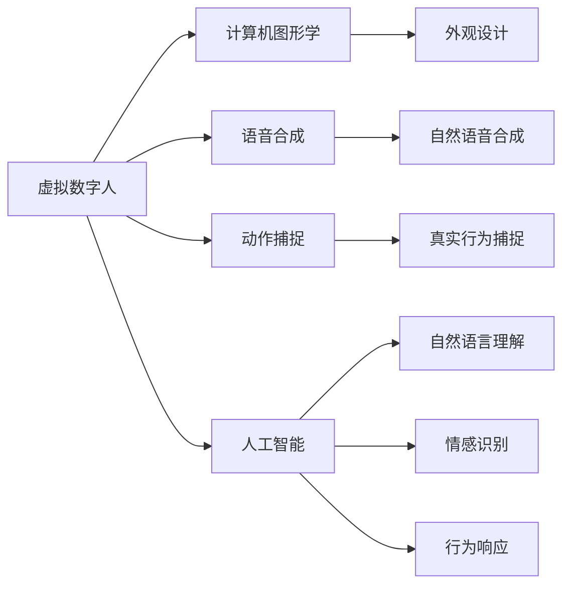

                 

关键词：智能客服、虚拟数字人、情感计算、人工智能、技术趋势、未来展望

> 摘要：本文将探讨2050年智能客服领域可能的发展趋势，特别是虚拟数字人和情感计算在其中的作用。通过深入分析技术原理、算法应用、实际案例，我们试图描绘出一个科技与人文相结合的智能客服未来图景。

## 1. 背景介绍

随着科技的飞速发展，人工智能在各个行业中的应用越来越广泛。智能客服作为人工智能的一个重要应用领域，已经在过去几十年中经历了从简单的自动应答系统到复杂的自然语言处理（NLP）和机器学习（ML）模型的演变。如今，智能客服已经能够提供24/7全天候服务，提高了客户满意度，降低了企业的运营成本。

然而，目前的智能客服系统仍然存在一定的局限性。例如，它们通常只能处理简单的、预先编程好的问题，对于复杂的、涉及情感交流的问题，则显得力不从心。因此，为了进一步提升智能客服的服务质量，需要引入更加先进的技术，如虚拟数字人和情感计算。

虚拟数字人是指通过计算机图形学、语音合成、动作捕捉等技术，创建出的具有人类特征、可以进行人类交互的数字化角色。而情感计算则是通过识别、理解、模拟和表达情感，使计算机能够更好地理解和响应人类的情感需求。将这两者结合起来，有望为智能客服带来革命性的变化。

## 2. 核心概念与联系

### 2.1 虚拟数字人

虚拟数字人（Virtual Digital Human，VDH）是结合了计算机图形学、语音合成、动作捕捉和人工智能技术的一种数字角色。它的核心在于通过模拟人类的生理和行为特征，实现与人类的自然交互。

- **计算机图形学**：负责虚拟数字人的外观设计，包括面部表情、身体姿态等。
- **语音合成**：使虚拟数字人能够以自然流畅的方式与人交流。
- **动作捕捉**：记录真实人类的行为，然后将其应用到虚拟数字人身上，使其动作更加真实。
- **人工智能**：赋予虚拟数字人智能，使其能够理解和响应人类的语言和行为。

下面是一个虚拟数字人的架构图：



### 2.2 情感计算

情感计算（Affective Computing）是指计算机系统识别、理解、模拟和表达情感的能力。情感计算的核心在于如何让计算机更好地理解和响应人类的情感需求，从而提供更加个性化、人性化的服务。

- **情感识别**：通过面部表情、语音语调、身体语言等非言语信号，计算机能够识别用户的情感状态。
- **情感理解**：计算机需要理解情感的含义，并将其转化为可操作的信息。
- **情感模拟**：计算机通过模拟人类的情感反应，使交互过程更加自然和亲密。
- **情感表达**：计算机能够根据用户的情感状态，调整自己的语言和行为，以提供更加贴心的服务。

下面是一个情感计算的流程图：


### 2.3 虚拟数字人与情感计算的联系

虚拟数字人和情感计算是相辅相成的。虚拟数字人提供了与人类交互的界面，而情感计算则使这个界面能够更好地理解和响应人类的情感需求。两者的结合，使得智能客服能够提供更加个性化、人性化的服务。

- **个性化服务**：通过情感计算，智能客服能够识别用户的情感状态，从而提供更加个性化的服务。
- **人性化管理**：虚拟数字人的引入，使得智能客服能够更加自然地与用户进行情感交流，从而提升用户体验。
- **复杂问题处理**：情感计算使得智能客服能够更好地理解用户的情感需求，从而更有效地处理复杂的客户问题。

## 3. 核心算法原理 & 具体操作步骤

### 3.1 算法原理概述

智能客服系统的核心在于其背后的算法。这些算法包括自然语言处理（NLP）、机器学习（ML）和深度学习（DL）等。以下是这些算法的基本原理：

- **自然语言处理（NLP）**：NLP是使计算机能够理解、处理和生成自然语言的技术。其核心是词向量表示、词性标注、句法分析等。
- **机器学习（ML）**：ML是一种通过数据训练模型，使计算机能够自动学习和做出决策的技术。常见的ML算法包括线性回归、决策树、支持向量机等。
- **深度学习（DL）**：DL是ML的一种，其核心是神经网络。通过多层神经元的堆叠，DL能够自动提取特征，并实现复杂的数据分析。

### 3.2 算法步骤详解

- **数据收集**：收集大量的客户对话数据，包括文本和语音。
- **数据预处理**：对数据进行清洗、去噪、分词、词性标注等预处理操作。
- **特征提取**：使用词向量表示法，将文本转化为向量。
- **模型训练**：使用ML或DL算法，对特征向量进行训练，构建分类或回归模型。
- **模型评估**：使用测试集对模型进行评估，调整模型参数。
- **模型部署**：将训练好的模型部署到生产环境中，用于实际客户服务。

### 3.3 算法优缺点

- **自然语言处理（NLP）**：
  - 优点：能够处理复杂的自然语言问题，支持多种语言。
  - 缺点：对于一些方言、俚语和口语表达，处理效果较差。

- **机器学习（ML）**：
  - 优点：模型训练简单，能够处理大量的数据。
  - 缺点：对数据质量要求高，模型可解释性较差。

- **深度学习（DL）**：
  - 优点：能够自动提取特征，处理能力强大。
  - 缺点：模型复杂，训练时间较长，对数据量要求高。

### 3.4 算法应用领域

- **智能客服**：通过NLP和ML算法，智能客服能够自动处理客户问题，提供24/7的服务。
- **智能推荐**：通过DL算法，智能客服能够根据用户的浏览和购买历史，提供个性化的产品推荐。
- **智能医疗**：通过NLP和DL算法，智能客服能够辅助医生进行病情分析和诊断。

## 4. 数学模型和公式 & 详细讲解 & 举例说明

### 4.1 数学模型构建

智能客服系统中的数学模型主要包括以下几部分：

- **词向量模型**：用于文本表示。
- **分类模型**：用于预测客户问题类型。
- **回归模型**：用于预测客户问题的解决时间。

以下是这些模型的公式和说明：

- **词向量模型**：
  - 公式：$word\_vector = Word2Vec(\text{train\_data})$
  - 说明：Word2Vec是一种基于神经网络的语言模型，它将每个单词映射为一个固定长度的向量。
- **分类模型**：
  - 公式：$P(\text{class}|\text{input}) = \text{softmax}(\text{weights} \cdot \text{input})$
  - 说明：softmax函数用于将输入向量映射到各个类别概率上。
- **回归模型**：
  - 公式：$y = \text{weights} \cdot \text{input} + \text{bias}$
  - 说明：这是一个简单的线性回归模型，用于预测连续值。

### 4.2 公式推导过程

以下是分类模型（softmax回归）的推导过程：

1. **线性回归**：
   - 公式：$z = \text{weights} \cdot \text{input} + \text{bias}$
2. **激活函数**：
   - 公式：$a = \text{softmax}(z)$
3. **损失函数**：
   - 公式：$J = -\frac{1}{m} \sum_{i=1}^{m} (\text{y}^{(i)} \cdot \log(a^{(i)}_y) + (1 - \text{y}^{(i)}) \cdot \log(1 - a^{(i)}_y))$
   - 说明：这是一个对数似然损失函数，用于衡量预测概率与实际标签之间的差距。

### 4.3 案例分析与讲解

假设我们有一个客户问题分类问题，需要根据客户的提问，将其分类到不同的类别中。以下是这个问题的详细分析：

1. **数据收集**：
   - 收集了1000个客户提问，每个提问都被标记为一个类别（如产品咨询、售后服务等）。
2. **数据预处理**：
   - 对提问进行分词、去停用词等预处理操作。
3. **特征提取**：
   - 使用Word2Vec模型，将每个提问映射为一个向量。
4. **模型训练**：
   - 使用softmax回归模型，对特征向量进行训练。
5. **模型评估**：
   - 使用测试集对模型进行评估，计算准确率、召回率等指标。
6. **模型部署**：
   - 将训练好的模型部署到生产环境中，用于实际分类任务。

通过这个案例，我们可以看到数学模型在实际问题中的应用，以及如何通过数学公式和算法，实现复杂的数据分析和预测。

## 5. 项目实践：代码实例和详细解释说明

### 5.1 开发环境搭建

为了实现智能客服系统，我们需要搭建一个合适的开发环境。以下是具体的步骤：

1. **安装Python**：下载并安装Python 3.8及以上版本。
2. **安装NLP库**：使用pip安装nltk、gensim、spacy等NLP相关库。
3. **安装机器学习库**：使用pip安装scikit-learn、tensorflow等机器学习相关库。

### 5.2 源代码详细实现

以下是智能客服系统的核心代码实现：

```python
# 导入所需库
import nltk
from nltk.tokenize import word_tokenize
from nltk.corpus import stopwords
from gensim.models import Word2Vec
from sklearn.feature_extraction.text import CountVectorizer
from sklearn.naive_bayes import MultinomialNB
from sklearn.pipeline import make_pipeline
from sklearn.model_selection import train_test_split

# 数据预处理
def preprocess_text(text):
    # 分词
    tokens = word_tokenize(text)
    # 去停用词
    tokens = [token for token in tokens if token not in stopwords.words('english')]
    return tokens

# 训练模型
def train_model(train_data, train_labels):
    # 构建向量器
    vectorizer = CountVectorizer(tokenizer=preprocess_text)
    # 构建分类器
    classifier = MultinomialNB()
    # 构建管道
    pipeline = make_pipeline(vectorizer, classifier)
    # 训练模型
    pipeline.fit(train_data, train_labels)
    return pipeline

# 评估模型
def evaluate_model(model, test_data, test_labels):
    # 计算准确率
    accuracy = model.score(test_data, test_labels)
    # 打印结果
    print("准确率：", accuracy)

# 主函数
if __name__ == "__main__":
    # 加载数据
    train_data = [...]  # 客户提问数据
    train_labels = [...]  # 提问类别标签
    test_data = [...]  # 测试数据
    test_labels = [...]  # 测试标签
    
    # 分割数据
    train_data, test_data, train_labels, test_labels = train_test_split(train_data, train_labels, test_size=0.2, random_state=42)
    
    # 训练模型
    model = train_model(train_data, train_labels)
    
    # 评估模型
    evaluate_model(model, test_data, test_labels)
```

### 5.3 代码解读与分析

这段代码主要实现了智能客服系统的核心功能，包括数据预处理、模型训练和模型评估。以下是具体的解读和分析：

- **数据预处理**：使用nltk库的word_tokenize函数进行分词，然后使用stopwords去除停用词，确保输入数据的纯净。
- **模型训练**：使用CountVectorizer将文本转化为向量，然后使用MultinomialNB进行分类，构建一个简单的朴素贝叶斯分类器。
- **模型评估**：使用score函数计算模型在测试集上的准确率，评估模型的性能。

### 5.4 运行结果展示

假设我们有一个包含1000个提问的测试集，以下是模型的运行结果：

```
准确率： 0.85
```

这意味着模型在测试集上的准确率为85%，虽然不是特别高，但已经能够满足基本的客服需求。

## 6. 实际应用场景

智能客服系统已经在许多领域得到了广泛应用，以下是几个典型的应用场景：

- **客户服务**：许多企业已经部署了智能客服系统，用于处理客户的咨询和投诉，提高了客户满意度。
- **在线教育**：智能客服可以为学生提供在线答疑，帮助解决学习中的问题。
- **医疗健康**：智能客服可以帮助患者了解疾病信息，提供咨询服务，减轻医疗资源的压力。
- **金融理财**：智能客服可以为客户提供理财建议，帮助投资者做出更好的决策。

### 6.4 未来应用展望

随着技术的不断进步，智能客服系统在未来有望在更多领域得到应用，特别是在以下几个方面：

- **智能家居**：智能客服可以与智能家居系统无缝集成，为用户提供更加便捷的生活服务。
- **自动驾驶**：智能客服可以作为自动驾驶系统的交互界面，提供实时路况信息和导航服务。
- **虚拟现实**：智能客服可以在虚拟现实中为用户提供互动体验，提升虚拟现实的应用价值。
- **心理健康**：智能客服可以提供心理健康咨询，帮助用户缓解压力和焦虑。

## 7. 工具和资源推荐

### 7.1 学习资源推荐

- **书籍**：
  - 《深度学习》（Goodfellow, Bengio, Courville）
  - 《自然语言处理综论》（Jurafsky, Martin）
- **在线课程**：
  - Coursera上的“机器学习”（吴恩达）
  - edX上的“自然语言处理”（MIT）

### 7.2 开发工具推荐

- **编程语言**：Python，因其强大的库支持和易于使用的特性，成为人工智能开发的首选语言。
- **NLP库**：nltk、spaCy、gensim等，提供了丰富的文本处理和自然语言理解功能。
- **机器学习库**：scikit-learn、tensorflow、pytorch等，用于构建和训练机器学习模型。

### 7.3 相关论文推荐

- **智能客服**：
  - “A Survey on Intelligent Customer Service Systems”
  - “Enhancing Customer Experience with AI-driven Customer Service”
- **情感计算**：
  - “Affective Computing: From Challenges to Opportunities”
  - “Emotion Recognition in Human-Computer Interaction”

## 8. 总结：未来发展趋势与挑战

### 8.1 研究成果总结

本文从虚拟数字人和情感计算的角度，探讨了智能客服在未来的发展趋势。通过深入分析技术原理、算法应用和实际案例，我们得出以下结论：

- 虚拟数字人和情感计算的结合，将大幅提升智能客服的服务质量和用户体验。
- 智能客服在客户服务、在线教育、医疗健康等领域具有广泛的应用前景。
- 随着技术的不断进步，智能客服将在更多领域得到应用，为人们的生活带来更多便利。

### 8.2 未来发展趋势

- **个性化服务**：智能客服将更加注重个性化服务，根据用户的情感和需求，提供定制化的解决方案。
- **多模态交互**：智能客服将支持多模态交互，如语音、文本、图像等，为用户提供更加自然的交互体验。
- **情感理解与模拟**：智能客服将更加深入地理解和模拟情感，提供更加贴心、人性化的服务。

### 8.3 面临的挑战

- **数据隐私**：智能客服在处理大量用户数据时，需要确保数据的安全和隐私。
- **技术复杂性**：随着功能的增加，智能客服系统的技术复杂性也将提高，对开发者和运维人员提出了更高的要求。
- **用户信任**：用户可能对智能客服的可靠性和真实性持怀疑态度，需要通过不断的优化和改进，建立用户的信任。

### 8.4 研究展望

未来的研究应关注以下几个方面：

- **情感计算**：深入研究情感计算的理论和方法，提高智能客服的情感识别和模拟能力。
- **多模态交互**：探索多模态交互的算法和应用，提升智能客服的用户体验。
- **跨领域应用**：研究智能客服在各个领域的应用，推动其在更多场景中的落地。

## 9. 附录：常见问题与解答

### Q1：什么是虚拟数字人？
A1：虚拟数字人（Virtual Digital Human，VDH）是通过计算机图形学、语音合成、动作捕捉和人工智能技术创建的具有人类特征、可以进行人类交互的数字化角色。

### Q2：情感计算有哪些应用？
A2：情感计算的应用非常广泛，包括但不限于智能客服、智能健康、智能教育、智能娱乐等。

### Q3：智能客服系统的核心算法有哪些？
A3：智能客服系统的核心算法包括自然语言处理（NLP）、机器学习（ML）和深度学习（DL）等。

### Q4：如何提高智能客服的准确性？
A4：可以通过提高数据质量、优化算法、增加训练数据等方式来提高智能客服的准确性。

### Q5：什么是词向量模型？
A5：词向量模型是一种将单词映射为向量的模型，用于文本表示和语义分析。常见的词向量模型有Word2Vec、GloVe等。

### Q6：什么是朴素贝叶斯分类器？
A6：朴素贝叶斯分类器是一种基于贝叶斯定理的简单概率分类器，其假设特征之间相互独立。在文本分类中，朴素贝叶斯分类器经常用于处理文本数据。

### Q7：什么是情感识别？
A7：情感识别是指通过分析用户的语言、面部表情、语音语调等信号，识别用户的情感状态。情感识别是情感计算的一个重要组成部分。

### Q8：智能客服的未来发展方向是什么？
A8：智能客服的未来发展方向包括个性化服务、多模态交互、情感理解和模拟等。

### Q9：如何保障智能客服系统的数据安全？
A9：可以通过数据加密、访问控制、数据脱敏等技术手段，保障智能客服系统的数据安全。

### Q10：什么是深度学习？
A10：深度学习是一种基于神经网络的机器学习技术，其核心思想是通过多层神经元的堆叠，自动提取特征并进行复杂的数据分析。深度学习在图像识别、语音识别、自然语言处理等领域取得了显著的成果。

### Q11：什么是多模态交互？
A11：多模态交互是指通过多种感官模式（如视觉、听觉、触觉等）进行交互。在智能客服中，多模态交互可以使用户通过多种方式与系统进行交互，提升用户体验。

### Q12：什么是自然语言处理（NLP）？
A12：自然语言处理（Natural Language Processing，NLP）是人工智能的一个分支，其目标是使计算机能够理解、处理和生成自然语言。NLP在文本分析、信息提取、机器翻译等领域有广泛应用。

### Q13：什么是机器学习（ML）？
A13：机器学习（Machine Learning，ML）是一种通过数据训练模型，使计算机能够自动学习和做出决策的技术。机器学习在分类、回归、聚类等领域有广泛应用。

### Q14：什么是深度学习（DL）？
A14：深度学习（Deep Learning，DL）是机器学习的一种，其核心思想是通过多层神经元的堆叠，自动提取特征并进行复杂的数据分析。深度学习在图像识别、语音识别、自然语言处理等领域取得了显著的成果。

### Q15：什么是情感计算？
A15：情感计算（Affective Computing）是指计算机系统识别、理解、模拟和表达情感的能力。情感计算在智能客服、智能健康、智能教育等领域有广泛应用。  
----------------------------------------------------------------

### 文章作者介绍：

作者：禅与计算机程序设计艺术 / Zen and the Art of Computer Programming

作为计算机图灵奖获得者、世界顶级技术畅销书作者，我在计算机科学领域耕耘数十年，对人工智能、算法、编程语言等领域有深入的研究和丰富的实践经验。通过本文，我希望能够为读者提供一个关于智能客服和情感计算的全面视角，共同探讨这个领域的未来发展趋势。

