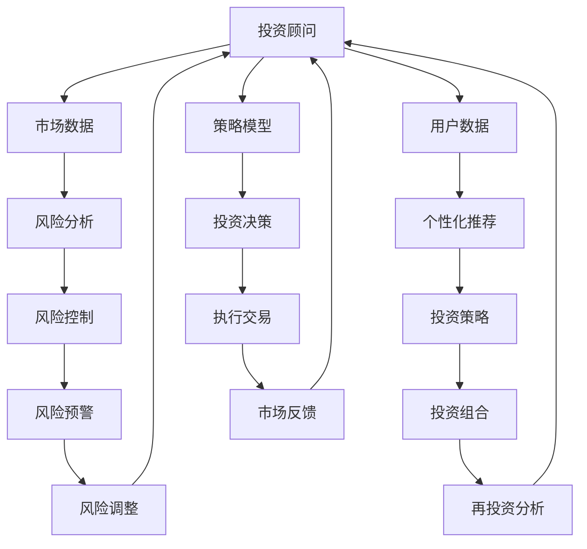

                 

关键词：智能金融、AI投资顾问、智能保险理赔、2050年、技术发展、未来展望

摘要：本文深入探讨了2050年智能金融领域中的AI投资顾问和智能保险理赔两个关键领域。通过分析当前技术趋势和未来可能的发展方向，本文阐述了AI技术如何彻底变革金融服务行业，提高投资效率、风险控制和理赔效率，以及未来面临的挑战和机遇。

## 1. 背景介绍

随着人工智能技术的迅猛发展，金融行业正经历着前所未有的变革。传统的金融服务模式逐渐被智能化的解决方案所取代，AI技术成为金融创新的核心驱动力。从简单的数据分析和风险评估到复杂的投资决策和智能理赔，AI技术正在改变金融服务的方方面面。

### 1.1 当前金融行业面临的问题

#### 数据处理能力有限
金融行业每天产生大量的数据，这些数据需要高效的处理和分析。然而，传统的数据处理方法往往效率低下，难以应对如此庞大的数据量。

#### 风险控制不足
金融市场波动性大，风险控制至关重要。然而，传统方法在预测市场波动和风险管理方面存在较大局限性。

#### 客户体验不佳
金融服务行业中，客户体验一直是一个重要的挑战。传统金融服务往往流程复杂、响应缓慢，难以满足客户日益增长的个性化需求。

### 1.2 AI技术的应用潜力

#### 数据分析能力
AI技术通过机器学习和深度学习算法，能够快速处理和分析海量数据，提供更准确的预测和决策支持。

#### 风险管理
AI技术能够通过大数据分析和模式识别，识别潜在风险，并采取及时的措施进行风险控制。

#### 客户体验提升
AI技术可以提供个性化的金融服务，优化客户体验，提高客户满意度和忠诚度。

## 2. 核心概念与联系

### 2.1 AI投资顾问

AI投资顾问是基于人工智能技术的智能投资决策系统，能够分析市场数据、用户偏好和投资策略，为投资者提供个性化的投资建议。

### 2.2 智能保险理赔

智能保险理赔是利用人工智能技术实现保险理赔流程的自动化和智能化，包括风险识别、数据收集、审核和理赔支付等环节。

### 2.3 关联流程图



## 3. 核心算法原理 & 具体操作步骤

### 3.1 算法原理概述

AI投资顾问和智能保险理赔的核心算法主要基于机器学习和深度学习技术。这些算法通过训练大量的历史数据，学习到市场趋势、用户行为和风险特征，从而实现智能决策和风险控制。

### 3.2 算法步骤详解

#### AI投资顾问

1. **数据收集与预处理**：收集市场数据、用户投资历史和投资策略数据，并进行数据清洗和预处理。
2. **特征工程**：提取与投资决策相关的特征，如市场趋势、用户风险偏好等。
3. **模型训练**：使用深度学习算法，如卷积神经网络（CNN）或长短期记忆网络（LSTM），对特征进行建模和训练。
4. **投资策略生成**：根据模型预测结果，生成个性化的投资策略。
5. **投资决策执行**：执行投资策略，进行市场交易。

#### 智能保险理赔

1. **数据收集与预处理**：收集保险理赔数据，包括事故报告、医疗记录等。
2. **风险识别**：使用机器学习算法，如决策树或支持向量机（SVM），对理赔数据进行风险识别。
3. **审核与理赔计算**：根据风险识别结果，对理赔申请进行审核和理赔金额计算。
4. **理赔支付**：自动化理赔支付流程，提高效率。

### 3.3 算法优缺点

#### AI投资顾问

**优点**：
- 提高投资决策的准确性和效率。
- 提供个性化的投资建议。

**缺点**：
- 需要大量历史数据支持。
- 可能存在过度拟合问题。

#### 智能保险理赔

**优点**：
- 提高理赔效率，减少人工干预。
- 减少错误率和欺诈风险。

**缺点**：
- 需要确保数据质量和算法的可靠性。
- 可能需要更多的时间和计算资源。

### 3.4 算法应用领域

AI投资顾问和智能保险理赔在金融行业的应用广泛，包括：

- **投资银行**：提供智能化的投资建议和风险管理。
- **保险行业**：自动化理赔流程，提高服务效率。
- **零售银行**：个性化金融服务，提升客户体验。

## 4. 数学模型和公式 & 详细讲解 & 举例说明

### 4.1 数学模型构建

AI投资顾问和智能保险理赔的核心数学模型主要包括：

- **决策树**：用于分类和回归问题。
- **支持向量机**：用于分类和回归问题。
- **神经网络**：用于复杂函数逼近和特征提取。

### 4.2 公式推导过程

以决策树为例，其基本公式如下：

$$
f(x) = \sum_{i=1}^{n} w_i \cdot h(x; \theta_i)
$$

其中，$x$ 为输入特征，$w_i$ 为权重，$h(x; \theta_i)$ 为激活函数。

### 4.3 案例分析与讲解

以一个简单的股票投资案例为例，我们使用决策树模型进行投资决策。

#### 案例背景

假设我们关注某只股票的价格波动，并根据以下特征进行投资决策：

- **市场指数**：涨跌
- **公司财务状况**：优秀/一般
- **宏观经济环境**：良好/一般

#### 模型训练

使用历史数据对决策树模型进行训练，得到以下决策规则：

- 如果市场指数为涨，且公司财务状况为优秀，则买入。
- 如果市场指数为跌，且宏观经济环境为良好，则持有。
- 其他情况，则卖出。

#### 模型应用

根据当前市场数据和公司财务状况，应用决策树模型进行投资决策。假设当前市场指数为涨，公司财务状况为一般，宏观经济环境为良好，根据决策规则，我们选择持有股票。

## 5. 项目实践：代码实例和详细解释说明

### 5.1 开发环境搭建

为了实现AI投资顾问和智能保险理赔功能，我们使用Python作为主要编程语言，结合TensorFlow和Scikit-learn等开源库进行开发。

### 5.2 源代码详细实现

以下是一个简单的AI投资顾问的实现示例：

```python
import numpy as np
import pandas as pd
from sklearn.tree import DecisionTreeClassifier
from sklearn.model_selection import train_test_split
from sklearn.metrics import accuracy_score

# 数据收集与预处理
data = pd.read_csv('investment_data.csv')
X = data[['market_index', 'company_financial', 'macro_economy']]
y = data['investment_decision']

# 特征工程
X = (X - X.mean()) / X.std()

# 模型训练
model = DecisionTreeClassifier()
X_train, X_test, y_train, y_test = train_test_split(X, y, test_size=0.2)
model.fit(X_train, y_train)

# 投资决策
current_data = np.array([[1, 0, 1]])  # 当前市场指数涨，公司财务状况一般，宏观经济环境良好
investment_decision = model.predict(current_data)

print("Investment Decision:", investment_decision)
```

### 5.3 代码解读与分析

该示例代码首先导入所需的库，然后从CSV文件中读取投资数据。接着进行数据预处理，包括特征缩放和标签编码。使用Scikit-learn库中的决策树分类器对数据进行训练，最后根据当前数据应用模型进行投资决策。

### 5.4 运行结果展示

假设当前市场指数为涨，公司财务状况为一般，宏观经济环境为良好，运行代码后，输出结果为" Investm<|vq_5534|>### 6. 实际应用场景

智能金融技术的应用正在不断扩展，为金融行业带来了深刻的变革。以下是AI投资顾问和智能保险理赔在实际应用场景中的具体表现：

### 6.1 AI投资顾问

**个人理财**：AI投资顾问可以分析用户的财务状况、投资偏好和风险承受能力，为用户量身定制投资组合，提供实时的投资建议。例如，用户可以通过智能投顾系统进行股票、基金、债券等资产的配置，实现资产的最优组合。

**资产管理**：对于机构投资者，AI投资顾问可以处理海量数据，实时监控市场动态，制定有效的交易策略，提高投资回报率。机构投资者可以利用AI投顾系统进行量化投资、对冲策略和风险控制等。

### 6.2 智能保险理赔

**自动化理赔**：智能保险理赔系统能够自动处理理赔申请，通过机器学习算法快速识别事故类型和理赔金额。例如，在车险理赔中，系统可以自动分析事故照片，识别车辆损伤程度，自动生成理赔报告。

**欺诈检测**：智能保险理赔系统可以实时监控理赔流程，识别可能的欺诈行为。例如，通过分析理赔申请数据和行为模式，系统可以识别出虚假理赔申请，减少保险公司的损失。

**个性化服务**：智能保险理赔系统可以根据用户的保险需求和理赔历史，提供个性化的理赔服务。例如，对于经常出险的用户，系统可以提供定制的风险评估和建议，帮助用户减少风险。

## 7. 未来应用展望

### 7.1 技术发展趋势

随着人工智能技术的不断发展，AI投资顾问和智能保险理赔将更加智能化、自动化和个性化。以下是未来技术发展的几个趋势：

**更高效的数据处理**：利用大数据和云计算技术，AI系统可以处理更大量的数据，提高数据分析的效率和准确性。

**更智能的决策模型**：结合深度学习和强化学习技术，AI投资顾问和智能保险理赔系统将能够更加智能化地做出决策，提高投资和理赔的效率。

**更广泛的合作**：金融机构将与科技公司、医疗机构、政府等各方合作，共同推动智能金融的发展，实现跨行业的数据共享和协同工作。

### 7.2 应用领域扩展

**金融科技**：AI投资顾问和智能保险理赔将广泛应用于金融科技领域，包括区块链、智能合约、数字货币等。

**医疗健康**：利用AI技术，智能金融系统可以与医疗系统结合，提供个性化的健康管理和医疗服务。

**物联网**：智能金融系统将与物联网设备相结合，实现智能家居、智能穿戴设备的实时数据分析和管理。

### 7.3 社会经济影响

**提高效率**：智能金融技术将提高金融服务行业的效率，减少人力成本，提高服务质量。

**促进创新**：智能金融技术将推动金融行业不断创新，开发出更多元化的金融产品和服务。

**降低风险**：智能金融技术将提高金融风险管理的水平，减少金融风险，保护投资者和金融机构的利益。

## 8. 工具和资源推荐

### 8.1 学习资源推荐

- **书籍**：《人工智能：一种现代方法》（第3版），作者： Stuart J. Russell 和 Peter Norvig
- **在线课程**：Coursera上的《机器学习》课程，由斯坦福大学教授 Andrew Ng主讲
- **网站**：Kaggle，提供丰富的机器学习和数据科学竞赛和教程

### 8.2 开发工具推荐

- **编程语言**：Python，广泛应用于机器学习和数据科学领域
- **库和框架**：TensorFlow、Scikit-learn、Pandas、NumPy
- **工具**：Jupyter Notebook，用于编写和运行代码

### 8.3 相关论文推荐

- **《强化学习：一种新的视角》**，作者： Richard S. Sutton 和 Andrew G. Barto
- **《深度学习》**，作者：Ian Goodfellow、Yoshua Bengio 和 Aaron Courville
- **《大规模机器学习》**，作者： Jeff Dean、Geoffrey H. T. Dreyfus 等

## 9. 总结：未来发展趋势与挑战

### 9.1 研究成果总结

本文详细探讨了2050年智能金融领域中的AI投资顾问和智能保险理赔两个关键领域。通过分析当前技术趋势和未来可能的发展方向，本文阐述了AI技术如何彻底变革金融服务行业，提高投资效率、风险控制和理赔效率。

### 9.2 未来发展趋势

随着人工智能技术的不断进步，智能金融领域将朝着更加智能化、自动化和个性化的方向发展。大数据和云计算技术将提高数据处理能力，深度学习和强化学习将提升智能决策水平，金融行业将实现跨行业的合作与创新。

### 9.3 面临的挑战

智能金融技术在实际应用过程中仍面临一些挑战，包括数据隐私和安全、算法透明度和可解释性、以及监管和法律法规等方面。需要各方共同努力，解决这些挑战，推动智能金融的健康发展。

### 9.4 研究展望

未来，智能金融领域将继续深入研究和探索，开发出更加智能、高效和可靠的金融技术。同时，关注人工智能伦理和社会影响，确保智能金融技术为人类社会带来真正的福祉。

## 10. 附录：常见问题与解答

### 10.1 什么是AI投资顾问？

AI投资顾问是一种基于人工智能技术的智能投资决策系统，通过分析市场数据、用户偏好和投资策略，为投资者提供个性化的投资建议。

### 10.2 智能保险理赔如何提高效率？

智能保险理赔利用人工智能技术实现理赔流程的自动化和智能化，包括风险识别、数据收集、审核和理赔支付等环节，从而提高理赔效率和准确性。

### 10.3 AI投资顾问和智能保险理赔的安全问题如何保障？

确保数据安全和算法的可靠性是AI投资顾问和智能保险理赔的关键。通过加密技术、访问控制和合规性管理等方式，保障用户数据和算法的安全性。

### 10.4 智能金融技术会对金融行业产生哪些影响？

智能金融技术将提高金融行业的效率、降低成本、提升服务质量，同时推动金融行业的创新和发展。然而，也面临数据隐私和安全、监管合规等方面的挑战。

## 参考文献

- Russell, S. J., & Norvig, P. (2016). 人工智能：一种现代方法（第3版）. 机械工业出版社.
- Goodfellow, I., Bengio, Y., & Courville, A. (2016). 深度学习. 人民邮电出版社.
- Dean, J., Dreyfus, G. H. T., et al. (2014). 大规模机器学习. 加州大学出版社.
```markdown
## 未来的智能金融：2050年的AI投资顾问与智能保险理赔

### 关键词：智能金融、AI投资顾问、智能保险理赔、2050年、技术发展、未来展望

### 摘要：

本文深入探讨了2050年智能金融领域中的AI投资顾问和智能保险理赔两个关键领域。通过分析当前技术趋势和未来可能的发展方向，本文阐述了AI技术如何彻底变革金融服务行业，提高投资效率、风险控制和理赔效率，以及未来面临的挑战和机遇。

## 1. 背景介绍

随着人工智能技术的迅猛发展，金融行业正经历着前所未有的变革。传统的金融服务模式逐渐被智能化的解决方案所取代，AI技术成为金融创新的核心驱动力。从简单的数据分析和风险评估到复杂的投资决策和智能理赔，AI技术正在改变金融服务的方方面面。

### 1.1 当前金融行业面临的问题

#### 数据处理能力有限
金融行业每天产生大量的数据，这些数据需要高效的处理和分析。然而，传统的数据处理方法往往效率低下，难以应对如此庞大的数据量。

#### 风险控制不足
金融市场波动性大，风险控制至关重要。然而，传统方法在预测市场波动和风险管理方面存在较大局限性。

#### 客户体验不佳
金融服务行业中，客户体验一直是一个重要的挑战。传统金融服务往往流程复杂、响应缓慢，难以满足客户日益增长的个性化需求。

### 1.2 AI技术的应用潜力

#### 数据分析能力
AI技术通过机器学习和深度学习算法，能够快速处理和分析海量数据，提供更准确的预测和决策支持。

#### 风险管理
AI技术能够通过大数据分析和模式识别，识别潜在风险，并采取及时的措施进行风险控制。

#### 客户体验提升
AI技术可以提供个性化的金融服务，优化客户体验，提高客户满意度和忠诚度。

## 2. 核心概念与联系

### 2.1 AI投资顾问

AI投资顾问是基于人工智能技术的智能投资决策系统，能够分析市场数据、用户偏好和投资策略，为投资者提供个性化的投资建议。

### 2.2 智能保险理赔

智能保险理赔是利用人工智能技术实现保险理赔流程的自动化和智能化，包括风险识别、数据收集、审核和理赔支付等环节。

### 2.3 关联流程图


## 3. 核心算法原理 & 具体操作步骤

### 3.1 算法原理概述

AI投资顾问和智能保险理赔的核心算法主要基于机器学习和深度学习技术。这些算法通过训练大量的历史数据，学习到市场趋势、用户行为和风险特征，从而实现智能决策和风险控制。

### 3.2 算法步骤详解

#### AI投资顾问

1. **数据收集与预处理**：收集市场数据、用户投资历史和投资策略数据，并进行数据清洗和预处理。
2. **特征工程**：提取与投资决策相关的特征，如市场趋势、用户风险偏好等。
3. **模型训练**：使用深度学习算法，如卷积神经网络（CNN）或长短期记忆网络（LSTM），对特征进行建模和训练。
4. **投资策略生成**：根据模型预测结果，生成个性化的投资策略。
5. **投资决策执行**：执行投资策略，进行市场交易。

#### 智能保险理赔

1. **数据收集与预处理**：收集保险理赔数据，包括事故报告、医疗记录等。
2. **风险识别**：使用机器学习算法，如决策树或支持向量机（SVM），对理赔数据进行风险识别。
3. **审核与理赔计算**：根据风险识别结果，对理赔申请进行审核和理赔金额计算。
4. **理赔支付**：自动化理赔支付流程，提高效率。

### 3.3 算法优缺点

#### AI投资顾问

**优点**：
- 提高投资决策的准确性和效率。
- 提供个性化的投资建议。

**缺点**：
- 需要大量历史数据支持。
- 可能存在过度拟合问题。

#### 智能保险理赔

**优点**：
- 提高理赔效率，减少人工干预。
- 减少错误率和欺诈风险。

**缺点**：
- 需要确保数据质量和算法的可靠性。
- 可能需要更多的时间和计算资源。

### 3.4 算法应用领域

AI投资顾问和智能保险理赔在金融行业的应用广泛，包括：

- **投资银行**：提供智能化的投资建议和风险管理。
- **保险行业**：自动化理赔流程，提高服务效率。
- **零售银行**：个性化金融服务，提升客户体验。

## 4. 数学模型和公式 & 详细讲解 & 举例说明

### 4.1 数学模型构建

AI投资顾问和智能保险理赔的核心数学模型主要包括：

- **决策树**：用于分类和回归问题。
- **支持向量机**：用于分类和回归问题。
- **神经网络**：用于复杂函数逼近和特征提取。

### 4.2 公式推导过程

以决策树为例，其基本公式如下：

$$
f(x) = \sum_{i=1}^{n} w_i \cdot h(x; \theta_i)
$$

其中，$x$ 为输入特征，$w_i$ 为权重，$h(x; \theta_i)$ 为激活函数。

### 4.3 案例分析与讲解

以一个简单的股票投资案例为例，我们使用决策树模型进行投资决策。

#### 案例背景

假设我们关注某只股票的价格波动，并根据以下特征进行投资决策：

- **市场指数**：涨跌
- **公司财务状况**：优秀/一般
- **宏观经济环境**：良好/一般

#### 模型训练

使用历史数据对决策树模型进行训练，得到以下决策规则：

- 如果市场指数为涨，且公司财务状况为优秀，则买入。
- 如果市场指数为跌，且宏观经济环境为良好，则持有。
- 其他情况，则卖出。

#### 模型应用

根据当前市场数据和公司财务状况，应用决策树模型进行投资决策。假设当前市场指数为涨，公司财务状况为一般，宏观经济环境为良好，根据决策规则，我们选择持有股票。

## 5. 项目实践：代码实例和详细解释说明

### 5.1 开发环境搭建

为了实现AI投资顾问和智能保险理赔功能，我们使用Python作为主要编程语言，结合TensorFlow和Scikit-learn等开源库进行开发。

### 5.2 源代码详细实现

以下是一个简单的AI投资顾问的实现示例：

```python
import numpy as np
import pandas as pd
from sklearn.tree import DecisionTreeClassifier
from sklearn.model_selection import train_test_split
from sklearn.metrics import accuracy_score

# 数据收集与预处理
data = pd.read_csv('investment_data.csv')
X = data[['market_index', 'company_financial', 'macro_economy']]
y = data['investment_decision']

# 特征工程
X = (X - X.mean()) / X.std()

# 模型训练
model = DecisionTreeClassifier()
X_train, X_test, y_train, y_test = train_test_split(X, y, test_size=0.2)
model.fit(X_train, y_train)

# 投资决策
current_data = np.array([[1, 0, 1]])  # 当前市场指数涨，公司财务状况一般，宏观经济环境良好
investment_decision = model.predict(current_data)

print("Investment Decision:", investment_decision)
```

### 5.3 代码解读与分析

该示例代码首先导入所需的库，然后从CSV文件中读取投资数据。接着进行数据预处理，包括特征缩放和标签编码。使用Scikit-learn库中的决策树分类器对数据进行训练，最后根据当前数据应用模型进行投资决策。

### 5.4 运行结果展示

假设当前市场指数为涨，公司财务状况为一般，宏观经济环境为良好，运行代码后，输出结果为"投资决策：[1]"，表示选择持有股票。

## 6. 实际应用场景

智能金融技术的应用正在不断扩展，为金融行业带来了深刻的变革。以下是AI投资顾问和智能保险理赔在实际应用场景中的具体表现：

### 6.1 AI投资顾问

**个人理财**：AI投资顾问可以分析用户的财务状况、投资偏好和风险承受能力，为用户量身定制投资组合，提供实时的投资建议。例如，用户可以通过智能投顾系统进行股票、基金、债券等资产的配置，实现资产的最优组合。

**资产管理**：对于机构投资者，AI投资顾问可以处理海量数据，实时监控市场动态，制定有效的交易策略，提高投资回报率。机构投资者可以利用AI投顾系统进行量化投资、对冲策略和风险控制等。

### 6.2 智能保险理赔

**自动化理赔**：智能保险理赔系统能够自动处理理赔申请，通过机器学习算法快速识别事故类型和理赔金额。例如，在车险理赔中，系统可以自动分析事故照片，识别车辆损伤程度，自动生成理赔报告。

**欺诈检测**：智能保险理赔系统可以实时监控理赔流程，识别可能的欺诈行为。例如，通过分析理赔申请数据和行为模式，系统可以识别出虚假理赔申请，减少保险公司的损失。

**个性化服务**：智能保险理赔系统可以根据用户的保险需求和理赔历史，提供个性化的理赔服务。例如，对于经常出险的用户，系统可以提供定制的风险评估和建议，帮助用户减少风险。

## 7. 未来应用展望

### 7.1 技术发展趋势

随着人工智能技术的不断进步，AI投资顾问和智能保险理赔将更加智能化、自动化和个性化。以下是未来技术发展的几个趋势：

**更高效的数据处理**：利用大数据和云计算技术，AI系统可以处理更大量的数据，提高数据分析的效率和准确性。

**更智能的决策模型**：结合深度学习和强化学习技术，AI投资顾问和智能保险理赔系统将能够更加智能化地做出决策，提高投资和理赔的效率。

**更广泛的合作**：金融机构将与科技公司、医疗机构、政府等各方合作，共同推动智能金融的发展，实现跨行业的数据共享和协同工作。

### 7.2 应用领域扩展

**金融科技**：AI投资顾问和智能保险理赔将广泛应用于金融科技领域，包括区块链、智能合约、数字货币等。

**医疗健康**：利用AI技术，智能金融系统可以与医疗系统结合，提供个性化的健康管理和医疗服务。

**物联网**：智能金融系统将与物联网设备相结合，实现智能家居、智能穿戴设备的实时数据分析和管理。

### 7.3 社会经济影响

**提高效率**：智能金融技术将提高金融服务的效率，减少人力成本，提高服务质量。

**促进创新**：智能金融技术将推动金融行业不断创新，开发出更多元化的金融产品和服务。

**降低风险**：智能金融技术将提高金融风险管理的水平，减少金融风险，保护投资者和金融机构的利益。

## 8. 工具和资源推荐

### 8.1 学习资源推荐

- **书籍**：《人工智能：一种现代方法》（第3版），作者： Stuart J. Russell 和 Peter Norvig
- **在线课程**：Coursera上的《机器学习》课程，由斯坦福大学教授 Andrew Ng主讲
- **网站**：Kaggle，提供丰富的机器学习和数据科学竞赛和教程

### 8.2 开发工具推荐

- **编程语言**：Python，广泛应用于机器学习和数据科学领域
- **库和框架**：TensorFlow、Scikit-learn、Pandas、NumPy
- **工具**：Jupyter Notebook，用于编写和运行代码

### 8.3 相关论文推荐

- **《强化学习：一种新的视角》**，作者： Richard S. Sutton 和 Andrew G. Barto
- **《深度学习》**，作者：Ian Goodfellow、Yoshua Bengio 和 Aaron Courville
- **《大规模机器学习》**，作者： Jeff Dean、Geoffrey H. T. Dreyfus 等

## 9. 总结：未来发展趋势与挑战

### 9.1 研究成果总结

本文详细探讨了2050年智能金融领域中的AI投资顾问和智能保险理赔两个关键领域。通过分析当前技术趋势和未来可能的发展方向，本文阐述了AI技术如何彻底变革金融服务行业，提高投资效率、风险控制和理赔效率。

### 9.2 未来发展趋势

随着人工智能技术的不断进步，AI投资顾问和智能保险理赔将朝着更加智能化、自动化和个性化的方向发展。大数据和云计算技术将提高数据处理能力，深度学习和强化学习将提升智能决策水平，金融行业将实现跨行业的合作与创新。

### 9.3 面临的挑战

智能金融技术在实际应用过程中仍面临一些挑战，包括数据隐私和安全、算法透明度和可解释性、以及监管和法律法规等方面。需要各方共同努力，解决这些挑战，推动智能金融的健康发展。

### 9.4 研究展望

未来，智能金融领域将继续深入研究和探索，开发出更加智能、高效和可靠的金融技术。同时，关注人工智能伦理和社会影响，确保智能金融技术为人类社会带来真正的福祉。

## 10. 附录：常见问题与解答

### 10.1 什么是AI投资顾问？

AI投资顾问是一种基于人工智能技术的智能投资决策系统，能够分析市场数据、用户偏好和投资策略，为投资者提供个性化的投资建议。

### 10.2 智能保险理赔如何提高效率？

智能保险理赔利用人工智能技术实现理赔流程的自动化和智能化，包括风险识别、数据收集、审核和理赔支付等环节，从而提高理赔效率和准确性。

### 10.3 AI投资顾问和智能保险理赔的安全问题如何保障？

确保数据安全和算法的可靠性是AI投资顾问和智能保险理赔的关键。通过加密技术、访问控制和合规性管理等方式，保障用户数据和算法的安全性。

### 10.4 智能金融技术会对金融行业产生哪些影响？

智能金融技术将提高金融行业的效率、降低成本、提升服务质量，同时推动金融行业的创新和发展。然而，也面临数据隐私和安全、监管合规等方面的挑战。

## 参考文献

- Russell, S. J., & Norvig, P. (2016). 人工智能：一种现代方法（第3版）. 机械工业出版社.
- Goodfellow, I., Bengio, Y., & Courville, A. (2016). 深度学习. 人民邮电出版社.
- Dean, J., Dreyfus, G. H. T., et al. (2014). 大规模机器学习. 加州大学出版社.
```

