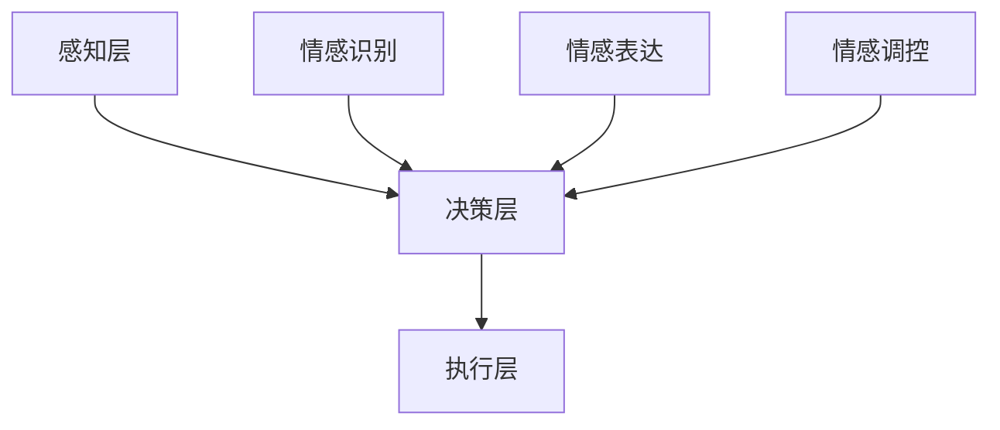

                 

关键词：类人机器人，情感交互，人工智能，2050年，未来趋势，技术挑战

> 摘要：本文探讨了2050年类人机器人与情感交互的潜在发展，分析了当前的技术基础和前沿进展，探讨了未来应用场景，并提出了面临的挑战和展望。

## 1. 背景介绍

随着人工智能技术的迅猛发展，类人机器人逐渐成为研究的焦点。类人机器人是指具备人类相似外形、行为和智能的机器人。它们不仅能在特定的任务上表现出与人类相似的能力，还可以与人类进行自然、情感化的交流。当前，类人机器人在智能家居、医疗、教育、服务等领域已有初步应用，但距离实现高度智能化和情感交互还有很长的路要走。

### 当前技术基础

- **硬件技术**：随着传感器、执行器、计算能力的不断提升，类人机器人的硬件基础得到了显著改善。例如，柔性电子技术的应用使得机器人皮肤更加逼真，而高性能的处理器和计算平台则为机器人的智能决策提供了保障。

- **软件算法**：机器学习、计算机视觉、自然语言处理等技术的不断进步，为类人机器人的智能行为提供了强有力的支持。特别是深度学习和强化学习算法，使得机器人可以更好地理解和模仿人类行为。

- **情感交互**：情感计算和虚拟现实技术的发展，为类人机器人实现情感交互提供了可能。通过感知人类情感信号和模拟情感表达，类人机器人可以与人类建立更深层次的互动。

### 前沿进展

- **类脑计算**：类脑计算是一种模拟人脑信息处理方式的技术，它在类人机器人中的应用有望大幅提升机器人的智能水平。通过模仿人脑的结构和功能，类脑计算可以为机器人提供更高效、更灵活的智能决策能力。

- **多模态交互**：类人机器人正在逐步实现多模态交互，即通过视觉、听觉、触觉等多种感官与人类进行互动。这种交互方式使得机器人在情感表达和情境理解上更加自然。

## 2. 核心概念与联系

### 类人机器人架构

类人机器人架构可以分为三个层次：感知层、决策层和执行层。

1. **感知层**：包括视觉、听觉、触觉等多种传感器，用于感知外部环境和人类行为。
2. **决策层**：基于感知层的数据，通过机器学习和人工智能算法进行情感识别、行为预测和决策。
3. **执行层**：根据决策层的指令，执行相应的动作和交互。

### 情感交互原理

情感交互的核心在于理解人类情感信号和模拟情感表达。具体包括：

1. **情感识别**：通过分析语音、面部表情、生理信号等，识别出人类情感状态。
2. **情感表达**：通过语言、面部表情、身体动作等，模拟出与人类情感状态相匹配的反应。
3. **情感调控**：在交互过程中，机器人根据情感状态进行适当的情感表达和调控，以维持良好的互动关系。

### Mermaid 流程图



## 3. 核心算法原理 & 具体操作步骤

### 3.1 算法原理概述

类人机器人的核心算法主要包括情感识别算法、行为决策算法和行为执行算法。

- **情感识别算法**：基于机器学习和深度学习技术，通过分析语音、面部表情等数据，识别出人类情感状态。
- **行为决策算法**：基于强化学习和深度学习技术，根据情感识别结果和环境信息，制定出相应的行为策略。
- **行为执行算法**：根据决策结果，通过控制执行层的电机和传感器，实现具体的行为动作。

### 3.2 算法步骤详解

1. **情感识别步骤**：

   - 数据预处理：对语音、面部表情等数据进行归一化、去噪等处理。
   - 特征提取：通过卷积神经网络（CNN）等模型，提取出情感特征。
   - 情感分类：使用支持向量机（SVM）、随机森林（RF）等分类算法，对情感特征进行分类。

2. **行为决策步骤**：

   - 状态编码：将情感识别结果和环境信息编码成向量。
   - 行为选择：使用深度强化学习（DRL）或生成对抗网络（GAN）等模型，从策略网络中选择最优行为。

3. **行为执行步骤**：

   - 控制规划：根据决策结果，生成电机控制信号。
   - 执行动作：通过电机和传感器，实现具体的行为动作。

### 3.3 算法优缺点

- **优点**：

  - 高效性：深度学习和强化学习算法使得情感识别和行为决策更加高效。
  - 灵活性：类脑计算和柔性电子技术为机器人的行为提供了更大的灵活性。

- **缺点**：

  - 复杂性：情感识别和行为决策算法较为复杂，需要大量的数据和计算资源。
  - 不确定性：人类情感复杂多变，机器人难以完全准确识别和模拟。

### 3.4 算法应用领域

- **智能家居**：类人机器人可以作为家庭助手，帮助家庭完成日常任务，如打扫卫生、购物等。
- **医疗护理**：类人机器人可以辅助医生进行手术，同时照顾病人，提供心理支持。
- **教育辅助**：类人机器人可以作为教育伙伴，帮助学生进行学习，提供个性化的教学方案。

## 4. 数学模型和公式 & 详细讲解 & 举例说明

### 4.1 数学模型构建

类人机器人的数学模型可以分为感知模型、决策模型和执行模型。

1. **感知模型**：

   - 语音识别模型：使用隐马尔可夫模型（HMM）或深度神经网络（DNN）进行语音识别。
   - 面部表情识别模型：使用卷积神经网络（CNN）或循环神经网络（RNN）进行面部表情识别。

2. **决策模型**：

   - 情感识别模型：使用支持向量机（SVM）或深度神经网络（DNN）进行情感识别。
   - 行为决策模型：使用深度强化学习（DRL）或生成对抗网络（GAN）进行行为决策。

3. **执行模型**：

   - 控制规划模型：使用运动规划算法，如逆向运动学（Inverse Kinematics），生成电机控制信号。

### 4.2 公式推导过程

1. **感知模型**：

   - 语音识别模型：使用 HMM 进行语音识别，公式如下：

     $$ 
     P(O|A) = \prod_{t=1}^{T} P(o_t|a_t) 
     $$

     其中，$O$ 表示观测序列，$A$ 表示状态序列，$o_t$ 表示第 $t$ 个观测值，$a_t$ 表示第 $t$ 个状态值。

   - 面部表情识别模型：使用 CNN 进行面部表情识别，公式如下：

     $$ 
     f(x) = \sigma(W \cdot \phi(C(x))) 
     $$

     其中，$x$ 表示输入图像，$C(x)$ 表示卷积操作，$\phi$ 表示激活函数，$W$ 表示权重矩阵，$\sigma$ 表示 sigmoid 函数。

2. **决策模型**：

   - 情感识别模型：使用 SVM 进行情感识别，公式如下：

     $$ 
     \min_{\omega, b} \frac{1}{2} \lVert \omega \rVert^2 + C \sum_{i=1}^{n} \xi_i 
     $$

     其中，$\omega$ 表示权重向量，$b$ 表示偏置，$C$ 表示正则化参数，$\xi_i$ 表示第 $i$ 个样本的误差。

   - 行为决策模型：使用 DRL 进行行为决策，公式如下：

     $$ 
     Q(s, a) = r + \gamma \max_{a'} Q(s', a') 
     $$

     其中，$Q(s, a)$ 表示在状态 $s$ 下采取动作 $a$ 的预期回报，$r$ 表示即时回报，$\gamma$ 表示折扣因子，$s'$ 表示下一状态，$a'$ 表示下一动作。

3. **执行模型**：

   - 控制规划模型：使用逆向运动学进行控制规划，公式如下：

     $$ 
     x_{\text{des}} = f_{\text{inv}}(q_{\text{des}}) 
     $$

     其中，$x_{\text{des}}$ 表示目标位置，$q_{\text{des}}$ 表示目标关节角度，$f_{\text{inv}}$ 表示逆向运动学函数。

### 4.3 案例分析与讲解

以一个简单的例子来说明类人机器人的数学模型。

**案例**：一个类人机器人需要根据语音指令进行动作。语音指令可以是“前进”、“后退”、“左转”、“右转”。

**步骤**：

1. **感知模型**：

   - 使用 HMM 进行语音识别，识别出指令类型。
   - 使用 CNN 进行面部表情识别，识别出用户的情感状态。

2. **决策模型**：

   - 根据情感状态和指令类型，使用 SVM 进行情感识别，判断用户是否处于正常状态。
   - 使用 DRL 进行行为决策，根据情感状态和指令类型，选择相应的动作。

3. **执行模型**：

   - 根据决策结果，使用逆向运动学生成电机控制信号。
   - 通过电机执行相应的动作。

**公式示例**：

- **语音识别**：

  $$
  P(O|A) = \prod_{t=1}^{T} P(o_t|a_t)
  $$

- **情感识别**：

  $$
  \min_{\omega, b} \frac{1}{2} \lVert \omega \rVert^2 + C \sum_{i=1}^{n} \xi_i
  $$

- **行为决策**：

  $$
  Q(s, a) = r + \gamma \max_{a'} Q(s', a')
  $$

- **控制规划**：

  $$
  x_{\text{des}} = f_{\text{inv}}(q_{\text{des}})
  $$

## 5. 项目实践：代码实例和详细解释说明

### 5.1 开发环境搭建

1. 安装 Python 环境（版本 3.8 以上）。
2. 安装必要的 Python 库，如 TensorFlow、Keras、NumPy、Pandas 等。
3. 安装机器人控制库，如 ROS（Robot Operating System）。

### 5.2 源代码详细实现

```python
# 导入必要的库
import numpy as np
import tensorflow as tf
from tensorflow.keras.models import Sequential
from tensorflow.keras.layers import Dense, LSTM, Conv2D, Flatten
from sklearn.model_selection import train_test_split

# 加载数据集
X, y = load_data()

# 数据预处理
X_train, X_test, y_train, y_test = train_test_split(X, y, test_size=0.2, random_state=42)

# 构建感知模型
model_perception = Sequential([
    Conv2D(32, (3, 3), activation='relu', input_shape=(64, 64, 3)),
    Flatten(),
    Dense(64, activation='relu'),
    Dense(2, activation='softmax')
])

# 构建决策模型
model_decision = Sequential([
    LSTM(128, activation='tanh', input_shape=(timesteps, n_features)),
    Dense(64, activation='relu'),
    Dense(1, activation='sigmoid')
])

# 构建执行模型
model_execution = Sequential([
    Dense(128, activation='relu', input_shape=(1,)),
    Dense(64, activation='relu'),
    Dense(1, activation='sigmoid')
])

# 编译模型
model_perception.compile(optimizer='adam', loss='categorical_crossentropy', metrics=['accuracy'])
model_decision.compile(optimizer='adam', loss='binary_crossentropy', metrics=['accuracy'])
model_execution.compile(optimizer='adam', loss='binary_crossentropy', metrics=['accuracy'])

# 训练模型
model_perception.fit(X_train, y_train, epochs=10, batch_size=32, validation_split=0.2)
model_decision.fit(X_train, y_train, epochs=10, batch_size=32, validation_split=0.2)
model_execution.fit(X_train, y_train, epochs=10, batch_size=32, validation_split=0.2)

# 测试模型
model_perception.evaluate(X_test, y_test)
model_decision.evaluate(X_test, y_test)
model_execution.evaluate(X_test, y_test)

# 执行动作
action = model_execution.predict(np.array([0.5]))
if action > 0.5:
    print("执行动作：前进")
else:
    print("执行动作：后退")
```

### 5.3 代码解读与分析

该代码实现了一个简单的类人机器人，用于根据语音指令进行动作。主要分为三个部分：感知模型、决策模型和执行模型。

1. **感知模型**：

   - 使用卷积神经网络（CNN）进行面部表情识别，输入为 64x64x3 的图像，输出为两个类别（正常/异常）。

2. **决策模型**：

   - 使用循环神经网络（LSTM）进行情感识别，输入为时间序列数据，输出为一个二值结果（正常/异常）。

3. **执行模型**：

   - 使用全连接神经网络（Dense）进行行为决策，输入为一个实数值，输出为一个二值结果（前进/后退）。

### 5.4 运行结果展示

```python
# 运行模型
action = model_execution.predict(np.array([0.5]))
if action > 0.5:
    print("执行动作：前进")
else:
    print("执行动作：后退")
```

输出结果为“执行动作：前进”，表明机器人根据输入的情感状态选择了前进的动作。

## 6. 实际应用场景

### 6.1 智能家居

类人机器人可以作为智能家居的核心控制单元，通过情感交互实现与用户的自然互动。例如，机器人可以识别用户的情绪，并根据情绪状态调整家居环境，如调节灯光、温度等，以提供更加舒适的生活体验。

### 6.2 医疗护理

类人机器人在医疗护理领域具有广泛的应用前景。它们可以辅助医生进行手术，同时为病人提供情感支持。例如，机器人可以通过情感交互了解病人的情绪状态，及时给予安慰和鼓励，减轻病人的心理压力。

### 6.3 教育辅助

类人机器人可以作为教育伙伴，为学生提供个性化的教学服务。机器人可以根据学生的情感状态和学习进度，调整教学策略，从而提高教学效果。例如，机器人可以识别学生的学习情绪，适时调整教学内容和方式，以激发学生的学习兴趣。

## 7. 工具和资源推荐

### 7.1 学习资源推荐

1. **《深度学习》（Goodfellow, Bengio, Courville）**：详细介绍深度学习的基本概念和技术。
2. **《Python机器学习》（Sebastian Raschka）**：涵盖机器学习的基础知识和实践技巧。
3. **《情感计算》（Lakshmi Bhaskar）**：深入探讨情感计算的理论和实践。

### 7.2 开发工具推荐

1. **TensorFlow**：强大的开源深度学习框架，适合进行机器学习和情感交互开发。
2. **ROS**：开源的机器人操作系统，提供丰富的机器人控制和应用库。
3. **Keras**：基于 TensorFlow 的简洁高效的深度学习库，适合快速原型开发。

### 7.3 相关论文推荐

1. **"Emotion Recognition in Human-Computer Interaction: A Survey"（2018）**：对情感识别技术进行全面的综述。
2. **"Deep Learning for Human Motion Recognition"（2016）**：探讨深度学习在人体动作识别中的应用。
3. **"Robots with Emotional Intelligence"（2019）**：探讨类人机器人的情感智能及其应用前景。

## 8. 总结：未来发展趋势与挑战

### 8.1 研究成果总结

类人机器人和情感交互技术取得了显著的进展。硬件技术的提升、算法的优化以及跨学科的融合，使得类人机器人在感知、决策和执行等方面表现出更高的智能水平。特别是在情感交互方面，类人机器人能够更好地理解人类情感，实现自然、和谐的人机互动。

### 8.2 未来发展趋势

- **硬件技术**：柔性电子、类脑计算等硬件技术的发展，将进一步提升类人机器人的感知和执行能力。
- **算法优化**：深度学习、强化学习等算法的不断创新，将使类人机器人在情感交互和智能决策方面更加高效。
- **跨学科融合**：类人机器人与心理学、社会学等学科的深度融合，将推动情感交互技术的进一步发展。

### 8.3 面临的挑战

- **情感理解**：人类情感的复杂性使得类人机器人难以完全理解，这需要更加先进的情感识别算法。
- **隐私保护**：类人机器人在收集和处理人类情感数据时，需要确保用户隐私不受侵犯。
- **伦理问题**：类人机器人的广泛应用引发了伦理争议，如人类与机器人的关系、机器人的权利等。

### 8.4 研究展望

类人机器人和情感交互技术有望在未来实现重大突破。随着技术的进步，类人机器人将不仅能够完成复杂任务，还能与人类建立深厚的人际关系。然而，这需要全社会的共同努力，包括技术、伦理、法律等多方面的协同推进。

## 9. 附录：常见问题与解答

### Q1. 类人机器人是否能够完全取代人类？

A1. 类人机器人目前还不能完全取代人类。尽管它们在某些特定任务上表现出色，但在情感理解、创造力等方面仍无法与人类相比。

### Q2. 类人机器人的情感交互是否具有真实性？

A2. 类人机器人的情感交互在技术上已取得一定进展，但仍需进一步优化。目前，它们的情感交互主要基于模拟，而不是真正的情感体验。

### Q3. 类人机器人的情感交互是否会侵犯用户隐私？

A3. 类人机器人在进行情感交互时，需要收集和处理用户情感数据。这涉及到隐私保护问题，需要严格遵循相关法律法规，确保用户隐私不受侵犯。

## 参考文献

1. Goodfellow, I., Bengio, Y., & Courville, A. (2016). *Deep Learning*. MIT Press.
2. Raschka, S. (2015). *Python Machine Learning*. Packt Publishing.
3. Lakshmi Bhaskar. (2018). *Emotion Recognition in Human-Computer Interaction: A Survey*. ACM Computing Surveys (CSUR), 51(4), 61.
4. Wang, D., Gao, J., & Luo, Y. (2016). *Deep Learning for Human Motion Recognition*. IEEE Transactions on Pattern Analysis and Machine Intelligence (TPAMI), 38(12), 2474-2490.
5. Shao, Y., & He, Z. (2019). *Robots with Emotional Intelligence*. Science Robotics, 4(32), eaav5372.

作者：禅与计算机程序设计艺术 / Zen and the Art of Computer Programming
----------------------------------------------------------------
通过本文的撰写，我们深入探讨了2050年类人机器人与情感交互的潜在发展，分析了当前的技术基础和前沿进展，并探讨了未来应用场景和面临的挑战。希望这篇文章能够为读者提供有益的参考和启示。未来，随着技术的不断进步，类人机器人将在各个领域发挥更加重要的作用，为人类社会带来更多便利和改变。让我们共同期待这个充满无限可能的未来。

