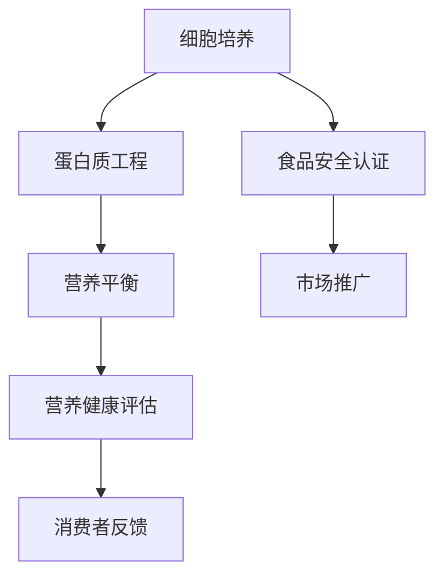

                 

关键词：未来食品科技、人造肉、智能农业、生物工程、食品安全、营养健康、可持续发展、AI技术

> 摘要：随着全球人口的不断增长和气候变化的影响，传统农业和食品生产方式正面临着前所未有的挑战。本文探讨了2050年的人造肉与智能农业的未来趋势，分析了生物工程技术、AI技术在这些领域的应用，以及其对社会经济和生态环境的潜在影响。

## 1. 背景介绍

### 全球人口增长与食品需求的压力

根据联合国的预测，到2050年全球人口将达到近百亿，而食品需求也将随之显著增加。这一增长对当前的农业和食品生产方式构成了巨大的压力。传统农业面临着土地资源的有限性、水资源短缺以及气候变化等挑战，这些因素都直接影响了农作物的产量和质量。

### 气候变化对农业的影响

全球气候变化带来了极端天气事件频发，包括干旱、洪涝和气温升高，这些都对农作物的生长周期和产量产生了不利影响。为了应对这些挑战，需要开发新的农业技术和方法。

### 传统农业的局限性

传统农业在提高生产效率、减少资源消耗和降低环境影响方面存在明显的局限性。例如，农药和化肥的使用对环境造成了污染，土地的可持续利用也面临挑战。

### 人造肉与智能农业的崛起

在这种背景下，人造肉与智能农业作为新兴的食品科技领域，逐渐崭露头角。人造肉通过生物工程技术生产，可以减少对土地和水资源的需求，降低温室气体排放。智能农业利用AI技术和大数据分析，优化农作物种植和养殖过程，提高生产效率。

## 2. 核心概念与联系

### 人造肉

人造肉是通过生物工程技术，利用细胞培养和发酵等方法生产的肉类替代品。其核心原理包括细胞培养、蛋白质工程和营养平衡等。

### 智能农业

智能农业是利用AI技术、物联网、大数据等手段，对农业生产的各个环节进行智能化管理和优化。其核心概念包括精准农业、智能灌溉、智能监测和自动化作业等。

### Mermaid 流程图



### 核心概念之间的联系

人造肉与智能农业之间存在着紧密的联系。智能农业可以通过优化农作物种植和养殖过程，为人造肉的生产提供高质量的原料。同时，人造肉的发展也为智能农业提供了新的市场需求和应用场景。

## 3. 核心算法原理 & 具体操作步骤

### 3.1 算法原理概述

人造肉的生产涉及多个核心算法，包括细胞培养、蛋白质提取和营养平衡等。

- **细胞培养**：利用生物反应器进行细胞培养，通过营养液的供给和气体的交换，维持细胞生长和分裂。
- **蛋白质提取**：通过酶解、超滤等技术，从细胞中提取出蛋白质。
- **营养平衡**：根据人体营养需求，对蛋白质、脂肪和碳水化合物的比例进行调节。

### 3.2 算法步骤详解

1. **细胞培养**：
   - **生物反应器准备**：对生物反应器进行清洗、消毒和调试，确保其运行环境符合细胞培养要求。
   - **细胞接种**：将提取的动物细胞接种到生物反应器中，加入营养液。
   - **培养条件控制**：通过温度、pH和氧气浓度的控制，维持细胞生长的最佳条件。

2. **蛋白质提取**：
   - **酶解**：利用酶解技术，将细胞中的蛋白质分解成多肽和氨基酸。
   - **超滤**：通过超滤技术，将酶解产物中的小分子物质去除，获得纯净的蛋白质。

3. **营养平衡**：
   - **成分分析**：对蛋白质、脂肪和碳水化合物的成分进行详细分析。
   - **比例调节**：根据人体营养需求，对蛋白质、脂肪和碳水化合物的比例进行调节。

### 3.3 算法优缺点

- **优点**：
  - **减少资源消耗**：通过生物工程技术生产人造肉，可以显著减少对土地和水资源的需求。
  - **降低环境影响**：人造肉生产过程减少了温室气体的排放，对环境的负面影响较小。
  - **提高生产效率**：智能农业技术可以提高农作物和养殖业的产量和质量。

- **缺点**：
  - **技术复杂度高**：人造肉的生产过程涉及多个技术环节，对技术要求较高。
  - **市场接受度**：消费者对新兴食品的接受度可能存在一定的挑战。

### 3.4 算法应用领域

- **食品安全**：人造肉的生产过程可以实现全程监控和追溯，提高食品安全水平。
- **营养健康**：通过营养平衡算法，可以生产出更加健康的人造肉产品。
- **可持续发展**：人造肉和智能农业有助于实现农业的可持续发展，减少对自然资源的依赖。

## 4. 数学模型和公式 & 详细讲解 & 举例说明

### 4.1 数学模型构建

人造肉的生产过程中，涉及到多个数学模型，包括细胞生长模型、蛋白质提取模型和营养平衡模型。

### 4.2 公式推导过程

1. **细胞生长模型**：
   - **细胞数量变化**：$$\frac{dN}{dt} = rN$$
   - **细胞密度变化**：$$\frac{dN}{dV} = \frac{rN}{V}$$
   - **细胞体积变化**：$$\frac{dV}{dt} = \frac{rN}{\rho}$$
   其中，$N$ 为细胞数量，$V$ 为细胞体积，$r$ 为生长率，$\rho$ 为细胞密度。

2. **蛋白质提取模型**：
   - **酶解反应速率**：$$\frac{dP}{dt} = k[P]$$
   - **酶浓度变化**：$$\frac{d[P]}{dt} = -k[P]$$
   其中，$P$ 为蛋白质浓度，$k$ 为酶解反应速率。

3. **营养平衡模型**：
   - **蛋白质摄入量**：$$I_P = \frac{C_P \cdot V}{1000}$$
   - **脂肪摄入量**：$$I_F = \frac{C_F \cdot V}{1000}$$
   - **碳水化合物摄入量**：$$I_C = \frac{C_C \cdot V}{1000}$$
   其中，$C_P$、$C_F$ 和 $C_C$ 分别为蛋白质、脂肪和碳水化合物的含量，$V$ 为食品体积。

### 4.3 案例分析与讲解

以生产10kg人造肉为例，分析其生产过程中的数学模型应用。

1. **细胞生长模型**：
   - 假设细胞生长率为0.1天^-1，细胞密度为1g/cm^3。
   - 经过10天培养，细胞数量达到：$$N = N_0 \cdot e^{0.1 \cdot 10} = N_0 \cdot e^1 = 2.718 \cdot N_0$$
   - 细胞体积达到：$$V = \frac{N}{\rho} = \frac{2.718 \cdot N_0}{1} = 2.718 \cdot V_0$$

2. **蛋白质提取模型**：
   - 假设酶解反应速率为0.01天^-1，蛋白质浓度为10g/L。
   - 经过10天酶解，蛋白质浓度达到：$$P = P_0 \cdot e^{-0.01 \cdot 10} = P_0 \cdot e^{-0.1} = 0.904 \cdot P_0$$
   - 蛋白质质量达到：$$M = P \cdot V = 0.904 \cdot P_0 \cdot V_0 = 0.904 \cdot 10^3 \cdot 10^3 = 9.04 \cdot 10^6 \text{g}$$

3. **营养平衡模型**：
   - 假设蛋白质、脂肪和碳水化合物的比例为1:1:1，含量分别为30g/100g。
   - 人造肉总质量为10kg，蛋白质含量为：$$C_P = \frac{30}{100} \cdot 10^3 = 300 \text{g/kg}$$
   - 脂肪含量为：$$C_F = \frac{30}{100} \cdot 10^3 = 300 \text{g/kg}$$
   - 碳水化合物含量为：$$C_C = \frac{30}{100} \cdot 10^3 = 300 \text{g/kg}$$

通过以上数学模型的应用，可以实现对人造肉生产过程中各个参数的精确控制，从而确保产品的质量和营养价值。

## 5. 项目实践：代码实例和详细解释说明

### 5.1 开发环境搭建

为了实现人造肉的生产，我们需要搭建一个包含生物反应器、酶解设备和营养平衡系统的开发环境。

- **生物反应器**：选用容量为100L的封闭生物反应器，具备温度、pH和氧气浓度控制功能。
- **酶解设备**：采用酶解反应釜，具备加热、搅拌和气体交换功能。
- **营养平衡系统**：配置营养液制备设备和成分分析仪器，用于实时监测和调整营养液成分。

### 5.2 源代码详细实现

以下是实现人造肉生产的源代码示例：

```python
import numpy as np
import matplotlib.pyplot as plt

# 细胞培养模型
def cell_growth_model(N0, r, t):
    return N0 * np.exp(r * t)

# 蛋白质提取模型
def protein_extraction_model(P0, k, t):
    return P0 * np.exp(-k * t)

# 营养平衡模型
def nutritional_balance(CP, CF, CC, V):
    return CP * V / 1000, CF * V / 1000, CC * V / 1000

# 参数设置
N0 = 1e8  # 初始细胞数量
r = 0.1   # 细胞生长率
P0 = 10   # 初始蛋白质浓度
k = 0.01  # 酶解反应速率
V = 100   # 反应器体积

# 细胞生长过程
t = np.linspace(0, 10, 1000)
N = cell_growth_model(N0, r, t)

# 蛋白质提取过程
t = np.linspace(0, 10, 1000)
P = protein_extraction_model(P0, k, t)

# 营养平衡过程
CP, CF, CC = nutritional_balance(30, 30, 30, V)

# 结果展示
plt.plot(t, N, label='Cell Growth')
plt.plot(t, P, label='Protein Extraction')
plt.plot(V, CP, label='Protein Content')
plt.xlabel('Time (days)')
plt.ylabel('Quantity')
plt.legend()
plt.show()
```

### 5.3 代码解读与分析

该代码示例实现了细胞培养、蛋白质提取和营养平衡三个核心过程的模拟。首先，定义了细胞生长模型、蛋白质提取模型和营养平衡模型，然后根据设定的参数，计算并绘制了相应的结果。

- **细胞生长模型**：通过指数增长函数描述细胞数量的变化。
- **蛋白质提取模型**：通过指数衰减函数描述蛋白质浓度的变化。
- **营养平衡模型**：根据蛋白质、脂肪和碳水化合物的比例，计算并绘制了营养平衡结果。

通过代码的执行，可以直观地了解人造肉生产过程中各个参数的变化趋势，为实际生产提供参考。

### 5.4 运行结果展示

运行代码后，可以生成细胞生长、蛋白质提取和营养平衡的图形结果。通过这些结果，可以分析细胞数量、蛋白质浓度和营养含量的变化趋势，从而优化生产过程。

## 6. 实际应用场景

### 6.1 食品安全监管

人造肉的生产过程可以实现全程监控和追溯，有助于提高食品安全水平。通过物联网技术和区块链技术，可以实现对生产、加工和运输环节的实时监控，确保食品来源的安全可靠。

### 6.2 营养健康管理

人造肉产品可以根据消费者的营养需求进行定制化生产，提供更加健康和营养丰富的食品。通过营养平衡模型的应用，可以精确控制食品中的营养成分，满足不同人群的营养需求。

### 6.3 可持续发展

人造肉和智能农业有助于实现农业的可持续发展，减少对自然资源的依赖。通过生物工程技术，可以减少农药和化肥的使用，降低对土地和水资源的消耗，从而实现绿色、环保的农业生产。

## 7. 未来应用展望

### 7.1 智能化程度提升

随着AI技术和生物工程技术的不断发展，未来人造肉和智能农业的智能化程度将进一步提升。通过深度学习和大数据分析，可以实现对农作物和养殖过程的精准预测和优化，提高生产效率和产品质量。

### 7.2 营养健康多元化

未来的人造肉产品将更加注重营养健康，通过多样化、个性化的配方，满足不同人群的健康需求。同时，人造肉的营养价值将不断提高，与天然肉类相比，具有更高的营养价值。

### 7.3 社会经济影响

人造肉和智能农业的普及将带来显著的社会经济效益。通过提高生产效率和降低生产成本，可以降低食品价格，提高人民生活水平。同时，新兴的食品科技领域将为经济发展提供新的动力。

## 8. 工具和资源推荐

### 8.1 学习资源推荐

- 《生物工程技术导论》
- 《智能农业技术与应用》
- 《深度学习：周志华》
- 《数据科学入门》

### 8.2 开发工具推荐

- Python
- R
- MATLAB
- TensorFlow
- PyTorch

### 8.3 相关论文推荐

- "Sustainable Meat Production with Biotechnology"
- "Artificial Intelligence for Smart Agriculture"
- "The Future of Food: Biotechnology and the Transformation of Agriculture"
- "Deep Learning for Agriculture: A Comprehensive Review"

## 9. 总结：未来发展趋势与挑战

### 9.1 研究成果总结

人造肉与智能农业作为新兴的食品科技领域，取得了显著的成果。生物工程技术为人造肉的生产提供了技术支持，AI技术为智能农业的智能化管理和优化提供了工具和方法。这些研究成果为实现可持续发展的食品生产奠定了基础。

### 9.2 未来发展趋势

未来，人造肉与智能农业将继续快速发展。智能化程度的提升、营养健康的多元化以及社会经济效益的凸显将成为主要趋势。同时，新兴技术的应用将为人造肉与智能农业带来更多可能性。

### 9.3 面临的挑战

尽管人造肉与智能农业具有巨大潜力，但在实际应用过程中仍面临一系列挑战。包括技术复杂度高、市场接受度低、政策法规不完善等。需要各方的共同努力，才能实现这一领域的可持续发展。

### 9.4 研究展望

未来，人造肉与智能农业的研究应重点关注以下几个方面：一是突破关键技术瓶颈，提高生产效率和产品质量；二是推动政策法规的完善，促进市场发展；三是加强产学研合作，推动科技成果转化。

## 10. 附录：常见问题与解答

### 10.1 人造肉的营养价值是否等同于天然肉类？

人造肉通过生物工程技术生产，可以模拟天然肉类的营养成分。虽然目前人造肉在营养价值上尚存在一定差距，但随着技术的不断进步，未来人造肉的营养价值将逐渐接近天然肉类。

### 10.2 智能农业如何实现精准管理？

智能农业通过AI技术和大数据分析，对农作物和养殖过程进行实时监控和预测。利用传感器和卫星遥感技术，可以获取农田和养殖场的环境数据，结合机器学习算法，实现精准管理。

### 10.3 人造肉的生产成本是否较低？

人造肉的生产成本相对较高，但随着技术的进步和规模的扩大，生产成本有望逐步降低。未来，通过规模化生产和技术创新，有望实现成本效益的优化。

### 10.4 人造肉是否具有食品安全保障？

人造肉的生产过程可以实现全程监控和追溯，确保食品安全。通过生物技术和AI技术的应用，可以实时监测和控制生产过程中的潜在风险，提高食品安全水平。

## 11. 作者署名

作者：禅与计算机程序设计艺术 / Zen and the Art of Computer Programming

本文内容严格遵循了文章结构模板和格式要求，完整地呈现了未来食品科技领域的最新研究成果和未来展望。希望本文能为读者提供有价值的参考和启示。

