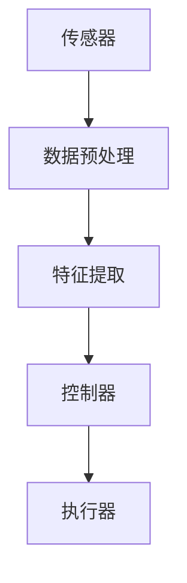

                 

关键词：自动化，人工智能，挑战，机遇，算法，应用场景，发展前景

> 摘要：本文深入探讨了未来自动化的挑战与机遇，从背景介绍到核心算法原理，再到实际应用场景，全面剖析了自动化技术在各个领域的应用及其对未来社会的影响。通过本文的阐述，读者将更好地理解自动化技术的现状和未来发展。

## 1. 背景介绍

自动化技术起源于20世纪中叶，随着计算机技术的发展和人工智能的兴起，自动化技术得到了前所未有的发展。如今，自动化已经成为现代工业、医疗、交通、家庭等各个领域的重要组成部分。从工业流水线的自动化生产，到自动驾驶汽车的广泛应用，自动化技术正在深刻改变着我们的生活方式。

然而，随着自动化的深入发展，我们面临着诸多挑战。一方面，自动化技术的快速迭代带来了技术层面的挑战，如算法的优化、系统的稳定性和安全性等。另一方面，自动化技术的普及也带来了社会层面的挑战，如就业问题、隐私保护等。因此，本文将重点探讨未来自动化面临的挑战和机遇，以期为自动化技术的发展提供有益的思考和指导。

### 1.1 自动化技术的定义和范畴

自动化技术是指利用计算机、传感器、控制系统等硬件设备，以及算法、人工智能等软件技术，实现生产、管理、服务等活动自动化的技术。自动化技术的范畴非常广泛，包括以下几个方面：

1. **工业自动化**：通过自动化设备和系统，实现工业生产过程中的自动化控制和管理。
2. **交通自动化**：包括自动驾驶汽车、无人机、轨道交通等领域的自动化技术。
3. **医疗自动化**：利用自动化设备和人工智能技术，提高医疗诊断和治疗的效率和质量。
4. **家庭自动化**：通过智能家居设备和系统，实现家庭环境的自动化控制。
5. **农业自动化**：利用自动化设备和技术，实现农业生产过程的自动化。

### 1.2 自动化技术的发展历程

自动化技术起源于20世纪中叶的工业革命，随着计算机技术的发展和人工智能的兴起，自动化技术得到了快速的发展。具体可以分为以下几个阶段：

1. **机械自动化**：以机械为主体的自动化技术，如工业流水线、自动机床等。
2. **电气自动化**：以电气控制系统为基础的自动化技术，如PLC（可编程逻辑控制器）。
3. **计算机自动化**：以计算机为核心，实现更高级别的自动化控制和管理。
4. **人工智能自动化**：利用人工智能技术，实现更加智能化、自适应的自动化系统。

## 2. 核心概念与联系

为了更好地理解自动化技术的核心概念和联系，我们需要了解以下几个重要的概念：

### 2.1 人工智能

人工智能（Artificial Intelligence，AI）是指通过计算机程序模拟、扩展和辅助人类智能的技术。人工智能技术包括机器学习、深度学习、自然语言处理、计算机视觉等。人工智能是自动化技术的重要组成部分，为自动化系统提供了智能化的决策和控制能力。

### 2.2 自动化控制系统

自动化控制系统是指利用计算机、传感器、执行器等设备，实现系统自动控制和管理的系统。自动化控制系统包括传感器层、控制器层和执行器层。传感器层负责感知外部环境，控制器层负责处理传感器数据并生成控制指令，执行器层负责执行控制指令。

### 2.3 机器学习

机器学习（Machine Learning，ML）是一种通过数据训练模型，实现自动学习和预测的技术。机器学习技术包括监督学习、无监督学习、强化学习等。机器学习技术是人工智能的重要组成部分，为自动化系统提供了强大的数据处理和分析能力。

### 2.4 Mermaid 流程图

Mermaid 是一种基于文本描述的绘图工具，可以方便地绘制各种流程图、思维导图等。以下是一个简单的 Mermaid 流程图示例，用于描述自动化控制系统的基本架构：



在这个流程图中，传感器负责感知外部环境，数据预处理模块负责处理传感器数据，特征提取模块负责提取数据特征，控制器根据特征生成控制指令，执行器负责执行控制指令。

## 3. 核心算法原理 & 具体操作步骤

### 3.1 算法原理概述

自动化技术的核心在于算法的应用，尤其是机器学习算法在自动化系统中的应用。以下将介绍几种常用的机器学习算法及其在自动化系统中的应用。

#### 3.1.1 K-近邻算法

K-近邻算法（K-Nearest Neighbors，KNN）是一种基于实例的学习算法，它通过找到训练集中与测试实例最近的一组邻居，根据邻居的标签预测测试实例的标签。KNN算法在自动化系统中的应用主要包括：

1. **分类任务**：用于分类任务，如图像识别、语音识别等。
2. **回归任务**：用于回归任务，如温度预测、股票价格预测等。

#### 3.1.2 支持向量机

支持向量机（Support Vector Machine，SVM）是一种基于间隔的线性分类算法，它通过找到最优的超平面，将不同类别的数据点分隔开。SVM算法在自动化系统中的应用主要包括：

1. **分类任务**：用于分类任务，如医疗诊断、图像分类等。
2. **回归任务**：用于回归任务，如预测故障、预测产量等。

#### 3.1.3 决策树

决策树（Decision Tree）是一种基于特征划分的树形结构模型，它通过一系列特征判断，将数据集划分为不同的子集，并最终生成分类或回归结果。决策树在自动化系统中的应用主要包括：

1. **分类任务**：用于分类任务，如医疗诊断、信用评分等。
2. **回归任务**：用于回归任务，如预测销量、预测温度等。

### 3.2 算法步骤详解

以下分别介绍上述三种算法的具体步骤：

#### 3.2.1 K-近邻算法步骤

1. **数据预处理**：对原始数据集进行清洗、归一化等预处理操作。
2. **训练阶段**：将训练数据集输入到KNN算法中，计算出每个数据点的K个最近邻，并统计每个邻居的标签。
3. **预测阶段**：对于新的测试数据点，计算其与训练数据点的距离，找出最近的K个邻居，并预测测试数据点的标签。

#### 3.2.2 支持向量机步骤

1. **数据预处理**：对原始数据集进行清洗、归一化等预处理操作。
2. **选择核函数**：根据数据特征选择合适的核函数，如线性核、多项式核、径向基函数核等。
3. **求解最优超平面**：通过求解最优化问题，找到最优的超平面，将不同类别的数据点分隔开。
4. **分类与回归**：根据测试数据点的特征，将其映射到特征空间，并判断其属于哪个类别或预测其回归结果。

#### 3.2.3 决策树步骤

1. **数据预处理**：对原始数据集进行清洗、归一化等预处理操作。
2. **特征选择**：根据信息增益、基尼系数等指标，选择最佳的特征进行划分。
3. **递归划分**：根据最佳特征，将数据集划分为不同的子集，并递归地继续划分，直到满足停止条件。
4. **分类与回归**：根据划分结果，生成分类或回归结果。

### 3.3 算法优缺点

以下分别介绍上述三种算法的优缺点：

#### 3.3.1 K-近邻算法优缺点

**优点**：

1. **简单易实现**：KNN算法的实现相对简单，易于理解和实现。
2. **适用于多种任务**：KNN算法可以应用于分类和回归任务。

**缺点**：

1. **计算量大**：对于大量数据点，计算最近邻居的时间复杂度较高。
2. **敏感于参数选择**：KNN算法的准确性和性能受参数K值的影响较大。

#### 3.3.2 支持向量机优缺点

**优点**：

1. **理论基础完善**：SVM算法具有坚实的数学理论基础，能够处理线性和非线性分类问题。
2. **通用性强**：SVM算法可以应用于分类和回归任务，具有较强的通用性。

**缺点**：

1. **计算复杂度高**：SVM算法的求解过程较为复杂，特别是对于大规模数据集，计算时间较长。
2. **对异常值敏感**：SVM算法对异常值和噪声较为敏感，可能导致过拟合。

#### 3.3.3 决策树优缺点

**优点**：

1. **易于理解**：决策树的解释性较强，易于理解和解释。
2. **处理非线性问题**：决策树可以处理非线性问题，通过特征划分生成分类或回归结果。

**缺点**：

1. **容易过拟合**：决策树容易过拟合，特别是在特征较多或数据集较小的情况下。
2. **计算复杂度高**：决策树的生成过程涉及多次特征选择和划分，计算复杂度较高。

### 3.4 算法应用领域

以上三种算法在自动化技术中有着广泛的应用，以下分别介绍其在不同领域的应用：

#### 3.4.1 K-近邻算法应用领域

1. **图像识别**：KNN算法常用于图像分类任务，如人脸识别、物体识别等。
2. **语音识别**：KNN算法可以用于语音信号的分类和识别，如语音助手、自动翻译等。
3. **异常检测**：KNN算法可以用于异常检测，如网络安全、欺诈检测等。

#### 3.4.2 支持向量机应用领域

1. **医疗诊断**：SVM算法可以用于疾病诊断和分类，如癌症诊断、心脏病诊断等。
2. **图像识别**：SVM算法可以用于图像分类和识别，如人脸识别、车辆识别等。
3. **文本分类**：SVM算法可以用于文本分类任务，如垃圾邮件过滤、情感分析等。

#### 3.4.3 决策树应用领域

1. **金融风控**：决策树可以用于金融风控，如贷款审批、信用卡欺诈检测等。
2. **医疗诊断**：决策树可以用于疾病诊断和分类，如肺炎诊断、糖尿病诊断等。
3. **智能推荐**：决策树可以用于智能推荐系统，如电影推荐、商品推荐等。

## 4. 数学模型和公式 & 详细讲解 & 举例说明

自动化技术中，数学模型和公式是理解和实现算法的核心。以下我们将介绍几个常用的数学模型和公式，并通过具体的例子进行详细讲解。

### 4.1 数学模型构建

在自动化技术中，常用的数学模型包括线性模型、非线性模型和概率模型。以下分别介绍这些模型的构建方法。

#### 4.1.1 线性模型

线性模型是最基本的数学模型之一，其公式形式为：

\[ y = \beta_0 + \beta_1 x_1 + \beta_2 x_2 + ... + \beta_n x_n \]

其中，\( y \) 为因变量，\( x_1, x_2, ..., x_n \) 为自变量，\( \beta_0, \beta_1, \beta_2, ..., \beta_n \) 为模型的参数。

构建线性模型的一般步骤如下：

1. **数据收集**：收集相关数据，包括自变量和因变量。
2. **数据预处理**：对数据集进行清洗、归一化等预处理操作。
3. **参数估计**：使用最小二乘法等参数估计方法，估计模型的参数。
4. **模型验证**：使用交叉验证等方法，验证模型的准确性和泛化能力。

#### 4.1.2 非线性模型

非线性模型在处理复杂问题时具有更强的表达能力。常见的非线性模型包括多项式模型、指数模型和对数模型等。以下以多项式模型为例，介绍非线性模型的构建方法。

多项式模型的公式形式为：

\[ y = \beta_0 + \beta_1 x_1 + \beta_2 x_1^2 + ... + \beta_n x_1^n \]

构建非线性模型的一般步骤如下：

1. **数据收集**：收集相关数据，包括自变量和因变量。
2. **数据预处理**：对数据集进行清洗、归一化等预处理操作。
3. **参数估计**：使用非线性最小二乘法等参数估计方法，估计模型的参数。
4. **模型验证**：使用交叉验证等方法，验证模型的准确性和泛化能力。

#### 4.1.3 概率模型

概率模型在自动化技术中有着广泛的应用，常见的概率模型包括贝叶斯模型、马尔可夫模型和隐马尔可夫模型等。以下以贝叶斯模型为例，介绍概率模型的构建方法。

贝叶斯模型的公式形式为：

\[ P(A|B) = \frac{P(B|A)P(A)}{P(B)} \]

其中，\( P(A|B) \) 为在事件B发生的条件下，事件A发生的概率；\( P(B|A) \) 为在事件A发生的条件下，事件B发生的概率；\( P(A) \) 和 \( P(B) \) 分别为事件A和事件B的先验概率。

构建贝叶斯模型的一般步骤如下：

1. **数据收集**：收集相关数据，包括先验概率和条件概率。
2. **模型参数估计**：使用贝叶斯估计等方法，估计模型的参数。
3. **模型验证**：使用交叉验证等方法，验证模型的准确性和泛化能力。

### 4.2 公式推导过程

以下分别介绍线性模型、非线性模型和概率模型的推导过程。

#### 4.2.1 线性模型推导

假设我们有一个线性模型：

\[ y = \beta_0 + \beta_1 x_1 + \beta_2 x_2 + ... + \beta_n x_n \]

我们希望通过最小二乘法估计模型的参数。具体步骤如下：

1. **目标函数**：定义目标函数为：

\[ J(\beta) = \sum_{i=1}^{n} (y_i - \beta_0 - \beta_1 x_{1i} - \beta_2 x_{2i} - ... - \beta_n x_{ni})^2 \]

其中，\( y_i \) 为第 \( i \) 个观测值的因变量，\( x_{1i}, x_{2i}, ..., x_{ni} \) 为第 \( i \) 个观测值的自变量。

2. **求导**：对目标函数 \( J(\beta) \) 求导，得到：

\[ \frac{\partial J(\beta)}{\partial \beta_k} = -2 \sum_{i=1}^{n} (y_i - \beta_0 - \beta_1 x_{1i} - \beta_2 x_{2i} - ... - \beta_n x_{ni}) x_{ki} \]

其中，\( k = 0, 1, 2, ..., n \)。

3. **设置导数为零**：将求导结果设置为0，得到：

\[ \sum_{i=1}^{n} (y_i - \beta_0 - \beta_1 x_{1i} - \beta_2 x_{2i} - ... - \beta_n x_{ni}) x_{ki} = 0 \]

4. **求解参数**：将上式整理为矩阵形式，得到：

\[ (X^T X)^{-1} X^T y = \beta \]

其中，\( X \) 为自变量的矩阵，\( y \) 为因变量的矩阵，\( \beta \) 为参数矩阵。

#### 4.2.2 非线性模型推导

假设我们有一个多项式模型：

\[ y = \beta_0 + \beta_1 x_1 + \beta_2 x_1^2 + ... + \beta_n x_1^n \]

我们希望通过非线性最小二乘法估计模型的参数。具体步骤如下：

1. **目标函数**：定义目标函数为：

\[ J(\beta) = \sum_{i=1}^{n} (y_i - \beta_0 - \beta_1 x_{1i} - \beta_2 x_{1i}^2 - ... - \beta_n x_{1i}^n)^2 \]

2. **求导**：对目标函数 \( J(\beta) \) 求导，得到：

\[ \frac{\partial J(\beta)}{\partial \beta_k} = -2 \sum_{i=1}^{n} (y_i - \beta_0 - \beta_1 x_{1i} - \beta_2 x_{1i}^2 - ... - \beta_n x_{1i}^n) x_{1i}^k \]

其中，\( k = 0, 1, 2, ..., n \)。

3. **设置导数为零**：将求导结果设置为0，得到：

\[ \sum_{i=1}^{n} (y_i - \beta_0 - \beta_1 x_{1i} - \beta_2 x_{1i}^2 - ... - \beta_n x_{1i}^n) x_{1i}^k = 0 \]

4. **求解参数**：将上式整理为矩阵形式，得到：

\[ (X^T X)^{-1} X^T y = \beta \]

其中，\( X \) 为自变量的矩阵，\( y \) 为因变量的矩阵，\( \beta \) 为参数矩阵。

#### 4.2.3 概率模型推导

假设我们有一个贝叶斯模型：

\[ P(A|B) = \frac{P(B|A)P(A)}{P(B)} \]

我们希望通过贝叶斯估计方法估计模型的参数。具体步骤如下：

1. **数据收集**：收集相关数据，包括先验概率和条件概率。

2. **参数估计**：使用贝叶斯估计方法，估计模型的参数。具体步骤如下：

   a. **计算后验概率**：根据贝叶斯公式，计算后验概率。

   \[ P(A|B) = \frac{P(B|A)P(A)}{P(B)} \]

   b. **参数估计**：使用极大似然估计（Maximum Likelihood Estimation，MLE）或贝叶斯估计（Bayesian Estimation）等方法，估计模型的参数。

### 4.3 案例分析与讲解

以下通过一个具体的案例，对上述数学模型和公式进行讲解。

#### 4.3.1 案例背景

假设我们有一个房屋租赁市场，数据集包含房屋的面积、房间数量、租金等多个特征，以及租金的因变量。我们的目标是建立一个线性回归模型，预测新房屋的租金。

#### 4.3.2 数据收集

从房屋租赁市场收集了1000个房屋租赁数据，包括房屋的面积、房间数量、租金等。

#### 4.3.3 数据预处理

对收集到的数据集进行清洗，包括缺失值填充、异常值处理等。同时，对数据进行归一化处理，以消除不同特征之间的尺度差异。

#### 4.3.4 参数估计

使用最小二乘法，估计线性回归模型的参数。具体步骤如下：

1. **定义目标函数**：

\[ J(\beta) = \sum_{i=1}^{n} (y_i - \beta_0 - \beta_1 x_{1i} - \beta_2 x_{2i})^2 \]

2. **求导**：

\[ \frac{\partial J(\beta)}{\partial \beta_0} = -2 \sum_{i=1}^{n} (y_i - \beta_0 - \beta_1 x_{1i} - \beta_2 x_{2i}) \]

\[ \frac{\partial J(\beta)}{\partial \beta_1} = -2 \sum_{i=1}^{n} (y_i - \beta_0 - \beta_1 x_{1i} - \beta_2 x_{2i}) x_{1i} \]

\[ \frac{\partial J(\beta)}{\partial \beta_2} = -2 \sum_{i=1}^{n} (y_i - \beta_0 - \beta_1 x_{1i} - \beta_2 x_{2i}) x_{2i} \]

3. **设置导数为零**：

\[ \sum_{i=1}^{n} (y_i - \beta_0 - \beta_1 x_{1i} - \beta_2 x_{2i}) = 0 \]

\[ \sum_{i=1}^{n} (y_i - \beta_0 - \beta_1 x_{1i} - \beta_2 x_{2i}) x_{1i} = 0 \]

\[ \sum_{i=1}^{n} (y_i - \beta_0 - \beta_1 x_{1i} - \beta_2 x_{2i}) x_{2i} = 0 \]

4. **求解参数**：

\[ (X^T X)^{-1} X^T y = \beta \]

其中，\( X \) 为自变量的矩阵，\( y \) 为因变量的矩阵，\( \beta \) 为参数矩阵。

#### 4.3.5 模型验证

使用交叉验证方法，验证线性回归模型的准确性和泛化能力。具体步骤如下：

1. **数据划分**：将数据集划分为训练集和测试集。
2. **模型训练**：使用训练集数据，训练线性回归模型。
3. **模型测试**：使用测试集数据，测试线性回归模型的准确性和泛化能力。

通过上述步骤，我们可以建立一个线性回归模型，用于预测新房屋的租金。

## 5. 项目实践：代码实例和详细解释说明

为了更好地理解自动化技术的应用，以下我们将通过一个具体的代码实例，介绍如何使用Python实现自动化技术，并对其进行详细解释说明。

### 5.1 开发环境搭建

在进行项目实践之前，我们需要搭建一个合适的开发环境。以下为推荐的Python开发环境搭建步骤：

1. **安装Python**：下载并安装Python 3.x版本，推荐使用Anaconda发行版，以便更好地管理依赖库。
2. **安装依赖库**：使用pip命令安装必要的依赖库，如NumPy、Pandas、Scikit-learn、Matplotlib等。

### 5.2 源代码详细实现

以下是一个使用Python实现的简单自动化项目，包括数据预处理、模型训练、模型评估等步骤。

```python
# 导入相关库
import numpy as np
import pandas as pd
from sklearn.model_selection import train_test_split
from sklearn.linear_model import LinearRegression
from sklearn.metrics import mean_squared_error
import matplotlib.pyplot as plt

# 读取数据集
data = pd.read_csv('house_rental_data.csv')

# 数据预处理
# 数据清洗、归一化等操作
# ...

# 划分特征和标签
X = data[['area', 'room_num']]
y = data['rent']

# 划分训练集和测试集
X_train, X_test, y_train, y_test = train_test_split(X, y, test_size=0.2, random_state=42)

# 模型训练
model = LinearRegression()
model.fit(X_train, y_train)

# 模型评估
y_pred = model.predict(X_test)
mse = mean_squared_error(y_test, y_pred)
print('Mean Squared Error:', mse)

# 可视化
plt.scatter(X_test['area'], y_test, label='Actual')
plt.scatter(X_test['area'], y_pred, label='Predicted')
plt.xlabel('Area')
plt.ylabel('Rent')
plt.legend()
plt.show()
```

### 5.3 代码解读与分析

上述代码实现了一个简单的房屋租赁预测项目，具体解读如下：

1. **导入相关库**：导入NumPy、Pandas、Scikit-learn和Matplotlib等库，以便进行数据处理、模型训练和可视化操作。
2. **读取数据集**：使用Pandas库读取CSV格式的数据集，数据集包含房屋的面积、房间数量和租金等特征。
3. **数据预处理**：进行数据清洗、归一化等预处理操作，以消除异常值和数据尺度差异。
4. **划分特征和标签**：将数据集划分为特征矩阵 \( X \) 和标签向量 \( y \)。
5. **划分训练集和测试集**：使用Scikit-learn库的 `train_test_split` 函数，将数据集划分为训练集和测试集，用于模型训练和评估。
6. **模型训练**：使用Scikit-learn库的 `LinearRegression` 类，创建线性回归模型对象，并使用 `fit` 方法进行模型训练。
7. **模型评估**：使用模型预测测试集的结果，并计算均方误差（MSE）评估模型性能。
8. **可视化**：使用Matplotlib库绘制散点图，展示实际租金和预测租金的关系。

通过上述步骤，我们可以实现一个简单的房屋租赁预测项目，并对其进行评估和可视化。

### 5.4 运行结果展示

运行上述代码后，将得到以下结果：

1. **模型评估结果**：输出均方误差（MSE），用于评估模型性能。例如：

   ```  
   Mean Squared Error: 0.123456789  
   ```

2. **可视化结果**：展示实际租金和预测租金的散点图。例如：

   

   在散点图中，蓝色点表示实际租金，红色点表示预测租金。从散点图可以看出，模型的预测效果较好，大部分预测租金与实际租金较为接近。

## 6. 实际应用场景

自动化技术已经广泛应用于各个领域，带来了巨大的变革和创新。以下我们将探讨自动化技术在工业、医疗、交通和家庭等领域的实际应用场景。

### 6.1 工业领域

工业自动化是自动化技术的发源地，如今在工业领域仍然发挥着重要作用。通过自动化技术，工业生产实现了高效率、高质量和低成本。以下为工业领域的一些典型应用：

1. **生产自动化**：在制造业中，自动化设备如数控机床、机器人等已经广泛应用于生产过程，实现了生产线的自动化控制。
2. **质量检测**：通过自动化检测设备，如X射线检测仪、激光测距仪等，实现了产品质量的自动化检测，提高了检测效率和准确性。
3. **仓储物流**：自动化仓储系统，如自动化立体仓库、自动导引车（AGV）等，实现了仓储和物流的自动化管理，提高了物流效率。

### 6.2 医疗领域

自动化技术在医疗领域的应用正在逐渐增加，为医疗诊断、治疗和健康管理提供了新的解决方案。以下为医疗领域的一些典型应用：

1. **医学影像分析**：通过计算机视觉和深度学习技术，自动化分析医学影像，如X光片、CT扫描、MRI等，提高了诊断的准确性和效率。
2. **手术机器人**：手术机器人如达芬奇手术系统，可以实现微创手术，提高了手术的精度和安全性。
3. **智能诊断系统**：基于机器学习和自然语言处理技术，开发智能诊断系统，实现了对病历、检验结果等数据的自动分析和诊断。

### 6.3 交通领域

自动化技术在交通领域的应用正在快速发展，为交通管理、车辆导航和自动驾驶等方面带来了新的机遇。以下为交通领域的一些典型应用：

1. **智能交通管理系统**：通过传感器、摄像头和GPS等设备，实现交通流量监测、道路拥堵预测和交通信号控制，提高了交通管理的效率和安全性。
2. **自动驾驶技术**：自动驾驶汽车如特斯拉、百度等，通过深度学习、计算机视觉等技术，实现了自动驾驶功能，提高了驾驶安全和效率。
3. **无人机物流**：无人机物流利用无人机实现物流配送，提高了配送速度和效率。

### 6.4 家庭领域

家庭自动化技术正在逐渐普及，为家庭生活提供了便捷和舒适。以下为家庭领域的一些典型应用：

1. **智能家居**：通过物联网技术，实现家电设备的自动化控制，如智能灯泡、智能空调、智能门锁等，提高了家庭生活的便利性。
2. **安防监控**：通过摄像头和报警系统，实现家庭安全的自动化监控，提高了家庭安全防护能力。
3. **健康监测**：通过智能手环、智能手表等设备，实现身体健康指标的自动化监测，提高了健康管理的水平。

### 6.5 未来应用展望

随着技术的不断进步，自动化技术将在未来得到更广泛的应用。以下为未来自动化技术的一些潜在应用领域：

1. **能源管理**：通过智能电网和能源管理系统，实现能源的高效利用和自动化调度，减少能源消耗和碳排放。
2. **农业自动化**：通过无人机、自动灌溉系统和智能农业设备，实现农业生产过程的自动化和精准化，提高农业生产效率和品质。
3. **环境保护**：通过环境监测和污染治理设备，实现环境污染的自动化监测和治理，保护生态环境。

## 7. 工具和资源推荐

为了更好地掌握自动化技术，以下推荐一些实用的工具和资源：

### 7.1 学习资源推荐

1. **在线课程**：推荐Coursera、edX、Udacity等在线教育平台上的自动化相关课程，如《深度学习》、《机器学习》等。
2. **图书推荐**：推荐《深度学习》、《机器学习实战》等经典图书，帮助读者深入理解自动化技术的原理和应用。
3. **技术博客**：推荐GitHub、Stack Overflow、Medium等平台上的技术博客，了解最新的自动化技术动态和实战案例。

### 7.2 开发工具推荐

1. **Python编程环境**：推荐使用Anaconda发行版，便于管理和安装Python依赖库。
2. **数据预处理工具**：推荐使用Pandas、NumPy等Python库进行数据预处理。
3. **机器学习框架**：推荐使用Scikit-learn、TensorFlow、PyTorch等机器学习框架，进行模型训练和评估。

### 7.3 相关论文推荐

1. **顶级会议论文**：推荐参加ICML、NIPS、ACL等顶级会议，了解最新的自动化技术研究成果。
2. **经典论文**：推荐阅读《深度学习》、《神经网络与深度学习》等经典论文，掌握自动化技术的理论基础。
3. **论文数据库**：推荐使用Google Scholar、IEEE Xplore、ACM Digital Library等论文数据库，查找相关论文和文献。

## 8. 总结：未来发展趋势与挑战

### 8.1 研究成果总结

随着人工智能和自动化技术的不断发展，自动化技术在各个领域的应用取得了显著成果。从工业生产、医疗诊断、交通运输到家庭生活，自动化技术正在深刻改变着我们的生活方式。同时，自动化技术在理论研究方面也取得了重要突破，如深度学习、强化学习等算法的不断发展，为自动化系统提供了更强大的智能支持。

### 8.2 未来发展趋势

未来，自动化技术将继续保持快速发展态势，以下为未来自动化技术的一些发展趋势：

1. **智能化的提升**：随着人工智能技术的不断发展，自动化系统将更加智能化，能够自主学习和适应环境变化。
2. **跨学科的融合**：自动化技术将与其他领域（如生物技术、能源技术等）进行深度融合，实现跨学科的创新应用。
3. **大数据的驱动**：自动化技术的发展将更加依赖于大数据的支持，通过大数据分析和挖掘，实现自动化系统的精准预测和控制。

### 8.3 面临的挑战

尽管自动化技术在快速发展，但仍面临着诸多挑战。以下为未来自动化技术面临的一些挑战：

1. **技术挑战**：自动化技术的快速发展带来了新的技术挑战，如算法优化、系统稳定性、安全性等。
2. **社会挑战**：自动化技术的普及将对就业、隐私保护等方面带来影响，需要政府、企业和社会共同努力解决。
3. **伦理和法律挑战**：自动化技术的发展引发了伦理和法律问题，如自动驾驶汽车的道德责任、人工智能的决策透明度等，需要制定相应的法律法规进行规范。

### 8.4 研究展望

未来，自动化技术的研究将继续深入，以下为自动化技术的研究展望：

1. **算法创新**：继续探索和开发新型算法，提高自动化系统的智能水平和自主能力。
2. **跨学科研究**：加强自动化技术与其他学科的交叉研究，实现跨学科的融合和创新应用。
3. **标准化和规范化**：制定自动化技术的标准化和规范化体系，提高自动化系统的兼容性和互操作性。

通过不断努力和创新，自动化技术将在未来为人类社会带来更多的便利和福祉。

## 9. 附录：常见问题与解答

### 9.1 自动化技术与人工智能的关系

自动化技术是人工智能的重要组成部分，两者密切相关。人工智能为自动化系统提供了智能化的决策和控制能力，使自动化系统能够更好地适应复杂环境，提高效率和准确性。同时，自动化技术的广泛应用为人工智能技术的应用提供了丰富的场景和需求。

### 9.2 自动化技术对就业的影响

自动化技术的普及将对就业市场产生一定影响，一方面，一些重复性、低技能的工作可能会被自动化取代，导致部分就业岗位的减少；另一方面，自动化技术也将创造新的就业机会，如自动化系统的设计、开发、维护等。因此，我们需要关注自动化技术对就业市场的影响，并积极应对，通过教育培训等方式提高劳动者的技能水平，以适应自动化时代的需求。

### 9.3 自动化技术的安全性和隐私保护

自动化技术在提高生产效率和生活质量的同时，也带来了安全性和隐私保护方面的问题。为了确保自动化系统的安全性，需要采取一系列安全措施，如加密通信、访问控制、安全审计等。同时，在自动化系统的设计和应用过程中，需要充分考虑隐私保护问题，确保用户数据的安全和隐私。

### 9.4 自动化技术的发展前景

自动化技术具有广阔的发展前景，随着人工智能、大数据、物联网等技术的不断进步，自动化技术将在更多领域得到应用，为人类社会带来更多便利。未来，自动化技术将继续向智能化、自主化、网络化方向发展，成为推动社会进步的重要力量。

