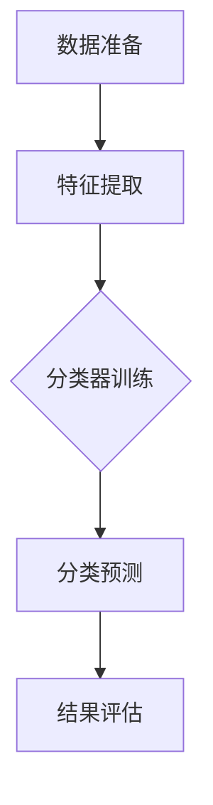

                 

关键词：朴素贝叶斯，分类算法，机器学习，概率模型，贝叶斯定理，代码实例

> 摘要：本文将深入探讨朴素贝叶斯分类算法的基本原理、数学模型以及在实际应用中的代码实现。通过详细的步骤分析和实例讲解，读者将全面理解朴素贝叶斯算法的工作机制，并学会如何将其应用于实际问题。

## 1. 背景介绍

### 1.1 朴素贝叶斯算法的起源

朴素贝叶斯（Naive Bayes）算法是一种经典的概率分类算法，其基础可以追溯到贝叶斯定理。贝叶斯定理最早由托马斯·贝叶斯于18世纪提出，用于概率推理和决策分析。随着计算机科学和人工智能的发展，朴素贝叶斯算法被广泛应用于文本分类、垃圾邮件过滤、医疗诊断等领域。

### 1.2 朴素贝叶斯算法的重要性

朴素贝叶斯算法因其简单、高效和易于实现的特点，成为了数据挖掘和机器学习领域的一种重要工具。尤其在处理高维度数据时，朴素贝叶斯算法表现出色，具有很好的通用性。同时，朴素贝叶斯算法的理论基础坚实，对于理解概率模型和贝叶斯推断具有重要的学术价值。

## 2. 核心概念与联系

### 2.1 贝叶斯定理

贝叶斯定理是朴素贝叶斯算法的理论基础。它描述了后验概率与先验概率及条件概率之间的关系，其数学表达式为：

$$
P(A|B) = \frac{P(B|A)P(A)}{P(B)}
$$

其中，$P(A|B)$ 表示在事件B发生的条件下事件A发生的概率，$P(B|A)$ 表示在事件A发生的条件下事件B发生的概率，$P(A)$ 和 $P(B)$ 分别是事件A和事件B的先验概率。

### 2.2 朴素贝叶斯假设

朴素贝叶斯算法的核心假设是特征条件独立假设，即假设特征之间相互独立，给定类别的条件下，每个特征的概率分布是独立的。这个假设虽然在实际中并不严格成立，但在许多实际问题中，它可以提供一个足够好的近似。

### 2.3 Mermaid 流程图

下面是一个描述朴素贝叶斯分类过程的 Mermaid 流程图：



## 3. 核心算法原理 & 具体操作步骤

### 3.1 算法原理概述

朴素贝叶斯算法的基本原理是利用贝叶斯定理计算每个类别条件下特征的概率，并选择概率最大的类别作为预测结果。具体步骤如下：

1. 特征提取：从原始数据中提取特征，并将其转换为适合模型的形式。
2. 计算先验概率：计算每个类别的先验概率。
3. 计算条件概率：对于每个类别，计算每个特征的条件下概率。
4. 预测分类：利用贝叶斯定理计算每个类别的后验概率，并选择概率最大的类别作为预测结果。

### 3.2 算法步骤详解

#### 3.2.1 数据准备

数据准备是朴素贝叶斯算法的第一步，主要包括以下任务：

- 数据清洗：处理缺失值、异常值等。
- 特征选择：选择对分类任务有帮助的特征。
- 特征转换：将连续特征转换为离散特征，或将数值特征转换为类别特征。

#### 3.2.2 计算先验概率

先验概率是指在没有任何其他信息的情况下，每个类别发生的概率。计算先验概率的公式为：

$$
P(C_k) = \frac{N_k}{N}
$$

其中，$N_k$ 表示类别$k$的样本数量，$N$ 表示总的样本数量。

#### 3.2.3 计算条件概率

条件概率是指在某个类别发生的条件下，某个特征发生的概率。计算条件概率的公式为：

$$
P(F_j|C_k) = \frac{N_{k,j}}{N_k}
$$

其中，$N_{k,j}$ 表示在类别$k$下特征$j$的样本数量。

#### 3.2.4 预测分类

预测分类是朴素贝叶斯算法的核心步骤。具体过程如下：

1. 对于新的样本，计算每个类别条件下特征的概率。
2. 计算每个类别的后验概率，公式为：

$$
P(C_k|F) = \frac{P(F|C_k)P(C_k)}{P(F)}
$$

3. 选择后验概率最大的类别作为预测结果。

### 3.3 算法优缺点

#### 3.3.1 优点

- 算法简单，易于理解和实现。
- 计算速度快，适用于大规模数据集。
- 对特征条件独立假设的近似处理，使其在处理高维度数据时表现良好。

#### 3.3.2 缺点

- 朴素贝叶斯假设过于简单，可能导致分类效果不佳。
- 对缺失值和异常值敏感。

### 3.4 算法应用领域

朴素贝叶斯算法在多个领域都有广泛应用，包括但不限于：

- 文本分类：如垃圾邮件过滤、情感分析等。
- 金融服务：如信用评分、欺诈检测等。
- 医疗诊断：如疾病预测、症状分析等。

## 4. 数学模型和公式 & 详细讲解 & 举例说明

### 4.1 数学模型构建

朴素贝叶斯分类器的数学模型基于贝叶斯定理和特征条件独立假设。给定一个训练数据集$D$，其中包含$m$个特征和$n$个类别，我们可以构建如下的数学模型：

$$
P(C_k) = \frac{N_k}{N}, \quad P(F_j|C_k) = \frac{N_{k,j}}{N_k}, \quad P(F|C_k) = \prod_{j=1}^{m} P(F_j|C_k)
$$

其中，$P(C_k)$ 是类别$k$的先验概率，$P(F_j|C_k)$ 是在类别$k$下特征$j$的条件概率，$P(F|C_k)$ 是在类别$k$下特征集合$F$的条件概率。

### 4.2 公式推导过程

贝叶斯定理是朴素贝叶斯分类算法的核心，其推导过程如下：

$$
P(A|B) = \frac{P(B|A)P(A)}{P(B)}
$$

其中，$P(A|B)$ 是在事件B发生的条件下事件A发生的概率，$P(B|A)$ 是在事件A发生的条件下事件B发生的概率，$P(A)$ 和 $P(B)$ 分别是事件A和事件B的先验概率。

根据特征条件独立假设，给定类别$C_k$，特征$F_j$的条件概率可以简化为：

$$
P(F_j|C_k) = P(F_j|C_k, F_{-j})
$$

其中，$F_{-j}$ 表示除了特征$j$之外的所有特征。

### 4.3 案例分析与讲解

#### 4.3.1 信用评分

假设我们要使用朴素贝叶斯算法对客户的信用评分进行分类。特征包括年龄、收入、负债、信用历史等。类别包括“良好信用”和“不良信用”。

1. 数据准备：对数据进行清洗和特征提取，将连续特征转换为离散特征。

2. 计算先验概率：根据训练数据计算每个类别的先验概率。

$$
P(良好信用) = \frac{N_1}{N}, \quad P(不良信用) = \frac{N_2}{N}
$$

3. 计算条件概率：对于每个特征，计算在“良好信用”和“不良信用”条件下的条件概率。

$$
P(年龄=30|良好信用) = \frac{N_{1,30}}{N_1}, \quad P(年龄=30|不良信用) = \frac{N_{2,30}}{N_2}
$$

4. 预测分类：对于新的样本，计算每个类别条件下特征的概率，并选择后验概率最大的类别作为预测结果。

$$
P(良好信用|样本) = \frac{P(样本|良好信用)P(良好信用)}{P(样本)}
$$

$$
P(不良信用|样本) = \frac{P(样本|不良信用)P(不良信用)}{P(样本)}
$$

#### 4.3.2 垃圾邮件过滤

假设我们要使用朴素贝叶斯算法对电子邮件进行分类，特征包括邮件主题、正文等。类别包括“垃圾邮件”和“非垃圾邮件”。

1. 数据准备：对数据进行清洗和特征提取，将文本特征转换为词向量。

2. 计算先验概率：根据训练数据计算每个类别的先验概率。

$$
P(垃圾邮件) = \frac{N_1}{N}, \quad P(非垃圾邮件) = \frac{N_2}{N}
$$

3. 计算条件概率：对于每个词，计算在“垃圾邮件”和“非垃圾邮件”条件下的条件概率。

$$
P(词|垃圾邮件) = \frac{N_{1,词}}{N_1}, \quad P(词|非垃圾邮件) = \frac{N_{2,词}}{N_2}
$$

4. 预测分类：对于新的邮件，计算每个类别条件下词的概率，并选择后验概率最大的类别作为预测结果。

$$
P(垃圾邮件|邮件) = \frac{P(邮件|垃圾邮件)P(垃圾邮件)}{P(邮件)}
$$

$$
P(非垃圾邮件|邮件) = \frac{P(邮件|非垃圾邮件)P(非垃圾邮件)}{P(邮件)}
$$

## 5. 项目实践：代码实例和详细解释说明

### 5.1 开发环境搭建

1. 安装Python环境，建议使用Anaconda。
2. 安装必要的库，如numpy、pandas、scikit-learn等。

```bash
pip install numpy pandas scikit-learn
```

### 5.2 源代码详细实现

下面是一个简单的朴素贝叶斯分类器的代码实现：

```python
import numpy as np
from sklearn.datasets import load_iris
from sklearn.model_selection import train_test_split
from sklearn.metrics import accuracy_score

# 1. 数据准备
iris = load_iris()
X = iris.data
y = iris.target
X_train, X_test, y_train, y_test = train_test_split(X, y, test_size=0.2, random_state=42)

# 2. 计算先验概率和条件概率
def naive_bayes(X_train, y_train):
    m, n = X_train.shape
    classes = np.unique(y_train)
    prior_prob = np.zeros(len(classes))
    cond_prob = np.zeros((len(classes), n))

    for k, class_k in enumerate(classes):
        X_k = X_train[y_train == class_k]
        N_k = X_k.shape[0]
        prior_prob[k] = N_k / m

        for j in range(n):
            values, counts = np.unique(X_k[:, j], return_counts=True)
            cond_prob[k, j] = np.array([count / N_k for count in counts])

    return prior_prob, cond_prob

# 3. 预测分类
def predict(X_test, prior_prob, cond_prob):
    m = X_test.shape[0]
    y_pred = np.zeros(m)
    for i in range(m):
        probabilities = np.zeros(len(prior_prob))
        for k, class_k in enumerate(classes):
            probability = np.log(prior_prob[k])
            for j in range(n):
                probability += np.log(cond_prob[k, j][X_test[i, j]])
            probabilities[k] = np.exp(probability)
        y_pred[i] = np.argmax(probabilities)
    return y_pred

# 4. 运行分类器
prior_prob, cond_prob = naive_bayes(X_train, y_train)
y_pred = predict(X_test, prior_prob, cond_prob)
print("Accuracy:", accuracy_score(y_test, y_pred))
```

### 5.3 代码解读与分析

1. 数据准备：使用scikit-learn中的iris数据集进行训练和测试。
2. 计算先验概率和条件概率：定义`naive_bayes`函数，计算每个类别的先验概率和每个特征在各个类别下的条件概率。
3. 预测分类：定义`predict`函数，计算每个测试样本属于每个类别的后验概率，并选择概率最大的类别作为预测结果。
4. 运行分类器：调用上述函数，计算模型的准确率。

## 6. 实际应用场景

### 6.1 文本分类

朴素贝叶斯算法在文本分类任务中表现出色，如垃圾邮件过滤、情感分析等。其简单高效的特性使其在处理大规模文本数据时具有明显的优势。

### 6.2 金融服务

朴素贝叶斯算法在金融领域有广泛应用，如信用评分、欺诈检测等。通过对历史数据的分析，可以预测客户的风险等级，帮助金融机构进行风险管理。

### 6.3 医疗诊断

朴素贝叶斯算法在医疗诊断领域也有应用，如疾病预测、症状分析等。通过对患者症状和病史的分析，可以预测疾病的可能性，为医生提供诊断参考。

## 7. 未来应用展望

### 7.1 多样化模型

朴素贝叶斯算法可以与其他机器学习算法结合，形成多样化的模型，提高分类效果。

### 7.2 小样本学习

朴素贝叶斯算法在小样本学习方面具有优势，可以应用于样本数量有限的问题领域。

### 7.3 深度学习集成

将朴素贝叶斯算法与深度学习模型集成，可以充分发挥各自的优势，提高分类性能。

## 8. 工具和资源推荐

### 8.1 学习资源推荐

- 《机器学习》（周志华著）
- 《统计学习方法》（李航著）
- 《Python机器学习》（M. Bowles著）

### 8.2 开发工具推荐

- Jupyter Notebook：用于编写和运行Python代码。
- scikit-learn：用于机器学习和数据挖掘的Python库。

### 8.3 相关论文推荐

- "A Tutorial on the Application of Bayesian Methods to Problems of Classification" by E. I. George and R. E. McCullough.
- "Naive Bayes Classification" by Ron Kohavi.

## 9. 总结：未来发展趋势与挑战

### 9.1 研究成果总结

朴素贝叶斯算法作为一种经典的概率分类算法，其在简单性、高效性、易实现性等方面具有显著优势，广泛应用于多个领域。通过本文的讲解，读者可以全面了解朴素贝叶斯算法的基本原理和实际应用。

### 9.2 未来发展趋势

未来，朴素贝叶斯算法将继续在多个领域发挥重要作用。随着人工智能技术的不断发展，朴素贝叶斯算法有望与其他机器学习算法结合，形成更加多样化的模型。同时，在小样本学习和深度学习集成等方面，朴素贝叶斯算法也将有新的突破。

### 9.3 面临的挑战

朴素贝叶斯算法在处理高维度数据时可能存在性能下降的问题。此外，特征条件独立假设在实际中往往并不成立，可能导致分类效果不佳。因此，如何在实际应用中优化朴素贝叶斯算法的性能和分类效果，是一个重要的研究方向。

### 9.4 研究展望

朴素贝叶斯算法作为一种经典算法，其理论研究和实际应用都具有重要意义。未来，我们期待在朴素贝叶斯算法的优化、多样化模型研究、小样本学习等方面取得新的突破，为人工智能和机器学习领域的发展贡献力量。

## 10. 附录：常见问题与解答

### 10.1 朴素贝叶斯算法如何处理连续特征？

对于连续特征，可以使用最大熵模型或核密度估计等方法将其转换为离散特征，然后再应用于朴素贝叶斯算法。

### 10.2 朴素贝叶斯算法如何处理缺失值？

在朴素贝叶斯算法中，可以使用均值填补、中值填补或使用其他特征值等方法来处理缺失值。

### 10.3 朴素贝叶斯算法的准确率为什么不高？

可能原因包括特征条件独立假设不成立、数据分布不均匀、特征选择不当等。可以通过调整模型参数、改进特征提取方法、增加训练数据等方式来提高准确率。

作者：禅与计算机程序设计艺术 / Zen and the Art of Computer Programming
```

