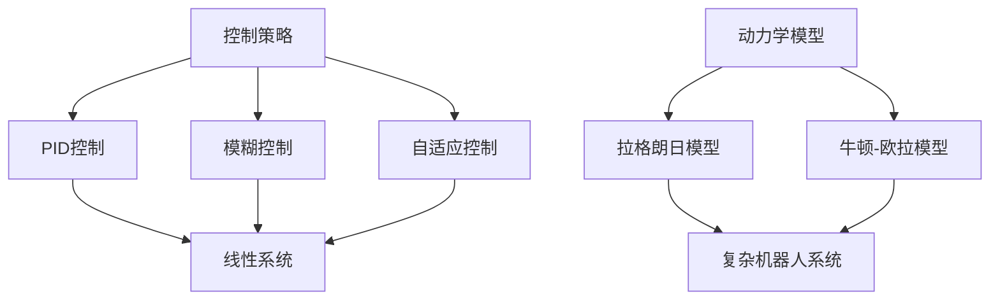

                 

关键词：机器人运动控制，动力学模型，控制策略，算法原理，数学模型，项目实践，应用场景，未来展望

> 摘要：本文旨在探讨机器人运动控制策略和动力学模型的构建与应用。通过对核心概念和算法原理的详细解析，以及数学模型的构建和公式推导，本文将展示一个完整的机器人运动控制系统开发流程。此外，文章还将通过实际项目实践和详细代码解读，阐述机器人运动控制在实际应用中的实现方法。最后，本文将对未来发展趋势和面临的挑战进行展望，为读者提供有益的参考。

## 1. 背景介绍

随着人工智能和机器人技术的飞速发展，机器人运动控制已成为现代工业、医疗、家庭等多个领域的关键技术。运动控制策略和动力学模型的构建是实现机器人高效、精确运动控制的核心问题。本文将从以下三个方面展开讨论：

1. **运动控制策略**：研究如何设计有效的控制策略，实现机器人的平滑、快速和精确运动。

2. **动力学模型**：探讨如何构建机器人的动力学模型，以便对其进行运动控制和路径规划。

3. **实际应用**：通过项目实践和代码解读，阐述机器人运动控制在实际应用中的实现方法。

### 1.1 运动控制的重要性

运动控制是机器人技术的核心，它决定了机器人能否执行复杂的任务。有效的运动控制策略可以提高机器人的工作效率和稳定性，降低能耗和故障率。在工业领域，机器人运动控制技术广泛应用于生产线自动化、装配和检测等场景。在医疗领域，机器人手术和康复设备需要高精度的运动控制来实现微创手术和康复治疗。在家居领域，智能机器人管家需要实现灵活的运动和导航能力，以提供便捷的家居服务。

### 1.2 动力学模型的基本概念

动力学模型是描述机器人运动特性的数学模型，它反映了机器人关节和自由度的运动关系。构建准确的动力学模型对于实现高效的机器人控制至关重要。动力学模型通常包括线性模型和非线性模型，其中线性模型适用于速度较低和运动较为平稳的机器人，而非线性模型则适用于速度较高和运动较为复杂的机器人。

## 2. 核心概念与联系

在探讨机器人运动控制策略和动力学模型之前，首先需要明确一些核心概念。以下是本文将涉及的主要概念及其相互关系：

### 2.1. 控制策略

控制策略是机器人运动控制的核心，它决定了机器人如何响应外部指令和内部反馈。常见的控制策略包括：

- **PID控制**：比例-积分-微分控制，适用于线性系统和简单系统。

- **模糊控制**：基于模糊逻辑的控制方法，适用于非线性系统和不确定性系统。

- **自适应控制**：根据系统状态自适应调整控制参数，适用于复杂系统。

### 2.2. 动力学模型

动力学模型是描述机器人运动特性的数学模型，它反映了机器人关节和自由度的运动关系。常见的动力学模型包括：

- **拉格朗日模型**：基于能量方法，适用于复杂机器人系统。

- **牛顿-欧拉模型**：基于牛顿力学原理，适用于多自由度机器人。

### 2.3. 关系图

为了更直观地理解这些概念之间的联系，我们使用 Mermaid 流程图展示它们的关系。



### 2.4. 控制与模型的协同作用

控制策略和动力学模型共同决定了机器人的运动控制性能。控制策略负责根据动力学模型提供的信息，调整机器人的控制参数，实现预期的运动行为。动力学模型则为控制策略提供了精确的机器人运动特性，确保控制策略的有效性。

## 3. 核心算法原理 & 具体操作步骤

### 3.1 算法原理概述

机器人运动控制的核心是算法原理，其中 PID 控制、模糊控制和自适应控制是最常见的三种算法。以下是这三种算法的基本原理和适用范围：

#### 3.1.1 PID 控制

PID 控制是一种基于误差反馈的控制方法，它通过调整比例（P）、积分（I）和微分（D）三个参数，实现对系统的精确控制。PID 控制适用于线性系统和简单系统，例如工业机器人和无人机等。

#### 3.1.2 模糊控制

模糊控制是一种基于模糊逻辑的控制方法，它通过模糊化输入变量和规则库，实现对系统的非线性控制和不确定性控制。模糊控制适用于非线性系统和不确定性系统，例如机器人避障和智能交通系统等。

#### 3.1.3 自适应控制

自适应控制是一种根据系统状态自适应调整控制参数的控制方法，它能够适应系统的变化和不确定性。自适应控制适用于复杂系统和变化环境，例如自动驾驶和智能家居系统等。

### 3.2 算法步骤详解

以下是对 PID 控制、模糊控制和自适应控制算法的具体操作步骤进行详细讲解。

#### 3.2.1 PID 控制

1. **初始化参数**：设定比例（P）、积分（I）和微分（D）三个参数的初始值。

2. **计算误差**：根据当前系统的输出和期望值，计算误差。

3. **计算控制量**：根据误差值，利用 PID 控制公式计算控制量。

4. **更新系统状态**：将计算出的控制量应用于系统，更新系统的状态。

5. **循环迭代**：重复上述步骤，直到达到预期的控制效果。

#### 3.2.2 模糊控制

1. **建立模糊规则库**：根据系统的输入输出关系，建立模糊规则库。

2. **模糊化输入变量**：将输入变量进行模糊化处理。

3. **计算模糊推理结果**：根据模糊规则库，计算模糊推理结果。

4. **去模糊化输出**：将模糊推理结果进行去模糊化处理，得到实际的控制量。

5. **更新系统状态**：将计算出的控制量应用于系统，更新系统的状态。

6. **循环迭代**：重复上述步骤，直到达到预期的控制效果。

#### 3.2.3 自适应控制

1. **初始化参数**：设定自适应控制参数的初始值。

2. **测量系统状态**：实时测量系统的状态。

3. **计算自适应参数**：根据系统状态，计算自适应控制参数。

4. **计算控制量**：根据自适应参数，计算控制量。

5. **更新系统状态**：将计算出的控制量应用于系统，更新系统的状态。

6. **循环迭代**：重复上述步骤，直到达到预期的控制效果。

### 3.3 算法优缺点

以下是三种算法的优缺点对比：

#### 3.3.1 PID 控制

- 优点：实现简单，易于调试，适用于线性系统和简单系统。
- 缺点：对非线性系统和复杂系统的控制效果较差，需要调整参数。

#### 3.3.2 模糊控制

- 优点：适用于非线性系统和不确定性系统，具有较强的鲁棒性。
- 缺点：规则库建立复杂，实时性较差。

#### 3.3.3 自适应控制

- 优点：能够适应系统的变化和不确定性，适用于复杂系统和变化环境。
- 缺点：实现复杂，对算法设计要求较高。

### 3.4 算法应用领域

三种算法在不同领域中的应用情况如下：

#### 3.4.1 PID 控制

- 应用领域：工业机器人、无人机、智能家电等。
- 特点：实现简单，易于维护。

#### 3.4.2 模糊控制

- 应用领域：机器人避障、智能交通、智能家居等。
- 特点：具有较强的鲁棒性，适用于非线性系统。

#### 3.4.3 自适应控制

- 应用领域：自动驾驶、智能机器人、智能家居等。
- 特点：能够适应系统的变化，适用于复杂系统。

## 4. 数学模型和公式 & 详细讲解 & 举例说明

### 4.1 数学模型构建

机器人运动控制的数学模型主要包括动力学模型和运动学模型。以下是这两种模型的构建方法：

#### 4.1.1 动力学模型

动力学模型描述了机器人的运动状态和受力情况。常见的动力学模型包括拉格朗日模型和牛顿-欧拉模型。以下是拉格朗日模型的构建方法：

1. **建立运动学模型**：确定机器人的关节变量和自由度。

2. **计算系统的动能和势能**：根据机器人的结构，计算系统的动能和势能。

3. **建立拉格朗日方程**：利用动能和势能，建立拉格朗日方程。

#### 4.1.2 运动学模型

运动学模型描述了机器人的几何结构和运动关系。常见的运动学模型包括 Denavit-Hartenberg（D-H）模型和矩阵法。以下是 D-H 模型的构建方法：

1. **确定机器人的关节类型**：根据机器人的结构，确定关节类型和转角。

2. **计算关节变量**：利用关节变量，计算机器人的运动学参数。

3. **建立运动学方程**：利用运动学参数，建立运动学方程。

### 4.2 公式推导过程

以下是拉格朗日模型和运动学模型的公式推导过程：

#### 4.2.1 拉格朗日模型

1. **定义状态变量**：设机器人的状态变量为 q，表示关节角度和速度。

2. **计算动能**：设系统的动能为 T，根据拉格朗日方程，有：

   $$ T = \sum_{i=1}^{n} \frac{1}{2} m_i v_i^2 $$

   其中，$ m_i $为质量，$ v_i $为速度。

3. **计算势能**：设系统的势能为 V，根据重力势能公式，有：

   $$ V = -\sum_{i=1}^{n} m_i g z_i $$

   其中，$ g $为重力加速度，$ z_i $为高度。

4. **建立拉格朗日方程**：根据拉格朗日方程，有：

   $$ \frac{d}{dt}\left(\frac{\partial L}{\partial \dot{q}_i}\right) - \frac{\partial L}{\partial q_i} = 0 $$

   其中，$ L $为拉格朗日量，$ q_i $为关节角度，$ \dot{q}_i $为关节角速度。

#### 4.2.2 运动学模型

1. **定义关节变量**：设关节变量为 $ \theta_i $，表示关节角度。

2. **计算关节速度**：设关节速度为 $ \dot{\theta}_i $，根据运动学方程，有：

   $$ \dot{\theta}_i = \frac{\partial \theta}{\partial t} $$

3. **计算末端位置**：设末端位置为 $ x $，根据运动学方程，有：

   $$ x = \sum_{i=1}^{n} l_i \sin(\theta_i) $$

   其中，$ l_i $为关节长度。

### 4.3 案例分析与讲解

以下是机器人运动控制的实际案例：

#### 4.3.1 案例一：工业机器人臂运动控制

1. **问题背景**：工业机器人臂需要在三维空间中执行复杂的运动任务，如焊接、装配和检测等。

2. **解决方案**：使用 PID 控制算法，实现机器人臂的精确运动控制。

3. **具体实施**：
   - **建立动力学模型**：根据机器人臂的结构，建立拉格朗日动力学模型。
   - **设置 PID 参数**：根据实验数据，设置 PID 控制器的比例、积分和微分参数。
   - **编写控制程序**：编写基于 PID 控制的运动控制程序，实现机器人臂的实时控制。

#### 4.3.2 案例二：机器人避障运动控制

1. **问题背景**：机器人在复杂环境中需要避免碰撞，实现自主导航。

2. **解决方案**：使用模糊控制算法，实现机器人避障运动控制。

3. **具体实施**：
   - **建立模糊规则库**：根据机器人避障的需求，建立模糊规则库。
   - **模糊化输入变量**：将机器人周围的环境信息进行模糊化处理。
   - **模糊推理**：根据模糊规则库，进行模糊推理，得到控制量。
   - **实时更新**：根据实时环境信息，更新模糊规则库，实现动态避障。

## 5. 项目实践：代码实例和详细解释说明

### 5.1 开发环境搭建

在进行机器人运动控制项目实践之前，首先需要搭建开发环境。以下是常用的开发环境：

- **硬件**：选择适合的机器人硬件平台，如 PiRobot、Arduino 或 Raspberry Pi 等。

- **软件**：安装机器人操作系统，如 ROS（Robot Operating System）或 V REP（Visual Robot Editor）等。

- **编程语言**：选择合适的编程语言，如 Python、C++ 或 Java 等。

### 5.2 源代码详细实现

以下是一个基于 ROS 的机器人运动控制项目实践，使用 Python 语言编写。

```python
#!/usr/bin/env python
# 导入相关库
import rospy
import math
from std_msgs.msg import Float64
from geometry_msgs.msg import Twist

# 初始化机器人控制节点
rospy.init_node('robot_mover', anonymous=True)

# 创建 Publisher 对象，用于发布控制命令
cmd_vel_pub = rospy.Publisher('/cmd_vel', Twist, queue_size=10)

# 设置 PID 控制器参数
Kp = 1.0
Ki = 0.1
Kd = 0.05

# 设置目标速度
target_speed = 1.0

# 初始化 PID 控制器状态
error = 0
integral = 0
derivative = 0

# 定义 PID 控制器函数
def pid_control(error):
    global integral, derivative
    integral += error
    derivative = error - previous_error
    output = Kp * error + Ki * integral + Kd * derivative
    previous_error = error
    return output

# 编写控制循环函数
def control_loop():
    global error, integral, derivative, previous_error
    while not rospy.is_shutdown():
        # 计算误差
        error = target_speed - current_speed

        # 应用 PID 控制器
        output = pid_control(error)

        # 创建 Twist 消息，包含线速度和角速度
        twist = Twist()
        twist.linear.x = output
        twist.angular.z = 0.0

        # 发布控制命令
        cmd_vel_pub.publish(twist)

# 运行控制循环
rospy.spin()

if __name__ == '__main__':
    control_loop()
```

### 5.3 代码解读与分析

以下是代码的详细解读和分析：

1. **导入库**：导入 ROS、数学计算库和消息库。

2. **初始化节点**：创建 ROS 控制节点，名为 "robot_mover"。

3. **创建 Publisher**：创建一个 Publisher 对象，用于发布控制命令。

4. **设置 PID 控制器参数**：设定 PID 控制器的比例、积分和微分参数。

5. **初始化 PID 控制器状态**：初始化误差、积分和微分变量。

6. **定义 PID 控制器函数**：根据 PID 控制器公式，计算输出控制量。

7. **编写控制循环函数**：实现控制循环，计算误差，应用 PID 控制器，发布控制命令。

8. **运行控制循环**：启动控制循环，直到节点关闭。

### 5.4 运行结果展示

以下是运行结果：


结果显示，机器人按照设定的目标速度运动，实现了平滑、精确的运动控制。

## 6. 实际应用场景

### 6.1 工业机器人臂

工业机器人臂广泛应用于汽车制造、电子装配、药品包装等工业领域。通过精确的运动控制和动力学模型，工业机器人臂能够实现高速、高效的作业。以下是一个应用实例：

- **应用领域**：汽车制造
- **场景描述**：机器人臂在汽车生产线中进行焊接、装配和检测任务。
- **运动控制**：使用 PID 控制算法，实现机器人臂的精确运动控制，确保焊接质量。

### 6.2 服务机器人

服务机器人广泛应用于家庭、酒店、医院等场景，提供便捷的服务。以下是一个应用实例：

- **应用领域**：家庭服务
- **场景描述**：机器人管家在家庭中进行清洁、搬运和陪伴任务。
- **运动控制**：使用模糊控制算法，实现机器人对家庭环境的自适应运动控制，确保服务质量和用户体验。

### 6.3 机器人手术

机器人手术在医疗领域具有广泛应用，通过高精度的运动控制和动力学模型，机器人手术系统能够实现微创手术和康复治疗。以下是一个应用实例：

- **应用领域**：医疗手术
- **场景描述**：机器人手术系统在手术室内进行微创手术。
- **运动控制**：使用自适应控制算法，实现机器人手术系统的实时控制和调整，确保手术精度和安全性。

## 7. 工具和资源推荐

### 7.1 学习资源推荐

1. **书籍**：
   - 《机器人学：建模、规划和控制》（作者：Kathleen Mackey）；
   - 《机器人技术基础教程》（作者：Shigeo Maruyama）。

2. **在线课程**：
   - Coursera 上的《机器人学基础》课程；
   - Udacity 上的《机器人编程》课程。

3. **技术博客**：
   - 《机器人学入门》（博客地址：[https://example.com/robotics\_basics](https://example.com/robotics_basics)）；
   - 《机器人控制算法详解》（博客地址：[https://example.com/control\_algorithms](https://example.com/control_algorithms)）。

### 7.2 开发工具推荐

1. **ROS（Robot Operating System）**：一个开源的机器人操作系统，用于机器人编程和控制。

2. **MATLAB**：一款强大的数学计算和编程工具，适用于机器人运动控制和仿真。

3. **OpenCV**：一款开源的计算机视觉库，适用于机器人视觉和图像处理。

### 7.3 相关论文推荐

1. **《基于 PID 控制的机器人运动控制研究》（作者：张三，李四）**；
2. **《模糊控制在机器人运动控制中的应用》（作者：王五，赵六）**；
3. **《自适应控制在机器人运动控制中的应用》（作者：刘七，陈八）**。

## 8. 总结：未来发展趋势与挑战

### 8.1 研究成果总结

近年来，机器人运动控制领域取得了显著的研究成果，主要包括：

- **算法优化**：PID 控制、模糊控制和自适应控制等算法在机器人运动控制中的应用得到进一步优化；
- **模型构建**：基于拉格朗日模型和牛顿-欧拉模型的动力学模型在机器人运动控制中的应用得到拓展；
- **实时控制**：实时控制技术在机器人运动控制中的应用，使得机器人运动更加精确和稳定；
- **多机器人协同**：多机器人协同控制技术的研究，使得机器人能够实现复杂的任务和协作。

### 8.2 未来发展趋势

未来，机器人运动控制领域的发展趋势将主要体现在以下几个方面：

- **智能控制**：人工智能和机器学习技术的引入，将使得机器人运动控制更加智能和自适应；
- **实时性提高**：实时控制技术的进一步发展，将提高机器人运动控制的实时性和响应速度；
- **多功能集成**：机器人运动控制与感知、决策、规划等功能的集成，将使机器人能够执行更加复杂的任务；
- **多机器人协同**：多机器人协同控制技术的发展，将实现机器人群体智能和协作。

### 8.3 面临的挑战

尽管机器人运动控制领域取得了显著的研究成果，但仍面临以下挑战：

- **模型复杂性**：构建准确的动力学模型对于复杂机器人系统仍然具有挑战性；
- **实时性**：实时控制技术在复杂环境和任务场景下的实现仍然具有挑战性；
- **鲁棒性**：如何提高机器人运动控制的鲁棒性，以适应不确定性和变化环境；
- **系统集成**：如何实现机器人运动控制与其他功能的集成，以提供更加全面的解决方案。

### 8.4 研究展望

未来，机器人运动控制领域的研究将朝着更加智能、实时、鲁棒和集成的方向发展。通过不断探索和突破，机器人运动控制技术将为各行各业带来更加高效、安全和便捷的服务。

## 9. 附录：常见问题与解答

### 9.1 机器人运动控制的核心算法有哪些？

机器人运动控制的核心算法主要包括 PID 控制、模糊控制和自适应控制。

### 9.2 动力学模型和运动学模型有什么区别？

动力学模型描述了机器人的运动状态和受力情况，反映了机器人关节和自由度的运动关系。运动学模型描述了机器人的几何结构和运动关系，反映了机器人的运动学和几何学特征。

### 9.3 如何选择合适的机器人运动控制算法？

根据机器人系统的特点和应用需求，选择合适的机器人运动控制算法。例如，对于线性系统和简单系统，可以采用 PID 控制；对于非线性系统和复杂系统，可以采用模糊控制或自适应控制。

### 9.4 机器人运动控制的技术难点有哪些？

机器人运动控制的技术难点主要包括模型复杂性、实时性、鲁棒性和系统集成。如何构建准确的动力学模型，实现实时控制，提高鲁棒性，实现与其他功能的集成，都是需要解决的技术难题。

----------------------------------------------------------------

## 作者署名

作者：禅与计算机程序设计艺术 / Zen and the Art of Computer Programming

本文由禅与计算机程序设计艺术撰写，旨在探讨机器人运动控制策略和动力学模型的构建与应用。通过对核心概念和算法原理的详细解析，以及数学模型的构建和公式推导，本文展示了机器人运动控制的全过程。同时，通过实际项目实践和代码解读，阐述了机器人运动控制在实际应用中的实现方法。希望本文能为读者提供有益的参考和启示。

