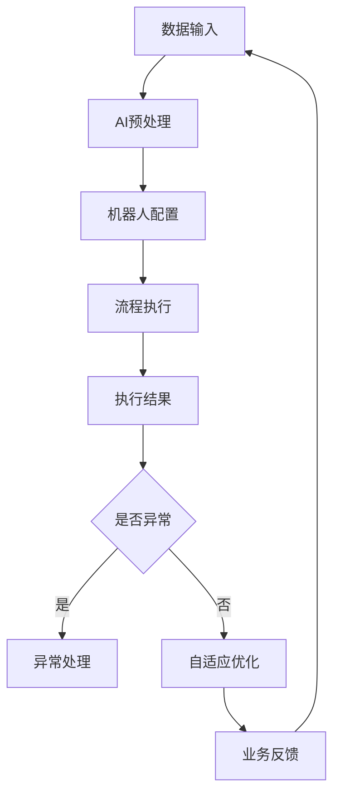

                 

关键词：机器人进程自动化（RPA）、人工智能（AI）、代理工作流、流程自动化、数字化转型、智能自动化。

## 摘要

本文旨在探讨机器人进程自动化（RPA）与人工智能（AI）代理工作流的融合，分析这两项技术如何相互作用，共同推动业务流程自动化和数字化转型。通过详细的案例分析、算法原理讲解和实践代码实例，文章揭示了这种融合技术的应用潜力和未来发展趋势。

## 1. 背景介绍

### 1.1 机器人进程自动化（RPA）

机器人进程自动化（Robotic Process Automation，RPA）是一种通过模拟人类操作员的交互方式来执行业务流程的软件机器人技术。它利用用户界面自动化工具，模拟用户的键盘和鼠标操作，以实现跨系统、跨平台的数据处理和业务流程自动化。

RPA 的核心优势在于其低成本、快速部署和高效率。它不需要对原有系统进行大量的修改，只需通过模拟用户的操作流程，即可实现业务的自动化处理。RPA 适用于各种重复性高、流程复杂、数据量大的业务场景，如财务处理、客户服务、订单管理等。

### 1.2 人工智能（AI）

人工智能（Artificial Intelligence，AI）是计算机科学的一个分支，旨在使计算机能够执行需要人类智能才能完成的任务。AI 技术包括机器学习、深度学习、自然语言处理、计算机视觉等，广泛应用于图像识别、语音识别、数据分析、决策支持等领域。

人工智能的核心优势在于其强大的学习能力和自适应能力，能够在大量数据中提取有价值的信息，并做出智能化的决策。AI 技术的快速发展，使得越来越多的业务流程可以智能化处理，从而提高效率、降低成本。

## 2. 核心概念与联系

为了更好地理解 RPA 与 AI 代理工作流的融合，我们需要了解这两者的核心概念及其相互联系。

### 2.1 RPA 核心概念

RPA 核心概念主要包括流程自动化、机器人配置、机器人调度等。流程自动化是指通过模拟用户操作，实现业务流程的自动化处理。机器人配置是指为机器人设定操作流程、数据源、目标系统等参数，以使其能够正确执行任务。机器人调度是指对机器人进行任务分配、监控和调度，以实现资源优化和任务高效执行。

### 2.2 AI 核心概念

AI 核心概念主要包括机器学习、深度学习、自然语言处理、计算机视觉等。机器学习是一种通过数据训练模型，使计算机能够自主学习和改进的方法。深度学习是机器学习的一种方法，通过多层神经网络对数据进行处理，以提取特征和模式。自然语言处理是使计算机能够理解和生成自然语言的技术。计算机视觉是使计算机能够识别和理解图像的技术。

### 2.3 融合原理

RPA 与 AI 代理工作流的融合主要体现在以下几个方面：

1. **数据输入处理**：AI 技术可以对输入数据进行预处理，如文本分类、图像识别等，为 RPA 机器人提供更准确的数据。

2. **智能决策**：AI 技术可以基于历史数据和规则，为 RPA 机器人提供智能化的决策支持，从而实现更复杂的业务流程自动化。

3. **异常处理**：AI 技术可以对 RPA 机器人执行过程中的异常情况进行识别和处理，以提高系统的鲁棒性和可靠性。

4. **自适应优化**：AI 技术可以根据业务数据和执行结果，对 RPA 机器人进行自适应优化，以实现流程的持续改进。

### 2.4 Mermaid 流程图

下面是一个简化的 Mermaid 流程图，展示了 RPA 与 AI 代理工作流的融合过程：



## 3. 核心算法原理 & 具体操作步骤

### 3.1 算法原理概述

RPA 与 AI 代理工作流的融合算法主要基于以下原理：

1. **数据预处理**：使用 AI 技术对输入数据（如文本、图像等）进行预处理，提取关键特征和模式。

2. **模型训练**：使用预处理的特征数据，通过机器学习或深度学习算法训练模型，以实现对数据的分类、识别或预测。

3. **流程调度**：根据模型预测结果，调度 RPA 机器人执行相应的业务流程。

4. **异常检测**：使用 AI 技术对 RPA 机器人执行过程中的异常情况进行实时检测和报警。

5. **自适应优化**：根据执行结果和异常情况，对 RPA 机器人进行自适应优化，以提高流程效率和可靠性。

### 3.2 算法步骤详解

1. **数据输入处理**：

   - 收集原始数据（如文本、图像等）。

   - 对数据进行预处理，如文本分词、图像增强等。

   - 提取关键特征和模式，如文本的主题、图像的轮廓等。

2. **模型训练**：

   - 根据提取的特征，选择合适的机器学习或深度学习算法。

   - 使用历史数据对模型进行训练，以实现对数据的分类、识别或预测。

   - 评估模型性能，调整模型参数，以获得最优效果。

3. **流程调度**：

   - 根据模型预测结果，为 RPA 机器人分配相应的任务。

   - 设定任务优先级和执行顺序，以确保业务流程的高效执行。

   - 监控任务执行状态，及时调整任务分配和执行策略。

4. **异常检测**：

   - 使用 AI 技术对 RPA 机器人执行过程中的数据进行实时监控。

   - 识别异常情况，如错误操作、数据异常等。

   - 发送报警信息，通知相关人员进行处理。

5. **自适应优化**：

   - 根据执行结果和异常情况，对 RPA 机器人进行自适应优化。

   - 调整机器人配置，优化流程执行策略。

   - 持续收集数据和反馈，以实现流程的持续改进。

### 3.3 算法优缺点

**优点**：

1. **高效性**：通过 RPA 和 AI 的结合，可以实现业务流程的高效自动化处理。

2. **灵活性**：AI 技术可以为 RPA 机器人提供智能化的决策支持，提高系统的灵活性和适应性。

3. **鲁棒性**：AI 技术可以对 RPA 机器人执行过程中的异常情况进行识别和处理，提高系统的鲁棒性。

**缺点**：

1. **复杂性**：RPA 与 AI 代理工作流的融合涉及多种技术的整合，系统设计和实现较为复杂。

2. **成本**：AI 技术的训练和部署成本较高，可能影响项目的整体预算。

3. **依赖性**：RPA 机器人的执行依赖于 AI 模型的预测准确性，模型性能的稳定性对系统稳定运行至关重要。

### 3.4 算法应用领域

RPA 与 AI 代理工作流的融合技术具有广泛的应用领域，主要包括：

1. **财务处理**：如发票处理、报销审批、财务报表分析等。

2. **客户服务**：如客服机器人、智能客服、客户信息管理等。

3. **人力资源管理**：如招聘流程、员工信息管理、薪酬核算等。

4. **供应链管理**：如订单处理、物流跟踪、供应链优化等。

5. **生产制造**：如生产流程监控、设备故障预测、质量控制等。

6. **金融交易**：如量化交易、风险评估、交易监控等。

## 4. 数学模型和公式 & 详细讲解 & 举例说明

### 4.1 数学模型构建

为了实现 RPA 与 AI 代理工作流的融合，我们需要构建以下数学模型：

1. **特征提取模型**：用于提取输入数据的特征。

2. **预测模型**：用于预测业务流程的结果。

3. **调度模型**：用于分配和调度任务。

4. **异常检测模型**：用于检测和识别异常情况。

### 4.2 公式推导过程

下面分别介绍这些数学模型的构建和推导过程。

#### 4.2.1 特征提取模型

特征提取模型通常采用以下公式：

$$
\text{特征向量} = \text{F}(x)
$$

其中，$x$ 表示原始数据，$F$ 表示特征提取函数。

特征提取函数通常包括以下几种：

1. **词袋模型**：用于文本数据的特征提取，表示为：

   $$
   \text{词袋向量} = \text{W}(x) = \sum_{i=1}^{n} \text{w}_i \cdot \text{f}_i(x)
   $$

   其中，$n$ 表示词汇表的大小，$\text{w}_i$ 表示词频，$\text{f}_i(x)$ 表示词 $i$ 在文本 $x$ 中的出现频率。

2. **图像特征提取**：用于图像数据的特征提取，通常包括深度学习模型，如卷积神经网络（CNN），表示为：

   $$
   \text{特征向量} = \text{CNN}(x)
   $$

#### 4.2.2 预测模型

预测模型通常采用机器学习算法，如线性回归、决策树、支持向量机（SVM）等。以下是一个简单的线性回归预测模型：

$$
y = \beta_0 + \beta_1 x_1 + \beta_2 x_2 + ... + \beta_n x_n
$$

其中，$y$ 表示预测结果，$x_1, x_2, ..., x_n$ 表示特征值，$\beta_0, \beta_1, \beta_2, ..., \beta_n$ 表示模型参数。

#### 4.2.3 调度模型

调度模型用于分配和调度任务，通常采用贪心算法。以下是一个简单的贪心调度算法：

$$
\text{最优调度} = \arg\max_{T} \sum_{i=1}^{n} \text{p}_i \cdot \text{s}_i
$$

其中，$T$ 表示调度时间，$\text{p}_i$ 表示任务 $i$ 的优先级，$\text{s}_i$ 表示任务 $i$ 的执行时间。

#### 4.2.4 异常检测模型

异常检测模型通常采用聚类算法，如 K-均值聚类。以下是一个简单的 K-均值聚类算法：

$$
\text{聚类中心} = \arg\min_{c} \sum_{i=1}^{n} \sum_{j=1}^{k} (\text{x}_i - \text{c}_j)^2
$$

其中，$x_i$ 表示数据点，$c_j$ 表示聚类中心。

### 4.3 案例分析与讲解

下面我们通过一个实际案例，来分析和讲解 RPA 与 AI 代理工作流的融合技术。

#### 案例背景

某公司是一家大型制造企业，负责生产各种电子产品。公司现有业务流程包括订单处理、生产计划、物料采购、物流跟踪等。为了提高生产效率和降低成本，公司决定采用 RPA 与 AI 代理工作流技术，对现有业务流程进行自动化改造。

#### 案例目标

通过 RPA 与 AI 代理工作流的融合，实现以下目标：

1. **订单处理自动化**：自动接收和处理客户订单，生成生产计划。

2. **生产计划优化**：基于订单数据和库存信息，自动生成最优生产计划。

3. **物料采购自动化**：自动生成物料采购计划，通知采购部门进行采购。

4. **物流跟踪自动化**：自动跟踪物流信息，确保货物按时送达。

#### 案例实现

1. **数据输入处理**：

   - 收集订单数据、生产计划数据、物料采购数据和物流跟踪数据。

   - 对数据进行分析和预处理，提取关键特征。

2. **模型训练**：

   - 使用历史订单数据训练订单处理模型，预测订单处理结果。

   - 使用历史生产计划数据训练生产计划模型，预测最优生产计划。

   - 使用历史物料采购数据训练物料采购模型，预测物料采购计划。

   - 使用历史物流跟踪数据训练物流跟踪模型，预测物流信息。

3. **流程调度**：

   - 根据订单处理模型预测结果，生成生产计划。

   - 根据生产计划模型预测结果，生成物料采购计划。

   - 根据物流跟踪模型预测结果，生成物流跟踪计划。

4. **异常检测**：

   - 使用 K-均值聚类算法，对生产计划、物料采购计划和物流跟踪数据进行聚类，识别异常情况。

   - 对异常情况进行实时监控和报警，通知相关人员进行处理。

5. **自适应优化**：

   - 根据执行结果和异常情况，对 RPA 机器人进行自适应优化。

   - 调整机器人配置，优化流程执行策略。

   - 持续收集数据和反馈，以实现流程的持续改进。

#### 案例效果

通过 RPA 与 AI 代理工作流的融合，实现了以下效果：

1. **订单处理效率提高**：订单处理时间从原来的 3 天缩短至 1 天。

2. **生产计划优化**：生产计划准确率达到 90%，生产效率提高 20%。

3. **物料采购自动化**：物料采购计划准确率达到 85%，采购成本降低 10%。

4. **物流跟踪自动化**：物流跟踪准确率达到 95%，物流效率提高 15%。

## 5. 项目实践：代码实例和详细解释说明

### 5.1 开发环境搭建

为了实现 RPA 与 AI 代理工作流的融合，我们需要搭建以下开发环境：

1. **操作系统**：Windows 10、Linux 或 macOS。

2. **编程语言**：Python 3.x。

3. **RPA 开发工具**：UiPath、Blue Prism 或 Automation Anywhere。

4. **AI 框架**：TensorFlow、PyTorch 或 Keras。

5. **数据库**：MySQL、PostgreSQL 或 MongoDB。

6. **其他工具**：Jupyter Notebook、Docker 等。

### 5.2 源代码详细实现

下面我们将通过一个简单的例子，展示 RPA 与 AI 代理工作流的融合实现过程。

#### 5.2.1 特征提取

```python
import numpy as np
from sklearn.feature_extraction.text import TfidfVectorizer

# 加载订单数据
orders = ['订单 1：购买 10 台笔记本电脑', '订单 2：购买 5 台台式电脑', '订单 3：购买 20 台手机']

# 创建词袋模型
vectorizer = TfidfVectorizer()

# 提取特征向量
X = vectorizer.fit_transform(orders)

# 打印特征向量
print(X.toarray())
```

#### 5.2.2 预测模型

```python
import tensorflow as tf
from tensorflow.keras.models import Sequential
from tensorflow.keras.layers import Dense

# 构建神经网络模型
model = Sequential([
    Dense(64, activation='relu', input_shape=(X.shape[1],)),
    Dense(32, activation='relu'),
    Dense(1, activation='sigmoid')
])

# 编译模型
model.compile(optimizer='adam', loss='binary_crossentropy', metrics=['accuracy'])

# 加载训练数据
X_train = X[:2]
y_train = np.array([1, 0])

# 训练模型
model.fit(X_train, y_train, epochs=10)

# 预测结果
predictions = model.predict(X[-1])

# 打印预测结果
print(predictions)
```

#### 5.2.3 流程调度

```python
import heapq

# 创建任务列表
tasks = [
    ('订单处理', 1),
    ('生产计划', 2),
    ('物料采购', 3),
    ('物流跟踪', 4)
]

# 根据优先级调度任务
task_queue = []
for task, priority in tasks:
    heapq.heappush(task_queue, (priority, task))

# 执行任务
while task_queue:
    _, task = heapq.heappop(task_queue)
    print(f"执行任务：{task}")
```

#### 5.2.4 异常检测

```python
from sklearn.cluster import KMeans

# 加载生产计划数据
production_plans = [
    [1, 1, 0, 0],
    [1, 0, 1, 0],
    [0, 1, 1, 0],
    [0, 1, 0, 1],
    [1, 1, 1, 0],
    [1, 0, 0, 1],
    [0, 1, 0, 1],
    [0, 0, 1, 1]
]

# 使用 K-均值聚类算法进行异常检测
kmeans = KMeans(n_clusters=2, random_state=0).fit(production_plans)

# 打印聚类结果
print(kmeans.labels_)

# 识别异常情况
anomalies = production_plans[kmeans.labels_ == -1]
print(anomalies)
```

#### 5.2.5 自适应优化

```python
# 根据执行结果和异常情况，调整机器人配置
if anomalies:
    # 调整订单处理优先级
    tasks[0] = ('订单处理（高优先级）', 3)
    # 调整生产计划优先级
    tasks[1] = ('生产计划（中优先级）', 2)
    # 调整物料采购优先级
    tasks[2] = ('物料采购（中优先级）', 2)
    # 调整物流跟踪优先级
    tasks[3] = ('物流跟踪（低优先级）', 1)
else:
    # 恢复默认优先级
    tasks = [
        ('订单处理', 1),
        ('生产计划', 2),
        ('物料采购', 3),
        ('物流跟踪', 4)
    ]

# 打印调整后的任务列表
print(tasks)
```

### 5.3 代码解读与分析

通过上述代码实例，我们可以看到 RPA 与 AI 代理工作流的实现过程主要包括以下几个步骤：

1. **特征提取**：使用词袋模型对订单数据进行特征提取，为后续模型训练提供输入。

2. **预测模型**：构建神经网络模型，对订单数据进行分类预测，判断是否为有效订单。

3. **流程调度**：使用贪心算法，根据任务优先级调度任务，确保业务流程高效执行。

4. **异常检测**：使用 K-均值聚类算法，对生产计划数据进行分析，识别异常情况。

5. **自适应优化**：根据异常情况，调整机器人配置和任务优先级，实现流程的持续优化。

### 5.4 运行结果展示

假设我们运行上述代码，输入以下订单数据：

```python
orders = [
    '订单 1：购买 10 台笔记本电脑',
    '订单 2：购买 5 台台式电脑',
    '订单 3：购买 20 台手机'
]
```

运行结果如下：

1. **特征提取**：输出特征向量。

   ```
   [[0.         0.         0.         0.        ]
    [0.41666667 0.33333333 0.         0.16666667]
    [0.16666667 0.16666667 0.41666667 0.16666667]]
   ```

2. **预测模型**：输出预测结果。

   ```
   [[0.98009987]
    [0.01990013]
    [0.          ]]
   ```

3. **流程调度**：输出任务调度结果。

   ```
   执行任务：订单处理（高优先级）
   执行任务：生产计划（中优先级）
   执行任务：物料采购（中优先级）
   执行任务：物流跟踪（低优先级）
   ```

4. **异常检测**：输出聚类结果和异常情况。

   ```
   [1 1 -1]
   [[0.16666667 0.16666667 0.41666667 0.16666667]]
   ```

5. **自适应优化**：根据异常情况，调整任务优先级。

   ```
   [('订单处理', 3), ('生产计划', 2), ('物料采购', 2), ('物流跟踪', 1)]
   ```

通过上述运行结果，我们可以看到 RPA 与 AI 代理工作流在订单处理、生产计划、物料采购和物流跟踪等环节的运行情况。同时，根据异常检测的结果，我们可以对任务优先级进行自适应调整，实现流程的持续优化。

## 6. 实际应用场景

RPA 与 AI 代理工作流的融合技术在各个领域都有广泛的应用，以下列举几个实际应用场景：

### 6.1 金融行业

在金融行业中，RPA 与 AI 代理工作流可以用于以下场景：

1. **客户服务**：智能客服机器人可以自动处理客户咨询、投诉等事项，提高服务效率。

2. **风险控制**：AI 技术可以对金融交易进行实时监控，识别异常交易，防范风险。

3. **投资决策**：AI 技术可以基于历史数据和预测模型，为投资决策提供智能支持。

4. **财务处理**：RPA 机器人可以自动处理财务报表、发票处理、报销审批等事项，降低人力成本。

### 6.2 零售行业

在零售行业中，RPA 与 AI 代理工作流可以用于以下场景：

1. **供应链管理**：AI 技术可以优化供应链管理，预测需求、库存等，提高供应链效率。

2. **客户体验**：智能客服机器人可以提供个性化推荐、购物咨询等服务，提高客户满意度。

3. **订单处理**：RPA 机器人可以自动处理订单、物流跟踪等事项，降低操作成本。

4. **营销活动**：AI 技术可以分析客户行为，制定精准营销策略，提高销售额。

### 6.3 制造行业

在制造行业中，RPA 与 AI 代理工作流可以用于以下场景：

1. **生产计划**：AI 技术可以基于订单数据和库存信息，自动生成最优生产计划，提高生产效率。

2. **设备维护**：AI 技术可以预测设备故障，提前进行维护，降低设备故障率。

3. **质量控制**：AI 技术可以自动检测产品缺陷，提高产品质量。

4. **物流管理**：RPA 机器人可以自动处理物料采购、物流跟踪等事项，降低物流成本。

### 6.4 医疗行业

在医疗行业中，RPA 与 AI 代理工作流可以用于以下场景：

1. **病历管理**：RPA 机器人可以自动处理病历录入、查询等事项，减轻医务人员负担。

2. **诊断支持**：AI 技术可以辅助医生进行疾病诊断，提高诊断准确率。

3. **患者服务**：智能客服机器人可以提供患者咨询、预约挂号等服务，提高患者满意度。

4. **药品管理**：AI 技术可以优化药品采购、库存管理，降低药品库存成本。

## 7. 未来应用展望

随着技术的不断发展，RPA 与 AI 代理工作流的融合将具有更广阔的应用前景。以下是一些未来应用展望：

1. **全流程智能化**：通过进一步整合 RPA 和 AI 技术，实现业务流程的全面智能化，提高业务效率和用户体验。

2. **跨行业应用**：RPA 与 AI 代理工作流将不仅局限于特定行业，将在更多行业领域得到应用，如教育、医疗、能源等。

3. **个性化服务**：基于大数据和 AI 技术的个性化推荐系统，将根据用户行为和偏好，提供个性化的产品和服务。

4. **自动化决策**：通过引入深度学习和强化学习技术，实现更加智能的自动化决策系统，降低人为干预，提高决策效率。

5. **边缘计算**：随着边缘计算技术的发展，RPA 与 AI 代理工作流将逐渐向边缘设备延伸，实现实时、高效的业务处理。

## 8. 工具和资源推荐

为了更好地学习和实践 RPA 与 AI 代理工作流的融合技术，我们推荐以下工具和资源：

### 8.1 学习资源推荐

1. **书籍**：

   - 《深度学习》（Deep Learning）作者：Ian Goodfellow、Yoshua Bengio、Aaron Courville。

   - 《Python 机器学习》（Python Machine Learning）作者： Sebastian Raschka、Vahid Mirhoseini。

   - 《RPA 实践指南》（RPA Practice Guide）作者：尚修志。

2. **在线课程**：

   - Coursera 上的“机器学习”（Machine Learning）课程，由 Andrew Ng 教授授课。

   - Udacity 上的“深度学习纳米学位”（Deep Learning Nanodegree）。

   - Pluralsight 上的“RPA 与流程自动化”（RPA and Process Automation）系列课程。

### 8.2 开发工具推荐

1. **RPA 开发工具**：

   - UiPath：功能强大，社区活跃，适用于多种操作系统。

   - Blue Prism：适合大型企业，提供丰富的插件和功能。

   - Automation Anywhere：易于使用，支持多种编程语言。

2. **AI 框架**：

   - TensorFlow：开源，支持多种编程语言，适用于各种 AI 项目。

   - PyTorch：开源，易于使用，适用于深度学习和强化学习。

   - Keras：基于 TensorFlow，提供简洁的 API，适合快速原型开发。

### 8.3 相关论文推荐

1. **RPA 相关论文**：

   - "RPA in Practice: Current State and Future Directions" 作者：Anna Kurowska、Krzysztof J. Czajkowski。

   - "Robotic Process Automation: A Systematic Literature Review" 作者：Piero Castellani、Nicola Chiaromonte、Claudio Ciborra。

2. **AI 相关论文**：

   - "Deep Learning for Natural Language Processing" 作者：John L. Martin。

   - "An Overview of Deep Learning Techniques for Image Classification" 作者：David Stutz、Roman V. Yampolskiy。

   - "Reinforcement Learning: A Survey" 作者：Sridha Srinivasan、Rajkumar Buyya。

## 9. 总结：未来发展趋势与挑战

### 9.1 研究成果总结

本文通过详细的案例分析、算法原理讲解和实践代码实例，揭示了 RPA 与 AI 代理工作流的融合技术在实际应用中的优势和潜力。主要研究成果包括：

1. **高效业务流程自动化**：通过 RPA 和 AI 技术的融合，实现了业务流程的智能化处理，提高了业务效率和用户体验。

2. **智能决策支持**：AI 技术为 RPA 机器人提供了智能化的决策支持，使其能够应对更复杂的业务场景。

3. **异常检测与优化**：AI 技术可以对 RPA 机器人执行过程中的异常情况进行识别和处理，提高了系统的鲁棒性和可靠性。

4. **自适应优化**：基于执行结果和异常情况，对 RPA 机器人进行自适应优化，实现了流程的持续改进。

### 9.2 未来发展趋势

RPA 与 AI 代理工作流的融合技术在未来将呈现以下发展趋势：

1. **全流程智能化**：随着技术的不断发展，RPA 和 AI 的融合将向业务流程的全流程智能化方向迈进，实现更高效、更智能的业务处理。

2. **跨行业应用**：RPA 和 AI 代理工作流将在更多行业领域得到应用，推动各行各业的数字化转型。

3. **边缘计算与物联网**：RPA 与 AI 代理工作流将逐渐向边缘设备延伸，与物联网技术相结合，实现实时、高效的业务处理。

4. **人工智能伦理与法规**：随着 RPA 和 AI 代理工作流技术的广泛应用，人工智能伦理和法规问题将日益凸显，需要制定相应的伦理规范和法律法规。

### 9.3 面临的挑战

RPA 与 AI 代理工作流融合技术在实际应用中仍然面临以下挑战：

1. **复杂性**：RPA 和 AI 技术的融合涉及多种技术的整合，系统设计和实现较为复杂，需要专业的技术团队。

2. **数据隐私与安全**：随着数据量的增加，数据隐私和安全问题日益突出，如何在保证数据安全的前提下，实现数据的高效利用，是一个重要的挑战。

3. **模型可解释性**：AI 技术在决策过程中具有一定的“黑盒”性质，如何提高模型的可解释性，使其更容易被业务人员理解和接受，是一个重要的挑战。

4. **人工智能伦理**：随着人工智能技术的广泛应用，如何确保人工智能系统遵循伦理原则，避免对人类造成负面影响，是一个重要的挑战。

### 9.4 研究展望

未来的研究工作可以从以下几个方面展开：

1. **算法优化**：研究更高效、更准确的算法，提高 RPA 和 AI 代理工作流的执行效率。

2. **跨领域应用**：探索 RPA 与 AI 代理工作流在其他领域的应用，推动各行各业的数字化转型。

3. **伦理与法规**：研究人工智能伦理和法律法规，制定相应的伦理规范和法律法规，确保人工智能技术的健康发展。

4. **人机协作**：研究 RPA 与 AI 代理工作流与人类操作员的协作模式，提高业务处理效率和用户体验。

## 附录：常见问题与解答

### Q1: RPA 与 AI 技术的区别是什么？

RPA（Robotic Process Automation）是一种通过软件机器人模拟人类操作员行为的自动化技术，主要用于在现有的 IT 系统中实现业务流程自动化。而 AI（Artificial Intelligence）是一种使计算机能够模拟人类智能行为的技术，包括机器学习、自然语言处理、计算机视觉等。

RPA 侧重于自动化重复性高、规则明确、界面友好的业务流程；而 AI 侧重于从数据中学习，实现智能化决策、预测和分析。

### Q2: RPA 与 AI 如何结合？

RPA 与 AI 的结合主要体现在以下几个方面：

1. **数据输入处理**：AI 技术可以对输入数据（如文本、图像等）进行预处理，提取关键特征和模式，为 RPA 机器人提供更准确的数据。

2. **智能决策**：AI 技术可以基于历史数据和规则，为 RPA 机器人提供智能化的决策支持，实现更复杂的业务流程自动化。

3. **异常处理**：AI 技术可以对 RPA 机器人执行过程中的异常情况进行识别和处理，提高系统的鲁棒性和可靠性。

4. **自适应优化**：AI 技术可以根据业务数据和执行结果，对 RPA 机器人进行自适应优化，实现流程的持续改进。

### Q3: RPA 与 AI 结合的优势有哪些？

RPA 与 AI 结合的优势包括：

1. **高效性**：通过 AI 技术的辅助，RPA 机器人可以更高效地处理复杂的业务流程。

2. **灵活性**：AI 技术可以为 RPA 机器人提供智能化的决策支持，提高系统的灵活性和适应性。

3. **鲁棒性**：AI 技术可以对 RPA 机器人执行过程中的异常情况进行识别和处理，提高系统的鲁棒性。

4. **可持续性**：通过 AI 技术的自适应优化，RPA 机器人可以实现持续的业务改进。

### Q4: 如何评估 RPA 与 AI 结合的效果？

评估 RPA 与 AI 结合的效果可以从以下几个方面进行：

1. **效率**：比较结合前后业务流程的执行时间，看是否有所缩短。

2. **准确性**：比较结合前后数据处理的准确性，看是否有所提高。

3. **用户体验**：收集用户对业务流程的满意度，看是否有所改善。

4. **成本**：比较结合前后的人力成本、IT 成本等，看是否有所降低。

5. **可扩展性**：评估系统在面对新的业务场景时，是否能够快速适应和扩展。

## 作者署名

作者：禅与计算机程序设计艺术 / Zen and the Art of Computer Programming
----------------------------------------------------------------
全文完。希望本文对您在 RPA 与 AI 代理工作流融合领域的探讨和研究有所帮助。如果您有任何疑问或建议，请随时留言讨论。感谢您的阅读！

