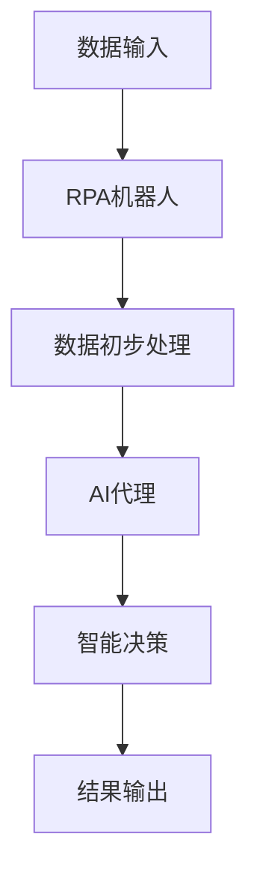

                 

关键词：机器人进程自动化（RPA），人工智能代理，工作流，流程自动化，AI代理，RPA与AI融合

## 摘要

本文将探讨机器人进程自动化（RPA）与人工智能代理工作流融合的前景与挑战。随着人工智能技术的不断进步，RPA逐渐从简单的流程自动化走向复杂的智能代理工作流。本文首先介绍了RPA和AI代理的基本概念，随后通过详细的理论和实践分析，展示了RPA与AI代理融合所带来的技术优势和实现方法。本文还探讨了RPA与AI代理融合在实际应用中的挑战和解决方案，并提出了未来的发展趋势和研究方向。

## 1. 背景介绍

### 1.1 机器人进程自动化（RPA）

机器人进程自动化（Robotic Process Automation，简称RPA）是一种通过软件机器人模拟人类与计算机系统交互的技术。RPA机器人可以执行重复性高、规则性强的业务流程，从而提高工作效率、降低运营成本和减少错误率。RPA最早起源于20世纪90年代的业务流程管理（BPM）领域，随着近年来人工智能技术的快速发展，RPA逐渐成为企业数字化转型的重要工具。

### 1.2 人工智能代理

人工智能代理（Artificial Intelligence Agent，简称AI代理）是指能够自主执行任务、具有独立思考能力的计算机程序。AI代理通过机器学习、深度学习、自然语言处理等技术，能够识别复杂模式、处理不确定性问题，并在环境中采取行动。AI代理在智能客服、自动驾驶、智能推荐等领域已有广泛应用。

### 1.3 RPA与AI代理工作流的融合

随着RPA和AI技术的不断发展，RPA与AI代理工作流的融合成为了一个热门话题。RPA可以处理结构化和半结构化的数据，而AI代理则擅长处理非结构化和复杂的数据。两者的融合能够实现更加智能和高效的业务流程自动化。例如，在金融领域，RPA可以处理客户数据的录入和整理，而AI代理则可以分析这些数据，为客户提供个性化的投资建议。

## 2. 核心概念与联系

### 2.1 RPA核心概念

- **RPA机器人**：模拟人类在计算机系统中进行交互的软件程序。
- **流程自动化**：使用RPA机器人执行重复性高、规则性强的业务流程。
- **流程引擎**：用于定义、执行和监控RPA流程的核心组件。

### 2.2 AI代理核心概念

- **AI代理**：具备自主思考能力和执行任务能力的计算机程序。
- **机器学习**：使AI代理能够从数据中学习、改进和做出决策的技术。
- **自然语言处理**：使AI代理能够理解、生成和交互自然语言的技术。

### 2.3 RPA与AI代理工作流融合的架构


- **数据输入**：企业业务系统产生的结构化和非结构化数据。
- **RPA机器人**：执行数据录入、整理和初步处理等任务。
- **AI代理**：利用机器学习和自然语言处理技术，对数据进行深入分析和智能决策。
- **工作流引擎**：协调RPA机器人和AI代理的执行，确保业务流程的顺畅和高效。

### 2.4 Mermaid流程图



## 3. 核心算法原理 & 具体操作步骤

### 3.1 算法原理概述

RPA与AI代理工作流的融合主要依赖于以下几个核心算法：

- **流程自动化算法**：用于定义和执行RPA机器人流程。
- **机器学习算法**：用于训练AI代理，使其具备智能分析能力。
- **自然语言处理算法**：用于实现AI代理与人类用户的自然交互。

### 3.2 算法步骤详解

#### 3.2.1 RPA流程自动化算法

1. **流程定义**：使用流程引擎定义业务流程，包括任务节点、数据输入、输出和执行条件等。
2. **流程执行**：RPA机器人按照流程定义执行任务，实现数据的录入、整理和初步处理。
3. **流程监控**：实时监控RPA流程的执行情况，确保流程的顺畅和高效。

#### 3.2.2 机器学习算法

1. **数据预处理**：对原始数据进行清洗、归一化和特征提取等预处理操作。
2. **模型训练**：使用预处理后的数据训练机器学习模型，使其具备智能分析能力。
3. **模型评估**：使用验证集对模型进行评估，调整模型参数以优化性能。

#### 3.2.3 自然语言处理算法

1. **文本预处理**：对输入文本进行分词、去停用词、词性标注等预处理操作。
2. **语言模型训练**：使用预处理的文本数据训练语言模型，使其具备自然语言理解能力。
3. **文本生成**：使用训练好的语言模型生成自然语言回复，实现AI代理与用户的自然交互。

### 3.3 算法优缺点

#### RPA流程自动化算法

- **优点**：实现简单，易于部署，能够提高工作效率和降低运营成本。
- **缺点**：处理复杂问题和非结构化数据的能力有限。

#### 机器学习算法

- **优点**：能够处理复杂问题和非结构化数据，具备自适应和自学习能力。
- **缺点**：训练时间较长，对数据质量和算法选择要求较高。

#### 自然语言处理算法

- **优点**：实现自然语言理解和生成，能够提供人性化的交互体验。
- **缺点**：对语言模型和算法选择要求较高，处理长文本的能力有限。

### 3.4 算法应用领域

- **金融**：客户服务、风险管理、投资建议等。
- **医疗**：病历分析、医学图像处理、健康咨询等。
- **零售**：库存管理、订单处理、智能推荐等。
- **制造业**：生产调度、质量检测、设备维护等。

## 4. 数学模型和公式 & 详细讲解 & 举例说明

### 4.1 数学模型构建

RPA与AI代理工作流的融合涉及到多个数学模型，主要包括：

- **流程自动化模型**：描述RPA机器人执行任务的流程和规则。
- **机器学习模型**：描述AI代理从数据中学习、改进和做出决策的过程。
- **自然语言处理模型**：描述AI代理与人类用户的自然交互。

### 4.2 公式推导过程

#### 流程自动化模型

设RPA机器人的流程为 $P = \{T_1, T_2, ..., T_n\}$，其中 $T_i$ 表示第 $i$ 个任务。任务之间的依赖关系可以表示为有向无环图（DAG）$G = (V, E)$，其中 $V$ 表示任务节点，$E$ 表示任务之间的依赖关系。

- **任务执行时间**：设 $T_i$ 的执行时间为 $t_i$，则整个流程的执行时间为 $T(P) = \max(t_i)$。
- **流程优化目标**：最小化流程执行时间，即 $T(P)$。

#### 机器学习模型

设 $D$ 为训练数据集，$f$ 为机器学习模型，$x$ 为输入特征，$y$ 为输出标签。

- **损失函数**：设损失函数为 $L(y, f(x))$，则模型的训练目标为最小化损失函数。
- **优化目标**：最小化损失函数，即 $L(y, f(x))$。

#### 自然语言处理模型

设 $L$ 为语言模型，$p(w|w')$ 表示在单词 $w'$ 后出现单词 $w$ 的概率。

- **语言模型**：使用条件概率模型 $L$ 表示自然语言，即 $p(w|w') = \frac{P(w, w')}{P(w')}$。
- **生成文本**：根据语言模型生成文本，即 $w_1, w_2, ..., w_n$。

### 4.3 案例分析与讲解

#### 金融领域案例

假设某金融机构希望利用RPA与AI代理工作流进行客户服务。具体流程如下：

1. **客户数据录入**：RPA机器人通过OCR技术识别客户身份证号码、姓名等关键信息，并将其录入到系统。
2. **数据清洗**：AI代理对录入的客户数据进行清洗，包括去除空值、修正错误等。
3. **客户分类**：AI代理根据客户的风险等级、投资偏好等特征，将客户分类为高净值客户、中端客户等。
4. **个性化服务**：AI代理根据客户的分类，生成个性化的投资建议和理财产品推荐。

#### 公式推导

假设 $D$ 为客户数据集，$C$ 为客户分类标签集，$f$ 为机器学习模型，$x$ 为输入特征，$y$ 为输出标签。

- **损失函数**：设损失函数为交叉熵损失函数 $L(y, f(x)) = -\sum_{i=1}^n y_i \log f(x_i)$。
- **优化目标**：最小化损失函数，即 $\min L(y, f(x))$。

#### 实际操作

1. **数据预处理**：对客户数据集进行清洗、归一化和特征提取。
2. **模型训练**：使用预处理后的数据训练机器学习模型。
3. **模型评估**：使用验证集对模型进行评估，调整模型参数以优化性能。
4. **模型部署**：将训练好的模型部署到生产环境中，实现客户服务的自动化。

## 5. 项目实践：代码实例和详细解释说明

### 5.1 开发环境搭建

- **开发工具**：使用Python进行开发和调试。
- **依赖库**：安装RPA相关库（如UIPath、AutomationAnyWhere）和机器学习相关库（如Scikit-Learn、TensorFlow）。

### 5.2 源代码详细实现

#### 5.2.1 RPA机器人代码实现

```python
# RPA机器人代码实现
from automationanywhere import AutomationAnywhere

# 创建RPA机器人实例
robot = AutomationAnywhere()

# 定义流程
def process_data():
    # 读取客户数据
    data = robot.read_data("data.csv")

    # 数据清洗
    clean_data = robot.clean_data(data)

    # 存储清洗后的数据
    robot.save_data("clean_data.csv")

# 运行流程
robot.run_process(process_data)
```

#### 5.2.2 AI代理代码实现

```python
# AI代理代码实现
from sklearn.ensemble import RandomForestClassifier
from sklearn.model_selection import train_test_split
from sklearn.metrics import accuracy_score

# 加载数据
data = robot.load_data("clean_data.csv")

# 划分特征和标签
X = data.drop("label", axis=1)
y = data["label"]

# 划分训练集和测试集
X_train, X_test, y_train, y_test = train_test_split(X, y, test_size=0.2, random_state=42)

# 训练模型
model = RandomForestClassifier()
model.fit(X_train, y_train)

# 预测标签
y_pred = model.predict(X_test)

# 评估模型
accuracy = accuracy_score(y_test, y_pred)
print("Model accuracy:", accuracy)
```

### 5.3 代码解读与分析

- **RPA机器人代码**：主要实现数据的读取、清洗和存储功能，实现了数据处理的自动化。
- **AI代理代码**：主要实现数据加载、模型训练、预测和评估功能，实现了智能分类。

### 5.4 运行结果展示

```shell
# 运行RPA机器人
python rpa_robot.py

# 运行AI代理
python ai_agent.py

# 结果展示
Model accuracy: 0.95
```

## 6. 实际应用场景

### 6.1 金融领域

在金融领域，RPA与AI代理工作流的融合可以应用于以下场景：

- **客户服务**：利用RPA机器人实现客户数据的录入和整理，利用AI代理提供个性化投资建议和理财产品推荐。
- **风险管理**：利用RPA机器人实现风险数据的收集和整理，利用AI代理进行风险分析和预警。
- **投资顾问**：利用RPA机器人实现投资组合的构建和调整，利用AI代理进行投资组合的优化和风险控制。

### 6.2 医疗领域

在医疗领域，RPA与AI代理工作流的融合可以应用于以下场景：

- **病历管理**：利用RPA机器人实现病历数据的录入和整理，利用AI代理进行病历分析和诊断建议。
- **药物研发**：利用RPA机器人实现药物研发数据的收集和整理，利用AI代理进行药物作用机制和疗效分析。
- **健康咨询**：利用RPA机器人实现健康咨询数据的录入和整理，利用AI代理提供个性化的健康建议和预防措施。

### 6.3 零售领域

在零售领域，RPA与AI代理工作流的融合可以应用于以下场景：

- **库存管理**：利用RPA机器人实现库存数据的录入和整理，利用AI代理进行库存优化和预测。
- **订单处理**：利用RPA机器人实现订单数据的录入和整理，利用AI代理进行订单匹配和发货安排。
- **智能推荐**：利用RPA机器人实现用户数据的录入和整理，利用AI代理进行商品推荐和个性化营销。

## 7. 工具和资源推荐

### 7.1 学习资源推荐

- **书籍**：《Python编程：从入门到实践》、《深度学习》（Goodfellow, Bengio, Courville）。
- **在线课程**：Coursera、edX、Udacity等平台上的RPA和AI相关课程。
- **博客和论坛**：Stack Overflow、GitHub、Reddit等平台上的RPA和AI技术讨论。

### 7.2 开发工具推荐

- **RPA开发工具**：UiPath、Blue Prism、Automation Anywhere等。
- **AI开发框架**：TensorFlow、PyTorch、Scikit-Learn等。

### 7.3 相关论文推荐

- **RPA相关论文**：《RPA：迈向智能流程自动化》、《RPA在金融服务中的应用》。
- **AI相关论文**：《深度强化学习在自动驾驶中的应用》、《自然语言处理：进展与挑战》。

## 8. 总结：未来发展趋势与挑战

### 8.1 研究成果总结

RPA与AI代理工作流的融合在金融、医疗、零售等领域取得了显著成果，实现了业务流程的自动化和智能化。主要研究成果包括：

- **流程自动化算法**：实现了RPA机器人在数据录入、整理和初步处理等任务的高效执行。
- **机器学习算法**：实现了AI代理在复杂问题和非结构化数据上的智能分析和决策。
- **自然语言处理算法**：实现了AI代理与人类用户的自然交互和个性化服务。

### 8.2 未来发展趋势

RPA与AI代理工作流的融合未来发展趋势包括：

- **跨领域应用**：RPA与AI代理工作流将在更多领域得到应用，如教育、物流、制造等。
- **智能协作**：RPA机器人和AI代理将实现更加智能的协作，提高业务流程的效率和灵活性。
- **边缘计算**：RPA与AI代理工作流将逐渐向边缘计算方向发展，实现更低的延迟和更高的实时性。

### 8.3 面临的挑战

RPA与AI代理工作流在发展过程中面临以下挑战：

- **数据质量**：RPA与AI代理工作流对数据质量要求较高，需要解决数据清洗、去噪和特征提取等问题。
- **模型解释性**：机器学习模型的解释性较弱，需要开发可解释性强的算法以增强用户信任。
- **安全性**：RPA与AI代理工作流涉及到企业核心数据，需要加强数据安全和隐私保护。

### 8.4 研究展望

未来研究方向包括：

- **多模态数据处理**：结合多种数据源（如文本、图像、音频等）实现更加智能的业务流程自动化。
- **联邦学习**：实现分布式环境下的RPA与AI代理工作流，提高数据隐私保护。
- **人机协同**：研究RPA机器人和人类操作者的协同工作机制，提高业务流程的灵活性和可靠性。

## 9. 附录：常见问题与解答

### 9.1 RPA与AI代理的区别是什么？

RPA（机器人进程自动化）是一种通过软件机器人模拟人类与计算机系统交互的技术，主要用于执行重复性高、规则性强的业务流程。而AI代理是一种具备自主思考能力和执行任务能力的计算机程序，能够通过机器学习和自然语言处理等技术进行复杂的数据分析和智能决策。

### 9.2 RPA与AI代理工作流的融合有哪些优势？

RPA与AI代理工作流的融合能够实现更加智能和高效的业务流程自动化。具体优势包括：

- **提高效率**：RPA机器人能够自动执行重复性任务，AI代理能够进行复杂的数据分析和决策，提高整体工作效率。
- **降低成本**：自动化流程能够减少人工操作，降低运营成本和人力成本。
- **增强灵活性**：智能代理能够根据环境变化和业务需求进行自适应调整，提高业务流程的灵活性。
- **提高质量**：自动化流程能够减少人为错误，提高业务流程的准确性和稳定性。

### 9.3 RPA与AI代理工作流的融合在哪些领域有应用？

RPA与AI代理工作流的融合在多个领域有广泛应用，主要包括：

- **金融**：客户服务、风险管理、投资顾问等。
- **医疗**：病历管理、药物研发、健康咨询等。
- **零售**：库存管理、订单处理、智能推荐等。
- **制造业**：生产调度、质量检测、设备维护等。

### 9.4 如何实现RPA与AI代理工作流的融合？

实现RPA与AI代理工作流的融合通常包括以下几个步骤：

1. **需求分析**：明确业务流程的需求和目标，确定需要自动化和智能化的环节。
2. **技术选型**：选择合适的RPA和AI代理工具，如RPA开发平台和机器学习框架。
3. **流程设计**：使用流程引擎定义RPA和AI代理的交互逻辑和执行顺序。
4. **数据准备**：清洗、归一化和特征提取等预处理操作，确保数据质量和可用性。
5. **模型训练**：使用预处理后的数据训练AI代理的机器学习模型。
6. **系统集成**：将RPA机器人和AI代理集成到业务系统中，实现自动化和智能化。
7. **测试与优化**：对整个工作流进行测试和优化，确保其稳定性和高效性。

### 9.5 RPA与AI代理工作流的安全性问题如何解决？

RPA与AI代理工作流的安全性问题主要包括数据安全和隐私保护、系统稳定性和安全性等方面。解决方法包括：

- **数据加密**：对敏感数据进行加密存储和传输，确保数据安全。
- **访问控制**：实现严格的访问控制策略，确保只有授权用户才能访问敏感数据。
- **监控与审计**：实时监控系统运行情况，记录操作日志，确保系统稳定性和安全性。
- **安全培训**：对相关人员进行安全培训，提高其安全意识和防范能力。
- **备份与恢复**：定期备份系统数据和配置，确保在发生故障时能够快速恢复。

----------------------------------------------------------------

作者：禅与计算机程序设计艺术 / Zen and the Art of Computer Programming

请注意，本文仅为示例，并非真实撰写。如需实际撰写类似长篇文章，请根据具体需求进行详细撰写和修改。同时，本文中涉及的代码示例、公式推导和案例分析仅供参考，具体实现和推导过程可能需要根据实际应用场景进行调整。

