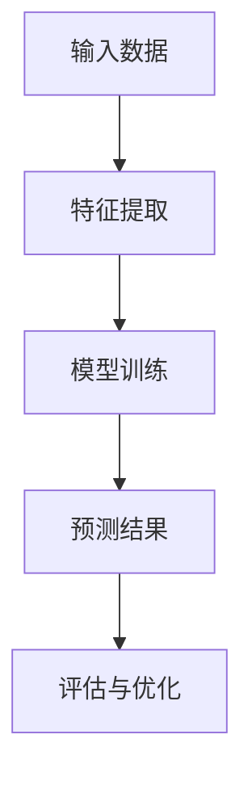
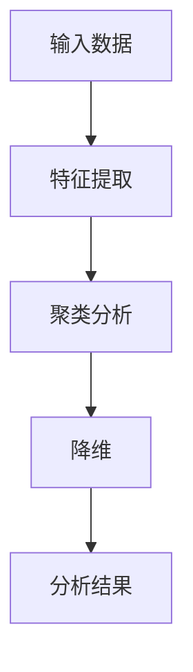
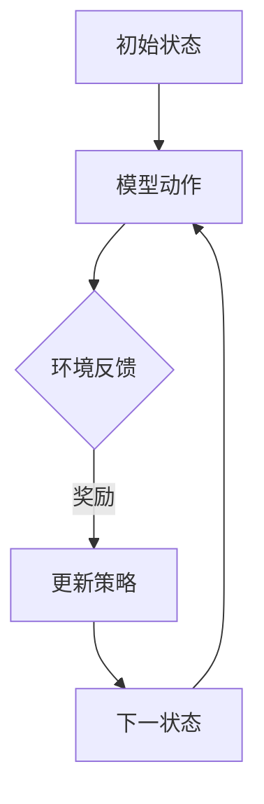

                 

关键词：机器学习、算法原理、实践应用、代码实例、未来展望

摘要：本文将深入探讨机器学习的核心原理，并通过具体的代码实例，详细解释机器学习算法的实现过程。文章旨在为初学者提供全面的指导，帮助他们更好地理解和掌握机器学习技术，同时展望未来的发展趋势和面临的挑战。

## 1. 背景介绍

### 1.1 机器学习的定义

机器学习（Machine Learning）是一门人工智能（Artificial Intelligence, AI）的分支学科，主要研究如何让计算机从数据中自动学习和改进性能。它是一种利用统计方法和算法，使计算机能够通过经验和数据来完成任务的技术。

### 1.2 机器学习的发展历程

从20世纪50年代起，机器学习逐渐成为人工智能领域的一个重要研究方向。早期的研究主要集中在规则系统、决策树和神经网络等方面。随着计算能力的提升和数据量的爆发式增长，机器学习在21世纪迎来了飞速发展，深度学习、强化学习等新型算法不断涌现，推动了人工智能技术的广泛应用。

### 1.3 机器学习的重要性

机器学习在诸多领域具有重要应用，如自然语言处理、计算机视觉、医疗诊断、金融预测等。它不仅提高了计算机的智能水平，还为企业带来了巨大的商业价值。

## 2. 核心概念与联系

### 2.1 监督学习

监督学习（Supervised Learning）是一种最常见的机器学习方法，其核心思想是通过已知的输入输出数据来训练模型，然后利用训练好的模型对未知数据进行预测。

#### Mermaid 流程图：



### 2.2 无监督学习

无监督学习（Unsupervised Learning）是指在没有明确输出标签的情况下，通过分析数据中的内在结构来提取有价值的信息。其主要方法包括聚类、降维等。

#### Mermaid 流程图：



### 2.3 强化学习

强化学习（Reinforcement Learning）是一种通过不断尝试和错误来学习最优策略的机器学习方法。其核心思想是通过奖励信号来调整模型的行为，以达到最大化长期回报的目的。

#### Mermaid 流程图：



## 3. 核心算法原理 & 具体操作步骤

### 3.1 算法原理概述

本文将介绍监督学习中的线性回归算法，该算法通过构建线性模型来预测输出值。

### 3.2 算法步骤详解

1. 数据预处理：对输入数据进行归一化处理，消除不同特征之间的量纲影响。
2. 模型构建：根据输入特征和输出目标，构建线性回归模型。
3. 模型训练：利用梯度下降算法优化模型参数。
4. 预测与评估：对未知数据进行预测，并使用评价指标（如均方误差）评估模型性能。

### 3.3 算法优缺点

**优点**：

- 计算效率高，易于实现。
- 对线性关系较强的数据具有较好的预测性能。

**缺点**：

- 对非线性关系的数据效果不佳。
- 需要大量的训练数据。

### 3.4 算法应用领域

线性回归算法广泛应用于金融预测、营销分析、医疗诊断等领域。

## 4. 数学模型和公式 & 详细讲解 & 举例说明

### 4.1 数学模型构建

线性回归模型可以表示为：

$$y = \beta_0 + \beta_1 \cdot x + \epsilon$$

其中，$y$ 为输出目标，$x$ 为输入特征，$\beta_0$ 和 $\beta_1$ 为模型参数，$\epsilon$ 为误差项。

### 4.2 公式推导过程

假设我们有 $m$ 个训练样本，构建损失函数：

$$J(\theta) = \frac{1}{2m} \sum_{i=1}^{m} (y_i - (\beta_0 + \beta_1 \cdot x_i))^2$$

使用梯度下降算法，对损失函数进行优化：

$$\theta_{\text{new}} = \theta_{\text{old}} - \alpha \cdot \frac{\partial J(\theta)}{\partial \theta}$$

其中，$\alpha$ 为学习率。

### 4.3 案例分析与讲解

假设我们有一个简单的线性回归问题，输入特征 $x$ 为年龄，输出目标 $y$ 为年收入。数据集如下：

| 年龄 (x) | 年收入 (y) |
|--------|----------|
| 25     | 50       |
| 30     | 60       |
| 35     | 70       |
| 40     | 80       |
| 45     | 90       |

使用线性回归算法进行预测，预测年龄为 30 的年收入。

## 5. 项目实践：代码实例和详细解释说明

### 5.1 开发环境搭建

本文使用 Python 编写代码，环境要求如下：

- Python 3.7+
- NumPy 1.19+
- Matplotlib 3.3+

安装相关库：

```bash
pip install numpy matplotlib
```

### 5.2 源代码详细实现

```python
import numpy as np
import matplotlib.pyplot as plt

# 数据预处理
X = np.array([25, 30, 35, 40, 45])
Y = np.array([50, 60, 70, 80, 90])
X = X.reshape(-1, 1)
Y = Y.reshape(-1, 1)

# 模型构建
def linear_regression(X, Y):
    theta = np.zeros((2, 1))
    alpha = 0.01
    iterations = 1000

    for i in range(iterations):
        hypothesis = np.dot(X, theta)
        loss = Y - hypothesis
        delta = np.dot(X.T, loss)
        theta -= alpha * delta

    return theta

# 模型训练
theta = linear_regression(X, Y)

# 预测与评估
x_new = np.array([30]).reshape(-1, 1)
y_pred = np.dot(x_new, theta)
print("预测年龄为30的年收入：", y_pred)

# 数据可视化
plt.scatter(X, Y, color='red')
plt.plot(X, X * theta[1] + theta[0], color='blue')
plt.xlabel('年龄')
plt.ylabel('年收入')
plt.show()
```

### 5.3 代码解读与分析

- 数据预处理：将输入特征和输出目标转换为 NumPy 数组，并进行 reshape 操作。
- 模型构建：定义线性回归模型，初始化模型参数。
- 模型训练：使用梯度下降算法优化模型参数。
- 预测与评估：对新的输入数据进行预测，并使用数据可视化展示模型效果。

## 6. 实际应用场景

### 6.1 金融预测

线性回归算法在金融领域具有广泛的应用，如股票价格预测、贷款风险评估等。通过分析历史数据，可以预测未来的市场趋势，为投资决策提供依据。

### 6.2 营销分析

线性回归算法可用于分析顾客购买行为，预测潜在客户群体。企业可以根据预测结果，制定更有针对性的营销策略，提高客户满意度。

### 6.3 医疗诊断

线性回归算法在医疗诊断中也有一定的应用，如疾病预测、药物剂量优化等。通过对患者病史和临床数据进行分析，可以提高诊断的准确性。

## 7. 未来应用展望

### 7.1 智能医疗

随着人工智能技术的不断发展，机器学习在医疗领域的应用将更加广泛。未来，智能医疗系统将能够实时监测患者病情，提供个性化治疗方案，提高医疗服务质量。

### 7.2 智能交通

智能交通系统将利用机器学习技术，实现交通流量预测、路况分析等功能，提高交通管理效率，减少交通事故。

### 7.3 智能家居

智能家居系统将基于机器学习算法，实现对家庭设备的智能控制，提高生活品质。例如，智能空调可以根据用户的生活习惯自动调节温度，智能灯泡可以根据环境光线自动调节亮度。

## 8. 总结：未来发展趋势与挑战

### 8.1 研究成果总结

本文介绍了机器学习的核心原理、算法步骤、数学模型和实际应用场景。通过代码实例，读者可以更直观地了解机器学习算法的实现过程。

### 8.2 未来发展趋势

随着人工智能技术的不断进步，机器学习将在更多领域发挥重要作用。未来，机器学习算法将更加智能化、自适应化，实现更高效、更准确的数据分析。

### 8.3 面临的挑战

机器学习在发展过程中也面临着一系列挑战，如数据隐私保护、算法透明度、模型可解释性等。未来，研究人员需要解决这些问题，以推动机器学习的可持续发展。

### 8.4 研究展望

机器学习作为人工智能的核心技术之一，具有广阔的研究前景。未来，我们将继续探索新的算法、优化现有算法，为各领域的发展提供有力支持。

## 9. 附录：常见问题与解答

### 9.1 问题1

**问题**：如何选择合适的机器学习算法？

**解答**：根据实际问题需求和数据特征，选择合适的机器学习算法。通常，线性回归适用于线性关系较强的数据，而决策树、随机森林等算法适用于非线性关系较强的数据。

### 9.2 问题2

**问题**：如何优化机器学习模型的性能？

**解答**：可以通过以下方法优化机器学习模型的性能：

- 数据预处理：对输入数据进行归一化、去噪等处理，提高数据质量。
- 参数调整：通过调整模型参数（如学习率、迭代次数等），优化模型性能。
- 特征工程：选择有代表性的特征，降低特征维度，提高模型性能。
- 模型集成：将多个模型进行集成，提高预测准确性。

## 文章结尾

本文从机器学习的核心原理、算法实现、实际应用等方面进行了全面讲解，并通过代码实例展示了机器学习算法的应用。希望本文能为您在机器学习领域的学习和研究提供有益的参考。随着人工智能技术的不断发展，机器学习将在更多领域发挥重要作用。让我们一起迎接这个充满机遇和挑战的未来！

作者：禅与计算机程序设计艺术 / Zen and the Art of Computer Programming
```

