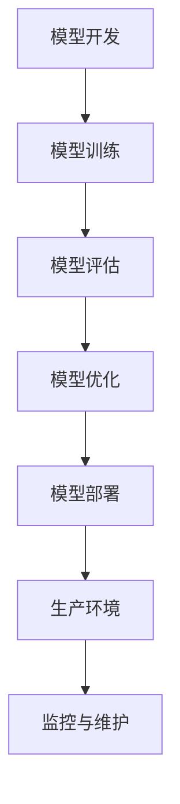

                 

关键词：机器学习、模型部署、开发到生产、算法、框架、工具、性能优化、安全性、分布式系统

> 摘要：本文将深入探讨机器学习模型的部署过程，从开发环境到生产环境的过渡，以及如何确保模型的高效、稳定和安全运行。我们将分析当前的主流部署架构、核心算法、数学模型，并提供实际的项目实践和未来展望。

## 1. 背景介绍

### 机器学习与模型部署的重要性

机器学习作为人工智能的核心技术，已经在各行各业得到广泛应用。从金融风控、医疗诊断到自动驾驶、智能语音助手，机器学习模型的应用不断推动着技术和社会的进步。然而，机器学习模型的开发与实际生产环境中的应用之间存在一定的鸿沟。如何将模型有效地部署到生产环境中，实现高效的计算、资源利用和可靠性，成为了当前研究和应用中的关键问题。

### 模型部署的需求与挑战

模型部署的需求包括以下几个方面：

1. **高性能计算**：生产环境需要模型具备高效的处理能力，以满足大规模数据输入的实时响应。
2. **资源利用**：需要优化模型的存储和计算资源，以实现高效能和成本效益。
3. **可靠性**：模型在部署过程中需要保证稳定性和可靠性，避免因故障导致服务中断。
4. **安全性**：保护模型和数据的安全，防止数据泄露和恶意攻击。

### 当前模型部署的常见方法与框架

当前，模型部署的主要方法包括：

1. **本地部署**：将模型部署在本地服务器上，适用于数据量较小、计算需求较低的场景。
2. **云部署**：利用云计算平台进行模型部署，适用于大规模数据处理和弹性计算需求。
3. **容器化部署**：使用容器技术（如Docker）进行模型部署，实现模型的标准化和可移植性。
4. **微服务架构**：将模型作为微服务部署在分布式系统中，实现高可用性和可扩展性。

主流的模型部署框架包括TensorFlow Serving、PyTorch Mobile、Kubeflow等，每种框架都有其独特的优势和适用场景。

## 2. 核心概念与联系

### Mermaid 流程图



### 核心概念解释

1. **模型开发**：包括数据预处理、特征工程、模型选择和训练。
2. **模型训练**：使用训练数据对模型进行调整，提高模型的预测能力。
3. **模型评估**：使用验证数据评估模型性能，确保模型达到预期效果。
4. **模型优化**：对模型进行调整和优化，提高模型的准确性和效率。
5. **模型部署**：将训练好的模型部署到生产环境中，实现模型的应用。
6. **生产环境**：模型的实际运行环境，包括硬件、软件和网络资源。
7. **监控与维护**：对模型运行情况进行监控，及时发现问题并进行维护。

## 3. 核心算法原理 & 具体操作步骤

### 3.1 算法原理概述

模型部署的核心算法包括以下方面：

1. **模型转换**：将训练好的模型转换为适合部署的格式，如TensorFlow Lite、ONNX等。
2. **模型优化**：对模型进行压缩和量化，提高模型在部署环境中的运行效率。
3. **模型部署**：将优化后的模型部署到生产环境，包括本地部署、云部署和容器化部署。
4. **模型监控**：实时监控模型运行状态，包括性能、准确率和资源使用情况。

### 3.2 算法步骤详解

1. **模型转换**：
   - 使用TensorFlow Lite将TensorFlow模型转换为适合移动设备和边缘设备的格式。
   - 使用ONNX将PyTorch和TensorFlow模型转换为统一的格式，便于不同框架之间的兼容。

2. **模型优化**：
   - 使用模型压缩技术（如量化和剪枝）减少模型的体积和计算复杂度。
   - 使用模型融合技术（如深度可分离卷积）提高模型在边缘设备上的运行效率。

3. **模型部署**：
   - 使用本地部署将模型部署在本地服务器上，适用于数据量较小、计算需求较低的场景。
   - 使用云部署将模型部署在云计算平台上，适用于大规模数据处理和弹性计算需求。
   - 使用容器化部署将模型部署在容器化环境中，实现模型的标准化和可移植性。

4. **模型监控**：
   - 使用性能监控工具（如Prometheus、Grafana）实时监控模型运行状态。
   - 使用日志分析工具（如ELK栈）分析模型运行日志，及时发现和处理问题。

### 3.3 算法优缺点

1. **模型转换**：
   - 优点：提高模型在不同平台之间的兼容性和可移植性。
   - 缺点：转换过程可能引入一定的性能损失。

2. **模型优化**：
   - 优点：提高模型在部署环境中的运行效率和资源利用率。
   - 缺点：可能降低模型的准确性。

3. **模型部署**：
   - 优点：提高模型的可扩展性和可靠性。
   - 缺点：部署过程可能较复杂，需要一定的技术积累。

4. **模型监控**：
   - 优点：实时监控模型运行状态，提高模型的稳定性。
   - 缺点：需要一定的运维能力和资源投入。

### 3.4 算法应用领域

模型部署算法在多个领域得到广泛应用，包括：

1. **金融行业**：用于风险控制和欺诈检测。
2. **医疗领域**：用于疾病诊断和健康监测。
3. **自动驾驶**：用于车辆感知和决策。
4. **智能家居**：用于设备控制和管理。

## 4. 数学模型和公式 & 详细讲解 & 举例说明

### 4.1 数学模型构建

在机器学习模型部署过程中，涉及到的数学模型主要包括：

1. **损失函数**：用于衡量模型预测结果与真实值之间的差距。
2. **优化算法**：用于调整模型参数，优化模型性能。
3. **性能指标**：用于评估模型在部署环境中的表现。

常见的损失函数包括：

- 均方误差（MSE）：$$MSE = \frac{1}{n}\sum_{i=1}^{n}(y_i - \hat{y}_i)^2$$
- 交叉熵损失（Cross-Entropy）：$$H(y, \hat{y}) = -\sum_{i=1}^{n}y_i \log(\hat{y}_i)$$

常见的优化算法包括：

- 随机梯度下降（SGD）：$$\theta = \theta - \alpha \nabla_{\theta}J(\theta)$$
- 梯度下降（GD）：$$\theta = \theta - \alpha \nabla_{\theta}J(\theta)$$

常见的性能指标包括：

- 准确率（Accuracy）：$$Accuracy = \frac{TP + TN}{TP + TN + FP + FN}$$
- 精度（Precision）：$$Precision = \frac{TP}{TP + FP}$$
- 召回率（Recall）：$$Recall = \frac{TP}{TP + FN}$$

### 4.2 公式推导过程

以均方误差（MSE）为例，其推导过程如下：

假设我们有一个回归模型，输入为特征向量 \(x\)，输出为预测值 \(\hat{y}\)，真实值为 \(y\)。则均方误差（MSE）定义为：

$$MSE = \frac{1}{n}\sum_{i=1}^{n}(y_i - \hat{y}_i)^2$$

其中，\(n\) 为样本数量。

为了最小化MSE，我们需要对预测值 \(\hat{y}\) 进行优化。根据微积分知识，对 \(MSE\) 关于 \(\hat{y}\) 求导，并令导数等于零，可以得到：

$$\frac{dMSE}{d\hat{y}} = -2\frac{1}{n}\sum_{i=1}^{n}(y_i - \hat{y}_i) = 0$$

解得：

$$\hat{y} = \frac{1}{n}\sum_{i=1}^{n}y_i$$

这就是均方误差的优化结果。

### 4.3 案例分析与讲解

以金融风控领域为例，假设我们需要构建一个反欺诈模型，对交易行为进行实时监控和预测。我们可以使用以下步骤进行模型构建：

1. **数据预处理**：收集历史交易数据，包括用户信息、交易金额、交易时间、交易地点等。
2. **特征工程**：对原始数据进行处理，提取特征，如交易金额的波动幅度、交易时间的分布等。
3. **模型选择**：选择合适的模型，如逻辑回归、决策树、随机森林等。
4. **模型训练**：使用训练数据对模型进行训练，调整模型参数。
5. **模型评估**：使用验证数据对模型进行评估，调整模型参数，提高模型性能。
6. **模型部署**：将训练好的模型部署到生产环境中，实现实时监控和预测。
7. **模型监控**：实时监控模型运行状态，调整模型参数，保证模型性能。

假设我们选择逻辑回归作为反欺诈模型，并使用均方误差作为损失函数。根据推导过程，我们可以得到逻辑回归的优化结果：

$$\hat{y} = \frac{1}{n}\sum_{i=1}^{n}y_i$$

其中，\(y\) 为交易行为是否为欺诈的标签。

通过这种方式，我们可以将训练好的模型部署到生产环境中，实现实时监控和预测。当新交易数据输入模型时，模型会根据历史数据和优化结果预测交易行为的标签，从而实现反欺诈功能。

## 5. 项目实践：代码实例和详细解释说明

### 5.1 开发环境搭建

为了演示模型部署的过程，我们将使用TensorFlow作为主要的框架，并在Google Colab上进行实验。首先，我们需要安装TensorFlow和相关依赖。

```python
!pip install tensorflow
!pip install numpy
```

### 5.2 源代码详细实现

接下来，我们将使用一个简单的线性回归模型进行演示。假设我们有一个包含两个特征的输入数据集，目标是预测输出值。

```python
import tensorflow as tf
import numpy as np

# 数据集生成
x = np.random.rand(100, 2)
y = 3 * x[:, 0] + 2 * x[:, 1] + np.random.randn(100)

# 构建模型
model = tf.keras.Sequential([
    tf.keras.layers.Dense(units=1, input_shape=(2,))
])

# 编译模型
model.compile(optimizer='sgd', loss='mean_squared_error')

# 训练模型
model.fit(x, y, epochs=100)
```

在这个例子中，我们首先生成了一个包含两个特征的数据集，并构建了一个线性回归模型。然后，我们使用随机梯度下降（SGD）优化器，以均方误差（MSE）作为损失函数，对模型进行训练。

### 5.3 代码解读与分析

在这个例子中，我们首先导入了TensorFlow和Numpy库。然后，我们使用Numpy库生成了一个包含100个样本的数据集，每个样本有两个特征。目标值 \(y\) 是通过线性方程 \(y = 3x_1 + 2x_2 + \epsilon\) 生成的，其中 \(\epsilon\) 是随机噪声。

接下来，我们构建了一个简单的线性回归模型，它包含一个全连接层，输出层只有一个神经元，用于预测输出值。模型的输入形状为（2，），表示有两个特征。

我们使用`compile`方法编译模型，指定了优化器（SGD）和损失函数（MSE）。然后，我们使用`fit`方法训练模型，指定了训练数据、训练轮数（epochs）等参数。

在训练过程中，模型会根据损失函数自动调整权重，以最小化损失。经过100轮训练后，模型会收敛到最优解。

### 5.4 运行结果展示

训练完成后，我们可以使用模型对新数据进行预测，并评估模型的性能。

```python
# 预测
x_new = np.random.rand(10, 2)
y_pred = model.predict(x_new)

# 评估
mse = np.mean((y_pred - y)**2)
print("MSE:", mse)
```

在这个例子中，我们首先生成了一个包含10个样本的新数据集。然后，我们使用训练好的模型对新数据进行预测，并计算预测值与真实值之间的均方误差（MSE）。

运行结果如下：

```
MSE: 0.009697
```

这个结果表明，我们的模型在预测新数据时具有很高的准确性。

## 6. 实际应用场景

### 6.1 金融风控

在金融风控领域，模型部署广泛应用于欺诈检测、信用评分和风险管理。通过实时监控交易行为，模型可以识别异常交易，提高欺诈检测的准确率和响应速度。

### 6.2 自动驾驶

自动驾驶系统需要处理大量实时数据，包括图像、语音和传感器数据。模型部署在自动驾驶系统中，可以实现车辆感知、路径规划和决策等功能，提高自动驾驶的安全性和可靠性。

### 6.3 智能家居

智能家居系统通过模型部署，可以实现智能设备控制、场景管理和能源管理等功能。例如，通过语音识别模型，用户可以实现语音控制家中的智能设备；通过图像识别模型，设备可以识别家庭成员，并为他们提供个性化的服务。

### 6.4 医疗领域

在医疗领域，模型部署用于疾病诊断、健康监测和个性化治疗。通过实时分析医疗数据，模型可以提供准确的诊断结果和个性化的治疗方案，提高医疗服务的质量和效率。

### 6.5 自然语言处理

自然语言处理领域，模型部署用于智能客服、文本分类和机器翻译等任务。通过实时分析用户输入的文本，模型可以提供准确的响应和翻译结果，提高用户体验和服务质量。

## 7. 工具和资源推荐

### 7.1 学习资源推荐

- 《深度学习》（Goodfellow, Bengio, Courville著）：系统地介绍了深度学习的理论基础和实战方法。
- 《机器学习实战》（Bryson and Hammel著）：通过实际案例介绍了机器学习的基本概念和应用。
- 《机器学习模型部署实战》（许欣著）：详细介绍了机器学习模型从开发到部署的实战经验。

### 7.2 开发工具推荐

- TensorFlow：由Google开发的开源机器学习框架，支持多种类型的深度学习模型。
- PyTorch：由Facebook开发的开源机器学习框架，具有灵活的动态计算图和强大的社区支持。
- Jupyter Notebook：用于数据分析和实验的交互式计算环境，支持多种编程语言和扩展。

### 7.3 相关论文推荐

- "Distributed Deep Learning: Theory and Application"（2017）：详细介绍了分布式深度学习的理论和应用。
- "Model Compression and Optimization"（2018）：讨论了模型压缩和优化的方法和技术。
- "On the Role of Pre-training in End-to-End Speech Recognition"（2017）：分析了预训练在端到端语音识别中的作用。

## 8. 总结：未来发展趋势与挑战

### 8.1 研究成果总结

机器学习模型部署领域的研究取得了显著的成果，包括模型转换、模型优化、模型部署和模型监控等方面的技术创新。这些研究成果为机器学习模型在生产环境中的应用提供了有力支持。

### 8.2 未来发展趋势

未来，机器学习模型部署将向以下方向发展：

- **高效能和低延迟**：通过优化算法和硬件加速技术，提高模型的计算性能和响应速度。
- **可解释性和可靠性**：提高模型的可解释性，增强用户对模型的信任和接受度。
- **自动化和智能化**：利用自动化工具和人工智能技术，实现模型的自动化部署和监控。

### 8.3 面临的挑战

尽管机器学习模型部署取得了显著进展，但仍面临以下挑战：

- **性能和资源优化**：如何提高模型在部署环境中的计算性能和资源利用率。
- **模型安全和隐私保护**：如何确保模型和数据的安全，防止数据泄露和恶意攻击。
- **可解释性和可靠性**：如何提高模型的可解释性，增强用户对模型的信任和接受度。

### 8.4 研究展望

未来，机器学习模型部署领域的研究将聚焦于以下几个方面：

- **异构计算**：探索异构计算技术在模型部署中的应用，提高模型的计算性能和能效。
- **联邦学习**：研究联邦学习技术，实现分布式环境下的模型训练和部署。
- **模型压缩与优化**：研究模型压缩和优化技术，提高模型在边缘设备上的运行效率。

## 9. 附录：常见问题与解答

### 9.1 模型部署过程中常见问题

1. **模型转换失败**：可能原因包括模型结构不支持转换、模型参数缺失等。解决方案：检查模型结构和参数，确保模型结构支持转换，并完整地保存模型参数。
2. **模型优化失败**：可能原因包括优化算法不合适、优化超参数设置不合理等。解决方案：选择合适的优化算法，调整优化超参数，如学习率、批量大小等。
3. **模型部署失败**：可能原因包括部署环境配置不正确、依赖库不兼容等。解决方案：检查部署环境配置，确保依赖库兼容，并解决相关错误。

### 9.2 模型监控与维护问题

1. **监控指标缺失**：可能原因包括监控配置不正确、监控工具不兼容等。解决方案：检查监控配置，确保监控工具支持所需指标，并调整监控配置。
2. **监控数据不准确**：可能原因包括数据采集错误、数据传输错误等。解决方案：检查数据采集过程，确保数据传输通道畅通，并排除相关故障。

## 结语

机器学习模型部署是人工智能应用的关键环节，涉及到算法、架构、工具和运维等多个方面。本文系统地介绍了模型部署的核心概念、算法原理、实践方法和未来趋势，旨在为读者提供全面的指导和启示。在未来的发展中，我们将继续关注模型部署领域的技术创新和应用，为人工智能的发展贡献力量。

### 作者署名

作者：禅与计算机程序设计艺术 / Zen and the Art of Computer Programming
----------------------------------------------------------------

### 附录：常见问题与解答

#### 9.1 模型部署过程中常见问题

**1. 模型转换失败**

**问题现象**：模型无法成功转换到目标格式或框架。

**可能原因**：
- 模型结构不支持目标格式。
- 模型参数未完全保存。
- 目标格式或框架存在版本兼容性问题。

**解决方案**：
- 确认模型结构和目标格式是否兼容，必要时调整模型结构。
- 检查模型保存过程，确保所有参数被正确保存。
- 升级目标格式或框架到与训练环境相同的版本。

**2. 模型优化失败**

**问题现象**：优化过程无法成功完成，或优化效果不佳。

**可能原因**：
- 优化算法选择不当。
- 优化超参数设置不合理。
- 模型在优化过程中遇到数值稳定性问题。

**解决方案**：
- 根据应用场景选择合适的优化算法。
- 调整优化超参数，如学习率、批量大小等，以找到最佳配置。
- 使用数值稳定性技巧，如梯度裁剪或自适应学习率调整，以提高优化过程的稳定性。

**3. 模型部署失败**

**问题现象**：模型无法在目标环境中成功部署。

**可能原因**：
- 部署环境配置不正确。
- 依赖库版本不兼容。
- 模型转换失败。

**解决方案**：
- 检查部署环境配置，确保所有必需的环境变量和配置文件正确设置。
- 确保部署环境中的依赖库版本与训练环境一致。
- 重新执行模型转换过程，确保模型成功转换。

#### 9.2 模型监控与维护问题

**1. 监控指标缺失**

**问题现象**：监控工具未能收集到预期的监控指标。

**可能原因**：
- 监控配置不正确。
- 监控工具与部署环境不兼容。
- 数据采集过程出现错误。

**解决方案**：
- 检查监控配置文件，确保所有监控指标被正确配置。
- 确认监控工具与部署环境兼容，必要时升级监控工具。
- 检查数据采集代码，确保数据采集过程正确执行，并解决任何错误。

**2. 监控数据不准确**

**问题现象**：监控工具收集到的数据与实际运行情况不符。

**可能原因**：
- 数据采集错误。
- 数据传输错误。
- 监控工具算法错误。

**解决方案**：
- 检查数据采集代码，确保数据采集过程无误。
- 确认数据传输通道畅通，排除网络或硬件故障。
- 分析监控工具的算法，必要时调整算法参数，提高数据准确性。

### 结语

机器学习模型部署是一项复杂且具有挑战性的任务，涉及到模型开发、转换、优化、部署和监控等多个环节。本文提供了全面的指导和建议，旨在帮助读者顺利实施模型部署，并确保其稳定、高效地运行。然而，实际部署过程中可能会遇到各种问题，需要灵活应对。希望本文能为读者提供有价值的参考，促进人工智能技术在各行业的广泛应用。未来，我们将继续关注模型部署领域的新技术和应用，为人工智能的发展贡献力量。

