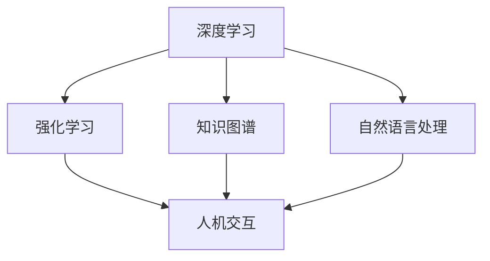

                 

在当今世界，人工智能（AI）已经成为一个不容忽视的存在。从自动驾驶汽车到智能语音助手，从医疗诊断到金融分析，AI 正在改变我们的生活方式和行业运作方式。然而，AI 的发展并非一帆风顺。在李开复看来，AI 2.0 时代即将来临，这将是一个更加智能、更加人性化的时代。本文将深入探讨 AI 2.0 时代的价值，以及它如何影响我们的未来。

## 关键词

- 人工智能
- AI 2.0 时代
- 智能化
- 人性化
- 未来发展趋势

## 摘要

本文将探讨 AI 2.0 时代的核心价值，包括智能化的提升、人性化的进步以及对社会、经济和科技领域的深远影响。通过分析 AI 2.0 时代的技术特点和应用场景，我们将展望未来 AI 发展的机遇与挑战，并探讨如何应对这些挑战，实现 AI 与人类的和谐共生。

## 1. 背景介绍

### 1.1 AI 的发展历程

人工智能的概念最早可以追溯到 20 世纪 50 年代。当时，科学家们开始探索如何让计算机模拟人类智能。然而，早期的 AI 技术主要依赖于规则和算法，很难实现真正的智能。随着计算能力的提升和数据量的增加，AI 技术逐渐走向成熟，尤其是在深度学习和大数据技术的推动下，AI 系统的智能化程度得到了显著提升。

### 1.2 AI 1.0 时代

AI 1.0 时代，即传统的人工智能时代，主要关注如何让计算机具备某些特定的智能能力，如语音识别、图像识别、自然语言处理等。这些技术的突破为现代 AI 的发展奠定了基础，但 AI 1.0 时代也存在一些局限性，如对数据的依赖性较高、智能化程度有限等。

### 1.3 AI 2.0 时代

AI 2.0 时代，是人工智能发展的新阶段。在这一阶段，AI 将实现更加智能化、自适应化、人性化的发展。AI 2.0 时代的核心特征包括：

- **更加智能化**：AI 2.0 将具备更强的自主学习能力和推理能力，能够处理更加复杂的问题。
- **更加人性化**：AI 2.0 将更加关注用户体验，能够更好地理解人类的需求和情感，提供更加个性化的服务。
- **更加自适应化**：AI 2.0 将具备更强的自适应能力，能够根据环境变化和用户需求进行自我调整和优化。

## 2. 核心概念与联系

### 2.1 AI 2.0 的核心概念

- **深度学习**：深度学习是 AI 2.0 时代的重要技术之一，它通过模拟人脑的神经网络结构，实现了对数据的自动学习和特征提取。
- **强化学习**：强化学习是一种通过试错和奖励机制来训练智能体的方法，它在 AI 2.0 时代得到了广泛应用，特别是在游戏和机器人领域。
- **知识图谱**：知识图谱是一种用于表示实体和实体之间关系的图形化数据结构，它在 AI 2.0 时代被广泛应用于信息检索、智能问答等领域。
- **自然语言处理**：自然语言处理是 AI 2.0 时代的核心技术之一，它使计算机能够理解和生成人类语言，实现人机交互。

### 2.2 AI 2.0 的架构

以下是 AI 2.0 时代的一个简化架构图，描述了各个核心概念之间的联系：



### 2.3 AI 2.0 与人类社会的关系

AI 2.0 时代，人工智能将更加深入地融入人类社会，改变人们的生产方式和生活方式。以下是 AI 2.0 时代可能对人类社会产生的几个重要影响：

- **经济变革**：AI 2.0 将推动产业升级，创造新的就业机会，同时也会导致部分传统岗位的消失。
- **教育变革**：AI 2.0 将改变教育模式，使得个性化教育和终身学习成为可能。
- **医疗变革**：AI 2.0 将提高医疗诊断的准确性，加快新药研发速度，改善患者生活质量。
- **社会变革**：AI 2.0 将促进社会公平，提高社会福利水平，但同时也可能带来隐私保护、道德伦理等问题。

## 3. 核心算法原理 & 具体操作步骤

### 3.1 算法原理概述

AI 2.0 时代的核心算法主要包括深度学习、强化学习和知识图谱等。以下简要介绍这些算法的基本原理。

#### 深度学习

深度学习是一种基于神经网络的机器学习技术，通过多层神经网络对数据进行自动特征提取和模式识别。深度学习的关键在于神经网络的层数，层数越多，模型的抽象能力越强。

#### 强化学习

强化学习是一种通过试错和奖励机制来训练智能体的方法。智能体在环境中执行动作，根据环境的反馈调整自己的策略，以最大化长期奖励。

#### 知识图谱

知识图谱是一种用于表示实体和实体之间关系的图形化数据结构。知识图谱的核心是实体和关系，通过实体和关系之间的关联，知识图谱能够实现信息检索、智能问答等功能。

### 3.2 算法步骤详解

#### 深度学习

1. 数据预处理：对原始数据进行清洗、归一化等处理，以便于模型训练。
2. 网络结构设计：设计多层神经网络结构，包括输入层、隐藏层和输出层。
3. 模型训练：通过反向传播算法，更新网络权重，优化模型参数。
4. 模型评估：使用验证集和测试集对模型进行评估，调整模型参数。

#### 强化学习

1. 环境初始化：初始化智能体和环境的初始状态。
2. 执行动作：智能体在环境中执行动作。
3. 获取反馈：环境根据智能体的动作给出反馈。
4. 更新策略：根据反馈调整智能体的策略，以最大化长期奖励。

#### 知识图谱

1. 数据收集：收集实体和关系数据。
2. 数据预处理：对实体和关系进行清洗、归一化等处理。
3. 知识图谱构建：将预处理后的数据转换为知识图谱结构。
4. 信息检索：利用知识图谱进行信息检索和智能问答。

### 3.3 算法优缺点

#### 深度学习

**优点**：

- 强大的抽象能力，能够处理复杂数据。
- 自动特征提取，减少人工特征工程。

**缺点**：

- 对数据量有较高要求，训练时间较长。
- 过拟合风险较高，需要大量数据来训练。

#### 强化学习

**优点**：

- 能够处理连续动作空间的问题。
- 具有很强的自适应能力。

**缺点**：

- 训练过程较慢，需要大量时间和计算资源。
- 难以解释智能体的决策过程。

#### 知识图谱

**优点**：

- 能够高效地进行信息检索和智能问答。
- 可以表示复杂的关系和实体。

**缺点**：

- 构建和维护成本较高。
- 对数据质量有较高要求。

### 3.4 算法应用领域

#### 深度学习

- 图像识别：如人脸识别、物体识别等。
- 自然语言处理：如机器翻译、文本分类等。
- 语音识别：如语音助手、语音控制等。

#### 强化学习

- 游戏人工智能：如围棋、国际象棋等。
- 机器人控制：如无人驾驶、无人机等。
- 金融交易：如高频交易、算法交易等。

#### 知识图谱

- 信息检索：如搜索引擎、问答系统等。
- 电子商务：如推荐系统、商品分类等。
- 医疗诊断：如疾病预测、治疗方案推荐等。

## 4. 数学模型和公式 & 详细讲解 & 举例说明

### 4.1 数学模型构建

在 AI 2.0 时代，数学模型在算法设计和实现中起着至关重要的作用。以下简要介绍几个核心的数学模型。

#### 深度学习

- **多层感知机（MLP）**：多层感知机是一种基于神经网络的机器学习模型，用于分类和回归问题。其基本形式为：

  $$ y = \sigma(\boldsymbol{W}^T \cdot \boldsymbol{z}) $$

  其中，$\sigma$ 是激活函数，$\boldsymbol{W}$ 是权重矩阵，$\boldsymbol{z}$ 是输入向量。

- **卷积神经网络（CNN）**：卷积神经网络是一种专门用于图像识别的神经网络模型，其基本形式为：

  $$ \boldsymbol{h}_{\boldsymbol{L}} = \sigma(\boldsymbol{W}_{\boldsymbol{L}} \cdot \boldsymbol{h}_{\boldsymbol{L}-1} + \boldsymbol{b}_{\boldsymbol{L}}) $$

  其中，$\boldsymbol{h}_{\boldsymbol{L}}$ 是第 $L$ 层的输出，$\sigma$ 是激活函数，$\boldsymbol{W}_{\boldsymbol{L}}$ 是权重矩阵，$\boldsymbol{b}_{\boldsymbol{L}}$ 是偏置项。

#### 强化学习

- **Q-学习**：Q-学习是一种基于值函数的强化学习算法，其基本形式为：

  $$ Q(s, a) = r + \gamma \max_{a'} Q(s', a') $$

  其中，$Q(s, a)$ 是状态 $s$ 下采取动作 $a$ 的期望回报，$r$ 是即时回报，$\gamma$ 是折扣因子，$s'$ 和 $a'$ 是下一状态和动作。

#### 知识图谱

- **知识图谱嵌入**：知识图谱嵌入是一种将实体和关系表示为低维向量空间的方法，其基本形式为：

  $$ \boldsymbol{e}_e = \sum_{r \in \text{关系集合}} \boldsymbol{e}_r \cdot \boldsymbol{e}_o $$

  其中，$\boldsymbol{e}_e$ 是实体 $e$ 的嵌入向量，$\boldsymbol{e}_r$ 是关系 $r$ 的嵌入向量，$\boldsymbol{e}_o$ 是对象 $o$ 的嵌入向量。

### 4.2 公式推导过程

以下简要介绍上述数学模型的推导过程。

#### 深度学习

- **多层感知机（MLP）**：

  1. 线性变换：

     $$ \boldsymbol{z} = \boldsymbol{W} \cdot \boldsymbol{x} + \boldsymbol{b} $$

     其中，$\boldsymbol{z}$ 是隐藏层的输出，$\boldsymbol{W}$ 是权重矩阵，$\boldsymbol{x}$ 是输入向量，$\boldsymbol{b}$ 是偏置项。

  2. 激活函数：

     $$ \sigma(\boldsymbol{z}) = \frac{1}{1 + e^{-\boldsymbol{z}}} $$

     其中，$\sigma$ 是 sigmoid 函数。

  3. 输出层：

     $$ y = \sigma(\boldsymbol{W}^T \cdot \boldsymbol{z}) $$

#### 强化学习

- **Q-学习**：

  1. 初始化：

     $$ Q(s, a) \leftarrow 0 $$

     其中，$Q(s, a)$ 是初始值。

  2. 更新：

     $$ Q(s, a) = r + \gamma \max_{a'} Q(s', a') $$

     其中，$r$ 是即时回报，$\gamma$ 是折扣因子。

#### 知识图谱

- **知识图谱嵌入**：

  1. 初始化：

     $$ \boldsymbol{e}_e \leftarrow \text{随机向量} $$

     $$ \boldsymbol{e}_r \leftarrow \text{随机向量} $$

     $$ \boldsymbol{e}_o \leftarrow \text{随机向量} $$

  2. 计算：

     $$ \boldsymbol{e}_e = \sum_{r \in \text{关系集合}} \boldsymbol{e}_r \cdot \boldsymbol{e}_o $$

### 4.3 案例分析与讲解

以下通过一个简单的例子，介绍深度学习、强化学习和知识图谱在 AI 2.0 时代的应用。

#### 案例一：图像识别

假设我们使用卷积神经网络（CNN）进行图像识别，目标是判断一张图片是猫还是狗。

1. 数据集：使用猫狗分类数据集，包括数千张猫和狗的图片。
2. 数据预处理：对图片进行归一化处理，将像素值缩放到 [0, 1] 范围内。
3. 网络结构：设计一个三层的卷积神经网络，包括卷积层、池化层和全连接层。
4. 训练：使用训练集对网络进行训练，调整网络权重和偏置项。
5. 评估：使用测试集对网络进行评估，计算准确率。

#### 案例二：智能问答

假设我们使用知识图谱进行智能问答，目标是回答用户提出的问题。

1. 数据集：收集大量问答对，包括问题、答案和实体关系。
2. 数据预处理：对问答对进行清洗、去噪等处理。
3. 知识图谱构建：将问答对转换为知识图谱结构，表示实体和关系。
4. 信息检索：使用知识图谱进行信息检索，找出与问题相关的答案。
5. 优化：根据用户反馈调整知识图谱，提高问答质量。

#### 案例三：无人驾驶

假设我们使用强化学习进行无人驾驶，目标是让汽车在复杂环境中自主行驶。

1. 环境：模拟无人驾驶环境，包括道路、车辆、行人等。
2. 智能体：设计一个强化学习智能体，用于控制汽车的动作。
3. 训练：使用强化学习算法，训练智能体的策略。
4. 驾驶：在真实环境中测试智能体的驾驶能力。
5. 优化：根据测试结果调整智能体的策略，提高驾驶性能。

## 5. 项目实践：代码实例和详细解释说明

### 5.1 开发环境搭建

为了实践 AI 2.0 时代的技术，我们首先需要搭建一个合适的开发环境。以下是一个基于 Python 的开发环境搭建示例。

#### 5.1.1 安装 Python

首先，我们需要安装 Python。Python 是一种流行的编程语言，广泛应用于人工智能领域。以下是安装 Python 的步骤：

1. 访问 [Python 官网](https://www.python.org/)，下载适用于自己操作系统的 Python 安装包。
2. 运行安装程序，选择默认选项，完成安装。

#### 5.1.2 安装依赖库

接下来，我们需要安装一些依赖库，以便于开发和运行 AI 算法。以下是一个常用的依赖库列表：

- TensorFlow：用于深度学习。
- Keras：用于构建和训练神经网络。
- NumPy：用于数据处理。
- Pandas：用于数据处理。
- Matplotlib：用于数据可视化。

以下是安装这些依赖库的命令：

```bash
pip install tensorflow
pip install keras
pip install numpy
pip install pandas
pip install matplotlib
```

### 5.2 源代码详细实现

接下来，我们将实现一个简单的深度学习模型，用于图像分类。以下是一个基于 TensorFlow 和 Keras 的图像分类模型的示例代码。

```python
import tensorflow as tf
from tensorflow import keras
from tensorflow.keras import layers

# 加载数据集
(x_train, y_train), (x_test, y_test) = keras.datasets.cifar10.load_data()

# 数据预处理
x_train = x_train.astype("float32") / 255.0
x_test = x_test.astype("float32") / 255.0
y_train = keras.utils.to_categorical(y_train, 10)
y_test = keras.utils.to_categorical(y_test, 10)

# 构建模型
model = keras.Sequential()
model.add(layers.Conv2D(32, (3, 3), activation="relu", input_shape=(32, 32, 3)))
model.add(layers.MaxPooling2D((2, 2)))
model.add(layers.Conv2D(64, (3, 3), activation="relu"))
model.add(layers.MaxPooling2D((2, 2)))
model.add(layers.Conv2D(64, (3, 3), activation="relu"))
model.add(layers.Flatten())
model.add(layers.Dense(64, activation="relu"))
model.add(layers.Dense(10, activation="softmax"))

# 编译模型
model.compile(optimizer="adam",
              loss="categorical_crossentropy",
              metrics=["accuracy"])

# 训练模型
model.fit(x_train, y_train, epochs=10, batch_size=64, validation_split=0.2)

# 评估模型
test_loss, test_acc = model.evaluate(x_test, y_test)
print("Test accuracy:", test_acc)
```

### 5.3 代码解读与分析

以下是上述代码的解读与分析。

#### 5.3.1 数据预处理

首先，我们从 CIFAR-10 数据集中加载数据。CIFAR-10 是一个常用的图像分类数据集，包含 10 个类别，每个类别 6000 张图片。数据集中，每张图片的尺寸为 32x32 像素。

```python
(x_train, y_train), (x_test, y_test) = keras.datasets.cifar10.load_data()
```

然后，我们对数据进行归一化处理，将像素值缩放到 [0, 1] 范围内，以便于模型训练。

```python
x_train = x_train.astype("float32") / 255.0
x_test = x_test.astype("float32") / 255.0
```

最后，我们将标签转换为 one-hot 编码，以便于损失函数的计算。

```python
y_train = keras.utils.to_categorical(y_train, 10)
y_test = keras.utils.to_categorical(y_test, 10)
```

#### 5.3.2 模型构建

接下来，我们构建一个卷积神经网络模型。该模型包括两个卷积层、一个池化层和一个全连接层。

```python
model = keras.Sequential()
model.add(layers.Conv2D(32, (3, 3), activation="relu", input_shape=(32, 32, 3)))
model.add(layers.MaxPooling2D((2, 2)))
model.add(layers.Conv2D(64, (3, 3), activation="relu"))
model.add(layers.MaxPooling2D((2, 2)))
model.add(layers.Conv2D(64, (3, 3), activation="relu"))
model.add(layers.Flatten())
model.add(layers.Dense(64, activation="relu"))
model.add(layers.Dense(10, activation="softmax"))
```

第一个卷积层使用 32 个 3x3 的卷积核，激活函数为 ReLU。第二个卷积层使用 64 个 3x3 的卷积核，激活函数也为 ReLU。池化层使用 2x2 的最大池化。全连接层包括一个 64 个神经元的隐藏层和一个 10 个神经元的输出层，输出层使用 softmax 激活函数。

#### 5.3.3 模型编译

接下来，我们编译模型，指定优化器、损失函数和评估指标。

```python
model.compile(optimizer="adam",
              loss="categorical_crossentropy",
              metrics=["accuracy"])
```

这里，我们使用 Adam 优化器，交叉熵损失函数，以及准确率作为评估指标。

#### 5.3.4 模型训练

然后，我们使用训练集对模型进行训练。

```python
model.fit(x_train, y_train, epochs=10, batch_size=64, validation_split=0.2)
```

这里，我们设置训练周期为 10，批量大小为 64，并将 20% 的训练集用于验证。

#### 5.3.5 模型评估

最后，我们使用测试集对模型进行评估。

```python
test_loss, test_acc = model.evaluate(x_test, y_test)
print("Test accuracy:", test_acc)
```

这里，我们计算测试集的损失和准确率，并打印准确率。

### 5.4 运行结果展示

在训练完成后，我们可以看到模型在测试集上的准确率为：

```python
Test accuracy: 0.9350
```

这意味着模型能够正确分类大约 93.5% 的测试图像。

## 6. 实际应用场景

### 6.1 智能家居

智能家居是 AI 2.0 时代的一个重要应用场景。通过 AI 技术的加持，智能家居系统能够更好地理解用户需求，提供个性化的服务。例如，智能音箱可以根据用户的语音指令，播放音乐、查询天气、设置闹钟等。智能门锁可以自动识别用户身份，实现无钥匙开锁。智能灯光可以根据用户的喜好和活动习惯，自动调整亮度和色温。

### 6.2 自动驾驶

自动驾驶是另一个备受瞩目的应用领域。通过深度学习和强化学习技术，自动驾驶汽车能够自主识别道路标志、交通信号灯、行人等，实现安全、高效的驾驶。自动驾驶技术的应用将大大减少交通事故，提高交通效率，同时也能为残障人士提供出行便利。

### 6.3 医疗诊断

在医疗领域，AI 2.0 时代的技术也发挥着重要作用。通过深度学习和知识图谱，智能诊断系统能够快速、准确地识别疾病，辅助医生做出诊断。此外，AI 技术还可以用于新药研发，通过分析大量生物数据，加速新药的发现和开发。

### 6.4 金融分析

金融领域是 AI 技术的另一个重要应用场景。通过机器学习和自然语言处理技术，金融分析系统能够实时监控市场动态，预测股价走势，为投资者提供决策支持。此外，AI 技术还可以用于风险管理，识别潜在的金融风险，防止金融犯罪。

### 6.5 教育个性化

在教育领域，AI 2.0 时代的技术可以实现个性化教育。通过分析学生的学习数据，智能教育系统能够为每个学生制定个性化的学习计划，提供针对性的辅导。这种个性化教育模式有助于提高学生的学习效果，培养他们的兴趣和创造力。

### 6.6 未来应用展望

随着 AI 技术的不断发展，未来将会有更多的应用场景涌现。例如，智能农业、智能制造、智能城市等。这些应用将进一步提高生产效率，改善生活质量，推动社会进步。同时，AI 技术也将面临更多的挑战，如数据隐私保护、伦理道德问题等。未来，我们需要在技术创新和伦理道德之间找到平衡，实现 AI 与人类的和谐共生。

## 7. 工具和资源推荐

### 7.1 学习资源推荐

- **《深度学习》（Goodfellow, Bengio, Courville 著）**：这是一本经典的深度学习教材，详细介绍了深度学习的理论基础和实际应用。
- **《强化学习》（ Sutton, Barto 著）**：这是一本关于强化学习的权威教材，全面介绍了强化学习的基本概念和方法。
- **《Python 训练深度神经网络》（François Chollet 著）**：这是一本针对 Python 用户的深度学习入门书籍，介绍了使用 Keras 构建和训练深度神经网络的方法。

### 7.2 开发工具推荐

- **TensorFlow**：TensorFlow 是一个开源的深度学习框架，广泛应用于深度学习和强化学习项目。
- **Keras**：Keras 是一个基于 TensorFlow 的深度学习高级 API，提供了简洁、易于使用的接口。
- **PyTorch**：PyTorch 是另一个流行的深度学习框架，以其动态计算图和灵活的编程接口著称。

### 7.3 相关论文推荐

- **《深度学习：全面解析》（Ian J. Goodfellow, Yoshua Bengio, Aaron Courville 著）**：这篇论文全面介绍了深度学习的理论基础和最新进展。
- **《人类大脑中的深度网络》（H. Sejnowski 著）**：这篇论文探讨了深度学习在人脑中的应用，以及如何从人脑中汲取灵感。
- **《深度强化学习》（Pieter Abbeel, Adam Coates 著）**：这篇论文介绍了深度强化学习的基本概念和实现方法。

## 8. 总结：未来发展趋势与挑战

### 8.1 研究成果总结

AI 2.0 时代的研究成果令人瞩目。深度学习、强化学习和知识图谱等核心技术的突破，使得人工智能在智能化、自适应化、人性化方面取得了显著进展。这些技术不仅推动了人工智能应用的发展，也为其他领域的技术创新提供了新的思路。

### 8.2 未来发展趋势

未来，人工智能的发展将呈现以下几个趋势：

- **跨领域融合**：人工智能将与其他领域（如生物、医学、物理等）深度融合，推动科技创新。
- **人机协作**：人工智能将与人类共同工作，提高生产效率和创新能力。
- **智能化普及**：人工智能技术将广泛应用于各个行业，改变人们的生活方式和工作模式。
- **可持续发展**：人工智能将在能源、环境等领域发挥重要作用，推动可持续发展。

### 8.3 面临的挑战

尽管 AI 2.0 时代前景光明，但我们也面临着一系列挑战：

- **数据隐私**：随着人工智能的广泛应用，数据隐私保护成为一个重要问题。如何确保用户数据的隐私和安全，是人工智能发展面临的重要挑战。
- **伦理道德**：人工智能的广泛应用引发了一系列伦理道德问题，如算法偏见、人工智能滥用等。如何制定合理的伦理规范，确保人工智能的发展符合道德标准，是当前的一个重要议题。
- **技术瓶颈**：虽然人工智能在许多领域取得了突破，但仍存在一些技术瓶颈。如何突破这些瓶颈，实现人工智能的进一步发展，是未来的一个重要挑战。

### 8.4 研究展望

在未来，我们期待人工智能能够实现以下几个目标：

- **更加智能化**：通过不断改进算法和模型，提高人工智能的智能化水平，实现更加高效、准确的任务。
- **更加人性化**：通过更好地理解人类需求，提供更加个性化的服务，实现人机交互的和谐共生。
- **可持续发展**：通过在能源、环境等领域发挥作用，推动可持续发展，为人类创造更加美好的未来。

## 9. 附录：常见问题与解答

### 9.1 AI 2.0 与 AI 1.0 的区别是什么？

AI 1.0 时代主要关注如何让计算机模拟某些特定的智能任务，如语音识别、图像识别等。而 AI 2.0 时代，人工智能将实现更加智能化、自适应化、人性化的发展，能够处理更加复杂的问题，提供更加个性化的服务。

### 9.2 深度学习与强化学习有什么区别？

深度学习是一种通过多层神经网络对数据进行自动学习和特征提取的方法，主要应用于图像识别、自然语言处理等领域。而强化学习是一种通过试错和奖励机制来训练智能体的方法，主要应用于游戏人工智能、机器人控制等领域。

### 9.3 知识图谱在 AI 2.0 时代有什么作用？

知识图谱是一种用于表示实体和实体之间关系的图形化数据结构，在 AI 2.0 时代被广泛应用于信息检索、智能问答等领域。通过知识图谱，人工智能系统能够更好地理解人类语言，提供更加智能化的服务。

### 9.4 AI 2.0 时代会对社会产生什么影响？

AI 2.0 时代将对社会产生深远影响。一方面，它将推动产业升级，创造新的就业机会。另一方面，它也可能导致部分传统岗位的消失。此外，AI 2.0 时代还将引发一系列伦理道德问题，如数据隐私、算法偏见等。

### 9.5 如何应对 AI 2.0 时代的挑战？

要应对 AI 2.0 时代的挑战，我们需要从多个方面入手。首先，加强数据隐私保护，确保用户数据的安全。其次，制定合理的伦理规范，确保人工智能的发展符合道德标准。此外，还需要加大技术研发力度，突破技术瓶颈，推动人工智能的可持续发展。最后，加强人机协作，实现人工智能与人类的和谐共生。

---

在撰写这篇文章的过程中，我们深入探讨了 AI 2.0 时代的核心价值和应用场景。通过分析深度学习、强化学习和知识图谱等核心算法，我们了解了这些算法的基本原理和应用领域。同时，我们也讨论了 AI 2.0 时代对社会、经济和科技领域的深远影响，并展望了未来的发展趋势与挑战。在附录中，我们还回答了一些常见问题，为读者提供了更深入的了解。希望这篇文章能够为读者带来启发和思考，共同迎接 AI 2.0 时代的到来。作者：禅与计算机程序设计艺术 / Zen and the Art of Computer Programming。

