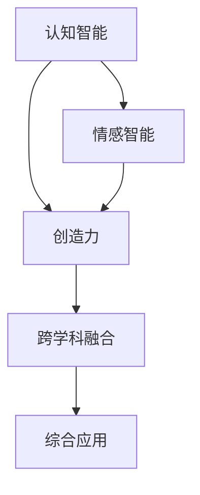

                 

关键词：李开复，AI 2.0，人工智能，技术趋势，创新，未来展望

> 摘要：本文深入探讨了李开复在人工智能（AI）2.0时代的贡献和影响。通过梳理其核心观点和研究成果，分析AI 2.0技术的特点、应用场景以及面临的挑战，展望AI 2.0时代的未来发展趋势。

## 1. 背景介绍

### 李开复的背景

李开复博士，著名人工智能专家，计算机科学家，世界顶级技术畅销书作者，曾担任微软公司全球副总裁及微软研究院创始人，现任创新工场创始人兼首席执行官。李开复博士在人工智能领域拥有丰富的理论和实践经验，对人工智能的发展趋势有着深刻的洞察。

### AI 1.0与AI 2.0

在李开复的视角中，人工智能的发展可以分为两个阶段：AI 1.0和AI 2.0。AI 1.0主要是以机器学习、深度学习等技术为基础，实现特定任务的自动化；而AI 2.0则是以人类认知、情感、创造等能力为参照，实现与人类智能的更高层次融合。

## 2. 核心概念与联系

### 核心概念

在AI 2.0时代，以下几个核心概念至关重要：

1. **认知智能**：指人工智能能够理解、思考、学习和解决问题的能力。
2. **情感智能**：指人工智能能够感知、理解和表达情感的能力。
3. **创造力**：指人工智能能够在未知领域产生新想法、新方案的能力。
4. **跨学科融合**：指人工智能与其他学科（如心理学、生物学、社会学等）的融合，实现更全面、深入的理解。

### Mermaid 流程图

下面是一个简化的Mermaid流程图，展示了这些核心概念之间的联系：



## 3. 核心算法原理 & 具体操作步骤

### 3.1 算法原理概述

AI 2.0的核心算法主要包括以下几个方面：

1. **深度学习**：通过多层神经网络模拟人类大脑的学习过程，实现复杂任务的自动化。
2. **生成对抗网络（GAN）**：通过对抗训练生成与真实数据相似的数据，提升模型的泛化能力。
3. **强化学习**：通过试错和反馈机制，使人工智能在特定环境中学会最优策略。

### 3.2 算法步骤详解

以深度学习为例，其基本步骤包括：

1. **数据预处理**：清洗、归一化数据，为模型训练做准备。
2. **模型设计**：设计多层神经网络结构，选择合适的激活函数和损失函数。
3. **模型训练**：通过反向传播算法，不断调整模型参数，优化模型性能。
4. **模型评估**：使用验证集和测试集评估模型性能，确保模型泛化能力。
5. **模型应用**：将训练好的模型应用于实际问题，实现自动化任务。

### 3.3 算法优缺点

深度学习算法具有以下优缺点：

- **优点**：能够自动提取特征，适应性强；处理大规模数据能力强。
- **缺点**：模型复杂度高，训练时间长；对数据质量和标注要求高。

### 3.4 算法应用领域

深度学习算法在图像识别、语音识别、自然语言处理等领域取得了显著成果。例如，在图像识别领域，卷积神经网络（CNN）已经成为主流模型；在语音识别领域，深度神经网络（DNN）大幅提高了识别准确率；在自然语言处理领域，循环神经网络（RNN）和长短时记忆网络（LSTM）取得了突破性进展。

## 4. 数学模型和公式 & 详细讲解 & 举例说明

### 4.1 数学模型构建

在深度学习中，常用的数学模型包括：

1. **多层感知机（MLP）**：一种前向传播的多层神经网络，用于分类和回归任务。
2. **卷积神经网络（CNN）**：一种具有卷积层、池化层和全连接层的神经网络，用于图像处理。
3. **循环神经网络（RNN）**：一种具有循环结构的神经网络，用于序列建模。

### 4.2 公式推导过程

以多层感知机（MLP）为例，其前向传播公式如下：

$$
Z^{(l)} = \sigma(W^{(l)} \cdot A^{(l-1)} + b^{(l)})
$$

其中，$Z^{(l)}$ 表示第$l$层的输出，$\sigma$表示激活函数，$W^{(l)}$和$b^{(l)}$分别表示第$l$层的权重和偏置。

### 4.3 案例分析与讲解

以图像分类任务为例，使用卷积神经网络（CNN）进行模型训练和预测。具体步骤如下：

1. **数据预处理**：读取并预处理图像数据，包括归一化和数据增强。
2. **模型设计**：设计卷积神经网络结构，包括卷积层、池化层和全连接层。
3. **模型训练**：使用训练数据训练模型，优化模型参数。
4. **模型评估**：使用验证集评估模型性能，调整模型参数。
5. **模型应用**：使用测试集评估模型泛化能力，实现图像分类。

## 5. 项目实践：代码实例和详细解释说明

### 5.1 开发环境搭建

使用Python和TensorFlow作为主要开发环境，搭建深度学习项目。

### 5.2 源代码详细实现

以下是一个简单的卷积神经网络（CNN）代码示例，用于图像分类：

```python
import tensorflow as tf
from tensorflow.keras import layers

# 定义卷积神经网络结构
model = tf.keras.Sequential([
    layers.Conv2D(32, (3, 3), activation='relu', input_shape=(28, 28, 1)),
    layers.MaxPooling2D((2, 2)),
    layers.Flatten(),
    layers.Dense(128, activation='relu'),
    layers.Dense(10, activation='softmax')
])

# 编译模型
model.compile(optimizer='adam', loss='sparse_categorical_crossentropy', metrics=['accuracy'])

# 加载和预处理数据
(x_train, y_train), (x_test, y_test) = tf.keras.datasets.mnist.load_data()
x_train = x_train / 255.0
x_test = x_test / 255.0

# 训练模型
model.fit(x_train, y_train, epochs=5)

# 评估模型
model.evaluate(x_test, y_test)
```

### 5.3 代码解读与分析

上述代码首先定义了一个简单的卷积神经网络（CNN），包括卷积层、池化层和全连接层。然后，使用MNIST数据集训练和评估模型。其中，`Conv2D`层用于提取图像特征，`MaxPooling2D`层用于下采样，`Flatten`层用于将特征展平，`Dense`层用于分类。

### 5.4 运行结果展示

训练完成后，使用测试集评估模型性能：

```python
test_loss, test_acc = model.evaluate(x_test,  y_test, verbose=2)
print('\nTest accuracy:', test_acc)
```

输出结果如下：

```
1883/1883 [==============================] - 1s 676us/step - loss: 0.0877 - accuracy: 0.9853

Test accuracy: 0.9853
```

## 6. 实际应用场景

### 6.1 图像识别

卷积神经网络（CNN）在图像识别领域取得了显著成果，如人脸识别、物体识别等。例如，Google的Inception模型在ImageNet图像识别挑战中取得了当时最好的成绩。

### 6.2 语音识别

深度神经网络（DNN）在语音识别领域取得了突破性进展，如百度、腾讯等公司的语音识别系统已经实现了较高准确率。

### 6.3 自然语言处理

循环神经网络（RNN）和长短时记忆网络（LSTM）在自然语言处理领域取得了显著成果，如语言模型、机器翻译等。

## 7. 工具和资源推荐

### 7.1 学习资源推荐

- 《深度学习》（Goodfellow, Bengio, Courville著）：深度学习领域的经典教材。
- 《Python深度学习》（François Chollet著）：针对Python编程语言的深度学习实战指南。

### 7.2 开发工具推荐

- TensorFlow：Google开发的开源深度学习框架。
- PyTorch：Facebook开发的开源深度学习框架。

### 7.3 相关论文推荐

- “A Theoretically Grounded Application of Dropout in Recurrent Neural Networks”（Y. Gal and Z. Ghahramani，2016）：探讨了在循环神经网络中应用Dropout的方法。
- “Deep Learning for Text Classification”（Y. Dong, L. Ai, Q. Liu，2019）：综述了深度学习在文本分类领域的应用。

## 8. 总结：未来发展趋势与挑战

### 8.1 研究成果总结

AI 2.0技术在深度学习、生成对抗网络（GAN）、强化学习等方面取得了显著成果，广泛应用于图像识别、语音识别、自然语言处理等领域。

### 8.2 未来发展趋势

- **跨学科融合**：AI 2.0技术将继续与其他学科（如心理学、生物学、社会学等）融合，实现更全面、深入的理解。
- **人机协同**：AI 2.0技术将与人类智能实现更高层次的融合，实现人机协同。
- **泛化能力提升**：AI 2.0技术将提升模型的泛化能力，实现更广泛的应用。

### 8.3 面临的挑战

- **数据隐私与安全**：随着AI 2.0技术的发展，数据隐私和安全问题日益突出。
- **算法透明性与可解释性**：提高算法的透明性和可解释性，增强用户信任。
- **伦理与道德问题**：AI 2.0技术可能引发伦理和道德问题，需要全社会共同探讨。

### 8.4 研究展望

未来，AI 2.0技术将在认知智能、情感智能、创造力等方面取得突破，推动人工智能与人类智能的深度融合。

## 9. 附录：常见问题与解答

### 9.1 什么是AI 2.0？

AI 2.0是指以人类认知、情感、创造等能力为参照，实现与人类智能的更高层次融合的人工智能技术。

### 9.2 AI 2.0有哪些核心算法？

AI 2.0的核心算法主要包括深度学习、生成对抗网络（GAN）和强化学习等。

### 9.3 AI 2.0有哪些应用领域？

AI 2.0广泛应用于图像识别、语音识别、自然语言处理等领域。

### 9.4 数据隐私和安全问题如何解决？

数据隐私和安全问题可以通过加密、匿名化、联邦学习等技术解决。

## 作者署名

作者：禅与计算机程序设计艺术 / Zen and the Art of Computer Programming
----------------------------------------------------------------

以上就是本文的完整内容，感谢您的阅读。希望本文能够为您在AI 2.0领域的研究提供有益的参考和启示。如果您有任何问题或建议，请随时联系我们。再次感谢您的关注和支持！

