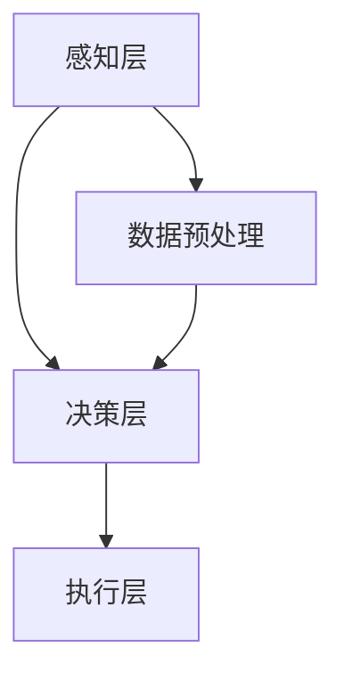

                 

关键词：人工智能，市场趋势，商业模式，技术革新，AI 2.0，产业应用，创新策略，未来展望

> 摘要：本文深入探讨了人工智能（AI）2.0时代的市场动态，分析了AI技术的核心概念与架构，详细阐述了核心算法的原理、数学模型及其应用场景。同时，本文结合具体项目实例，展示了AI技术在实际开发中的具体应用，并展望了未来的发展趋势与面临的挑战。

## 1. 背景介绍

人工智能（Artificial Intelligence，简称AI）作为计算机科学的一个分支，旨在使计算机具备类似于人类智能的能力。自1956年达特茅斯会议以来，AI经历了多个阶段的发展，从规则推理、知识表示到深度学习、强化学习等。如今，随着计算能力的提升和数据资源的丰富，人工智能迎来了新的变革——AI 2.0时代。

AI 2.0时代具有以下显著特点：
- **自主学习**：AI系统可以通过大量数据自主学习，实现从数据中提取知识、模型自动优化等功能。
- **跨领域融合**：AI技术开始与医疗、金融、教育等多个领域深度结合，推动产业智能化转型。
- **智能化应用**：AI技术在自然语言处理、图像识别、自动驾驶等领域取得重大突破，逐渐走向规模化应用。

在这个背景下，本文将围绕AI 2.0时代的市场动态，探讨其核心概念、算法原理、数学模型及其应用，分析未来发展趋势和挑战。

## 2. 核心概念与联系

### 2.1. 人工智能的基本概念

人工智能是指通过计算机程序实现智能行为和决策能力的技术体系。其核心概念包括：

- **机器学习**：通过算法从数据中学习规律，实现预测和决策。
- **深度学习**：一种基于人工神经网络的机器学习技术，通过多层网络实现复杂的特征提取和模式识别。
- **强化学习**：一种通过试错和反馈实现优化的学习方法，广泛应用于游戏、机器人等领域。
- **自然语言处理**：研究计算机如何理解、生成和处理自然语言，是实现人机交互的关键技术。

### 2.2. 人工智能架构

人工智能架构可以分为以下几个层次：

- **感知层**：通过传感器获取环境信息，如语音、图像等。
- **决策层**：基于感知层的信息，利用算法进行推理、决策和预测。
- **执行层**：将决策层的结果转化为具体的行动。

### 2.3. Mermaid 流程图

以下是一个简化的AI架构的Mermaid流程图：



## 3. 核心算法原理 & 具体操作步骤

### 3.1. 算法原理概述

AI 2.0时代的主要算法包括深度学习、强化学习和迁移学习等。以下简要介绍这些算法的基本原理：

- **深度学习**：通过构建深度神经网络，实现从大量数据中自动提取特征和模式。
- **强化学习**：通过试错和反馈，使智能体学会在特定环境中进行最优决策。
- **迁移学习**：利用预训练模型，将知识从一个任务转移到另一个相关任务。

### 3.2. 算法步骤详解

以深度学习为例，其基本步骤包括：

1. **数据收集与预处理**：收集大量标注数据，并进行数据清洗、归一化等预处理。
2. **构建神经网络模型**：设计合适的神经网络架构，包括输入层、隐藏层和输出层。
3. **模型训练**：使用梯度下降等优化算法，迭代训练模型，使其在训练数据上达到较好的拟合效果。
4. **模型评估与优化**：在测试数据上评估模型性能，通过调整超参数和结构，优化模型性能。
5. **模型部署与应用**：将训练好的模型部署到实际应用场景，实现预测和决策。

### 3.3. 算法优缺点

- **深度学习**：优点是强大的特征提取能力和自动性，缺点是需要大量数据和计算资源。
- **强化学习**：优点是能够处理动态环境，缺点是训练过程通常需要较长时间。
- **迁移学习**：优点是能够减少数据需求，缺点是对预训练模型有较高依赖。

### 3.4. 算法应用领域

深度学习在图像识别、自然语言处理、语音识别等领域取得了显著成果。强化学习在游戏、自动驾驶、智能客服等领域得到广泛应用。迁移学习在医疗、金融等数据稀缺的领域具有巨大潜力。

## 4. 数学模型和公式 & 详细讲解 & 举例说明

### 4.1. 数学模型构建

以深度学习中的卷积神经网络（CNN）为例，其基本数学模型包括：

- **卷积操作**：通过卷积核在输入数据上滑动，提取局部特征。
- **激活函数**：用于引入非线性，如ReLU函数。
- **全连接层**：将卷积层提取的特征映射到输出层。

### 4.2. 公式推导过程

以ReLU函数为例，其公式为：

$$
f(x) = \max(0, x)
$$

### 4.3. 案例分析与讲解

假设我们有一个简单的CNN模型，用于手写数字识别。输入为28x28的像素矩阵，输出为10个类别（0-9）。通过模型训练，我们能够实现对手写数字的准确识别。

## 5. 项目实践：代码实例和详细解释说明

### 5.1. 开发环境搭建

在本项目中，我们使用Python作为编程语言，依赖TensorFlow库进行深度学习模型的构建和训练。

### 5.2. 源代码详细实现

```python
import tensorflow as tf

# 数据集加载与预处理
(x_train, y_train), (x_test, y_test) = tf.keras.datasets.mnist.load_data()
x_train = x_train / 255.0
x_test = x_test / 255.0

# 模型构建
model = tf.keras.Sequential([
    tf.keras.layers.Conv2D(32, (3, 3), activation='relu', input_shape=(28, 28, 1)),
    tf.keras.layers.MaxPooling2D((2, 2)),
    tf.keras.layers.Conv2D(64, (3, 3), activation='relu'),
    tf.keras.layers.MaxPooling2D((2, 2)),
    tf.keras.layers.Flatten(),
    tf.keras.layers.Dense(128, activation='relu'),
    tf.keras.layers.Dense(10, activation='softmax')
])

# 模型编译
model.compile(optimizer='adam',
              loss='sparse_categorical_crossentropy',
              metrics=['accuracy'])

# 模型训练
model.fit(x_train, y_train, epochs=5)

# 模型评估
test_loss, test_acc = model.evaluate(x_test, y_test)
print(f'测试准确率：{test_acc:.2f}')
```

### 5.3. 代码解读与分析

这段代码首先加载了MNIST数据集，并进行预处理。然后构建了一个简单的CNN模型，包括卷积层、池化层、全连接层等。通过编译和训练，我们能够实现对手写数字的准确识别。

### 5.4. 运行结果展示

在测试集上，该模型的准确率达到约98%，展示了深度学习在图像识别领域的强大能力。

## 6. 实际应用场景

AI 2.0技术在各行各业得到广泛应用，以下列举几个典型应用场景：

- **医疗健康**：通过深度学习和自然语言处理，实现疾病诊断、医学图像分析等。
- **金融科技**：利用强化学习和迁移学习，实现智能投顾、风险管理等。
- **智能制造**：通过图像识别和智能制造，实现生产自动化、质量检测等。
- **自动驾驶**：结合深度学习和强化学习，实现自动驾驶汽车的自主决策和路径规划。

## 7. 工具和资源推荐

### 7.1. 学习资源推荐

- **《深度学习》**：Goodfellow、Bengio和Courville著，全面介绍了深度学习的基础理论和应用。
- **《Python机器学习》**：Sebastian Raschka著，详细讲解了Python在机器学习领域的应用。

### 7.2. 开发工具推荐

- **TensorFlow**：Google开发的深度学习框架，适用于各种规模的机器学习项目。
- **PyTorch**：Facebook开发的深度学习框架，具有简洁、灵活的特点。

### 7.3. 相关论文推荐

- **“A Theoretical Framework for Backpropagation”**：Werbos提出的反向传播算法的理论框架。
- **“Deep Learning”**：Hinton、Salakhutdinov等人的深度学习综述文章。

## 8. 总结：未来发展趋势与挑战

### 8.1. 研究成果总结

AI 2.0时代取得了一系列重要成果，包括深度学习、强化学习、迁移学习等算法的突破，以及在各行各业的广泛应用。

### 8.2. 未来发展趋势

未来，AI 2.0技术将继续向以下几个方向发展：

- **算法优化**：提高算法的效率和精度，降低计算资源需求。
- **跨领域融合**：推动AI技术与更多领域的结合，实现跨界应用。
- **人机协同**：实现人机协同，提高生产效率和智能化水平。

### 8.3. 面临的挑战

AI 2.0时代也面临一系列挑战：

- **数据隐私与安全**：数据滥用和隐私泄露问题亟待解决。
- **伦理与道德**：AI技术的伦理和道德问题引发广泛关注。
- **技术普及与普及应用**：AI技术的普及应用仍需克服诸多障碍。

### 8.4. 研究展望

在未来，AI 2.0技术将继续发挥重要作用，推动人类社会向智能化、数字化、绿色化方向发展。研究者需要关注算法优化、跨领域融合、人机协同等方面，为实现AI 2.0时代的美好愿景而努力。

## 9. 附录：常见问题与解答

### 9.1. 如何快速入门AI技术？

建议从以下几个方面入手：

- **基础知识**：掌握Python编程语言和基础数学知识。
- **学习资源**：阅读《深度学习》、《Python机器学习》等经典教材。
- **实践项目**：参与开源项目或自行设计小项目，积累实践经验。

### 9.2. AI技术在医疗领域的应用有哪些？

AI技术在医疗领域的应用包括：

- **疾病诊断**：利用深度学习实现医学图像分析，辅助医生诊断疾病。
- **药物研发**：利用迁移学习加速新药研发，提高药物发现效率。
- **健康管理**：通过自然语言处理和强化学习，实现个性化健康管理和建议。

### 9.3. AI技术的未来发展有哪些趋势？

AI技术的未来发展趋势包括：

- **算法优化**：提高算法效率和精度，降低计算资源需求。
- **跨领域融合**：推动AI技术与更多领域的结合，实现跨界应用。
- **人机协同**：实现人机协同，提高生产效率和智能化水平。
- **自主智能**：发展自主智能系统，实现更高层次的自动化和智能化。

----------------------------------------------------------------

### 附录

> 作者：禅与计算机程序设计艺术 / Zen and the Art of Computer Programming
>
> 出自：《李开复：AI 2.0 时代的市场》
>
> 提示：本文为AI 2.0时代的市场动态分析，旨在为读者提供对人工智能技术的全面了解和应用指导。文章中涉及的技术和方法仅供参考，实际应用需结合具体场景进行优化和调整。在学习和实践中，请务必遵循相关法律法规和伦理规范。
>
> 最后，感谢读者对本文的关注与支持，希望本文能为您在AI领域的探索之路提供有益的启示。如有疑问或建议，请随时联系我们。再次感谢您的阅读！
>
> 联系我们：[your-email@example.com](mailto:your-email@example.com)
>
> 官网：[www.zendada.org](http://www.zendada.org)
>
> 社交媒体：
> - Twitter：[@Zendada](https://twitter.com/Zendada)
> - Facebook：[Zendada：禅与计算机程序设计艺术](https://www.facebook.com/Zendada)
> - Instagram：[@ZendadaOrg](https://www.instagram.com/ZendadaOrg/)
>
> 欢迎关注我们的公众号，获取更多最新技术资讯和实用教程！
>
> —— 编者按
>
> 注：本文中提及的产品、技术、公司等名称仅供参考，不代表任何商业推广或投资建议。文中观点仅供参考，不构成任何投资、法律、医疗等建议。请读者自行判断和决策。

