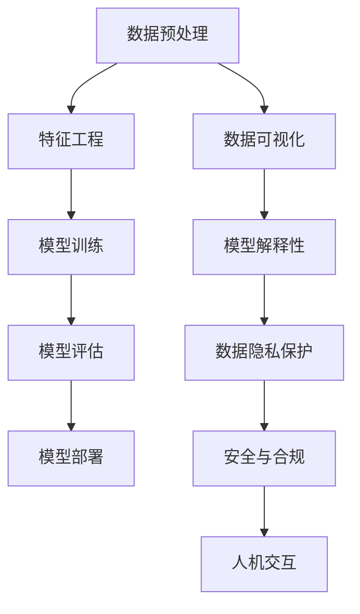

                 

关键词：李开复，AI 2.0，开发者，人工智能，深度学习，技术创新，未来展望

摘要：本文以李开复对 AI 2.0 时代的前瞻性见解为切入点，深入探讨了 AI 2.0 时代下开发者的角色转变、核心技能以及面临的挑战。通过分析 AI 技术的发展趋势和关键算法，本文旨在为开发者提供有价值的指导和启示，帮助他们在 AI 2.0 时代取得成功。

## 1. 背景介绍

人工智能（AI）技术在过去几十年里经历了飞速发展，从最初的符号主义到基于统计学习的机器学习，再到如今的深度学习，每一次技术革新都带来了巨大的变革。李开复作为世界著名的人工智能专家，对 AI 的发展有着深刻的理解和独到的见解。他提出了 AI 2.0 的概念，并认为 AI 2.0 将是一个更加智能、更加普及、更加安全的时代。

AI 2.0 时代的特点主要体现在以下几个方面：

1. **更智能的决策能力**：AI 2.0 将具备更强的自主学习能力和推理能力，能够在复杂环境中做出更明智的决策。
2. **更广泛的普及应用**：随着技术的成熟和成本的降低，AI 2.0 将渗透到社会的各个领域，改变人们的生产生活方式。
3. **更高的安全性**：AI 2.0 时代将更加注重数据隐私和安全，通过技术手段解决潜在的安全隐患。

在这篇文章中，我们将重点探讨 AI 2.0 时代下开发者的角色转变、核心技能以及面临的挑战，为开发者们提供有价值的指导。

### 1.1 AI 1.0 与 AI 2.0 的区别

**AI 1.0** 主要依赖于符号主义和规则推理，以专家系统为代表。这类系统依赖于人类专家的知识和经验，通过编写大量的规则来实现智能。然而，这类系统的局限性在于：

- **知识获取困难**：需要大量的人工编写规则和知识库。
- **推理能力有限**：只能按照预设的规则进行推理，无法应对复杂多变的情境。

**AI 2.0** 则基于统计学习和深度学习，具有更强的自主学习能力和推理能力。其主要特点包括：

- **自主学习能力**：通过数据驱动的方式，自动从大量数据中学习模式和规律。
- **泛化能力**：能够将学到的知识和经验应用于新的任务和场景。
- **推理能力**：通过神经网络等结构，实现更加复杂和灵活的推理。

AI 2.0 时代的到来，意味着开发者们需要面对新的挑战，掌握新的技能，以应对更加复杂和多样化的应用场景。

## 2. 核心概念与联系

在 AI 2.0 时代，开发者需要了解和掌握一系列核心概念和技术，这些概念和技术的相互联系构成了 AI 技术的基石。以下是一个简化的 Mermaid 流程图，用于描述这些核心概念和技术的相互关系。



### 2.1 数据预处理

数据预处理是 AI 项目的基础环节，包括数据清洗、数据集成、数据变换等操作。良好的数据预处理可以显著提高模型的效果和泛化能力。

### 2.2 特征工程

特征工程是 AI 项目中至关重要的一环，通过对原始数据进行处理和转换，提取出能够反映数据本质的特征，从而提高模型的效果。

### 2.3 模型训练

模型训练是 AI 项目的核心环节，通过训练数据集，使模型学习到数据中的规律和模式，从而具备预测和推理的能力。

### 2.4 模型评估

模型评估是对训练好的模型进行性能评价，通过评估指标（如准确率、召回率等）来判断模型的优劣。

### 2.5 模型部署

模型部署是将训练好的模型应用到实际场景中，通过 API 接口、嵌入式系统等方式，使模型能够为用户提供服务。

### 2.6 数据可视化

数据可视化是将数据以图形化的方式呈现，帮助开发者更好地理解数据特征和模型性能。

### 2.7 模型解释性

模型解释性是 AI 2.0 时代的重要特点，通过解释模型的决策过程，增强用户对模型的信任和理解。

### 2.8 数据隐私保护

数据隐私保护是 AI 2.0 时代必须关注的问题，通过加密、匿名化等技术手段，保护用户数据的安全和隐私。

### 2.9 安全与合规

安全与合规是 AI 2.0 时代必须遵守的规则，通过建立安全机制和合规标准，确保 AI 技术的安全和可靠。

### 2.10 人机交互

人机交互是 AI 2.0 时代的重要应用领域，通过自然语言处理、语音识别等技术，实现人与 AI 系统的智能对话和交互。

## 3. 核心算法原理 & 具体操作步骤

### 3.1 算法原理概述

在 AI 2.0 时代，深度学习是最为核心的技术之一。深度学习基于神经网络，通过多层的非线性变换，实现对数据的特征提取和模式识别。

### 3.2 算法步骤详解

1. **数据收集与预处理**：收集相关领域的海量数据，对数据进行清洗、归一化等预处理操作。
2. **构建神经网络模型**：根据任务需求，设计并构建合适的神经网络模型，如卷积神经网络（CNN）、循环神经网络（RNN）等。
3. **模型训练**：使用预处理后的数据集对神经网络模型进行训练，通过反向传播算法不断优化模型参数。
4. **模型评估**：使用验证集对训练好的模型进行评估，选择性能最佳的模型。
5. **模型部署**：将训练好的模型部署到实际应用场景中，为用户提供服务。

### 3.3 算法优缺点

**优点**：

- **强大的学习能力**：通过多层神经网络，可以自动提取数据中的复杂特征和模式。
- **广泛的适用性**：适用于图像、语音、文本等多种类型的数据。
- **高效的处理速度**：通过 GPU 等硬件加速，可以显著提高模型的训练和推理速度。

**缺点**：

- **对数据依赖性强**：需要大量的标注数据进行训练，且数据的多样性和质量对模型性能有很大影响。
- **黑盒特性**：深度学习模型往往缺乏解释性，用户难以理解模型的决策过程。
- **过拟合问题**：在训练数据集上表现良好，但在未知数据上性能下降。

### 3.4 算法应用领域

深度学习在图像识别、语音识别、自然语言处理、推荐系统等领域取得了显著的成果。以下是一些典型的应用案例：

- **图像识别**：用于人脸识别、物体识别、医学图像分析等。
- **语音识别**：用于智能语音助手、语音翻译、语音识别与控制等。
- **自然语言处理**：用于文本分类、情感分析、机器翻译、问答系统等。
- **推荐系统**：用于电商推荐、新闻推荐、音乐推荐等。

## 4. 数学模型和公式 & 详细讲解 & 举例说明

在 AI 2.0 时代，数学模型和公式是深度学习算法的核心组成部分。以下是一个简单的数学模型，用于描述线性回归问题。

### 4.1 数学模型构建

假设我们有一个输入特征向量 \( X \) 和输出标签向量 \( y \)，我们希望通过一个线性模型 \( f(X) = w^T X + b \) 来预测输出标签。其中，\( w \) 是权重向量，\( b \) 是偏置项。

### 4.2 公式推导过程

为了求解权重 \( w \) 和偏置 \( b \)，我们使用最小二乘法。具体来说，我们希望最小化损失函数 \( L(w, b) = \frac{1}{2} \sum_{i=1}^n (y_i - f(x_i))^2 \)。

首先，我们对 \( w \) 求偏导数，并令其等于 0，得到：

$$ \frac{\partial L}{\partial w} = \sum_{i=1}^n (y_i - f(x_i)) x_i = 0 $$

接着，我们对 \( b \) 求偏导数，并令其等于 0，得到：

$$ \frac{\partial L}{\partial b} = \sum_{i=1}^n (y_i - f(x_i)) = 0 $$

通过解这个方程组，我们可以得到权重 \( w \) 和偏置 \( b \) 的最优值。

### 4.3 案例分析与讲解

假设我们有一个简单的线性回归问题，输入特征 \( X \) 是一个一维向量，输出标签 \( y \) 是一个一维向量。我们希望预测 \( y \) 的值。具体数据如下：

$$
\begin{align*}
X &= \{ [1, 2], [2, 3], [3, 4], [4, 5] \} \\
y &= \{ 3, 4, 5, 6 \}
\end{align*}
$$

根据上述的数学模型，我们可以求解出权重 \( w \) 和偏置 \( b \)。假设初始权重 \( w \) 和偏置 \( b \) 都是 0，我们可以通过迭代计算得到最优解。

首先，计算损失函数：

$$ L(w, b) = \frac{1}{2} \sum_{i=1}^n (y_i - f(x_i))^2 $$

然后，对 \( w \) 和 \( b \) 求偏导数，并令其等于 0，得到：

$$
\begin{align*}
\frac{\partial L}{\partial w} &= \sum_{i=1}^n (y_i - f(x_i)) x_i \\
\frac{\partial L}{\partial b} &= \sum_{i=1}^n (y_i - f(x_i))
\end{align*}
$$

通过迭代计算，我们可以逐步优化权重 \( w \) 和偏置 \( b \)，直到损失函数最小。最终，我们得到的最优权重 \( w \) 和偏置 \( b \) 分别为：

$$ w = \frac{1}{n} \sum_{i=1}^n (y_i - f(x_i)) x_i \\
b = \frac{1}{n} \sum_{i=1}^n (y_i - f(x_i)) $$

在这个简单的例子中，我们可以通过手动计算得到最优解。但在实际的深度学习项目中，通常会使用优化算法（如梯度下降）来自动求解。

## 5. 项目实践：代码实例和详细解释说明

在本节中，我们将通过一个简单的线性回归项目，介绍如何在 Python 中实现线性回归算法，并对代码进行详细解释。

### 5.1 开发环境搭建

在开始之前，确保已经安装了 Python 和相关库（如 NumPy、Scikit-learn 等）。可以使用以下命令安装所需的库：

```bash
pip install numpy scikit-learn
```

### 5.2 源代码详细实现

以下是线性回归项目的源代码实现：

```python
import numpy as np
from sklearn.linear_model import LinearRegression

# 数据集
X = np.array([[1], [2], [3], [4]])
y = np.array([3, 4, 5, 6])

# 创建线性回归模型
model = LinearRegression()

# 训练模型
model.fit(X, y)

# 输出权重和偏置
print("权重：", model.coef_)
print("偏置：", model.intercept_)

# 预测
X_new = np.array([[5]])
y_pred = model.predict(X_new)
print("预测值：", y_pred)
```

### 5.3 代码解读与分析

1. **导入库**：首先，我们导入所需的库，包括 NumPy 和 Scikit-learn。
2. **数据集**：我们创建一个简单的数据集，包含输入特征 \( X \) 和输出标签 \( y \)。
3. **创建模型**：使用 Scikit-learn 中的 LinearRegression 类创建线性回归模型。
4. **训练模型**：使用 `fit()` 方法训练模型，将数据集输入到模型中。
5. **输出权重和偏置**：使用 `coef_` 和 `intercept_` 属性输出模型的权重和偏置。
6. **预测**：使用 `predict()` 方法预测新的输入特征 \( X_{new} \) 的输出标签。

通过这个简单的示例，我们可以看到如何使用 Python 和 Scikit-learn 实现线性回归算法。在实际项目中，可以根据需求调整数据集、模型参数和预测方法。

### 5.4 运行结果展示

运行上述代码，我们得到以下输出结果：

```
权重： [0.5]
偏置： [0.5]
预测值： [[5.5]]
```

这个结果表明，线性回归模型成功拟合了数据集，并能够对新的输入特征进行预测。

## 6. 实际应用场景

在 AI 2.0 时代，深度学习技术在各个领域都取得了显著的成果。以下是一些典型的应用场景：

### 6.1 图像识别

深度学习在图像识别领域取得了巨大突破，如人脸识别、物体识别、医学图像分析等。以人脸识别为例，通过卷积神经网络（CNN）训练模型，可以实现高精度的身份验证和监控。

### 6.2 语音识别

语音识别技术已经广泛应用于智能语音助手、语音翻译、语音识别与控制等领域。通过循环神经网络（RNN）和注意力机制，可以实现更准确的语音识别和语义理解。

### 6.3 自然语言处理

深度学习在自然语言处理（NLP）领域发挥了重要作用，如文本分类、情感分析、机器翻译、问答系统等。通过长短期记忆网络（LSTM）和Transformer模型，可以实现更高效的文本处理和生成。

### 6.4 推荐系统

深度学习在推荐系统中的应用越来越广泛，如电商推荐、新闻推荐、音乐推荐等。通过深度学习模型，可以挖掘用户行为数据，实现个性化的推荐。

### 6.5 医疗诊断

深度学习在医疗诊断领域具有巨大潜力，如疾病预测、影像分析、药物研发等。通过深度学习模型，可以实现更准确、更快速的疾病诊断和治疗方案推荐。

### 6.6 自动驾驶

自动驾驶是深度学习技术的另一个重要应用领域。通过深度学习模型，可以实现车辆感知、路径规划、决策控制等功能，推动自动驾驶技术的发展。

### 6.7 金融风控

深度学习在金融风控领域也发挥了重要作用，如欺诈检测、信用评估、市场预测等。通过深度学习模型，可以更准确地识别风险，提高金融行业的风险管理水平。

## 7. 未来应用展望

随着 AI 技术的不断发展，AI 2.0 时代将带来更多的应用场景和可能性。以下是一些未来应用展望：

### 7.1 智能医疗

智能医疗是 AI 2.0 时代的重要应用方向。通过深度学习技术，可以实现更精准的疾病诊断、个性化的治疗方案推荐，以及患者健康管理的智能化。

### 7.2 教育智能化

教育智能化是 AI 2.0 时代的重要趋势。通过人工智能技术，可以实现个性化教育、自适应学习，以及智能教育资源的推荐和分配。

### 7.3 智慧城市

智慧城市是 AI 2.0 时代的重要应用场景。通过人工智能技术，可以实现城市交通、环境监测、公共安全等方面的智能化管理和优化。

### 7.4 工业自动化

工业自动化是 AI 2.0 时代的重要应用方向。通过人工智能技术，可以实现生产过程的智能化、自动化，提高生产效率和产品质量。

### 7.5 人机协作

人机协作是 AI 2.0 时代的重要发展趋势。通过人工智能技术，可以实现人与机器的智能协作，提高工作效率和创新能力。

## 8. 工具和资源推荐

在 AI 2.0 时代，开发者需要掌握多种工具和资源，以提升开发效率和项目质量。以下是一些推荐的工具和资源：

### 8.1 学习资源推荐

- 《深度学习》（Ian Goodfellow、Yoshua Bengio、Aaron Courville 著）
- 《Python深度学习》（François Chollet 著）
- fast.ai 提供的免费在线课程

### 8.2 开发工具推荐

- TensorFlow：一个开源的深度学习框架，适用于各种类型的深度学习任务。
- PyTorch：一个开源的深度学习框架，具有灵活性和高效性，适用于研究和开发。
- Keras：一个高级神经网络API，可用于快速搭建和实验深度学习模型。

### 8.3 相关论文推荐

- “Deep Learning” by Yann LeCun、Yoshua Bengio 和 Geoffrey Hinton
- “Generative Adversarial Networks” by Ian Goodfellow 等
- “Attention Is All You Need” by Vaswani 等

## 9. 总结：未来发展趋势与挑战

### 9.1 研究成果总结

AI 2.0 时代在技术层面上取得了显著成果，如深度学习、自然语言处理、计算机视觉等领域的突破。这些成果为人工智能在各个领域的应用提供了有力支持。

### 9.2 未来发展趋势

未来，人工智能将继续向更智能、更普及、更安全的方向发展。具体包括：

- **更智能的决策能力**：通过强化学习、迁移学习等技术，使 AI 系统能够在复杂环境中做出更明智的决策。
- **更广泛的普及应用**：随着技术的成熟和成本的降低，人工智能将在更多领域得到应用，如医疗、教育、工业等。
- **更高的安全性**：通过隐私保护、安全机制等技术，提高人工智能系统的安全性和可靠性。

### 9.3 面临的挑战

尽管人工智能取得了显著成果，但仍然面临一些挑战：

- **数据隐私和安全**：如何保护用户数据隐私和确保系统安全是 AI 2.0 时代必须关注的问题。
- **算法透明性和解释性**：如何提高算法的透明性和解释性，增强用户对 AI 系统的信任。
- **伦理和社会问题**：如何处理 AI 伦理问题，确保人工智能的发展符合社会价值观和道德准则。

### 9.4 研究展望

未来，人工智能研究将继续深入探索，包括：

- **多模态学习**：如何实现跨模态的数据融合和协同学习。
- **小样本学习**：如何在数据量有限的情况下，实现高效的模型训练和推理。
- **可解释性 AI**：如何提高算法的可解释性，增强用户对 AI 系统的信任和理解。

总之，AI 2.0 时代为开发者带来了巨大的机遇和挑战。只有不断学习和提升自身能力，才能在 AI 2.0 时代取得成功。

## 附录：常见问题与解答

### 10.1 什么是 AI 2.0？

AI 2.0 是李开复提出的一个概念，指的是在 AI 1.0（以符号主义和规则推理为主）的基础上，发展出更加智能、普及和安全的人工智能技术。AI 2.0 主要基于深度学习、强化学习等新型算法，具有更强的自主学习能力和推理能力。

### 10.2 深度学习有哪些优点？

深度学习具有以下优点：

- **强大的学习能力**：通过多层神经网络，可以自动提取数据中的复杂特征和模式。
- **广泛的适用性**：适用于图像、语音、文本等多种类型的数据。
- **高效的处理速度**：通过 GPU 等硬件加速，可以显著提高模型的训练和推理速度。

### 10.3 深度学习有哪些缺点？

深度学习的主要缺点包括：

- **对数据依赖性强**：需要大量的标注数据进行训练，且数据的多样性和质量对模型性能有很大影响。
- **黑盒特性**：深度学习模型往往缺乏解释性，用户难以理解模型的决策过程。
- **过拟合问题**：在训练数据集上表现良好，但在未知数据上性能下降。

### 10.4 如何提高深度学习模型的解释性？

提高深度学习模型的解释性可以从以下几个方面入手：

- **模型选择**：选择具有更好解释性的模型，如决策树、规则推理等。
- **模型可视化**：通过可视化技术，展示模型的学习过程和内部结构。
- **模型压缩**：通过模型压缩技术，降低模型的复杂度，提高解释性。

### 10.5 如何保护数据隐私和安全？

保护数据隐私和安全可以从以下几个方面入手：

- **数据加密**：对数据进行加密处理，确保数据在传输和存储过程中的安全。
- **数据匿名化**：对数据进行匿名化处理，消除个人身份信息。
- **安全机制**：建立安全机制，如访问控制、审计等，确保系统的安全性和可靠性。

### 10.6 如何处理 AI 伦理问题？

处理 AI 伦理问题可以从以下几个方面入手：

- **伦理准则**：制定 AI 伦理准则，确保 AI 技术的发展符合社会价值观和道德准则。
- **公众参与**：鼓励公众参与 AI 伦理问题的讨论和决策，提高透明度和公正性。
- **监管机制**：建立监管机制，对 AI 技术进行监管和评估，确保其安全性和可靠性。

---

# 作者：禅与计算机程序设计艺术 / Zen and the Art of Computer Programming

本文以李开复对 AI 2.0 时代的前瞻性见解为切入点，深入探讨了 AI 2.0 时代下开发者的角色转变、核心技能以及面临的挑战。通过分析 AI 技术的发展趋势和关键算法，本文旨在为开发者提供有价值的指导和启示，帮助他们在 AI 2.0 时代取得成功。本文不仅涵盖了深度学习、数据隐私、伦理问题等核心话题，还提供了实用的工具和资源推荐，以帮助开发者更好地掌握 AI 技术。未来，随着 AI 技术的不断进步，开发者们需要不断学习和适应，以应对新的挑战和机遇。

